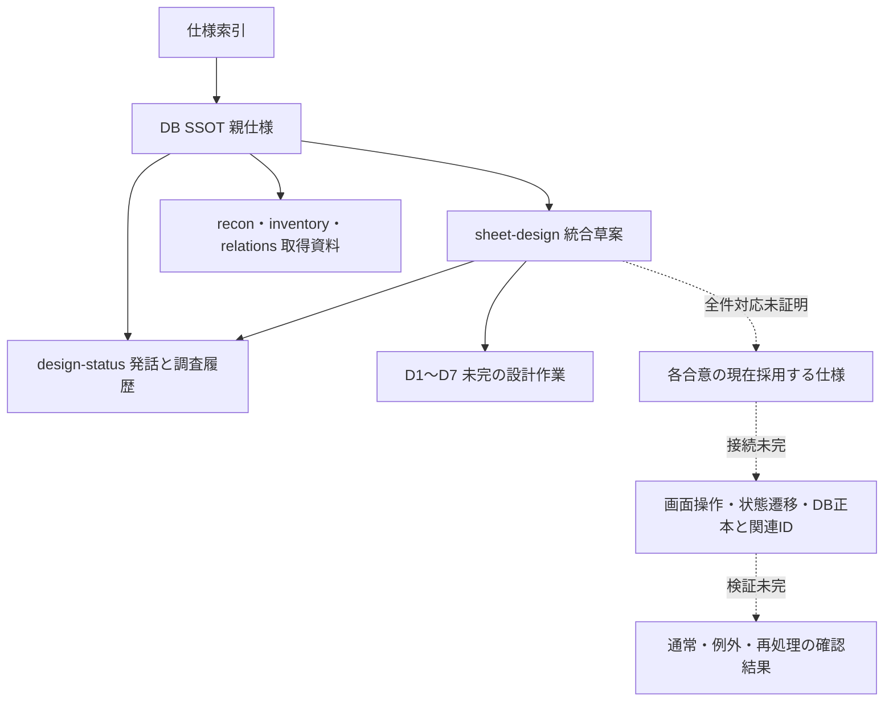
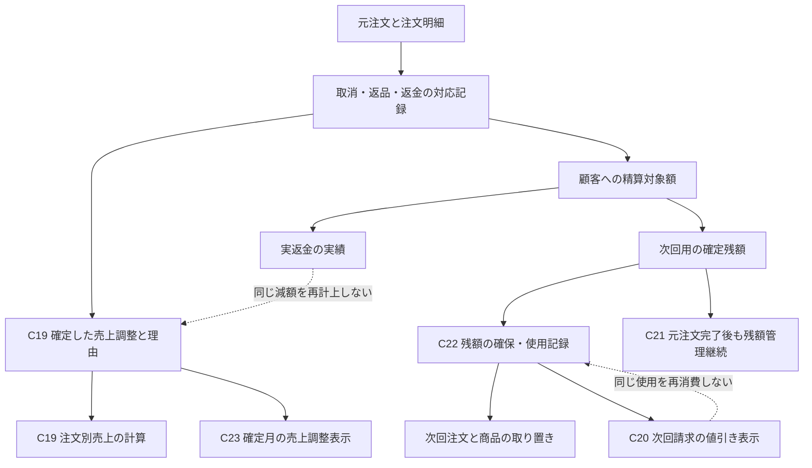
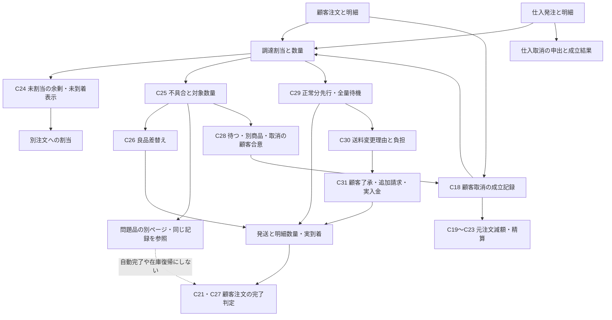
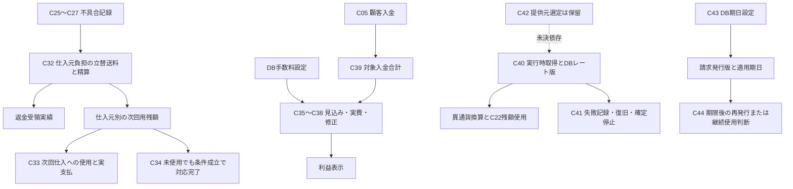
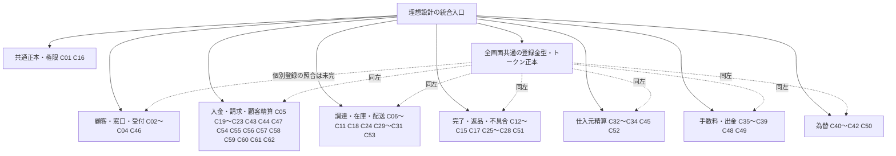
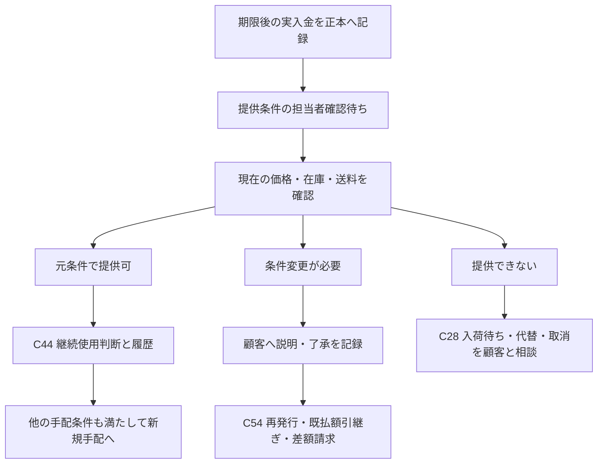
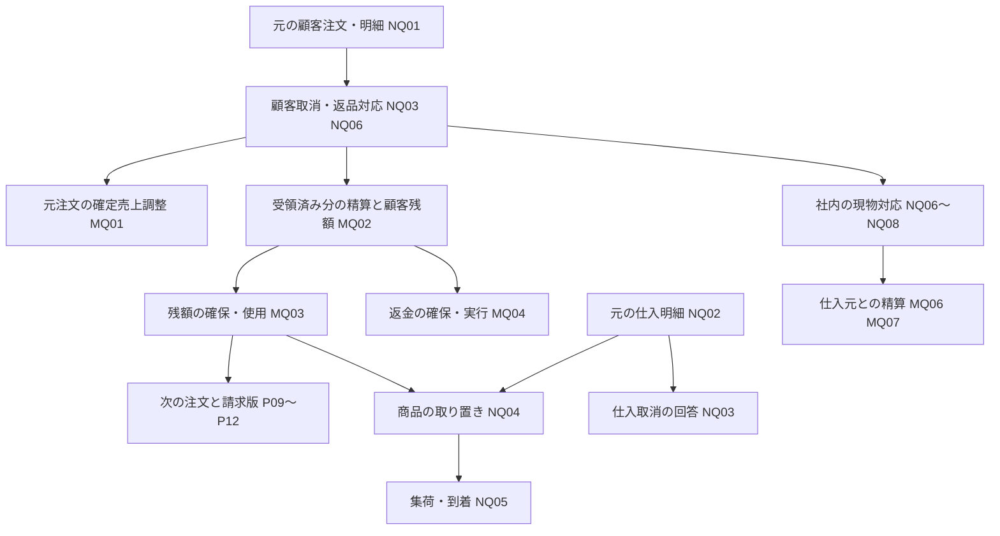

# スプレッドシートのDB設計見本：完成へ向けた整理

親: [DB設計のSSOT化](../../specs/db-ssot/README.md)
合意・調査の履歴: [design-status.md](design-status.md)

更新: 2026-09-16。本文は現在の統合草案。PO発話原文と途中案は上記履歴に保存し、本文の要約をPOの逐語発言として扱わない。
現行タブ一覧: [inventory.md](inventory.md)

再起動後の入口: [resume.md](resume.md)。受注OK後の取消は現行業務ではないが、DB設計に余地を残すとのPO回答を受領。2026-09-12に一部の商品・数量の取消も合意。差引後の請求書は顧客向けと確認済み。仕入は余剰を自社在庫にする継続案を基本とし、可能な場合は仕入取消も選べる。

## 優先する成果物と完成条件

PO回答原文:

> 設計見本を完成させることを優先する

目的は、スプレッドシートで「どのデータを、どこに1回だけ保存し、何のIDでつなぐか」を確認できる見本を完成させること。Sales Anchor実DBの変更・既存データ移行・本番確認は後工程として保留する。実DBに接続できないことを見本の整理全体の停止理由にしない。アプリの物理テーブル名を先に固定せず、シートの業務上の意味とPO合意を正とする。

完成条件案: (1)対象項目の意味・正本・関連ID・入力/更新時点が全行に記載、(2)同じ事実の独立更新先0、(3)全ID参照が架空サンプルで接続、(4)合意済みの通常取引・リピート・別担当者・分割発送・トラブル・複数ロールを例で確認、(5)見本の範囲の業務未決事項0、(6)シート上の値/式/表示を確認済み。現時点では未完成。文書チェック合格を見本完成と混同しない。

## 取得済みシートの読み取り根拠

共有URLのXLSX出力を再取得: HTTP 200、3,523,819 bytes、SHA256 `34e6ae6b1a820487b34bb23e5a5d46779109fec4664e240fb8455da10aaa75f1`。134タブ・数式43,838セル。初回取得ファイルとはハッシュが異なるため、同一スナップショットとは扱わない。本節の列照合は再取得分による。データの全値一致や式の正しさを再検証した結果ではない。

原本は閲覧のみ。clasp経由の取得・GASの実行・スプレッドシート編集は未実施。認証情報の値を見本や本文へ転載しない。完成版のサンプルは実在者を使わず架空のIDと値で作る方針。

## 保存先と関連の差分案

列名は新しい物理DB実装の承認ではない。既存タブを優先して整理し、不足する事実の記録だけを追加候補とする。

| 対象 | シートの現在の根拠 | 見本での正本・つなぎ方の案 | 状態 |
|---|---|---|---|
| 顧客側の人 | リード管理!A1=lead_id、C1=customer_name、P1=email、Q1=phone | 1人1リードID。営業対象外の経理等も含め、営業対象区分で集計を分ける。会社の別人を本人情報へ上書きしない | 業務合意済み、区分列の追加が必要 |
| 会社 | 顧客マスタ!A1=顧客ID、B1=源流リードID | 会社IDと顧客IDは同義。人と注文をこのIDへ紐づける。店舗/支店で会社を増やさない | 業務合意済み |
| フォームの発行 | フォームトークン!A1:D1=トークン/リードID/発行日/使用日 | 発行元のリードを維持。担当者が別人でも発行元を置換しない。秘密値をサンプルへコピーしない | 発行元は合意済み |
| フォーム受付・確認 | 上記4列は発行/使用の項目。受付内容と確認者の記録はこのタブ見出しでは不足 | 確認待ち→担当確認→既存会社参照または新会社登録。確認者・日時は受付の正本。新しい人なら本人のリードへ関連付ける | 業務合意済み、見本の行/列が必要 |
| 請求先/配送先 | 支払先マスタ!A1:B1、配送先マスタ!A1:B1に各IDとcustomer_id | 同じ会社の複数住所をIDで持つ。同じ住所を請求/配送双方で使う場合は同一正本を用途で参照する案 | 統合方法は設計案 |
| 会社番号・税番号 | 顧客税務番号!B1:D1=顧客ID/番号種別ID/番号。配送先!O1と支払先!N1にもtax_id | 会社＋番号種別の記録を正本とし住所/フォームから参照する方向。違う用途の番号かを確認せず値を統合しない | 用途照合が必要 |
| 注文 | オーダー管理!A1=order_id、C1=customer_id、F1=source_lead_id | 注文は会社IDの子。リピートでは注文IDだけ増やす。source_lead_idが取引を開始した人の参照であることを明記 | 業務合意済み |
| 注文明細 | オーダー明細!A1:B1、H1:I1=quantity/unit_price、J1=subtotal | 数量と単価を保存し、行金額は計算。商品IDの参照と商品名の独立コピーの意味を整理する | 金額/商品対応を詰める |
| 顧客からの入金 | オーダー管理!T1:U1=payment_confirmed_at/source、AD1=payment_confirmed_by_id | 基本は全額前払い。例外の分割入金に対応し、注文IDに入金記録を複数紐づける。入金ごとの日時・金額を正本に保存し、注文画面の入金合計は計算する | 分割入金・全額入金前の仕入発注ともにPO確認済み |
| 仕入れ | 仕入れ!A1:B1、E1:F1=ordered_at/paid_at | 複数顧客注文のまとめ仕入と、1顧客注文の複数仕入元への分割に対応。仕入明細と注文明細を割当数量でつなぎ、発注情報を顧客注文ごとに複製しない。注文前の在庫仕入も扱う。発注・受注確定・仕入支払は別の事実として保持 | まとめ仕入・分割・在庫保有の可能性はPO確認済み |
| 自社在庫と共用在庫 | 取得済みシートの共用在庫!B1=Quantity、H1=提供者、I1=product_id。自社商品マスタ!A1:B1=自社商品ID/共用商品ID | 共用在庫は提供元のLINE案内から抽出し、自社保有在庫とは正本を分ける。発注送信時から自社在庫管理に登録。共用案内は新案内の未掲載を除外、案内なしなら保持して24時間フィルタで切替。履歴を保持 | 取り置き・発注時登録・直送/拠点経由は確認済み。24時間フィルタは整備中とのPO報告、詳細はD4で照合 |
| 発送と商品 | 発送!A1:B1、発送明細!A1:C1/K1=発送明細ID/発送ID/オーダー明細ID/数量 | 発送1件に複数の注文明細と数量を紐づける。分割発送は発送を複数作り、全商品の到着で注文完了を判定 | 業務合意済み |
| 配送工程 | 発送!E1:F1、Q1:R1=pickup_request/notification | ラベル・集荷依頼・集荷・通知・到着を混同せず、発送IDへ紐づく事実で表現。追跡API自体は後工程 | 工程合意済み、記録列を整える |
| トラブル・返金・返品 | タブ名検索では専用と判断できる記録を未特定。名称だけで不存在と断定しない | 注文→トラブル→返金/返送の予定と実行を関連付ける。解決後も発生履歴を残し、成約は元記録から求める | 返品先・検品・復帰条件は確認済み。列対応はD1、例外処置はP1/P2 |
| 会社別金額・成約数 | リード管理!AO1:AQ1=first_transaction_date/amount/cumulative_transaction_amount | 注文と確定した売上調整を正本として計算（C19/C20/C23）。実返金を同じ減額として二重控除しない。累計値を独立手入力しない。成約件数は金額と区別する | 定義合意済み、通貨/対象範囲は未決 |
| 自社スタッフ | 担当者マスタ!A1=staff_id、K1=staff_role | 顧客側のリードと区別し、テナントに所属するスタッフとして管理。ログイン利用者への関係も定義する | 業務合意済み |
| ロールと許可 | 権限管理!A1=役割名、B1:Y1=各メニュー/ページ | 安定したロールIDを持たせ、ロール×ページの許可を1か所で設定。スタッフの表示フラグへ同じ許可を独立コピーしない | 3段階と複数付与合意済み |
| スタッフへのロール付与 | 担当者マスタ!K1の単一staff_role | スタッフに紐づく利用者ID×ロールIDを1組1行とする割当表で複数保持。チェックボックスはこの割当を参照/更新する | 業務合意済み、見本への追加対象 |

## 現在の業務合意

以下は既存の合意の統合であり、新しい事業判断ではない。設計上の保存方法は次節とD項目で分ける。

| ID | 領域 | 現在の条件 | 発話を保存した根拠 |
|---|---|---|---|
| C01 | SSOT | 同じ事実の保存・独立更新先は1か所。IDで参照し、累計や表示状態は元記録から計算する | design-status.md §3 |
| C02 | 人・会社 | 人に1リードID。営業対象外の連絡担当にもIDを持たせ区分する。会社ID=顧客ID、会社に人と注文を関連付ける。店舗・支店は同じ会社ID | design-status.md §1、§6 |
| C03 | フォーム | リードID必須。別の人が入力しても発行元を上書きしない。全受付を確認待ちにし、担当確認で既存会社へ関連付けるか新規登録。既知の会社は発行前に選ぶ | design-status.md §6 |
| C04 | 取引開始・リピート | 商談で合意したらフォーム送付。独立した商談合意状態は不要。確認済み顧客に請求を発行し、注文を会社へ関連付ける。リピートで新しいリードは作らない | design-status.md §1、§6 |
| C05 | 入金・発注 | 基本は全額前金・全額入金後発注。分割入金と全額入金前発注にも対応。入金、発注、提供元の受注OK、仕入支払を別々に記録 | 履歴「入金」「全額入金前の仕入発注」「分割入金時」 |
| C06 | 仕入の組合せ | 複数顧客注文のまとめ仕入、1顧客注文を複数仕入元へ分割、注文前の在庫仕入に対応。受注不可なら調達先再選択、部分受注なら一部採用＋不足調達/全量再選択（C06-a/b） | 履歴「まとめ仕入」「複数仕入元」「在庫保有」、[再選択合意](design-status.md#2026-09-11-提供元が受注できない場合のpo回答) |
| C07 | 共用在庫 | 提供元のLINE案内から抽出。新しい案内数量はその時点の数で加算しない。新案内で未掲載なら売り切れ扱いで一覧から除外。案内自体がない日は保持。24時間フィルタで表示切替、過去ログ保持 | 履歴「共用在庫の意味」〜「新しい案内自体がない日」 |
| C08 | 自社在庫登録 | 共用案内と分ける。ドロップシッピング発注商品も、発注送信時から自社在庫管理に登録する。手元の実物だけを意味しない | 履歴「ドロップシッピング発注後」「自社在庫登録の時点」 |
| C09 | 自社取り置き | 調達先は共用在庫の提供元・自社在庫から選べる。入金確認と自社在庫の確定で取り置き。一部入金でも可能。基本は全額入金後発注 | 履歴「自社在庫の取り置き」「分割入金時」 |
| C10 | 集荷・取消 | 集荷時に手元保管数を減らす。集荷前の顧客注文キャンセルは取り置きを解除し販売可能へ戻す | 履歴「出庫時点」「集荷前キャンセル」 |
| C11 | 配送 | 提供元→顧客の直送、提供元→自社拠点→顧客の双方。ラベル、集荷依頼、集荷、通知、到着を区別。分割発送は有効な残数量の到着と精算/顧客対応完了で成約。部分取消はC21、問題品の社内対応との区別はC27 | design-status.md §1、§5、履歴「直送」「自社拠点経由」 |
| C12 | 成約・トラブル | 一部返金・一部返品・返金返品なしで解決なら成約に算入。全額返金または全商品返品は除外。対応履歴を保持。売上は元注文への確定減額を反映し、実返金だけを控除する旧説明はC19/C20/C23へ置換。次回残額がある場合の完了はC21 | design-status.md §1、§5および本書C19〜C23の合意根拠 |
| C13 | 返品先 | 直送分を含め、自社拠点で受け取る。顧客から提供元へ直接返品しない | 履歴「直接返品」「返品先」 |
| C14 | 検品・在庫復帰 | 判定待ちから人が検品・更新。再販売可能とトラブル解消がそろった数量だけ自社在庫へ戻す。受取だけでは復帰しない。遅延返品は受取/検品、元対応を再開し追加対応後に再解消（C14-a） | 履歴「自社在庫復帰」「検品待ち」、[遅延返品合意](design-status.md#2026-09-11-遅れて届いた返品についてのpo回答) |
| C15 | 判定内訳・理由 | 同一商品の数量別判定に対応。不可には理由必須。破損して届いた分と返品されなかった分を区別し、不明な理由のまま確定しない | 履歴「数量別判定と理由」 |
| C16 | スタッフ・権限 | テナントごとにスタッフとログインを管理。ページ別に非閲覧/閲覧/編集。リード登録は編集権限がある人。複数ロールをチェックボックスで付与し、許可を合わせる | design-status.md §6「ロール」「チェックボックス」 |
| C17 | 返品の処遇 | 担当者が状態と処遇を選び、理由を自由記述で残す。状態・販売形態を変更して再販でき、Box→Packの数は担当者が実物を数えて入力。売り物にならない場合だけ廃棄する | design-status.md「再販売不可商品の処遇についてのPO回答」 |
| C18 | 顧客取消と仕入 | 顧客10個中2個取消なら顧客請求は8個。仕入10個を継続し余剰2個を自社分にする基本と、仕入元が受け付ける場合の取消を選択可。 | [合意根拠](design-status.md#2026-09-13-顧客向け差引請求書と仕入継続取消の選択) |
| C19 | 売上調整 | 取消・一部返金・一部返品等の確定減額を元注文と理由に結ぶ。同一対応の返品/返金で二重減額しない | [原文と共通適用](design-status.md#2026-09-15-キャンセル返金返品への共通適用) |
| C20 | 次回請求と売上 | 残額使用は請求書で値引き表示。元10,000−2,000=売上8,000、次回商品売上3,000・請求1,000、合計売上11,000。販促値引き一般へ拡張しない | [次回売上合意](design-status.md#2026-09-15-次回注文の売上と請求額の区別への合意) |
| C21 | 残額と注文完了 | 次回用残額を確定記録し、残数量到着と顧客対応等の条件を満たせば元注文を完了/成約1件。未使用残は管理継続 | [完了の合意](design-status.md#2026-09-15-次回用残額があっても元注文を完了する合意) |
| C22 | 残額による取り置き | 調達先確定と前回残額2,000円の使用で次回3,000円の取り置き可。追加1,000円入金前でも可。同じ残額を別注文/返金へ重複使用しない | [取り置きの合意](design-status.md#2026-09-15-前回残額での取り置きと二重使用禁止への合意) |
| C23 | 月別売上 | 減額確定月に調整。8月売上10,000・9月調整−2,000なら合計8,000。元月の再減額や後日返金で再控除しない | [月別の合意](design-status.md#2026-09-15-月別売上は減額確定月に調整を表示する合意) |
| C24 | 未到着の余剰 | 仕入継続の未到着余剰を別顧客へ販売/取り置き可。入金（一部可）と調達確定の条件を維持。 | [合意根拠](design-status.md#2026-09-13-未到着の余剰商品の販売取り置きについてのpo回答) |
| C25 | 全商品の不具合 | 返品品に限らず新品・仕入商品にも不具合登録を適用する。 | [合意根拠](design-status.md#2026-09-15-全商品への不具合登録採用と発送停止後の検討) |
| C26 | 良品差替え | 同条件の良品を確保し担当者が差替え確認後に発送を再開。問題品は別ページで対応し、注文/入金を保持する。 | [合意根拠](design-status.md#2026-09-15-良品差替えによる取引継続と不具合品の別ページ対応の合意) |
| C27 | 顧客完了と社内対応 | 良品到着・支払・顧客対応等の条件成立で注文を完了/成約1件。問題品の社内対応は継続できる。 | [合意根拠](design-status.md#2026-09-15-現物処遇待ちでも顧客注文を完了できる合意) |
| C28 | 良品がない場合 | 顧客と合意して入荷待ち/別商品/該当分取消を選ぶ。相談だけで変更を確定しない。 | [合意根拠](design-status.md#2026-09-15-良品を用意できない場合の顧客合意による三つの選択) |
| C29 | 不具合時の分割 | 顧客確認後、正常分先行発送または全量待機を選択。停止中の数量は発送せず、未解決残がある間は全体完了にしない。 | [合意根拠](design-status.md#2026-09-15-不具合時の正常分先行発送と全量待機を選ぶ合意) |
| C30 | 送料増額の負担 | 自社責任の分割/送料増額は自社負担。購入者希望での変更による増額は購入者負担。混合原因は担当者が原因と負担額を確認して記録する（Q07で解消）。 | [合意根拠](design-status.md#2026-09-15-送料増額の相手負担は購入者を指す確認) |
| C31 | 追加送料と変更手配 | 購入者希望の追加送料は額提示→了承→入金確認→変更手配。請求再発行の共通方針へ接続する。 | [合意根拠](design-status.md#2026-09-15-追加送料の入金確認後に配送変更を手配する合意) |
| C32 | 仕入元送料の精算 | 仕入元負担の立替送料は返金受取または次回仕入割引で精算。顧客側残額とは混ぜない。 | [合意根拠](design-status.md#2026-09-15-送料立替の返金受取または次回仕入割引による精算の合意) |
| C33 | 仕入原価と回収 | 元送料1,000円を次回割引で回収しても、次回商品原価10,000円、実支払9,000円、元送料最終自社負担0円。 | [合意根拠](design-status.md#2026-09-15-次回仕入原価と送料立替回収を分ける合意) |
| C34 | 仕入元対応完了 | 必要な商品対応完了と合意済み次回残額の確定記録で対応完了可。未使用残は管理継続。 | [合意根拠](design-status.md#2026-09-15-次回割引残額確定後の不具合対応完了の合意) |
| C35 | 手数料の見込みと実費 | 対応を確認できた費用だけ見込みから実費へ切替。見込み・変更根拠を保持。 | [合意根拠](design-status.md#2026-09-15-見込み手数料から実費へ切り替える方式への合意) |
| C36 | 出金見込み回数 | Wiseの銀行出金見込みは1回分の一定額×想定回数。200万円2回、300万円3回。固定額は未決。 | [合意根拠](design-status.md#2026-09-15-銀行出金の見込み費用を回数比例の固定額にする指定) |
| C37 | PayPal境界 | 合意済み設計条件は正の対象額5万円未満250円、5万円以上0円。受取/換金費用とは別。 | [合意根拠](design-status.md#2026-09-15-paypal出金手数料の5万円境界への合意) |
| C38 | 手数料手動修正 | 人がフロントから手数料金額を後日修正できる構造。 | [合意根拠](design-status.md#2026-09-15-手数料を画面から手動修正できる構造の指定) |
| C39 | 分割入金と見込み | 同一注文の対象入金合計で見込み回数を計算。Wise同通貨50万円2回で合計100万円は見込み1回。 | [合意根拠](design-status.md#2026-09-15-分割入金の合計で見込み出金回数を計算する合意) |
| C40 | 為替の取得と保存 | 実行時に最新レートを取得しDB保存後に当該版で換算。提供元は未選定。 | [合意根拠](design-status.md#2026-09-15-実行時取得の合意と為替提供元の公式資料確認) |
| C41 | 為替失敗 | 取得失敗は再試行/通知/原因調査。必要なレートがない換算は止め、前日値/仮値/通常手入力で補わない。 | [合意根拠](design-status.md#2026-09-15-為替取得失敗時は復旧し異通貨確定を止める合意) |
| C42 | 為替提供元の保留 | 提供元/取得経路/許諾/料金は選定時にPOへ再相談。 | [合意根拠](design-status.md#2026-09-15-為替提供元の再相談を保留記録し業務確認へ復帰) |
| C43 | 全請求の支払期日 | 通常/再発行ともDBマスタの発行日からの日数で自動設定。設定は画面で変更可能。 | [合意根拠](design-status.md#2026-09-15-全請求書の支払期日を既存dbマスタから自動採用するpo指定) |
| C44 | 期限後の操作 | 期限後は原則無効。担当者の操作は「再発行」と「破棄」の2択のみ（Q03で継続使用を廃止）。再発行は内容が同じでも新しい請求書として発行する。 | [合意根拠](design-status.md#2026-09-15-期限後継続使用の元期日保持と判断履歴の合意) |
| C45 | 仕入取消の精算 | 仕入元に認められた取消分は返金受取/次回仕入差引を選べる。 | [合意根拠](design-status.md#2026-09-14-仕入元からの返金次回仕入への差引についてのpo回答) |
| C46 | 会社の窓口 | 1社複数人に対応。同じ人の同時複数会社窓口は今回は対象外。移籍は未決。 | [合意根拠](design-status.md#2026-09-14-会社と窓口担当者の人数についてのpo回答) |
| C47 | 顧客へ戻す送料 | 担当者が画面で額/理由を確定。未確認と確認済み0円を区別。確定と実返金は別記録。 | [合意根拠](design-status.md#2026-09-15-送料の画面操作と保存方式への明示合意) |
| C48 | 決済費用の負担 | 決済費用は自社負担。受取/出金/換金費用を区別。POの料金説明を実口座の検証結果と扱わない。 | [合意根拠](design-status.md#2026-09-15-決済手数料の自社負担と発生単位の確認) |
| C49 | まとめ出金 | 複数注文の入金をまとめて出金する運用がある。注文別の実費配分方式は未承認。 | [合意根拠](design-status.md#2026-09-15-複数注文のまとめ出金の確認) |
| C50 | 異通貨利用 | 顧客の次回残額を異通貨の注文にも使用可能。取得時点は後続合意C40の実行時。 | [合意根拠](design-status.md#2026-09-15-異通貨の残額使用と日次為替マスタへのpo指定) |
| C51 | 仕入元不具合対応 | 別ページで仕入元への相談/回答/返送/交換/返金を管理。相談や回答だけで実行完了にしない。 | [合意根拠](design-status.md#2026-09-15-不具合品の仕入元対応を別ページで管理する合意) |
| C52 | 仕入元対応の送料 | 返送料/交換品送料ごとに自社/仕入元/分担を選択。未確認を0円や折半にしない。 | [合意根拠](design-status.md#2026-09-15-仕入元対応の送料負担を案件ごとに選ぶ合意) |
| C53 | 期限内支払後の送料上昇 | 同じ変更内容で期限内に支払われた提示額は維持し、手配時上昇分は自社負担。 | [合意根拠](design-status.md#2026-09-15-期限内支払後の送料上昇差額を自社負担とする合意) |
| C54 | 追加請求の標準 | 追加請求は再発行方式に統一。旧版/枝番/既払額/今回支払額/理由/期日を保持。 | [合意根拠](design-status.md#2026-09-15-追加請求時の請求書再発行方式を標準化するpo指定) |
| C55 | 期限後入金と提供判断 | 実入金を記録し、担当者が現在の価格/在庫/送料を確認するまで新規仕入/発送を待つ。元条件継続または顧客了承後の条件変更/再発行、提供不可時の相談を記録。 | [合意根拠](design-status.md#2026-09-16-期限後入金の条件確認と手配待ちへの合意) |
| C56 | 支払期限の判定基準 | 決済・銀行の記録で確認できる実入金日時で判定し、担当者確認日時とは分ける。確認遅れだけで期限後扱いや価格変更をしない。 | [合意根拠](design-status.md#2026-09-16-支払期限は実入金日時で判定する合意) |
| C57 | 入金日の取得方法 | C59の区分に従い、API自動記録対象は通常手入力せず、自動取得しない入金は画面入力。両経路は同じ入金正本へ接続。日付と確認日時を混同しない。 | [PO指定](design-status.md#2026-09-16-入金日の画面入力とapi自動取得のpo指定) |
| C58 | 入金日の優先元 | 同一入金の手入力日とAPI取得日が異なる場合、APIの実入金日を正として採用。担当者の採用判断待ち案は不採用。 | [PO指定](design-status.md#2026-09-16-入金日はapi取得値を優先するpo指定) |
| C59 | 自動/手動の区分と例外保留 | API自動記録対象は通常手入力しない。即時反映できない場合は連携の根拠確認後にルールを再相談。現時点で例外を確定しない。 | [PO指定](design-status.md#2026-09-16-api自動記録と遅延時ルールの再相談) |
| C60 | 期日の時刻境界 | 日本時間で期日の当日終了までを期限内とし、翌日0時から期限後。請求書に基準を明記し、DB設定を共通参照する。 | [合意根拠](design-status.md#2026-09-16-支払期日は日本時間の当日終了までとする合意) |
| C61 | 期日の日数計算 | 土日祝日も含め、発行日にDB設定の日数を加えて期日を求める。休日による自動延長なし。具体の日数はマスタ参照。 | [合意根拠](design-status.md#2026-09-16-支払期日の日数に土日祝日を含める合意) |
| C62 | 期日設定変更の適用 | 新設定は新規発行/再発行から適用。既発行版の期日は変更せず、過去の適用条件を保持。 | [合意根拠](design-status.md#2026-09-16-期日設定変更は新規発行と再発行から適用する合意) |

C18は従来の「C18相当」（顧客取消後の仕入継続/取消）を正式行として統合した。C19〜C23は既存合意の採番であり新しいPO決定ではない。全件採番は未完。

C08/C10の時点は、直前の具体案へのPO回答「進める」を受けて採用した経緯を履歴に保持している。PO発話を「yes」等へ置換していない。

P2の確認済み部分: 「返品されなかった」として対応終了後に遅れて届いた商品も、受取を記録して検品へ進める。元のトラブルを対応中へ戻し、追加対応後に担当者が再び解消済みにする。前回の解消記録を保持（design-status.md「遅れて届いた返品についてのPO回答」、原文「yoi」、再開確認への原文「yes」）。

## 保存先と数量の設計案

物理DB・列名の確定ではなく、見本に展開する正本の責務。詳細項目はD1で詰める。

| 事実 | 正本の候補 | 他の画面が参照するもの |
|---|---|---|
| 会社・人・住所 | それぞれのマスタと所属/用途の関連 | 会社名・連絡先を各取引へ独立コピーしない |
| フォーム受付 | 確認前の入力と、確認実績 | 正式登録後の参照切替は既存草案と整合させる（D1） |
| 請求・注文・注文明細 | 請求事実、注文、商品の数量/単価 | 同じ取引金額の重複所有をD3で解消 |
| 入金・返金・顧客の次回充当・仕入支払 | 各実行記録。予定と実行は別事実。次回充当は元入金/取消と使用先注文へ関連付ける | 入金・返金・充当・未使用残を区別して計算し二重計上しない |
| 外部仕入 | 仕入発注、仕入明細、受注確定 | 自社在庫から発注数量を参照し再入力しない |
| 注文への調達割当 | 注文明細と仕入明細/自社在庫をつなぐ数量内訳 | 発注由来の割当を別の取り置きとして二重加算しない |
| 共用案内 | 提供元ごとの案内履歴・明細・元LINE参照 | 最新一覧と24時間表示は参照条件 |
| 自社在庫管理 | 商品・仕入元の明細への識別参照、入出庫・取り置きの実績 | 発注中、拠点保管中、顧客発送済みを一つの数に混ぜない |
| 配送 | 発送/明細、経路、各工程の実績 | 出庫は発送明細を参照。顧客到着と拠点到着を区別 |
| トラブル・返品 | 対応、返送予定、受取実績、未返送確定 | 未受取分の架空入庫を作らない |
| 検品 | 受取明細ごとの数量内訳、可否、理由、判定者/日時 | 在庫復帰条件は検品とトラブルの正本を参照 |
| 自社在庫への復帰 | 受取/検品結果への参照と復帰実績 | 同じ受取を再度入庫計上しない |
| ロール | ロール定義・ページ許可・利用者との割当 | スタッフ側に代表ロールや許可のコピーを作らない |

返品受取時は「拠点で預かっている返品」として実物を追跡し、再販売用自社在庫への復帰と区別する。全在庫の販売可能数は、発注中・取り置き・返品保留等の対象をD2で定義し終わるまで単一式で確定しない。

### 検算可能な例

以下は架空の設計例。実シート・製品テストではない。

| 例 | 確認する値 |
|---|---|
| 手元10個→4個取り置き→4個集荷 | 保管/取り置き/販売可能は10/0/10→10/4/6→6/0/6 |
| 同じ4個を集荷前に取消 | 10/4/6→10/0/10。解除の再処理でも10/0/10 |
| 発注4個→提供元から直送4個 | 仕入4、顧客発送4、自社拠点の入出庫0。元LINE案内は変更しない |
| 発注4個→拠点入庫4個→顧客発送4個 | 仕入4のまま、拠点保管4→0。仕入を8と数えない |
| 注文100,000円へ30,000円入金→取り置き | 入金30,000、残額70,000。後日入金で同じ商品を再取り置きしない |
| 返品対象10、受取8=再販可7+破損1、未返送2 | 10=8+2。解消後の復帰上限7、未解消なら0。不可・未返送は理由必須 |
| 2箱のうち1箱到着 | 全商品の到着前の成約加算0。全到着し他条件を満たせば1 |

検品判定3種（待ち/可/不可）×トラブル2種（未解消/解消）の6組で、在庫復帰が可能なのは「可＋解消」の1組だけ。受取済み・判定者記録あり・未復帰の数量ありも必要。理由の空欄・数量超過・二重復帰を拒否する設計要件を置く。

## 2026-09-14 現在の未確定事項の棚卸し

POの「他の不明点やふとうめいなぶぶんがあれば全て明確にしてくれ」に基づく再照合。既合意、既存仕様から判明した内容、設計担当の案、未回答の業務判断、実行環境の不足を区別する。以下は確認できた対象範囲の残件で、未確認の全列・全システムに未知がないとの保証ではない。

### 合意済みで再質問しない事項

C01〜C17に加え、仕入継続/可能な場合の取消、顧客と仕入元の返金/次回差引、顧客請求書への値引き表示、未到着余剰の販売/取り置き、残数量到着＋精算/対応完了後の部分取消注文を成約1件とすること、1社複数窓口・1人の同時複数会社窓口は対象外、を確認済み。P1/P4の業務方針は解消済み。P3/P5/P7は一部の条件を確認済みで群全体の完了ではない。

### 調査で明らかになった4項目

比較基準はローカルorigin/main `180c0f38aefc2c727a3133a4e84fa8f4aec3b893`。以下の既存仕様とinvoices.pyは作業HEAD `6e1335725bb8dfdf390125c4caf5a93f705f4821`との対象パス比較で差分なし。全556コミットの全コード照合ではない。

| 項目 | 一次情報 | 解消内容・限界 |
|---|---|---|
| 未入金請求の再発行番号と履歴 | order-management/unpaid/ideal-state.md:16,30-31、同design.md:43-64,96-98 | 同番号＋枝番、最新版のみ有効、旧版保存、再発行前の確認、実行者/日時を記録する既存方針。POへ再質問不要。入金済みの訂正・次回値引きの残高処理はこの仕様の対象外 |
| 既定通貨と使用レート | ADR-101:93-97 | 既定JPY、外貨USD/AUD/EUR/GBP、使用レート固定保存の既存方針。新たな通貨一覧を独断追加しない。取消残額を異通貨へ使う方式は未定義 |
| 入金済み請求書の取消 | invoices.py:557-558、backend/tests/test_invoices.py:404-414 | 現行関数はpaidを拒否し、テストも400を要求。単純な既存void呼出しで入金後訂正を実装できるとは言えない。テストは読解のみ、実行していない |
| 24時間表示に使う日時 | tcg_line_import_svc.py:302-315,368-369,409-423、tcg_distribution_svc.py:211-212,229-230 | 本文は最新投稿、received_atはグループ最初、line_posted_atは最新投稿。配信posted_atはreceived_atから生成。9時/10時の架空2投稿で既存build_provider_entriesを単独実行し、本文new・received_at=9時・line_posted_at=10時を3/3確認。日時の差は実証したが、別リポジトリのビューア・本番・24時間境界は未検証 |

D4の判断: 取り込み対象の24時間窓と、一覧表示の24時間フィルタは別条件。C07の表示/履歴保持を取り込み側の窓だけで満たしたとはしない。今回見本の投稿時刻候補は採用本文の投稿時刻とする案。配信側の既存received_at利用との不整合は別作業との接続残件であり、コードは変更しない。

### 業務判断が必要な具体的残件

P群を具体化したもので、下表の行数は質問回数ではない。資料で解消できる詳細は先に設計担当が照合する。

| ID | 未確定事項 | 判断が必要な例 |
|---|---|---|
| P2 | 不具合/追加請求標準/期日マスタを維持。期日超過後は再発行/継続使用を選択し、継続使用では元期日と判断履歴を保持するとPO合意 | 継続期間/状態/決済/督促、部分入金/後着入金、既存マスタ接続、他原因/識別等は未決 |
| P3-配送 | 直送予定の余剰品の経路変更 | 10個直送の予定が8個になった時、残2個を自社拠点へ送る依頼と、依頼が間に合わない時の扱い |
| P3-精算額 / P6-費用 | 送料の判断方式は合意済み。他の費用は未決 | 2026-09-15 PO合意: 担当者が画面で戻す送料額と理由を確認・確定。確認済み0円と未確認を区別し元注文に履歴保存。決済手数料・税等は未決 |
| P5-精算完了 | 次回用残額確定による完了は合意済み | 2026-09-15「完了にしてよい」。残額確定＋残数量到着＋トラブル対応完了等の条件で元注文を完了/成約1件。次回注文を待たず、残額管理は継続。正式項目との接続は残件 |
| P5-例外 | 配送事故/全量取消/遅延返品再開の完了条件 | 未到着分の取消/補償をどう確定するか、注文の終了と成約除外、過去時点の集計をどうするか |
| P6-集計 | 元注文と次回注文の売上は合意済み、全集計への接続は残件 | 2026-09-15「合意」: 元注文売上8,000、次回売上3,000、合計11,000。次回請求は前回分値引き2,000で1,000。同じ額を二重減額しない。月次/利益/報酬等との接続は未完 |
| P6-異通貨 | 異通貨使用・実行時取得→DB保存→換算はPO合意済み | 提供元/取得経路/許諾/料金は取得方法を決める際にPOへ再相談。鮮度/休日/端数等の詳細も未完、解消扱いにしない |
| P6-原価 | まとめ仕入の付帯費用 | 送料等を複数注文/自社在庫へ配分する必要があるか、ある場合の事業上の基準 |
| P6-取り置き | 前回残額の使用で取り置き可、二重使用禁止は合意済み | 2026-09-15 PO指定。調達先確定＋残額使用で追加振込前も取り置き可。同じ金額の別注文/返金への使用は禁止。具体処理と検証は残件 |
| P7-移籍 | 同時所属ではなく会社を移った場合 | 同じリードIDの現在所属を更新する運用を含めるか。過去注文の会社を変えない方向で設計担当が具体案を提示する |

### 設計担当が具体化した共通処理案（PO未承認の詳細設計）

独立した不明点を減らすため、以下をD1/D2/D3の候補として具体化。API/ライブラリ仕様を仮定しない記録・状態の設計で、実装開始の許可ではない。

| 対象 | 具体案 | 検証条件 |
|---|---|---|
| 請求書の下書き | 未確定の見積値として扱い、開いただけで前回残額を消費しない | 下書き2件を開いても残額は同じ |
| 発行確定の開始 | 同じ元残高に対して使用可能額を検査し、発行処理IDと確保額を1組で記録。確保額は他の発行/返金に使わせない | 残2,000で2,000確保後、別処理の追加確保を拒否 |
| 発行成功 | 同一処理IDに書類版・値引き項目・残額使用を紐づけ、確保→使用済みへ1回だけ移す | 同じ成功通知の再処理で使用2,000が4,000にならない |
| 失敗と結果不明 | 未発行と確認できる失敗では確保解除。タイムアウト等で結果不明なら確保を保ち、書類/外部処理の実在を照合する | 失敗を推測して返金/再発行を二重成立させない |
| 再発行 | 未入金の既存版管理へ接続。同じ前回分値引きを引き継ぐだけなら新しい2,000使用を作らない。変更分は旧使用への参照付き調整 | 同額再発行の未使用残は0のまま。旧版は履歴に残る |
| 訂正 | 元記録を削除せず、対象IDへの取消/訂正を追記。既に発送/再使用した下流記録があれば影響を明示し一括巻戻ししない | 元履歴・訂正・現在値を辿れる。影響対象を隠さない |
| 在庫の同時割当 | 同じ仕入/在庫の有効数量に対する割当合計を検査。同じ操作IDの重複は追加しない | 仕入10、既存8なら追加合計2まで。受取で仕入/割当を複製しない |
| 取消成立と実行事実 | 申出・提供元の結果・返金/配送の実行を分け、担当者/日時/対象数量/元連絡の参照を記録する | 申出だけで取消成立・返金済み・配送変更済みを表示しない |

上表の採否は設計全体の審査で確認する。特に使用確定を外部書類発行と整合させる方式、外部サービスの取消/再発行制約、失敗後の再試行、残高訂正時の部分返金・異通貨は未検証。

### D1〜D7と保存環境の残件

- D1: 全134タブに対する全項目対応は未完了。住所/税番号の用途、数値型/単位、項目必須性は元シートとの照合が必要。現在、以前のXLSXとheaders JSONの一時ファイルは存在しないため、古いスナップショットを最新と称さず正規に再取得する必要がある。
- D2/D3: 上の共通処理案と金額/数量の全ケースを統合。部分的な算術検算を全体合格にしない。
- D4: 日時の差を実証。別ビューア・本番・最新修正の適用を照合するまで24時間表示の合格を出さない。
- D5: ページ別閲覧/編集・複数ロールという既合意と実操作の権限を対応付ける。新しい承認役を独断追加しない。
- D6: skillの実在パスは `/Users/tanizawashingo/.codex/plugins/cache/openai-primary-runtime/spreadsheets/26.630.12135/skills/spreadsheets/SKILL.md`（カタログの旧パスから検索して発見）。authoringはload_workspace_dependencies提供のartifact-tool必須だが、利用可能なツール一覧にloaderがない。XLSXの作成/描画/再計算はブロック。別ライブラリへの無断切替・インストールはしていない。
- D7: 正式様式・Why・代替案・受入条件/検証・維持を統合して自己審査する。設計合格/実装カードは未達。
- 共有台帳: 登録不存在。ledger-update.sh:17-24は既存行の更新のみ。new-worktree.sh:94-95は既存worktreeをスキップし、自動登録は新規作成分岐内。再実行だけで復旧するとの根拠はなく、同スクリプトは先にreaper --executeを呼ぶため本件の修復目的では実行しない。登録欠落の原因・公式修復経路は未確定、迂回や再作成はしていない。

実DB/移行はL1、外部配送APIはL2、実装/本番はL3として保留。文書worktreeはorigin/mainより556コミット遅れ、未コミット。必要な正式文書保存の前に最新差分と共有台帳を整合させる。別worktree作成・他者の変更の掃除は行っていない。

Planner: 既存根拠4項目と共通処理8案を具体化。Architect: 同一AIの自己審査REVISE。方針不明・環境不足・実見本未検証が残るため、「全て解消済み」とはしない。外部成功事例は該当なし（自リポジトリの仕様・コード・実行結果が直接の根拠）。Context7は利用可能ツール一覧に無く、今回は外部API仕様を根拠にした設計合格を出していない。

現在の確認状況: C62で期日設定変更は新規発行/再発行から適用、既発行期日を維持とPO合意。EV-20260916-DB-SHEET-103。現在62記録だが要件総数と完了数は未確定、完成率は算定不能。全体REVISE、実装未着手。

## 最新の残件と担当

### 返品商品の処遇と販売形態の変更案

C17の具体化。状態（破損等）、検品の再販売可否、処遇（変更して再販/廃棄）を別の事実として保持する。理由は自由記述を必須にする。元の状態で不可となった判定を消さず、処遇と変更後の判定へ関連付ける。処遇の選択だけで実際の廃棄完了や在庫復帰を記録しない。

| POの例 | 見本で表現する内容 | 独断で行わないこと |
|---|---|---|
| シュリンク付きBoxの箱が破損 | 元の返品商品からdamaged sealed boxへの状態変更、対象数量、担当者、日時、自由記述の理由 | 商品マスタ全体や過去の販売済み注文明細の状態を書き換えない |
| 箱がなくPackとして販売 | 元の返品Boxと変更後のPackを関連付け、単位ごとの数量を記録 | Box数とPack数を同じ単位として加減算しない。封入数から実残数を推測しない |
| 売り物にならない | 担当者が廃棄を選択し理由を記録。処置実績へ関連付ける | 再販売不可判定だけで自動廃棄・履歴削除をしない |

SSOTの設計案: 処遇記録を正本とし、返品受取/検品の対象ID、変更前後の商品・状態・単位の参照、数量内訳、理由、担当者、日時を関連付ける。商品・状態・単位の既存マスタの再利用はD1で照合する。元の現物と変更後の販売対象を同時に販売可能数へ数えない。変更後の商品が再販売可能となりトラブルが解消した場合のみ、変更後の形で自社在庫へ戻せる（C14を維持）。
数量確定: Box→Packでは担当者が販売できるPackの実物を数えて入力する案へ、POから「進める」を受領。処遇記録には変更元の対象数量と単位、変更後の実数量と単位、担当者・日時・理由を残す。換算率や標準封入数で実数を補完しない。
受入例（架空）: 返品対象1 Boxから担当者が販売可能な8 Packを数えたなら、元の1 Boxとの関連を保ち、復帰条件成立後は8 Packだけを販売対象にする。この8は設計説明用の実測入力値であり、商品標準の封入数ではない。元の1 Boxと8 Packを両方販売可能にしない。再処理でも16 Packにしない。空箱や売れない内容物がある場合の処遇も記録対象とし、販売可能Pack数だけから廃棄数量を推定しない。
受入条件案: 理由なし・空白だけの処遇確定を拒否。変更履歴から元注文・返品・検品を辿れる。変更後も元注文の品名・数量を改変しない。変更先数量が未入力なら確定しない。実シート・製品での検証は未実施。

これは今回保存文書から確認した残件の整理であり、全仕様の未知がゼロと保証する一覧ではない。Pは業務判断、Dは設計担当の仕事、Lは後工程。Dの調査で答えが見つかる項目を先にPOへ質問しない。

### POへ確認する業務判断

| ID | 未決の内容 | なぜ必要か・確認単位 |
|---|---|---|
| P1 | 確認済み：処遇と販売形態変更時の数量確定（C17） | 担当者が状態・処遇と理由を記録。Box→Packは実数入力。項目実装の具体化はD1/D2で行う |
| P2 | 不具合/追加請求標準/期日マスタを維持。期日超過後は再発行/継続使用を選択し、継続使用では元期日と判断履歴を保持するとPO合意 | 継続期間/状態/決済/督促、部分入金/後着入金、既存マスタ接続、他原因/識別等は未決 |
| P3 | 再選択・部分受注方針は確認済み。発注後は基本取消不可だが、可能な場合は取消も選べる方針を確認 | 全量/一部取消、顧客向け差引請求書、仕入継続/取消の選択は合意済み。仕入元返金/次回差引も2026-09-14確認済み。成立記録・精算額・配送変更を具体化する |
| P4 | 確認済み：仕入継続による未到着の余剰商品も別顧客へ販売・取り置き可 | C09を維持。未到着表示・数量上限・取消との競合はD2で具体化 |
| P5 | 部分取消の残数量到着＋精算/対応完了で成約1件は確認済み | 未到着残の配送事故・全量取消・精算完了記録・再開時集計は具体化が必要 |
| P6 | 集計対象・通貨・換算時点、必要ならまとめ仕入費用の配分 | 返金差引と次回充当対応は確認済み。C12の実返金差引だけで充当分を二重集計しないかD3で再整理 |
| P7 | 1社複数窓口は対応、1人の同時複数会社窓口は対象外で確認済み | 残る移籍時の扱いを整理する。過去注文を現在所属へ自動で付け替えない案 |

P1〜P7は追跡用の7つの論点群。P1/P4の業務方針は確認済み。P3も取消選択・返金/次回差引等の方針は確認済みで、運用の詳細が残る。P2/P3/P5/P6/P7の5群に残件があるが、質問5回と確定した数ではない。最低入金率・余計な承認役・新しい商談状態等を新たな必須判断として増やさない。

### 受注OK後の取消に備える構造案

2026-09-11 PO回答「ないがDB的にキャンセルできる余地も作っておきたい」（原文はdesign-status.md同日節）。発注後は基本取消不可。2026-09-13の追加回答で、仕入継続を基本に取消可能な場合は選べる方針を確認。

案: 元発注・明細と受注OKの履歴を消さず、取消の記録を関連付ける。取消と返金実行は別事実であり、取消だけで返金済みや手元在庫の増減を確定しない。取消単位は2026-09-12に全量/一部とも対応で合意。成立条件、支払・調達割当への影響は未確定。具体的な列・状態・操作画面のPO承認や実装承認は含まない。D1/D2/D3で具体化し、設計全体の自己審査REVISEを維持する。

2026-09-12追加希望: キャンセル分を差し引いた請求書をすぐ発行できること。2026-09-13の対話で顧客向け請求書と確認済み。仕入取消から顧客請求額の減額を自動的に決めない。対象が顧客向けと確認できたため、元明細・取消数量の関連、二重差引防止、元請求書と差引後の書類の履歴、税/送料/値引き/入金済み分をD1/D2/D3で照合する。「すぐ」の測定条件も未定義。根拠はdesign-status.mdの同日節。

### 顧客取消後の仕入継続・取消（2026-09-13確認）

C18相当の追加合意（原文: design-status.md「2026-09-13 顧客向け差引請求書と仕入継続・取消の選択」）: 顧客の10個中2個取消では8個分の顧客向け請求書を発行したい。仕入は基本10個継続して余剰2個を自社在庫にする。仕入元が取消可能な場合は2個の仕入取消も選べる。

以下は設計案と架空の数量検算であり、実行済みテストではない。

| 選択・結果 | 元仕入発注 | 成立済み仕入取消 | 有効仕入 | 当該顧客への割当 | 顧客割当のない自社分 | 顧客請求の商品数量 |
|---|---:|---:|---:|---:|---:|---:|
| 基本: 10個を仕入れ、2個を自社分へ | 10 | 0 | 10 | 8 | 2 | 8 |
| 仕入元が2個の取消を受け付け成立 | 10 | 2 | 8 | 8 | 0 | 8 |
| 2個の仕入取消を申し出たが回答待ち/不可 | 10 | 0 | 10 | 8 | 2 | 8 |

案: 顧客取消・仕入取消は別IDと元明細への参照で保持する。仕入継続では顧客割当を減らすだけで新しい2個の仕入を作らない。仕入取消の選択と成立結果を別にし、同じ取消を再反映しても有効仕入8を6に減らさない。回答待ち中の2個は取消申出中であることも残し、販売可能と自動判定しない。

C08により発注時から自社在庫管理対象。余剰化だけで実入庫を作らず、未到着は未到着のまま。取消成立で存在しない実物を出庫させない。顧客への請求数量8は仕入元への取消成否から導かず、顧客側の成立した取消から求める。入金・仕入支払・返金実績は改変しない。

残件: 提供元の取消成立を記録する項目/時点、支払済み分の精算額・確定手順、直送予定分を自社拠点へ変える配送手順、P4確認済み方針の数量/競合制御、顧客請求の税/送料/値引き・発行版・操作/時間基準。既存の4つの架空検算例に加えて上記3分岐をD2/D6で検証する。全体REVISE。

### 設計担当が先に調査・具体化する項目

部分受注の確認済み方針: 提供元から10個中6個を受けられると返答された場合、担当者が「6個を確保して不足4個を別の提供元/自社在庫から調達」または「6個も確保せず全10個を選び直す」を選択できる（design-status.mdの追加確認、原文「合っている」）。
設計案: 提供元の回答数量、自社の選択結果・担当者・日時、選択後の調達割当をそれぞれの事実として残す。回答6個だけで自動的に確保済みにしない。元の発注10個を回答6個や確保数量で上書きせず、関係をIDで辿れるようにする。回答数量と確保数量が同じ数でも、別の意味を持つ事実として定義する。

| 部分受注の受入例（架空・未実行） | 元提供元で確保 | 他の調達先で確保 | 顧客注文に対する有効確保合計 |
|---|---:|---:|---:|
| 一部採用し不足分を再調達 | 6 | 4 | 10 |
| 一部も採用せず全量再選択 | 0 | 10 | 10 |

途中で不足4個を未調達なら確保合計は6、未確保4と表示する。元の回答6を採用していない全量再選択では、6+10=16と数えない。選択の再処理で同じ確保を追加しない。外部への発注/変更連絡・提供元側の確定済み注文の取消は、画面上の選択だけで完了とみなさず、P3の残件として確認する。

受注不可時の確認済み方針: 担当者が別の提供元や自社在庫を選び直す（design-status.md「提供元が受注できない場合のPO回答」、原文「進める」）。設計案として、元の仕入発注・明細へ受注不可の結果と理由・記録者・日時を残し、顧客注文明細から変更前後の調達先を追跡する。元の発注を新しい提供元名で上書きしない。受注不可分は自社在庫の管理履歴には残すが、有効な調達済み数量・販売可能数量には含めない。別提供元なら新しい仕入発注、自社在庫なら既存の取り置きへ関連付ける。共用案内の数量や手元保管数量を、受注不可の記録だけで増減しない。
受入例（架空・未実行）: 顧客注文4個に対する提供元Aへの発注4個が受注不可となり、提供元Bから4個を確保した場合、発注履歴はA/Bの2件、顧客注文は1件のまま。有効な調達数量は4個で8個にはしない。発注中・受注OKは別の事実のまま保持する。支払済み分は返金受取/次回差引を選択可と確認済み。具体的な対象額・成立記録は未確定で、受注不可だけで返金済みにしない。

遅延返品の設計案: 元の返品対象と未返送確定の記録へ、後日の実受取と検品を関連付ける。過去の未返送判断は保持し、現在の未返送残数は後続受取を反映する。返品対象10個のうち受取8・未返送2で終了後、残り2を受け取った場合は受取累計10・現在未返送0・追加判定待ち2とする。受取累計12にはしない。元のトラブルIDへ再開理由・担当者・日時を関連付け、追加対応後の再解消実績も履歴として記録する。現在の状態は履歴から求め、以前の解消日時を上書きしない。追加分は再販売可能の確認と今回の再解消がそろってから在庫へ戻せる。再開だけで過去の返金実行や在庫復帰を取り消し・再実行しない。例は未実行。

遅延返品の受入条件案: 終了→再開→再解消の3状態と担当者・日時を追跡できる。再開中に追加分を復帰させない。再解消を繰り返し登録しても同じ受取数量を二重復帰しない。トラブル再開が成約集計の過去時点表示へ及ぼす扱いはP5/P6で整理する。

| ID | 担当作業 | 完了の証拠 |
|---|---|---|
| D1 | 全項目の意味・保存先・型・必須/任意・ID参照・更新時点を揃える。会社/住所/税番号、受付から正式登録への切替、商品・数量の所有先を照合 | 項目対応表の未割当0・独立した二重更新先0、既存シート列と正式仕様への引用 |
| D2 | 仕入割当・自社取り置き・発送内訳・入出庫・返品復帰の参照と数量を統合 | 直送/拠点経由/部分発送/取消/返品の架空IDが接続し、上限超過と重複計上を検出できる |
| D3 | 既存の金額集約・取引フロー・請求仕様を読み、今回の合意との差分を列挙 | 注文と請求の金額所有先、通貨/取消の既定規則、PO判断が必要な差分をファイル行で提示 |
| D4 | 別作業中の共用在庫・24時間フィルタを固定SHAの正式文書/差分で照合 | 案内のまとまり、採用日時、フィルタ起点、履歴の保存方法の確認済/未確認表。既存作業は変更しない |
| D5 | ページ別の閲覧/編集・検品・確認・ロール付与の操作を既存仕様へ対応付ける | ページ×操作表と更新元一覧。役割を勝手に付与しない |
| D6 | 見本の作成手段と保存先を確立し、値・数式・表示を検証する | 実際の見本ファイル/URLと検証結果。Markdownの計算例だけでは完了にしない |
| D7 | 既存仕様/ADRとの変更前後・代替案・Why・維持担当・受入検証を正式様式へまとめ、自己審査する | 必要な文書検査、未解決前提0の対象範囲、審査結果。カードはADR-113の正式チェック後のみ |

D1の税番号用途等が既存資料だけでは分からなければ、その時点で根拠と不足情報を示してPOへ戻す。「物理的に別DBか」はPOに技術方式を丸投げせず、分離要件に合う案と影響を設計担当が提示する。

### 後工程として保留する項目

| ID | 内容 | 現在の扱い |
|---|---|---|
| L1 | 本番DB構造・実データ移行・既存ユーザー権限移行 | db-read-check.mdと過去調査を保存。接続未取得。見本統合の停止理由にしない |
| L2 | 配送追跡APIの可否・キャリア契約・外部通知の実運用 | 希望機能。未確認。仕様調査時はContext7、不利用なら許可済み公式資料の代替 |
| L3 | 製品実装・本番反映 | 本セッションでは実行しない。設計合格とPO実装承認を混同しない |

## 2026-09-13 金額・取消・再発行の仕様照合（D3途中）

本節は同日の追加回答前の調査記録。請求書宛先の未確定は後続回答で解消済み。現在の合意は上の「顧客取消後の仕入継続・取消」を優先する。

POの「進めてくれ」は設計調査の継続指示として扱う。未回答の請求書の宛先を顧客/仕入先のいずれかへ確定する回答とは扱わない。

比較基準: 作業HEAD `6e1335725bb8dfdf390125c4caf5a93f705f4821`、ローカルorigin/main `5b21b3b8f12d8c3c443da6cc4bb7c7d1c49ccc15`。289コミット遅れ。下表で引用するmoney-consolidation/design.md、transaction-flow/ssot-allocation.md、quote-invoice配下、invoices.pyは両SHA間のgit diff --statで差分なし。リモートの再取得・本番動作検証はしていない。

| 観測事実・根拠 | 今回への適用・残件 |
|---|---|
| quote-invoice/to-be.md:10,40、kgi.md:17は自動計算と1操作でのPDF発行を定義 | 差引後の明細・金額を再入力せず、確認後に1操作で発行する案が既存方針に合う。取消入力からの総操作数・秒数は未定義 |
| money-consolidation/design.md:16,20は注文側の金額正本と発行時点の固定値を定義。ssot-allocation.md:25は書類明細をスナップショットとして分析対象と区別 | 現在の注文金額と過去の発行内容は意味が異なる。発行済み書類を現在値へ自動書換えせず、版と元書類の関連で保持する案。固定値の正式な保存先は要整合 |
| money-consolidation/design.md:17は仕入すべてをorderへ紐づける | C06の注文前在庫仕入・複数注文のまとめ仕入と不整合。仕入費を顧客注文1件の金額から参照する旧案はそのまま採用できない。正式文書への修正案が必要 |
| ssot-allocation.md:28は仕入明細にorder_item_idを置く | C06の多対多割当には単一参照だけでは不足。仕入明細と顧客注文明細を数量付きの割当で接続する既存草案を具体化する |
| ssot-allocation.md:27はinvoices.paid_atを入金正本とする | C05の分割入金の金額・複数回の実行は日時1つだけでは表せない。入金実行ごとの記録と請求表示を分ける |
| backend/app/routers/invoices.py:538-579は請求書全体の無効化。557-558はpaidを拒否し、564-565で番号・状態・取消理由を更新 | この関数の読解だけでは、部分取消・入金後の差引請求書発行は実証できない。全製品で機能不存在とまでは断定しない。既存API変更は本セッションでは行わない |

### 明細と金額の候補構造・検算条件

設計案（正式な物理DB定義・PO承認済み仕様ではない）:

- 取消記録は対象の種類（顧客注文/仕入発注）、元明細ID、数量、成立の根拠、記録者・日時・理由を持つ。元明細と同じ単位を使い、元数量を上書きしない。顧客注文取消と仕入取消は関連を持てても同一事実として共有しない。
- 有効数量は元数量から成立済み取消数量を差し引いて計算する。数量超過・同じ取消の重複反映を拒否する。成立条件と発送後の適用範囲は未決。
- 差引後の書類は対象明細と取消を参照し、商品金額を再入力させない。元書類ID・発行版・発行日時と固定した内容を辿れる案とする。再発行方式と旧版の有効/無効の扱いは対象確認後に詰める。
- 取消数量の差引と入金・返金実行は別計算にする。取消だけで返金済みとせず、仕入取消だけで顧客注文を減額しない。税・送料・値引き・為替は商品小計と分けて未確定を表示する。

架空例（商品小計だけ。通貨は円、税/送料/値引きなし。実シート・製品では未実行）:

| 条件 | 期待値 |
|---|---|
| 顧客注文10個×1,000円から顧客注文2個の取消が成立 | 有効8個、商品小計8,000円、元10,000円の発行記録を保持 |
| 同じ取消記録を再読込 | 8個/8,000円のまま。6個/6,000円にはならない |
| 仕入Aの2個を取消し、仕入Bで2個再調達。顧客注文は変更なし | 顧客注文10個/10,000円のまま。仕入先の変更だけでは減額しない |
| 10,000円入金済みの顧客注文が8,000円へ変更 | 入金実績10,000円を保持。差額2,000円を自動で返金済みにしない。実際の精算方法は未決 |

維持案: D1/D2/D3の項目対応と数量検算へ組み込み、D6で実見本を検証する。現段階は設計担当による文書照合で守る（製品に新しいガードは未実装）。外部事例は該当なし。根拠はPO固有の業務条件と既存仕様・コードであり、外部事例の数値を成功証明には使わない。

Planner: D3の不整合と候補構造・4例を整理。Architect: 同一AIの自己審査REVISE。請求書の対象、取消成立条件、固定値の保存先、税/送料/値引き/入金済み分と実見本検証が未完了。設計合格・詳細PO承認・カード発行は未達。

## 2026-09-13 余剰商品の項目・参照と数量（D1/D2途中）

対象: 同一商品・状態・単位の10個を発注し、顧客が2個取消した例。返品・破損・形態変更・複数拠点を含む全在庫の式ではない。仕入10個の受注OKを前提とする。以下は設計担当の候補であり、物理DBの列や必須項目の実装承認ではない。

根拠: 本書C08は発注時から管理、C10は集荷時出庫、C18相当の合意は仕入継続/取消の選択。docs/specs/inventory-management/to-be.md:10,17は共用案内と自社在庫の分離、order-procurement/ideal-state.md:7-8は直送と取り寄せの組合せ。既存の在庫仕様（spec.md、spec-v1.0.md、to-be.md、ideal-state.md、order-procurement/ideal-state.md）の対象語検索と合意履歴では、未到着の余剰商品の販売可否を確定できなかった。全資料に規定がないとまでは断定しない。

### 1つの仕入から辿る項目案

IDは架空の見本用名称。既存商品/状態/単位/人/拠点のIDを参照し、名称を独立編集する列を増やさない。数量は元明細と同じ単位の正の数として扱い、具体的な数値型・小数許容はD1の単位照合で定義する。

| 事実・例のID | 保持する候補項目 | 記録する時点・数量の扱い |
|---|---|---|
| 仕入明細 PI-01 | 元発注ID、商品/状態/単位ID、発注数量10 | 発注時。元数量を後日の取消数量で上書きしない |
| 顧客注文明細 OI-01 | 注文ID、商品/状態/単位ID、注文数量10、販売単価 | 顧客注文の正本。仕入単価と混ぜない |
| 顧客取消 OC-01 | OI-01、成立取消数量2、担当者/日時/理由 | 顧客側の取消確定時。現在の注文数量は10−2=8 |
| 調達割当 AL-01と解除履歴 | OI-01、PI-01、元割当10、OC-01に伴う解除2 | 同じ対象の解除を重複計上しない。現在割当8を別の取り置きとして再加算しない |
| 仕入取消 PC-01（選ぶ場合） | PI-01、申出数量2、申出者/日時、提供元回答への参照、成立数量/日時 | 申出と成立を別記録。継続する場合は架空の取消記録を作らない。回答の必須情報は残件 |
| 拠点受取 RC-01 | PI-01、受取拠点ID、受取数量、実受取日時、担当者 | 実物受取時。余剰化の時点では受取を作らない |
| 顧客発送 SHI-01 | 発送ID、OI-01、PI-01/AL-01への参照、発送数量、出発元、集荷日時 | 拠点経由なら実集荷で保管数を減らす。直送なら拠点出庫を作らない |

余剰はPI-01の有効数量と顧客割当から求める。余剰化のために商品マスタ・仕入明細・入庫を複製しない。各記録を誰が更新できるかはD5で既存権限へ対応付ける。

### 数量の検算結果と限界

顧客への8個がすべて同じ拠点経由、取消成立は未受取分、返品/破損なしの限定例。下表の「顧客向け数量8」は発送後も履歴を含む配分であり、現在の取り置き数ではない。

| 場面 | 有効仕入 | 顧客向け数量 | 自社に残す数量 | 拠点受取累計 | 拠点発送累計 | 手元保管 |
|---|---:|---:|---:|---:|---:|---:|
| 仕入継続・未到着 | 10 | 8 | 2 | 0 | 0 | 0 |
| 仕入継続・10個受取 | 10 | 8 | 2 | 10 | 0 | 10 |
| 顧客へ8個発送後 | 10 | 8 | 2 | 10 | 8 | 2 |
| 未受取の仕入2個が取消成立 | 8 | 8 | 0 | 0 | 0 | 0 |

2026-09-13にPythonで上記4例の「発注−成立済取消−顧客向け数量＝自社分」と「受取−拠点発送＝手元保管」をassertし4/4通過。架空例の算術検算のみで、明細接続・並行操作・実シート・製品テストは未実施。0個の手元保管と2個の自社分が併存するので、自社分2を即納可能2と表示してはならない。後続のPO回答yesで未到着余剰の販売/取り置き可を確認。具体的な条件は下のP4確認節を参照。

Planner: 7種類の記録候補と4場面の数量を具体化。Architect: 同一AIの自己審査REVISE。P4の業務方針は後続回答で解消済み。取消成立、発送後の例外、D1の全項目/型・D5権限・D6実見本検証等が残る。これは設計全体の完成ではない。外部事例は該当なし（PO固有の数量関係を既存仕様と算術で照合する作業）。維持はD2の参照/数量検査とD6の実見本検証へ組み込み、現段階は設計担当が文書で管理する。

P4の上記質問はPO回答yesで確認済み。同じ質問を繰り返さない。

## 2026-09-13 未到着余剰の販売・取り置き（P4確認）

根拠: design-status.md「未到着の余剰商品の販売・取り置きについてのPO回答」。PO原文yes。仕入継続で自社分となった未到着余剰も、別顧客の注文を受けて取り置きできる。C09の入金確認（一部入金可）・調達先確定を維持する。到着前に即納可能とは表示しない。

案: PI-01の元顧客OI-01への有効割当8個を維持し、新顧客OI-02へ同じPI-01から割り当てる。顧客が変わっても仕入・入庫を再作成しない。

| 架空例（仕入継続・取消申出なし、単位は個） | 有効仕入 | 元顧客割当 | 新顧客割当 | 未割当残 | 手元保管 |
|---|---:|---:|---:|---:|---:|
| 未到着で余剰2 | 10 | 8 | 0 | 2 | 0 |
| 新顧客に1個取り置き | 10 | 8 | 1 | 1 | 0 |
| 新顧客に合計2個取り置き | 10 | 8 | 2 | 0 | 0 |
| その後、同じ10個を拠点で実受取 | 10 | 8 | 2 | 0 | 10 |

検証条件案: 元顧客8＋新顧客の有効割当が10を超える取り置きを拒否する。同じ割当の再処理で2を4に増やさない。2個を取り置き済みならさらに1個の追加割当を拒否する。受取だけでは有効仕入を20にせず、割当も増やさない。入庫・出庫と割当履歴を区別し、同じ対象を出荷後も取り置きとして二重に引かない。実見本での検証は未実施。

境界: 取消申出中の2個の再販売や、再割当後の仕入取消・誤記訂正については、この回答だけでは確定しない。上表を全在庫・返品の一般式とは扱わない。D2で競合時の整合を設計しD6で実見本を検証する。仕入元への発注変更連絡・顧客への自動送付の承認は含まない。

Planner: P4方針と4場面を具体化。Architect: 同一AIによる自己審査REVISE継続。P4業務方針は確認済みだが、競合制御・精算・正式な項目対応・実見本が未完了。

上記の次回充当の質問はPO回答「出来るようにする」で確認済み。詳細は次節。

## 2026-09-13 キャンセル分の次回充当（業務方針確認）

根拠: design-status.md「顧客のキャンセル分を次の注文へ充当するPO回答」。原文「出来るようにする」。入金済みの顧客注文の取消分を、返金または次の注文の支払いに使えるようにする。後続のPO指定により、次回請求書では値引きとして反映する（下の専用節参照）。

### 金額の正本と履歴の案

以下は設計案。正式なテーブル/列名や操作権限は未確定。

| 事実 | 保存・参照する項目の候補 | 避ける重複 |
|---|---|---|
| 元の入金 | 入金ID、顧客会社ID、通貨、実入金額・日時 | 取消時に入金額を減らしたり入金を消したりしない |
| 精算対象額の確定 | 精算ID、元注文/取消/入金への参照、対象額・通貨、確定者/日時 | 未払いの取消金額を預かり残として作らない。確定済み対象額を別の残高欄へ複製しない |
| 返金の実行 | 精算ID、実返金額・日時・担当者、外部処理の参照 | 返金予定を実行済みとせず、同じ実行を二度記録しない |
| 次回請求書の値引きとしての使用 | 精算ID、使用先注文ID/請求書の値引き項目ID、使用額・日時・担当者 | 値引きと残高使用を同じ記録で紐づける。架空入金や実返金を作らず、請求額から二度引かない |
| 未使用残高・使用先の未精算額 | 上記の履歴と注文の正本から計算 | 独立した手入力残高にしない。通貨の異なる金額は単純加算しない |

取消金額だけで充当可能額を確定しない。分割入金、他の注文への既存充当、送料・税・値引きをD3で整理した後に精算対象額を定義する。全額入金・同一通貨・他の精算なし・税/送料/値引きなしの例だけを以下で扱う。

架空例: 元注文10個×1,000円=10,000円を入金済み、2個取消、精算対象額2,000円。

| 場面 | 元入金実績 | 実返金 | 次の注文への充当 | 未使用残高 |
|---|---:|---:|---:|---:|
| 次回の支払い用に2,000円を残す | 10,000 | 0 | 0 | 2,000 |
| 次の3,000円の注文に2,000円を使用 | 10,000 | 0 | 2,000 | 0 |
| 別案: 2,000円を実返金する | 10,000 | 2,000 | 0 | 0 |

上表2行目の次の注文の未精算額は1,000円。充当を新しい現金収入2,000円として足さない。上表3行目は同じ2,000円を使用済みの後に重ねて実行する例ではなく、返金を選ぶ別経路。

受入条件案: 返金＋充当が確定済み精算対象額を超えない。使用後の残0からさらに充当できない。同一実行の再処理でも未使用残高が負にならない。元注文から使用先注文まで、使用先から元入金までIDで追跡できる。全例は架空で、実見本/製品では未検証。

整合残件: C12の会社別金額を「注文金額−実返金」だけで計算すると、充当元と使用先の重複を防げるとは限らない。現金の出入り・注文の売上/成約金額・充当履歴を区別し、P6で集計基準を明確にする。またC09の取り置き条件を充当で満たせるか、返金/充当の併用や取消時の戻し、通貨をまたぐ利用は未確定。仕入元との精算方法は本回答の対象外。

Planner: 次回充当方針と記録案を作成。Architect: 同一AIの自己審査REVISE継続。方針確認済みだが、正式項目・精算額算定・集計・実見本が未完了。外部事例は該当なし（今回の要件はPOの業務方針で、外部成功例を証明に使う段階ではない）。維持はD3の金額対応表とD6の実見本検証に組み込み、現段階は設計担当が文書で管理する。

## 2026-09-13 次回充当と現金入金の集計分離（D3途中）

PO原文「合意、次に進める」。直前の2,000円を次の3,000円の注文に使い追加支払い1,000円、使用済み分を二重返金しない説明への合意。詳細はdesign-status.md同日節。未提示の集計方式全体や実装の承認ではない。

### 保存・参照の具体化案

- 元入金の実行IDは維持する。入金の使用先を、元注文に残す分と取消による精算対象へ移る分で追跡する。顧客会社・通貨・元入金/注文/取消IDを参照し、訂正前の履歴を消さない。
- 次回使用は元精算ID・使用先注文ID・請求書の値引き項目を接続する（後続PO指定）。請求書上は値引きとして請求額を減らし、新たな現金入金・返金の実績には数えない。値引き後の請求額から同じ使用額を再び差し引かない。
- 表示は実入金、実返金、注文に使用した金額、未使用の精算残を別々に計算する。充当額を実入金に足す欄を作らない。
- 同じ取消・充当・返金の実行IDの重複反映を拒否する。返金と充当が同時に同じ残額を使う場合も上限を超えて両方成立させない。具体的な排他方式は後続設計で定義し、現時点で実証済みとしない。

### 限定例の検算

架空・同一会社/通貨・税/送料/別途の値引き/返金なし。元注文10,000円を全額受領し、2,000円の取消を確定して次回用に残す。下表の注文使用額は精算用の数値で、売上認識・成約指標の正式な定義ではない。

| 場面 | 実入金累計 | 元注文に使用 | 次の注文に使用 | 未使用残 |
|---|---:|---:|---:|---:|
| 取消分2,000円を残す | 10,000 | 8,000 | 0 | 2,000 |
| 次の注文へ2,000円を使用 | 10,000 | 8,000 | 2,000 | 0 |
| 次の注文の不足1,000円を受領 | 11,000 | 8,000 | 3,000 | 0 |

2026-09-13にPythonで3段階の「実入金累計＝元注文使用＋次注文使用＋未使用残」をassertして3/3通過。充当だけで現金入金を12,000円へ増やさず、追加1,000円受領後も13,000円とは数えない。算術検算のみ。DB参照・同時操作・実見本・製品テストは未実施。

### 既存方針との接続・残件

C12の会社別金額/成約は引き続き未解決。注文額を取消後へ修正するのか、取消前と調整履歴から求めるのかを統一し、実返金だけで減額する旧式へ次回充当をそのまま足さない。金額の正本は上の記録で参照し、指標側に別の手入力元を作らない。C09の取り置き判定で充当を受領済み資金として利用する接続案もD3/D5で整理し、正式条件未確定とする。分割入金・複数元入金・異通貨・返金/充当の併用・充当取消はこの限定検算では検証していない。

仕入元側の支払・返金・次回仕入への充当は別の取引。顧客の残高や会社IDを共用して自動相殺しない。2026-09-14に仕入元側も返金受取/次回仕入差引を選べると別途確認済み（後続節参照）。

Planner: 参照案と集計の分離・3段階の検算を記録。Architect: 同一AIの自己審査REVISE維持。二重計上防止の算術例は成立するが、精算一般式・C12/C09・実見本・正式な項目/検査が未完了。外部事例は該当なし（PO要件と架空の金額保存を照合）。維持はD3の金額対応表/D6の実見本検証へ引き継ぎ、現段階は設計担当が文書で管理する。

P3の支払済み仕入取消について、返金受取/次回仕入差引の選択は2026-09-14に確認済み。同じ質問を繰り返さない。

## 2026-09-13 次回請求書の値引き反映（PO指定）

根拠: design-status.md「次回請求書には値引きとして反映するPO指定」。前回取消で残した金額を次回請求書へ使うときは、値引きとして反映する。残額・使用履歴・二重返金防止も維持。

請求書の見本案（円、税/送料/他の値引きなし。表示文言は案）:

| 項目 | 金額 |
|---|---:|
| 商品代金 | 3,000 |
| 値引き（前回キャンセル分） | −2,000 |
| 今回の請求額 | 1,000 |

反映時、元の未使用残高2,000円を使った履歴をこの値引き項目へ紐づけ、残高は0円となる案。元注文・取消・精算ID・使用先注文/請求書/値引き項目を辿れるようにする。値引き額を二か所で独立更新しない。使用額を新たな入金・返金には数えない。

受入条件案: 商品代金3,000−前回分値引き2,000＝請求1,000。使用後残高は2,000−2,000＝0。同じ2,000円を値引き後の請求1,000円からさらに引く処理は行わない。再発行や再読込で値引き/残高使用を重複計上しない。残0からの再使用/同額返金を拒否する。元残高と紐づかない通常の値引きで勝手に前回残高を減らさない。

元入金10,000円＋今回の実入金1,000円＝実入金累計11,000円という既存検算は維持できる。ただし前節の「次の注文に使用3,000円」は値引き由来2,000円と今回実入金1,000円の内訳であり、今回の請求額や今回実入金を3,000円と表示する指示ではない。

未決: 下書き時か発行時か、残高を確保/使用する時点と失敗・再発行時の扱い、値引き取消時の残高復元、税/送料/通貨、C12会社別金額と成約、C09取り置き判定への接続。今回のPO発話から会計・税務上の分類や会社集計式まで自動確定しない。仕入元側の精算方法は2026-09-14に両方選択可と確認済み。成立時点等の詳細は残件。

Planner: 請求書上の反映を値引きへ修正し、残高使用と同一参照で結ぶ案を作成。Architect: 同一AIの自己審査REVISE。請求書の反映方針は確認済みだが、正式な項目・確保/使用の時点・集計・実見本検証が未完了。外部事例は該当なし（PO指定の文書反映であり、外部仕様確認を根拠にしない）。維持はD3の金額定義/D6の実見本検証で扱う。製品実装・原本シート編集は未着手。

## 2026-09-14 仕入元の返金・次回差引（業務方針確認）

根拠: design-status.md「仕入元からの返金・次回仕入への差引についてのPO回答」。PO原文「選べるようにする」。支払済み仕入の取消分について、返金を受けるか、次の仕入代金から差し引くか選べる。

### 記録と参照の案

| 事実 | 元データへの参照と候補項目 | 金額を更新する条件 |
|---|---|---|
| 元仕入支払 | 支払ID・仕入発注ID・仕入元ID・通貨・実支払額/日時 | 元支払の実績を維持し、取消で削除しない |
| 精算対象額 | 精算ID・元支払/仕入取消ID・自社テナント/仕入元/通貨・確定対象額 | 取消数量だけで未払い分まで残高にしない。対象額の確定手順はD3で具体化 |
| 返金受取 | 精算ID・実受取額/日時・担当者・根拠の参照 | 実際に受け取った事実で残高を減らす。返金予定は受取実績にしない |
| 次回仕入の差引 | 精算ID・次回仕入ID・使用額/日時・担当者・根拠の参照 | 次回仕入で差し引いた同じ額を架空の出金として追加しない。確定時点は残件 |
| 未使用残額 | 対象額−返金受取済み−次回使用済み | 同じ実行IDの二重反映を防ぐ。予約中の額と利用可能残の計算は後続設計 |

顧客精算と仕入精算は金銭の方向も相手も異なる。顧客側残高や別仕入元の残高を自動で通算しない。税・異通貨・原価算入はこの表で決定しない。自社が仕入元発行書類を書き換える処理は要件に含めない。

架空例（同一仕入元・円・税/送料/追加値引きなし、精算対象額2,000円確定済み）:

| 経路 | 実返金受取 | 次回使用 | 未使用残 | 次回3,000円の仕入への追加支払 |
|---|---:|---:|---:|---:|
| 次回用に残す・まだ使用しない | 0 | 0 | 2,000 | 未確定 |
| 次回の仕入代金から2,000円を差し引く | 0 | 2,000 | 0 | 1,000 |
| 別案: 2,000円を返金してもらう | 2,000 | 0 | 0 | 3,000 |

2行目と3行目は別の経路。同じ2,000円を両方に使用する例ではない。受入条件案: 使用後/返金受取後の残0から再使用を拒否。元支払→取消→精算→使用先仕入/返金受取を辿れる。画面で方法を選んだだけで返金実績/使用実績を作らない。原価を次回支払1,000円と決めつけず、元の仕入金額・調整・支払を区別してD3/P6で定義する。

Planner: 5種類の参照/金額記録と3経路の例を整理。Architect: 同一AIの自己審査REVISE維持。業務方針は確認済みだが、対象額確定・確保/使用時点・訂正・集計/原価・D6実見本は未完了。外部事例は該当なし（PO要件を記録・具体化する作業）。維持はD3金額対応/D6実見本検証に引き継ぐ。製品実装・原本シート編集は未着手。

## 2026-09-14 一部取消後の成約条件（業務方針確認）

根拠: design-status.md「一部取消後の成約件数についてのPO回答」。PO原文「数えて良い」。10個中2個取消の場合、残8個到着＋取消分の精算完了＋トラブル対応完了で成約1件に数える。全額返金/全商品返品は従来どおり除外。

設計案: 同一注文IDを1単位として判定する。元数量10・成立取消2・到着8を別の記録から参照し、取消数量を架空の到着として登録しない。精算/対応の完了根拠を参照し、成約フラグを独立した手入力欄として増やさない。請求書再発行や処理の再実行で成約件数を2件にしない。

| 架空例（元注文10個・成立取消2個） | 到着 | 精算/対応 | 成約件数 |
|---|---:|---|---:|
| 残り全部が到着し完了 | 8 | 両方完了 | 1 |
| 残りに未到着あり | 7 | 両方完了 | 0（別の例外処置なし） |
| 8個到着したが精算未完 | 8 | 精算未完 | 0 |
| 8個到着したが対応未完 | 8 | 対応未完 | 0 |
| 合格例の請求書再発行・再集計 | 8 | 両方完了 | 1のまま |

これは設計上の期待値であり製品/シートでは未検証。精算完了の記録条件、残未到着時の事故処置、全量取消と過去時点の集計は未確定。P5全体完了ではない。D2/D3で判定元を対応付けD6で見本検証する。外部事例は該当なし（PO固有の成約定義）。

Planner: 部分取消条件を保存。Architect: 同一AIの自己審査REVISE維持。限定例の条件は明確だが、その他の例外・正式項目・実見本が未完了。全体承認/製品実装承認ではない。

## 2026-09-14 会社と窓口担当者の関係（対象範囲確認）

根拠: design-status.md「会社と窓口担当者の人数についてのPO回答」。1社は基本1人の窓口だが複数人も登録できる。同じ人が同時に複数会社の窓口となる機能は、PO原文「現状はないのでしなくていい」により今回対象外。

設計案: 1人1リードIDを維持し、会社IDと人のIDを別にする。同じ会社の2人を同一人物として上書きしたり、2人目のために会社を複製したりしない。現在の会社との正式な関連は1人あたり最大1社とし、会社確認前はC03の確認待ちの流れに従う。見込み客の段階まで会社IDを無条件必須にはしない。

| 架空の例 | 設計上の扱い |
|---|---|
| A社の田中さんと佐藤さん | 会社IDはA社の1件、人は別の2リードID。どちらからの注文かを参照できる |
| A社の田中さんを同時にB社の窓口へ追加 | 今回の対応対象にしない。複数社選択UIや同時所属の追加機能を作らない |
| 会社がまだ分からない新規リード | 会社確認前の人として記録し、C03の担当確認を経て正式に関連付ける |

受入条件案: 2人目の窓口追加による会社増分0、人の増分1。注文会社は明示した会社IDを参照し、窓口の現在の所属だけから過去注文の会社を再計算しない。本人情報の保存先を会社ごとに複製しない。実見本/製品では未検証。

残件: 人がA社からB社へ移籍した場合の運用は未確定であり、同時複数社が対象外という回答を移籍も不可という意味には広げない。現在関連を単一にする具体的な列/制約、履歴の保存方法、既存データ移行はこの回答で承認された実装ではない。

Planner: 対象と対象外を明確化。Architect: 同一AIの自己審査REVISE維持。P7の同時所属は解消したが移籍、D1の正式項目/制約とD6実見本等は残る。外部事例は該当なし（POの業務範囲指定）。維持はD1の人/会社対応表とD6の架空ID接続で検証する。製品実装未着手。

## 統合の変更記録と自己審査

2026-09-11、追記中心の旧文書を現在の条件・正本案・残件へ整理した。旧「未決事項の整理方法」以下はdesign-status.md末尾へ内容を保持して移した。原文の発言・途中案は改変せず履歴に残す。

| 古い現在地 | 統合後 |
|---|---|
| 自社在庫=手元の保管数だけ | 発注送信時から管理対象。手元保管・未到着・直送を区別（C08） |
| 取り置き条件が未確定 | 一部入金可、調達先確定で取り置き、集荷前取消で解除（C09/C10） |
| 在庫へ移す時点・直送/経由が未確認 | 発注送信時、双方の経路あり（C08/C11） |
| 返品先・再販売条件が未確定 | 自社拠点、人の判定＋解消後復帰（C13/C14） |
| 数量別検品が未確定 | 数量別可否、不可理由必須、未受取は別事実（C15） |
| 実DB接続確認が次の作業 | L1へ保留。見本のD1〜D7を優先 |

Planner: 統合草案作成済み。Architect: 同一AIによる自己審査 **REVISE**。上の古い現在地を解消し合意の参照先を明記したが、P群の業務条件・D群の全項目/ID/検証が未完了のため設計合格にはしない。独立した第二者レビューではない。

統合時の作業ブランチはrelease/db-ssot-sheet-recon、未コミット文書あり。比較先origin/mainの読み取りSHAは4774d7749f4a5122be6e32f55f6e23963c8e7116。既存アプリ調査をこのSHAで再検証したとはしない。実DB・シート・製品コードは今回変更していない。

次の一手: D1/D3の既存正式仕様と項目照合から進め、質問は残ったP群を1件ずつ扱う。原本シート未編集、見本未完成、設計全体PO未承認、PR未提出、製品実装未着手。

## 2026-09-14 残額記録による精算完了案の確認

PO原文「確認してくれ」。確認依頼として扱い、残額記録時点で完了する方針への承認とは扱わない。

Planner案: 顧客の次回利用選択、取消数量と金額の確定、元注文/入金と会社・通貨への参照、未使用残額の保存がそろった時点で、今回の取消分を「次回用残額へ振替済み」とする。返金済み/使用済みとは記録しない。残数量の到着・必要な支払・トラブル解消も満たした場合に注文を終了し成約1件とする。残額の管理は注文終了後も継続する。単に予定金額を入力しただけでは完了にしない。

架空の受入例（製品未検証、同一会社/JPY、諸費用なし）: 10,000円受領→2,000円取消→次回用に確定保存→残8個到着/対応完了で成約1件・未使用残2,000円。次回商品3,000円の請求は値引き2,000円で1,000円、使用確定後の残額0円。同じ2,000円の再使用/返金は拒否。振替前/残数量未到着/対応未完ならこの経路では成約0件。これは集計金額や会計分類の確定ではない。

Architect（同一AI自己審査）: REVISE。案は今回の合意と両立するが、既存正本との明示的な整合修正が必要。docs/specs/transaction-flow/README.md:82 K9は「返金・返品・取消は非成約」と一律記載。一方、本書:505はPO回答「数えて良い」に基づき部分取消後の成約を許容。既存正本の一律除外をそのまま適用してはならない。正式設計で部分対応後の算入と全額返金/全商品返品の除外を区別し、K9とその受入例を整合させる。今回の検証範囲外の全量取消や金額集計は未決のまま。

確認根拠: preflight成功。git statusでrelease/db-ssot-sheet-recon、origin/main比576コミットbehind、既存文書の未コミット差分あり。git show fa80ec6d0f5942ff696c7c3312b22ed9aea448b2:docs/specs/transaction-flow/README.mdでもK9の同記載を確認。fetch/製品変更/テスト実行なし。公式ledger-viewの対象名検索は一致なし（検索終了値1）。共有台帳への登録は復旧していない。

次の一手: 上記の確定記録を条件として今回の精算を終了する案についてPO回答待ち。全体設計合格・実装承認にはしない。

## 2026-09-15 元注文の売上減額と理由の追跡

PO指定: キャンセル2個分の2,000円を、キャンセルが発生した元注文の売上から差し引く。減額理由を該当注文へ紐づけ、後から理由を理解できるようにする。精算完了時点への回答とは扱わない。

Planner案（アプリ内の業務売上集計。会計/税務上の売上認識時期は確定しない）:
- 元注文の変更前金額10,000円を残し、確定した取消への参照を持つ売上調整−2,000円から、調整後売上8,000円を計算する。取消数量/単価と同じ事実の独立入力先を増やさない。
- 元注文ID、対象注文明細ID、取消記録ID、対象数量、減額、理由区分と具体的理由、確定者/日時を追跡可能にする。表示例「注文A／商品X 2個キャンセル／−2,000円／理由：顧客から数量変更の依頼」は架空例であり実際の理由を自動補完しない。理由未入力の確定を防ぐ案。
- 元注文画面で変更前金額・調整行と理由・調整後売上を併記する。返金または次回用残額への移動は同じ取消に紐づけるが、同じ取消額を再び売上減額として加算しない。理由訂正/金額訂正は元履歴を残す。
- 次回請求書での表示はPO合意どおり商品3,000円、値引き（前回キャンセル分）−2,000円、請求1,000円。二重減額防止の提案として、今回指定の元注文売上8,000円に加え、次回注文の業務売上は3,000円、合計11,000円とする。次回の2,000円は元注文から移した残額の使用であり、通常の販促値引きと種類・参照元を区別する。次回売上3,000円の扱いはPO未確認。

検証方法案: 元注文の調整行から取消理由と対象2個へ辿れること。元売上10,000−2,000=8,000、次回請求3,000−2,000=1,000、次回使用後残額0を確認。同じ取消の再処理で元売上6,000にならず、同じ金額の後日返金でもさらに減額しない。次回注文売上を3,000とする案を採用した場合、両注文合計11,000で9,000にならないこと。今回は算術確認のみ、画面/DB/製品テスト未実施。

Architect（同一AI自己審査）: REVISE継続。元注文の減額と理由追跡はPO指定として確定。既存C12の「注文金額−実返金」だけの式は、この方式の売上計算には不十分であり、そのまま併用しない。次回値引きの集計上の区別、正式な項目対応、他の残件は未完。残額記録で精算完了とする案も未承認。次の判断は次回注文の売上を3,000円とする提案の確認。

## 2026-09-15 キャンセル・返金・返品への共通適用

PO原文「キャンセル、一部返金、一部返品など全てこの対応を死体」。直前の元注文の売上減額と理由追跡をこれらへ共通適用する指定として記録する。

Planner: キャンセル・返金・返品等によって確定した売上の減額を元注文へ紐づける。変更前金額、対象商品/数量、減額、具体的理由、実行者/日時、対応記録への参照を残す。商品に依存しない減額は注文への参照で追跡する案。全額対応にも同じ履歴構造を使い、成約に数える条件は別に判定する。

返品受取・返金実行・売上減額は異なる事実。同じ2個の返品と2,000円返金を同一対応へ紐づけ、売上減額は1回の2,000円とする。すでに取消で2,000円減額した後の返金実行でも再減額しない。返品だけで金額が未確定なら勝手に減額を確定しない。減額なしの交換等は対応履歴を残し、架空の減額を作らない。訂正は履歴を保持して差分を追跡する。

架空受入例: 元注文10,000円、同一対応で2個返品と2,000円返金があっても調整後8,000円で6,000円にしない。再処理でも8,000円を維持。画面/DB実装は未検証。

Architect（同一AI自己審査）: REVISE継続。共通適用の業務範囲はPO指定として確認。返金/返品を単独で足して二重減額する方式を排除する。次回請求の値引きを次回売上にどう反映するか、精算完了時点等の未回答を本発話で承認済みにしない。

## 2026-09-15 売上調整の現物照合と確実性の監査

PO依頼: 推測を禁止し、事実確認・細かい現状把握・根拠を優先して残る不透明点を確認する。今回も設計担当のみ。実装・本番・他者変更の更新なし。

### 比較基準と調査範囲

preflight成功。HEAD=6e1335725bb8dfdf390125c4caf5a93f705f4821。GitHub APIでmain=fa80ec6d0f5942ff696c7c3312b22ed9aea448b2を確認し、ローカルorigin/mainと一致。作業ブランチは576behind。請求スキーマ/ルーター/テスト、order_financialスキーマ/ルーター/テスト、analytics、ADR-021の対象パス比較は差分なし。全リポジトリ・本番の同一性を示すものではない。最初のモデル/スキーマ名指定には不存在エラーがあり、rg --filesとimport先の実物から実在パスを特定して読み直した。不存在だけで機能なしと判定していない。

### 新たに確認した事実

| ID | 根拠 | 観測事実 | 設計への影響・未確認 |
|---|---|---|---|
| E38-1 | backend/app/schemas/invoice.py:33-34,39-51 / routers/invoices.py:352-357 | 通常明細は数量ge=1・単価ge=0。InvoiceCreateには専用の値引き/元残額参照項目なし。計算は明細合計＋送料＋税 | 通常行へ負単価を入力するだけの設計は不可。専用調整と書類表示の設計が必要。API実行での拒否テストは未実施 |
| E38-2 | backend/app/schemas/order_financial.py:45-55,72-95 / routers/order_financials.py:340-358 / routers/analytics.py:627-644 | refund_amountを費用合計へ加算し、売上から費用を引く。月次と分析の粗利も同じ加算構造 | 元売上の減額だけを入れると、同じ返金による二重控除を招く条件がある。実返金の履歴を消す/0へ改ざんして解消しない。売上調整との参照を使って重複を除く設計が必要 |
| E38-3 | routers/analytics.py:549 / routers/dashboard.py:119 / routers/order_financials.py:340 | 集計の参照元はorders.total_amountとorder_financials.revenue_amountに分かれる | 注文詳細だけ修正して全画面一致とは断定不可。売上一覧・月次・分析・ダッシュボード・目標/報酬の参照を追跡して適用範囲を確定する |
| E38-4 | docs/adr/ADR-021-order-management.md:134-140 | 返品/返金の構造記録と売上からの差引が既存ADRにも記載 | 今回のPO指定には既存設計上の根拠もある。ただし現物の費用加算式との整合は未完。ADR記載だけで実装済みとしない |

### 実行した検証

order_financial.pyからASTで既存の_COST_FIELDS、_to_decimal、compute_derivedだけを抽出し、標準ライブラリDecimal/Anyを与えて実行。DB・外部サービス・製品APIなし。他費用0の架空入力3件で、(売上10,000、返金2,000)→利益8,000、(売上8,000、返金2,000)→利益6,000、(売上8,000、返金0)→利益8,000を3/3確認。3例目は対照実験で、実返金を0にする運用の提案ではない。既存テストファイルは読解のみ、pytest未実行。入力モデルの制約もソース読解のみで、ライブラリの一般仕様を新たに検証したものではない。

### 残る不透明点と進め方

PO未決は前掲P表を維持。直近の次回注文売上3,000円・元注文と合計11,000円の案、および残額確定で精算完了とする案は未回答。今回の調査依頼を承認へ変換しない。追加で、複数月にまたがる減額を元注文の月へ反映するか対応月へ反映するか、既に確定した報酬へどう影響させるかは、月次/報酬の現物と既存合意を先に照合する（新たな必須PO判断と即断しない）。

設計側の優先順位: (1)売上調整・実返金・次回残額の参照を定義し二重控除を防ぐ、(2)既存各集計/報酬との対応表を作る、(3)同一対応の返品＋返金、取消後返金、次回使用、再処理/同時操作/訂正を検証可能な受入条件へ落とす。(1)〜(3)の実物検証前に実装可能としない。

Planner: 現物との不整合4項目と限定関数実行3/3の根拠を確立。Architect（同一AI自己審査）: REVISE継続。全体網羅・製品合格・PO未回答事項の確定を宣言しない。D1全列・D4表示・D6作成環境・共有台帳の以前の制約は今回再検証していないため解消済みとしない。外部事例は不要（自システムの合意・ADR・コード・限定実行が直接根拠）。

## 2026-09-15 次回注文の売上と請求額の区別への合意

PO原文「合意」。直前の質問「次回の売上は3,000円、追加の請求は1,000円として集計する方針でよいですか？」への回答。

確定した業務条件: 元注文10,000円から取消2,000円を減額し売上8,000円。残額2,000円を次回商品3,000円へ使う場合、次回の売上3,000円、請求書は前回分値引き2,000円を表示して請求1,000円。両注文の売上合計11,000円。同じ取消を元注文・次回注文で二重減額しない。元注文の減額理由と次回使用の参照を残す。一般の販促値引き全般や税務/会計上の認識時期をこの合意で定義しない。

Planner: 上記の業務集計方針を合意済みとして採用。Architect（同一AI自己審査）: 方針の不明点は解消。既存の返金費用加算、複数集計元、請求明細制約との実装設計整合が残るため全体REVISE。製品実装/全体設計/実装カードの承認ではない。

次の未回答事項はP5-精算完了: 次回用残額2,000円を確定記録した時点で今回の取消分の精算を終了するか、次回使用まで待つか。前者を推奨。注文を成約1件とするには残8個到着とトラブル解消等の既存条件も必要。注文終了後も未使用残2,000円の管理を継続する。今回の「合意」をこの未回答事項へ拡張しない。

保存時確認: preflight成功、release/db-ssot-sheet-reconはローカルorigin/mainより626コミットbehind。今回コード再照合・製品テストは行わず、前回の固定SHAでの確認結果を最新全体の結果へ読み替えない。

## 2026-09-15 次回用残額があっても元注文を完了する合意

PO原文「完了にしてよい」。直前の例（残8個到着、トラブル対応終了、取消2,000円を次回用残額として確定記録、次回注文なし）について、次回注文を待たず元注文を完了し成約1件に数えることを確認した。

確定条件: 次回用残額への確定記録で今回の取消分の精算を完了扱いにする。残数量の到着とトラブル対応完了、その他既合意の条件も満たしたら元注文を完了する。未確定の予定金額だけでは成立しない。注文終了後も会社・元注文・取消理由に紐づく残額と使用/返金履歴を維持し、未使用残を消さない。次回使用時に元注文の成約数を重ねて増やさない。これは全量取消や仕入元精算全般の完了条件への包括承認ではない。

架空の受入条件: 次回注文0件でも上記条件を満たす元注文は成約1件・未使用残2,000円。後に次回へ2,000円使用すると残0円、元注文の成約数は1件のまま。次回注文自体の成約判定はその注文の条件に従う。製品/画面/DBでは未検証。

Planner: P5-精算完了の当該業務条件を合意済みへ更新。Architect（同一AI自己審査）: この前提は解消。既存K9、利益計算/集計元、正式項目との整合は未完のため全体REVISE継続。製品実装の承認ではない。

次の質問はP6-取り置き: 次回3,000円の商品へ前回残額2,000円を確定使用した場合、追加1,000円の振込前でも取り置きを可能にするか。C09は一部入金での取り置きを許可済みだが、残額使用による成立は未確認。調達先の確定と重複使用防止を維持して可能とする案を推奨。これは全額入金前の発送許可を意味しない。

## 2026-09-15 前回残額での取り置きと二重使用禁止への合意

PO原文「取置できるようにして良い、取り置きに使った2,000円は、別の注文や返金に重ねて使えないように遵守してくれ」。

合意条件: 次回商品3,000円に前回残額2,000円を使用し、調達先が確定している場合、追加1,000円の振込前でも取り置きを可能にする。取り置きに使用した金額を別注文や返金へ重複使用することは禁止。通常の販促値引きだけで入金条件を満たすとはしない。

Plannerの具体化案: 元残額ID・使用先注文ID・取り置きとの参照を保持し、有効な確保中/使用済みの額は他用途の利用可能額から除く。同じ金額について確保から使用済みへ遷移した際は重複加算しない。利用可能額の確認と確保を一体として扱い、同時の取り置き/別注文使用/返金が上限を超えて成立しない方式を正式設計で決める。取り置きに使った資金と後続の請求書値引きは同一の使用記録を参照し、請求発行時にもう一度消費しない。単なる画面表示やボタン無効化だけを二重使用防止の根拠にしない。

受入条件（未実装・未実行）: 残2,000から2,000を取り置きに使用したら他用途の利用可能額0。別注文へ1円使用/1円返金も拒否。同時に同じ残2,000へ取り置き2,000と返金2,000を要求しても両方は成立しない。同じ要求の再処理で使用4,000にならない。請求書の発行/同額再発行でも同じ2,000を再消費しない。取り置き取消時の復元は明示的な訂正履歴と成立確認が必要で、失敗や結果不明だけで自動復元しない案。詳細の解除条件は後続設計で照合する。

Architect（同一AI自己審査）: P6-取り置きの業務条件は合意済み。二重使用禁止は必須受入条件。具体的な同時処理・請求発行との整合・復元は未検証のため全体REVISE。実装の承認ではない。

次の質問（P3-精算額/P6-費用のうち送料のみ）: 商品の一部キャンセル/返金/返品時に、送料を自動で一律減額せず、担当者が戻す送料額と理由を確認して確定する方式でよいか。送料が変わらない場合の0円と、全部/一部を戻す場合を表現できる案。未確認を0円扱いしない。決済手数料・税等の方針まで本質問で確定しない。

## 2026-09-15 戻す送料を担当者が画面で決める合意

PO原文「その方法で良い、フロントエンドで担当者が決める認識であっているか？」。直前の案件ごとに戻す送料額と理由を担当者が確認して確定する方式への合意、および操作場所の確認。

業務条件: 担当者が画面で対象注文を確認し、戻す送料額と理由を入力して確定する。戻さない場合は確認済み0円、まだ判断していない場合は未確認として区別する。元注文へ金額・理由・担当者・確定日時を紐づけ、後から追跡可能にする。

Planner案: 画面で決めた内容をサーバー側で権限・入力・既存対応との重複を検査して保存する。フロントエンドだけの制約で二重処理防止を済ませない。確定した送料調整と実際の返金実績は区別する。画面で額を決めたことを送金済みとしない。具体的な画面配置やAPI/DB項目は未確定。通常送料の算定、決済手数料、税、補償金の方針を本合意で一括確定しない。

受入条件案: 未確認の空欄と確認済み0円を見分けられる。例えば戻す送料300円を理由とともに確定した後、元注文から300円・理由・担当者・日時へ辿れる。確定だけでは返金済みにならず、同一要求の再処理で調整額が600円にならない。製品/画面テスト未実施。

Architect（同一AI自己審査）: 送料の業務判断方式は合意済み。画面/保存/検証の詳細と既存集計の整合が未完のため全体REVISE継続。製品実装未着手。

次の一手: 残る費用（決済手数料・税等）を既存仕様で照合し、必要な業務判断を引き続き1問ずつ確認する。本応答では操作場所の確認に回答し、新しい判断は求めない。

## 2026-09-15 送料の画面操作と保存方式への明示合意

PO原文「その方法で合意する」。直前の説明（画面で対象注文を開き戻す送料と理由を入力・確認して確定、元注文から金額/理由/担当者/日時を確認、未確認と確認済み0円を区別、サーバー側でも入力/重複検査、額の確定と実返金記録を分離）への合意。前節の方式を確認済みとし再質問しない。製品実装の承認ではない。

次の現状確認: 決済手数料を現状自社負担としているか、お客様に別途請求しているか、取引ごとに異なるか。確認対象のdocs/specs/order-management、ADR-021、backend/app/schemas/order_financial.pyでは、paypal_fee/wise_feeの費用項目は確認したが、顧客への転嫁に関する現行運用は確定できなかった（同スキーマ:48-49,105-106）。項目の存在から費用負担者を推定しない。提供会社が手数料を返すかどうかも未確認で、外部サービスの規約を断定していない。まず実際の請求方法をPOに1問で確認してから取消時の扱いを整理する。

Planner: 送料方式は合意済み、決済手数料は現状確認待ち。Architect（同一AI自己審査）: 全体REVISE、製品/画面テスト未実施。

## 2026-09-15 決済手数料の自社負担と発生単位の確認

PO原文:

> 自社負担、WISEは日本の銀行口座へ引き出すときに固定の手数料が発生し、PayPalは5万円以上で送金手数料は無料、どちらも1回の送金上限は100万円である。ただし、請求金額に対して手数料が発生する。どちらも日本円での取引時はこの金額のみ手数料が発生する。外貨で顧客から入金された際は為替の換金手数料が発生する

直後の訂正原文:

> 、請求金額に対して手数料が発生する→これはPayPal

確認済み業務条件: 手数料は自社負担。請求金額に対する手数料の説明はPayPalを指し、Wiseにも比例手数料があるとのPO回答として扱わない。POの運用説明ではWiseは銀行へ引き出す際の固定手数料、PayPalは受取に伴う手数料と銀行引き出しの条件、外貨は換金時の費用がある。料率/固定額/上限を永続固定値として実装する承認ではない。外貨を受領しただけで換金済みとは扱わない。

### 公式資料との照合（2026-09-15閲覧）

- PayPal日本の[ビジネス手数料](https://www.paypal.com/jp/business/paypal-business-fees)（表示更新日2026-01-22）: 商用取引の受取手数料、通貨換算、銀行引出を別に定義。国内標準3.60%＋固定手数料、海外取引追加0.50%、JPY固定40円の記載を確認。ただし適用サービス/契約/取引市場は口座実物で未確認であり当社実率と断定しない。国内/海外の判定は通貨だけでは決まらない。通貨換算なしの銀行引出5万円以上無料の記載あり。5万円以下250円との表記も同表にあり境界が重複するが、公式[案内](https://www.paypal.com/jp/webapps/mpp/lp/partner)は5万円未満250円と記載。PayPalの1回100万円上限は今回確認資料から独立検証していない。
- Wise公式[日本在住者の高額送金](https://wise.com/ja/help/articles/7uZLhC448xJgbX92GYoIMe/)と[JPY送金FAQ](https://wise.com/ja/help/articles/2932156/): 日本住所で登録したWiseアカウント残高からの出金は1回最大100万円相当。外部から入金して送る別経路は最大1億5,000万円の記載があり、「Wise全送金の上限100万円」と一般化しない。今回の当社口座登録/利用経路は未確認。
- Wise固定手数料の具体額、当社で適用された換金費用/レート/受取方法は明細未確認。検索結果の受取手数料ページは多くの受取方法無料との案内だったが、短縮URLでの本文取得がエラーとなり、当社条件を確定する根拠には使わない。

### Plannerの記録案

受取手数料は顧客入金ID、換金費用は両替実行ID、銀行引出手数料は出金IDをそれぞれ正本の参照候補とする。サービス名だけで注文ごとに同じ手数料を複製しない。明細の金額/通貨・取引日時・適用レート・根拠参照を記録し、実績と見積値を区別する。換金費用が適用レートに含まれる場合、同じ費用を別途重ねて加算しない。複数注文をまとめて換金/出金する運用かは未確認で、注文への費用配分はまだ決定しない。受領手数料を顧客の未払いとして扱う設計にはしない。

Architect（同一AI自己審査）: 自社負担とPayPal限定の訂正は確認済み。公式仕様の一般条件と当社実績を分けた。自動計算/各注文への費用配分/明細確認が未完のため全体REVISE。外部資料は料金・限度額の一次資料であり、外部成功事例ではない。API/ライブラリの仕様調査ではないためContext7対象外。製品実装・送金操作なし。

次の現状確認（1問）: 日本の銀行へ引き出す際、複数の注文の入金をまとめて引き出すことがあるか。1回の引出手数料を注文数分重複計上しない記録を設計するために確認する。

## 2026-09-15 複数注文のまとめ出金の確認

PO原文「ある」。直前の「日本の銀行口座へ引き出すとき、複数の注文の入金をまとめて引き出すことはありますか？」への回答。まとめ出金の実在を確認。自動配分方式や両替のまとめ処理まで合意されたとは扱わない。

Planner案: 出金1回に出金IDを持ち、実際の手数料額・通貨・実行日時・明細参照を1回だけ保存する。出金と対象入金/注文は内訳金額で関連付ける。注文別の配分行は出金手数料の参照/配分であり別の独立費用ではない。全社集計で元手数料と配分を両方加算しない。複数出金に分けた入金や未使用残額を含む出金は具体的な対応付けが必要で、全額が一つの注文の売上とは仮定しない。

配分案（PO未承認）: 各注文からその出金へ含める金額の割合で手数料を分ける。元の注文総額ではなく今回の出金に含める金額を基準にする。架空例: 注文A由来30,000円、注文B由来70,000円、手数料300円ならA90円/B210円、合計300円。300円は実際のWise/PayPal料金ではない。端数の分け方、手数料控除前後の金額定義、対象入金の特定方法、売上外の残額を含む場合の扱いは詳細設計残件。別案は注文へ配分せず会社共通費とする方式で、注文別利益には引出費用が反映されなくなる。

受入条件案: 出金1回・手数料300円を2注文へ関連付けても全社費用300円。注文別配分を採用する場合は配分合計が元費用と一致し、元費用と配分の二重加算を禁止。手数料0円は費用0円、未確定は0と区別する。同じ出金の再取込でも重複費用を作らない。製品未検証。

Architect（同一AI自己審査）: まとめ出金の業務事実は確認済み。手数料配分方式は未承認。docs/specs/order-managementとADR-021を「配分/按分/出金/引き出し」で検索し該当記述を確認できず、対象範囲外を含め不存在とは断定しない。全体REVISE、製品実装未着手。

次の1問: まとめ出金手数料を、その出金に含めた各注文由来の金額の割合で分けて注文別費用へ反映してよいか。注文ごとの利益に出金費用を含められるため比例配分案を推奨。今回確認するのは方式のみで、上記の詳細未決条件を承認済みとしない。

## 2026-09-15 自動配分の可否と取引別バッファ案

PO原文:

> これはシステムが判断できるか？

> もしシステムで判断ができないのであればバッファを持たせて1取引ごとに手数料を計算する仕組みにしても良い

確認範囲: 出金の対象入金/注文とその内訳金額が分かれば割合計算は可能。一方、現在のシステムが出金と注文の対応を自動特定するとの実証はない。今回paypal_payments.py、order_financials.py、order_financial.pyをwithdraw/withdrawal/payout/buffer/fee_estimate/estimated_fee等で検索した範囲ではその実装根拠を得ていない。全システムに存在しないとは断定しない。

既存のpaypal_payments.py:309-315にはレスポンス中の受取手数料を取り出す関数、:721-729には請求書取得結果からfeeを返す処理がある。同ファイルのHEADとローカルorigin/mainの差分なし。これは受取手数料の読取コードの存在であり、本番で必ず取得/保存できる証明でも、銀行への出金費用を注文へ割り当てられる証明でもない。外部API仕様の正しさや現在のレスポンスを今回検証していない。

Planner案: バッファ方式を検討可能とするPO意向を受領。各取引に見込み手数料（計算根拠/対象費用/設定版/通貨）を置き、実績手数料と区別する。バッファは顧客への請求上乗せには使わない。既知のPayPal受取実績と、未確定の銀行出金/換金の見込みを同じ費用として重複加算しない。画面で見込み利益と実績利益の根拠を区別できるようにする案。

実績判明後の案（未合意）: 実績との対応を確認できた範囲だけ、利益計算に使う見込みを実績へ切り替える。元見込みと差額の履歴は保持する。まとめ出金から各注文への配分が未確定なら、出金実績が分かっただけで各注文の実績を捏造しない。注文別を見込みのまま残し、出金単位の実績と未配分差額を分ける。配分方法または差額を共通費で扱う方針は後続判断が必要。

架空例: A/Bの出金費用見込みを各200円（計400円）とし、まとめ出金の実費が300円だった場合、400＋300=700円を実費として計上しない。会社全体の実費は300円、差100円は見積差。注文別に何円ずつ置き換えるかは未確定。200円/300円は説明用で、実料金や設定額ではない。

Architect（同一AI自己審査）: 自動判定の確実性は未確立。バッファ案は条件付きで検討許可を受領したが、対象費用・固定額/率・更新条件・実績差額処理は未決。全体REVISE、実装未着手。次の1問は見込みとして計算し、対応が確認できた実績へ切替・履歴保持する方式の採否。比例配分の前問を合意済みにしない。

## 2026-09-15 見込み手数料から実費へ切り替える方式への合意

PO原文「その方法で合意」。直前の「まず見込み手数料で利益を計算し、実費との対応が確認できた分は実費へ切り替える方式」および見込み額・変更履歴を残す説明への合意。

確定条件: 取引ごとの見込み手数料を利益計算へ使えるようにする。実費と対象の対応が確認できた分だけ、同じ費用の見込みに代えて実費を使う。元見込み・実費・差額・変更根拠を追跡する。見込みと実費を二重計上しない。まとめ出金の実費だけが判明し各注文への配分が未確定なら、注文別を見込みのまま残し会社全体の実費と区別する。自社負担を維持し、見込み費用を顧客へ上乗せ請求しない。対象の対応確認を実費額が判明したことだけで省略しない。

Planner案の受入条件: A/B各200円の見込みと出金実費300円（架空例）がある場合、会社の実費を700円と表示しない。注文別が見込みであることを明示し、確認済みの配分へ切り替えた後は同じ費用の見込み400円を再加算しない。訂正前後の履歴が残る。同じ実費取込の再処理で費用が増えない。製品未検証。

Architect（同一AI自己審査）: 見込み/実費切替の業務方式は合意済み。バッファ設定・適用対象/金額基準・配分・既存集計の接続は未完で全体REVISE。全体設計承認・製品実装承認ではない。

次の1問（提案で未承認）: 見込み手数料の計算を「一定額＋対象金額×割合」で設定できる方式とするか。サービス/費用種類/通貨別に設定する案。固定費だけなら割合0、割合だけなら一定額0で表現する。受取/換金/銀行引出を区別し、実績判明済みの同じ費用へ見込みを重ねない。実際に使う額/割合・基準金額・適用開始時点・設定権限は次の詳細設計で確定する。例示値を実際の料金やPO承認済みの設定値にしない。既存の見込みは設定変更だけで無断更新せず、当時の計算根拠を保持する案。

## 2026-09-15 銀行出金の見込み費用を回数比例の固定額にする指定

PO原文「一律一定額でいい、ただし100万円を超える場合は回数分計上する。例えば200万円を受け取った場合はwiseは出勤手数料が2回かかる。300万円であれば3回のように回数によって変化させてくれ」。原文の「出勤」は銀行出金の文脈として扱う。

合意条件: 銀行引出費用の見込みは一定の1回分金額に想定回数を掛ける。PO例のWiseでは100万円を単位に、200万円は2回、300万円は3回とする。以前の「一定額＋割合」は採用合意としない。PayPalの受取手数料や外貨換金費用までこの式に統合しない。固定額そのものは未決。

Plannerの数式化案: 対象となる円額Aに対しN=ceil(A/1,000,000)、見込み費用=N×1回分設定額。境界は100万円ちょうど1回、100万1円2回、150万円2回、200万円2回、200万1円3回。0円は0回とする案、未確認額を0へ変換せず負値は対象外。これはPO指定を満たす見込み回数の計算で、実際の銀行出金を自動実行/分割する機能ではない。

合意済みの見込み/実績分離を維持: 注文ごとの見込み回数と実際のまとめ出金回数は一致するとは限らない。実際の出金は出金IDで1回ずつ記録し、費用を重複させない。対応確認できた範囲で実費へ切り替え、見込みと実費を足さず履歴を保持する。

残件: 計算対象Aを受領額/手数料控除後残高/今回出金予定額のどれで定義するか、分割入金時の再計算、外貨の換算時点、PayPal無料条件との接続、1回分の具体設定額は未確定。今回の200万円受領例だけからこれら全てを決めない。100万円の区切りは本見込みルールとして記録し、全サービス/経路の普遍的な上限や現在の口座条件の検証済み宣言にはしない。

検証: Python Decimalで対象円額0/1/1,000,000/1,000,001/1,500,000/2,000,000/2,000,001/3,000,000の8ケースについて上記の切上げ回数を検算、8/8通過。実装関数/DB/画面/サービスの実費検証ではない。

Architect（同一AI自己審査）: 一定額×回数という方針は合意済み。数式の境界を例示して検算したが、対象額と設定額等が未確定のため全体REVISE、製品実装未着手。次はWiseの1回分として仮置きする金額を1問で確認する。説明用の200円を承認済みの設定値にしない。

## 2026-09-15 PayPal出金費用の少額条件と境界確認

PO原文「その設定にする、PayPalの場合は5万円以下の時だけ出金手数料を計上する」。回数比例の見込み方式を維持し、PayPalの銀行出金は少額時だけ計上する指定として記録。直前のWiseの具体金額への質問には金額の明示がないため、説明用200円を確定設定値へ読み替えない。

境界未確定: 今回の「5万円以下」は5万円ちょうどを含むが、先のPO説明「5万円以上で送金手数料は無料」と重なる。原文を無断で「未満」に書き換えず、5万円ちょうどを確認する。

公式確認（2026-09-15）: [PayPal公式案内](https://www.paypal.com/jp/webapps/mpp/lp/partner)本文の注記は銀行引出5万円未満250円と記載。[ビジネス料金表](https://www.paypal.com/jp/business/paypal-business-fees)には通貨換算を含まない5万円以上の銀行引出は無料とある。前回確認の同料金表には有料側を5万円以下とも表記する境界重複があり、無料側と案内ページに合わせ5万円ちょうど0円を提案する。今回は通常の日本円の銀行引出条件を確認しており、受取手数料・換金費用まで無料としない。

Planner案（境界はPO確認待ち）: 正の対象円額が50,000未満なら出金手数料を見込み、50,000以上ならこの費用は0。49,999円/50,000円/50,001円の境界を受入例とする。対象額が注文単位の見込み基準か実際の出金額か、端数を含む分割出金の扱い、設定額等は詳細残件。見込みと実績は既合意どおり分離。

Architect（同一AI自己審査）: PayPal少額時だけ出金費用計上の指定を受領。境界/設定額/対象額が未完で全体REVISE。次の1問は5万円ちょうどを0円にするか。Wise固定額の確認は保留し同時に質問しない。製品実装未着手。

## 2026-09-15 PayPal出金手数料の5万円境界への合意

PO原文「よい」。直前の「5万円ちょうどは0円、5万円未満だけ計上」でよいかという質問と、5万円未満250円/5万円ちょうど以上0円の提示表への回答。

合意条件: 通常の日本円の銀行引き出し費用は正の対象額が50,000円未満なら250円、50,000円以上なら0円として扱う。受取手数料・換金費用は別。以前の「5万円以下」という境界の曖昧さは本回答で解消。実際の口座や料金変更を検証したという意味ではなく、今回の設計条件の合意である。

Planner: 境界の受入例は49,999円→250円、50,000円→0円、50,001円→0円。Pythonでこの3例の条件式を検算、3/3通過。製品コード・DB・画面では未検証。注文単位の見込み基準額と実際の出金額の対応、分割出金、外貨換算時点は引き続き残件。

Architect（同一AI自己審査）: PayPalの境界と提示額は合意済み。全体REVISE継続。Wiseの1回分見込み額は数字の回答がなく未確定。次の1問はWiseのバッファ込み1回分を何円とするか。過去の説明用200円を合意済みとしない。製品実装の許可ではない。

## 2026-09-15 Wise219円の公式根拠調査（未確定）

PO原文「公式サイトからエビデンス取得して、確か219円だった気がするが覚えていない」。219円を記憶上の候補として受領し、設定額の承認/実費の確定とは扱わない。

調査対象: 日本のWiseアカウントのJPY残高から日本の銀行口座へ、通貨換算なしで出金する際の料金。検索では219円の非公式な体験談が出たが、ユーザー指定の公式根拠としては採用しない。

公式根拠（2026-09-15閲覧）:
- [Wiseヘルプ・残高から送金する費用](https://wise.com/help/articles/2949818/how-much-does-it-cost-to-send-money-from-a-balance): 外部銀行へ送る費用は通貨によって異なり、正確な額は料金ページへ通貨・金額を入力して確認するよう案内。219円の記載は確認できない。
- [Wise Business日本向け料金ページ](https://wise.com/jp/pricing/business/send-money): 日本事業者向け公開ページまで取得。JPY→JPYの料金計算結果は取得できず、現行219円を裏付ける数値根拠なし。
- [Wise公式の2022年比較記事](https://wise.com/jp/blog/wise-paypal-comparison): 銀行引出208円という過去の記載を確認。古い記事のため現行額として採用しない。219円を否定する根拠でもない。

取得上の制約: webのJPY条件付きURL取得はエラー。公開HTMLの通常取得も試みたがPython urllibでローカルCAの証明書検証エラーとなり、証明書検証の無効化はしていない。Browserスキルを読んで料金計算の表示確認を準備したが、必須のnode_repl js実行ツールがALL_TOOLSに存在せず起動不可（node_repl名を再検索しても0件）。別ブラウザ制御への迂回、ログイン、送金操作は行っていない。

適用スキル: /Users/tanizawashingo/.codex/plugins/cache/openai-bundled/browser/26.623.81905/skills/control-in-app-browser/SKILL.md。「Only the Node REPL `js` tool (`mcp__node_repl__js`) can be used to control the selected browser.」の指定に従い、別MCPのブラウザ制御へ切り替えていない。これは公式サイトが219円を公開していないとの断定ではなく、本環境で表示結果を検証できていないという制約。

Planner/Architect（同一AI自己審査）: Wise1回分の現行料金とバッファ込み設定額は未確定。219円/過去記事208円を自動採用しない。全体REVISE。独立した設計作業は続行可能、製品実装未着手。次に必要な根拠は、Wise公式で当社利用条件に合わせた送金実行前の手数料表示、または日付/条件が分かる公式の料金資料。実費が確認できても追加バッファ額の判断とは別。

## 2026-09-15 手数料を画面から手動修正できる構造の指定

PO原文「手数料の金額については後から人間が手動修正も可能なようにDBは構造化させておいてくれ、フロントで更新できるようにする」。設計要件として受領。製品DB/コードを変更する許可への自動切替はしない。

確定要件: 手数料の金額を担当者がフロント画面から後日手動修正できるようにする。金額が今決まっていないことを記録構造の設計全体の停止理由にしない。Wise219円は未確認の候補のままで、今回の指定を採用額の承認とは扱わない。

Plannerの具体構造案（論理設計、物理テーブル/列は未確定）:
1. 計算用設定: テナント、サービス、費用種類（受取/換金/銀行出金）、通貨、1回分金額、適用条件、設定版、適用開始時点を管理。担当者が画面で設定値を変更できる候補とする。金額未設定と確認済み0円は別。
2. 取引の費用記録: 対象注文/入金/換金/出金への参照、見込み/実績の区分、金額/通貨、算定基準額/回数/使用設定版、根拠明細、入力方法（自動/手動）、現在版を保持。まとめ出金の費用正本は出金側で1記録、注文への配分で独立費用を複製しない。
3. 修正履歴: 費用記録ID、修正前後の金額/区分、理由、実行者、実行日時、修正元版、根拠参照を残す。古い履歴を消さない。手動で数字を変えただけでは見込みを実費へ自動昇格しない。

画面案: 見込み計算用の設定変更と特定取引の金額修正を区別する。対象、現在額、見込み/実績、変更後額、理由、影響する費用/利益を確認して保存。既存の編集権限・テナント境界に従いサーバーでも検査する。設定変更は新規計算から適用し、過去注文を一括で無断再計算しない。過去分は対象と影響を確認する明示修正とする案。確定済み月次/報酬へ及ぶ場合の扱いは未決。

重複/上書き防止案: 同じ更新要求の再送でも費用を加算せず現在版を更新する。他者が先に更新した古い版からの保存は拒否し、再読込と内容確認を要求する。手動修正後の自動再取込で上書きせず差異を提示する。同じ費用について見込みから実費へ切り替えた後は見込みを重ねて加算しない。

現物の根拠: backend/app/routers/order_financials.py:209-231にorders.update権限付きPATCH、:242-261に更新とold_data/new_dataを含む監査ログが存在。同ファイルとschemas/order_financial.pyはHEADとローカルorigin/mainで対象差分なし。ただし現行の注文単位paypal_fee/wise_fee/exchange_feeと監査ログだけで、設定版・費用別の見込み/実績・出金配分・理由必須・競合拒否・画面履歴が満たされるとは確認していない。これらの実装済み宣言はしない。

受入例（架空、未実行）: 手動で見込み200円→250円へ修正すると有効費用250円、履歴に200円/250円/理由/担当者/日時が残る。200＋250=450円にはしない。同じ保存の再送で額が増えない。別担当者の更新後に古い画面から保存しても変更を消さない。後から同じ費用の実費219円と対応確認できたら有効費用219円となり、250＋219=469円にしない。219円はこの例でも実料金確認の根拠ではない。

Architect（同一AI自己審査）: 画面からの手動修正という業務要件を確認済み。上記の記録構造・履歴・競合処理は設計案。具体値未確定でも設計を継続できる。全体REVISE、製品実装未着手。既存項目との正式対応、設定権限/適用開始、計算対象額、月次/報酬への影響等は継続残件。

## 2026-09-15 DBを正本とし業務値のハードコードを禁止する指定

PO原文「基本的に全てDBでSSOTをさせてコード内にハードコードすることは禁止、」。本設計全体の業務データ・設定値・計算条件の正本をDBに置く制約として記録する。手数料に限定して適用しない。

合意制約の適用:
- 金額、料率、通貨、閾値、回数計算の単位、条件の有効期間、分類/選択肢等の業務上の値はDBの正式な記録から参照する。フロントとバックで独立した同じ定数表を持たない。
- 今回の250円、50,000円の境界、1,000,000円単位もDB設定の値とする。Wise219円は未確認で、コードにもDB確定値にも勝手に設定しない。以前の算術例に数値が書かれていることは製品コードへ埋め込む許可ではない。
- 画面の閲覧/変更はAPI経由でDB正本へ反映し、バックエンドも同じ正本から検証/計算する。画面だけで編集した値を独立した保存先にしない。

Plannerの具体化案: 設定IDと設定版を参照し、適用開始/終了と履歴を保持する。費用記録は計算時の設定版・入力・結果・見込み/実績区分を辿れるようにする。「現在の設定」と「過去に適用した設定」は別時点の事実であり、過去の証拠を現設定へ上書きしない。派生合計/表示は正本から計算し、別の独立した手入力合計を持たない。キャッシュを採用する場合も更新/失効と設定版の整合が必要で、正本にはしない。

設定不足/取得失敗時はコード内既定値や0で補わず未設定/取得失敗を表示し、依存する金額の確定を止める案。変更権限は既存のテナント・閲覧/編集ルールへ対応付ける。業務値の設定変更をコード変更/再配布に依存させない。既存の全コードからハードコードが除去済みとは宣言しない。

受入条件案（未実行）: 手数料設定を画面で変更した後、コード変更なしで新規対象計算が新しいDB設定版を利用する。画面/サーバーで適用版が一致する。過去取引は当時の設定版と修正履歴を辿れる。未設定時に仮の219円/250円や0円で確定しない。二重更新元がないことを項目対応表で確認し、実装時のコード調査と動作検証で業務定数の埋込を確認する。正規のテスト入力/設計例を製品の業務値正本と混同しない。

Architect（同一AI自己審査）: DB SSOT/業務値ハードコード禁止を必須制約として採用。具体的な設定構造/版管理/既存値との対応/未設定時検証が未完で全体REVISE。製品コード・DB・CI・AGENTS.mdは本作業で変更していない。正式なルール反映/実装カードにはこの制約を引き継ぐ。製品実装未着手。

## 2026-09-15 分割入金時の出金見込み回数の確認へ進む

PO原文「次へ進む」。直近のDB SSOT制約を維持し、未確定の分割入金時の扱いを1問で確認する。C05の分割入金対応と、1取引ごとの見込み費用、100万円単位の回数計算は既確認。これらから入金回数と見込み出金回数の一致を推定しない。

質問案: Wiseで同じ100万円の注文に50万円ずつ2回入金されたとき、注文内の入金合計100万円に対して見込み出金手数料を1回分とするか。注文ごとの見込み方式と整合するため、同じ注文・同じサービス・同じ通貨では累計額から必要回数を再計算する案を推奨する。入金ごとに1回分を追加する案ではこの例は2回分となる。実際に2回銀行へ引き出した場合は2回の実費を記録し、合意済みの対応確認後の実費切替で処理する。

詳細案（未承認）: 合計が100万円を超えて2回分へ変わったら見込み総額を更新し、既存1回分に新たな総額2回分を足して3回分にしない。対象入金・計算版・理由/更新履歴を保持。手動修正や既に実費へ切り替えた分を自動更新で上書きしない。取消/返金後の基準、複数サービス/通貨をまたぐ場合、設定変更途中の再計算は別途具体化。

Planner: 次の限定質問を用意。Architect（同一AI自己審査）: 方針未回答、全体REVISE。コード/DB/画面テスト未実施。Wiseの具体金額の未確定を他の条件整理の停止理由にしない。

## 2026-09-15 分割入金の合計で見込み出金回数を計算する合意

PO原文「よい」。直前の同じ注文への分割入金は合計金額を基準に見込み出金回数を計算する方式への回答。提示例はWise・同一通貨の100万円注文へ50万円ずつ2回入金、合計100万円で見込み1回分。

合意条件: 同じ注文内の対象入金を合計して見込み回数を求め、入金回数だけで費用を追加しない。実際に2回銀行へ出金した場合は2回の実費を記録し、対応確認後に見込みから切替。合計増加で見込みを更新する際、旧見込みと新見込み総額を二重加算しない。手動修正/実費確定済みの保護、DB設定参照は維持。複数サービス/異通貨/入金額の控除前後の基準は本例だけで確定しない。

Planner: 当該分割入金条件を合意済みへ更新。Architect（同一AI自己審査）: この業務条件は解消、正式項目・例外・実物検証は残件で全体REVISE。製品実装未着手。

次の確認対象は、月をまたいだキャンセル/返金/返品による売上減額の月別表示。元注文へ理由付きで減額を紐づける方針は合意済みだが、どの月に減額を表示するかは未決。

根拠: backend/app/routers/order_financials.py:323-350の月次集計はorder_financials.created_atで対象月を選びrevenue_amountを合算している。読み取った作業版の事実で、本番/全レポートの動作を検証したものではない。既存の金額更新だけでは対応月に調整を表示するという新しい方針まで満たす証拠にならない。

提案（未承認、アプリ内の管理用月別売上の方針であり税務会計の断定ではない）: 8月に売上10,000円として数えた注文に対し、9月に2,000円の減額が確定した場合、8月は10,000円、9月に元注文参照付きの調整−2,000円を表示する。注文詳細の現在売上は8,000円、両月の合計も8,000円。いつ減額したかを月別にも追跡できるため推奨。別案は8月売上を8,000円へ遡って修正、9月に当該減額を計上しない。どちらでも履歴と元注文参照は保持。両方式を同時加算しない。月次の締め/記録日と有効日/報酬への影響は別途具体化する。

次の1問: 管理用月別売上では、減額を確定した月にマイナスを表示する方式でよいか。注文詳細の売上8,000円と月別の減額時点を区別して説明する。

## 2026-09-15 月別売上は減額確定月に調整を表示する合意

PO原文「推奨した方法で進める」。直前の管理用月別売上で減額確定月にマイナスを表示する案への合意。

確定条件: 8月に売上10,000円として数えた注文で9月に2,000円の減額が確定した場合、8月10,000円、9月−2,000円と表示する。元注文の現在売上は8,000円、両月合計も8,000円。調整は元注文・取消/返金/返品等の対応・理由・確定日時へ関連付ける。元月を8,000円へ変えたうえで9月にも−2,000円を計上する二重減額は禁止。

Planner案: 注文の変更前売上と確定調整をDBの正本から参照し、注文別の現在額と月別の変動を別の集計として求める。減額確定と実際の返金日は区別し、同じ減額の後日返金だけで別月へ再度売上減額を作らない。同一調整の再処理でも件数/金額を増やさない。締め済み期間の訂正、記録遅れ、外貨換算、確定報酬への影響は本合意で自動確定しない。税務/会計の一般的な処理を断定するものではなくアプリ内の管理表示方針。

受入例（架空・製品未検証）: 8月10,000＋9月調整−2,000＝8,000、元注文詳細も8,000。後日同じ取消分2,000を返金しても合計8,000のまま。9月の調整行から元注文と理由を開ける。

Architect（同一AI自己審査）: 月別表示の業務方針は合意済み。既存created_at基準集計や利益/報酬との接続が残るため全体REVISE。製品実装未着手。

次の1問はP6-異通貨（顧客側の次回用残額）: 円で残した金額は円の注文、ドルで残した金額はドルの注文という同じ通貨内だけで使用する方式でよいか。換算時点/レート/端数等の判断を追加せず残額と使用額を確認しやすいため同通貨限定を推奨。別通貨にも使用可能とする選択なら、換算額/根拠/差額の保存条件を後続で設計する。これは新しい案で未承認、顧客の外貨注文自体を禁止する提案ではない。仕入元側の残額へ今回の回答を自動拡張しない。

## 2026-09-15 異通貨の残額使用と日次為替マスタへのPO指定

PO原文「違う通貨でも使えるようにしてくれ、為替金額は別のマスタで為替金額を毎日取得してその日の為替で換算して使用する」。同通貨限定の提案は不採用。顧客の次回用残額を異なる通貨の注文にも利用し、日次取得する別の為替マスタを参照して当日レートで換算する方針を確認。

観測事実: backend/app/tasks/fx_rate_updater.py:43-74はUSDを取得しpublic.app_fx_ratesへ通貨単位UPSERT、取得失敗時は前回行を保持。backend/app/celery_app.py:136-145はJST6時/18時の更新設定。migrations/20260628_170000_add_app_fx_rates.sql:18-23の主キーはcurrencyのみで日付別キーではない。backend/app/routers/fx_rate_admin.py:4-10では既存請求書のライブ取得経路が別系統と明記。services/fx_rate.py:27,45-69は外部取得と逆数計算/4桁丸め/現在時刻保存。外部のレート基準日を保存する実装はこの関数では確認できない。対象service/task/adminのHEADとローカルorigin/mainの比較差分なし。スケジューラ/DDLは作業版を読解、本番の実行成功・実DBの構造は未確認。

Planner案: 既存為替マスタを拡張/統合して日付別の正本とし、独立した第二マスタを乱立させない。通貨組（向きが明確な基準通貨/換算先通貨）、対象日、レート、提供元、提供元の基準日時、取得日時、版を保持する。取得した日と提供元レートの日を混同しない。日付基準は既存システムの日本時間を使う候補とし、日次採用時刻/休日/取得遅延は詳細設計で確定する。対象通貨・取得条件もDB管理としハードコード禁止。

残額使用記録の案: 元残額ID/元通貨/使用元金額、使用先注文/請求値引きID/先通貨/換算後金額、参照した為替版ID/使用確定日時/丸め規則と差額を残す。使用確定時の当日レートを固定参照し、翌日の更新やマスタ訂正で既存の使用済み金額を変えない。下書き時と使用確定日のレートが異なる場合は変更額を提示して確定する。元通貨の使用額を確保/消費して別注文・返金への重複使用を防ぎ、換算先側に新しい入金を捏造しない。次回請求は前回分値引き表示を維持。残額が一部だけ使われる場合も元通貨の残額を追跡する。

当日レートなしの場合は前日の値を当日値と偽って採用しない。既存の取得失敗時に前回値を残す方式だけで本要件を満たすとはしない。手動補完の可否は未決。例: 当日1USD=150JPYなら3,000JPY→20USD（架空例、実レートではない）。翌日レートが変わっても確定済み20USDは自動変更しない案。

未決: 取得元APIの採否/現行仕様、当日採用ルール・休日/失敗、手動レート補完、通貨組の換算経路、端数、残額不足時の確保、設定権限、費用・換算差の集計。API/ライブラリの仕様検証は今回はしておらず、コードの存在を外部仕様の保証にしない。実装段階前にContext7または許可された公式資料で確認する必要あり。

Architect（同一AI自己審査）: 異通貨利用と日次マスタはPO指定として確定。既存実物はUSD中心/上書き/旧値保持/別ライブ経路があり、当日レートの一元化と履歴を満たす整合設計が必要。全体REVISE、製品実装未着手。次の1問: 当日の自動取得に失敗した場合、担当者が出典を確認した当日レートを画面登録して続行できる方式を採用するか。権限/根拠/履歴を残す手動補完案を推奨、未承認。

## 2026-09-15 為替取得失敗時は復旧し異通貨確定を止める合意

POの先行発話原文「自動取得できなかった場合はシステムのエラーと判断して修正をしたほうが良いと考えるがどうか？」。続く、失敗の検知/自動再試行/復旧しなければ通知・調査・必要な修正、有効な当日レートがない異通貨残額使用の確定停止、復旧後の再計算/再開、為替不要な処理は継続、通常手動補完なしという説明へのPO原文「合意」。

合意条件: 当日レートが取得できない場合はエラーとして記録し自動再試行、復旧しなければ通知し原因調査と必要な修正で復旧する。原因が自社のバグか提供元/通信側かは根拠を確認し、失敗だけで断定しない。有効な当日レートがない異通貨換算は確定させず、前日値/仮値/通常の手動入力で補わない。復旧後は再計算して処理を再開する。同通貨の処理等、為替を必要としない操作は継続する。既に有効な当日レートが存在するケースと未取得を区別する。

Planner案: 取得対象日/通貨組/試行ID/時刻/結果/失敗分類を記録し、再試行回数・間隔・通知条件はDB設定から参照する。具体値は未決でハードコードしない。外部レートの日付と当日利用可能性の検証、成功/失敗の監視、通知先/維持担当を正式設計へ組み込む。再試行重複や復旧後の再開で同じ残額を二重使用しない。停止中に確保した残額の解除/保持は結果状態を照合して決める詳細残件で、失敗だけで無条件解除しない。既存タスクの旧値保持/警告ログだけでは必要な確定停止や復旧通知を満たす証拠にはならない。

受入条件案（未実行）: 当日レートなしでは異通貨残額使用0件、前日レートだけでも0件。同通貨の利用は他の条件が満たされれば継続可能。再試行で有効当日レート取得後、再確認した換算を1回だけ確定。監視/通知と原因記録を確認。レート手動補完案は本合意で不採用。手数料額の画面からの手動修正という既合意とは別の項目で、そちらを撤回しない。

Architect（同一AI自己審査）: 取得失敗時の業務方針は合意済み。日次採用基準・取得元の保証・休日・再試行/通知詳細・権限・実物検証が未完で全体REVISE。製品実装/修正/送信操作は未着手。

次の1問（未承認案）: 当日の採用レートを一度確定したら、その日は同じレートを全対象取引で使用する方式でよいか。同日の有効な採用版を固定し、日中に取得した新しい値は取得履歴として区別する案を推奨。別案は日中更新ごとにその後の取引へ新レートを適用する方式で、同日でも金額が変わる。いずれも確定済み使用の金額を遡って変えない。誤ったレートの訂正は通常更新とは分けて後続設計で定義する。

## 2026-09-15 実行時点の為替を反映するPO指定

PO原文「実行した時点の為替を反映させる」。当日中を固定する提案は不採用。異通貨残額の使用実行時点の為替を反映する指定として記録する。

既合意との接続: 為替マスタはDB正本、適用した版/レート/換算前後金額/実行日時を保持する。既に確定した使用額を後続のレート更新で変えない。通常手動補完なし、必要なレート未取得では確定停止、検知/再試行/通知/原因調査で復旧する方針は維持する。

未確認の意味: 先の「毎日取得するマスタ」の実行時点で最新の保存済み版を採用するのか、実行時に外部へ取得要求し新しい版をDBへ保存して採用するのかは区別が必要。保存済み版を読むだけで実行時の市場レートを取得したとは表現しない。また外部へ毎回取得要求しても提供元レート自体が日次更新なら実行時刻の市場レートにはならない。提供元の更新頻度/基準日時/有効性の仕様は正式設計で確認する。

Planner提案（未承認）: POが実行時点を重視するため、実行時に提供元が供給する最新レートを取得し、取得元/基準日時/取得日時/通貨組/版をDBへ保存して、その版を参照して換算する方式を推奨する。取得結果をDBを通さず画面だけで計算確定しない。既存の日次取得はこの指定で廃止承認を得たとは扱わず、表示/予備取得との役割を後続設計で整理する。実行の起点・換算額の再確認・取得失敗/時間差・取得中の残額競合は詳細残件。

Architect（同一AI自己審査）: 実行時点反映と当日固定不採用は確定。毎回取得/保存済み最新のどちらか、取得元と鮮度の保証は未確定のため全体REVISE。新たな外部API仕様を検証したとの主張はしない。製品実装未着手。

次の1問: 実行時に新しくレートを取得し、DBへ保存してから換算する方式でよいか。日次取得済みの最新保存値を使う方式との差を説明する。実行時取得でも提供元の更新頻度の限界は別途確認する。

## 2026-09-15 実行時取得の合意と為替提供元の公式資料確認

PO原文「実行時に最新レートを取得し、DBへ保存してから換算する方式でよい、この提供元は信頼がある提供元を選択する必要がある」。実行時に取得→DB保存→当該版で換算する方式は合意済み。提供元の採用決定はまだない。続くPO原文「googleとかyahooは信頼できると考えるがどう？」は候補への質問として記録し、採用承認にはしない。

調査手段: Context7の利用可能ツールを検索したが0件。起動指示で許可された代替として公式ドキュメントを直接確認した。以下は2026-09-15確認の公開説明であり、契約締結・実API試験・可用性の独立実測ではない。外部導入事例は今回は不要（必要なのは取得/保存/業務利用条件と更新仕様の直接根拠）。

| 候補 | 観測した公式説明 | 適用限界・判断 |
|---|---|---|
| Google Finance | 為替の提供元はMorningstar、CurrencyのDelayは3分。保存/再処理/商用利用等は事前の書面同意を求めている。https://www.google.com/googlefinance/disclaimer/ | 今取得した値が今の市場値とは限らない。無許諾の商用自動取得・DB保存を前提に採用しない。ブランドの信用だけでは適合を証明できない。 |
| GOOGLEFINANCE関数 | 非金融企業を含む専門業務利用に制限、第三者ライセンス費用が生じ得る。https://support.google.com/docs/answer/3093281?hl=en | Sheets経由なら無条件で業務利用できるとはしない。一般の最大20分遅延説明を、為替固有の3分表記と混同しない。 |
| Yahoo!ファイナンス（日本） | 掲載株価その他データの機械的取得を禁止。https://support.yahoo-net.jp/SccFinance/s/article/H000011276 | 公開画面の自動取得を採用しない。米国Yahooへこの規定を自動拡張しない。個別契約で今回用途が許可される公式APIの存在/条件は未確認。 |
| Yahoo!ファイナンスの為替チャート | 計算による数値で、実際の銀行間取引や一般消費者向けレートと異なる。https://support.yahoo-net.jp/PccFinance/s/article/H000006632 | 実際に両替できる金額の保証とはしない。 |
| 現行ExchangeRate-API | 無料open版は1日1回更新。https://www.exchangerate-api.com/docs/free 。公式トップは指標的な中間値で異通貨精算処理には不向きと説明。https://www.exchangerate-api.com/ | 現行URLの継続だけで実行時換算の要件充足としない。用途適合の再検討が必要。 |
| OANDA FXDS | 公式APIプラン説明にリアルタイム5秒更新、年額4,850USDからの案内。https://www.oanda.com/foreign-exchange-data-services/en/exchange-rates-api/api-plans/ / https://www.oanda.com/foreign-exchange-data-services/en/exchange-rates-api/ | 調査候補。最安プランで5秒更新が使える保証、今回の顧客残額換算/DB保存/顧客表示の許諾、最終費用は未確認。採用推奨確定や発注はしない。Wise/PayPalでの実両替額と同一とも断定しない。 |
| ECB | 営業日の概ね16時CET更新、取引利用は強く非推奨。https://www.ecb.europa.eu/stats/policy_and_exchange_rates/euro_reference_exchange_rates/html/index.en.html | 中央銀行という信用だけで実行時換算用には採用しない。 |

Planner案: 商用の残額換算・DB履歴保存・必要な顧客表示を許可する正式な提供口を比較する。採用基準は提供元/算出根拠、対応通貨、提供元の基準日時と取得日時、更新頻度/遅延、障害検知と復旧、保存・利用許諾、料金。許容する古さ、休場時、端数、契約プランは未決。数値/採用設定はDB管理し、確定済みの換算は後続更新で変更しない。既合意の失敗時停止/復旧と重複使用禁止を維持。

Architect（同一AIの自己審査）: 取得→保存→換算の方式はPO合意として確定。提供元は未選定、利用許諾・鮮度基準・休日・費用等が未解決のため全体REVISE。Google/Yahooの公開画面をそのまま自動取得する案は現時点で採用不可。個別許諾の可能性を不存在と断定しない。製品実装未着手、文書のみ保存。

次の一手: 今回用途が許可された提供元候補の条件を比較し、資料で解消できない予算・鮮度等の事業判断を1件ずつPOに確認する。取得→DB保存の合意は再質問しない。

## 2026-09-15 為替提供元の再相談を保留記録し業務確認へ復帰

PO原文「理解した、為替の取得方法を決める際に改めて相談するので記録しておいて、元の進行を再開」。提供元・取得経路・利用許諾・料金の最終判断は、為替の取得方法を決める段階でPOへ改めて相談する保留事項として保持する。Google採用、許諾取得済み、無料利用可能とは扱わない。書面同意は当社だけの同意ではなく、権利者から用途に必要な許可を得る意味という説明を実施。窓口/許諾可否/料金は未確認。調査根拠はEV-20260915-DB-SHEET-60。

既合意の実行時取得→DB保存→換算、異通貨残額使用、確定済み適用履歴、取得失敗時停止/復旧は維持する。保留は要件の撤回でも設計上の解決でもない。提供元依存部分は設計合格/実装可能としない。

元の進行は未確定業務を1件ずつ確認する流れへ戻す。sheet-design.md C14/C15/C17とP2の未決表を照合。人による検品と条件付き在庫復帰は合意済みだが、再販可とした商品で後から検品誤りが判明した場合は未決。

次の1問（未承認のPlanner提案）: 再販可として戻した商品に後から見落としが判明し、別顧客向けに取り置き済みだが未発送の場合、担当者が画面で対象商品・数量・理由を登録すると、その分の新規販売と発送を止め、対象注文を対応待ちとして残す方式でよいか。誤った状態の商品を発送することを防ぐため推奨。注文を自動取消したり、対象を販売可能へ戻したりはしない案。代替品/顧客連絡/返金の選択、発送済みの場合、対象個体を特定できない場合の範囲は後続の未決として保持する。外部配送サービスでの集荷取消が自動成功するとの仮定は置かない。

確認例（架空・未実行）: 1個を取り置き後に対象1個の検品誤りを登録すると、その1個の新規割当/発送確定は0件、元注文と取り置きの関連は残る。処理の再試行で数量を二重減算しない。登録前の判定と訂正理由/担当者/日時を辿れる。対象外の商品の発送停止はこの質問で決定しない。

Architect（同一AI自己審査）: 為替選定の保留と再相談はPO指定として確定。P2案はPO未承認、識別粒度/状態/配送との整合は詳細設計残件。全体REVISE、製品実装未着手。

## 2026-09-15 全商品への不具合登録採用と発送停止後の検討

PO原文「採用する、発送前に対応街に移した商品はその後どうなるかまで確認して決めたい」。直前の質問「この不具合登録を、返品商品だけでなく新品・仕入商品を含む全商品で使える方針にしてよいですか？」への採用回答として記録。返品由来に限定せず全商品で不具合登録を使える方針はPO合意済み。実物ラベル/識別方法、発送停止後の選択・復帰条件まで一括承認とはしない。「対応街」は原文のまま保持し、本設計上は対応待ちの文脈として扱う。

照合根拠: 本書C14/C15/C17（検品、数量別判定、処遇）、本書「保存先と数量の設計案」（自社在庫/調達割当/トラブルを別事実として関連付ける案）、仕入先を変えて同一商品を再調達する例（顧客注文数量/金額は仕入変更だけでは変えない）、共通適用節（同じ対応の二重減額禁止）。docs/specs/transaction-flowとorder-managementの関連語検索では、今回の発送前不具合からの具体的な解除条件を確定できず。検索範囲に限る確認で、全コード/全仕様に不存在とは断定しない。

Planner案（停止後の流れは未承認）: 顧客注文の履行と問題の現物の処遇を分け、共通の不具合記録に関連付ける。顧客への代替品を確保しても、元の不具合品が販売可能へ自動復帰しない。反対に現物を廃棄しただけでも、顧客注文が対応完了にならない。

顧客注文側の候補: (1)同一商品・同一販売条件の良品を自社在庫/再調達で用意、(2)同一条件で用意できなければ顧客と納期/別商品等を相談、(3)必要なら該当数量を取消し、既合意の元注文減額と返金/次回残額へ接続。2と3の具体条件は未決で、自動変更/取消/返金はしない。良品でも別注文へ確保済みなら重複割当しない。代替品の実在と利用可能数量・検品・その他の発送条件を確認した後に対象分の発送を再開する案。予定だけでは解除しない。

現物側の候補: 確認中のまま隔離管理し、担当者が再検品して元条件で販売可、状態/形態を変えて販売、仕入元へ相談/返送、廃棄等を判断する。返品商品についてC17で確認済みの選択は維持するが、新品/仕入商品へ各処遇・完了条件をどう適用するかは確認を続ける。返送/廃棄の選択と実行完了は別。元の記録を削除しない。

確認順: まず同一条件の良品への交換による注文継続、次に用意できない場合、最後に不具合品の処遇と対応完了条件を1件ずつ確認。発送済み/対象特定困難/他明細の先行発送/ラベルと実物識別も未決として保持。次の1問: 同じ商品・同じ販売条件の良品を用意できる場合、担当者が画面で取り置き対象を良品へ差し替え、必要な確認後に発送を再開する方式でよいか。元の不具合品は販売停止のまま残す案を推奨。追加費用や顧客連絡の具体条件は本問で承認済みにしない。

受入例案（架空・未実行）: 問題品1個と代替良品1個を対応記録で追跡。注文への有効な発送用割当は代替1個だけ、問題品の販売可能数0。差替え再実行で割当2個にならない。代替品の発送再開だけで問題品を良品へ戻さない。

Architect（同一AI自己審査）: 全商品への適用方針は合意済み。停止後の候補と確認順を整理したが、解除条件/数量識別/配送との整合等は未完で全体REVISE。文書保存のみ、製品実装未着手。

## 2026-09-15 良品差替えによる取引継続と不具合品の別ページ対応の合意

PO原文「③まで理解して合意、取引は継続して進められるように対応をする、④は別ページにて対応ができるようにする」。直前の説明①不具合登録と発送停止、②同じ商品/販売条件の良品確保、③担当者による差替え・確認後の発送再開への合意。注文/入金を保持し、不具合登録だけで自動取消/返金しない。別注文に確保済みの在庫を流用せず、代替品の予定だけで発送再開しない。差替えで注文数量/入金を増やさない。全商品適用は先行合意を維持。

④元の不具合品は取引画面とは別ページで対応できるようにする、というPO指定を記録。ページ名・配置・個別の処遇選択・権限・完了条件まで承認済みとしない。破損品の処遇が終わらなくても顧客取引を継続できる一方、顧客側の注文完了/成約の具体条件は次の確認対象とする。

Planner案: 別ページを「不具合品の対応」（仮称）とし、対象現物/数量・保管先・発見理由・元注文/返品/仕入への参照・担当者・対応状況を表示する。元注文画面から該当対応を開き、別ページから元注文へ戻れる。画面が別でも対象商品のDB正本を複製せず、同じ在庫/不具合記録を参照する。良品へ差し替えた元の現物は、新規販売/発送の対象から除外したまま別ページで処遇する。状態/販売形態を変更して再販、仕入元相談、廃棄等の適用条件と実行確認を後続で決める。選択だけで廃棄済み/返送済みにしない。

実物確認: frontend/src/pages/inventory/OwnInventoryPage.tsx:1-5は自社在庫と引当/解除/発送確定の管理と説明し、同:16-38は物理数量/予約数量/状態とreserve/release/shipを定義。既存在庫を参照する候補だが、新しい別ページに必要な全項目/識別/履歴が満たされるとの検証ではない。ファイル名の在庫/返品/不具合検索は限定調査で、既存全画面の不存在は断定しない。routerのglob検索は該当パスなしで失敗し、ルート全体の照合は未実施。正式画面設計で既存ルート/仕様との対応を確認する。

受入条件案（未実行）: 問題品1個→代替良品1個の差替え後、顧客注文の数量は1、追加入金記録0。良品だけ発送対象にでき、問題品は別ページに未対応として1個残る。差替え再試行でも二重割当0、問題品の自動在庫復帰0。元注文と問題品対応を相互に辿れる。

次の1問（未承認）: 良品が顧客へ到着し、支払いや顧客対応等の注文完了条件が全て満たされたら、元の不具合品が別ページで処遇待ちでも注文を完了/成約1件としてよいか。顧客取引と社内現物処遇を別に終えられるため推奨。顧客側に未解決事項がある注文は完了にしない。費用/損失が後日確定する場合の集計は別途設計する。C14の返品復帰条件や既存K9との正式整合は残件であり、今回の取引継続合意だけから完了を推定しない。

Architect（同一AI自己審査）: ①〜③と④別ページの業務方針を合意として記録。別ページの具体仕様・現物識別・注文完了と社内対応終了の境界が未完で全体REVISE。製品実装未着手。

## 2026-09-15 現物処遇待ちでも顧客注文を完了できる合意

PO原文「よい」。直前の質問「良品が届き支払いも顧客対応も完了した場合、元の破損品は別ページで仕入元へ相談中でも、お客様の注文は完了・成約1件とし、破損品の対応だけ続ける方法」への合意として保存する。

確定条件: 良品の顧客到着、支払いや顧客対応等の既存の注文完了条件が全て満たされれば、元の不具合品の社内処遇が未完でも注文を完了/成約1件にできる。顧客側の未解決事項がある場合まで完了にしない。別ページの不具合品の記録・販売停止・対応履歴は継続する。後で現物の処遇が完了しても同じ注文をもう1件の成約として数えない。

Planner案: 顧客対応の完了と社内現物処遇の完了を別の状態として記録し、共通の不具合/注文参照で追跡する。顧客向けの解決を記録しても、問題品の検品判定や販売可能数量を自動変更しない。C14の返品復帰条件、既存K9の完了判定、後日確定する費用/損失への集計接続は正式設計で整合させる。社内の未対応を顧客トラブル未解決と一律に見なさず、逆に別ページへ移しただけで顧客問題を解決済みにもしない。

受入条件案（架空・未実行）: 良品1個到着・支払/顧客対応完了なら成約1件、問題品1個は別ページで対応中/販売可能0を維持。問題品の処遇完了後も成約1件。顧客対応未完ならこの経路の注文完了は0件。新たな顧客問題が発生した場合の再開や集計履歴は別途設計する。

次の1問（未承認）: 不具合品の別ページで、仕入元へ相談し、合意が得られた場合に返送・交換・返金へ進む対応も選べるようにしてよいか。返品商品についてのC17（状態変更再販/廃棄等）は再承認させない。仕入元側の取消/返金残額の既合意は保持するが、発送前不具合の返送/交換経路へ自動拡張しない。相談中、先方の回答、返送予定と実行、交換品受取/返金受領を区別する案。全仕入元が受け付けるとは仮定しない。顧客から自社拠点へ返品するC13と、自社から仕入元へ返送する本案は別経路。送料負担、交換品の品質/在庫登録、返金/次回残額との接続、受付不可の場合、完了条件は後続の残件。

Architect（同一AI自己審査）: 顧客条件成立後の注文完了と社内現物処遇継続はPO合意済み。処遇選択や状態/集計の詳細は未完で全体REVISE。今回の確認は既存設計への合意記録と具体化であり、外部成功事例は不要。製品テスト/実装は未着手。

## 2026-09-15 不具合品の仕入元対応を別ページで管理する合意

PO原文「よい」。直前の「不具合品の別ページで、仕入元への相談から返送・交換・返金まで管理できるようにしてよいですか？」への合意。担当者が相談中を登録し、仕入元の交換可能/返金可能/受付不可等の回答を記録、合意内容に沿って返送等を進め、交換品到着や返金受領を確認する。相談だけで交換/返金済みにしない。仕入元が必ず受け付けるとはしない。先行の顧客取引継続/顧客側条件成立後の成約1件と、問題品の別ページ追跡を維持する。

Planner案: 同じ不具合記録から元仕入/対象数量/先方回答の根拠/返送/交換入庫/返金実績を辿れるようにする。先方回答と実行実績を別に記録し、同じ返金や交換入庫の再処理で金額/数量を増やさない。先方回答の変更・部分受付・受付不可の後の処遇・返送不要の返金・仕入元側残額との接続・完了条件は後続の詳細残件。選択肢/条件はDB設定正本とし、コードへの業務値ハードコード禁止を維持。

送料の既合意照合: 本書「戻す送料を担当者が画面で決める合意」は顧客へ戻す送料。本書「決済手数料の自社負担と発生単位の確認」はPayPal/Wise等の決済費用である。これらを仕入元との不具合対応の往復送料の一律自社負担と読み替えない。本件の返送料/交換品送料の負担は未確認。

次の1問（未承認の推奨案）: 仕入元との不具合対応の返送料と交換品送料は、それぞれ担当者が先方と確認して「自社負担・仕入元負担・分担」を画面で記録できる方式でよいか。例は返送料のみ自社、交換品送料は仕入元。取引ごとの合意に対応できるため推奨。費用ごとに総額/通貨/各負担額/根拠を追跡する詳細案とし、未確認は0円と扱わない。先に支払った人と最終負担者は異なり得るため分ける。分担や後日精算、顧客注文利益/自社在庫への配分は今回の方式確認だけで決定しない。

受入条件案（架空・未実行）: 交換了承だけなら交換品受取0件、返金了承だけなら返金入金0件。同じ返金受領の再登録で費用回収を二重計上しない。仕入元回答/返送/受領等の根拠を元の不具合品から辿れる。

Architect（同一AI自己審査）: 仕入元対応を管理する業務方針は合意済み。送料負担/部分対応/完了/DB整合は未完で全体REVISE。製品実装・外部送信・返送/返金操作は未実施。

## 2026-09-15 仕入元対応の送料負担を案件ごとに選ぶ合意

PO原文「よい」。直前の質問「返送料と交換品送料それぞれについて、担当者が先方と確認し、自社負担・仕入元負担・双方で分担を選べる方式」への合意。送料ごとに異なる負担を記録でき、金額/負担者が決まっていない間は未確認として保持する。一律の自社負担や仕入元負担は設定しない。実物の返送や外部支払を自動実行する承認ではない。

Planner案: 不具合対応と配送の参照に、送料種別・金額・通貨・負担区分・双方の負担額・合意根拠・担当者/日時を関連付ける。分担時は確認済み負担額の合計と対象送料の整合を検査し、未確認を0円や折半へ補完しない。負担区分等はDB正本から取得する。先行の顧客返還送料や決済費用と別の費用記録とし、同じ送料を重複計上しない。

次の現状/必要範囲確認（PO未回答）: 仕入元負担の送料を一旦自社が支払い、後から仕入元に精算してもらうケースも扱える必要があるか。最終負担者と先に支払った側が違う場合に、回収待ちを見落とさないため対応を推奨する。例（架空）は送料1,000円を自社が先払いし、仕入元から1,000円の返金待ちとして追跡する形。仕入元負担の合意だけで受領済みとしない。将来の仕入代金との相殺/次回用残額も必要か、逆向きの立替、部分精算、通貨差、精算不能時の処理はこの質問では未決。実際に立替運用があるとは推測しない。

受入条件案（未実行）: 返送料と交換品送料にそれぞれ異なる負担者を保存し、各対象と根拠を辿れる。未確認行が費用0の確定行として扱われない。分担済みの同一送料を自社/仕入元の双方で全額負担と重複登録しない。

Architect（同一AI自己審査）: 送料ごとの負担選択と未確認保持は合意済み。立替・精算の必要範囲、金額/履歴/集計の詳細は未完で全体REVISE。製品実装/製品テスト未着手。

## 2026-09-15 送料立替の返金受取または次回仕入割引による精算の合意

PO原文「よい、もしくは次回仕入れ時に割引してもらうようにする」。仕入元負担の送料を自社が立て替えた場合、後から返金を受ける方法に加え、次回仕入れで割引してもらう方法も扱う合意。返金と割引の同額二重使用を認める指定ではない。顧客側の次回用残額とは別管理。

既存文書照合: 本書「仕入元の返金・次回差引（業務方針確認）」:475-499は仕入取消由来の返金/次回差引、仕入元/通貨別の精算参照、元支払→精算→返金または使用先仕入を追跡し、原価と支払を分ける未確定設計を記載。今回の送料立替も既存の仕入元精算の仕組みに関連付ける案とし、独立して重複更新する残額台帳を増やさない。発生原因は送料立替と仕入取消で区別する。

Planner案: 元の不具合対応・送料支払・先方の負担合意・仕入元/通貨・確定精算額を関連付け、返金実受領または次回仕入での割引使用を履歴として残す。「前回の返送料立替分」等の理由を次回仕入の差引へ表示する案。先方発行の書類を自社で改変しない。確定対象額、返金済み、割引使用済み、使用のため確保中、利用可能残を区別し、同時操作/再試行/訂正でも同じ額を二重に使用しない。先方に未確認の希望額を利用可能にしない。画面で方法を選んだだけで入金/割引使用済みにしない。

例（架空、円、税/他費用なし）: 返送料1,000円を自社が立替え、仕入元負担1,000円を確認済み。次回の商品代10,000円から1,000円割引してもらい実際の支払9,000円、同じ立替分の利用可能残0円。この1,000円をさらに返金済みに登録/別仕入へ使用する処理は拒否する案。割引せず1,000円を返金受領する別経路なら次回支払は10,000円。異通貨/端数/一部精算/訂正と仕入元側の残額確定による社内対応完了時点は残件。

次の1問（管理用の費用表示案、未承認）: 次回の1,000円割引は元の返送料立替1,000円の回収として扱い、次回商品の仕入原価は10,000円、次回実支払は9,000円と区別してよいか。立替送料1,000円・その回収1,000円を理由付きで紐づけ、元送料の最終自社負担0円を確認できる案。元送料を回収済みにした上で次回仕入原価も9,000円に下げ、同じ回収額で費用を二重に減らさないため推奨。これはアプリ内の管理方針の提案であり、税務/会計仕訳の断定や正式原価配賦の完了ではない。回収合意と実際の精算の時点別表示は詳細設計で区別する。

受入条件案（未実行）: 上記二経路で立替金の返金受取額＋割引使用額は合計1,000円まで。割引済み残0円へ追加1円の返金/割引確保は不可。履歴から元の不具合対応/送料と使用先仕入を辿れる。管理原価の数値は次問の未承認案。

Architect（同一AI自己審査）: 立替返金/次回仕入割引の選択は合意済み。原価/精算状態/部分利用/為替等が未完で全体REVISE。為替選定のPO再相談は引き続き保留。製品実装/実API/DB操作は未着手。

## 2026-09-15 次回仕入原価と送料立替回収を分ける合意

PO原文「よい」。直前の質問「次回の仕入原価は10,000円、実際の支払いは9,000円と分ける管理方法」への合意。前回の返送料立替1,000円を次回仕入割引で回収する架空例で、次回商品原価10,000円、元送料の回収1,000円、次回実支払9,000円、回収後の元送料の最終自社負担0円と区別する。割引理由を元の不具合/送料へ紐づける。元送料を回収した上で次回原価も9,000円に下げる二重の費用減額は行わない。通常の商品値引き一般を原価へ反映させない指定ではなく、今回対象は前回送料の精算分。

Planner案: 本書の仕入元精算案と前節の参照を維持し、次回仕入の商品の金額、過去送料の精算使用、実支払を別事実として関連付ける。同じ回収の再処理で利益を再加算しない。実返金経路も同じ元送料へ関連付け、割引との二重回収を防止する。回収合意・利用可能残・実際の割引使用/返金受領を区別し、未使用残が確定しただけで現金回収や割引使用済みにしない。月次の認識時点、税務仕訳、原価配分先、異通貨は本合意で確定しない。

受入例（架空・未実行）: 元送料支払1,000円＋次回支払9,000円で現金支出合計10,000円。次回商品の原価10,000円＋精算済み元送料の最終自社負担0円で管理費用合計10,000円（他費用/税なし）。送料回収後に次回原価まで9,000円にする誤りを拒否。同じ割引使用1,000円を再処理しても費用合計を変えない。

次の1問（未承認）: 不具合品の返送・交換など必要な現物対応が終わり、仕入元と次回割引額を合意して残額を正式に記録できたら、まだ次回仕入で使っていなくても、この不具合対応を完了にしてよいか。担当者が残額の根拠と未処理事項なしを確認する案。仕入元別の未使用残額と履歴の管理は継続し、実際の回収済み表示にはしない。社内の不具合処遇完了と残額使用待ちを分けられるため推奨。交換品未到着・返送未了・金額未合意等の必要対応が残る場合は本経路で完了にしない。現金返金待ちや後日の合意取消/精算不能は別の残件。

Architect（同一AI自己審査）: 管理上の原価/実支払/元送料回収の区別は合意済み。社内対応の完了時点と集計詳細・実物検証は未完のため全体REVISE。算術例は製品テストではない。製品実装未着手。

## 2026-09-15 次回割引残額確定後の不具合対応完了の合意

PO原文「よい」。直前の質問「必要な返送/交換品受取等が終わり、仕入元と次回割引額を合意し、次回用残額と根拠を記録した段階で、未使用でも不具合対応を完了にしてよいですか？」への合意。

確定条件: 必要な商品対応が全て終わり、仕入元との合意に基づく次回割引残額と根拠を記録できたら、不具合対応を完了にできる。未使用残額は仕入元別に管理継続し、対応完了を返金受領済み/割引使用済みとは扱わない。次回仕入を待つ必要はない。返送/交換等の必要対応未完、金額未合意、残額未記録では本経路による完了条件を満たさない。現金返金待ちの場合や後日精算不能の場合へこの完了条件を自動拡張しない。

Planner案: 不具合対応の完了記録に、必要な現物処置の完了根拠と残額確定の参照を保持する。仕入元別の未使用/確保中/使用済み/返金済みと元の不具合/送料の関連を維持し、元対応完了後も残額を確認できる。残額使用や返金で顧客の成約を追加計上しない。元の不具合品を対応完了だけで販売可能へ戻さない。状態を別々の画面で独立更新する正本を増やさない。

受入条件案（架空・未実行）: 必要な現物対応完了＋次回割引残額1,000円確定/根拠ありなら対応完了可、未使用残1,000円、返金受領0円、割引使用0円を維持。後日同額使用後は残0円で、同じ額の再使用/追加返金を拒否。現物対応未完または割引額未合意なら、この条件による完了を拒否する。

未決一覧照合: 本書P2表と「全商品への不具合登録採用と発送停止後の検討」には同一条件の良品を用意できない場合が残件として記載されており、採否は未確認。返品処遇や次回残額の既合意を再質問せず、この注文側の分岐へ戻る。

次の1問（未承認の推奨案）: 同じ条件の良品を用意できない場合、お客様と相談し、入荷を待つ/別商品へ変更する/該当分をキャンセルする、の合意結果を担当者が画面で選んで記録できる方式でよいか。先方の希望を推測して自動変更しない。変更前後の商品/数量/金額/納期と顧客合意の根拠を記録する詳細案。未合意の間は対象分を対応待ち/発送停止のままとする。差額精算、待機期限、残り商品の先行発送、全量取消と成約、顧客応答なしの扱いは本問だけで確定しない。取消時の元注文減額/返金または次回残額という既合意へ接続する。

Architect（同一AI自己審査）: 次回割引残額確定後の社内不具合対応完了はPO合意済み。良品なし分岐と詳細状態/金額/現物識別等は未完で全体REVISE。為替選定の再相談を保留のまま維持。製品実装/製品テスト未着手。

## 2026-09-15 良品を用意できない場合の顧客合意による三つの選択

PO原文「合意」。直前の質問「同じ条件の良品を用意できない場合、入荷を待つ・別商品に変更する・該当分をキャンセルする、の3つからお客様との合意に応じて選べる方式」への合意。担当者が顧客と合意した結果を画面へ記録する。相談中は対象分を対応待ち/発送停止とし、勝手に商品変更/取消をしない。別商品変更では顧客が了承した商品・金額・納期を扱い、取消は既合意の元注文減額/返金/次回残額へ接続する。

Planner案: 対象の注文明細/数量と不具合、顧客回答の根拠、変更前後、担当者/日時を記録する。同じ注文内でも数量ごとの選択を追跡できる構造を検討するが、部分変更の詳細は未確定。待機中の予定日/再確認、追加支払/返金と発送再開条件、条件変更後の再合意、未回答時の扱いは引き続き残件。入荷予定だけで入荷済みや発送可能へ変えない。

既存文書照合: 本書:44とC11は分割発送自体を業務合意済みとし、全対象商品の到着後に注文完了を判定する。一方、本書「全商品への不具合登録採用と発送停止後の検討」と直前節では、不具合時の残り商品の先行発送の判断を未決としている。分割発送機能そのものは再承認させず、不具合時に誰がまとめ発送/先行発送を選ぶかを次に確認する。

次の1問（未承認の推奨案）: 注文10個のうち2個が不具合対応待ち、8個は正常で他の発送条件を満たす場合、担当者がお客様に確認し「8個を先に送る」または「10個揃うまで待つ」を選べる方式でよいか。対象2個の停止を解除せず正常分だけを発送でき、顧客の都合も反映できるため推奨。未合意のまま自動分割しない。追加送料の負担、入金不足時の条件、配送手配済み/集荷済みの変更可否は別の残件。8個到着だけで、未解決の2個を含む注文全体を完了/成約にしない。後で2個取消が成立した場合は部分取消の既合意条件へ接続する。

受入条件案（未実行）: 顧客合意の記録なしに別商品への変更/該当分の取消を確定しない。待機選択は発送実績0件。別商品合意では変更前の商品/数量/金額を履歴から辿れる。取消の再処理で同じ売上減額/返金/残額を二重作成しない。

Architect（同一AI自己審査）: 良品なし時の3経路と顧客合意による選択は業務合意済み。追加費用/差額/先行発送/待機条件/現物識別等は未完で全体REVISE。製品実装/製品テスト未着手、為替選定の再相談保留を維持。

## 2026-09-15 不具合時の正常分先行発送と全量待機を選ぶ合意

PO原文「よい」。直前の質問「不具合時に、担当者がお客様に確認して正常分の先行発送か全量待機かを画面で選べる方法」への合意。架空例は注文10個中2個が対応待ち、8個は発送条件を満たす状態。先行発送なら8個のみ発送し、2個の停止は維持する。全量待機なら正常分も取り置きを続ける。未解決の2個が残る間、8個の到着だけで注文全体を完了/成約にしない。後の部分取消は既合意の成立/精算条件へ接続する。

Planner案: 注文明細/数量ごとに発送対象と停止対象を記録し、選択・顧客確認根拠・担当者/日時を保持する。正常分にも既存の支払/在庫/配送条件を適用し、先行発送の選択だけで条件を免除しない。同じ数量を重複発送できないよう割当/発送実績と照合する。全量待機から先行発送へ変更する場合も変更理由と顧客確認を追跡し、集荷済みの荷物を画面状態だけで巻き戻さない。

追加送料の照合: C11の分割発送、前節の不具合時選択は確認済みだが、顧客宛て分割発送による追加送料の負担は未確認。既合意の仕入元との返送料/交換品送料、顧客へ戻す送料、決済手数料自社負担から自動決定しない。

次の1問（未承認の推奨案）: 不具合対応のため顧客宛て発送が2回に分かれて増えた送料は、顧客へ追加請求せず自社が負担する運用でよいか。先方起因であるとの推測ではなく、注文時に合意した顧客負担額を増やさない事業方針の案。仕入元が負担を承諾した場合の回収は顧客請求と分けて記録する案。今回対象は不具合対応による追加分であり、通常の送料や顧客都合の配送変更まで一律無料とはしない。案件ごとに顧客を含め負担を合意する別案も可能だが未決。未確認の仕入元負担を回収済みとしない。金額・通貨・原因・支払/回収と元注文/不具合/発送の参照はDB正本として保持する。

受入条件案（架空・未実行）: 10個中2個停止、8個先行で発送確定の上限8個。2個は解決前に発送不可。8個到着時は注文完了0件。全量待機選択では出荷実績を作らず、確保済み8個を販売可能へ戻さない。同じ先行発送操作の再試行で16個発送にならない。

Architect（同一AI自己審査）: 不具合時の発送選択はPO合意済み。追加送料/差額/待機条件/識別/実物整合は未完で全体REVISE。製品実装/製品テスト未着手。為替選定のPO再相談保留を維持。

## 2026-09-15 自社責任による分割発送の追加送料を自社負担とする合意

PO原文「よい、こちらの責任で分割になった場合はこちらが送料を負担する」。自社の責任により分割発送となった場合の追加送料は自社負担とし、顧客へ追加請求しない業務方針として記録する。直前の不具合起因を広く扱った提案は、この責任条件を伴うPO回答に従う。仕入元/顧客都合や責任未確定まで一律自社負担とする承認とは扱わない。通常の当初送料の全額免除にも拡張しない。

Planner案: 分割理由、責任について確認した結果と根拠、担当者/日時、追加送料の金額/通貨/対象発送を元注文・不具合対応へ紐づける。自社責任と確認した場合はDB正本の負担条件に基づいて自社負担を適用する。システムは不具合登録や分割選択だけから責任を推測しない。未確認を自動で自社/顧客/仕入元の負担へ確定しない。送料の見込みと実費、支払実績を区別し、同じ費用を二重加算しない。

次の1問（未承認の推奨案）: 仕入元の数量不足等が原因で顧客宛て発送が分かれた場合も、顧客には追加請求せず、追加送料の負担を自社と仕入元の間で相談する方法でよいか。顧客の当初の支払条件を維持しつつ、先方の負担合意を事実で記録できるため推奨。仕入元へ請求できる権利や回収成功を断定しない。先方が負担を断る場合の最終負担、分担、顧客都合、責任不明時の発送判断は後続の残件。先行の仕入元返送/交換送料の選択方式と、この顧客宛て追加送料は対象を区別する。

受入条件案（架空・未実行）: 自社責任による分割追加送料1,000円なら、当該理由による顧客への追加請求0円、自社費用1,000円を対象注文/発送/理由から辿れる。再計算で2,000円へ増えない。責任未確認は自社負担確定とは表示しない。

Architect（同一AI自己審査）: 自社責任の追加送料負担はPO合意済み。他の原因/責任判断の記録と費用集計等は未完で全体REVISE。為替選定は再相談保留。製品実装/製品テスト未着手。

## 2026-09-15 送料増額の責任と変更意向による負担ルールのPO指定

PO原文「自社責任で急遽分割になったり送料が増額した場合は自社負担、相手の意向で変更になって増額になる場合は相手負担のルール」。直前の仕入元原因なら顧客へ追加請求しないという提案への単純な賛成とせず、この条件付きルールを優先して保存する。

確定した指定: 自社責任で急遽分割発送となる、または送料が増額する場合は自社負担。相手の意向による変更で送料が増額する場合は相手負担。分割発送以外の送料増額にも適用する指定。当初送料全体の負担変更ではなく増額分の扱いとして設計を具体化する。

未確認: 「相手」が顧客のみか、変更を希望した仕入元も含むかは、直前の質問が仕入元に言及しているため断定しない。「仕入元の不具合/不足が原因」と「仕入元の意向で配送変更」は同義としない。前節の仕入元原因時の自社/仕入元間負担相談案は未承認のまま。自社責任による遅延があって顧客が先行発送を選んだ場合など、複数要因の優先順位も未確定とし、顧客が選択したという事実だけで顧客負担にしない。

Planner案: 変更前後の配送条件と送料見込み/実費、増額理由、自社責任の確認結果、変更希望者、対象費用、負担者/額、確認根拠、担当者/日時をDB正本で関連付ける。業務条件はDB設定から参照しコードへハードコードしない。事実確認を人が行い、システムは記録された条件の整合を検査する。未確認の原因/希望者/増額額を推測で補完しない。画面に追加負担の理由と金額を表示する詳細案とし、増額の顧客確認/請求書訂正/追加支払と発送条件は後続で照合する。

次の1問: 「相手の意向」の相手は、お客様（購入者）のことか、それとも変更を希望した仕入元も含むか。曖昧さの確認であり、自社責任の負担ルールを再承認させない。

Architect（同一AI自己審査）: 送料増額の負担原則はPO指定として確定。相手の範囲/複数要因/仕入元原因/追加請求詳細が未確認のため全体REVISE。為替選定の再相談保留と製品実装未着手を維持。

## 2026-09-15 送料増額の相手負担は購入者を指す確認

PO原文「お客様（購入者）」。直前の「相手は購入者のみか、変更を希望した仕入元も含むか」への回答。前節の送料負担ルールの「相手」は購入者と確定する。自社責任による急な分割/送料増額は自社負担、購入者の意向による変更で増えた送料は購入者負担。仕入元へこの負担原則を自動適用しない。仕入元原因や複数要因の場合は未決として保持する。

Planner案: 元注文・配送変更・購入者からの変更希望の根拠・増額理由と金額・担当者/日時を関連付ける。自社責任の不具合に対して購入者が先行発送を了承しただけのケースを、購入者都合と自動分類しない。責任と変更希望は区別し、人が確認した事実を正本に保存する。既に合意した戻す送料額の判断方式や、元注文と仕入元返送料の精算の方針は維持する。

次の1問（未承認の推奨案）: 購入者の希望で送料が増える変更を行う場合、担当者が増額分を先に提示し、購入者が了承したことを記録してから配送変更を手配する方式でよいか。例（架空）は通常配送から速い便への変更に追加1,000円が必要な場合、変更理由と追加1,000円を伝え、了承を記録してからその便を手配する。後から初めて追加料金を知らせることを避けるため推奨。確認したいのは金額の了承と手配の順序だけ。支払確認を待つ時点、見込み/確定額の差、緊急変更、先方未回答時、外部配送で変更不可の場合は本問で合意済みにしない。

受入条件案（未実行）: 購入者都合の変更による増額を、自社都合の費用に混ぜず元の変更へ辿れる。購入者の了承だけを実入金として記録しない。相手欄を仕入元へ読み替える自動処理を置かない。追加請求の状態と実支払は別に管理する。

Architect（同一AI自己審査）: 相手の範囲は購入者と確認済み。金額了承/手配/支払の順序、他原因/複数要因等は未完で全体REVISE。為替選定の再相談保留、製品実装未着手を維持。

## 2026-09-15 購入者の追加送料了承後に配送変更を手配する合意

PO原文「ヨイ」。直前の質問「追加額を先に伝え、お客様の了承を記録してから配送変更を手配する方法」への合意。購入者希望による送料増額では担当者が増額分を提示し、購入者の了承を記録した後に変更後の配送を手配する。購入者の了承を実入金と扱わない。自社責任の増額は自社負担という先行合意を維持する。

Planner案: 元注文/変更要求/追加送料の提示額と通貨/理由/提示版/購入者了承の根拠/担当者/日時/手配実績を関連付ける。未了承のまま当該増額を伴う変更を手配済みにしない。費用や配送条件が提示内容と変わった場合の再確認、手配結果不明時の照合、請求訂正は後続で具体化する。製品や外部配送の変更可否を保証するものではない。

次の1問（未承認）: 追加送料については、購入者の了承に加えて入金を確認してから変更後の配送を手配する運用でよいか。未回収を防ぐため入金確認後の手配を推奨する。架空例は追加1,000円の了承→追加1,000円の入金確認→速い便の手配。別案は了承後すぐ手配し追加分を未入金として追跡する方式で、早く手配できるが未回収が残る。C05の基本全額前金と全額入金前仕入発注の例外は確認済みだが、この追加送料の配送変更手配へ自動適用しない。前回残額による支払充当、部分入金、期限、緊急時の例外、変更不能時の精算は本問で確定しない。

受入条件案（未実行）: 追加額の提示だけで購入者了承済みにしない。了承のみで入金1件を作らない。同じ了承記録の再処理で送料/請求を二重加算しない。入金前の手配可否は次問で未確定。

Architect（同一AI自己審査）: 提示→了承記録→手配の順序は合意済み。追加支払と手配の前後、見込み差/外部手配/請求等が未完で全体REVISE。為替選定の再相談保留、製品実装/製品テスト未着手を維持。

## 2026-09-15 追加送料の入金確認後に配送変更を手配する合意

PO原文「入金確認後に手配する（推奨）」。購入者希望の配送変更で追加送料が発生する場合、追加額提示→購入者了承記録→追加送料の入金確認→配送変更手配とする合意。了承のみで先に手配する案は不採用。自社責任による増額は自社負担という既合意は維持し、この入金待ち条件を自社負担分に適用しない。

Planner案: 元注文/変更要求と追加請求、了承した提示版、入金の実績と当該追加分への対応、確認者/日時、手配実績を関連付ける。同じ入金を他の請求へ二重使用しない。手配時点で了承対象と必要追加額の入金確認がそろっているか検査する。注文の元代金が支払済みでも、未払の追加分があれば変更を手配できるとはしない。追加送料1,000円の例で入金0円/500円では必要額を満たさず、確認済み1,000円で他条件も満たす場合に手配可能とする受入案。既存の分割入金/全額入金前仕入発注の例外を追加送料の手配へ拡張しない。前回残額による精算との接続は残件で、入金を捏造しない。

次の1問（未承認の推奨案）: 購入者に追加送料を提示した後、購入者が案内した支払期限内に支払ったにもかかわらず手配時の送料が上がった場合、提示した顧客負担額を維持して差額は自社負担とするか。架空例は追加1,000円を提示/了承、期限内に1,000円入金、手配時の必要追加額1,200円なら差額200円は自社負担とする案。購入者が了承した金額を変えず再請求を避けるため推奨するが、差額費用を自社が負う事業判断で未承認。外部運賃が実際に変動するとの観測事実ではなく設計上の例。支払期限の日数/提示時刻、有効条件、期限超過、購入者の再変更、送料減額時は未決。期限内の外部料金変動を自社責任だと断定しない。別案は変更額を再提示し了承と差額入金後に手配する方式。

Architect（同一AI自己審査）: 追加入金確認後の変更手配はPO合意済み。提示後の金額変動/期限、入金対応/請求整合、外部手配等は未完で全体REVISE。受入例は未実行。製品実装/製品テスト未着手、為替選定の再相談保留を維持。

## 2026-09-15 期限内支払後の送料上昇差額を自社負担とする合意

PO原文「よい」。直前の質問「案内した支払期限内に追加送料を支払った場合、手配時に送料が上昇しても提示した顧客請求額を維持し、差額を自社負担にしてよいですか？」への合意。架空例は追加1,000円を期限内支払、手配時1,200円なら顧客追加請求0円、自社の差額負担200円。購入者による追加の配送変更、期限後の支払、送料減額まで同じ扱いとする承認ではない。

Planner案: 了承対象の提示額/通貨/支払期限と版、入金の実績日時と確認日時、手配時の実費、差額と負担理由を元注文/配送変更へ関連付ける。提示額を後から実費へ上書きせず、差額が生じた経緯を辿れるようにする。期限内判定に使う支払の事実日時と担当者の確認日時を混同しない。支払事実の根拠/タイムゾーン/期限境界は詳細設計残件。業務値と期限条件はDB正本とし、コードに日数や差額条件をハードコードしない。

支払期限の照合: docs/specs/order-managementと本書を「支払期限・支払い期限・入金期限・有効期限・due_date」で検索した範囲では、今回の追加送料の期限を何日/何時にするかの決定を確認できなかった。全仕様/全コードで不存在とは断定しない。

次の1問（未承認の推奨案）: 追加送料の支払期限は、担当者が配送の締切等を確認して案件ごとに日時を設定し、その金額と一緒に購入者へ案内する方式でよいか。配送変更の急ぎ具合に合わせられるため推奨。具体日数や既定値は独断で設定しない。期限を後から変更する場合の再案内/履歴、入金が間に合わなかった場合の再見積もり、配送手配期限との余裕、未設定時の挙動は後続で具体化する。期限設定だけで配送会社の受付を保証しない。

受入条件案（架空・未実行）: 期限内に確認対象の支払が成立した追加送料1,000円、変更内容同一で実費1,200円なら差額200円は自社負担、顧客への追加200円請求0件。実費の再登録でも差額が400円にならず元の提示1,000円を参照できる。実際の送料全額と追加分を混同せず集計する。

Architect（同一AI自己審査）: 期限内支払後の提示額維持と自社差額負担はPO合意済み。期限設定/支払時刻の根拠/境界/期限超過等は未完で全体REVISE。製品実装/製品テスト未着手、為替選定の再相談保留を維持。

## 2026-09-15 追加送料の請求書再発行と支払期日記載のPO提案

PO原文「追加送料を請求する際は請求書を再発行したほうが税務的に後から説明がしやすいと考えているが再発行してその請求書に支払期日を記載する方法を考えているのだが合意できるか？」。請求書再発行とその書面への支払期日記載をPO提案として記録。設計担当は履歴と追加請求額を明確化する方向に賛成する。POの提案を、以下の詳細全体のPO承認や税務適合の保証へ読み替えない。担当者による案件別期限設定の直前案は、本発話だけで承認済みにしない。

実物/仕様根拠: docs/specs/order-management/unpaid/design.md:30は支払期日の表示、:43-48は再発行時の同じ番号本体＋枝番/最新版のみ有効/旧版保存、:64は監査記録。本仕様の対象は未入金。backend/app/schemas/invoice.py:49はdue_dateをdate型として任意定義、:56も更新側に存在。backend/app/routers/invoices.py:557-558はpaidのvoidを拒否、:609以降のPayPalリンク発行はissued/overdueを対象にtotal_amountを使用。このため入金済み元請求書を単にvoidして再発行する流用や、総額をそのまま追加決済へ渡す方法を採用しない。コードは作業HEADを読解し、本番/実API動作の検証はしていない。入金済み再発行/既払額引継ぎは整合設計残件。

公式資料（2026-09-15確認）: 国税庁No.6625 https://www.nta.go.jp/taxes/shiraberu/taxanswer/shohi/6625.htm （ページ上は令和7年4月1日現在法令等）は適格請求書の必要記載事項を列挙。支払期日はその列挙に含まれない。国税庁消費税基本通達1-8-1/1-8-21 https://www.nta.go.jp/law/tsutatsu/kihon/shohi/01/08.htm は、関連が明確な複数書類で要件を満たす場合や、元書類との関連と修正事項を明示した修正書類を説明。これらは今回の後発の追加送料が必ず記載誤りの修正に当たること、再発行が唯一の必須方式であることの証拠ではない。国内適格請求書を中心とした説明であり、当社の登録・国内/輸出・取引時点・送料の税区分は未確認。税務上の全面適合は判定しない。API外部仕様の確認ではなく国内税務の一次資料確認。

Planner案: 同じ注文の改訂請求書を作成し、既存の枝番方針に沿って旧版/改訂版と元注文を関連付ける。改訂理由・追加送料・改訂後取引合計・確認済み既払額・今回支払う残額・今回残額の支払期日を示す。旧版/既存入金を削除せず、旧版が追加の未払債権や二重の支払要求にならないよう表示/決済先も整合させる。今回の対象は追加送料で、過去の支払期限や取引年月日を今回の期日で上書きしない。再発行だけで新規売上全額/新規入金を作らない。

説明用例（架空、税の内訳省略）: 旧請求合計10,000円、確認済み入金10,000円、今回追加送料1,000円、改訂後取引合計11,000円、今回支払額1,000円、追加分の支払期日を記載。既払10,000円を再請求しない。期日はDB正本から請求書・画面・期限内判定へ共通参照し、別々の手入力で食い違わせない。発行時の書面内容は版として保存する。date型の現行項目と、先行案の時刻付き期限は精度が異なるため、日付のみか時刻までかは未決として残す。

流れの案: 追加額/変更内容を提示→購入者了承→改訂請求書発行（今回支払額/期日明示）→追加入金確認→配送変更手配。提示/了承対象と発行内容の一致を検査する。決済リンクも今回未払分と一致させる必要がある。見積時点と発行の前後詳細、入金前後の改訂、税計算/端数/保存要件、時刻/期限設定・期限超過、外部請求サービスとの版連携は未完。元請求全額を再度決済させない。

代替案: 元請求を保持し追加分だけ別の請求書で発行、元注文/元請求との関連を明示する方式もある。POが望む一枚で取引全体と今回支払額を確認できる再発行案を検討の主案とするが、唯一税務的に正しい方式とはしない。

Architect（同一AI自己審査）: 履歴/既払額/追加額/支払期日を明示する設計方向に賛成。既存未入金仕様と親和性あり。入金済みの改訂/差額決済/税務適用等が未完で全体REVISE、設計合格ではない。文書保存のみ、実請求書発行・外部送信・製品実装/製品テストは未着手。

次の一手: POへ再発行の具体例と既払額を引き継ぐ条件を説明する。期限の日時精度や設定方式はその後1件ずつ確認し、税務適合を断定せず取引条件に応じた正式設計へ接続する。

## 2026-09-15 追加送料の再発行請求書と既払額引継ぎの合意

PO原文「この方法で合意」。直前に説明した、追加送料/変更理由/今回の支払期日を再発行請求書へ記載し、既払額を引き継ぎ今回の追加分だけを請求する方式への合意。元の請求書は保存し、再発行版へ枝番を付けて関連付ける。

合意例（架空）: 元請求10,000円、追加入金前の追加送料1,000円、改訂後合計11,000円、入金済み10,000円、今回支払額1,000円と今回の期日を記載。元の10,000円を再請求せず、再発行だけで新規入金/売上全額を追加しない。追加分の入金確認後に配送変更を手配する先行合意を維持する。

設計接続: 前節で確認した未入金の枝番/旧版保存を再利用する方向。DB正本の入金実績と残額から今回支払額を算出し、書面/画面/決済要求を一致させる。期日もDB正本から共通参照する。発行版の書面・変更理由・元請求との関連を保持し、以前の書面と既存入金を消さない。入金済みの改訂は現行paidのvoid拒否や決済総額使用との整合が必要であり、現行処理の単純流用を実装可能としない。税区分/端数/取引条件への適用と保存要件は未完。今回の合意は税務適合の保証ではない。

次の1問（未承認の推奨案）: 今回追加分の支払期日は、再発行時に担当者が配送予定を確認し案件ごとに日付を指定する方式でよいか。配送変更の急ぎ具合に合わせられ、書面に書いた期限を画面でも確認できるため推奨。既存invoice.pyのdue_dateは日付型（前節確認済み）。期日を決める担当者/時点の合意はまだないため確認する。具体日数の既定値、日付の締切時刻/基準タイムゾーン、期限変更時の再案内/改訂、日中の受付締切がある場合の時刻管理は別の詳細残件として保持する。

受入条件案（未実行）: 上記改訂後の今回支払要求は1,000円、既払10,000円を再支払要求しない。再発行前後の入金実績は同じ記録を参照し複製しない。請求書と画面が同じ期日を表示する。旧版から元の10,000円請求と変更理由/新版を辿れる。決済済み旧版を削除/書換えせず履歴保存する。

Architect（同一AI自己審査）: 再発行/既払額引継ぎ/今回額と期日記載の業務方針はPO合意済み。期日設定、入金済み改訂、決済連携、税務適用/実物検証は未完で全体REVISE。文書保存のみ。実請求発行/外部送信/製品実装未着手、為替選定の再相談保留を維持。

## 2026-09-15 追加請求時の請求書再発行方式を標準化するPO指定

PO原文「追加の請求が必要な場合はこの請求書の発行方法を採用して標準化させる」。直前に合意した請求書再発行方式を追加送料だけに限定せず、追加請求が必要な場合の標準とする指定。文脈は当社から購入者への追加請求であり、仕入元が発行した書類を当社が改変する許可ではない。

## 追加請求の共通ルール（業務方針PO合意済み・詳細設計継続）

1. 追加請求は元注文/元請求書と関連付け、追加額と理由を明細で示した請求書を再発行する。追加送料だけの個別運用としない。
2. 請求書番号本体との関連を保ち枝番で版を区別する。元の請求書と改訂履歴を保存し、過去の入金/発行事実を消さない。
3. 変更後の取引合計、確認済みの既払額、今回支払う残額、今回の支払期日を明記する。既払額を再請求しない。前回残額等の精算がある場合は実入金と混同せず参照を引き継ぐ詳細設計が必要。
4. 同じ注文/入金/調整をDB正本として参照し、再発行だけで別の売上全額や入金を作らない。書面/画面/決済要求の今回額と期日を一致させる。
5. 追加請求の根拠、変更前後、発行者/日時を追跡できるようにする。再発行を繰り返しても、同じ追加額/入金/残額使用を二重計上しない。

標準の適用境界: 今回標準化されたのは請求書の発行方法。追加送料について確認済みの了承/入金確認後の配送変更手配を、異なる業務の実行条件へ無条件に拡張しない。別注文の統合請求、元請求書未発行時、既存未払と今回追加分で期日が異なる場合、異通貨、税区分、外部サービスの改訂制約は詳細残件。形式の標準化を税務適合の全面保証や製品実装済みとは称さない。

Planner: 各追加請求の入口は同じ発行方式を参照する設計に統一し、入口別に独立した額/期日や再発行処理を持たせない。既存の未入金仕様、入金済みvoid拒否、総額を参照する決済処理との差分は前節/EV-78を引継ぐ。追加明細の業務種類や設定値はDB正本。正式仕様の接続・受入検証・担当/維持チェックはD3/D7で具体化する。仕様索引に本標準と未実装状態へのリンクを追加する。

受入条件案（未実行）: 送料追加と商品変更差額追加の各例で、同じ版管理/既払額控除/今回額と期日の表示規則を適用する。元請求10,000円入金済み、追加1,000円なら取引合計11,000円/今回支払1,000円。さらに追加500円が発生した場合はその時点の実入金/有効調整から未払額を計算し、固定で500円や1,500円と決めない。旧版の決済要求が重複請求を起こさないことを検証する。

Architect（同一AI自己審査）: 追加請求の再発行方式の標準化はPO指定として確定。正式設計の整合/決済/期日/税務適用等が未完で全体REVISE。設計合格/実装カード発行/実装承認を兼ねない。文書保存済み、コミット/push/PR未実施、実請求発行/製品実装未着手。

次の1問は維持: 支払期日は、再発行時に担当者が案件ごとに日付を指定する方式でよいか。発行方法の標準化だけで期限設定の担当/具体日数を承認扱いにしない。日付の締切時刻・基準タイムゾーン等は後続詳細。

## 2026-09-15 全請求書の支払期日を既存DBマスタから自動採用するPO指定

PO原文「支払期日は既存の請求書と同じく自動採用する、支払期日はマスタで管理している、ハードコードせずにDBでSSOTさせる仕組みを採用して発行日から何日後を期日として採用するかをシステムが判断する、全請求書はそのマスタで期日を自動採用する仕組みにしている、なので支払期日は既存の請求書と同じ方法で採用するようにしてくれ、期日変更が必要な場合はフロントエンドで人間が設定を変更出来るようにDB構造も作成して管理できるようにすること」。

確定した設計指示: 全請求書は既存の支払期日マスタをDB正本として参照し、発行日から設定日数後を支払期日に自動採用する。追加請求の再発行も同じ方法を使う。業務日数をコードへハードコードしない。人がフロントエンドから設定を変更できるよう、DB構造/更新処理/画面の設計を含める。担当者が毎回期日を日付指定する直前案は不採用。設定変更の指定を、各請求書で期日を自由に上書きする承認へ拡張しない。POは既存の全請求書にこの仕組みがあると説明しており、その報告と実物確認を区別する。

限定調査の観測事実（2026-09-15）: 作業HEAD 6e1335725bb8dfdf390125c4caf5a93f705f4821、ローカルorigin/main b4e1456cfdb999323c683af8b67985526f34a3c2、差0/638。branchはrelease/db-ssot-sheet-recon。backend/app/schemas/invoice.py:49,56,114はdue_dateの保持/更新/応答を定義。backend/app/routers/invoices.py:377-395は入力data.due_dateを保存する。frontend/src/pages/invoice-detail/InvoiceDetailPage.tsx:284とinvoices/InvoicesPage.tsx:100-102は期日を表示する。services/paypal_payments.py:564-619のcreate_and_send_invoiceには期日引数がなく、組み立てるdetailにも日数/期日項目を確認できない。これらbackend3ファイルのHEADとorigin/main比較差分は0。発行経路全体/本番設定の同一性は保証しない。

検索範囲: 作業版backend/app、frontend/src、migrations、請求関連仕様とADR、origin/mainの追跡ファイルに対してdue_date/payment_terms/due_days/payment_deadline/payment_term_days等と日本語の期日/マスタを検索した。期日の保存/表示は確認したが、POが説明する既存期日マスタの実名、日数を引く計算処理、編集画面と権限はこの範囲で特定できなかった。別worktree・未コミット作業・実DB・外部管理画面は未確認。存在しないとは断定せず、実装済みとも断定しない。過去の現物確認資料の不足をPOの要件誤りとして扱わない。

Planner設計案（物理名/詳細未確定）:
- 既存マスタを特定して再利用/必要な拡張を行う。通常/追加請求別の期日マスタを新設して重複管理しない。既存マスタが特定できるまでテーブル名や新設を確定しない。
- マスタに必要な責務は発行日からの日数、適用範囲/有効状態、設定版/適用開始、更新者/日時/理由。既存のテナント境界と権限に合わせ、範囲を推測して全社共通値にしない。値と条件はDB正本、画面/コードに独立値を置かない。
- 各請求書版は発行日、適用したマスタ版と日数、計算した期日を保持する。期日はその発行時点の根拠を残す履歴値であり、マスタと独立して人が日付を決める第二正本ではない。
- 設定画面で変更前後を確認し、権限検査と履歴を伴って日数を更新する。マスタ変更で過去に発行済みの書面を無断で書き換えず、次の発行へ適用する案。過去分を変更する場合の手順/承認/再発行は未決。設定編集に製品実装の許可は含まれない。
- DBマスタの取得不能/未設定時にコードの既定日数や0日で補完しない。必要な期日を確定できない発行は止める設計案。共通計算結果を請求書/画面/支払期限判定/決済側へ整合させる。
- 再発行版の発行日を基準に追加分の期日を求める方向で既存方式と照合する。元から未払の金額がある場合に、その期限を再発行だけで自動延長する権限を得たとはしない。暦日/営業日、基準タイムゾーン、発行日の数え方、設定変更適用時点、例外と期限超過は詳細照合残件。

受入条件案（架空・未実行）: マスタ日数Nと発行日Dから全対象発行経路で同じ規則により期日を算出し、書面/画面の値が一致。設定変更後の新規発行は新しい版を参照し、過去版の根拠は追跡できる。設定取得不能で架空の期日を発行しない。具体的な日数Nは未確認で創作しない。日数/期日の二重手入力0箇所を目標に正式検証を設計する。

Architect（同一AI自己審査）: 自動採用/全請求書共通/既存DB正本/画面から設定変更はPO指定として確定。既存マスタの実物接続と詳細条件/税務・決済整合は未完のため全体REVISE。今回の設計確認に外部API仕様の仮定を使わず、外部導入事例も不要（既存マスタの実物照合が直接の根拠）。製品コード/DB/設定画面は未変更。

次の一手: 既存支払期日マスタの所在/実スキーマ/自動計算/設定画面と権限を特定し、正式設計に接続する。自動採用か案件別手動かを再質問しない。文書保存済み、コミット/push/PR未実施、製品実装未着手。為替選定はPO再相談の保留を維持。

## 2026-09-15 支払期日超過時の追加送料再確認案

PO原文「次に進める」。設計確認を継続する指示であり、以下の期限超過案への承認ではない。全請求書の期日は既存DBマスタから自動採用し画面で設定変更できる指定を維持、既存接続の特定はD3/D7の調査残件とする。

観測事実: docs/specs/order-management/unpaid/design.md:30-31は期日と超過の表示、:43-47は編集/枝番再発行/旧版保存と確認操作、:65以降はリマインドの設計。backend/app/routers/analytics.py:209-219はissued/overdueのdue_dateがCURRENT_DATEより前の行を期限超過として取得する。期限超過だけで今回の追加送料を再見積もりする処理や手配可否まで確認したものではない。製品実行はしていない。

Planner案（未承認）: 購入者希望の追加送料が期日まで未入金の場合、配送変更は手配待ちを維持する。担当者が現時点の送料と変更可能性を再確認し、続行するなら内容を購入者へ再案内して請求書を再発行する。金額が変わる場合は新しい額の了承を記録してから発行する。新期日は既存DBマスタと発行日から共通方式で自動採用する。旧版は保存し、既存入金を引き継ぎ、新版の今回未払額の入金確認後に変更を手配する案。再発行だけで元の別の未払債務を一律延長しない。期限超過を注文全体の自動取消や既入金消失へ変換しない。

未決境界: 期限内に実際は支払済みで確認が遅れたケースは、未入金だと推測して再請求せず、入金実績を照合する。期限後の振込が先に届いた場合、再案内に未回答、配送変更が不可能な場合、再計算による減額、送料変動の責任/購入者負担の根拠、期限超過前の部分入金と決済途中は後続で定義する。期限後というだけで追加の料金を無条件に顧客へ転嫁しない。新しい料金の見積自体は採用合意ではない。

次の1問: 追加送料の期日を過ぎて未入金なら、担当者が送料と配送変更の可否を再確認し、続行時は必要な顧客確認と請求書再発行を行う方式でよいか。古い送料/配送条件を前提に手配せず、新しい請求内容と自動計算した期日を明確にできるため推奨する。

受入条件案（未実行）: 期日超過/未入金の追加送料で配送変更手配0件。再発行は旧版と同一注文へ関連付け、過去入金を再度未払に戻さない。金額変化の未了承状態で改訂請求を確定しない。通常発行と同じマスタを参照し日数をハードコードしない。

Architect（同一AI自己審査）: 既存の期限超過表示/版管理との接続候補を確認。今回の業務案は未承認、実物整合/期日マスタ接続等も未完で全体REVISE。文書保存のみ、製品実装/請求書発行/外部送信未着手。為替選定はPO再相談保留。

## 2026-09-15 期日超過請求の原則無効化と画面での再発行選択のPO指定

PO原文「支払期日を過ぎたら基本的に請求書は無効化させて再発行させる、価格変動が激しいので提供できる価格がずれるため再発行を採用している、ただし再発行するかどうかを画面で選択できるようにしてくれると便利」。期日超過時は原則として旧請求書を無効とし、現在提供できる価格を確認して再発行する方針。再発行の実行有無は担当者が画面で選べるようにする。価格変動が理由というPO説明をWhyとして保存する。

先行案との差分: 期限超過の表示/手配待ちだけではなく、旧価格の請求の原則無効化を要件に加える。期日超過で無条件に新しい請求書を自動発行・送信する案にはしない。送料だけでなく提供価格の再確認として扱い、具体的な価格決定/仕入可否を確認する設計へ接続する。「基本的に」の例外条件は未定義のまま保持する。

Planner案: 原則無効化された請求書を「期日切れ」として画面に表示し、担当者が「再発行へ進む」または「今は再発行しない」を選べる。再発行しない場合は期日切れのまま履歴と元注文を保持する案で、旧価格の有効化や注文全体の自動取消と同義にはしない。再発行へ進む場合は現在の価格/在庫/配送条件を確認、必要な購入者了承と確認操作を経て枝番付きの新版を発行する。支払期日は既存DBマスタの日数と新たな発行日から自動採用する。旧版・入金・理由・担当者/日時を残し、新版の今回支払額へ既払/有効な精算を引き継ぐ。

対象状態の境界: ここでの検討は期日までに未払が残る請求。支払済み書類まで日付経過だけで無効にする指定とは解釈しない。期限内支払だが確認が遅れた場合、部分入金、決済処理中、期限後入金、既発注/一部発送済み、再発行しない選択後の最終処理は未決。特に期限内支払の既合意価格を、確認遅れだけで再値付けしない。請求書の請求としての無効化は売上取消/顧客返金/税務記録削除の自動実行ではない。

実物照合: backend/app/schemas/invoice.py:23-24はoverdue/voidedを定義。routers/invoices.py:520-527はissued/overdueの入金登録、:557-558はpaidのvoid拒否、:560-569はvoid時に番号へ[VOID]を付け状態を更新する。:625-626ではoverdueでもPayPalリンクを発行でき、:734-735ではpaid確認対象をissued/overdueに限定している。今回の旧請求無効化・後着入金の照合・書類履歴・外部決済の停止を、既存void呼出しだけで満たすとはしない。期日超過を一括voidしてから未処理入金を見失わない設計が必要。作業版の限定読解で、実DB/外部API/本番の検証ではない。

受入条件案（未実行）: 期日まで未入金で原則無効化対象なら旧請求の価格で新しい手配/追加決済要求を成立させない。担当者が再発行を選ばなければ新版発行0件。再発行を選び確定した場合は旧版と関連する新版1件、日付/期日は共通DBマスタを参照。元の入金を複製/削除せず、再処理でも請求/売上を二重計上しない。無効化のタイミングと入金競合、外部支払済み結果の処理は正式検証残件。

混線した並び順の相談: POは「混戦したので無視して、本題に戻る」と明示し、請求期限の説明へ復帰した。並び替えに関する調査は読み取りのみで文書/製品/シートの並び替え変更は行っていない。並び順要件を本テーマへ採用したり、サブタスクとして進めたりしない。

Architect（同一AI自己審査）: 原則無効化と人による再発行選択はPO指定として確定。状態/決済/期日判定/部分入金/例外と既存マスタ接続が未完で全体REVISE。文書保存済み、実請求発行/無効化/外部送信/製品実装未着手。

次の一手: 画面上の期日切れと再発行選択の流れをPOへ説明する。部分入金や後着入金での旧請求/価格と実入金の保全を具体化し、事業判断が必要な点を1件ずつ確認する。為替選定の再相談保留を維持。

## 2026-09-15 期日超過後は再発行またはそのまま使用を選ぶPO訂正

PO原文「再発行するかそのまま使用するかを選択できるようにしておく」。前節と前回答の「再発行へ進む／今は再発行しない」という選択案を訂正し、担当者が画面で「再発行する／そのまま使用する」を選べる業務方針を確定する。そのまま使用できない保留のみの案は採用しない。

先行原則との接続案: 期限超過時の原則無効化を基本とし、担当者がそのまま使用を選んだ場合は当該請求書を継続使用できる明示的な例外として記録する。期限経過だけで自動継続しない。担当者による選択/理由/日時と対象版を保存する。無効化を全て廃止する指示とは解釈しない。継続使用の具体的な状態/期日/決済制御は未確定。

Planner案: 再発行経路は現在の価格/在庫/配送条件を確認し、既払額引継ぎ・枝番・旧版保存・マスタによる新期日の標準方式を使う。そのまま使用経路は元請求の番号/金額を維持し、新しい請求書・売上全額・入金を追加作成しない。必要な入金確認後に手配する先行条件を維持する。価格や在庫が確保できることをシステムが推測せず、担当者が提供可能性を確認する設計へ接続する。継続使用の判断だけで請求済みPDFの期日や発行日を無断変更しない。

次の1問（未承認の推奨案）: そのまま使用する場合、元の請求書に記載された発行日/支払期日は書き換えず、システムに期限後の使用を認めた記録を残して、その請求書で支払いを受けられる方式でよいか。元書類と画面の履歴を追跡でき、書面の無断変更を防ぐため推奨。延長期限の有無/具体日数、顧客への案内、督促/期限表示、価格保証期間の延長扱いは別の残件。継続使用の選択を過去の期限内支払と偽らない。

実物接続残件: 前節で確認したvoidは番号へ[VOID]を付け、入金/決済処理はissued/overdueを前提にする。期日切れの業務上の無効化、継続使用許可、外部請求の状態を区別して接続する必要があり、既存状態を無根拠に書換える実装へ進まない。期限後入金/部分入金/既払確認遅延と再発行との競合も未完。

受入条件案（未実行）: そのまま使用選択で新版発行0件、元の請求額/番号を維持、既存入金の複製0件。再発行選択なら旧版/新版を関連付けて二重請求を防ぐ。元期日保持の詳細は次問の未承認案。

Architect（同一AI自己審査）: 二つの選択肢へのPO訂正を反映。継続使用時の期日/期間/状態・決済整合が未完で全体REVISE。並び順の相談取下げと為替選定再相談保留を維持。文書保存のみ、製品実装未着手。

## 2026-09-15 期限後継続使用の元期日保持と判断履歴の合意

PO原文「よい」。直前の質問「そのまま使用する場合は元の請求書の期日を変更せず、担当者が期限後の使用を認めた日時・理由をシステムに残す方法」への合意。元請求書の番号/金額/発行日/支払期日は保持し、当該版について期限後の継続使用を認めた担当者・日時・理由を別の判断履歴として記録する。期限後に支払った事実を期限内支払と書き換えない。

現行ルールの整理: 期限超過時は原則無効化。担当者は画面で再発行/そのまま使用を選ぶ。再発行は現在の提供条件確認と必要な購入者了承を経て、既払額引継ぎ/枝番/旧版保存/既存DB期日マスタの共通方式を適用する。そのまま使用は旧書類を保持し、今回合意の継続使用判断を記録して旧請求で支払を受けられるようにする。継続使用を選んだだけで実入金や新しい売上を作らない。

Planner案: 判断記録を請求書の対象版へ紐づけ、元期日と継続使用判断を画面上で区別して表示する。再発行済みの古い版や、別注文への残額使用を見落として二つの請求を有効化しないよう整合を検査する。書面の原本と入金実績を残し、履歴だけで現在の支払可否を判定できる設計へ具体化する。既存void/overdueの実装接続は前節の調査残件を維持する。判断可能な権限は既存権限モデルに合わせ、新たな承認役を独断追加しない。

受入条件案（未実行）: 継続使用前後で元の請求書版の金額/番号/期日が不変。継続使用判断の担当者/日時/理由と対象版を辿れる。新版発行/入金/売上の追加は0件。後日実入金した場合のみ、その実績日時と金額を記録し、同じ入金を二重使用しない。

残件: 継続使用可能な期間の有無、価格保証範囲、期限表示/督促との整合、期限後入金/期限内支払の確認遅延/部分入金、再発行との競合、外部決済、既存期日マスタの接続。今回の記録方法の合意から無期限の旧価格保証や個別期日の変更権限を推定しない。次は期限後に旧請求額が振り込まれた場合の実入金記録と担当者判断を、既存の入金処理と照合して具体化する。

Architect（同一AI自己審査）: 元期日保持と期限後継続使用の判断履歴はPO合意済み。上記の状態/期間/決済の詳細は未完で全体REVISE。文書保存済み、コミット/push/PR未実施、製品実装/請求発行/外部送信未着手。為替選定再相談の保留を維持。

## 2026-09-15 期日後に旧請求額が入金した場合の確認案

PO原文「進める」。期限後入金の設計確認を進める指示。以下の追加案への承認ではない。

実物照合: backend/app/routers/invoices.py:512-535のpay_invoiceは金額/実入金日時を入力として受け取らず、issued/overdueからpaidへ更新しpaid_at=NOW()を保存する。:720-767のPayPal確認もissued/overdueを対象にpaid_at=NOW()へ更新する。今回必要な実入金の記録と期限後の価格/継続判断を分けることを、この処理だけで満たせる根拠はない。無効化状態の請求でも実際の入金を見失わない保存/照合の接続が必要。アプリ全体に独立した入金記録が存在しないという断定ではなく、対象関数の読解。API仕様調査/実API呼出し/製品テストはしていない。

Planner案（未承認）: 担当者が再発行/継続使用を決める前に、期限後に元の請求額が振り込まれた場合、まず実際の入金額/通貨/実績日時/確認者/根拠を記録し、元注文と旧請求版へ関連付ける。画面は「入金あり・取引条件の確認待ち」等として受領事実と進行可否を区別する。入金事実だけで旧価格の継続使用許可、商品確保済み、発送可能へ進めない。期日切れを理由に実入金を破棄/無視しない。

担当者は現在の提供条件と有効な請求版/既存割当を確認し、既合意の再発行/そのまま使用を選ぶ。そのまま使用なら元期日/書面を保持し担当者/日時/理由を記録する。再発行なら必要な顧客合意を経て新しい条件を確定し、受領済み金額を引き継ぎ不足分だけを請求する。増額の顧客合意や差額入金を自動成立させない。過払い/継続不可/返金や残額化、部分入金、既に新版発行済みの旧版宛入金は詳細残件で、今回の単純な未判断例から一括確定しない。

例（架空・未実行）: 期限切れ旧請求10,000円へ、判断前に10,000円が入金。実受領10,000円を1件記録、条件確認までは手配0件。そのまま使用なら同じ10,000円で進める判断を記録し他条件を確認する。新しい合意価格11,000円で再発行するなら既払10,000円、追加支払1,000円。再発行だけで新規入金10,000円や追加支払11,000円を作らない。

期限判定の区別: 実際は期限内の支払いで確認作業だけが遅れたケースと、実際に期限後に支払われたケースを分ける。現行NOW()を実際の支払日時の根拠にしない。重複通知/二重取込でも実入金の同一性を確認し、再発行先と旧版双方に同じ金額を充当しない。これらの具体構造/実行順序/外部照合は正式設計残件。

次の1問: 期限後に旧請求額が入金されたら、入金自体は記録し、担当者が提供条件を確認して再発行/そのまま使用を判断するまで、手配は確認待ちにする方式でよいか。実際に受け取ったお金を追跡しながら、入金だけで提供不能な旧価格に確定することを避けるため推奨。

Architect（同一AI自己審査）: 既存のpaid更新だけでは今回の受領/条件確認の分離を検証できない。今回案はPO未承認、状態/入金台帳/決済/マスタ接続等は未完で全体REVISE。文書保存のみ、製品実装/請求書発行/外部送信未着手。為替選定再相談保留を維持。

## 2026-09-16 期限後入金の受領事実と提供可否判断の分離

PO原文「入金した記録はもちろん記録するようにしたい、ただし期限を過ぎて入金されても請求書通りの価格で提供できるかは判断が必要になるのだがどうすると良い？」。実入金の記録を残すことと、期限後に旧価格で提供できるか判断が必要という要求を確認。以下の具体的な画面/判断順序は設計担当の提案で未承認。

Planner案: 支払状態と提供条件の確認状態を別に保持する。期限後の実入金は金額/通貨/実績日時/確認者/根拠を元注文/請求版へ紐づけ、「入金確認済み・提供条件確認中」と表示する。入金確認だけで旧価格の継続使用許可や仕入/発送の開始を確定しない。担当者は旧請求の販売価格/送料、実入金/未払、現在確認できた仕入価格/在庫/送料、確認元と時点を見て判断する。システムはDB正本の比較情報を提示し、未取得/古い情報を最新や0円と扱わない。価格差のみから自動的に提供可否を決めない。

判断の流れ案:
1. 元の価格で提供可能なら「そのまま使用」を選び、対象版・担当者・日時・理由を記録。元の期日/書類/入金を保持し、他の手配条件も満たしたことを確認して進める。
2. 元の価格では提供できないが新条件なら提供可能な場合は、新価格/納期等をお客様へ説明し了承を得てから再発行。既払額を引き継ぎ不足分だけ請求する。追加支払の扱いは既合意と対象業務に照合し、未了承の増額を確定しない。架空例は旧額10,000円受領、新合意11,000円なら追加1,000円。
3. 仕入/送料/在庫等が未確認なら確認中を維持し、旧条件を有効と推測しない。
4. 条件に合意できない/商品を用意できない場合は顧客と代替/待機/取消を相談する。取消が成立した場合は既合意の返金または次回用残額へ接続し、実行/残額確定の根拠を残す。入金があるだけで自動返金・取消・残額化しない。

記録責務案: 入金記録、請求書版、提供条件の確認/担当者判断、仕入/発送の各事実をIDで関連付ける。請求書の無効化で実入金を削除せず、再発行で同じ入金を複製しない。「入金済み」と「取引続行可能」を一つのフラグにしない。期限内の支払いを担当者が後から確認した場合は本件の期限後入金と区別する。社内の確認遅れを顧客の支払遅れとして値上げ理由にしない。

根拠と限界: EV-20260915-DB-SHEET-86のinvoices.py手動/PayPal確認の限定読解を引き継ぐ。本日は実DB/外部価格取得/実入金/本番状態を確認していない。支払と条件確認を分けた受入条件や状態/決済整合は詳細設計段階。期限後使用の期間、部分入金、旧版と新版への入金競合、担当者が確認してから価格が変わる場合等は残件。

受入例案（未実行）: 旧請求10,000円の期限後入金は実受領1件、確認中の新規手配0件。そのまま使用の明示判断後に条件成立で進行可。新価格11,000円が未了承なら新価格の請求確定0件、了承後再発行なら既払10,000円/残1,000円。再処理でも受領/売上/残額の二重記録0件。

Architect（同一AI自己審査）: 実受領と旧価格提供判断を分離する要件を明確化。画面/選択順序案はPO未承認、実物接続未完で全体REVISE。並び順相談は取下げ、為替選定は再相談保留。製品コード/DB/運用スクリプトの変更・実行はしておらず、危険操作許可スクリプトも実行していない。

次の1問: 期限後入金を「入金確認済み・提供条件確認中」と分けて表示し、担当者が現在条件を確認して旧請求継続/顧客相談後再発行等を選ぶまで手配を止める方式でよいか。受領済みの事実と取引条件の合意を混同しないため推奨。

## 2026-09-16 全体設計図と配線の接続監査（未完成）

PO要求: 「ツリー状に全てが連結して1つの家の設計図と配線図になるように図面化されているか？漏れがあるとここで設計の壁打ちして仕様決めが無駄になるので推測無しでエビデンス確立してほしい」。全件接続済みとは判定しない。

実測範囲: 本書、同フォルダのMarkdown、親docs/specs/db-ssot/README.md、文書親子構造のREADME/design。監査前の本書は1,376行、C番号の合意表17行、日付付き二階見出し63節。63は合意件数ではない。対象MarkdownのMermaid/flowchart/graph/erDiagram/mindmap宣言検索は0件。全リポジトリの画像・外部図面不存在を意味しない。

| 確認対象 | 観測した根拠 | 判定 |
|---|---|---|
| 親から草案への経路 | 親README:33から本書、本書:3から親へのリンク | 文書単位の接続あり。全要件接続の証明ではない |
| 合意一覧の現行性 | 本書C12は注文金額から実返金を差し引く説明。本書「次回注文の売上と請求額の区別への合意」では実返金を伴わない残額確定でも元売上8,000円、次回3,000円、合計11,000円 | 古い要約を現行規則として使用不可。統合修正が必要 |
| 後続合意の全件対応 | C01〜C17の一覧と63の時系列節が併存。D1は項目未割当0を完成条件とするが完了証拠なし | 合意→仕様→保存先→検証の全件対応未証明。網羅率の分母未確定 |
| データの配線 | relations.mdは取得時の30組の親子参照照合。空欄/参照先集合の相違を明記 | 取得シートの部分調査。将来設計の全参照接続試験ではない |
| 設計の完成 | D1〜D7で全項目/数量/正式仕様/権限/実見本/自己審査の残件を明記 | 全体REVISE |

以下は現在確認できた文書経路と不足を示す監査図であり、完成した製品配線図ではない。

設計担当の次作業（追加の事業承認を要求しない）: 時系列節と発話履歴を一件ずつ照合し、既存の合意表を拡張して「決定ID/合意根拠/現行・置換済み・未決/仕様の節/画面と状態/保存先と参照/検証例と結果/残件」を接続する。旧文を消して証拠を失わず、現行欄の旧規則は後続合意へ明示的に置き換える。木は責務と文書の所属を示し、部門横断の配線は別の関連図にする。複数注文のまとめ仕入や次回残額使用を無理に単一親へ押し込めない。

完成判定: 対象合意の母集団と数を確定し、反映先未割当0、出典なし決定0、現行規則の矛盾0、対象範囲内の未解決前提0、確認方法未割当0を測定する。リンク検査だけで内容一致を合格にしない。例は注文10,000円→取消2,000円→残額取り置き→次回3,000円/請求1,000円を通し、返金・再処理・同時利用も確認する。仕様に書いた期待値と実行結果を分離する。除外・保留事項と依存する機能を明記し、未解決を対象外へ移して合格にしない。

Architect（同一AI自己審査）: REVISE。文書経路の一部は実在するが、全体図/全合意の追跡/データと検証の配線は未完成。今回の監査図を完成設計と呼ばない。外部事例不要（文書実物の接続と内容の比較が直接証拠）。preflight成功、ローカルorigin/mainに対しahead0/behind671。最新コード全体の再検証は未実施。製品実装未着手。

## 2026-09-16 理想先行・SSOT・登録金型の統合方針

PO指定: 理想の設計図を先に固め、本番の読み取りは別の根拠付きメモに残す。既存の形で理想を歪めない。配線とDBのSSOTを遵守しデータ分散を禁止する。フロントエンドはデザイントークン/デザインシステムを遵守し、金型登録のないハードコードを禁止。不明点は推測で決定せず質問し、確立した範囲を報告する。これは製品実装/本番変更の許可ではない。

### 根拠と適用限界

- docs/specs/db-ssot/README.md:3-13: 同じ事実は1か所、取引構造の正本はtransaction-flow。独立した業務正本を本handoffに新設せず、統合草案から既存の領域正本へ対応付ける。
- docs/specs/design-system/design.md §5.1: パレット→用途トークン→共通部品→ページ。1部品1定義、ページでの部品再定義/生値/パレット直参照禁止、カタログ登録。
- docs/specs/design-tokens-ssot/kgi.md §KGI: 索引未登録0、未記載0、同義重複0、追加前検索、PRによる正本反映を要求。
- ローカルorigin/main=4975d4aa429f81ca954a990c6ca612928844006b のfrontend/AGENTS.mdをgit showで照合。PageLayout、i18n、色の明暗対、非色tokens.css、icons正本に加え、アイコンサイズ生成物の直接編集禁止あり。作業版には最後の規則が未反映なので古い作業版だけで現行規則を判定しない。同SHAのdesign-system/design.md冒頭と§5.1も照合。これは取得済みGit参照の検査で、本番配備SHA/DB/全CIの実測ではない。

### 統合方式（設計手順。全体設計完成の宣言ではない）

1. 合意を発話履歴と一件ずつ照合し、既存C番号を維持して不足分を採番する。番号を再利用しない。合意/提案/未決/置換済み/保留を明示し、後続の「進める」を未回答案への一括承認にしない。全件数は照合後に確定する。
2. 理想設計は本書を統合入口として、領域別正式仕様へリンクする。業務のツリー、通常/例外の状態遷移、領域をまたぐ配線、画面操作と権限、論理データ項目、検証例をそろえる。物理テーブル/列/APIの流用は実装計画へ分離するが、データの意味・所有先・関連ID・更新条件は理想設計で決める。
3. 調査メモは既存recon.md/db-read-check.mdを使う。対象環境、取得時刻、コードSHAまたはDB照会根拠、範囲、確認結果、未確認を記載。本番/ローカルコード/PO報告を区別。秘密値や実顧客情報は転載しない。現在未取得の本番情報を補完しない。
4. 差分・実装計画は既存親仕様のimplementation-plan/design.mdを入口とし、理想設計合意後に要件IDで再利用/改修/新設/接続/移行/検証へ対応付ける。現存や同名だけで再利用判定しない。業務上の妥協が必要なら影響と選択肢をPOへ戻す。
5. 各要件の対応行は、ID・合意根拠・現行仕様・操作/状態・正本データ/参照/更新責任・UI金型/トークン・確認方法・本番根拠・差分計画・未決を持つ。適用外は理由を明示。1要件に複数の画面/保存先参照/検証を結べる。仕様の本文は正本1か所、他は参照する。

### データと画面の二つの正本

- 業務事実/設定値はDB正本。同じ事実の独立した入力/更新先を別画面・別機能・コード定数へ作らない。複数の関連テーブルを使うことと同じ事実の二重管理は別であり、無理に1テーブルへ集約しない。集計は根拠となる正本から計算する。過去発行版/履歴は当時の事実として関連付け、現行値の第二の編集元にしない。
- UIの色/寸法/アイコン/部品/ページ骨格は既存トークンと金型の正本に従う。業務設定のDB化を理由にUIトークンを独断でDBへ移設しない。部品が足りなければ追加前に既存登録と意味を照合し、必要な新設を正式な金型/トークン/カタログへ登録してから利用する設計にする。ページ内の仮直書きを許可しない。表示文言は既存i18n経由。
- 画面→許可された操作→業務規則→DB正本→参照表示の接続を追跡する。同時操作/再試行/取消/訂正でも数量・残額・売上が二重更新されない条件を検証例に含める。どの操作を誰に許可するか未確認なら未決に残す。

### 完成の判定と担当

設計担当が合意台帳と配線対応を維持し、変更時は影響する図・要件・検証を同じIDで更新する。対象母集団を確定して、合意の反映漏れ0、正本未指定0、同一事実の独立二重更新先0、未接続参照0、現行仕様の矛盾0、確認方法未割当0、未登録UI部品/トークン0を測る。金型とCIの現状が未確認なら「検証予定」であり達成済みにしない。図のリンクが存在するだけでは内容整合の証拠にしない。

Planner: この方式を既存文書体系に接続する案を整理。Architect（同一AI自己審査）: 理想と本番の分離、DB/UI各正本の参照方針は確認した正式規則と整合する。全合意の母集団/対応表/図面/本番差分/既存金型とチェック網羅性は未完成のため全体REVISE。今回確立したのは統合方針の根拠であり、完成設計の安全性や網羅性ではない。外部事例は不要（PO要求と正式仕様の照合が直接根拠）。不明な業務判断はPOへ1件ずつ戻し、その判断に依存する部分は確定しない。製品実装/本番照会/本番変更は今回未実施。

## 金額の接続図と要件対応（C19〜C23・理想設計草案）

2026-09-16、EV-20260916-DB-SHEET-90。既存合意5件を履歴と照合して現行一覧へ統合し、C12および冒頭の会社別金額の旧説明を修正。旧文の履歴はdesign-status.md §1/§5と本書の過去監査節に残す。本節の接続方法はPlanner案、業務条件は上記リンクのPO合意。商品/送料/税等を含む全額計算式の完成版ではない。

矢印は参照・表示の関係で、自動実行や時系列を一律に意味しない。精算対象額と売上減額は送料/税等の条件で異なり得るので同額と決めつけない。返金と次回用残額の選択は既合意。確保・使用・解除・返金の状態遷移詳細は未決で、図の線だけで実装可能とはしない。

| 要件 | 正本と配線の設計案 | 画面とUI正本への対応 | 確認例（製品未実行） | 残件 |
|---|---|---|---|---|
| C19 | 注文/対応IDに確定調整を結ぶ。返金実績は調整を参照し別の売上減額を作らない | 注文詳細・売上表示が同じ調整を参照。表/履歴の登録金型を照合する | 10,000から同一対応2,000を1回減額し8,000。返品と返金の双方を記録しても6,000にならない | 訂正/権限/税/対象額の確定条件 |
| C20 | 前回残額使用を一度記録し、次回請求の値引き表示が参照。次回商品売上と請求額は意味を分離 | 請求画面と書面で同じ使用額を参照。書面の様式とUI金型を混同しない | 元8,000＋次回3,000=11,000、次回請求1,000 | 請求版との接続/異通貨・端数 |
| C21 | 顧客対応/配送/精算確定から注文完了を判定。残額を注文完了処理で削除しない | 注文詳細と残額表示は別表示でも同じ参照を保持。表示部品の登録を確認する | 次回注文0件で元成約1件、残2,000。後日使用でも元成約1件のまま | 他の未完条件/再開時の成約集計 |
| C22 | 残額の確保と使用先注文/取り置きを関連付け、返金も同じ利用可能額を検査 | 取り置き/残額使用/返金画面で別残額を持たない。金型確認が必要 | 確保2,000後の他用途可能額0。再発行で再消費しない。同時返金と確保が両方成立しない | 解除/失敗/結果不明時の状態、同時処理検証 |
| C23 | C19の調整と確定日時を月別表示が参照。月別の独立減額入力を作らない | 月別一覧と注文詳細で同じ調整IDを辿る。表/金額書式を登録金型へ対応付ける | 8月10,000＋9月−2,000=8,000。後日返金で再減額しない | 締め後訂正/報酬/通貨 |

UIは必要な責務まで定義。具体的な登録ID・適用金型・トークンの全件照合は未完。名前だけで登録済みや再利用可と判定しない。DBの論理項目/更新元/権限/状態遷移の全件確定も未完。本番に当てはめる物理テーブル/列は本節で決定していない。

自己審査: 同一AIによるREVISE。5件の合意出典と対応行を接続したが、全業務の母集団/全図面/金型/状態/検証は未完成。C12の古い計算説明の不一致を修正。未回答の期限後入金案や取り置き解除条件を合意済みにしていない。次は残りの合意を同様に統合し、金額・数量・配送・不具合対応の横断接続を照合する。

## 商品・配送・顧客対応の接続図（C18・C24〜C31・理想設計草案）

2026-09-16、EV-20260916-DB-SHEET-91。9件の業務合意を原文履歴と照合して現行一覧に統合。C11の「全商品到着」は後続の部分取消/社内対応分離を参照する形に改訂。下図は論理的参照の草案で、自動処理の許可や本番の実装図ではない。

同じ仕入を複数顧客へ割り当てる関係を、注文ごとの仕入コピーで表さない。仕入取消と顧客取消は別の事実、現物受取と未到着の販売も別の事実。矢印Y→Dは購入者負担の変更手配条件であり、自社負担の全配送に追加入金を要求するものではない。H→Eの点線は状態の混同禁止を示す。

| 要件 | 正本・更新・参照の設計案 | 確認例（架空・製品未実行） | 未決/不足 |
|---|---|---|---|
| C18 | 顧客取消と仕入取消を各元明細へ関連付け、割当数量を更新。請求は顧客側の成立数量を参照 | 継続なら仕入10=元顧客8+余剰2。仕入取消成立なら有効8=元顧客8+余剰0 | 取消成立の確認項目/時点、申出中数量の扱い |
| C24 | 元仕入を参照して別注文へ割当。未到着と実保管を別表示 | 元顧客8+別顧客2=10、未割当0、未受取の保管0。架空入庫を作らない | 再割当と仕入取消の競合・訂正 |
| C25/C26 | 不具合IDを注文画面と別ページが共用。差替えは旧対象と良品を結び、同一数量を二重確保しない | 注文1、良品発送対象1、問題品保留1。問題品を販売可能に戻さず、架空注文/入金0 | 現物識別方法、検品/差替え操作の権限 |
| C27 | 顧客完了と社内処遇は別状態。共通不具合/注文IDで辿る | 顧客条件成立で成約1、問題品は対応中。社内完了後も成約1 | 顧客問題再開時の集計履歴 |
| C28/C29 | 顧客合意と対象明細/数量/変更前後を保存。発送は割当と実績を参照 | 注文10で正常8発送、停止2維持。8到着だけで全体完了しない | 部分商品変更の価格/納期/追加支払、未回答時 |
| C30 | 送料変更の原因/希望者/負担を一つの記録へ保存。請求と費用が参照 | 自社責任の増額1,000なら顧客追加0、自社費用1,000 | 仕入元原因/複数要因の責任判断 |
| C31 | 追加額提示・了承・請求版・入金割当・手配実績を参照で結ぶ | 必要1,000に入金500では変更手配不可。1,000入金でも他条件の確認が必要 | 前回残額での追加送料精算、期限後の提供可否案は未承認 |

画面対応: 注文詳細/調達割当/在庫表示/発送/不具合別ページ/追加請求が同じ正本を参照する。全画面のPageLayout、操作部品、表、状態表示、入力、金額書式は登録金型へ対応付ける必要がある。登録IDや使用可能な部品の実物照合は未完で、上表をUI合格としない。データは画面ごとに複製しない。

自己審査（同一AI）: REVISE。今回9件の合意根拠を接続し、前便5件と金額/数量の横断参照を作成した。全件統合完了ではない。仕入元との不具合精算/手数料/為替/請求期限などの後続合意は時系列節に残り、固定IDへの統合と横断検証が必要。商品の識別や取消競合を推測で決定しない。製品実装/本番変更なし。

## 仕入元精算・手数料・為替・期日の接続（C32〜C44）

2026-09-16、EV-20260916-DB-SHEET-92。保存された13件の条件/保留を合意一覧へ統合した。件数は対象記録の数で全業務要件数ではない。C42の保留も明示して採番し、採用済み仕様と誤認させない。本節は理想設計草案で本番の構成図ではない。

矢印は参照関係を示す。残額確定、実返金、実費確定、取引完了はそれぞれ別事実で、自動実行や金額同一を意味しない。顧客と仕入元の残額は所有者/用途を区別し、異なる画面で独立した残額を更新しない。実際のDBテーブル共通化/分割はまだ選定しない。

| 要件 | 正本と参照の設計案 | 確認条件・未決（製品未検証） |
|---|---|---|
| C32 | 元不具合/送料→仕入元精算→返金実績または使用先仕入。独立した残額の二重更新を作らない。 | 返金と割引で同額を二重回収しない。 |
| C33 | 次回商品の原価と過去送料の精算を別事実として関連付ける。 | 元送料回収と次回原価減額を重ねない。 |
| C34 | 不具合対応の完了根拠→残額確定の参照。 | 対応完了を返金受領/残額使用/再販可に読み替えない。 |
| C35 | 注文別見込み→対応確認→実費。利益表示は採用額を参照。 | 同じ費用の見込みと実費を加算しない。 |
| C36 | DBの手数料設定/対象額/計算根拠を見込みへ関連付ける。 | 219円を未確認のまま初期値にしない。 |
| C37 | 金額と閾値はDB設定。現在の実口座料金は実装計画前に再確認。 | 5万円ちょうどは0円。今回公式料金の再確認はしていない。 |
| C38 | 登録金型の入力画面→許可された更新→DB費用記録。変更前後と根拠を追跡する案。 | 画面専用額を作らず、修正権限/実費との優先順位は具体化する。 |
| C39 | C05の入金正本を参照し、旧見込みへ新見込み総額を追加しない。 | 実際の出金2回なら対応確認後に実費へ切替。異通貨/複数サービスは別途定義。 |
| C40 | 取得元/通貨ペア/取得時点/レート版→換算実行→残額使用を参照で接続する案。 | 後日のレート更新で確定済み使用額を変えない。 |
| C41 | 取得失敗と業務未確定を関連付ける。実行時取得条件は前項を優先。 | 旧い同日取得値で実行時取得失敗を迂回できるとはしない。同通貨処理は継続。 |
| C42 | 提供元未決を明示し、依存する換算実装を合格にしない。 | Google/Yahoo採用や無料利用許可を捏造しない。 |
| C43 | 共通の期日設定→発行時に適用した設定/期日→書面/画面。個別の期日マスタを増やさない。 | 営業日/暦日・時刻境界・過去分への変更適用は未決。 |
| C44 | 対象請求版→継続使用判断。実入金と判断を別事実として参照する。 | 期限後入金の具体的手配待ち案は未承認。継続期間/部分入金は未決。 |

UI対応: 精算/費用/設定/請求の各画面は同じ業務記録を参照する。各入力・表・操作・通知は登録金型とトークンへ結び付ける。具体的な金型登録IDの照合は未完であり、直書き部品で穴埋めしない。金額未確認は0円や推定額で埋めない。手数料の合意条件を現在の公式料金確認とは呼ばない。

自己審査（同一AI）: REVISE。既存13記録の意味を保ち参照先へ接続。C40の実行時取得がC41の先行当日レート案に優先することと、C42提供元保留を明記。仕入元の相談/送料分担、追加請求標準、戻す送料、会社の複数窓口など未採番記録が残る。全体の合意母集団、UI金型、状態/権限/訂正、実見本検証は未完。本番照会/製品コード変更/実API試験は今回なし。外部仕様の新たな採用判断を行わず、保存合意の整理のみ。

## 全体の案内図と追加10記録の接続（C45〜C54）

2026-09-16、EV-20260916-DB-SHEET-93。保存された10件の業務条件を一覧へ統合。この節の作成時点の一覧はC01〜C54の54行（後続C55追加前）。54は採番された行数で、全発話を分解した要件総数や完成件数ではない。現状報告/対象外/保留も含む。C01〜C17の出典は従来の節参照が残り、全文の原子要件への分解と全件被覆の確認は未完。

以下は責務を案内する木。各領域間の多対多の参照は既存の金額/商品/精算接続図で表す。一つのDBテーブルへ集約する指示でも、本番で接続済みとの報告でもない。

| 要件 | 論理配線の設計案（物理DB/APIは未選定） |
|---|---|
| C45 | 元仕入/成立取消→仕入元精算→返金受領または使用先仕入。C32〜C34と同じ精算責務へ接続し、由来を区別。 |
| C46 | C02の人/会社を参照し、窓口追加で会社を複製しない。注文の会社と取引開始者を保持。 |
| C47 | 元注文/対応→送料調整→C19の売上調整と精算への関連。入力/重複検査をサーバーでも行う。 |
| C48 | C35〜C39の費用記録へ接続。顧客への追加請求を自動生成しない。 |
| C49 | 出金実費1件と対象入金/注文の内訳を関連付ける案。出金費用と配分費用を二重加算しない。 |
| C50 | C22の使用記録→C40のレート版/換算額。C42の提供元選定までは依存部分未確定。 |
| C51 | C25/C26の同じ不具合ID→仕入元回答→返送/交換入庫/返金実績。C34の完了条件を参照。 |
| C52 | 不具合/配送/費用→負担内訳→立替があればC32へ接続。顧客宛増額C30と区別。 |
| C53 | C31の了承した提示版/支払事実/実費を参照。追加1,000/実費1,200なら自社差額200、顧客追加0。 |
| C54 | 元注文/追加根拠→改訂請求版→同じ入金/残額使用を参照。C43で期日、C44で期限後の判断へ接続。 |

確認条件（未実行）: C45/C51/C52では先方回答だけで返金/交換を記録しない。C46では同社の窓口2人でも会社1件。C47では未確認と0円が別表示、確定だけで送金実績0件。C48/C49では同じ実費の二重加算0。C50では使用記録から元通貨額/換算額/適用レート版を辿れる。C53は提示1,000・実費1,200の差額200を自社費用へ1回だけ計上。C54は元請求10,000入金済み＋追加1,000で今回請求1,000、架空の追加10,000入金や別売上を作らない。

残件の扱い: まとめ出金の注文配分・窓口移籍・為替提供元・期限後入金時の手配判断などは本統合で決めない。全額取消、部分入金、同時更新、訂正/解除、税/端数、画面操作権限と金型登録の全件照合も未完。既に決まった方針は再承認させない。

当時の確認待ち（後続C55で合意済み。再質問しない）: 既存P2の未回答を明確にする。期限後の実入金は記録することと旧価格提供の判断が必要なことはPO確認済み。一方、担当者が提供条件を確認するまで、その入金を理由に新たな仕入/発送へ進めない具体案は未承認。既に発注/発送済みの取引を自動取消・巻戻しする案ではない。この可否だけをPOへ確認し、既存の分割入金での仕入許可を取り消す承認へ拡張しない。

自己審査（同一AI）: REVISE。54行を全体案内図の8領域へ割当てたが、図への到達と仕様/正本/状態/金型/検証の完備は別。製品実装や全合意の漏れゼロを宣言しない。元資料の63節等は時系列見出し数であり54行との数の一致を合格条件にしない。次工程では原文から個別条件を分解して対応する要件または未決/置換先を記録する。

## C55 期限後入金の条件確認と手配待ち（業務合意済み）

2026-09-16、EV-20260916-DB-SHEET-94。根拠はdesign-status.md同日「期限後入金の条件確認と手配待ちへの合意」。前の未承認案をこの範囲に限り更新する。全体の実装可能判定は更新しない。

正本と配線の案: 入金実績は対象注文/請求版へ参照で結び、提供条件の確認記録は担当者/日時/確認根拠/判断/対象条件版を保持。請求画面・注文画面・手配判定が同じ記録を参照し、別の入金や独立した許可フラグを持たせない。条件確認待ちの間は新たな仕入/発送を開始しない。既に発注/発送済みの実績は保持する。入金状態と確認状態を一つの状態へ押し込めない。

確認条件（製品未実行）:
- 期限後入金10,000円を記録しても提供可と自動判定せず、新規手配0件。
- 元条件で提供可と確認し継続使用を記録しても、他の手配条件が未充足なら手配しない。
- 顧客了承済み改訂額11,000円・受領済み10,000円なら今回請求1,000円。受領済み分を再請求/架空入金/追加売上として複製しない。
- 提供不可の相談だけで取消/返金を実行済みにしない。入金履歴と既発注/発送の実績を消さない。
- 同じ入金通知の再受信や確認操作の再試行で、入金/請求/手配を二重作成しない。

詳細残件: 実入金日時による期限判定、部分入金/決済処理中、担当者権限、条件確認後の再変動、追加商品差額の入金と手配の順序、継続使用の期間、外部連携。画面の表示名と部品配置は未確定、登録金型/トークンの実物照合が必要。表示上のボタン無効化だけで制御を完成扱いにしない。

Architect（同一AI自己審査）: 業務フローのPO合意を確認、C05/C44/C54/C28と参照接続。上記残件と全件の網羅確認が未完なので全体REVISE。今回の設計合意は実装開始/マージ/本番反映の承認を兼ねない。

## C56 実入金日時による期限判定（業務合意済み）

2026-09-16、EV-20260916-DB-SHEET-95。根拠はdesign-status.md同日合意節。C55の詳細残件のうち「実際の入金日時か担当者確認日時か」は解消。日付境界等まで解消とはしない。

論理配線案: 決済/銀行の確認根拠→入金実績（対象注文/請求版・額・通貨・実入金日時）→C43の当該請求版の期日と照合→期限内/期限後の判定→C53/C55の提供条件判断へ参照。確認者/確認日時は別の監査情報として保持。画面別に入金日時を独立入力せず同じDB正本を参照する。根拠の変更・日時の訂正は履歴が必要で、操作権限と具体手順は設計残件。

確認条件案（架空・製品未実行）:
1. 期限9月20日、根拠上の実入金9月20日、担当確認9月21日なら期限内。確認日を根拠に価格を変更しない。
2. 同期限、根拠上の実入金9月21日なら期限後でC55へ。確認履歴を変更して期限内へ書き換えない。
3. 実入金日時が不明なら担当確認日時や顧客の送金操作日時で補完しない。根拠不足のときの保留/解消方法は未決として明示。
4. 同一入金の再通知で入金額/件数を増やさず、画面間の判定根拠を一致させる。

未決: 期日の基準タイムゾーン/締切時刻、日付しか取得できない明細、送金操作と着金の区別を含む提供元別の日時項目、保留/取消可能な支払の成立判定、部分入金で期日をまたぐ場合。外部API仕様はまだ確認していないため項目名を固定しない。金型の具体選定/状態表示は未完。一般に全期限内入金で全商品価格が保証されると本合意を拡張しない（C53は追加送料の指定条件）。

Architect（同一AI自己審査）: 実入金/担当確認の区別はPO合意済み。根拠不足や期限境界を推測で補っていない。全体REVISE、製品実装/テスト未着手。

## C57 入金日の画面入力とAPI自動取得（PO指定）

2026-09-16、EV-20260916-DB-SHEET-96。根拠はdesign-status.md同日指定節。画面入力を正規の経路とし、APIで取得可能なら自動取得する。API契約/項目/取得可否は未確認。C56の「記録で確認できる実入金」は、API限定や手入力禁止を意味しない。

配線案: 登録金型による入金日入力画面→入力/権限検査→共通の入金記録。API受信→対象入金の照合→同じ記録。同一入金を経路ごとに別件として作成しない。金額/注文/請求との関連を維持し、入力/取得経路・確認者・更新日時・訂正履歴を追跡する。担当者の入力日時やAPI取得日時を実入金日として代用しない。画面の入力部品/日付書式/状態表示は登録金型・トークン・i18nに従い、具体の金型IDは今後実物照合する。

精度: 入金日しか得られない場合は日付として扱い、0時等の架空時刻を追加しない。APIが日時を返す場合の元タイムゾーン/日付への変換/確定状態は提供元の仕様照合が必要。これらが未確定のまま期限内/期限後の境界を実装可能にしない。

当時の提案（C58でAPI優先に決定。この担当者採用判断待ち案は不採用）: 手入力日と後着APIの入金日が異なった場合、自動で上書きせず、差異を担当者へ表示して確認・訂正履歴を残す方式を推奨する。既に手配判断に使った日付が無断で変わることを避けるため。今回の指定はこの優先順位/訂正方式の承認まで含まない。API取得失敗時や同一入金の照合不能時の具体処理も残件。

確認条件案（製品未実行）: 手入力/自動取得の各経路で注文と請求が同じ入金日を参照する。同一API通知再受信で入金額/件数を増やさない。日付のみ入力で時刻を補完しない。経路・更新者・履歴が辿れる。日時不一致の自動上書き可否は未決なので合格条件を確定しない。

自己審査（同一AI）: 指定された取得経路を反映。C56の実入金/確認日時分離を維持。API可用性、値不一致、期限境界、金型照合が未完のため全体REVISE。製品実装/本番変更/実API試験なし。

## C58 API実入金日を正とする優先規則（PO指定）

2026-09-16、EV-20260916-DB-SHEET-97。根拠はdesign-status.md同日節。C57の差異時の優先元は解消。先行の担当者採用判断待ち案を採用しない。

論理配線案: 手入力/連携API→同一入金の照合と項目妥当性確認→API実入金日を現行値として共通DB記録に採用→C56期限判定が参照。手入力旧値/API新値/取得元/元取引参照/更新時点を履歴に保存する。API由来表示と変更履歴も同じ記録を参照し、画面専用の別入金日を作らない。自動取得がない場合の手入力を禁止しない。API値を得た後に通常の手入力で優先元を逆転させない設計案とする。例外訂正の権限/方法は残件。

確認条件案（製品未実行）: 同一入金で手入力9月20日・有効なAPI実入金日9月21日なら現行値9月21日。旧9月20日と採用根拠を履歴から辿れる。担当者の確認日時を実入金日へ代用しない。同一通知を再受信しても入金件数/金額を増やさない。他取引のAPI日付やAPI取得日を採用しない。

未決: 後着APIによって期限内→期限後へ変わった際の進行中/既手配の扱い、確認済み顧客条件への影響、API後続訂正と通知順序、照合不能/不正値/保留決済、基準タイムゾーン。APIを正とする指定を、既発注の自動取消・顧客への自動値上げ/再請求の許可へ拡張しない。API仕様の項目確認は未実施、名称だけで実入金日と判断しない。

UI: 入金日入力/取得元表示/差異履歴は登録金型とトークンに従う。個別金型照合は未完。Architect（同一AI自己審査）: 優先元は確定、残件を推測していないため全体REVISEを継続。製品実装/本番変更なし。

## C59 自動記録の区分と即時反映できない場合の再相談

2026-09-16、EV-20260916-DB-SHEET-98。根拠はdesign-status.md同日節。現在の通常運用はAPI対象の自動記録と、自動取得しない入金の画面入力を区分する。同じ入金を通常から両経路で二重登録する設計にしない。記録の正本と期限判定の参照先は共通DBとする。

C57/C58の先行記述のうち「API取得前に手入力し後着値を採用」を通常経路とする案は本指定で置換する。APIを正とする方針は維持するが、差異/遅延が実際に必要となる条件は調査後に相談する。既手配の停止/取消/再請求を含む直前の例外案は承認されていない。通常手入力しないことを、管理者による訂正権限の全面廃止と解釈しない。

後工程の確認: 提供元ごとの連携方式・実入金日項目・決済成立状態・通知/取得の遅延を公式仕様と許可された検証で確認する。「即時」の許容時間は未定義なので数値を創作しない。即時反映を確認できない/できないと分かった場合、原因と影響を示してPOに遅延/失敗時のルールを再相談し、無断の手入力代替や例外処理を実装しない。この未確定に依存する連携部分を設計合格にしない。無関係の設計統合は継続する。

確認条件案: API対象の通常記録に手入力を必須としない。自動取得しない入金には登録金型で入力する経路を設ける。同一入金の二重登録を防ぎ、入金日/取得元を同じDB記録から参照する。具体的な画面制御/対象設定/金型は未検証。

Architect（同一AI自己審査）: 通常運用の区分と再相談時点を明確化。API即時性が証明されたとはしない。全体REVISE、製品実装/本番変更なし。

## 2026-09-16 支払期日の時刻境界の確認（未承認案）

PO原文「合意、次を進める」。C59のAPI即時反映不能時の再相談方針を維持し、例外の確定を先行しない。

調査: sheet-design.md/design-status.md、docs/specs/quote-invoice・order-management・transaction-flowを、23:59/翌日0時/締切時刻/基準タイムゾーン/暦日/営業日/期日と日本時間等で検索。支払期限の時刻境界を確定する合意は確認できず、既存記録は未決と明記。検索範囲外や本番設定まで不存在と断定しない。

次の1問: 支払期日は日本時間の当日終了まで（翌日0時になる直前まで）を期限内とするか。例は期日9月20日なら日本時間9月21日0時から期限後。海外顧客にも日本時間基準を請求書/画面に明示する案。理由は日付だけの請求期日に共通の判定境界が必要なため。別案は顧客側の時刻基準で、顧客ごとの適用地域と判定の管理が必要となる。現段階で採用は未承認。

C43の発行日からの日数マスタは再承認不要。採用する時刻基準/締切条件はDB設定正本へ接続し、画面/判定コードで独立した定数にしない設計案。日付しか取得できない場合に架空時刻を補う承認でもない。APIの日時/タイムゾーン変換可否は後工程で検証。UI金型照合は未完。

自己審査（同一AI）: 未決を確認する問いとして整理。全体REVISE、製品実装/本番変更なし。

## C60 支払期日は日本時間の当日終了まで（業務合意済み）

2026-09-16、EV-20260916-DB-SHEET-100。根拠はdesign-status.md同日合意節。C56/C57の基準タイムゾーンと締切境界の未決をこの範囲で解消する。旧節の未承認案は履歴として残す。

論理配線案: C43の期日設定＋DB正本の基準時間帯/締切条件→請求版の期日と適用条件→書面/画面の日本時間表示およびC56の入金期限判定。設定値を画面とサーバーへ独立してハードコードしない。対象期日Dの翌日0時（日本時間）を期限後の開始とし、時刻が確認できる実入金はその境界より前なら期限内。23:59:59を最終時刻として固定して端数秒を切り捨てる方式にはしない。

確認例（架空・製品未実行）: 9月20日期日で、日本時間9月20日23:59:59.999入金は期限内、9月21日00:00:00入金は期限後。海外の表示/受信時刻は同じ時点を基準時間帯へ揃えて判定するが、APIの具体的な日時項目と精度は未確認で実装方法を確定しない。担当者の確認日で判定を変えない。

未決: 発行日からの日数を暦日/営業日のどちらで数えるか、発行日の算入、日付しかない明細/手入力の扱い、部分入金、設定変更の適用時点。UIは登録金型/トークン/i18nを参照し、具体登録の照合は未完。C59のAPI即時性確認と必要時の再相談は維持する。

Architect（同一AI自己審査）: 締切基準の業務合意を反映、他の未決を確定していない。全体REVISE。製品実装/本番変更/製品テストなし。

## 2026-09-16 支払期日の日数計算を確認（未承認案）

PO原文「合意次を進める」。C60の合意を維持。docs/specs/quote-invoice、order-management、本書を営業日/暦日/翌日起算/発行日の算入/起算日等で検索し、日数計算の確定根拠は確認できず。本書C43の残件に暦日/営業日・発行日の数え方を明記済み。本番マスタの実値を照会した結果ではない。

確認案: 土日祝日も含めて発行日に設定日数Nを加えた日を期日とする方式。例としてN=3、金曜日発行なら月曜日が期日。3日は説明用で採用する設定値ではない。日本時間の当日終了というC60を適用する。価格変動による長い拘束を避けたいというPO説明に沿い、休日による自動延長をしない方式を推奨する。休日を除く方式なら対象国/地域の休日カレンダー等を定める必要がある。暦日方式自体は未承認。

日数Nと計算方式はDB設定正本を参照し、UIや処理コードに独立した設定を置かない。既存本番設定と相違があれば調査メモ/差分計画へ記録し、今回本番設定を変更しない。入金日しかない記録や部分入金の判定は本質問の対象外。全体REVISE、製品実装なし。

## C61 支払期日の日数に土日祝日を含める（業務合意済み）

2026-09-16、EV-20260916-DB-SHEET-102。根拠はdesign-status.md同日節。C43の暦日/営業日の未決を解消し、発行日D＋DB設定日数Nという提示方式を採用。N自体を今回決定しない。発行日を1日目としてD＋N−1へずらす計算にはしない。

配線案: 発行日と共通DB設定（日数/計算方式/基準時間帯/締切条件）→期日→発行版と適用設定参照→請求書/画面/C56期限判定。土日祝をスキップする営業日補正はしない。書面や画面ごとの独立した期日入力・別マスタを作らない。C60により求めた期日の日本時間当日終了まで、翌日0時から期限後とする。

確認例（架空・製品未実行）: N=3の金曜発行なら土曜1日後・日曜2日後・月曜3日後で月曜が期日。その月曜が祝日でも火曜へ延長しない。3はテスト例で製品のハードコード値ではない。月末/年末をまたぐ計算も同じ方式で検証する必要がある。設定値未取得時に3日等を補完しない。

未決/別工程: Nの実設定値、本番マスタの実物対応、設定変更時の既発行書面への適用、部分入金、日付のみの入金根拠の扱い、UI金型の具体対応。外部連携の即時性を今回証明したとはしない。API遅延時はC59に従い必要性確認後に再相談。

Architect（同一AI自己審査）: C43/C60との条件整合を確認。業務上の数え方は合意済み、製品計算は未検証。全体REVISE、製品実装/本番変更なし。

## C62 期日設定変更の適用と完成率の確認

2026-09-16、EV-20260916-DB-SHEET-103。根拠はdesign-status.md同日合意節。

配線案: 期日設定の更新→以後の発行で適用版を参照→請求版に適用条件と計算した期日を保持。既発行版は当時の事実として残す。履歴としての適用値は現行設定を独立更新する第二正本ではない。通常発行と再発行で別マスタを作らない。C43/C54/C60/C61と接続。設定更新だけで請求書の自動再発行や既存顧客条件の変更をしない。

確認例（製品未実行）: 旧設定N=3で発行した請求は設定N=5へ変更しても旧期日維持。変更後の新規発行/再発行は各発行日＋5日、土日祝を含み日本時間当日終了。両版から適用設定を追跡可能。3/5を実業務の定数として埋め込まない。設定更新と発行が同時の場合の版選定/原子性は詳細設計残件。

完成率の事実確認: 現行一覧はC01〜C62の62記録。業務合意・対象範囲・現状報告・保留を含み、細分化した全要件の総数ではない。D1〜D7と全件対応の残件を再確認し、全条件の母集団/受入基準ごとの完了数が未確定であるため、設計全体の完成率は算定不能。62件を完成数にした比率や主観的な80%等を報告しない。0%とも言わない（合意一覧/全体図/部分接続図は作成済み）。

現在の段階: 合意/条件一覧と全体・部分接続図は草案あり。データ項目の全定義/状態/権限/例外、UI金型の全件対応、受入検証と最終自己審査は未完。本番との差分は理想設計とは別工程なので、理想設計の完成率へ混ぜない。文書lint/リンク存在確認は業務設計完成の証拠ではない。

今後の測定案: 保存発話の条件を個別要件へ分解し、出典・現行仕様・正本/配線・UI適用（該当時）・検証方法・未決の各欄を照合した完了/未完表を既存対応表へ統合する。総数と判定基準を明示後、全必須欄が確認できた要件数÷対象要件総数を「要件設計の完了率」として示す。量の異なる要件があるので工数/納期の進捗率と混同しない。保留を黙って分母から除外しない。

Architect（同一AI自己審査）: C62の業務条件は合意済み。全体はREVISE。完成率の数値を根拠なく創作しない。製品実装/本番変更/製品テスト未着手。

## 2026-09-16 終点を見える化する棚卸し v1

EV-20260916-DB-SHEET-104。POは新しい業務質問を先に増やさず、既存合意/設計担当作業/PO判断の区分と終了条件の明確化を要求。今回の棚卸しは新機能追加ではない。比較単位は現行C01〜C62の62行に固定し、増減は理由と元の発話を記録する。

### 実測と限界

- C01〜C62を一意に62行確認。8領域へ割当済み62/62、二重割当0、未割当0。これは文書分類の完了率100%であり設計完成率ではない。
- 一覧外の本文にあった既合意3条件を既存C06/C14へ接続し直した。C06-a受注不可時の再選択、C06-b一部採用＋不足調達/全量再選択、C14-a遅延返品の受取/検品/再開/再解消。design-status.md冒頭2節にPO回答の原文あり。新規要求/新しい質問ではない。
- C17とC18間の空行でMarkdown表が分断されていたため修正。生テキストで行数が合うだけでは表示上の一覧完成の証拠にならなかった。
- 62行は1行に複数条件を含む。個別条件すべての反映検査は未完。8領域いずれも全項目/正本/更新条件/金型/検証までの完了証拠は未整備。完成認定済み領域は0/8であり、設計作業を何もしていない意味の0%ではない。工数ベースの完成率は算定しない。

### 現在の62行の割当と残作業

| 領域 | 記録数 | 記録ID | 現在の成果 | 未完の出口条件 |
|---|---:|---|---|---|
| 共通正本・権限 | 2 | C01, C16 | 方針/条件記録と参照あり | 項目/更新・状態/権限/UI金型/確認例の全件照合未完 |
| 顧客・受付 | 4 | C02, C03, C04, C46 | 方針/条件記録と参照あり | 項目/更新・状態/権限/UI金型/確認例の全件照合未完 |
| 請求・入金・顧客精算 | 18 | C05, C19, C20, C21, C22, C23, C43, C44, C47, C54, C55, C56, C57, C58, C59, C60, C61, C62 | 方針/条件記録と参照あり | 項目/更新・状態/権限/UI金型/確認例の全件照合未完 |
| 調達・在庫・配送 | 12 | C06, C07, C08, C09, C10, C11, C18, C24, C29, C30, C31, C53 | 方針/条件記録と参照あり | 項目/更新・状態/権限/UI金型/確認例の全件照合未完 |
| 返品・不具合・完了 | 10 | C12, C13, C14, C15, C17, C25, C26, C27, C28, C51 | 方針/条件記録と参照あり | 項目/更新・状態/権限/UI金型/確認例の全件照合未完 |
| 仕入元精算 | 5 | C32, C33, C34, C45, C52 | 方針/条件記録と参照あり | 項目/更新・状態/権限/UI金型/確認例の全件照合未完 |
| 手数料・出金 | 7 | C35, C36, C37, C38, C39, C48, C49 | 方針/条件記録と参照あり | 項目/更新・状態/権限/UI金型/確認例の全件照合未完 |
| 為替 | 4 | C40, C41, C42, C50 | 方針/条件記録と参照あり | 項目/更新・状態/権限/UI金型/確認例の全件照合未完 |

### 私が進める作業（7まとまり、質問7件ではない）

| 作業 | 完了条件 | 現在 |
|---|---|---|
| 1. 元発話と現行条件の全件照合 | 各条件に反映先または置換/保留理由があり未割当0 | 3条件の接続修正済み、全件分解は未完 |
| 2. 論理データ項目の定義（既存D1） | 意味/必須条件/正本/参照/更新者と時点の未定義0 | 草案、詳細未完 |
| 3. 数量・金額・状態の配線（D2/D3） | 二重更新/未接続0、通常と既合意例外が接続 | 部分図あり、全件未完 |
| 4. 画面操作と権限（D5） | 操作ごとの入力/出力/条件/権限が定義済み | 未完 |
| 5. UI金型とトークンの対応（D5） | 適用部品/登録先/トークンの未割当0、新設時も正式登録先あり | 未完、独自直書き禁止 |
| 6. 具体例での確認（D6） | 数量/金額/参照を架空データで通し、期待値と結果を区別 | 部分算術検算の過去証跡のみ、実見本未完 |
| 7. 矛盾解消と設計審査（D7） | 対象内の未決/矛盾0、受入条件全件対応、同一AI審査結果あり | 全体REVISE |

本番の物理構造/別作業実装の照合（D3/D4の該当部分）は別の現状メモと差分計画へ分離する。理想設計の完成率を本番移行作業と混ぜない。後工程へ分けても依存事項は明示し、未解決を消さない。

### 業務判断の候補（8群。まだ質問として発行しない）

既存文書に未決と書かれているものを以下へ集約した。重複/後続合意/既存仕様で解消できるかを私が先に照合する。この表は最終質問数8の保証ではない。

| 候補群 | 対応する既存残件 | 私が先に確認すること |
|---|---|---|
| 部分入金と期限/追加差額 | C05/C31/C44/C55、P2 | 既合意の仕入例外と追加送料条件が適用できる範囲 |
| 継続使用/再発行の有効範囲 | C44/C54、P2 | 旧未払分と今回追加分、継続期間の既存定義 |
| 送料の複数原因/減額 | C30/C47/C53、P2 | 顧客希望と自社責任の合意、仕入元送料の別ルール |
| 取消/割当/残額使用の解除と訂正 | C18/C22/C24/C45、P3 | 同じものの二重使用禁止から設計できる部分と業務判断の境界 |
| 対応再開/精算不能時の完了と集計 | C12/C21/C23/C27/C34、P5/P6 | 遅延返品再開は合意済み。再開時の集計表示は別に確認 |
| 費用配分/端数/通貨の集計 | C33/C35/C39/C49/C50、P6 | 未承認の配分案を既決とせず、既存会計・金額仕様を照合 |
| 会社窓口の移籍 | C46、P7 | 過去注文の所属保持等の既存仕様と対象範囲 |
| 現物識別/不具合判定の訂正 | C14/C17/C25/C26、P2 | 同じ現物の参照を保つ設計と実運用上の識別方法 |

事実調査が先の項目（POに推測を求めない）: Wise等の実適用料金、既存マスタ実名/値、外部API項目/精度、税番号の用途、登録金型の所在。これらは独立した業務質問数へ加算しない。

明示保留2群: 為替提供元選定（C42）、API即時反映できない場合のルール（C59）。必要な時点で再相談し、今は質問しない。依存する機能の設計完了を宣言しない。

### 次の手順と完了の定義

新規質問の逐次追加を止め、上記作業1〜5の調査/設計を進める。候補群は事実照合後に「回答不要/既合意」「POの業務判断が必要」「後工程保留」に確定させ、判断理由と根拠を残してから質問総数を報告する。追加発見があれば原因と範囲を見える形で変更し、際限なく隠れて増やさない。全体設計の終了は7作業の出口条件を満たし、対象範囲の未解決0で審査を通した時点。実装開始/本番変更は別承認。

Architect（同一AI自己審査）: REVISE。棚卸しの数値は記録分類に限定して検証可能。62記録を完成数と扱わず、3つの接続不足を補正。最終質問数と設計全体の完成率は未確定で、確定したと報告しない。文書保存のみ、製品変更なし。

## 2026-09-16 UI金型対応の第1回照合

EV-20260916-DB-SHEET-105。事実の正本は[recon.mdの固定版照合](recon.md#2026-09-16-ui金型10候補の固定版照合)。ここには理想側の適用案だけを記す。棚卸し作業5を進め、適用候補10種類について部品本体と見本登録を確認した。画面完成/金型全件対応の完了ではない。

| 理想側の操作/表示 | 金型候補 | 要件への接続 | 適用前に残る設計 |
|---|---|---|---|
| ページ共通骨格 | PageLayout | 全画面。部品の正本1つ、ページ独自の見出し/操作配置を作らない | 各ページの正式navKey/導線、権限 |
| 保存/確定/選択操作 | Button・Select | C16/C18/C26/C28/C29/C44等。選択肢の業務値はDB正本、部品に埋め込まない | 入力/確定可能条件、再処理の契約 |
| 入金日/数量/設定入力 | TextField | C17/C38/C43/C57/C59〜C62。値は業務DBへ、見た目はトークンへ | 日付入力の表示/精度と数量/金額の型制約 |
| 理由入力 | Textarea | C15/C17/C19/C44/C47等。理由は元の対応/判断記録へ保存 | 必須条件/長さ等は根拠確認、仮の定数を置かない |
| 一覧/履歴 | DataTable | 注文/入金/残額/不具合が同じ正本を参照 | 列/並び/ページ送り、金額書式、各行の同一性 |
| 状態と空表示 | Badge・EmptyState | 入金/提供条件/社内処遇の別状態を表示 | 業務状態と見た目の対応、翻訳キー |
| 確認/詳細の容器 | Modal・Drawer | 操作確認や詳細閲覧の候補 | 両方を同じ用途へ重複実装せず、ページ用途で適否を確定 |

実装/見た目を既存部品へ合わせるために業務の意味を削らない。金額と通貨を正しく表現できる部品が未確認なら未確認と記録し、ページ内の独自ハードコードで補わない。適用不能と判明した場合は正式な金型追加設計へ戻す。

計測更新: 10候補の本体/見本登録の確認は10/10。金型作業全体、8領域の完成認定、全体設計完成率は未更新。残作業は金額/通貨/レートの表示、日付操作、ページ×操作×権限、トークン全参照、UI検証。新しいPO質問は発行していない。

Architect（同一AI自己審査）: 限定範囲の根拠を確認し適用案と未検証を分離。全体REVISE。本番変更/製品実装なし。

## 2026-09-16 表示と入金・判断記録の正本対応案

EV-20260916-DB-SHEET-106。現状の根拠は[recon.mdの固定版照合](recon.md#2026-09-16-金額表示入金日操作権限の固定版照合)。以下は合意から作る理想の論理設計草案で、既存DBの物理列選定ではない。C01/C05/C16/C43/C55〜C62へ接続する。

### 同じ事実を分散させない5つの記録責務

| 論理記録 | 保存する事実の候補 | 更新元・参照先 | 未決 |
|---|---|---|---|
| 入金実績 | 入金ID、額/通貨、実入金日または根拠ある日時と精度、取得元/元取引参照 | C59で手動対象は画面入力、自動対象は連携。注文/請求/期限判定が同じ記録を参照 | 決済成立の判定、日付だけの根拠の扱い、同一入金照合 |
| 入金の対象内訳 | 入金IDと注文/請求版/対象額の関連 | 入金を別の請求画面へコピーせず参照、既払額計算の根拠 | 複数請求への割当範囲と訂正。新しい業務許可を暗黙に追加しない |
| 確認・訂正履歴 | 誰がいつ何を確認/訂正したか、変更前後と理由 | 実入金日とは別の事実。履歴画面は参照専用で現行値を独立更新しない | 権限/訂正操作/保留となったAPI例外 |
| 請求発行版 | 元注文、版、発行日、適用期日設定参照、計算した期日、既払/調整の表示根拠 | 共通発行処理が保存し、書面/画面が参照。旧版は保持 | 税/端数、発行時の同時変更、確定時点 |
| 提供条件の判断 | 注文/請求版と確認した条件、担当者/日時/理由/判断 | C55の担当者操作が更新。仕入/発送条件は同じ判断を参照 | 条件再変更/部分入金/実行時の権限 |

記録責務の数はテーブル新設5件を意味しない。データ型/必須条件/参照制約/変更履歴の全定義は未完。入金日時に担当者確認時刻を入れる現状処理へ理想を合わせない。API対象へ通常手入力を要求しない。失敗時の代替経路はC59に従い保留。

### 3つの表示責務（登録金型の選定/新設は未確定）

- 金額: 正本の額と通貨を受け取り表示する。表示部品が換算/税計算/残額更新を行わない。業務上の端数条件はDB正本へ。JPY固定表示を別通貨へ流用しない。
- 為替: C40の取得済みレート版と元/先通貨、根拠日時を参照。百分率表示と混同しない。画面ごとに別レートを取得しない。
- 日付: 実入金の日付、確認日時、請求期日を区別。C60の日本時間基準を示し、日付しかない値に時刻を作らない。共通の表示定義と登録金型へ接続する。

既存登録で全要件を満たすかの検索/比較が未完なので、独自のMoney/Date部品を製品へ新設したり名称だけで登録済みと扱ったりしない。既存のデザインシステム正本に追加/再利用を設計し、正式登録後の参照経路を明示する。ページ独自のformatter/色/寸法で代替しない。

### 操作と権限の対応草案

| 操作 | 許可の責務 | 画面/DBの接続 | 現行の再利用判断 |
|---|---|---|---|
| 入金・請求の閲覧 | C16の閲覧可能範囲 | 共通参照/閲覧表示 | invoices.viewは存在するが新しい残額等への適用範囲は未確定 |
| 手入力対象の入金日登録 | C16の編集可能範囲 | 登録金型→権限/対象検査→入金正本 | invoices.updateの既存処理は実入金日入力がなくそのまま不可 |
| 提供条件確認/継続使用判断 | 合意した担当操作を許可する権限 | 判断記録へ1回更新、他画面は参照 | 対応キー/ロールは未選定 |
| 期日設定/手数料の変更 | 設定を変更できる権限 | 設定正本と履歴を更新、C62の過去版保持 | 既存設定権限の照合が必要 |

特定のスタッフへ権限を付与する新規判断はしない。画面のボタン制御とサーバー側の権限検査を一致させる。読み取りキャッシュは第二の編集正本にしない。権限取得失敗時等の具体動作は別途確認し、既存の存在だけで完了としない。

確認条件案（未実行）: 同じ入金を複数画面から開いてもID/額/入金日一致。担当確認日時を変更しても実入金日は変わらない。JPY/非JPY/未確認/0の表示を区別し、再表示でDB残額を変更しない。閲覧のみの利用者が書込要求を直接送っても許可されない。金型の登録と実画面の操作/表示検証を別に確認する。

進捗: 固定版の観測8項目を整理、論理記録5責務・表示3責務・操作4種の対応案を作成。これは設計項目の完了件数ではない。7作業のうち項目定義/配線/権限/金型を進めたが全件完了は未達。新規PO質問なし。Architect（同一AI自己審査）は全体REVISE、製品実装/本番変更なし。

## 2026-09-16 入金・請求・判断の項目辞書と更新境界

EV-20260916-DB-SHEET-107。Plannerによる詳細草案。前節の5責務を具体化する。C01/C05/C16/C43/C44/C54〜C62が業務根拠で、物理テーブル/API/権限キーの採用決定ではない。以下の「必要」はこの草案における必要性で、未確認のAPI入力項目を保証しない。

### 項目辞書（この範囲の16項目群）

| ID | 正本責務・項目群 | 意味・必要となる条件 | 更新・参照の境界 |
|---|---|---|---|
| P01 | 入金実績・内部ID/所属 | 同じ入金を一意に参照する識別子と所属範囲。記録作成時に必要 | 注文画面/請求画面はこのIDを参照。外部IDそのものを全提供元共通のIDとみなさない |
| P02 | 入金実績・受領額/通貨 | 実際の受領事実。金額と通貨を対で扱う。未確認を0で補わない | 残額や請求額とは別。数値精度/端数は未決で列型を確定しない |
| P03 | 入金実績・実入金日/日時と精度 | C56の根拠が示す日付または日時。日付しかなければ時刻を作らない | 確認日時やAPI取得日時で代用しない。提供元日時の意味/タイムゾーン未確認 |
| P04 | 入金実績・取得元/元取引参照 | C59の手動/自動区分と、根拠をたどる参照。APIの場合は提供元内の識別範囲も必要 | API通知の重複照合に使用する案。手動時の照合方法と外部ID仕様は未確定 |
| P05 | 入金対象内訳・入金/注文/請求版参照 | どの注文、どの発行版への受領かをたどる関連 | 再発行時に入金実績を複製しない。複数注文への分配を新規許可したものではない |
| P06 | 入金対象内訳・対象額/通貨 | 同じ受領額を二重に既払額へ数えないための内訳案 | 参照重複と金額配分を区別。訂正/配分の範囲は未決。異通貨はC40/C50の換算根拠へ接続 |
| P07 | 確認訂正履歴・対象/行為者/記録日時 | 実入金と別に、誰がいつ確認・訂正したかを追跡 | 自動処理は人間の行為として記録しない。履歴を現在値の第二の編集先にしない |
| P08 | 確認訂正履歴・変更前後/理由/根拠 | 訂正した場合の差分。継続使用判断も理由をたどれること | 訂正権限/締め後の影響は未決。API優先を担当者選択へ置換しない |
| P09 | 請求発行版・注文/版/前版参照 | C54の元注文と改訂履歴。初版には前版なし、再発行には前版あり | 旧版を消さず枝番で追跡。正式番号形式/外部決済との対応は未確定 |
| P10 | 請求発行版・発行日/適用設定参照/確定期日 | C43/C60〜C62。発行日＋設定日数、土日祝含む、日本時間の当日終了 | 設定更新で過去版を再計算しない。適用済み設定を再現できる版管理方式は後で物理設計 |
| P11 | 請求発行版・明細/合計/既払額/調整根拠 | 発行時に顧客へ提示した内容と計算根拠を保存 | 発行後の追加入金を表示する現在の残額とは区別。発行時記録の保存は独立編集コピーの許可ではない |
| P12 | 請求発行版・追加理由/今回支払額 | C54の改訂理由と既払いを除いた請求。追加請求時に必要 | 入金や売上を増やす操作ではない。返金/残額利用/税/端数を含む一般式は別途確定 |
| P13 | 提供条件判断・注文/対象請求版/確認条件 | C55の現在価格・在庫・送料をどの条件に対して確認したか | 後から別条件へ無条件に転用しない。条件変更後の再確認手順は未決 |
| P14 | 提供条件判断・判断者/日時/理由/結果 | 元条件継続、条件変更、提供不可の相談を記録 | 「入金済み」と別。画面別の手配許可フラグは作らない。権限キー/継続期間は未確定 |
| P15 | 提供条件判断・顧客了承の参照 | 条件変更時にC55の了承をたどる根拠 | 相談中を了承済みにしない。連絡チャネル別の証跡形式は未確定 |
| P16 | 派生表示・期限内外/既払合計/現在残額/手配可否 | 上記記録から共通処理で求める結果。独立した手入力正本なし | 未確認の業務条件を満たしたと推定しない。全体進行表示K8の集約規則は別途整合 |

### 更新経路（6操作）

| 操作 | 画面からの要求と正本更新 | 他記録への影響・停止境界 |
|---|---|---|
| 手動対象の入金登録 | 登録金型で入力→サーバーで対象/権限/根拠検査→P01〜P05へ接続 | API対象の通常入力欄は設けない。登録だけで提供可にしない |
| API対象の受領 | 提供元記録→同一入金照合→同じ入金正本へ | 即時性/照合キー未確認。遅延時に手動へ切替える例外は今回設計しない |
| 元請求の継続使用 | 担当者確認→P13/P14の対象条件と理由を記録 | 元請求の期日や入金日を書き換えない。他の手配条件を免除しない |
| 条件変更して再発行 | 顧客了承P15→共通発行処理→P09〜P12の新版 | 元入金を参照して既払額を引継ぐ。旧入金の再登録や全額再請求をしない |
| 期日設定変更 | 設定編集権限の検査→DB設定正本を更新 | 既発行版は不変。新規発行/再発行が適用対象。変更可能な人の割当は未選定 |
| 注文/請求の閲覧・手配判定 | 同じ参照経路でP01〜P16を取得 | UI非表示だけに頼らずサーバーでも権限検査。手配実行時の同時更新制御は設計残件 |

UI接続: 入力はEV105のTextField/Select/Textarea、確認操作はButton/Modal、一覧はDataTable、状態表示はBadgeが候補。各ページのPageLayoutと共通の金額/日付表示を含め、登録確認と適合確認を完了してから採用する。候補の存在を採用済みと呼ばない。権限割当はDB正本、外観は登録金型/トークン正本へ接続し、ページ固有の値で代替しない。

### 受入確認票（8件、製品テスト未実行）

| ID | 入力・操作 | 合格となる観測結果 | 根拠 |
|---|---|---|---|
| RP01 | 同じ受領を注文画面と請求画面で開く | 入金ID/受領額/通貨/実入金日が一致、独立編集先0 | C01/C57 |
| RP02 | 期日9/20、実入金9/20、担当確認9/21 | 担当確認遅れを理由に期限後としない | C56 |
| RP03 | 日本時間の翌日00:00に実入金 | 期限後としてC55へ。自動の新規手配0 | C55/C60 |
| RP04 | 遅延入金10,000円、提供条件確認前 | 受領10,000円が残る、確認待ち、新規仕入/発送0。既実績は削除されない | C55 |
| RP05 | 顧客了承後11,000円へ改訂、既払10,000円、他の調整なし | 今回請求1,000円、元入金の重複0、旧発行版が閲覧可能 | C54/C55 |
| RP06 | 期日設定を例として3日から5日に変更 | 既発行期日は不変、新規/再発行のみ5日後。3/5はテスト値 | C43/C62 |
| RP07 | 例として金曜発行・設定3日後、月曜が祝日 | 月曜日の日本時間終了まで。休日加算0 | C60/C61 |
| RP08 | 閲覧のみの利用者が画面/直接要求で更新を試す | 正本の変更0。UIとサーバーの両方で編集を許可しない | C16 |

これらは期待結果を定義した確認票で、8/8合格とはしない。製品/DB/APIは未変更・未実行。外部成功事例は既合意の記録責務を分解する根拠には不要なので採用しない。APIの性能/即時性や金型の適合を外部事例で代替しない。

### 旧仕様との整合と自己審査

現状証拠はrecon.md「2026-09-16 旧仕様と現在合意の差分」。transaction-flow K9の一律非成約とC12/C21/C27、ADR-101の顧客合計への手数料加算とC48を正式文書化時に整合する必要がある。既合意を再質問せず、旧仕様への逆戻りを防ぐ変更対象として扱う。今回その文書自体は変更していない。

Architect（同一AIによる自己審査）: **REVISE**。16項目群→6操作→8確認票の接続を作成。既合意の再解釈は避けたが、P04の連携照合、P06の配分、P08の訂正、P13/P14の条件変更/継続期間、物理制約、操作権限、金型適合、旧仕様の正式改訂が未完。全体の設計完成率には換算しない。設計合格/PO追加承認/実装許可は出していない。

## 2026-09-16 数量と残額の正本・配線の詳細草案

EV-20260916-DB-SHEET-108。POは離席中の続行と、不明点をメモして最後に質問リストで報告することを指定。新たな事業判断は確定しない。C06/C08〜C15/C17〜C34/C45/C47/C50/C52を根拠とする。以下は理想側の設計であり、既存カウンターへ合わせた設計ではない。

### 数量の記録責務（8項目群）

| ID | 記録する事実 | 必須の参照・単位 | 更新境界と他記録への接続 |
|---|---|---|---|
| NQ01 | 顧客注文と有効な商品数量 | 会社/注文/注文明細/商品/販売単位/当初数量 | 確定取消を参照して有効数量を求める。取消前の数量を履歴から失わない |
| NQ02 | 仕入の発注と受注回答 | 提供元/仕入明細/商品/単位/発注数量/回答数量/回答根拠 | 発注送信と提供元の受注確定を区別。複数顧客向けをまとめても元仕入は1つ |
| NQ03 | 顧客取消と仕入取消 | それぞれの元明細/申出/成立数量/理由/行為者/日時/根拠 | 顧客取消から仕入取消を自動成立させない。申出中と成立を混同しない |
| NQ04 | 顧客への割当・取り置き | 調達元明細/対象注文明細/単位/数量/根拠入金または残額使用/操作参照 | C09/C22の条件で成立。解除/発送済みの量と現在取り置き量を分ける。元調達を複製しない |
| NQ05 | 実物の移動 | 元仕入/割当/場所または経路/受取・集荷・到着の種別/実数量/実日時 | 集荷で拠点保管数を減らす。直送に架空の自社入庫/出庫を作らない |
| NQ06 | 不具合・返品・検品 | 対象商品/元注文または仕入/対象数量/現物参照/判定/理由/日時 | 返品予定と受取済みを分け、受取だけで再販可能にしない。物理的な識別方法はQ14 |
| NQ07 | 良品差替え・状態変更 | 元問題品/代替品/割当/確認者/日時、販売形態変更時は前後の単位/実測数量 | 別顧客の取り置きを流用しない。Box→Packは実数入力、架空の固定換算率を置かない |
| NQ08 | 対応の解消・再開 | 同じ対応ID/行為/理由/担当者/日時、顧客対応と社内処遇の区分 | 元注文の完了と社内問題品対応を分ける。遅延返品は同じ対応へ追加受取し再開・再解消を残す |

数値を集計する前に商品・単位・対象数量をそろえる。「Box 1」と「Pack 1」を足して2個にしない。到着前の販売可能な調達枠と、今すぐ発送できる実物の量を別に表示する。どちらも同じ元明細と実績から計算し、別画面の手入力残数を持たせない。

限定式（返品/破損/単位変換/取消申出中を含まない既合意の例にのみ適用）:
- 有効仕入10 − 元顧客割当8 − 別顧客割当2 = 未割当0。
- 拠点の実受取10 − 実集荷8 = 手元2。未到着なら受取0・手元0でも調達枠は存在できる。
- 集荷済みは履歴上の割当としてたどれるが「現在の取り置き」に重ねて数えない。返品等を含む全状態の保存則は別途検証する。

### 金額の記録責務（10項目群）

| ID | 記録する事実 | 必須の参照・金額 | 更新境界と他記録への接続 |
|---|---|---|---|
| MQ01 | 売上調整 | 元注文/対象明細または注文全体/対応ID/確定減額/通貨/理由/確定者/日時 | C19/C23の元注文と確定月に1回反映。返品受取や実返金を同額の別調整にしない |
| MQ02 | 顧客の残額発生 | 会社/元注文/精算根拠/確定額/通貨 | 未入金注文を減額しただけで現金相当の残額を作らない。受領済み分との精算根拠が必要 |
| MQ03 | 顧客残額の確保・使用 | 元残額/使用先注文/取り置き/請求版/使用額/通貨/操作参照/現在段階 | 確保中と使用済みは同じ額の相互排他的な段階。請求発行のたびに再使用しない |
| MQ04 | 顧客返金の要求と実行 | 元精算/元残額または受領/返金額/通貨/要求と実行の根拠 | 返金に確保した額は別注文に使わせない。要求だけで返金済みにせず、結果不明で勝手に解放しない案 |
| MQ05 | 残額使用の解除・訂正 | 対象使用ID/訂正理由/行為者/日時/前後の関連 | 出荷/請求/返金の成立を照合する。注文取消後にどの方法で戻すかはQ06、無条件自動復元しない |
| MQ06 | 仕入元から回収する残額 | 提供元/元仕入または立替費用/合意額/通貨/根拠 | 顧客に返す残額とは相手も方向も異なる。会社の顧客残額へ混ぜない |
| MQ07 | 仕入元残額の回収・使用 | 元残額/現金受取または次回仕入/回収額/通貨/実行根拠 | 送料回収と次回仕入原価を二重減額しない。使用分の再回収禁止 |
| MQ08 | 原因別の費用と負担・回収 | 元送料/決済等の費用/相手/額/通貨/負担根拠/回収参照 | 費用発生、支払者、最終負担者、回収実績を区別。未確認と確認済み0を分ける |
| MQ09 | 換算の実行根拠 | 元/先通貨・額/保存レート版/取得・実行日時/対象使用 | C40の実行時取得→DB保存→換算。表示時の再換算なし。端数Q12、提供元C42は未決 |
| MQ10 | 派生集計 | 利用可能額/確保額/使用額/返金額/現在売上/月別調整 | 上記の同じ記録を参照し算出。画面ごとに編集可能な残高を持たない |

顧客残額と仕入元残額を区別するのは二重正本ではない。異なる相手に対する異なる権利・義務の事実を、混ぜずに元取引へ結ぶ。同じ対象の明細/残高/画面用コピーを独立更新することは禁止する。

同一通貨・1残額・訂正なしの設計上の保存則:
`確定残額 = 利用可能 + 注文用確保中 + 注文使用済み + 返金用確保中 + 返金実行済み`
各処理の額は右辺のどれか1つだけへ数える。確保から使用への移行で同額を2か所へ残さない。異通貨の使用は元通貨での消費額と換算先額を両方保存し、異通貨の数字を直接足さない。訂正/取消復元をこの限定式から業務上自動承認しない。

### 正本をつなぐ図

この図の矢印は参照関係であり、取消から残額発生/仕入取消などを無条件に自動実行する意味ではない。返金と注文使用は同じ元残額を取り合うため、別々の画面が独立した残高を持つ方式は不可。

### 二重使用を防ぐ処理境界の案

1. 同じ業務操作を識別する記録を正本に持ち、押し直し/再通知では同じ結果を参照する。識別キーの具体形式は物理設計で検証する。
2. サーバー側で権限・対象・最新の有効数量/利用可能額を検査し、確保とその根拠参照が一体として確定するよう設計する。読み取った残高だけを信じる画面側検査では完了にしない。
3. 1つの取り置きが商品と残額の両方を必要とする場合、片方だけ成功したものを取り置き成立と表示しない。失敗時の整合回復手順と同時実行テストが必要。
4. 外部請求発行や返金の結果が不明なときは、成功/失敗を推測しない。連携先との照合方法を確立するまで、その額を別用途へ使えると判定しない案。C59のAPI遅延時の業務例外をこれで確定したとは扱わない。
5. 再発行で同じ残額使用を引き継ぐ場合は元使用を参照する。下書きを見るだけでは使用額を増減しない。発行・確保・使用の最終確定タイミングは連携先の仕様照合後に設計審査する。

これは具体的なDBロック方式や外部APIの保証を採用したものではない。既存の数量サービスにFOR UPDATEが書かれていても、今回の複数記録や残額との一体処理が保証されたとは扱わない。

### 画面・権限・金型の接続

| 画面で行うこと | 更新する正本 | 表示する根拠 | 金型の候補/未完事項 |
|---|---|---|---|
| 顧客の一部取消 | NQ03、確定する場合のMQ01と精算参照 | 元明細、確定数量、理由、変更前後金額 | TextField/Select/Textarea/Modal/Button。金額入力・上限検査の適合未確認 |
| 取り置き | NQ04と必要なMQ03 | 調達先、利用可能数量、残額使用、追加入金必要額 | DataTable/Select/Modal。候補存在だけで登録適合済みとはしない |
| 返金/次回利用 | MQ03/MQ04 | 元残額とすでに確保・使用した内訳 | 共通金額表示は未選定。別ページでも同じ参照を使用 |
| 不具合品の別ページ | NQ06〜NQ08 | 元注文/元仕入/対象実物/判定/対応履歴 | PageLayout/DataTable/Drawer/Badge等。自由文も理由の正本へ保存 |
| 仕入元との精算 | MQ06/MQ07/MQ08 | 元送料/返品/仕入と回収方法・実績 | 同じ登録部品群を適合確認。顧客残額欄を流用して相手を混ぜない |

C16に基づき閲覧と編集を分け、操作ごとのサーバー検査を置く。新しいロールや担当者への権限付与は創作しない。金額・状態の業務値はDB正本、色/寸法/配置等はデザイントークン・登録金型へ。i18n経路も守り、未登録のページ固有部品で穴埋めしない。

### 受入確認票（12件、製品テスト未実行）

| ID | 場面 | 合格条件 |
|---|---|---|
| NR01 | 顧客10→8、仕入10継続、未到着 | 顧客8/未割当2/実物0。架空の入庫0 |
| NR02 | 未到着余剰2を別顧客へ全て割当 | 合計割当10。さらに1個の割当は成立しない |
| NR03 | 未受取2個の仕入取消が成立 | 有効仕入8。申出だけでは成立数を減らさない。申出中の販売可否はQ04 |
| NR04 | 集荷前の顧客取消 | 対象取り置きだけ解除。他顧客分の数量は不変。お金の復元はQ06と別処理 |
| NR05 | 拠点10受取→8集荷 | 手元2。直送なら架空の拠点受取/出庫0 |
| NR06 | 8返品受取後に遅れた2を受取 | 累計10/追加検品待ち2。再販確認と対応解消前の追加復帰0 |
| MR01 | 残額2,000を次注文へ確保 | 他用途の利用可能額0。1円の別使用/返金も成立しない |
| MR02 | 2処理が同じ残額2,000を同時使用 | 成立合計は2,000以下。両方2,000の成立は不可 |
| MR03 | 確保→使用/同じ発行要求の再試行/同額再発行 | 同じ使用IDの消費額2,000を維持。4,000に増えない |
| MR04 | 元10,000の2,000減額、次商品3,000へ残額使用 | 元売上8,000/次売上3,000/次請求1,000/合計売上11,000 |
| MR05 | 減額確定後、同じ件を後日返金 | 元注文と理由へたどれる。売上を再度減額しない |
| MR06 | 仕入元送料1,000を次仕入10,000から回収 | 次原価10,000/実支払9,000/元送料最終負担0。顧客残額は不変 |

算術実測: Python Decimal/整数でN01〜N06・M01〜M06の限定12例をassertし12/12通過（recon.md参照）。上表の同時実行/二重通知/権限/DB制約/UIは未検証。算術12/12をこの受入票12/12合格と読み替えない。

### 自己審査と維持

Architect（同一AIによる自己審査）: **REVISE**。数量8項目群/金額10項目群、処理境界5点、画面操作5種、確認票12件を定義。C18/C22の二重使用禁止、C19/C20の二重減額禁止、C14/C27の現物対応分離を接続。既存実装は未到着取り置き/注文別解除/残額同時確保の適合未確認で、単純再利用可とはしない。

未完: 下記質問票、全状態の数量保存則、異通貨/訂正の精算、物理制約・同時実行/外部処理の設計と試験、登録金型の適合、全134タブの列照合。設計担当は要件ID→項目→処理→確認票を維持し、実装役へ渡す前に正式仕様/ADRと接続する。運用担当個人や権限の割当は未決のまま。外部成功事例は今回の算術/社内記録設計の証明には不要で採用しない。製品コード/DB/運用変更なし。

## 2026-09-16 離席中の整理と帰席後の質問リスト

EV-20260916-DB-SHEET-108。現在の質問管理の入口。過去節の「次の1問」「未承認」は当時の履歴であり、後続合意を優先する。今回、EV104の8候補群を16の確認項目へ具体化した。全システムの未知が16件だけであるとは保証しない。未確認の134タブの全列/外部連携/製品動作の調査は別に残る。

POは離席中の判断を委任していない。以下は**未回答の質問票**で、推奨案も採用していない。帰席後、まずQ01から1問ずつ説明する。回答時は質問ID/PO原文/採用範囲をdesign-status.mdへ保存し、関係するC要件/項目/確認票を更新する。回答済みの問いを再質問しない。

### 再質問から除外した既合意（12項目）

| 項目 | 解消根拠 |
|---|---|
| 顧客取消後の仕入継続/受け付けられる場合の仕入取消 | C18 |
| 未到着余剰の販売/取り置き | C24 |
| 前回残額を取り置きへ使用/二重使用禁止 | C22 |
| 取消・返金・返品の元注文減額/理由/二重減額禁止 | C19 |
| 元売上8,000・次売上3,000・次請求1,000 | C20 |
| 残額未使用でも元注文を完了可 | C21 |
| 減額は確定月に計上 | C23 |
| 返す送料額は人が決定、未確認と0を区別 | C47 |
| 決済費用は自社負担 | C48 |
| 入金日はAPI優先、自動対象の通常手入力なし | C58/C59 |
| 日本時間・暦日で期日計算 | C60/C61 |
| 期日設定変更は新規発行/再発行から | C62 |

### 質問票（8分野・16項目）— PO回答済み

2026-09-17、POが全16項目に回答。未決3件（Q11配分方法・Q14管理単位・Q16通知期間）は記載の通り残る。回答はPO原文に基づき、設計担当が創作・代筆していない。

| ID / 分野 | 確認事項 | PO回答 | 関連C要件への反映 |
|---|---|---|---|
| Q01 入金と価格 | 部分入金で期限超過が混在する場合、どの範囲の価格を再確認するか | A（未手配分だけ）とB（注文全体）の両方に対応可能。担当者が状況を見て選ぶ | C05/C55/C56に接続。追加制約なし |
| Q02 入金と価格 | 商品変更による追加代金も入金後に手配するか | 請求書を再発行して対応する。再発行→入金確認→手配の流れ | C31の追加送料と同様の入金先行方針 |
| Q03 待機期間 | 期限切れ請求書の「そのまま使用」の有効期間 | 「そのまま使用」はしない。期限切れ請求書への操作は「再発行」と「破棄」の2択のみ | **C44を改訂**：継続使用を廃止し再発行/破棄の2択に変更 |
| Q04 取消と解除 | 取消申出中の在庫を別顧客に販売できるか | 返事待ちの間も別のお客様に割り当てられる。在庫不足時は担当者がその都度判断 | C24末尾の未決を解消 |
| Q05 取消と解除 | 直送手配後の取消で余剰品をどう回収するか | 返送先は自社。発送後キャンセル→顧客が返送料負担。発送前→返送料なし | C13の返品先と整合。負担ルール確定 |
| Q06 取消と解除 | 前回残額を使った注文が取消になった場合の残額の扱い | キャンセル処理が完了するまで残額は自動で戻さない。完了後に利用可能へ戻す | C22の二重使用禁止と整合。MQ05の成立条件を確定 |
| Q06補足 | 返品時の残額と値引きの扱い | 全品返品→次回値引き: 値引き込み総額を補填。一部返品: 値引きは補填せず返品商品分のみ。返金: 値引き消滅 | C19/C20の減額ルールと整合 |
| Q07 送料 | 自社と顧客の両方に原因がある送料増額の負担 | 担当者が原因と負担額を確認して記録。見積もり再計算して顧客に請求 | **C30を改訂**：混合原因の未決を解消 |
| Q08 送料 | 顧客の変更で送料見積が下がった場合の請求 | 請求額を下げる。返金ではなく次回の値引きとする | C30/C53の増額ルールに下落時方針を追加 |
| Q09 完了と再開 | 返品再開中の成約件数の表示方法 | 「今の集計」と「過去時点の記録」を分ける | C14-a/C12/C21/C27の集計影響を解消 |
| Q10 完了と再開 | 仕入元が履行できなくなった場合の終了基準 | 担当者が回収不能と判断し、根拠と損失額を記録して終了。自動終了しない | C34の完了条件を補完 |
| Q11 費用と通貨 | まとめ仕入・まとめ出金の実費配分基準 | 個別特定を優先し、共通分はルールで配分。**未決: 共通費用の配分方法（金額比/数量比/均等）** | P6-原価、C35/C39/C49。配分方法は親ページ設計後に決定 |
| Q12 費用と通貨 | 換算端数の丸め方 | 丸めない。DB側は小数を保持、フロント側は小数を非表示 | C40/C50。四捨五入等の選択は不要に |
| Q13 人・会社 | 窓口担当者が別会社へ移った場合の扱い | 同じ人物IDで所属履歴を残す。会社ごとの売上は混ぜない | C46の移籍未決を解消 |
| Q14 現物の識別 | 不具合品と良品の取り違え防止方法 | ラベル＋保管場所で区別。DBのSSOT遵守（紙台帳・スプレッドシート別管理禁止）。**未決: 管理単位（1個/まとまり）** | C14/C17/C25/C26の識別方法を確定 |
| Q15 費用と通貨 | 仕入元残額を異通貨仕入に使う対象に含めるか | 仕入れは全て日本円のみ。外貨での仕入れはない。異通貨設計は仕入側に不要 | C50は顧客側のみ適用。仕入側の異通貨設計を対象外に確定 |
| Q16 待機期間 | 入荷待ち・返事待ちが長期化した場合の自動終了 | 自動終了しない。一定期間で担当者に通知する。**未決: 通知期間（何日で通知するか）** | C28の待機期限を解消。通知時期はDB設定 |

この16項目はEV104の8分野を具体化した判断票。PO回答により16件中13件が完全解消、3件に未決の詳細が残る（Q11配分方法・Q14管理単位・Q16通知期間）。UIアイデア（Q11費用配分モックアップ4版）は本採用ではなく参考記録として別途保管。

### PO質問にしない調査・設計残件

| ID | 担当が先に行うこと | 現在の限界 |
|---|---|---|
| F01 | Wise/PayPalの実適用料金と明細・設定値照合 | Wise219円は未確定。説明用の数字を採用しない |
| F02 | APIの実入金項目/成立状態/日付精度/通知識別の一次資料照合 | Context7利用可否確認と公式資料照合が必要。即時反映を保証していない |
| F03 | 既存期日/通貨/手数料マスタと権限キー、金型登録/適合の照合 | 物理名・設定値・個別権限付与を想像しない |
| F04 | 数量/残額の一体更新、同時処理、訂正履歴、外部結果不明の整合設計 | 12例の算術では保証できない。実装時の検証項目を保つ |
| F05 | 全134タブの列・税番号の用途・書類の税務要件の照合 | 元データ再取得と用途確認が未完。税務適合は未認定。必要な事業確認は根拠をそろえて追加する |
| F06 | 既存の利益/報酬/締め後訂正/外貨集計仕様を追跡 | 元売上減額と実返金の二重控除を排除。確定報酬への影響は既存ルールを先に調査し新たなPO判断と即断しない |
| F07 | 正式仕様/ADR改訂・全要件の受入対応・設計自己審査・正式カード検査 | 今回は未承認の詳細草案。K9/ADR-101差分と全体REVISEを維持 |
| F08 | 文書の正式保存前のブランチ/共有台帳/見本環境の整合 | HEADは比較origin/mainより673コミット後方、登録欠落は未解決。迂回操作/自動reaper/無断代替ツールなし |

明示的に後で相談する2件: **為替提供元の選定（C42）**、**APIが即時反映できない場合の例外（C59）**。この16項目に重ねて数えず、依存する設計を完成扱いにしない。

### 今回の到達点と止まる範囲

- 設計担当作業として、前節の数量8/金額10項目群・接続図・確認票12件と、質問票16件を作成。
- 2026-09-17、PO（しんごさん）が全16項目に回答。13件完全解消、3件に未決の詳細が残る（Q11配分方法・Q14管理単位・Q16通知期間）。
- Q03回答によりC44を改訂（継続使用廃止→再発行/破棄の2択）。Q07回答によりC30を改訂（混合原因の負担ルール確定）。Q15回答により仕入側の異通貨設計を対象外に確定。
- 全体設計はREVISE。7作業の出口条件と全体完成率は未達/算定不能のまま。今回の数字は成果物の項目数であって完成率ではない。
- 製品コード/DB/CI/運用スクリプト/本番は未変更。コミット/push/PR/実装カードは未実施。
