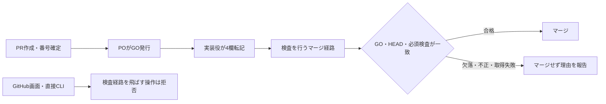

# GOフロー統一の設計候補

この文書は、PR番号を先に作り、POのGOを確認してからマージする仕組みの設計草案です。
親: [README.md](README.md) / recon: [recon.md](recon.md)。証拠正本: docs/handoff/go-record-transcription/recon.md。
対象ADR: ADR-113、ADR-121、ADR-135、ADR-136。

## 合意済みの範囲

2026-09-10、POはGitHub画面・直接CLIからのマージ制限も設計対象とする提案に「合意」と返答した。原文・前提は親READMEに記録。方式の採択・実装・外部設定変更の承認ではない。

## 目的と成功条件

| 基準 | 検証方法 |
|---|---|
| PRをGOなしで作成し、実PR番号を取得できる | 作成wrapper試験と実装承認後の実PR確認 |
| PO発話と転記原文の不一致0件、空欄0件 | PO原文とPR本文の4欄を突合 |
| GO欠落・不正・番号違いでマージ呼び出し0回 | 初回/再試行それぞれの否定テスト |
| GitHub画面/直接CLIで検査経路を飛ばすマージ0件 | 専用検証repoで権限別に拒否を確認 |
| 検査したHEAD以外のマージ0件 | HEAD更新競合試験 |
| GO確認後の本文変更で無効になったGOを使うマージ0件 | 本文更新競合試験。実現方法は未確定 |
| L1にGOフロー差分が混ざらない | 専用worktreeとPRの変更一覧確認 |

これらは草案の受入条件。未確定条件があるため実装カードは発行しない。

## 変更前後

PR作成自体はGOを検査しない。現状の問題は、作成後CIのGO待ちを作成失敗として扱う説明の混在と、マージ直前検査/サーバー側必須化の不足である。

## 実現方法の比較と推奨候補

| 方式 | 効果 | 判定 |
|---|---|---|
| CIをGO欠落でもpassにし、手元だけ検査 | 画面/直接CLIは手元検査を通らない | REJECT |
| 既存process-artifacts gateの必須化だけ | CI赤をGitHubが拒否する | 直前の本文再照会を保証しないため単独では不足 |
| 既存保護＋専用マージ主体だけにmain更新を許すルール | 通常アカウントの画面/直接CLIをサーバー側で拒否 | 推奨候補、方式未承認 |

専用主体の候補は専用GitHub App。通常のshingo-cc/Hikky-devの認証情報をマージ側と共用すると、同じ資格で直接CLIを実行できるため隔離にならない。

GitHub公式はRulesetのRestrict updates、GitHub Appsへの例外指定、複数Rulesetの併用を提供する。新しい「更新者を絞るルール」にだけ専用Appを許可し、既存のCI/PR必須/merge commit制約は解除しない構成を検討する。ここでいう例外は新ルールの許可主体の指定であり、既存検査を素通りさせる設定ではない。

専用Appの作成・鍵配置・workflow追加・保護設定は本セッションでは行わない。App IDやsecretの値は推測しない。現環境は公開の個人所有repoであり、組織のTeam権限を当然の前提にしない。

## 共通して必要な契約

- 作成段階: ready PRをGO欄なしで作成可。PR番号/URL/head一致を成功判定に使う。GO待ちCI赤は作成失敗と区別する。
- 転記段階: PO発話受領後に対象PRの所有関係と最新本文を取得し、4欄を転記。無関係な本文を保持する。日時・バックアップ確認も証拠を必要とする。
- 検査段階: 初回・RULE_WAIT・main追従後に毎回PR/本文/HEADを読み直す。API失敗、空欄、番号違い、権限外はfail closed（不明ならマージしない）。
- 共用: parseGORecord/validateGORecordをCIとマージ入口で共用。副作用のあるchecker.main()の呼び出しは使わない。
- マージ段階: 検査したHEADをsha/--match-head-commitに指定。別SHAになったら再検査。旧GOを新しい実装差分へ自動適用しない。base追従時のGO有効条件は正式設計で定める。
- 成否: merge APIの応答だけでなく、対象PRのmergedAt/mergeCommit/head関係を再取得して確定する。
- 証拠: PR番号・検査HEAD・GO4欄・本文ダイジェスト・検査結果・実行時刻を保存。GOを捏造しない。

## ファイル単位の変更候補

| 既存ファイル | 必要な変更 |
|---|---|
| docs/handoff/design-partner-card-ops/guards/05-pr.md | PR成功/GO待ちの区別、editedの記述訂正 |
| docs/handoff/design-partner-card-ops/guards/06-merge.md | 最新GO検査と専用経路への案内 |
| docs/ai-agents/executor-preamble.md | 作成→転記→検査→マージの正規ルート |
| scripts/card-lint.sh | 作成時GOなしを拒否せず、検査を飛ばすマージを拒否するfixtureとの整合 |
| scripts/check-process-artifacts.js | 共用GO検証の厳密化。欠落failの単純pass化は禁止 |
| scripts/gh-pr-merge-safe.sh | マージ2経路を専用入口に集約。通常資格で直接マージしない |
| scripts/tests/test-process-artifacts.js | 欠落/番号違いに加え重複欄、部分一致発行者、不正日時を検査 |
| scripts/tests/test-merge-safe-guard.sh | 初回/再試行/取得失敗/HEAD変更/本文変更の試験 |
| scripts/tests/card-lint/ | 作成時欠落許可・転記・検査なしマージ拒否の見本 |

追加workflowのパス・Appの権限契約は未確定。新設が必要な場合もこの既存テーマの下で確定し、別の文書体系を作らない。
今回の文書PRは上の実装対象を変更しない。

## 保護設定の準備案

既存12チェックを削除/置換しない。ADR-135 Cが決定したprocess-artifacts gateの必須化を復旧候補とする。導入するとGO以外の成果物不備もマージを止める点を明示する。

順序案: POによる現設定の例外一覧確認 → 専用経路の設計確定 → 専用検証repoで否定/正常/競合テスト → 実装承認 → 実装/レビュー → 正確な設定差分と退避/復旧手順の提示 → 個別のPO GO → 設定適用/検算。
新入口が動かない間に通常マージを閉じない。障害時に自動で保護を外す設計にはしない。

## 未解決事項と実装停止条件

1. bypass_actorsは現在のshingo-cc権限では非表示。PO側で15777895の例外一覧を読み取る必要がある。見えないことを空の一覧と同一視しない。
2. 専用App/信頼する実行環境/鍵の隔離・ライフサイクル・監査担当は未確定。権限とsecretの新規運用を要するため、手元wrapper追加だけと同じ規模には扱わない。
3. GitHub merge APIが条件として受け取るのはhead SHAで、PR本文の版は含まれない。最新本文GET後の本文変更競合は専用マージ主体だけでも消えない。本文書込みの排他制御またはGO記録の確定時点の契約を設計しない限り、当該受入条件は満たしたとしない。
4. 厳密なGO原文の受理範囲、全main向けPR/既存の危険・利用者影響分類の適用境界、base追従時の再GO条件を確定する必要がある。POの既存のGO発行方法を独断で変えない。

## 外部・過去事例の参照と我々への応用

外部導入事例は不要。自社の検査関数5ケース、マージ2経路、Ruleset12チェックの一次実測と、公式仕様で判断する。ADR-135 Cの過去「必須化済み」と現在の欠落を対照し、継続確認を受入条件に入れる。
Context7は利用不可。POの起動指示に従いGitHub公式資料を2026-09-10に直接確認。

- [Rulesetの更新制限](https://docs.github.com/en/repositories/configuring-branches-and-merges-in-your-repository/managing-rulesets/available-rules-for-rulesets): 更新を許可主体に限定できる。
- [Rulesetの重ね合わせ](https://docs.github.com/en/repositories/configuring-branches-and-merges-in-your-repository/managing-rulesets/about-rulesets): 複数ルールは併用される。
- [RulesetのAPI](https://docs.github.com/en/rest/repos/rules#get-a-repository-ruleset): bypass_actorsはrulesetへのwrite権限がある場合のみ表示。
- [マージAPI](https://docs.github.com/en/rest/pulls/pulls#merge-a-pull-request): head SHA一致を条件に指定できる。本文の原子的な一致条件は公開契約にない。
- [GitHub Appの認証](https://docs.github.com/en/apps/creating-github-apps/authenticating-with-a-github-app/making-authenticated-api-requests-with-a-github-app-in-a-github-actions-workflow): 専用App資格を使う方式の参考。実導入仕様は未確定。

本文競合に関する評価はAPIの公開契約からの推論であり、実マージで事故を再現したという報告ではない。

## 弊害・トレードオフ

通常アカウントの直接マージができなくなり、専用経路の停止が全マージの停止につながる。PR作成・コードpushの権限は必要だが、mainへのマージ資格とは分離する。新しいApp/鍵を導入するなら、保守と更新の負担が増える。
GitHub本人承認の強制へ勝手に戻さない。GO原文の本人性は既存ADR-136の人手確認・監査の境界であり、文字列検査だけで証明できるとは称さない。

## 接触面分析

人: POの画面からのマージ操作に影響。エージェント: カードと入口を同時変更。機械: CI/Ruleset/マージ経路/認証資格が対象候補。データ: DB変更なし。本番: アプリ変更なしだが出荷の入口に影響。外部: GitHub管理設定とApp運用の導入を要する可能性。

## Architect自己審査

判定: **REVISE（修正必要）**。同一AIによる自己審査であり、独立した第二者レビューではない。

根拠: 作成/CI/マージの切り分け、5/5の既存関数試験、main保護の欠落、専用主体を許可する公式機能は確認済み。一方、例外一覧・専用主体の運用・本文競合・適用境界が未確定で、実装役が迷わず作れる設計には至っていない。
自力で補える仕様調査を続け、権限上読めない一覧だけPOへ依頼する。実装カードと正式なカード検査は設計合格後に行う。

## 維持の仕組み

守り手: 人手で守る。設計中であり、機械強制の方式が未確定のため。
機械の守り手候補: scripts/check-process-artifacts.js、scripts/tests/test-process-artifacts.js、scripts/gh-pr-merge-safe.sh、scripts/tests/test-merge-safe-guard.sh、GitHub Ruleset。
設計中のため人手で守る: PO合意を記録する担当は本設計担当、最終的な設定確認と変更GOはPO。ReviewerはPO指定、Governanceは転記証拠と必須チェック/例外設定の継続確認。新エージェントは起動しない。
状態: 設計範囲PO合意済み／方式草案／自己審査REVISE／実装未承認・未着手。
