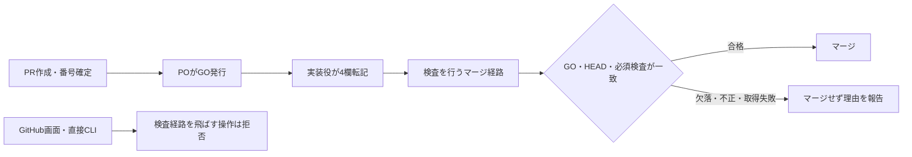

# GOフロー統一の設計候補

この文書は、PR番号を先に作り、POのGOを確認してからマージする仕組みの設計草案です。
親: [README.md](README.md) / recon: [recon.md](recon.md)。証拠正本: docs/handoff/go-record-transcription/recon.md。
対象ADR: ADR-113、ADR-121、ADR-135、ADR-136。

現在の有効な進捗: 専用App方式・取消期限・追加commit時の再GOは合意済み。通常の次予約解放は本番デプロイ成功後。マージ前の確定失敗は順番を返し、修正後に最後尾へ再受付。PO承認の緊急PRは待機列の最前列へ移す（実行中処理を中断しない）。以下の「現行の予約契約（失敗・緊急優先）」を最新の設計方針とし、それ以前の追補は検討履歴として読む。全体自己審査REVISE、ガード/CI実装未着手。公開検証repoのみ作成確認済み、App/鍵/保護設定/実機試験は未実施。

## 最新の合意と実装の前提（この節を現在の判断に使う）

POの最新回答「認識は合っている、推測は禁止して事実確認を怠らずに確実性を重視して最も効果があり、現状把握の粒度が細く、精度が高いエビデンスを確立して安全に進めてくれ」は、直前の「GO制度そのものの変更も委任対象に含める意図ですか？」への確認として受領。今回の対象拡張は確認済みであり、既存LINE限定だからPOの意図が未確認、とは以後扱わない。

一方、正式な有効化と対応済み承認経路は未整備。今回の発話を開始日時や番号付き代理GOとして代筆しない。cxastragoの24時間・不明時停止・証拠記録・自己拡張禁止という条件は維持し、期限は正式有効化時から固定する。ローカルのモード定義や別担当のline-delegation.mdはこの便で編集しない。

| 論点 | 現行の合意/契約 | 実物・未完了 |
|---|---|---|
| 正規GO | PR作成→番号確定→GO→4欄→直前照合 | 現行CIはGOなしで失敗する。作成段階とマージ段階の検査分離は未実装 |
| マージ主体 | PO管理の専用App経路。通常経路の割込を拒否 | 検証repoのみ作成、App/権限/鍵は未準備 |
| 対象HEAD | 追加commitはmain取り込みだけでも再GO | L1の実際の再追従事例あり |
| 予約受付 | マージ前に受付。処理中も受付可能 | 永続ticketの原子更新は実機未検証 |
| 通常の解放 | 対象本番デプロイ成功の保存後 | 下記の実反映SHAの証拠不足を解消する必要あり |
| マージ前失敗 | 確定失敗・未送信確認後に返却、修正後は最後尾 | 返却とIN_FLIGHTの競合試験未実行 |
| 本番失敗/不明 | 後続停止、復旧と結果確定を優先 | 修正PRが必要な復旧経路は未確定 |
| 緊急優先 | POの対象指定承認で待機先頭、実行中は非中断 | 個別優先承認と通常GOを分離。承認の証拠取得口未確定 |
| 委任範囲 | GO制度変更も対象とするPO意図を確認済み | 自分の委任の拡張/有効化と制度実装を区別。承認経路未対応 |
| 品質 | 事実確認・全差分レビュー・必要CI・不明時停止 | 自己審査は独立レビューではない |

### 残件を実装役へ押し付けないための順序

1. 承認を検査する側の信頼する保存先、実行主体、取消/期限を具体化する。委任による制度変更が自分自身の認可条件を同一操作で書き換える循環を防ぐ。発行時は既に正式承認されたbase版で判断し、PR側の新しい認可コードで自分を許可しない。
2. 純粋な判定・状態遷移の検証仕様を確定し、実装役へ渡す正式カードを作る。設計全体の合格と、限定された検証実装の合格を分ける。新しい実装役の起動を権限委譲の語だけで推測しない。
3. 検証App準備の正式カード、実権限/鍵/Environment/状態branchの確認を行う。未実測のIDや成功を埋めない。
4. 否定/正常/競合/通信断を実機検証し、復旧・本番反映証拠の欠落を解消して再審査する。制度有効化は最後に行う。

### 本番反映証拠の実測制約

origin/mainの .github/workflows/deploy.yml:177 はPREV_SHAを保存し、:183-184はorigin/mainを取得してその先端へ作業treeを更新する。workflowのhead_shaへ固定する実装ではない。従ってworkflow runの成功とhead_shaだけから本番稼働SHAの一致を断定しない。失敗時:572はPREV_SHAへの復帰を行う。これらはファイル読取の事実であり、本便で本番を操作したものではない。

予約が全main更新を直列にする設計はこの競合を減らすが、その設計自体がまだ未実装。導入前のL1の反映確認で予約が動いている前提を使わない。本番SHAの既存読取口を特定できない場合は実反映を未確認と報告する。deploy.ymlを本セッションの禁止を迂回して変更しない。

### 現在の審査

同一AI自己審査REVISE。権限委譲の対象に関するPO確認は解消した。上の未実装/未実測事項は確認済みの方式・仕様と区別する。設計草案の提出は可能だが、製品実装可能・代理GO有効・本番導入済みとは扱わない。

以下は初期設計と追補の経過を保存したもの。方式未承認/範囲未確認等の古い状態記載は、この最新表と後続のPO原文記録により更新されている。

## 合意済みの範囲

2026-09-10、POはGitHub画面・直接CLIからのマージ制限も設計対象とする提案に「合意」と返答した。原文・前提は親READMEに記録。方式の採択・実装・外部設定変更の承認ではない。

## 目的と成功条件

| 基準 | 検証方法 |
|---|---|
| PRをGOなしで作成し、実PR番号を取得できる | 作成wrapper試験と実装承認後の実PR確認 |
| PO発話と転記原文の不一致0件、空欄0件 | PO原文とPR本文の4欄を突合 |
| GO欠落・不正・番号違いでマージ呼び出し0回 | 初回/再試行それぞれの否定テスト |
| GitHub画面/直接CLIで検査経路を飛ばすマージ0件 | 専用検証repoで権限別に拒否を確認 |
| 検査したHEAD以外のマージ0件 | HEAD更新競合試験 |
| 最終照合時に欠落・不正・番号不一致のGOでマージ送信0回 | 本文更新競合試験。最終照合したGOは当該1回用に確定し、確定後の本文編集では進行中のマージを取り消せない（2026-09-10 PO合意） |
| L1にGOフロー差分が混ざらない | 専用worktreeとPRの変更一覧確認 |

これらは草案の受入条件。未確定条件があるため実装カードは発行しない。

## 変更前後

PR作成自体はGOを検査しない。現状の問題は、作成後CIのGO待ちを作成失敗として扱う説明の混在と、マージ直前検査/サーバー側必須化の不足である。

## 実現方法の比較と推奨候補

| 方式 | 効果 | 判定 |
|---|---|---|
| CIをGO欠落でもpassにし、手元だけ検査 | 画面/直接CLIは手元検査を通らない | REJECT |
| 既存process-artifacts gateの必須化だけ | CI赤をGitHubが拒否する | 直前の本文再照会を保証しないため単独では不足 |
| 既存保護＋専用マージ主体だけにmain更新を許すルール | 通常アカウントの画面/直接CLIをサーバー側で拒否 | 推奨候補、方式未承認 |

専用主体の候補は専用GitHub App。通常のshingo-cc/Hikky-devの認証情報をマージ側と共用すると、同じ資格で直接CLIを実行できるため隔離にならない。

GitHub公式はRulesetのRestrict updates、GitHub Appsへの例外指定、複数Rulesetの併用を提供する。新しい「更新者を絞るルール」にだけ専用Appを許可し、既存のCI/PR必須/merge commit制約は解除しない構成を検討する。ここでいう例外は新ルールの許可主体の指定であり、既存検査を素通りさせる設定ではない。

専用Appの作成・鍵配置・workflow追加・保護設定は本セッションでは行わない。App IDやsecretの値は推測しない。現環境は公開の個人所有repoであり、組織のTeam権限を当然の前提にしない。

## 共通して必要な契約

- 作成段階: ready PRをGO欄なしで作成可。PR番号/URL/head一致を成功判定に使う。GO待ちCI赤は作成失敗と区別する。
- 転記段階: PO発話受領後に対象PRの所有関係と最新本文を取得し、4欄を転記。無関係な本文を保持する。日時・バックアップ確認も証拠を必要とする。
- 検査段階: 初回・RULE_WAIT・main追従後に毎回PR/本文/HEADを読み直す。API失敗、空欄、番号違い、権限外はfail closed（不明ならマージしない）。
- 共用: parseGORecord/validateGORecordをCIとマージ入口で共用。副作用のあるchecker.main()の呼び出しは使わない。
- マージ段階: 検査したHEADをsha/--match-head-commitに指定。別SHAになったら再検査。旧GOを新しい実装差分へ自動適用しない。base追従時のGO有効条件は正式設計で定める。
- 成否: merge APIの応答だけでなく、対象PRのmergedAt/mergeCommit/head関係を再取得して確定する。
- 証拠: PR番号・検査HEAD・GO4欄・本文ダイジェスト・検査結果・実行時刻を保存。GOを捏造しない。

## ファイル単位の変更候補

| 既存ファイル | 必要な変更 |
|---|---|
| docs/handoff/design-partner-card-ops/guards/05-pr.md | PR成功/GO待ちの区別、editedの記述訂正 |
| docs/handoff/design-partner-card-ops/guards/06-merge.md | 最新GO検査と専用経路への案内 |
| docs/ai-agents/executor-preamble.md | 作成→転記→検査→マージの正規ルート |
| scripts/card-lint.sh | 作成時GOなしを拒否せず、検査を飛ばすマージを拒否するfixtureとの整合 |
| scripts/check-process-artifacts.js | 共用GO検証の厳密化。欠落failの単純pass化は禁止 |
| scripts/gh-pr-merge-safe.sh | マージ2経路を専用入口に集約。通常資格で直接マージしない |
| scripts/tests/test-process-artifacts.js | 欠落/番号違いに加え重複欄、部分一致発行者、不正日時を検査 |
| scripts/tests/test-merge-safe-guard.sh | 初回/再試行/取得失敗/HEAD変更/本文変更の試験 |
| scripts/tests/card-lint/ | 作成時欠落許可・転記・検査なしマージ拒否の見本 |

追加workflowのパス・Appの権限契約は未確定。新設が必要な場合もこの既存テーマの下で確定し、別の文書体系を作らない。
今回の文書PRは上の実装対象を変更しない。

## 保護設定の準備案

既存12チェックを削除/置換しない。ADR-135 Cが決定したprocess-artifacts gateの必須化を復旧候補とする。導入するとGO以外の成果物不備もマージを止める点を明示する。

順序案: POによる現設定の例外一覧確認 → 専用経路の設計確定 → 専用検証repoで否定/正常/競合テスト → 実装承認 → 実装/レビュー → 正確な設定差分と退避/復旧手順の提示 → 個別のPO GO → 設定適用/検算。
新入口が動かない間に通常マージを閉じない。障害時に自動で保護を外す設計にはしない。

## 未解決事項と実装停止条件

1. bypass_actorsは現在のshingo-cc権限では非表示。PO側で15777895の例外一覧を読み取る必要がある。見えないことを空の一覧と同一視しない。
2. 専用App/信頼する実行環境/鍵の隔離・ライフサイクル・監査担当は未確定。権限とsecretの新規運用を要するため、手元wrapper追加だけと同じ規模には扱わない。
3. GitHub merge APIが条件として受け取るのはhead SHAで、PR本文の版は含まれない。最新本文GET後の本文変更競合は専用マージ主体だけでも消えない。本文書込みの排他制御またはGO記録の確定時点の契約が必要。改訂2でAの取消期限にPO合意を受領した。保存・送信・再試行の実装契約と試験は引き続き必要。
4. 厳密なGO原文の受理範囲、全main向けPR/既存の危険・利用者影響分類の適用境界、base追従時の再GO条件を確定する必要がある。POの既存のGO発行方法を独断で変えない。

## 外部・過去事例の参照と我々への応用

外部導入事例は不要。自社の検査関数5ケース、マージ2経路、Ruleset12チェックの一次実測と、公式仕様で判断する。ADR-135 Cの過去「必須化済み」と現在の欠落を対照し、継続確認を受入条件に入れる。
Context7は利用不可。POの起動指示に従いGitHub公式資料を2026-09-10に直接確認。

- [Rulesetの更新制限](https://docs.github.com/en/repositories/configuring-branches-and-merges-in-your-repository/managing-rulesets/available-rules-for-rulesets): 更新を許可主体に限定できる。
- [Rulesetの重ね合わせ](https://docs.github.com/en/repositories/configuring-branches-and-merges-in-your-repository/managing-rulesets/about-rulesets): 複数ルールは併用される。
- [RulesetのAPI](https://docs.github.com/en/rest/repos/rules#get-a-repository-ruleset): bypass_actorsはrulesetへのwrite権限がある場合のみ表示。
- [マージAPI](https://docs.github.com/en/rest/pulls/pulls#merge-a-pull-request): head SHA一致を条件に指定できる。本文の原子的な一致条件は公開契約にない。
- [GitHub Appの認証](https://docs.github.com/en/apps/creating-github-apps/authenticating-with-a-github-app/making-authenticated-api-requests-with-a-github-app-in-a-github-actions-workflow): 専用App資格を使う方式の参考。実導入仕様は未確定。

本文競合に関する評価はAPIの公開契約からの推論であり、実マージで事故を再現したという報告ではない。

## 弊害・トレードオフ

通常アカウントの直接マージができなくなり、専用経路の停止が全マージの停止につながる。PR作成・コードpushの権限は必要だが、mainへのマージ資格とは分離する。新しいApp/鍵を導入するなら、保守と更新の負担が増える。
GitHub本人承認の強制へ勝手に戻さない。GO原文の本人性は既存ADR-136の人手確認・監査の境界であり、文字列検査だけで証明できるとは称さない。

## 接触面分析

人: POの画面からのマージ操作に影響。エージェント: カードと入口を同時変更。機械: CI/Ruleset/マージ経路/認証資格が対象候補。データ: DB変更なし。本番: アプリ変更なしだが出荷の入口に影響。外部: GitHub管理設定とApp運用の導入を要する可能性。

## 2026-09-10 改訂2: 実行主体とGO確定境界（取消期限のみPO合意済み）

調査基点: origin/main 87e5748b1dab5b062f991a263fa6ac692653877d。PR #3388はMERGED（5316315fa1356d637a54d23ac2ad7ffe270260fd）。文書マージは方式採択ではない。以下は前節の候補を具体化したもの。未解決事項を解消済みとは扱わない。

### 保護設定の契約案

- 現在の15777895はactive、shingo-ccはadmin=false/current_user_can_bypass=never。bypass_actorsはAPI応答にない。例外ゼロという結論は出せない。
- 導入時はPO権限でmainに適用される全Rulesetと旧Branch Protectionを読み、設定全体・例外・取得日時を退避する。15777895だけの確認では不足。これは新規の権限付与を求めるものではない。
- 更新者を絞る専用Rulesetはmainのみ、更新制限のみ、許可主体は専用Appのみとする候補。既存のPR必須・12チェック・削除/強制push禁止は別Rulesetで保持する。Appを既存の品質ルールの例外には入れない。
- PO本人を含む通常アカウントの通常マージは拒否対象。設定を変更できる所有者が自ら制限を解除する行為までは、この仕組みで封鎖できない。設定変更の監査と個別GOで管理する。
- 権限別のUI/CLI拒否、AppのGOなし拒否、Appの必須CI失敗時拒否、正常なmerge commitの4種を専用検証repoで実測してから適用する。試験repoや設定は本便では作らない。

### 専用経路の具体案

既存の scripts/gh-pr-merge-safe.sh は所有PRの照合を残し、通常資格による直接mergeの2経路を専用処理の呼び出しへ置き換える候補。新設予定名は .github/workflows/go-merge.yml と scripts/go-merge.js（どちらも現時点では存在しない）。

- 実行環境: GitHub-hosted runner。workflow_dispatchをmain指定で呼ぶ。候補environment名はgo-merge、許可するrefはBranch型のmainだけ（Tag型の許可なし）。App秘密鍵をrepository secretや実装役の端末へ配らず、このenvironmentに限定する。
- dispatchは任意のbranch/tagを指定できる公式仕様なので、workflow内のifだけを防壁としない。Environment側のref制限が必要。公開の個人所有repoでもこの機能は公式に提供される。現設定・利用plan・実挙動は導入前に検算する。
- 実行コードは承認されmainに入ったものだけ。PR側のスクリプト、依存導入、artifact、cacheを特権jobで実行しない。GO本文はAPIからデータとして読む。シェル命令へ埋め込まない。使用Actionはレビュー時に実在する完全SHAへ固定する。
- App installation tokenは対象salesanchorのみ。通常のmerge APIに必要なContents writeと参照に必要な権限だけを列挙する。workflow変更を含むPRの追加権限要否は未検証であり、適用対象を黙って除外しない。App ID/installation ID/鍵/許可実行者の実値は導入カード作成前に確定する。
- マージは同期API、sha=検査したHEAD、merge_method=merge。auto-merge/非同期queue/管理者強制は使わない。待機やmain追従後は新しい試行として検査する。応答不明時はPR状態を照会し、無条件に再送しない。
- 運用候補: POがApp所有・鍵更新・停止を担当、実装役は既存wrapperだけ操作、PO指定Reviewerが特権コード変更を審査する。鍵の漏洩/失効時はマージ停止、POが失効と再発行を行い否定試験後に再開。自動で保護を外す復旧は設けない。POの管理責任は後続の方式採用GOで合意済み。更新周期は未合意。

この構成は公式機能を組み合わせた設計推論。実機で秘密鍵の隔離・workflow変更PRのマージ・権限拒否を確認済みとはしない。

### GO確定時点の比較と合意

GitHub同期merge APIの条件指定はHEADのshaであり、PR本文の版番号/ハッシュは渡せない。したがって「GETした本文がmerge成立時点でも同一」を原子的に要求できない。GOの再照会を2回に増やす、editedでCI再実行、workflowの同時実行数を1にするだけでは、GitHub画面からの本文編集との競合は解消しない。

| 方式 | 利用者に見える意味・限界 | 評価 |
|---|---|---|
| A: 最終照合したGOをその1回のマージ用に確定 | 実装役がマージ処理を開始し、最後に照合したGOとHEADを保存して1回だけ送信。確定後の本文編集ではその送信を取り消せない | 取消期限についてPO合意済み。通常のGO発行・4欄転記を維持する。実装方式全体は審査中 |
| B: マージ成立直前まで本文編集で取り消せる | 編集者を含む書込みを別の仕組みで排他制御する必要がある。GitHubの通常本文編集を残したままの実現根拠はない | 不採択。Aの取消期限への合意により、この保証は受入条件から外す |

Aの具体化案（最終照合で当該1回用に確定する取消期限はPO合意済み。その他の実装詳細は草案）:

1. PR作成→POのGO→4欄転記までは変更しない。転記時に対象HEADとPO原文との人手突合を証拠へ残す。文字列だけで本人性を証明したとはしない。
2. 専用処理はCI待機を終えてからPRを再取得する。4欄、番号、所有PR、HEAD、base=main、必須検査を照合する。開始時とのGO内容/HEADの差異、API失敗、未知の状態では送信しない。
3. 最後の取得内容を確定記録（repo、PR、HEAD、GO4欄、本文digest、確認時刻、試行ID）として保存する。保存失敗なら送信しない。同期merge APIを同じHEADで1回だけ呼ぶ。
4. この最後の照合を取消の境界とする。照合後の本文編集/チャットによる取消を、その進行中リクエストで必ず受理できるとは約束しない。短い時間でも取消不能区間が生じることをPOに明示する。
5. GO受領時のHEADからコミットが追加されたら、main取り込みだけでも再GOとする（改訂3の後続PO合意）。差分同一性を根拠に再GOを独断で免除しない。
6. merge結果・mergeCommitを照会して証拠に連結する。再試行は新たに照合し、前回記録だけで通さない。

2026-09-10、直前の提案に対しPO返答原文「合意」を受領し、最上段の成功条件をAの取消期限へ更新した。提案と返答の逐語記録は親READMEの「GO取消期限への合意」に保存。今回の合意は取消期限だけに適用し、App運用・再GO条件・設定変更・実装開始・新PRマージの承認へ広げない。

### 改訂2の追加受入試験案

| 基準 | 検証方法 |
|---|---|
| release branchやtagから専用資格を取得できるケース0件 | environmentのBranch main限定を設定した専用repoで各refから試す |
| 専用jobがPRのコードを実行するケース0件 | 改変fixtureを含むPRを投入し、実行されたコードのSHAと副作用を照合 |
| 最終照合より前のGO取消・書換えでmerge送信0回 | GET応答の前後を制御するfixtureでGOを変える |
| 確定記録が保存できないときmerge送信0回 | 保存処理失敗を注入する |
| 最終照合後の本文変更時の挙動がAの契約と一致 | 保存したGOでの1回の試行と事後の本文編集を別記録として照合する。取消を保証した表示がないことも確認 |
| 設定所有者の例外を未確認のまま適用0件 | 適用カードに全ルール/例外の読取結果と検算欄があることを確認 |

## 2026-09-10 改訂3: 保存・送信・再GOの契約案

改訂2の取消期限はPO合意済み。本節は、その期限を実装できるようにする詳細草案であり、Appの新規作成・設定・実装を許可するカードではない。PR #3394はMERGED（5386d664f40aa826e7e3d943b87bb65697d49165）。

### App権限を用途ごとに絞る

| 用途 | 権限候補 | 根拠・限界 |
|---|---|---|
| 対象PRの取得・変更一覧の取得 | Pull requests read | GitHub RESTの各取得API。番号、base、head、本文をAPIから読む |
| 必須チェックと実行結果の取得 | Checks read / Actions read / Contents read | check runs、workflow run、commit statusの取得を対象とする。エンドポイントの全量照合は実装前に必要 |
| 同期merge | Contents write | REST merge APIが明記。品質Rulesetの例外にはしない |
| workflowファイルを含む変更 | Workflows権限の要否を検証 | 公式のGitアクセス説明はWorkflowsを要求する。一方REST merge説明はContents writeを記す。通常PRとworkflow変更PRの両方で試験し、必要なら対象実装カードに明記してPO承認後に付与する |
| GO確定証拠の一時保存 | Actions artifactのアップロード機構 | AppにChecks writeを足して記録する案は採用候補から外す。記録のために検査結果を書ける権限を増やさない |
| 保護設定・環境・secrets管理 | マージAppへ付与しない | POが設定を管理。App自身に制限解除能力を持たせない |

App秘密鍵はmainだけに限定したEnvironmentに保持し、短命tokenはsalesanchorのみに限定。通常の実装役資格と混用しない。秘密値・token・HTTP認証headerを確定記録に含めない。Workflows権限の未検証を「不要」と断定しない。

### 確定記録の内容と保存先

既存のPR本文4欄は維持する。別の正本テーマやDBは作らない。機械の監査記録として、次のschema_version=1のJSONを保存する候補。

- repo_id、repo_full_name、pr_number、base_ref、base_sha、head_sha。
- GO発行者・日時・GO原文・バックアップ確認の転記4値（原文を変更しない）。
- body_sha256: APIで受け取った本文文字列のUTF-8 bytesに対するSHA-256。改行を勝手に正規化しない。本文全体の再公開はせずdigestのみを保存する。
- workflowの承認済みコードSHA、run_id、run_attempt、試行ID、最終照合時刻、検査結果（必須checkの名前・ID・対象SHA・結論）。
- schemaを固定し、同じJSON bytesのSHA-256をrecord_sha256とする。ログの自由文やユーザー指定の任意パスから読み直さない。

保存候補: 当該workflowが生成した確定JSONをActions artifactへ、run_id/run_attempt/PR番号を含む固有名でuploadする。上書き禁止・ファイルなしはerror。uploadの成功とartifact ID/digestを得られなければmergeを送信しない。PRが生成したartifactを特権処理で実行・展開する設計ではない。

artifactは期限切れ・管理者による削除があるので永久保存とは扱わない。merge APIのcommit_messageにも確定JSONとrecord_sha256・artifact IDを含め、成立時はmain履歴に残す候補。保存の長期性はmainの削除/強制更新禁止と所有者の管理に依存する。失敗試行のartifact保存期間は運用担当と未合意。キー更新周期とあわせて維持条件へ残す。

### 1回の送信の順序と停止点

1. 所有PR・main向け・OPEN/ready・入力された対象HEADを確認。検査待機はここで終える。最初の依頼「マージ直前にはGO記録なし・不正・PR番号不一致を必ず拒否する」に従い、文書を含む全main向けPRの専用入口でGOを必須とする。成果物の免除とGOの免除を混同しない。
2. 最後に本文とHEADを再取得し、GOの欠落・不正・番号違い・HEAD違い・API失敗なら停止。CIで使う純粋GO validatorと入口validatorを共用する。実行するvalidatorはPR側でなく承認済みmainのコード。
3. 照合したGOをその1回用に確定し、上記JSONを保存する。ここ以降の本文編集で当該送信の取消を保証しないという合意を適用する。保存失敗や送信前の処理失敗は、その試行を終了する。
4. 同期merge APIへsha=head_sha、merge_method=merge、commit_message=確定記録を指定し、アプリ側の自動再送なしで1回送る。保存後に人の操作やCI待ちを挟まない。HEAD変更はGitHub側のsha条件で拒否させる。
5. 200だけで完了とせず、merged=trueとPRのmergedAt/mergeCommitを再照会する。merge commitの親に検査HEADがあること、commit messageの記録hashが一致することを照合する。不一致なら成功宣言せず調査する。
6. 403/405/409/422はその試行を終了。再試行する場合は新たにGOとHEADを検査する。通信断/5xx/タイムアウトで結果が不明なら、PR照会で成立を確認するまで再送しない。複数run間で不明試行をどう検出・停止するかは未確定であり、実装停止条件に追加する。

この順序は候補契約。HTTP1回と「サーバーで必ず1回成立」は別である。結果不明時の二重送信を解決済みとは扱わない。

### 再GOの境界（PO合意済み）

2026-09-10、コミット追加時の再GOを求める提案にPO原文「進める」を受領し、設計条件として採択。「GO受領時のHEADから1コミットでも変わったら、main取り込みだけでも再GO」とする。実装差分が同じかを独自の推測で判定しない。弊害として、他PRが先に入った結果のmain取り込みでもPOのGO回数が増えることを説明済み。元の提案と返答はREADMEに保存。今回の設計条件は既存スクリプトにまだ実装されていない。

GOを求める時点の提示HEADを承認対象の証拠へ固定する。GO受領後に最新HEADを取得して旧承認の対象値を上書きしない。新しいGOの日時・原文・対象HEADは、前の証拠と区別して記録する。POの発話形式GO #PR番号と4欄転記は変えない。

HEAD不変・本文のGO4値不変の通信/CI待機再試行は、最終照合からやり直す。結果不明試行が残る場合は自動再開しない。POがどのHEADを見てGOを出したかの証跡は、転記担当の人手突合で残す。入力値の自己申告だけで本人性や承認対象を証明しない（ADR-136）。

### 追加の受入試験

| 基準 | 検証方法 |
|---|---|
| 証拠upload失敗時にmerge呼び出し0回 | uploadを失敗させ、HTTP送信カウンタを検算 |
| 確定JSONとmerge commit内の記録に不一致0件 | 同じbytesのhashとmerge commit親を確認 |
| stale HEADのマージ成功0件 | 保存後にheadを進め、sha条件による409とmain未変更を確認 |
| 結果不明時に自動再送0回 | 応答前後で通信を切断し、再runを含む状態照合を試験。設計未確定のため未達 |
| 権限不足を保護解除で回避するケース0件 | Contents-onlyとworkflow変更PRで拒否を検出し停止する |
| 確定後の本文編集を取消成功と表示するケース0件 | 本文編集と同期送信を競合させ、確定記録に従うことを照合 |

### 改訂3追補: PO認証での保護設定読取り

2026-09-10、POの既存認証を一時的に読み取りへ使う提案に対して、PO原文「GO」を受領。登録済みshingo-ops認証をGET専用の子プロセスにだけ渡し、通常の認証はshingo-ccのまま維持した。設定変更・資格の恒久付与・tokenの表示/ファイル保存は行っていない。

- repoのdefault_branch=main、POのpermissions.admin=trueを確認。
- Ruleset一覧は2件。main用15777895はactive、対象は~DEFAULT_BRANCH、bypass_actors=[]（例外0件）。develop用16619490はactiveでrefs/heads/developのみ、bypass_actors=[]。mainへ適用されるRulesetは一覧上15777895のみ。
- 旧Branch Protectionのmain GETは404、応答本文はBranch not protected。これは旧形式の保護がないことを示し、Rulesetが無効という意味ではない。
- mainの適用ルールGETでは必須チェック12件を再確認。新しい専用Appや例外は追加していない。

これにより「現設定の例外一覧が非表示で不明」は解消。改訂2/3前半の非表示・回答待ちは調査時点の履歴として扱う。導入直前には同じ読み取りを再実施し、今回の結果を将来の設定値と断定しない。GOの許可範囲はこの読取のみで、今後のPO資格使用や設定変更へ包括的に拡張しない。

### 改訂3追補2: 再実行の判定表と運用案

取消期限・例外0件に加え、コミット追加時の再GOもPO返答「進める」により確定した。

| 観測した状態 | 次の動作 | merge送信 |
|---|---|---|
| 必須CI未完了 | 確定前に待機。待機後はGO/HEAD再取得 | 0回 |
| 確定JSONの保存に失敗 | その試行を終了し、未送信の終端記録を保存できた場合だけ再試行可 | 0回 |
| 送信前のHEAD/GOが変化 | 停止。新HEADに対するGO要否は承認済み条件を適用 | 0回 |
| 同期APIの明確な拒否を受領 | HTTP状態・本文・送信対象を記録し、その試行を終了 | 当該試行1回、新しい試行は再照合 |
| 送信後にtimeout/通信断/5xx | PR/merge commitを照会。未マージ表示だけで再送可とは判定しない | 追加0回 |
| PRがMERGED、検査HEADと確定hashが一致 | 成立として終了し、再実行も照会だけにする | 追加0回 |
| PRがMERGED、確定hashが異なる/読めない | 異なる試行か証拠不整合として停止。成功を代用しない | 追加0回 |
| 前のrunが取消/失敗/期限切れ、送信有無を確認不能 | 結果不明として停止。担当へ照合を依頼する | 0回 |

workflowのconcurrencyはrepo内の専用処理全体で同じ固定group、cancel-in-progress=falseを候補にする。順序保証や結果の永続保存までconcurrencyに期待しない。キューから外されたrunを成功扱いしない。専用workflowの各run/attemptの結果とGO確定記録を読んでから新試行に進む。APIの取得漏れ・保存期限切れ・記録の欠落は「過去の試行なし」に変換しない。

Actionsの履歴APIはrunを返すが、これだけでは削除された履歴の不存在まで証明できない。結果不明の状態を複数runで共有する保管方法・保存範囲の完全性・解除の証拠は実装設計の残件。今回の判定表を完成済みの機械制御とは呼ばない。

代替としてGit ref/tagに永続的な受付票を置くAPIも調べたが、専用tag namespace・追加Ruleset・復旧手順が増えるため今回の推奨に追加しない。新しい状態保管機構を、調査しただけで実装対象へ広げない。

| 保守の仕事 | 担当候補と具体的な運用 | 未決事項 |
|---|---|---|
| App/Environment/例外設定 | POが所有・設定。実装役は読み取り確認と手順提示。マージAppにAdministration/Secrets管理権限を付けない | PO担当は方式採用GOで合意済み。App作成は別承認 |
| 秘密鍵の更新/失効 | 通常の実装役端末へ配布しない。漏洩・担当変更時はPOが失効、否定試験後に再開 | 定期更新周期、代替担当 |
| GO証拠の保管 | マージ成立分はmerge commitにも記録。失敗試行はartifact候補で90日を提案 | 90日の採択、削除/期限後も不明状態を残す仕組み |
| 障害時の復旧 | 最後のrun、HEAD、確定JSON、API応答、PR結果を照合。保護を自動解除しない | 結果不明時の再開を正当化できる証拠の定義 |
| 仕組みの受入 | PO指定Reviewerが別途担当。Appの実機試験は専用検証repoで行う | 実装・外部設定・検証repo作成は未承認 |

POによるApp管理責任は方式採用GOに基づく。その他の担当候補を合意済みとして扱わない。実機試験は「通常PR」と「workflow変更PR」で権限の違いを測り、必要な権限を列挙した後に付与する。実物なしの実機試験合格は出さない。

### 改訂3の自己審査

REVISE継続（同一AIによる自己審査）。改善: 保存前送信禁止、記録schema、同期送信、結果照会、権限を用途に対応させた。保護例外の確認は追補で解消。未解決: Workflows追加権限の実測、保存期間/運用詳細、結果不明試行のrun間制御。実装カードは発行しない。

### 採択済み: PO管理の専用App方式

2026-09-10、専用GitHub App方式とPOによる管理責任の説明に対し、PO原文「GO」を受領し採択した。提案・返答は親READMEに記録。方式採用までの承認であり、このセッションでApp作成・鍵発行・保護設定変更・製品実装を実行する承認ではない。

| 観点 | 採用方式の内容 |
|---|---|
| 日常操作 | POは従来どおりチャットGO、実装役は既存wrapperから専用処理を呼ぶ |
| マージ権限 | POを含む通常アカウントの画面/直接CLIからの通常マージを止め、検査するApp経路へ集約 |
| 管理責任 | POがAppの所有者として鍵・許可先・停止/再開を管理。具体作業の手順書は設計担当が用意し、実装役は承認範囲で補助 |
| 停止の影響 | Appの障害や資格失効時はマージできない。従来資格へ自動で戻す入口は作らない |
| 変更の承認 | 鍵発行・Environment/Ruleset適用は、正確な差分・退避・検証手順が揃った後の個別GOで行う |
| 採択後に詰める事項 | 状態保管/結果不明試行の復旧、保持期間、鍵更新周期、必要権限を試す専用環境、main向け全PRのGO検査 |

採択理由（ADRのWhyへ残す根拠）: 手元wrapperだけではGitHub画面・直接CLIを閉じられない。通常資格とマージ資格を分離し、検査する主体にだけmain更新を許す必要がある。mainの既存例外は実測0件。App停止でマージも止まる負担とPOの管理責任を説明し、方式へのGOを得た。既存アカウントの管理権限を恒久的に上げる方式は、この分離目的に合わない。

### 採択後の作業順序と判定条件

| 工程 | 成果物・完了条件 | 次へ進めない条件 |
|---|---|---|
| 設計の確定 | GO対象HEADの証拠、結果不明試行の永続保持/復旧、権限一覧、保持期間/運用詳細を実装可能な仕様にする | 未確定の前提が残る |
| 検証準備の設計 | 専用検証repo/App/Environmentの作成内容と費用・退避/削除・必要権限を文書提示 | 具体案未提示または外部操作への個別GOなし |
| 検証・再審査 | 通常PR、workflow変更PR、GO不備、HEAD変化、本文変化、同時起動、通信断の結果を記録 | 未実測を成功扱いする、権限不明、失敗が未解決 |
| 実装引継ぎ | 設計合格・POカード・正式カード検査・明示実装承認を揃える | 今回の方式GOを実装GOに転用する |
| 本環境への適用 | POへ正確な設定差分と復旧手順を提示し、個別GO後に適用・検算 | 新経路が動く前に既存マージ経路を閉じる |

現在は最初の工程。検証に必要な小さな実装を行う場合も、本設計セッションから自動で実装役に切り替わらない。検証のための外部操作も、読み取りGOを根拠に実行しない。

### 永続状態の具体案: 専用ブランチの追記履歴

採択済みApp方式を実装するための技術案。以前のartifactだけを状態正本にする案は、期限切れ・履歴削除後の再送判定を支えられないため、以下へ修正を提案する。設計文書の保存先は既存テーマのまま。GitHub上の新しい状態ブランチは作成していない。

状態正本候補は同じrepoの release/go-merge-state ブランチ。初期化時の承認済みmainから作り、既存treeを保持して .claude-pipeline/go-merge-state.json だけを更新する。これらは新設予定名で、現時点の実在パスではない。通常の製品PR・worktreeとは別の機械用履歴として扱い、mainへのPR作成/マージ対象から除外する契約を入口に追加する。ブランチ運用仕様にも例外用途を記録する必要がある。

- JSONにschema_version、repo_id、sequence、PR別の最新状態と試行ID、GO対象HEAD、GO4値、確定記録hash、run_id/run_attempt、終端証拠を持つ。生成済みの確定記録はGit履歴に残し、artifactは補助ログにする。記録正本の自動期限削除はしない。
- 初期ref/初期commit SHAを設定に記録する。refが見つからない・破損・schema未知・初期commitの子孫でない場合は停止し、空の状態を自動生成しない。初期化/復旧を通常処理から分離する。
- 取得した先端Pの状態を検証し、Pを唯一の親とする新commit Cを作る。treeはPのtreeを基に状態ファイルだけ変更する。refs更新はforce=false。複数の親を持つcommit、rebase、force、最新値への無条件上書きを使わない。
- 別runがPからC1を先に反映したら、Pから作ったC2は先端C1の子孫ではないため更新を拒否される。拒否された処理はマージを送らず、状態を読み直す。これはGitのfast-forward規則とAPI契約からの設計推論。GitHub実機では別途競合試験する。
- 更新権限は専用Appだけに絞る新ルールと、削除・巻き戻しを禁止する例外なしの別ルールを重ねる。Appを削除/強制更新禁止の例外へ入れない。既存mainの品質ルールは変更しない。POによる新ルールの設定GOは別に必要。

### 送信権の取得と終了条件

| 状態 | 保存する意味 | 他のrunの動作 |
|---|---|---|
| READY | 送信中の試行なし。承認対象HEADと証拠を照合できる | 最新GO/HEAD/CIを再検査し、IN_FLIGHTの追記を競争する |
| IN_FLIGHT | 1つの試行が送信権を取得済み。送信前の停止も送信後の応答不明も含む | 対象PRへの送信は禁止。経過時間による期限解除なし |
| NOT_SENT | 所有している処理が、送信関数を呼ぶ前に終了したと確定できる | 新しい試行は最終照合から始める |
| REJECTED | 同期APIの明確な拒否応答を、所有している処理が保存済み | 新しい試行は最終照合から始める。HEAD変化なら再GO |
| MERGED | mergedAt/mergeCommit/対象HEADと確定記録hashの対応を確認済み | 追加送信なし。成立結果を返す |

1. GO/HEAD/CIの最終照合後、そのJSONを含むIN_FLIGHTを上記の方法で保存する。保存成功を確認した実行だけが、当該試行として同期mergeを1回送れる。別run/別attemptは同じ試行IDを再利用しない。
2. IN_FLIGHTの保存API自体がtimeoutしたら、その実行は送信しない。GETで保存状態を確認し、送信関数をまだ呼んでいない当該プロセスだけがNOT_SENTへ追記できる。プロセスが失われていればIN_FLIGHTを維持する。
3. 同期mergeを呼んだ後に応答が不明ならIN_FLIGHTを残す。workflow取消・runner停止・App鍵の失効・日数経過でREADYへ戻さない。新しいPO GOが来ても未確定試行を自動解除しない。
4. MERGEDへの追記は別runによる再照会でも可能。commitの親に検査HEADがあり、保存hash/PR番号が一致することを確認する。終端追記も先端の唯一の親＋force=falseで行い、競合時は状態を読み直す。mergeを再送しない。
5. NOT_SENT/REJECTEDは元の送信所有プロセスが確定証拠を持つ場合だけ記録できる。別runが「PRはOPENだから未送信」と推測して記録しない。
6. 送信済みか不明でMERGEDも確認できない場合は、そのPRの停止を保持する。旧リクエストが今後成立しない証拠なしで解除する機能を初版に入れない。POが調査する。可用性より二重送信防止を選ぶため、この制約は導入時に説明する。

この仕組みで、結果不明のまま次のrunが自動再送する抜け道を、履歴の期限に依存せず閉じる。自動復旧できないケースを、解決済みの復旧手段として表現しない。

### 永続状態案の根拠と接触面

一時的なローカルbare Gitへの通常pushで6/6確認: 先行writerの反映、同じ親から作った後行writerの拒否、先行owner保持、別プロセスからIN_FLIGHT再読取、終端commitの追記、終端後も旧writer拒否。証拠はreconのローカル検証節。この試験はGitHub API・App権限・Rulesetの統合試験ではない。

全workflowのpush定義を読み取った結果、17件がpushを持つ。deploy.ymlはmainのみなのでこの状態ブランチを対象としない。一方active-work-lint.ymlはmain以外を対象にする。状態ブランチはmainのtreeを保持するためlint対象のファイルは存在するが、専用branchでの検査負荷/通知と初期作成時の他paths判定は実機で確認する。CIを省略するコミット文言や保護解除で処理しない。

影響対象追加案: ブランチ運用仕様への機械用branch用途の明記、マージ入口で状態branch自体を拒否、状態読取/更新モジュールと試験、状態branch向け2つの保護ルール。main/develop・L1のworktreeには状態ファイルを置かない。本番DB・既存運用スクリプトは本便では変更しない。

必要権限の整理: 状態のblob/tree/commit/ref作成・更新はContents write、参照はContents read、PR/CI照会は既存表のread権限。ref更新APIはContents write単独とWorkflows write併用の両方を公式に記載するため、workflowファイルを含むtreeの初期化/mergeについて追加権限を実測で確定する必要がある。確認前に「Contentsだけで全PRを扱える」とはしない。

| 基準 | 検証方法 |
|---|---|
| 同一PRの2つのrunが両方送信権を得るケース0件 | 同じPから異なる試行IDのC1/C2を同時更新し、成功1・拒否1を確認 |
| IN_FLIGHTの残るPRへの新runからの送信0回 | runner停止後に別runで状態を再取得し、送信カウンタ0を確認 |
| artifactを削除/期限切れにしても未確定状態が失われるケース0件 | 状態branchを残して補助ログを消す専用環境試験 |
| 状態refの欠落を新規状態として扱うケース0件 | 状態GETの404・403・破損JSONを注入し停止を確認 |
| 状態branchの通常アカウント更新/削除とAppの強制更新成功0件 | 専用検証repoの各資格で否定試験 |
| merge成立後の状態追記失敗でmergeを再送するケース0件 | 終端書込を失敗させ、次runのPR再照会のみで復旧することを確認 |

自己審査: 局所のGit原理は6/6で確認。結果不明状態をrun間で保持する方法は具体化した。状態branchと追加保護の実機試験、必要権限、適用境界、運用細部は残るため、全体REVISEを維持する。

## 専用環境の検証計画（2026-09-10、準備案）

目的は、専用App・保護ルール・永続状態を組み合わせたときに、正規GO以外のマージ成功が0件になることを実測すること。以下は外部変更の承認対象を具体化する計画であり、実行カードではない。設計担当が検証コードやCIを実装する許可、App作成・鍵発行・設定変更の許可は含まない。独立した実装役への委任もまだ行わない。

### 作成対象と境界

以下の名称は新設候補であり、現存を確認した対象ではない。採用時は所有者・名前の空きを読み取り確認し、衝突時は停止する。既存対象を転用・上書きしない。

| 対象 | 準備内容 | 限定条件 |
|---|---|---|
| 検証repo | shingo-ops/salesanchor-go-gate-sandbox、公開、初期main、合成データのみ | salesanchorの製品コード・顧客データ・秘密情報をコピーしない |
| 検証App | PO所有の非公開App、表示名候補 salesanchor-go-gate-sandbox | インストール先は検証repoだけ。salesanchorへの許可なし。Webhookは不使用 |
| 実行環境 | go-merge Environment、許可Branchはmainだけ、Tagは許可しない | App鍵はここだけに登録。repo共通secret・端末保存・ログ出力なし |
| 通常操作主体 | shingo-ccに検証repoのWrite | 管理権限を付けず、POの既定認証も変更しない |
| 状態正本 | release/go-merge-state、初期mainのtree保持、状態JSONだけ更新 | 初期SHAを記録。通常PRのheadに指定したら拒否 |
| 保護ルール | main品質、main更新制限、状態更新制限、状態削除/強制更新禁止の4個 | 更新制限だけ検証Appを例外にする。品質/削除/強制更新禁止に例外なし |
| 最小試験コード | 読取・GO検査・状態競合・同期mergeの試験用処理、失敗注入、呼出回数記録 | 別の実装役がレビュー済み検証仕様と明示承認の範囲で作成。mainの検査済みコードのみ実行 |

main品質ルールにはPR必須、試験用の必須チェック1個以上、削除・強制更新禁止を置く。検証repoのチェック名は作成した実物から登録する。本repoの12必須チェックの代替試験ではない。本適用前には12件の維持とprocess-artifacts検査の扱いを別途照合する。

App登録権限の検証上限案はContents write、Pull requests read、Checks read、Actions read、Workflows write（必要性を比較するため）、Metadata read。Administration・Secrets管理・Checks writeは付けない。発行token AはWorkflows権限を除外、Bは含める。他の権限と許可repoを同一にして通常PRとworkflow変更PRを比較し、本適用に必要な最小権限を結果から決める。検証上限への承認を本repoへの権限付与と解釈しない。

公式根拠: [App登録](https://docs.github.com/en/apps/creating-github-apps/registering-a-github-app/registering-a-github-app)、[installation tokenのrepo/権限指定](https://docs.github.com/en/rest/apps/apps#create-an-installation-access-token-for-an-app)、[EnvironmentのBranch/Tag制限](https://docs.github.com/en/actions/how-tos/deploy/configure-and-manage-deployments/manage-environments)。Context7 MCPは利用できず、起動指示で許可された公式資料確認を代替に使用した。実際の組合せの成功はまだ未確認。

費用は標準GitHub-hosted runnerによる公開repo試験を前提とする。large/self-hosted runner、artifact/cacheアップロード、有料サービス追加、料金設定変更は計画に含めない。標準公開runnerは無料だがartifact等には別の課金条件があるため、保存量を含む実行条件を準備時に再確認する。証拠は状態Git履歴・workflowログとローカル /tmp/reports へ残す。[公式料金条件](https://docs.github.com/en/billing/concepts/product-billing/github-actions)。

### 工程・担当・停止条件

| 段階 | 担当と作業 | 終了条件/停止条件 |
|---|---|---|
| 準備範囲の承認 | POが上記対象・公開範囲・権限上限を確認 | 個別承認までは外部作成なし。以前のPO一時読取認証は再利用しない |
| 実行仕様とカード | 設計担当が検証コードの入出力、失敗注入、記録方法を確定し自己審査、ADR-113と正式card-lintを実施 | 本計画だけで実装カードを発行しない。未確定ID/パスを実在扱いしない |
| 初期準備 | POが所有・鍵/保護設定を管理。明示指定された実装役が承認済み検証コードを作成 | 名称衝突・権限超過・秘密露出・範囲外変更要求で停止。実値を読み取り記録 |
| 開始判定 | 設計担当が4ルール、環境制限、インストール先、main試験コードSHAを読み取り確認 | どれか未確認ならAppによるmerge試験を開始しない |
| 否定/障害試験 | 実装役が以下の独立ケースを実行し証拠を保存 | 禁止操作が成功したら即停止、権限を広げたり保護解除して継続しない |
| 正常マージ試験 | PR作成後に番号・HEAD・差分をPOへ提示し、当該PRのGO原文を受領して4欄転記 | 本計画へのGOを流用しない。既存 #3388/#3394 等のGOも転用しない |
| 再審査/終了 | 設計担当が全ケースと権限差を確認し、POがApp停止/鍵失効・repo保存方針を確認 | 結果不明を合格にしない。削除・archive・失効等の外部操作は明示された承認範囲で担当者が実施 |

### 必須試験と数値判定

各ケースは状態初期値、実HEAD、tokenの権限集合、実行ID、期待結果、観測結果を記録する。失敗注入は検証コード内の通信境界で行い、本番の保護を壊して再現しない。以下の「送信数」は検証処理からのmerge API呼出回数。ケース別に数え、実際のmergedAt/merge SHAと併記する。

| ID | 入力/操作 | 合格条件 |
|---|---|---|
| V01 | GO記録なしでPRを作成。その後merge処理を要求 | PR作成成功、送信0、PRはOPEN |
| V02 | 4欄欠落・発行者不正・日時不正・番号不一致・不正形式を各1件以上 | 各送信0。改変値は否定試験入力として隔離し、PO発話・実GOとして保存しない |
| V03 | 実PR番号のPO GOと対象HEADを提示・転記し通常PRを実行 | 検査成功、送信1、merge成功1、状態MERGEDと証拠一致 |
| V04 | GO後に1コミット追加（main取り込みだけの場合も含む） | 古いGOでは送信0。新HEADの再GO後だけ正常経路に進める |
| V05 | 確定前に本文を変更/確定後に変更 | 前者は変更後のGOで判定。後者は保存済み確定記録と送信対象が一致し、取消成功を保証したと表示しない |
| V06 | 同じ親状態から2実行が同時に送信権を更新 | 更新成功1・競合拒否1、送信は合計1以下、負けた実行の送信0 |
| V07 | IN_FLIGHT保存後に送信前のプロセスを失う。別runで再開 | 新runの送信0、状態維持。経過時間/新GOで解除0 |
| V08 | merge送信後に応答を失う/終端保存だけ失敗する | 再照会による成立確認後MERGED。追加送信0。未成立不明時はIN_FLIGHT維持 |
| V09 | 状態GETの404/403・破損JSON・不正初期SHAを注入 | 各送信0、自動初期化0。補助ログなしでもIN_FLIGHTを再読取可能 |
| V10 | 通常アカウントのmain merge、状態更新/削除、Appの状態強制更新を試す | すべて拒否。PO通常mergeも拒否。Appでも必須チェック失敗時merge拒否 |
| V11 | main以外のbranchと同名tagから実行を要求 | Environmentの制限で鍵利用を拒否。秘密値を出力して確認しない |
| V12 | token A/Bで通常PR・workflow変更PR・状態更新を比較 | 権限ごとのHTTP結果/実SHAを記録し、採用権限で全対象を扱えることを実測。GOなしの成功merge禁止 |
| V13 | Appを利用できない状態を注入、状態branchをPR対象として指定 | どちらも送信0、通常資格への自動切替0 |

V12はケースを分離したPRを使い、成功mergeするPRごとに実際のPO GOを受領する。権限不足による拒否を期待する試験でも、権限以外の前提（有効GO、HEAD、CI、保護）を揃え、失敗の原因を区別する。必要なPR数は試験コード確定時に列挙する。番号を予測しない。

秘密値を含まない結果一覧は /tmp/reports/TH-GO-SANDBOX-RESULT.json を予定する（未生成）。項目はcase_id、repo_id、pr_number、head_sha、run_id、permission_set、expected、observed、merge_call_count、state_tip、evidence_url。POのGOは原文と受領経路を別記し、日時を捏造しない。実装役の報告だけの結果と設計担当がAPIで照合した結果を分ける。

### 検証計画の自己審査と未決事項

同一AIによる自己審査: **REVISE**。対象・権限上限・13試験群・停止境界を文書化したが、試験コードの具体仕様、必要PR数、App運用の鍵更新周期、正式カード検査は未完了。検証計画をそのまま実行可能とはしない。全体設計もREVISEを維持する。ローカルGitの6/6はV06等の原理確認だけであり、V01〜V13のGitHub実機合格数は0件。

次の一手は、この計画に基づいて検証コードの入出力・失敗注入・試験PRの分割と準備カードを設計すること。POの新たな事業判断は現時点で不要。外部準備への承認は、実行内容と正式カードが揃ってから1件として提示する。既に合意済みの専用App方式・再GO条件・取消期限は再承認させない。

## 検証手順の具体化と準備カード（2026-09-10）

前節の13試験群について、実装者が試験順序と期待値を補わずに済むように定義する。これは検証用処理の設計であり、コードはまだ作成していない。実装承認・本環境の設計合格とは区別する。

### 入出力と依存先の契約

検証処理は、判定部分と通信部分を分ける。判定部分から直接HTTP・gh・資格情報読取りを呼ばない。オフライン試験ではすべての通信口を注入し、実機では同じ口にGitHub実装を接続する。オフラインの成功件数とGitHub実機の成功件数を別集計する。

| 入出力 | 固定する内容 |
|---|---|
| 入力の対象 | 実機はrepo_id/full_name、PR番号、base=main、head_sha、提示時の承認対象HEAD、GO4欄と受領証拠、bodyのUTF-8文字列、開始時と最終照合時のsnapshot |
| 実行識別 | run_id・run_attempt・一意なattempt_id。異なる実行で使い回さない。オフラインだけはfixture_idで合成入力と明示する |
| 読取り口 | readPull、readRequiredChecks、readState、readMergeEvidence。API失敗と不正データを正常な空の結果へ変換しない |
| 状態更新口 | appendState(parent_sha, record)。唯一の親、状態ファイルだけのtree差分、force=falseを検査。戻り値はACK/CONFLICT/UNKNOWN。UNKNOWNで送信しない |
| 送信口 | mergeOnce(pr_number, head_sha, record_sha256)。同期merge_method=merge、HTTPクライアントの自動retryなし。送信口入口で呼出数を増やす |
| 出力 | case_id、mode（offline/github）、status（PASS/FAIL/NOT_RUN）、reason_code、merge_call_count、before/after状態、検査HEAD、証拠参照、実機ならHTTP結果とmerge SHA |
| 終了 | 必須caseの欠落・FAIL・NOT_RUN・skipが1つでもあれば、その試験層は未合格。終了コードだけで全体合格にしない |

reason_codeはGO_MISSING、GO_INVALID、GO_PR_MISMATCH、HEAD_CHANGED、CHECKS_NOT_READY、STATE_INVALID、STATE_CONFLICT、IN_FLIGHT_HELD、MERGE_REJECTED、MERGE_UNKNOWN、MERGEDに固定する。複数の不備は配列に残す。PASSは「期待した拒否を観測した」ケースにも使うが、マージ成立を意味しない。

GO文字列だけでPO本人性を証明しない。実機の正常入力はPOの実発話と提示HEADの転記証拠を必要とする。オフラインfixtureは合成データと明記し、PR本文・PO合意欄・正式台帳へ流用しない。入力に秘密値を持たせず、HTTP認証は通信アダプタの内側に限定する。

### 失敗注入位置と再開判定

| 注入位置 | 一度目の観測 | 別実行で再開したときの期待値 |
|---|---|---|
| GO/PR取得 | 403、404、timeout、構造不正を個別注入 | 送信0。再取得が成功するまで判定しない |
| 状態取得 | 403、404、JSON破損、未知schema、初期SHA不一致 | 送信0、空状態を自動作成しない |
| 状態追記の直前 | 書込みせず明確な失敗 | 送信0。新しい試行は最初から照合する |
| 状態追記の応答だけ消失 | 保存先にはIN_FLIGHT、呼出側はUNKNOWN | 送信0。別runはIN_FLIGHTを維持。同じ生存プロセスの未送信証明だけNOT_SENT可 |
| IN_FLIGHT ACK後・送信口前 | 所有プロセスを終了 | 別runの送信0。保存済みownerが消えたことだけで解除しない |
| 同期mergeの応答だけ消失 | 実際のmerge結果を隠す | 追加送信0。PRとcommit/hashが一致した場合だけMERGEDへ追記 |
| merge後の終端追記 | 保存失敗 | 次runは成立証拠を照会して追記するだけ。mergeを再送しない |
| 2実行が同じ親Pを読む | バリアで両方をPに揃えてから更新 | 成功1・競合拒否1、送信数合計1以下。時刻待ちで偶然競合する試験にしない |

否定HTTP試験は「HTTP 403が出れば何でも成功」としない。認証・対象repo・GO・HEAD・必須チェック等を正常に揃えた対照試験と比較し、期待した権限/保護の拒否であることを確認する。GitHubが返す文言は実測値として保存し、推測した全文との一致を要求しない。

merge APIのsha条件と同期/非同期の違いは[公式仕様](https://docs.github.com/en/rest/pulls/pulls#merge-a-pull-request)、競合拒否は[ref更新仕様](https://docs.github.com/en/rest/git/refs#update-a-reference)に対応する。APIの存在は統合成功の証明ではない。

### 実機の試験PR分割

下表の10本を初回試験の割当とする。記号は試験上の呼称で、GitHub番号ではない。各PRは作成応答から番号を記録する。1本の正常マージを別PRのGOで代用しない。

| 呼称 | 担当試験 | 正常mergeの扱い |
|---|---|---|
| P01 | V01・V02、GOなし作成と不正4欄の拒否 | mergeしない。最後まで否定試験専用 |
| P02 | V03・V05の確定前変更、token Aの通常PR | 有効GO受領後に1回まで |
| P03 | V04の通常追加commitとmain取込のみの再GO、V05の確定後変更 | 変更を2段で行い、それぞれ旧GOの拒否を確認。最終HEADの実GOで1回まで |
| P04 | V06の同時実行 | 2実行が同じPRを対象にする。合計1回まで |
| P05 | V07の所有プロセス消失 | 停止状態を保持、正常mergeしない |
| P06 | V08の応答消失と終端保存失敗 | 同一送信の応答を捨て、再照会時の最初の終端保存も失敗させる。送信1回、復旧は再照会のみ |
| P07 | V09・V10・V11・V13、通常資格/品質/環境/状態の拒否 | mergeしない。GO以外の拒否理由を試す場面では有効GOを先に受領する |
| P08 | V12 token Bの通常PR | 有効GO受領後に1回まで |
| P09 | V12 token Aのworkflow変更PR | 有効GO受領後に1回まで。権限不足で拒否されたらOPENのまま記録し、Bへ切替えない |
| P10 | V12 token Bのworkflow変更PR | 有効GO受領後に1回まで。P09と同種のworkflow差分を用意する |

作成上限10本、成功merge上限7本（P02/P03/P04/P06/P08/P09/P10）。この上限は達成件数ではなく、余分な送信とPR増産を検出する制約。再試験が必要なら失敗原因を記録して割当を改訂する。通常PRのA/BはP02/P08、workflow変更のA/BはP09/P10で比較する。状態更新も両tokenで別の試行を使い比較する。

通常資格による拒否の試験ではPOとshingo-ccを分けて記録する。POの管理権限でルール自体を書き換えられることと、通常mergeが拒否されることを混同しない。mainの初期設定完了前は試験を開始しない。

### PO側の初期作成手順（リポジトリ1件だけ）

この節は外部作成の承認に提示する手順で、Terminal実装カードではない。PO本人のGitHub画面で実行する候補。設計担当は実行していない。実装役preflightはshingo-cc固定なので、既定認証をPOへ切替える手順を組み込まない。

1. POとして[新規repo作成画面](https://github.com/new)を開き、Ownerがshingo-opsであることを確認する。既存repo一覧と名前の空きをPO権限で確認する。名前衝突があれば作成せず報告する。
2. Repository nameを salesanchor-go-gate-sandbox、説明を「GO merge gate validation using synthetic data only」にする。Public、README初期化あり、templateなし、gitignoreなし、licenseなしを指定する。
3. 作成直前にOwner/名前/Publicを再確認し、この1件の作成への個別承認がある場合だけCreate repositoryを押す。元repoからのimport/clone/pushは行わない。
4. 作成後のURL、owner/name、visibility、default branchを記録する。default branchがmainでなければここで停止し、そのrepoのbranch設定差分を別途提示する。アカウント全体の既定branch名は変更しない。
5. この段階ではApp・鍵・Environment・Ruleset・共同作業者・workflowを作成しない。削除やarchiveも行わない。通常認証の設計担当が次の読取カードで作成結果を照合する。

公開内容は初期READMEのみ。費用・権限拡大を含むApp準備全体への承認をまとめて求めない。[GitHubの作成手順](https://docs.github.com/en/repositories/creating-and-managing-repositories/creating-a-new-repository)に対応する。

### 準備工程の自己審査

同一AIによる自己審査: **APPROVE（上記のrepo1件の初期作成手順と、下記読取カードの範囲のみ）**。根拠: 所有者・名前・公開内容・作業主体・停止条件が明記され、資格切替/secret作成を伴わず、出力と読取照合方法が具体化した。作成に必要なPOの個別承認は未受領。設計合格をその承認の代わりにしない。

全体設計はREVISE。検証コード実装・App権限の統合試験・鍵運用条件は未完了。今回の入出力/失敗注入/PR割当は検証仕様として整理済みだが、製品の実装カードはまだ発行しない。新規repoの作成後も、このセッションが実装役へ切り替わることはない。

### 読取準備カード原本

作成前の読取実測は実施済み。repo/mainは404で準備未確認。PO側で作成した後の再照合にも同じカードを使う。途中停止なら完了手順を繰り返さず残りだけ再開する。card-lint exit 0（L24長行警告5件）、shell構文検査PASS。L32を含む人手照合で未確定のコマンド値なし、4記録の出力を実測。

~~~text
読んだ節:
/Users/tanizawashingo/worktrees/salesanchor/release-go-flow-design-rev3/docs/handoff/design-partner-card-ops/guards/00-common.md §0
/Users/tanizawashingo/worktrees/salesanchor/release-go-flow-design-rev3/docs/handoff/design-partner-card-ops/guards/01-read.md §1
/Users/tanizawashingo/worktrees/salesanchor/release-go-flow-design-rev3/docs/handoff/design-partner-card-ops/guards/03-file.md §3
/Users/tanizawashingo/worktrees/salesanchor/release-go-flow-design-rev3/docs/handoff/design-partner-card-ops/guards/09-gh.md §9
/Users/tanizawashingo/worktrees/salesanchor/release-go-flow-design-rev3/docs/handoff/design-partner-card-ops/guards/11-lint.md §11
/Users/tanizawashingo/worktrees/salesanchor/release-go-flow-design-rev3/docs/ai-agents/design-partner.md §5.5・§6-2
カードID: TH-GO-SANDBOX-PREP-READ-01
本カードの許可・禁止は、過去便の禁止条項をすべて上書きする。
照合: 1○ 記号保持、2○ PR作成なし、3○ 報告本文全文、4○ repoの作成結果確認だけ、5○ 既存作業台を読むだけ、6○ 下記出力形式、7○ JSON4記録と実在値で判定。
目的: PO側で作成した検証repoのURL・所有者・公開範囲・初期branchを通常認証で確認する。
出力の置き場: /tmp/reports/TH-GO-SANDBOX-PREP-READ-01.txt。パスは一字一句そのまま使用する。
許可: 明記したファイル/GETの読み取りと、指定報告ファイルへの追記。
禁止: repo作成、push、マージ、branch操作、PR本文変更、GO作成/転記、App/鍵/secret/Ruleset操作、認証切替、権限拡大、実装、台帳変更、別AI起動。
停止条件: preflight失敗、明記したworktreeに移動できない、ガード拒否、秘密情報が現れた場合は停止し、停止した手順番号・最後のコマンド・理由・秘密値を除く生出力を報告本文へ返す。
記録のみ: GETの403/404、所有者・公開範囲・branchの不一致は未確認/不一致として記録する。後続の読み取りは続け、設定を修正しない。404を名前が空いている証拠にしない。
受領確認: 「TH-GO-SANDBOX-PREP-READ-01を受領。指定された読み取りと報告だけを順に実行します。」
手順1
    cd /Users/tanizawashingo/worktrees/salesanchor/release-go-flow-design-rev3 && ./scripts/dev/executor-preflight.sh --check >> /tmp/reports/TH-GO-SANDBOX-PREP-READ-01.txt 2>&1

手順2
    cd /Users/tanizawashingo/worktrees/salesanchor/release-go-flow-design-rev3 && python3 - <<'PY' >> /tmp/reports/TH-GO-SANDBOX-PREP-READ-01.txt 2>&1
import json, subprocess
print('本報告はカード TH-GO-SANDBOX-PREP-READ-01 の実行結果である', flush=True)
print('=== 手順2 ===', flush=True)
commands = [
 ('branch', ['git', 'branch', '--show-current']),
 ('actor', ['gh', 'api', '--method', 'GET', 'user', '--jq', '{login,id}']),
 ('repo', ['gh', 'api', '--method', 'GET', 'repos/shingo-ops/salesanchor-go-gate-sandbox', '--jq', '{id,full_name,html_url,visibility,default_branch,archived}']),
 ('main', ['gh', 'api', '--method', 'GET', 'repos/shingo-ops/salesanchor-go-gate-sandbox/branches/main', '--jq', '{name,sha:.commit.sha,protected}'])
]
for name, command in commands:
    result = subprocess.run(command, text=True, capture_output=True)
    print(json.dumps({'name': name, 'command': command, 'exit': result.returncode, 'stdout': result.stdout, 'stderr': result.stderr}, ensure_ascii=False), flush=True)
print('=== 手順2 完了: GET結果の記録。作成・設定・マージ合格ではない ===', flush=True)
PY

手順3
    cd /Users/tanizawashingo/worktrees/salesanchor/release-go-flow-design-rev3 && cat /tmp/reports/TH-GO-SANDBOX-PREP-READ-01.txt

報告様式: 先頭に「本報告はカード TH-GO-SANDBOX-PREP-READ-01 の実行結果である」。完了報告本文に指定報告ファイルの生出力を全文含める。過去の別カード報告を再送しない。
期待する出力: PREFLIGHT OK、branch/actor/repo/mainのJSON記録4件。repo作成後はowner/nameとpublic・mainの実値を設計担当が照合する。未作成時の404は正常な調査結果だが、準備完了とはしない。
再開: 手順Nは完了済み。手順N+1以降だけを順に実行し、既存報告ファイルへ追記する。完了済み手順を再実行しない。
END OF CARD
~~~

## Architect自己審査

判定: **REVISE（修正必要）**。同一AIによる自己審査であり、独立した第二者レビューではない。

最新の審査（改訂3追補2）: 取消期限はPO合意済み。mainの例外0件・旧Branch ProtectionなしをPO認証で実測したため、保護例外の不明は解消。保存/送信の順序と状態別の停止動作を具体化し、専用GitHub App方式とPOの管理責任は後続GOにより採択済み。

最新の永続状態案で、結果不明のrun間保持と自動解除しない契約を具体化した。残件: App運用詳細、workflow変更時の権限実測、状態branch/追加保護を含む専用環境の統合試験。main向け全PRのGO必須は最初の依頼からの適用条件として明記済み。API仕様の存在だけでは実装成功を証明しない。これらが残るため設計全体を実装可能とはせず、正式な実装カードは発行しない。

## 維持の仕組み

守り手: 人手で守る。設計中であり、機械強制の方式が未確定のため。
機械の守り手候補: scripts/check-process-artifacts.js、scripts/tests/test-process-artifacts.js、scripts/gh-pr-merge-safe.sh、scripts/tests/test-merge-safe-guard.sh、GitHub Ruleset。
設計中のため人手で守る: PO合意を記録する担当は本設計担当、最終的な設定確認と変更GOはPO。ReviewerはPO指定、Governanceは転記証拠と必須チェック/例外設定の継続確認。新エージェントは起動しない。
状態: 設計範囲・GO取消期限・コミット追加時の再GO・PO管理の専用App方式はPO合意済み／実装詳細は草案／自己審査REVISE／実装未承認・未着手。

## 準備工程の承認反映（2026-09-10）

初期READMEのみの公開repo1件の作成は、PO原文「進める」により承認済み。原文と確認文は親READMEに逐語記録。前節までの「個別承認未受領」は受領前の状態であり、現在の停止理由は承認不足ではない。PO本人の画面を操作する必須ツールが本セッションにないため、作成未実施。新たな認証・別経路のPO資格使用は行わない。PO作成後に読取カードで確認する。全体設計REVISE、製品実装未着手。

## ブラウザ接続の再確認（2026-09-10）

利用可能な別のブラウザ接続でGitHub新規repo画面を開き、ログイン画面への遷移を実測した。接続不備は解消し、現在はPO本人のログイン待ち。ログイン後は承認済みのOwner/名前/Public/READMEを画面で再確認して作成し、通常認証のGETで照合する。ログイン資格を推測・抽出せず、別経路のPO tokenへ切替えない。repo作成・App準備・製品実装はまだ未実施。

## 検証repo初期作成の完了（2026-09-10）

repo_id 1363676622、URL https://github.com/shingo-ops/salesanchor-go-gate-sandbox、初期HEAD a815d94c535f59fae6415b881296d64ef17bf6c7。Public/main/README.md 1件のみを通常認証で実測し、初期作成工程は完了。既存の未作成/ログイン待ち記述は当時の経過である。App・鍵・Environment・Ruleset・検証コードはまだ用意していない。全体設計REVISEを維持する。次工程はAppの登録項目・権限・鍵管理手順を実物と照合してレビュー可能にし、作成/設定変更の個別承認へ進む。不明点では当該操作を停止しPOに質問する。

## App登録フォーム実測と作成前の残件（2026-09-10）

実物: POログイン済みのGitHub設定からNew GitHub Appを開き、登録フォームとRepository permissionsを読取り確認した。フォーム値の変更・Create GitHub Appの送信・鍵生成は行っていない。登録対象アカウント欄に@shingo-opsを確認。

| 実画面の項目 | 設計する値 | 確認結果 |
|---|---|---|
| GitHub App name | salesanchor-go-gate-sandbox | 必須入力欄あり。名称の空きは未確認 |
| Description | GO merge gate validation using synthetic data only | 入力欄あり |
| Homepage URL | https://github.com/shingo-ops/salesanchor-go-gate-sandbox | 必須入力欄あり。作成済みrepo URLを利用可能 |
| Redirect URI / Allow wildcard matching | 空欄 / オフ | 現画面のラベルはRedirect URI。人の権限で動くOAuthは使わない |
| Expire user authorization tokens | オンのまま | 初期値オン。今回のinstallation tokenと別物 |
| Request user authorization (OAuth) during installation / Enable Device Flow | オフ / オフ | 初期値オフ |
| Setup URL / Redirect on update | 空欄 / オフ | 入力欄と設定あり |
| Webhook Active | オフへ変更する案 | 初期値オンを実測。登録時に明示して外す必要がある |
| Subscribe to events | 追加選択なし | イベント選択欄あり。Webhookは利用しない |
| Where can this GitHub App be installed? | Only on this account | 初期値で@shingo-ops限定。repo単位の指定は後続installationで別途必要 |

Repository permissionsのActions/Checks/Contents/Metadata/Pull requests/Workflowsは実在した。既存案の検証上限（Contents write、Workflows write、Actions/Checks/Pull requests read、Metadata read）を割り当てる欄はあるが、まだ選択していない。No accessの初期表示と機能説明を確認。App作成後の実権限・installation先repoは、登録画面の存在だけでは確認済みにしない。

[GitHub公式登録仕様](https://docs.github.com/en/apps/creating-github-apps/registering-a-github-app/registering-a-github-app)は名称の一意性、公開repo URLの利用、OAuthを使わない場合のcallback、Webhook無効化、インストール対象アカウント指定を説明する。Context7 MCPは公開ツール0件のため、許可済み代替の公式資料確認を使用した。

### 鍵の受渡しに残る不整合

[公式の秘密鍵管理手順](https://docs.github.com/en/apps/creating-github-apps/authenticating-with-a-github-app/managing-private-keys-for-github-apps)では、生成したPEMを操作端末へダウンロードする。鍵は自動失効せず、GitHubに秘密部分は保存されない。初期案の「端末保存なし」を字義どおり維持したまま、通常のブラウザ生成からEnvironmentへ渡せると断定できない。

このため、鍵の受渡し・一時保管の許容条件・後始末・更新周期は未確定として残す。POに説明する前に鍵を発行しない。ブラウザのcookie/session storeや既存PO tokenを抽出して代用しない。検証App登録と鍵発行/installation/Environment設定を同じ未確定カードへまとめない。

自己審査: 登録項目の実在は確認済み。鍵管理の不整合が未解決なので、App準備全体と本方式の設計判定はREVISEを維持する。

### PRマージ・デプロイ依頼の対象確認

PO原文「› › 次に進む、また離席するのでPRマージとデプロイまで進めてくれ」を受領。直前にL1時刻統一とGOフロー修正の2系列があり、本セッションは設計担当であるため、対象と実装/適用範囲を推測して本番操作しない。POにGOフロー修正かL1時刻統一かを1問で確認中。

通常認証で両head branch（release/go-flow-design-rev3、release/time-jst-ssot-l1-direct）の全状態PRを各上限5件で検索し、両方0件だった。これは当該2ブランチについての結果であり、repo全体に関連PRが存在しないという断定ではない。証拠 /tmp/reports/TH-GO-NEXT-SCOPE-PRS.json。未発行のPR番号やGO原文は作らない。対象の回答まではマージ・デプロイを停止し、設計の読み取りと文書整備のみ継続する。

## 2026-09-10 L1 PR #3404のGO受領とmain追従

POは対象を確認する質問へ「両方とも許可する」と回答。GOフロー修正とL1時刻統一のマージ・デプロイまでを対象として確定した。GOフロー設計全体のREVISE、App鍵受渡し未確定は維持する。

L1は既存実装を確認しPR https://github.com/shingo-ops/salesanchor/pull/3404 を作成。対象はFedEx/SA-02のJST定数参照2ファイル（5行追加・4行削除）。PO原文「GO #3404」をHEAD e4f88d5b7bf2583c43fb3782294a6b61229e9112への承認として受領し、4欄へ転記。必須CI12件とGO転記後process-artifacts gate成功をAPIで確認した。ローカルruff/構文解析/diffチェックは成功。引継ぎのpytest20件成功は他者報告であり、今回のローカル再実行ではない。ローカルBanditはPython3.14の内部エラーがあり全静的検査成功とは扱わない。GitHub上のbackend lint/pytestは成功。

マージ直前にmainがPR #3403で前進しBEHINDとなったため、マージwrapperは実行せず停止。mainを通常取り込み、de9d474aa60886a5c0563a80bd772e89de200517をpushした。差分は同じ2ファイル、5行追加・4行削除。旧GOはPR本文の過去HEAD記録へ移し、現HEADに適用しないと明記した。合意済みの再GO条件に従い、最新CI確認と再GOが必要。L1は実装済み・PR提出済み・旧HEADのみPO承認済み・マージ/本番反映未実施。設計文書はローカル草案であり改訂3のPR未提出。

根拠: /tmp/reports/TH-L1-3404-AFTER-GO.json、TH-L1-3404-MAIN-RULES.json、TH-L1-3404-PRE-MERGE.json、TH-L1-3404-MAIN-ADVANCE.txt、TH-L1-3404-MAIN-SYNC-2.txt、TH-L1-3404-SYNCED.json、TH-L1-3404-PUSH-2.txt、TH-L1-3404-REGO-PENDING-EDIT.txt。マージカードはcard-lintのL31に従い追記出力へ修正後、違反0件（L24警告のみ）。

## 予約制を既定にする追加設計案（2026-09-10・未実装）

### PO依頼・目的・承認境界

PO原文: 「それをデフォルトの設定として実装したい、ガードに追加できる？」。
予約制を既定にしたいという方針を受領した。以下の詳細と合格条件は設計側の草案であり、PO発話として代筆しない。既存のprocess-hardening仕様（docs/specs/process-hardening/ideal-state.md、kgi.md）の延長。専用App・GO/HEAD結合の採択済み条件は維持する。設計合格・正式カードがないまま製品/運用コードを実装しない。

目的: 複数の担当がmain追従・CI・GOを競争して繰り返すことを減らす。PR #3404で、GO後にmainが進んで再追従と再GOになった1件が直接の根拠。Token削減率の実測はないため数値効果を断定しない。

### 変更前後と契約案

前: scripts/gh-pr-merge-safe.sh:93-161は個々のPRをマージし、BEHIND時に取り込み/CI待ちを繰り返す。PR所有権は57-80で照合するがrepo全体の先頭予約は照合しない。既存設計のIN_FLIGHTもPR単位の送信直前からで、main追従中の他PRマージを防がない。
後: main向けの全PR（文書のみを含む）で予約を必須にする。opt-inフラグは作らない。順番を得てからmain追従・最終CI・PO GO・マージへ進む。PR作成前/予約時のGOは要求しない。PO承認済みHEADに変更があれば再GOを必要とする。

- 受付: PR番号確定後、担当が準備済みとして予約要求する。PR作成時刻ではなく、中央の状態保存に成功した順を先着順と定義する。同時要求の厳密なクライアント時計順は保証しない。
- 記録: 既存案の状態branchを拡張し、単調増加のticket番号、request_id、repo_id、PR、申請者、受付時刻、状態、所有世代、準備対象base/headを保存する。新しい別台帳・Issueを正本として増やさない。同じrequest_idの再送は同じ番号を返し、同一PRの有効予約は最大1件。
- 排他: 状態更新の既存案（単一親commit/force=false）で受付と先頭の所有権取得を行う。競合した要求は再読取し、成功保存前の番号を発行済みと返さない。PR別IN_FLIGHTとは別にrepo全体のactive_ticketを最大1件に制限する。
- 担当: 各エージェントは予約と準備を担当し、実際のmerge送信は専用Appの共通入口だけが行う。CLI/UIからの直接マージも既存App設計の保護対象。ローカルの文言追加だけでは全経路を強制できない。
- 待機: WAITINGは一度番号/先行件数/状態確認先を返して終了する。AIの反復確認、待機エージェントによるmain追従・GO要求・マージ試行は0回とする。受付/状態変更から先頭処理を起動する機械側のイベント経路は今後特定する。AIセッションの自動再開APIは未確認であり、実装できると断定しない。
- 先頭: RESERVED→PREPARING→AWAITING_GO→既存IN_FLIGHT→MERGED。各段階でticket、世代、所有者、PR/base/head、品質チェックを照合する。GOを予約番号の承認として流用しない。
- 故障: GO待ちやCI失敗で自動的に後続へ飛ばさない。取消/保留は証拠を残す。送信権取得前で旧実行の失効を確認できた場合のみ解放候補。IN_FLIGHT/応答不明は経過時間だけでは解放しない。旧担当の遅延送信が成立し得る間は次を開始しない。世代番号の照合だけではGitHubへ送信済み要求を取消できない。
- 次の予約: 当該PRの本番デプロイ成功を確認し、永続状態へ保存してから進む（2026-09-10 PO原文「OK」）。マージ成立だけでは予約を解放しない。失敗・中断・結果不明では後続を停止する。

### ガードへ追加する文案（採用前の草案）

「main向けPRは予約制を既定とする。予約がない、先頭でない、所有権が失効している場合は、最終main追従・GO要求・マージを開始しない。待機時は予約番号と状態を返して終了する。先頭だけがmain追従、CI確認、対象HEADへのGO受領、GO記録4欄の転記、共通入口によるマージを順に行う。結果不明時は後続を進めず、旧GOや期限切れを根拠に迂回しない。」

実装時の既存変更対象: docs/handoff/design-partner-card-ops/guards.md、guards/05-pr.md、guards/06-merge.md、scripts/card-lint.sh、scripts/gh-pr-merge-safe.sh、scripts/check-process-artifacts.js、scripts/tests/test-process-artifacts.js、docs/ai-agents/executor-preamble.md。関連するブランチ仕様と共通規約も整合対象。予約モジュール/試験/workflowの新設パスは未確定であり実在パスとしてカードに書かない。既存deploy.ymlの変更はこの案に含めない。

card-lintはカードの手順漏れ検出、サーバー側は実状態の強制と責務を分ける。PR作成時GO欠落を許容し、マージ直前GO欠落/不正/番号不一致を拒否する元の修正要件は維持する。正式guards変更前にはorigin/main版のguards/12-guard-authoring.mdに従い、reads/changes、評価JSON、正常/拒否試験とログ版を登録する。今回の追記は設計草案でありガード本体を変更していないため、動作試験の実行済み証跡は作らない。

### 合格条件案と検証方法

| 基準 | 検証方法 |
|---|---|
| 同時10要求でticket重複0、有効な先頭最大1件 | 専用repoで同時受付・所有取得の競合試験 |
| 同一request_idを10回送って発行1件 | 応答消失と再送の試験 |
| 同一PRの重複受付で有効予約最大1件 | 異なるrequest_idでの受付試験 |
| 先頭以外のmerge成功0件、先頭の正常GOで1件成功 | 欠落/充足のペア試験。実GOをPOから受領 |
| 全員が正規経路を使う場合、先頭の準備中に他PR由来のmain前進0件 | 3PRで順番取得から解放まで追跡 |
| 予約待機中のAI反復確認/main追従/merge送信0回 | 実行ログの件数照合。機械内部の整合再読取とは区別 |
| 旧GO/PR番号不一致/失効所有者/破損状態のmerge成功0件 | 各否定試験と対応する正常系試験 |
| 送信応答不明時の後続開始0件 | 停止/遅延応答注入、既存IN_FLIGHT試験と連結 |
| 直接CLI/UI経路の順番外merge成功0件 | 通常アカウントと専用Appの実権限試験 |
| 本番デプロイ成功の保存前に次予約開始0件 | マージ成立後の実行中/失敗/中断/結果不明と、対象デプロイ成功のペア試験 |

### 代替案・弊害・維持

文書上の申合せだけでは別エージェントの割込を機械で拒否できない。端末内ロックだけでは別端末を統制できない。単に送信を直列化しても準備中のmain前進は残る。GitHub標準Merge queueは確認時点でOrganization所有が必要で、現repoはUser所有。移管を今回のために独断実施しない。既存App/永続状態案を拡張する案を優先する。

弊害は先頭待ちによる全体停止、GO待ちの長期化、準備を直列にする分の処理時間増加、App/状態管理の運用負担。待機の自動失効だけで解消すると遅延送信と競合するため採用しない。緊急PRの追越しを既定例外として追加しない。停止/復旧/解除はPO管理、実装と試験の維持はGO入口の実装担当、改変時の評価は当該変更者とレビュー担当が担う。現行経路へ戻す操作も保護の弱体化を伴うためPO判断と記録を必要とし、自動フォールバックを作らない。

### Architect自己審査

判定: REVISE（同一AIによる自己審査。独立した第二者レビューではない）。既存仕様の機械強制目的と整合し、今回の競合を避けるには排他開始をmain追従前へ移す必要がある。未解決: 次予約の解放条件、予約イベント処理/信頼境界/新設ファイル契約、故障時の所有権失効証明、専用Appと状態branchの統合実測、既存の鍵受渡し条件。これらを補うまで実装可能としない。正式実装カード未発行、ガード未反映、既定設定は未有効。

## 両テーマ再開と鍵受渡し案（2026-09-10）

PO原文「『GOフロー統一』と『L1の時刻統一PR #3404』の両方」を受領。両方を継続対象とする。L1はAPI実測でOPEN、HEAD de9d474aa60886a5c0563a80bd772e89de200517、必須12/12成功、BEHIND、mergedAt/mergeCommitなし。preflight後origin/mainは0be59e52（PR #3408）。反復追従による浪費を避け本便の再取込・push・マージ・デプロイは0件。再GO待ちは維持する。証拠 /tmp/reports/TH-BOTH-RESUME-3404.json、TH-BOTH-RESUME-CHECKS.json、TH-BOTH-RESUME-STATUS.json、TH-BOTH-RESUME-PREFLIGHT.txt。

GOフローの鍵受渡しに関する未決を次の具体案へ整理した（採択前）。POが管理する端末の同期されない一時保管場所へ検証AppのPEMを受領し、POが検証repo専用Environmentのsecretへ登録する。鍵の内容をチャット、報告、Git、AIのツール出力へ載せない。登録後は非秘密のApp ID/鍵fingerprintと認証試験結果を証拠にし、端末の一時コピーを削除する。画面上のsecret登録済み表示だけでは認証成功としない。鍵を失った場合に再発行できる運用とし、端末保管を恒久的な予備鍵にしない。

これは「端末保存なし」という初期案を「PO端末で移送時だけ一時保存可」へ直す設計案であり、PO判断前の鍵生成/secret変更は行わない。保存先の実在確認、Environmentのmain限定保護、信頼済み検証workflow、インストール先、移送手順の正式カード、更新/失効手順は後続で確定する。本案への同意をそれらの設定変更のGOとしない。

Context7公開ツール0件のため許可済み代替のGitHub公式資料を再確認: https://docs.github.com/en/apps/creating-github-apps/authenticating-with-a-github-app/managing-private-keys-for-github-apps （2026-09-10）。PEMは端末へダウンロードされ、GitHubには公開部分のみ残る。自動失効せず手動失効が必要。署名専用保管庫はより強い代替だが、新しい外部基盤を無承認で導入しない。秘密値の読出し/作成/外部送信は本便で0件。

自己審査REVISEを維持。鍵移送方針をPOへ1件の判断として提示し、予約解放タイミングの未回答を承認に読み替えない。設計文書はローカル保存、実装カード未発行。

## 2026-09-10 継続便: 検証App準備の具体化

PO原文「両方とも進めてくれ」を受領。両テーマ継続の指示として記録し、番号付きGOとして転記しない。鍵一時移送案を具体化する。App設定や鍵発行の実行済み事実はない。

L1は必須preflight成功後、現在のmainを1回取り込み、HEAD 3e7b28b6c07e2fc3b751e3bd7b152c85ebb0e990 をpush。差分は2ファイル、5行追加・4行削除を維持、diff --check成功。PR本文は最新HEADと再GO待ちへ更新。証拠 /tmp/reports/TH-L1-3404-CONTINUE-PREFLIGHT.txt、TH-L1-3404-CONTINUE-SYNC.txt、TH-L1-3404-CONTINUE-PUSH.txt、TH-L1-3404-CONTINUE-BODY-SOURCE.json、TH-L1-3404-CONTINUE-BODY-EDIT.txt。現HEADのGOは未受領。

### 作成手順を分ける境界

1. App登録だけ: PO所有・非公開・Only on this account、名前salesanchor-go-gate-sandbox、説明GO merge gate validation using synthetic data only、Homepageは作成済み検証repo。OAuth/Device flowなし、Webhook Activeオフ。Repository permissionsはContents/Workflows write、Actions/Checks/Pull requests read、Metadata read、その他No access。これは検証上限で本適用最小権限ではない。既存App同名があれば変更せず停止。作成結果はApp ID/slug/owner/permissionだけを報告しClient secretを読まない。登録ボタン送信はこの設計作成便では実施しない。
2. Installation: 実物App IDを確認してから検証repoだけを選ぶ。All repositoriesとsalesanchor本repoの選択を拒否する。作成済みrepo_id1363676622との照合を必須とする。実測値がないinstallation IDをカードへ埋めない。
3. 鍵の前提: mainに配置された検証済みの非秘密コード、Environmentのmainのみ/Tagなし制限、許可先installation、秘密の出力抑制を確認してから鍵を発行する。実装未完成の現時点では鍵を生成しない。既存mainの内容を実行する検証workflowの設計・実装役への正式引継ぎが先に必要。
4. 移送案: PO端末の非同期保管場所で生成PEMを受領→POがEnvironment secretへ登録→公開fingerprint照合と限定tokenの認証試験→端末コピー削除。報告は公開ID/fingerprint/照合成否のみ。AIには秘密の内容を渡さない。バックアップ同期や端末の保存場所は未確認であり実行カードの作成前に実物確認する。
5. 更新案: 検証終了時にAppの許可先と資格を停止する具体操作をPOへ提示。本番転用はしない。長期利用の鍵更新間隔は別の維持判断で未確定。鍵1個だけの時は単純削除できないGitHub制約があるため「必ず最後の鍵を削除」とは書かない。インストール停止と発行済みtokenの扱いを確認してから終了カードを確定する。

### 設計審査と次の実装引継ぎ

App登録だけの入力と非秘密の確認対象を具体化したが、権限組合せの成功は未検証。App準備全体・製品向けGOフローはREVISEのまま。正式カードは読んだ節と実在パスを持たせ、未実測のApp/installation IDを推測しない。予約制の次予約解放時点は未回答のため固定しない。L1の再GOと、GOフローの設定・実装の承認は分離する。

## 予約イベント処理と再開契約の追補（2026-09-10、草案）

### 公式仕様と適用限界

Context7公開ツール0件のため許可済み代替で公式資料を確認。https://docs.github.com/en/actions/how-tos/write-workflows/choose-when-workflows-run/control-workflow-concurrency は、既定でpending1件、新しい待機に置換されること、queue:maxでは最大100件、順序はdispatch時刻ではなくgroup待機開始時刻に基づくことを記載している。従って「Actionsに複数件を待たせられない」とは断定しない。ただし予約番号の正本と同一の順序保証ではなく、永続ticketに置き換えられない。既存設計の台帳を正本とする方針を維持する。

https://docs.github.com/en/actions/reference/workflows-and-actions/events-that-trigger-workflows ではworkflow_dispatchはdefault branchにworkflowが必要だが他refも指定できる。workflow_runはdefault branchで動き、前のworkflowの成功/失敗にかかわらず起動し得る。check_run/check_suiteはGitHub Actions由来のcheckで再帰起動しない制約がある。イベントの到着だけをCI成功やGOとして扱わずAPIで対象repo/PR/head/結論を照合する。

### 入口・通信口の案

1. 検証repoのmainに、新設予定 .github/workflows/go-merge-controller.yml を置く案。現存ファイルとは扱わない。workflow_dispatchの操作種別をenqueue/reconcileに限定し、入力はPR番号・request_id、reconcileの場合はticket番号。GO原文や鍵を入力引数へ載せない。受付用通常資格とmerge用App資格を分離する。
2. enqueueは実際のactor/triggering_actorとrepo権限を確認し、対象PRが同一repoのmain向け・OPEN・予約可能であることを取得する。入力repo、任意API URL、任意ref、任意コマンドを受け取らない。制御workflowのmain以外実行はEnvironment保護と処理入口の両方で拒否する。
3. 先頭選択は永続状態の中で行う。同時受付によるappendState競合は最新値を読み直し、同一request_idを検索してから次のticketを割り当てる。HTTP timeoutは受付失敗と即断しない。同じrequest_idの照会で保存結果を照合する。保存が未確認なら番号を確定表示しない。
4. WAITING/準備待ちは非秘密のjob summaryへticket/状態/待機理由を出してrunを終了する。任意のAIセッションを自動起動する処理は含めない。担当が利用するwrapperは待機時に1回返り、後からreconcileで状態を読む。自動通知先や他者へのメッセージ送信は本案の承認に含めない。
5. CI完了はworkflow_run:completedを候補とし、許可したworkflow ID/path/nameとhead_sha、対象repo、結論を照合する。PRの関連付けをevent payloadだけで推測しない。前段artifact/cache/PR側コードを鍵のある処理で実行しない。予約状態を更新したrunの完了からreconcileを起動する案は連鎖制限と再帰を実機確認するまで採用を確定しない。
6. PR本文更新後のGO再確認は、担当が既存wrapperからreconcileを要求する経路を初期候補にする。保存済みの実GO証拠・PR本文4欄・承認HEADを再取得して照合する。イベントを受けたこと自体をPO本人性の証明にしない。既存合意のGO確定時点/取消限界を変えない。
7. 権限はmerge用AppをActions readのまま維持する案。dispatchは通常操作主体が行い、Appへ起動権限を追加したと推測しない。自動で次を起動するためのGITHUB_TOKEN権限・再帰抑制・イベント欠落時の再照合経路は別途確認する。実機未確認の自動再開を完成扱いしない。

### 停止と復旧

PREPARING/AWAITING_GOはrun終了後も予約を保持する。先頭待ちを後続担当の都合で取り消さない。明示取消は送信未開始の証拠と所有世代の失効を記録してから行う。IN_FLIGHTは既存の未確定試行契約を優先し、timeout/取消/新GOで自動解除しない。MERGEDの確認は保存済みPR/head/mergeCommit親の対応を照合してから終端へ追記する。

### 追加試験の契約案

| 入力・失敗 | 期待結果 |
|---|---|
| 同じrequest_idをtimeout後に再送 | 予約番号1件、重複受付0 |
| Actionsの起動順を予約順と逆にする | 永続ticketの先頭だけ処理、順番外のmerge送信0 |
| main以外のdispatch/ref・権限外actor | 状態更新0、secret利用0、merge送信0 |
| 無関係なworkflow/古いhead/失敗結論の完了イベント | GO待ちやMERGEDへ誤遷移0 |
| PR側artifact/cacheに実行コードを混入 | 読込実行0、秘密の出力0 |
| enqueue保存成功後に結果応答を消失 | 同一要求の照会で同一ticketへ復帰、空状態への再初期化0 |

自己審査REVISE。受付順の正本・起動と承認の分離・否定試験を具体化した。次予約をマージ成立時に解放するか、デプロイ成功時に解放するかは事業上の選択として未決。鍵運用/イベント連鎖/権限の実機確認も未完了。正式な実装カードは未発行、製品/CI/ガード設定未変更。

L1最新確認: HEAD 3e7b28b6c07e2fc3b751e3bd7b152c85ebb0e990 の必須CI12/12成功（/tmp/reports/TH-L1-3404-NEXT-CI.json）。番号付き再GOは未受領でマージ未実行。

## PO決定: 本番デプロイ成功後に次予約へ進む（2026-09-10）

提示文: 「次の予約へ進むのは、本番デプロイ成功後でよいですか？ 推奨しますが、デプロイ失敗時は後続も停止します。」
PO原文: 「OK」。この解放条件の合意として記録する。L1 #3404への番号付き再GO、実装担当への委任、App/鍵/Ruleset変更のGOではない。上の過去追補にある解放条件未決・未回答は当時の状態で、この決定によって解消した。

### 状態と照合契約

PR単位のMERGEDはmerge再送を防ぐ終端として維持する。repo全体の予約はそこで終わらず、active_ticketを保持してDEPLOY_WAITへ進める。対象デプロイ成功の証拠を保存してDEPLOYEDとなった時だけactive_ticketを解放する。状態保存がtimeoutしたら次の処理を始めず、保存結果を読取照合する。

デプロイ結果の読取は信頼されたmainの制御処理が行う。現行origin/mainの .github/workflows/deploy.yml:1 はDeploy to VPS、:3-6はmain push、:14-16はdeploy-production同時実行制御、:19はdeploy job。workflow_runイベントは起動の合図に使い、APIでrepo_id・workflow_id/path・event=push・head_branch=main・head_sha=保存済みmergeCommit・run_id/run_attempt・status=completed・conclusion=successを照合する。必要なdeploy jobと検証stepのskipを成功として受け入れない。対象外SHA・別workflowのsuccessでは解放しない。

本番実コードのSHA一致は別の確認事項。現行workflowのsuccessだけから「当該SHAが本番稼働中」と断定しない。本番側の実反映SHAを読み取る既存証拠経路を設計確定前に特定する。次予約の解放には対象deployの成功証拠を用い、利用者への本番適用完了報告は実反映の証拠も区別する。

失敗/cancelled/timed_out/action_required/結論なし/run未発見/読取403/404はすべて保持。時間経過だけで解放しない。再実行の許可はこの合意に含めない。再実行された場合は同じmergeCommitの新attemptを照合し、古い失敗と新成功を別に保存する。すでにDEPLOYEDであれば重複イベントによる次予約の二重取得は0件とする。

成功記録はticket、PR、mergeCommit、workflow_id/path、run_id/run_attempt、検証jobの結果、取得時刻、照合理由を保存する。PR本文の自己申告・任意URL・エージェントの「完了」発言をデプロイ証拠にしない。状態branchは本番DBを使わず既存案を継承する。

### 受入条件の追加

| 基準 | 検証方法 |
|---|---|
| merge成立後かつdeploy実行中の後続開始0件 | MERGED→DEPLOY_WAITを保存し、後続の取得を拒否 |
| 対象deploy失敗/中断/不明の後続開始0件 | 各結果とGET失敗を注入 |
| 別SHA・別workflow・skipのsuccessで解放0件 | 不一致の成功イベントを注入 |
| 対象deploy成功を保存後、後続の先頭だけ取得1件 | 正常イベントと同時取得の競合試験 |
| 成功保存の応答消失で二重解放0件 | 保存後timeoutから再照会 |
| 同一成功イベントを2回受信して順番飛ばし0件 | 重複イベント試験 |

維持担当はGO入口の実装担当、失敗時の復旧・再実行の判断はPO。新しいPRでデプロイ修正を要する場合は列が停止するという循環があり、通常の予約解放とは別に復旧手順を設計する必要がある。今回は緊急割込みやGO省略を自動例外にしない。

自己審査REVISE。解放条件のPO判断は完了し、対応する状態契約と6件の試験を具体化した。デプロイ失敗時の復旧経路、実反映SHAの証拠経路、鍵/権限/イベントの実機検証は残る。ガード本体・CI・製品実装は未変更。文書の形式検査成功を機能試験成功としない。

## 現行の予約契約（失敗・緊急優先、2026-09-10）

### PO合意の根拠と旧案の変更

POへ「マージ前の確定失敗は順番を譲る、本番失敗・結果不明は確認まで止める」を提示。PO原文「合意、また緊急対応が必要だが列待ちになっている場合はPO承認をもらって最前列に並ぶ仕様も付けられる」を受領。設計側から対象PR/理由/承認原文の記録、マージGOとの分離、実行中の非中断、CI/GO省略なしを提示し、PO原文「次を進める」により詳細設計を継続した。緊急対象PRの個別承認が発行されたとは扱わない。

この節は従来案の「CI失敗でも予約を保持」「緊急PRの追越しを追加しない」を更新する。通常成功時の本番デプロイ後の解放条件は維持する。予約受付は常にマージ前であり、先頭の処理中/停止中も待機列への受付は可能。

### 失敗を確定して順番を返す条件

- 対象: PREPARING/AWAITING_GOにおける現在HEADの必須CIの確定失敗、取り込み時の確定コンフリクト。API読取失敗、CI実行中、GO未発行は確定失敗に含めない。
- 返却は中央処理が最新状態でactive_ticket/世代を照合して記録する。merge送信権取得前であり、PR単位IN_FLIGHTの不存在を確認できる場合だけFAILED_PREMERGEへ遷移し、active_ticketを解放する。
- 解放処理とIN_FLIGHT取得が競争した場合は同一の状態更新で競合させ、一方だけが成功する。解放済みticketでは旧担当からの送信権取得を拒否。IN_FLIGHT側が先に成立したら解放側は止まる。クライアント側の「送っていないはず」を根拠に解放しない。
- FAILED_PREMERGEは待機列の有効予約から除く。同じ壊れたHEADを自動で最後尾へ巡回させない。修正後に担当が準備完了を再申請し、新request_id/新ticketで最後尾へ再受付する。元ticket/reason/失敗HEAD/新ticketを関連付ける。新HEADには再GOが必要。
- 同期merge APIの明確な拒否は既存REJECTEDとして保持し、すべてをCI失敗扱いにしない。権限/ルール拒否の原因を確認し、安全な再受付条件を別途照合する。
- merge後のデプロイ失敗は後続を停止する。本番が正常/復旧したことと、mainに未修正の失敗原因が残るかを分けて確認する。単なるhealth200を後続再開の十分条件にしない。結果不明は既存IN_FLIGHT/DEPLOY_WAIT契約を維持する。

### 緊急優先の契約案

- 優先の単位はPR単体ではなく有効な待機ticket。対象repo/PR/ticket、理由、PO本人の承認原文/証拠参照、受領日時、受付者、priority_decision_idを記録する。GO文字列から優先承認を推測しない。
- 自己申告のurgentラベル・番号なしの一般的GO・通常担当の判断だけでは昇格しない。優先承認とマージ用GOは別記録で、GO4欄の項目を増減しない。
- 1件の承認はそのticketへの昇格1回だけ。同じpriority_decision_idの再送は二重に並べ替えない。失敗後の新ticketへ優先を自動継承しない。PR差分変更時の優先継続はマージGOとは別の扱いであり、初版は同ticketでの継続のみ、再受付時は新たな優先承認を必要とする案。
- 「最前列」は待機列の先頭。active_ticketがある場合は次の処理位置であり、PREPARING/GO待ち/マージ/デプロイを独断中断しない。active_ticketがなければ昇格後の先頭が取得対象になる。
- 既に緊急PRが待っている場合も、新たな「最前列」承認が保存されたticketを先頭へ移す案。残りの相対順は保持する。受付番号自体を書換えず、優先移動の履歴を保存する。同時承認は中央の保存成功順で直列化する。これは設計上の具体化案であり、POの発話として記録しない。
- 昇格と先頭取得が競争したら単一の状態更新で順序を確定する。取得が先ならそれは実行中として非中断、昇格が先なら新先頭以外の取得を拒否する。
- 本番障害/結果不明による停止は優先承認だけで解除しない。障害修正PRをマージしないと復旧できない場合の手順は通常の優先待ちとは別に設計する必要がある。保護解除・GO省略・結果不明の見切り発車を代替にしない。

### ガード文案の改訂（未反映）

「main向けPRはマージ前に予約する。先頭の処理中でも後続の予約を受け付ける。先頭だけがmain追従・CI確認・対象HEADへのGO受領・転記・マージを進め、通常は本番デプロイ成功後に次へ渡す。マージ送信前の確定失敗は中央で順番を返し、修正後に最後尾へ再受付する。POが対象PRと有効ticketを明示して優先承認した場合のみ、待機列の先頭へ移す。実行中処理は中断しない。優先承認はマージGOや停止解除の代わりにしない。」

### 追加受入試験案

| 基準 | 検証方法 |
|---|---|
| 現HEADのCI失敗/競合で、送信前に旧予約を終了し次の1件へ渡す | 正常な失敗返却2ケースと順番照合 |
| 実行中CI/読取失敗/GO待ちで誤返却0件 | 3種の否定入力 |
| 返却とIN_FLIGHT取得の同時成功0件 | 同一親状態でバリア競合試験 |
| 修正後の再受付は新ticketで最後尾、同じ失敗要求の再送で増殖0件 | request_id再送と修正後受付 |
| PO証拠のない緊急申請の昇格0件 | ラベル/通常担当/無関係GOを入力 |
| 有効PO承認で待機先頭へ1回移動、残り相対順の変化0件 | 通常3件と緊急1件、重複decision_id |
| 昇格と先頭取得競合でも実行中最大1件 | 同一親の更新競合試験 |
| 優先PRもCI不備/GO不備/結果不明を迂回0件 | 緊急ticketで既存否定試験再実行 |
| 再受付後に旧優先承認を使い回して昇格0件 | ticket変更後のdecision_id再送 |

### Architect自己審査と維持

同一AI自己審査REVISE。PO合意した方向を契約と9試験へ整理したが、送信権と返却の原子性は統合試験未実施。緊急優先の証拠取得口/複数優先の詳細、デプロイ修正を要する停止の復旧経路、App/鍵/権限/イベントの実機確認は残る。旧案との矛盾はこの現行節を優先すると明記。正式ガード変更時はguards/12-guard-authoring.mdの評価・正常/拒否試験を必要とする。

維持担当はGO入口の実装担当。優先・停止解除判断はPO。待ち時間と通常PRが追い越された回数を記録し、優先多発による後回しを可視化する。自動的な優先解除やPO承認の創作で緩和しない。合格件数は0件（未実装）であり、文書チェック成功と区別する。

### L1再開の実測

中断前に受領済みのGO #3404をHEAD 3e7b28b6c07e2fc3b751e3bd7b152c85ebb0e990に対する正式4欄へ転記済み。受領確認時刻20:16 JSTは中断前clock出力UTC11:16に基づく。APIでHEAD一致を確認。最新mainはPR #3411まで進み、PRはBEHINDのためmerge wrapperは未実行。本便の追従・push・マージ・デプロイは0件。証拠 /tmp/reports/TH-L1-3404-GO2-RESUME.json、TH-L1-3404-GO2-EDIT.txt、TH-L1-3404-GO2-MSTATE.json。再取込が必要となればHEAD変更後の再GOを要する。

## cxastrago同条件での権限委譲依頼（2026-09-10）

PO原文: 「離席するのでcxastragoモードと同じ条件で権限委譲するので進めてくれ」。現在の両テーマを進めたい意図と、権限委譲の依頼を受領した。以下の実物に基づき、正式有効化済みとは扱わない。POの委任意図を否定する意味ではなく、指定されたモード自身の条件を守る。

### 確認した実物

- /Users/tanizawashingo/.zshrc:148 が /Users/tanizawashingo/.codex/shell/cxastrago.zsh をsourceする。シェル定義を読取り、起動コマンドは実行していない。
- 同shellは /Users/tanizawashingo/.codex/prompts/salesanchor-astra-go.md を読む。同ファイルの現在状態は「GO委任は有効化待ち」。承認経路/正式有効化記録未整備、自己有効化/自己拡張/ガード迂回禁止、有効化から24時間、実装役への自動切替と新サブエージェント起動の許可ではない、と明記されている。
- 正式保存先として指定された docs/handoff/go-record-transcription/line-delegation.md は確認時のorigin/mainに存在しない。release/line-go-delegation-designの同名文書はdraft、自己審査REVISE、開始/失効未設定。参照HEAD372f0b85aaf704a2e387b7c6ce0caa654cf3b529、PR #3406はOPEN。別担当の同branchは編集しない。
- 同草案の対象はLINE解析改善。GO制度自身の変更・自己委任・secrets/保護設定は対象外。今回のGOフロー自身とL1をそのまま「既存LINE委任で許可済み」に読み替えない。
- 現行check-process-artifacts.js:36のGO発行者はshingo-ops/Shingo。既存validateGORecordを合成入力で直接確認: PO表記はerrors0、代理表記は拒否2行。新規GOの発行ではない。証拠 /tmp/reports/TH-CXASTRAGO-VALIDATOR-CHECK.json。
- preflight後origin/main4734fe7f353a07df7ac1608b362f1d61524c79ab。L1はHEAD3e7b28b6、OPEN、mergedAtなし。証拠 /tmp/reports/TH-CXASTRAGO-L1-STATUS.json。受領済み本人GOは保持し、異なるHEADへ転用しない。

### 承認経路への統合で必要な事項

| 条件 | 現状 | この便の扱い |
|---|---|---|
| 対象テーマ・許可操作 | 既存草案はLINE限定。今回の両テーマへ同条件適用する範囲に不整合 | 新しい委任範囲を自己定義しない。GO制度自身は既存条件で委任対象外 |
| 正式な委任保存先/版 | 設計草案のみ | PR側の自作記録で有効化しない |
| 開始/失効 | 未設定 | 24時間は未開始。受領時刻を有効化時刻として捏造しない |
| 主体・取消・期限の検査 | 実装未確認、現validatorは代理表記拒否 | allowlistへの文字列追加やPO名義への置換で通さない |
| 各PRのレビュー/CI/HEAD | 従来の本人GO経路と同条件で必要 | 包括指示だけで省略しない |
| 役割・サブエージェント | モード自身は自動切替/起動を許可しない | 本セッションは設計担当を継続、起動0件 |

状態: 委任依頼受領／条件実測済み／代理GO経路未有効／設計自己審査REVISE。承認された読取・設計・文書化を継続する。設計担当が自分の代理GOを受理するよう検査を変える作業はしない。L1のmain追従後の再GOを代理発行して無人マージすることも現状では実施できない。権限チェック解除・モード定義書換え・別セッション起動は0件。

## 正式委任の有効化と復旧の確認契約（設計案、2026-09-10）

### 本人の確認に使える実物

GET users/shingo-opsはUser id246949427。salesanchorはrepo_id1192164258、owner.idも246949427。記録 /tmp/reports/TH-GO-PO-IDENTITY.json、TH-GO-REPO-IDENTITY.json。L1の実deploy run34478228420にはactor/triggering_actorの両オブジェクトがあり、両id239116221（shingo-cc）だった。これは今回のマージ実行主体の記録で、PO本人の有効化証拠ではない。

Context7公開ツール0件のため公式資料で代替確認: https://docs.github.com/en/actions/reference/workflows-and-actions/contexts 、https://docs.github.com/en/rest/actions/workflow-runs#get-a-workflow-run （2026-09-10）。再実行の権限は初回actorに基づくが、triggering_actorは別人になり得る。actor名だけで本人確認を済ませない。

### 有効化の入口案（POの操作が増えるため採用前）

通常の番号付きGOをチャットで出す経路は維持する。委任の開始だけ、POがGitHub上の専用有効化操作を実行する案。表示対象は委任ID・対象テーマ/操作・承認仕様の版・期限24時間・実行主体・停止条件。AIは準備するが、PO本人に代わってこの操作を実行しない。チャットの合意を保存しただけでは開始しない。今回このUI/workflowは未実装、POはまだ操作していない。

有効化処理は固定repo_id、event=workflow_dispatch、ref=refs/heads/main、正式承認済みworkflow ID/path/コード版、actor.idとtriggering_actor.idの双方=246949427を照合する。入力のissuerやactor IDを信用せず、GitHubが提供する実行情報とREST APIを照合する。取得失敗/属性欠落/再実行した人の不一致は拒否する。将来名前が変わってもIDが変わらないかは仕様/実測で再確認し、名前変更を権限追加の契機にしない。

同じ有効化要求は同じgrant IDに対応する。再実行・二重クリック・応答消失で開始/失効を更新しない。状態初期保存ACKを確認できた時だけ開始済みと表示。開始は正式有効化時刻、失効は開始+86400秒。現時点で架空の開始日時を埋めない。

### 委任記録と判定の契約案

grantにはschema_version、grant_id、repo_id、PO_account_id、scope_revision/hash、allowed_operations、対象テーマと範囲、AI実行主体、activate_run_id/attempt、開始/失効UTC、取消状態、固定した認可コード版、証拠参照を保存する。

新規GO判定の前と変更操作の直前に、実時刻、取消、範囲全件、PR/head/base、レビュー/CIとgrant版を再照合する。expires_atちょうどから拒否。scope_revision/hash不一致、混在PR、意味上の対象不明も拒否。正規に保存した委任の版を使い、PR側の自作grantを読まない。

GO制度変更を含むというPO確認は維持する。ただし、委任で自分の許可範囲/期限/取消/有効化主体を変更できない制約も維持する。変更対象PRの新コードでそのPR自身を認可せず、既に承認された認可コードで判定する。main更新後も認可の根を勝手に更新できない配置が必要であり、単にmainのスクリプトを使うだけで満たしたとはしない。専用Appの鍵を持つ処理を、委任で変更可能なworkflowから分離する信頼境界は未確定。ここは未解決として全体REVISEを維持する。

### 障害後に通常列へ戻す確認案

- 送信前の確定CI失敗/競合: 既存のFAILED_PREMERGE返却を使う。意味不明/通信断を確定失敗へ変換しない。
- merge成立が不明: 対象PR/親SHA/保存試行をGETして成立を確定できた場合だけMERGED。OPENだけでは未成立と断定しない。新送信はしない。
- deploy失敗: 対象run/attemptの終了、現在の実配備HEAD・稼働対象ファイル・API health、失敗原因がmainに残るかを記録する。rollbackでhealthが戻った事実と、次のmainデプロイが安全という判断は別。
- 通常列の再開には復旧証拠とPOの再開判断を対応付ける。POによる緊急優先は再開判断の代わりにしない。
- 障害修正PRをマージしないと復旧できない場合、専用の復旧操作枠を設計する必要がある。現行の停止を自動解除してそのPRを通す案は採らない。新しい復旧経路は受入試験と承認を経るまで未対応とする。

L1で実施した実配備HEAD/コンテナ内SHA256/API healthの照合は、反映証拠の既存読取手段が実際に利用できた根拠。run successだけの確認より具体的だが、自動検査として組込済みではない。

### 追加受入条件案

| 基準 | 検証方法 |
|---|---|
| 本人actorかつ本人triggering_actorの正しい有効化だけ受理 | 正常1件と再実行者違いを含む否定入力 |
| runの初回/再実行を問わず、同一grantの開始/失効変更0件 | 二重クリック・再実行・応答消失 |
| 24時間境界以後の新規GO/変更要求0件 | 失効前1秒/一致/後1秒の時刻注入 |
| PR側grant/スコープ混在/認可コード版不一致を受理0件 | 偽記録と混在差分の否定試験 |
| mainに失敗原因が残るのにhealth正常だけで再開0件 | rollback後の実配備とmain不一致を入力 |
| 緊急優先だけで不明試行/本番停止を解除0件 | priority承認を停止状態へ適用 |

自己審査REVISE（同一AI）。アカウント/repo識別と再実行情報は実測済み、型・境界の設計は具体化済み。委任開始時のPO追加操作は採用前、認可の根の分離と復旧専用枠、App権限の実機検証は未確定。実装合格・委任有効化とは扱わない。

## 予約モデルの有限状態検査（2026-09-10）

POはcxastrago同条件の委任を再度明示した。既に確認した委任意図/制度変更を含む範囲を保持し、同じ確認は繰り返さない。正式有効化経路未完成のため代理GOは発行せず、許可済みの設計実証を進めた。前便のGitHub本人有効化案への個別同意が得られたとは記録しない。

/tmp/reports/TH-GO-QUEUE-MODEL.py は製品コードから独立したローカル設計モデル。通信/資格/本番変更なし。固定3ticket、待機順、active ticket、送信未確定の有無を状態とし、受付・取得・CI/GO準備完了・確定失敗返却・PO優先・送信・マージ成立・deploy成功/失敗を列挙した。

観測: 安全側モデルは333状態・639遷移を全探索し、予約重複/待機状態の不一致/処理主体の複数化/未確定送信の解放の違反0件。全9種類の遷移が1回以上探索されたこともassertした。意図的に未確定送信の予約解放を許す欠落版は、受付→取得→CI/GO準備完了→送信→誤解放の5操作でunknown_send_releasedを検出した。欠落版が赤になることを確認し、合格が空振りになっていないことを限定的に確認した。

前提: 状態遷移が原子的に直列化されること、GO/CI/優先承認の入力が既に正しく検証されていること。この前提をGitHubの実装が満たす証明ではない。再受付/重複request ID/実CAS/本人性/期限/HTTP/権限/実デプロイ/無限の優先要求による飢餓は対象外。3ticketを超える無制限の状態空間へ外挿しない。

実行: python3 /tmp/reports/TH-GO-QUEUE-MODEL.py、exit0。結果 /tmp/reports/TH-GO-QUEUE-MODEL-RESULT.json。ソースSHA256 8039e155dca67758704045e2135d27e45c9d4803fa0d9b56c2fee7dbf428e80c。再現用ソースはrecon.md末尾に保存する。判定は「この抽象モデルの限定検査成功」。全体の自己審査REVISE、代理GO未有効、製品/ガード/CI未実装を維持する。
