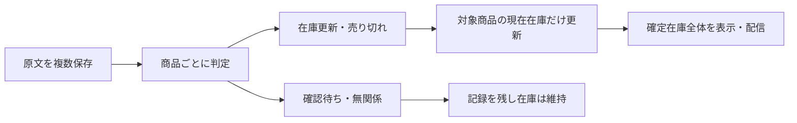

# LINE在庫投稿の最新1件方式から商品単位反映への変更案

この文書は、在庫情報・〆・無関係な連絡が混在しても、対象の商品だけを更新するための設計草案です。
親: [提供元フィード翻訳](../../specs/inventory-management/feed-translation/README.md)。
調査: [recon.md](recon.md)。
ADR: [ADR-154](../../adr/ADR-154-tcg-parity02-gas-python-migration.md)、[ADR-113](../../adr/ADR-113-two-mode-dev-flow.md)。

## 2026-09-13の状態

文書PR: https://github.com/shingo-ops/salesanchor/pull/3456 （提出済み・未マージ）。

区分: 既存の延長・修正。従来のSQR-05設計を本ファイルの末尾へ原文のまま残し、同じ保存先に改訂案を置く。
PO合意済み: 商品を指定した〆は売り切れ・数量0として在庫表示から除外する。他商品を維持する。原文を複数保存する。混在投稿は商品ごとに判断する。投稿に無い商品は維持する。
技術方式・DB追加項目・API・切替手順は以下の草案。自己審査はREVISE。実装カード未発行、製品実装・DB操作・マージ・本番反映・再解析・シート配信は本セッション未実施。
GO委任は未有効として扱う。文書作成・提出を実装承認または代理GOに読み替えない。

## 1. POの願いと合意

PO原文（今回の会話から逐語転記）:

> 合意、〆は売り切れの意味で在庫数量を0の意味なので在庫情報から消してほしいが、現状だと〆の商品以外も上書きして消してしまう方式だと考えている、なので商品Aが〆と連絡が来たら商品Aのみ在庫から削除、ほかは維持する仕組みが欲しい

> 現状はメッセージを1つしか登録出来ない仕様のため、〆のメッセージを登録する専用の列がない、〆を記録しておくための列があった方が良いと考えるがどうか？

> ハイブリッドが届くとどうなる？在庫情報の中に〆や売り切れの商品も含まれている場合

説明した混在例: A在庫10・B〆・C売り切れならA=10、B/C=0・非表示、記載の無いDは維持。原文と商品単位の判定・更新内容を保存し、対象不明の〆は確認待ちとする。
この説明に対するPO返答原文: 「ルカイした進めてくれ」。
受領日は2026-09-13。発話の送信秒は記録しない。上記合意から技術方式全体の承認を創作しない。

## 2. 目的・対象・対象外

対象: Sales AnchorのLINEファイル取込（即時確定と仕入元解決後の確定）、原文保存、抽出・解析、反映履歴、現在在庫、既存の在庫出力・配信との接続。
目的: 指定商品の売り切れ反映と、対象外商品の不変を同時に満たす。
対象外: Discord経路の変更、CRM自社在庫・受発注数量、商品マスタ本体の削除/無効化、既存商品の意味変更、無関係な作品判定改善、GO制度、認証・課金・secrets・CI弱体化。
「削除」は仕入元の現在在庫を数量0にして表示/配信から除外する意味。原文・判定・更新履歴と商品マスタは削除しない。

## 3. KGIと受入基準

以下は要求・未実施の検証計画。合成入力の現行挙動確認を改善後の合格数に数えない。

| ID | 基準 | 検証方法 |
|---|---|---|
| K1 | A〆で対象在庫Aが数量0・通常在庫表示/配信から除外、B/Cの全業務値変更0 | 反映前後の行比較と出力比較 |
| K2 | A更新・B〆・C売り切れが1投稿に混在しても3商品が個別反映、未記載D変更0 | 同一投稿の4商品fixtureで数量/価格/状態/根拠を比較 |
| K3 | 無関係な投稿の在庫変更0、対象不明の〆による在庫変更0 | 原文・確認待ち記録と在庫差分の照合 |
| K4 | 全取込対象原文が個別に保存/再利用され、最新以外の内容理由による棄却0 | 取込ウィンドウ内件数とimport_job_messages/source_messagesを照合 |
| K5 | 同一原文再取込・ジョブ再試行による二重反映0、古い通知/処理完了順逆転による新在庫の巻戻し0 | 重複・逆順・同時実行を実PostgreSQLで試験 |
| K6 | 別テナント・別仕入元・対象外の状態/単位の商品変更0 | 境界fixtureの全行比較 |
| K7 | 各反映から原文・対象商品・根拠箇所・前後値・判定版を100%追跡可能 | 全反映IDの参照検査。〆の後に再入荷しても〆履歴を保持 |
| K8 | 抽出/検証失敗による既存の確定在庫の消去0 | empty/error/部分パース失敗・途中停止の障害試験 |
| K9 | 接続シートごとに同じ確定在庫版から作った期待出力と全行一致、対象外行消失0 | QA配信先で全行差分と配信履歴を検証。本番は別GO後 |
| K10 | 既存UIの数量/提供者/価格/状態/原文導線が維持され、無関係/確認待ち/反映済みを区別 | API契約検査と日本語/英語の画面試験 |

KPI: 本文書時点の改善後実装検証は0/10（未実装）。対象外不変とは業務値と元の在庫根拠を含み、単なる総件数一致ではない。

## 4. 変更前後・処理の分離

現在: メッセージ一覧 → 仕入元別に最新1件 → 古い原文全体を無効化 → 最新原文の解析行だけ配信。
変更案: 全原文を個別保存 → 原文中の明細を抽出 → 各明細の種類/対象を確定 → 対象の現在在庫だけ反映 → 確定した現在在庫を配信。



| 保存対象 | 役割 | 案の必須項目 |
|---|---|---|
| 原文 | 届いた事実。既存source_messagesを再利用 | 原文ID、supplier_channel_id、本文、投稿時刻、取込とのリンク。〆も独立した原文行 |
| メッセージ判定 | 全体の案内用。更新命令として使わない | 原文ID、stock/closure/irrelevant/mixed/review、判定版、根拠、判定状態 |
| 明細判定・反映イベント | 1投稿内に異なる操作を保持 | 原文IDと明細位置、stock_update/sold_out/ignore/review、商品/状態/単位、根拠箇所、値の明示有無、判定版、前後値、反映状態 |
| 現在在庫 | 出力用に確定した現時点の値 | 仕入元チャネル・商品・状態・単位、数量/価格/備考等、最終反映イベント、投稿時刻、更新版 |

物理DDLとAPIは未確定。既存analysis_resultsのstatusは商品状態マスタの処理に使われるため、そこへ投稿種別を流用しない。
投稿種類は明細判定の集約表示。mixedは正常な投稿の一種で、投稿を丸ごと〆扱いしない。
DBには既に複数原文を置ける（recon参照）。原文テーブルを複製せず、反映と現在在庫を追加専用で分離する案。

## 5. 商品ごとの反映契約案

### 5.1 対象の境界

- 対象をテナント → supplier_channel_id → product_id → 状態/単位の順に限定する。別仕入元の同名商品は変えない。
- 〆の価格が書かれていないことを理由に対象特定を拒否しない。既存在庫の識別と、新規在庫の価格検証は別にする。
- 商品だけ明記され、状態/単位の候補が既存在庫で1件ならその1件を候補とする。複数なら確認待ち。特定状態/単位が明示されればそれに限定する。
- 同一の商品/状態/単位に価格等の異なる複数行がある場合、勝手に1行へまとめない。識別キーの最終確定前に実データの重複調査を行う。
- 対象商品が未解決、指示語だけ、広い見出しだけ、商品名に似た語だけなら確認待ち。前の投稿全体へ〆を拡張しない。

### 5.2 更新・〆・混在

- stock_update: 明示された項目だけ変更。書かれていない価格/数量等をNULL/0で上書きしない。新規在庫として必須項目が足りなければ確認待ち。
- sold_out: 明示対象を数量0・売り切れにする。価格等は履歴に残し、現在在庫の通常表示と配信から除外する。
- ignore: 原文/判定のみ保存し、現在在庫は変更しない。
- review: 対象と根拠の不足理由を記録し、当該対象を変更しない。
- mixed: 各明細を上記規則で扱う。同一対象に「在庫10」と「〆」が衝突する場合、行順だけで選ばず当該対象を確認待ちとする。他の独立して確定した対象は反映候補にできる。
- 「〆ていません」「売り切れではない」「明日〆予定」「引用された過去の〆」は無条件にsold_outにしない。否定・将来・引用の根拠を判定し、判別不能はreview。
- 未記載商品は維持。「最新一覧」という見出しだけから未掲載商品の売り切れを推定しない。
- 新しい時刻の明示的な再入荷はその対象だけstock_updateにできる。古い〆の再送で再入荷を取り消さない。
- 「全品〆」等の一括指示は今回の自動適用対象外。具体的対象を確定する人の確認へ回す。

### 5.3 並行処理・再実行

- 原文は既存のチャネル/投稿時刻/本文hashによる同一性を再利用する。同じ原文を複数取込にリンクできる既存構造を保つ。
- 反映はメッセージ単位の確定バッチとし、候補作成中に現在在庫を変更しない。検証済み候補と確認待ち記録の保存を一緒に確定する。
- チャネルごとに反映を直列化し、数量/価格等の項目別に元の投稿時刻・イベントを追跡する。古い通知で新しい値を巻き戻さない。
- 同じ投稿分に異なる内容があると、現行LINE時刻の分解能では前後を証明できない場合がある。相反する同時刻の同一対象操作は確認待ちとし、UUIDや処理完了時刻を業務順序に使わない。
- 再解析は新しい判定版を候補作成する操作。適用済み版と同一視せず、変更対象・訂正・人の確定値との競合を確認する。自動で過去の反映を取り消さない。
- 在庫と反映履歴は同一トランザクションで確定し、配信は確定済みの版だけ読む。既存の未完了ジョブ配信ガードは維持する。
- emptyは「在庫0件」と同義にしない。本文分類とパース完了の根拠がないempty/errorから現在在庫を消さない。

## 6. 影響ファイルと差分案

以下は実装候補の責任範囲であり、実装カードの確定ファイル一覧ではない。

| 現行ファイル・根拠 | 変更案 |
|---|---|
| backend/app/services/tcg_line_import_svc.py:273,327,579 | 最新1件の採用を全原文の個別保存へ。原文新着時のチャネル全体supersedeを在庫更新に使わない |
| backend/app/routers/tcg_line_import.py:621 | 仕入元解決後の確定でも同じ原文保存経路を使う。直接取込との挙動差0 |
| backend/app/services/gemini_extraction_svc.py:190,303 | 種類・操作・根拠を持つ明細形式と部分失敗の検出。具体出力契約は要検証 |
| backend/app/services/tcg_analyzer_svc.py:495,1062 | 商品照合・数量等の解析結果を反映候補へ接続。既存マスタ処理順と商品状態を保持 |
| backend/app/tasks/tcg_extraction.py | 抽出/解析完了と在庫反映完了を区別し、再試行・再解析を接続 |
| backend/app/services/tcg_distribution_svc.py:183,229,463,675 | 原文のis_activeでなく確定現在在庫を出力元にする。シートの全置換へ〆差分だけを渡さない |
| backend/app/services/tcg_analysis_review_svc.py:31 | 解析履歴と現在在庫を区別。〆の記録を通常在庫から消しても履歴で見られるようにする |
| backend/app/services/tcg_import_progress.py | 原文件数・分類・確認待ち・反映状態を取込単位で集計する |
| migrations/ 配下の新規追加SQL・適用経路 | 判定/イベント/現在在庫の追加専用構造。SQL作成は実装承認後 |
| frontend の既存TCG取込・解析レビュー画面/API型/i18n | 種類と商品別反映結果・確認待ちの表示。具体API/UI契約の確定が必要 |
| backend/tests/test_tcg_line_import.py:328,399,509 | 最新1件採用を正解とするテストを新しい複数原文・商品単位契約へ変更 |

## 7. 切替・過去在庫の扱い

- 過去の全is_activeをTRUEにする復旧は禁止。過去の売り切れ商品まで再出現するため。
- 切替前の現行出力/有効解析と原文の対応を読み取り、初期在庫候補を作る。重複・商品未解決・元時刻不明を人に見える形で分ける。
- 最新1件採用時に保存されなかった投稿はDBだけでは復元できない。元ファイル等の有無を確認し、復元対象を別に決める。過去消失の全面復旧は本設計の完成条件に暗黙追加しない。
- 追加構造のみ導入 → QAで候補生成（外部配信なし）→ 人の正解と現行出力を比較 → 最新の設計/実装レビューと試験 → POの切替GO、の順。
- 既存のis_activeを履歴側に残すだけでは表示・診断・配信が一致しない。依存箇所を同時に切り替える契約と停止条件を実装カード発行前に確定する。
- 初期化失敗は候補を公開せず旧出力を保持。切替後に旧出力へ戻すと既に〆た商品が復活するので、自動ロールバックは設計しない。確定版を保持して配信停止・調査へ進む。

## 8. 代替案とトレードオフ

| 案 | 評価 |
|---|---|
| 〆専用の単一テキスト列 | 連続する〆で上書き、混在・対象・反映履歴を表せないため不採用 |
| 〆投稿を読み飛ばして旧原文を残す | 巻き添えは減るが売り切れが在庫に残るため不採用 |
| 全投稿を1文字列へ連結して既存抽出 | 投稿境界/時刻/重複/再入荷の順序が曖昧になるため不採用 |
| 全原文＋明細操作＋現在在庫を分離 | 推奨草案。混在と対象外不変を表せるが、保存量・抽出回数・切替手順・検証対象が増える |

在庫を残す安全側の扱いでは、対象不明の〆がある間は古い在庫が表示され得る。確認待ちを目立たせ、誤った自動削除と人の確認待ちを分けて管理する。
取込対象全原文を保存しても、無関係文を判定するまでの解析費用は増え得る。費用・処理時間は現在未計測で、実データ候補生成で測る。

## 9. 接触面分析（6面）

| 面 | 影響と対処 |
|---|---|
| 人 | 仕入元別・商品別の〆と確認待ちを見られる。曖昧な品種・単位は人の判断が残る |
| エージェント | 旧「最新1件が正解」のカードを流用しない。#3441/#3417等の並行変更は確定HEADを再照合。自己審査を独立レビューと呼ばない |
| 機械 | 取込/抽出/再解析/配信/再試行/テストが接触。ジョブdoneだけで反映・配信済みとしない |
| データ | 追加専用・履歴保持・テナントとチャネルの隔離。tenant_004へ今回はアクセスも変更もしない |
| 本番 | 切替前後の在庫版と配信先を固定する実機検証が必要。マージ/自動deploy/移行は別承認 |
| 外部 | 既存シート全置換は現在在庫の全体像を受け取る必要がある。商品差分だけを全置換に渡さない |

## 10. 外部・過去事例の参照と我々への応用

外部事例は該当なし。既存コードの契約変更であり、外部の成功率は今回の意味判定や在庫維持を証明しない。
自リポジトリのSQR-05移植PR #3293（2026-09-05マージ確認）は最新1件方式をテストで保証していた。今回はその成功条件と新しいPO合意が異なる。
固定SHAの現行関数を合成3ケースで直接実行し、3/3で最新本文だけが残ることを観測した（詳細recon）。本番の被害件数・新方式の精度に読み替えない。
ライブラリ/API仕様の外部調査は今回行っていない。外部サービスへ送信0・DBアクセス0。実装でAPI/DBライブラリ仕様を調べるときはContext7を利用し、利用不可なら許可済みの公式資料代替を記録する。

## 11. Architect自己審査（2026-09-13）

判定: **REVISE（実装カード発行不可）**。同じAIがPlanner後に行った自己審査であり、独立した第二者レビューではない。

| 審査軸 | 結果・根拠 |
|---|---|
| PO合意との一致 | ○。〆=数量0・対象だけ除外・未記載維持・混在明細別をK1〜K3と§5に対応 |
| 現行原因の根拠 | ○。最新1件選択、保存時の全supersede、表示/出力is_active条件、シート全置換を実物確認。合成3ケース観測 |
| 既存仕様との整合 | 改訂が必要。旧SQR-05のテストと運用は最新1件を要求。履歴を保持し改訂案を明示したが切替後の全依存契約は未確定 |
| 受入条件の検証可能性 | ○。全行比較・境界・逆順・二重反映・原文追跡・失敗時保持を定義 |
| 実装範囲の確定 | ×。物理DDL/API/画面項目/統合反映処理と初期化の確定版が未完成 |
| 事実に基づく実行可能性 | ×。実在庫の行識別重複、実メッセージの正解集合、初期化の実機比較、失敗/並行の実PG試験が未実施 |
| 安全な停止 | ○。未確認を無視してGO/実装カードを発行しない。代理GOなし |

未解決事項と次の一手:
1. 許可された読取経路で、在庫/〆/混在/無関係/否定/再入荷/対象不明の実例と現在在庫の識別重複を調査する。私的原文は公開PRへ載せず、匿名例と出典hash・集計のみ残す。
2. 実物に沿って物理DDL・API・UI・反映トランザクション・切替/復旧手順を確定し、本ファイルとreconを更新する。未計測の費用/時間も測る。
3. 真の分類精度と在庫差分を独立した正解集合で照合して再審査する。正式カードはREVISE解消後にcard-lintと人手チェックを行う。本便ではカードを作らない。

## 維持の仕組み

守り手: .github/workflows/process-artifacts-gate.yml、.github/workflows/adr-index-check.yml、.github/workflows/task-state-check.yml（文書の形式・索引・台帳）。
実装後の守り手候補: backend/tests/test_tcg_line_import.py、backend/tests/test_tcg_distribution.py と .github/workflows/test.yml。現在は新KGIを保証しない。新しい回帰試験と実PostgreSQL試験を実装カードへ含める。
人手で守る: POによる実例の正解確認、独立Reviewer/Evaluatorによる実装/画面の確認、切替前後の在庫/全配信先比較。未実装の検査を既設と書かない。

---

## 旧設計の原文（履歴・2026-09-05のSQR-05）

以下は旧方式の当時の根拠であり、今回改訂案の実装指示として使用しない。

# design — tcg-import-latest-only (SQR-05 移植)

参照: docs/handoff/tcg-import-latest-only/recon.md
ADR 参照: ADR-154

## KGI / 検証基準

| 基準 | 検証方法 |
|------|---------|
| `build_provider_entries` が同一仕入元の複数メッセージのうち最新1件のみを `raw_text` に採用する | `pytest backend/tests/test_tcg_line_import.py::test_build_latest_only_with_three_messages` PASS |
| `skipped_message_count` フィールドが棄却件数を正しく返す | `pytest backend/tests/test_tcg_line_import.py::test_build_skipped_message_count_single` PASS |
| 既存テストが全件 PASS | `pytest backend/tests/test_tcg_line_import.py --no-cov` 31 passed |

## 外部・過去事例の参照と我々への応用

GAS 側の tcg-inventory-parser で 2026-08-30 に SQR-05（PR #279）として
「仕入元ごとに最新メッセージのみ採用」へ変更済み。本PRはその移植であり、
Python 版が SQR-05 以前の全件結合ロジックのまま残っていた乖離を解消する。

## 修正方針

GAS SQR-05（PR #279）の変更を Python 版に移植する。

### 変更箇所

**`backend/app/services/tcg_line_import_svc.py`**

`build_provider_entries`（line 221）:

```python
# 変更前
raw_text = _MSG_SEPARATOR.join(m["body"] for m in sorted_msgs)

# 変更後
latest_msg = sorted_msgs[-1]
raw_text = latest_msg["body"]
skipped_message_count = len(sorted_msgs) - 1
```

戻り値に `"skipped_message_count": skipped_message_count` を追加。

`import_line_export`:
- step4 後に `skipped_message_count = sum(e["skipped_message_count"] for e in provider_entries)` を追加
- `already_imported` / `imported` 両方の戻り値 dict に `"skipped_message_count"` を追加

**`backend/app/routers/tcg_line_import.py`**

`ImportResultResponse` に `skipped_message_count: int` フィールドを追加（GAS の skippedMessageCount に対応）。

### 戻し方

`sorted_msgs[-1]["body"]` → `_MSG_SEPARATOR.join(m["body"] for m in sorted_msgs)` に戻す（1行）。
`ImportResultResponse.skipped_message_count` を削除。
ただし本修正が正しい対応であり revert 不要。

## 維持の仕組み

守り手: `backend/tests/test_tcg_line_import.py` の
test_build_latest_only_with_three_messages / test_build_skipped_message_count_single
（同一仕入元の複数メッセージから最新1件のみが採用されることを検証、CI pytest で毎PR実行）
