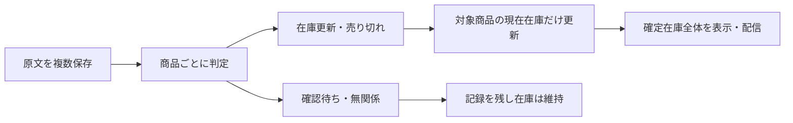

# LINE在庫投稿の最新1件方式から商品単位反映への変更案

この文書は、在庫情報・〆・無関係な連絡が混在しても、対象の商品だけを更新するための設計草案です。
親: [提供元フィード翻訳](../../specs/inventory-management/feed-translation/README.md)。
調査: [recon.md](recon.md)。
ADR: [ADR-154](../../adr/ADR-154-tcg-parity02-gas-python-migration.md)、[ADR-113](../../adr/ADR-113-two-mode-dev-flow.md)。

## 2026-09-13の状態

現行契約の索引は§24、数量・発送枠は§25、追加実例と既存更新経路は§26、保存・再解析確認・配信の現行契約は§27へ統合済み。旧§28/29は§27へ吸収した。過去追補の未確定記録だけで現在の状態を判断しない。

文書PR: https://github.com/shingo-ops/salesanchor/pull/3456 （提出済み・未マージ）。

区分: 既存の延長・修正。従来のSQR-05設計を本ファイルの末尾へ原文のまま残し、同じ保存先に改訂案を置く。
PO合意済み: 商品を指定した〆は売り切れ・数量0として在庫表示から除外する。他商品を維持する。原文を複数保存する。混在投稿は商品ごとに判断する。投稿に無い商品は維持する。
技術方式・DB追加項目・API・切替手順は以下の草案。全体設計の同一AI自己審査はAPPROVE（§11）。第1便の純粋部品カードは作成済み、後続カードは未発行。技術方式全体のPO承認や製品合格を意味しない。第1便は明示委任した実装担当が新規4部品/試験を作成し検収済み。追加委任を経て製品commit0c90de21と製品PR3471（HEAD53479dbf）へ正式保存済み（reconの製品PR提出記録）。既存処理への接続・DB操作・マージ・本番反映・再解析・シート配信は未実施。
GO委任は未有効として扱う。文書作成・提出を実装承認または代理GOに読み替えない。

## 1. POの願いと合意

PO原文（今回の会話から逐語転記）:

> 合意、〆は売り切れの意味で在庫数量を0の意味なので在庫情報から消してほしいが、現状だと〆の商品以外も上書きして消してしまう方式だと考えている、なので商品Aが〆と連絡が来たら商品Aのみ在庫から削除、ほかは維持する仕組みが欲しい

> 現状はメッセージを1つしか登録出来ない仕様のため、〆のメッセージを登録する専用の列がない、〆を記録しておくための列があった方が良いと考えるがどうか？

> ハイブリッドが届くとどうなる？在庫情報の中に〆や売り切れの商品も含まれている場合

説明した混在例: A在庫10・B〆・C売り切れならA=10、B/C=0・非表示、記載の無いDは維持。原文と商品単位の判定・更新内容を保存し、対象不明の〆は確認待ちとする。
この説明に対するPO返答原文: 「ルカイした進めてくれ」。
受領日は2026-09-13。発話の送信秒は記録しない。上記合意から技術方式全体の承認を創作しない。

## 2. 目的・対象・対象外

対象: Sales AnchorのLINEファイル取込（即時確定と仕入元解決後の確定）、原文保存、抽出・解析、反映履歴、現在在庫、既存の在庫出力・配信との接続。
目的: 指定商品の売り切れ反映と、対象外商品の不変を同時に満たす。
対象外: Discord経路の変更、CRM自社在庫・受発注数量、商品マスタ本体の削除/無効化、既存商品の意味変更、無関係な作品判定改善、GO制度、認証・課金・secrets・CI弱体化。
「削除」は仕入元の現在在庫を数量0にして表示/配信から除外する意味。原文・判定・更新履歴と商品マスタは削除しない。

## 3. KGIと受入基準

以下は要求・未実施の検証計画。合成入力の現行挙動確認を改善後の合格数に数えない。

| ID | 基準 | 検証方法 |
|---|---|---|
| K1 | A〆で対象在庫Aが数量0・通常在庫表示/配信から除外、B/Cの全業務値変更0 | 反映前後の行比較と出力比較 |
| K2 | A更新・B〆・C売り切れが1投稿に混在しても3商品が個別反映、未記載D変更0 | 同一投稿の4商品fixtureで数量/価格/状態/根拠を比較 |
| K3 | 無関係な投稿の在庫変更0、対象不明の〆による在庫変更0 | 原文・確認待ち記録と在庫差分の照合 |
| K4 | 全取込対象原文が個別に保存/再利用され、最新以外の内容理由による棄却0 | 取込ウィンドウ内件数とimport_job_messages/source_messagesを照合 |
| K5 | 同一原文再取込・ジョブ再試行による二重反映0、古い通知/処理完了順逆転による新在庫の巻戻し0 | 重複・逆順・同時実行を実PostgreSQLで試験 |
| K6 | 別テナント・別仕入元・対象外の状態/単位の商品変更0 | 境界fixtureの全行比較 |
| K7 | 各反映から原文・対象商品・根拠箇所・前後値・判定版を100%追跡可能 | 全反映IDの参照検査。〆の後に再入荷しても〆履歴を保持 |
| K8 | 抽出/検証失敗による既存の確定在庫の消去0 | empty/error/部分パース失敗・途中停止の障害試験 |
| K9 | 接続シートごとに同じ確定在庫版から作った期待出力と全行一致、対象外行消失0 | QA配信先で全行差分と配信履歴を検証。本番は別GO後 |
| K10 | 既存UIの数量/提供者/価格/状態/原文導線が維持され、無関係/確認待ち/反映済みを区別 | API契約検査と日本語/英語の画面試験 |

KPI: 本文書時点の改善後実装検証は0/10（未実装）。対象外不変とは業務値と元の在庫根拠を含み、単なる総件数一致ではない。

## 4. 変更前後・処理の分離

現在: メッセージ一覧 → 仕入元別に最新1件 → 古い原文全体を無効化 → 最新原文の解析行だけ配信。
変更案: 全原文を個別保存 → 原文中の明細を抽出 → 各明細の種類/対象を確定 → 対象の現在在庫だけ反映 → 確定した現在在庫を配信。



| 保存対象 | 役割 | 案の必須項目 |
|---|---|---|
| 原文 | 届いた事実。既存source_messagesを再利用 | 原文ID、supplier_channel_id、本文、投稿時刻、取込とのリンク。〆も独立した原文行 |
| メッセージ判定 | 全体の案内用。更新命令として使わない | 原文ID、stock/closure/irrelevant/mixed/review、判定版、根拠、判定状態 |
| 明細判定・反映イベント | 1投稿内に異なる操作を保持 | 原文IDと明細位置、stock_update/sold_out/ignore/review、商品/状態/単位、根拠箇所、値の明示有無、判定版、前後値、反映状態 |
| 現在在庫 | 出力用に確定した現時点の値 | 販売枠ID、仕入元チャネル・商品・状態・単位・価格別枠/発送条件、数量/価格/備考等、最終反映イベント、投稿時刻、更新版 |

物理DDLとAPIは未確定。既存analysis_resultsのstatusは商品状態マスタの処理に使われるため、そこへ投稿種別を流用しない。
投稿種類は明細判定の集約表示。mixedは正常な投稿の一種で、投稿を丸ごと〆扱いしない。
DBには既に複数原文を置ける（recon参照）。原文テーブルを複製せず、反映と現在在庫を追加専用で分離する案。

## 5. 商品ごとの反映契約案

### 5.1 対象の境界

- 対象をテナント → supplier_channel_id → product_id → 状態/単位/価格別販売枠/発送日・便の順に限定する。別仕入元の同名商品は変えない。
- 〆の価格が書かれていないことを理由に対象特定を拒否しない。既存在庫の識別と、新規在庫の価格検証は別にする。
- 商品だけ明記され、販売条件（状態/単位/価格枠/発送分）まで含め既存在庫の候補が1件ならその1件を候補とする。複数なら確認待ち。明示された販売条件で候補を限定し、見分けられなければ商品全体を0にしない。
- 同一の商品/状態/単位に価格等の異なる複数行がある場合、勝手に1行へまとめない。識別キーの最終確定前に実データの重複調査を行う。
- 対象商品が未解決、指示語だけ、広い見出しだけ、商品名に似た語だけなら確認待ち。前の投稿全体へ〆を拡張しない。

### 5.2 更新・〆・混在

- stock_update: 明示された項目だけ変更。書かれていない価格/数量等をNULL/0で上書きしない。新規在庫として必須項目が足りなければ確認待ち。
- sold_out: 明示対象を数量0・売り切れにする。価格等は履歴に残し、現在在庫の通常表示と配信から除外する。
- ignore: 原文/判定のみ保存し、現在在庫は変更しない。
- review: 対象と根拠の不足理由を記録し、当該対象を変更しない。
- mixed: 各明細を上記規則で扱う。同一対象に「在庫10」と「〆」が衝突する場合、行順だけで選ばず当該対象を確認待ちとする。他の独立して確定した対象は反映候補にできる。
- 「〆ていません」「売り切れではない」「明日〆予定」「引用された過去の〆」は無条件にsold_outにしない。否定・将来・引用の根拠を判定し、判別不能はreview。
- 未記載商品は維持。「最新一覧」という見出しだけから未掲載商品の売り切れを推定しない。
- 新しい時刻の明示的な再入荷はその対象だけstock_updateにできる。古い〆の再送で再入荷を取り消さない。
- 「全品〆」等の一括指示は今回の自動適用対象外。具体的対象を確定する人の確認へ回す。

### 5.3 並行処理・再実行

- 原文は既存のチャネル/投稿時刻/本文hashによる同一性を再利用する。同じ原文を複数取込にリンクできる既存構造を保つ。
- 反映はメッセージ単位の確定バッチとし、候補作成中に現在在庫を変更しない。検証済み候補と確認待ち記録の保存を一緒に確定する。
- チャネルごとに反映を直列化し、数量/価格等の項目別に元の投稿時刻・イベントを追跡する。古い通知で新しい値を巻き戻さない。
- 同じ投稿分に異なる内容があると、現行LINE時刻の分解能では前後を証明できない場合がある。相反する同時刻の同一対象操作は確認待ちとし、UUIDや処理完了時刻を業務順序に使わない。
- 再解析は新しい判定版を候補作成する操作。適用済み版と同一視せず、変更対象・訂正・人の確定値との競合を確認する。自動で過去の反映を取り消さない。
- 在庫と反映履歴は同一トランザクションで確定し、配信は確定済みの版だけ読む。既存の未完了ジョブ配信ガードは維持する。
- emptyは「在庫0件」と同義にしない。本文分類とパース完了の根拠がないempty/errorから現在在庫を消さない。

## 6. 影響ファイルと差分案

以下は実装候補の責任範囲であり、実装カードの確定ファイル一覧ではない。

| 現行ファイル・根拠 | 変更案 |
|---|---|
| backend/app/services/tcg_line_import_svc.py:273,327,579 | 最新1件の採用を全原文の個別保存へ。原文新着時のチャネル全体supersedeを在庫更新に使わない |
| backend/app/routers/tcg_line_import.py:621 | 仕入元解決後の確定でも同じ原文保存経路を使う。直接取込との挙動差0 |
| backend/app/services/gemini_extraction_svc.py:190,303 | 種類・操作・根拠を持つ明細形式と部分失敗の検出。具体出力契約は要検証 |
| backend/app/services/tcg_analyzer_svc.py:495,1062 | 商品照合・数量等の解析結果を反映候補へ接続。既存マスタ処理順と商品状態を保持 |
| backend/app/tasks/tcg_extraction.py | 抽出/解析完了と在庫反映完了を区別し、再試行・再解析を接続 |
| backend/app/services/tcg_distribution_svc.py:183,229,463,675 | 原文のis_activeでなく確定現在在庫を出力元にする。シートの全置換へ〆差分だけを渡さない |
| backend/app/services/tcg_analysis_review_svc.py:31 | 解析履歴と現在在庫を区別。〆の記録を通常在庫から消しても履歴で見られるようにする |
| backend/app/services/tcg_import_progress.py | 原文件数・分類・確認待ち・反映状態を取込単位で集計する |
| migrations/ 配下の新規追加SQL・適用経路 | 判定/イベント/現在在庫の追加専用構造。SQL作成は実装承認後 |
| frontend の既存TCG取込・解析レビュー画面/API型/i18n | 種類と商品別反映結果・確認待ちの表示。具体API/UI契約の確定が必要 |
| backend/tests/test_tcg_line_import.py:328,399,509 | 最新1件採用を正解とするテストを新しい複数原文・商品単位契約へ変更 |

## 7. 切替・過去在庫の扱い

- 過去の全is_activeをTRUEにする復旧は禁止。過去の売り切れ商品まで再出現するため。
- 切替前の現行出力/有効解析と原文の対応を読み取り、初期在庫候補を作る。重複・商品未解決・元時刻不明を人に見える形で分ける。
- 最新1件採用時に保存されなかった投稿はDBだけでは復元できない。元ファイル等の有無を確認し、復元対象を別に決める。過去消失の全面復旧は本設計の完成条件に暗黙追加しない。
- 追加構造のみ導入 → QAで候補生成（外部配信なし）→ 人の正解と現行出力を比較 → 最新の設計/実装レビューと試験 → POの切替GO、の順。
- 既存のis_activeを履歴側に残すだけでは表示・診断・配信が一致しない。依存箇所を同時に切り替える契約と停止条件を実装カード発行前に確定する。
- 初期化失敗は候補を公開せず旧出力を保持。切替後に旧出力へ戻すと既に〆た商品が復活するので、自動ロールバックは設計しない。確定版を保持して配信停止・調査へ進む。

## 8. 代替案とトレードオフ

| 案 | 評価 |
|---|---|
| 〆専用の単一テキスト列 | 連続する〆で上書き、混在・対象・反映履歴を表せないため不採用 |
| 〆投稿を読み飛ばして旧原文を残す | 巻き添えは減るが売り切れが在庫に残るため不採用 |
| 全投稿を1文字列へ連結して既存抽出 | 投稿境界/時刻/重複/再入荷の順序が曖昧になるため不採用 |
| 全原文＋明細操作＋現在在庫を分離 | 推奨草案。混在と対象外不変を表せるが、保存量・抽出回数・切替手順・検証対象が増える |

在庫を残す安全側の扱いでは、対象不明の〆がある間は古い在庫が表示され得る。確認待ちを目立たせ、誤った自動削除と人の確認待ちを分けて管理する。
取込対象全原文を保存しても、無関係文を判定するまでの解析費用は増え得る。費用・処理時間は現在未計測で、実データ候補生成で測る。

## 9. 接触面分析（6面）

| 面 | 影響と対処 |
|---|---|
| 人 | 仕入元別・商品別の〆と確認待ちを見られる。曖昧な品種・単位は人の判断が残る |
| エージェント | 旧「最新1件が正解」のカードを流用しない。#3441/#3417等の並行変更は確定HEADを再照合。自己審査を独立レビューと呼ばない |
| 機械 | 取込/抽出/再解析/配信/再試行/テストが接触。ジョブdoneだけで反映・配信済みとしない |
| データ | 追加専用・履歴保持・テナントとチャネルの隔離。tenant_004へ今回はアクセスも変更もしない |
| 本番 | 切替前後の在庫版と配信先を固定する実機検証が必要。マージ/自動deploy/移行は別承認 |
| 外部 | 既存シート全置換は現在在庫の全体像を受け取る必要がある。商品差分だけを全置換に渡さない |

## 10. 外部・過去事例の参照と我々への応用

外部事例は該当なし。既存コードの契約変更であり、外部の成功率は今回の意味判定や在庫維持を証明しない。
自リポジトリのSQR-05移植PR #3293（2026-09-05マージ確認）は最新1件方式をテストで保証していた。今回はその成功条件と新しいPO合意が異なる。
固定SHAの現行関数を合成3ケースで直接実行し、3/3で最新本文だけが残ることを観測した（詳細recon）。本番の被害件数・新方式の精度に読み替えない。
ライブラリ/API仕様の外部調査は今回行っていない。外部サービスへ送信0・DBアクセス0。実装でAPI/DBライブラリ仕様を調べるときはContext7を利用し、利用不可なら許可済みの公式資料代替を記録する。

## 11. Architect最終査定（2026-09-13）

**全体: APPROVE（設計合格）／第1便: APPROVE。** 同じAIがPlannerとして範囲と契約を固定した後に自己審査した。独立した第二者レビューではない。

前回の3残件は§20.1（再解析解決）、§20.2（在庫/配信操作）、§21.1と§27（切替保存と制約）で解消した。設計を作成後、既存配信入口・原文リンク・制約・状態遷移との整合を同一AIで審査した。設計合格は技術方式全体のPO承認、製品検証、切替GOを兼ねない。元のPO要件を変更する決定はない。

| 前回の残件 | 今回固定した内容 | 審査上の限界 |
|---|---|---|
| 現在在庫と配信保留の操作 | 一覧/詳細/公開履歴/retry/pause/resume、既存preview/runとの接続、型と拒否条件 | 強制送信や自由な在庫上書きは提供しない |
| 切替の永続保存 | 6表の統合列定義、baseline publication、制御1行、原文inbox、commit境界のseq | 複数世代の再移行は対象外。初回切替は別の本番カード/GO必須 |
| 再解析で意味が変化 | 同一枠の項目訂正と前回値支持を監査付きで分離、後続通知は409で保護 | 商品間移動や根拠不足は保留。人が支持できない旧値を強制承認しない |

審査中に見つけた2つの矛盾も修正した。legacyでのpauseはbaseline未作成でも許可する。切替候補はpaused/shadowを必要条件とする専用検査で作り、通常送信のpaused拒否と混同しない。未settledのまま先にpauseして処理不能になる順序も、ロック内で検査してからfreezeする順へ修正した。

残る実測は実装後のK1〜K10・実PG/AI/UI/配信・切替リハーサル。実装合格数0/10のまま。後続カードはこの設計を便ごとの確定ファイル一覧へ落として正式チェックする。今回は第1便カードの範囲を拡張せず、後続の実装開始・マージ・本番操作は行わない。

第1便はこれらに依存しない純粋部品4ファイルに限定する。受入入力/結果、関数の型、原文位置、例外、数値範囲、依存禁止を§15に固定した。範囲外への接続は禁止として分割審査する。

| 審査軸 | 第1便の判定・根拠 |
|---|---|
| PO合意 | ○。商品単位反映の前提となる原文保持・誤数量拒否。〆の対象判断や状態を書き換えない |
| 現行根拠 | ○。§25の未変更数量関数5例で3不一致。§22の既存raw欄/位置情報を参照 |
| 最新main | ○。af269ae20ed2f52e6cd49ba0403ad7799e3a3870のv4 p1/p2・Android照合分岐を読取確認。本便の新規4ファイルと衝突しない |
| 契約・受入 | ○。§15の6試験群、値/保留/例外を固定。製品試験は未実施 |
| CI・運用 | ○。標準ライブラリ部品をunittest/pytest共通で検査。既存チェックを緩めず、DB/AI/本番を使わない |
| 維持 | ○。新しい2テストファイルを将来のbackend pytest収集に含める。全体配信の保証は後続の実PG/API/UI試験 |

正式カード: [card-stock-contract-01.md](card-stock-contract-01.md)。カードのチェック結果は同ファイル末尾。カード準備は実行開始を意味しない。本設計セッションは製品未変更・実装役未起動。

<details><summary>初回査定の履歴（現行判定ではない）</summary>

## 11. Architect自己審査（2026-09-13）

判定: **REVISE（実装カード発行不可）**。同じAIがPlanner後に行った自己審査であり、独立した第二者レビューではない。

| 審査軸 | 結果・根拠 |
|---|---|
| PO合意との一致 | ○。〆=数量0・対象だけ除外・未記載維持・混在明細別をK1〜K3と§5に対応 |
| 現行原因の根拠 | ○。最新1件選択、保存時の全supersede、表示/出力is_active条件、シート全置換を実物確認。合成3ケース観測 |
| 既存仕様との整合 | 改訂が必要。旧SQR-05のテストと運用は最新1件を要求。履歴を保持し改訂案を明示したが切替後の全依存契約は未確定 |
| 受入条件の検証可能性 | ○。全行比較・境界・逆順・二重反映・原文追跡・失敗時保持を定義 |
| 実装範囲の確定 | ×。物理DDL/API/画面項目/統合反映処理と初期化の確定版が未完成 |
| 事実に基づく実行可能性 | ×。実在庫の行識別重複、実メッセージの正解集合、初期化の実機比較、失敗/並行の実PG試験が未実施 |
| 安全な停止 | ○。未確認を無視してGO/実装カードを発行しない。代理GOなし |

未解決事項と次の一手:
1. 今回提供された2原文ファイル（§12）から分類の正解集合を作り、許可された読取経路で現在在庫の識別重複を調査する。私的原文は公開PRへ載せず、匿名例と出典hash・集計のみ残す。
2. 実物に沿って物理DDL・API・UI・反映トランザクション・切替/復旧手順を確定し、本ファイルとreconを更新する。未計測の費用/時間も測る。
3. 真の分類精度と在庫差分を独立した正解集合で照合して再審査する。正式カードはREVISE解消後にcard-lintと人手チェックを行う。本便ではカードを作らない。

## 維持の仕組み

守り手: .github/workflows/process-artifacts-gate.yml、.github/workflows/adr-index-check.yml、.github/workflows/task-state-check.yml（文書の形式・索引・台帳）。
実装後の守り手候補: backend/tests/test_tcg_line_import.py、backend/tests/test_tcg_distribution.py と .github/workflows/test.yml。現在は新KGIを保証しない。新しい回帰試験と実PostgreSQL試験を実装カードへ含める。
人手で守る: POによる実例の正解確認、独立Reviewer/Evaluatorによる実装/画面の確認、切替前後の在庫/全配信先比較。未実装の検査を既設と書かない。

</details>

## 12. 2026-09-13追補: 売り切れ語と誤判定防止条件の候補登録

PO依頼は、提供された2つのLINEファイルで〆/売切等を検索し、誤って売り切れにしない除外条件も登録することの設計検討。
本節は**文書上の候補登録**。本番tcg_status_masterの書込み・有効化はしない。

### 12.1 結論と既存実装との関係

肯定表現と誤判定防止条件を対で管理する案を採る。ただし単語ヒットは判定候補の抽出だけで、在庫を0にする命令ではない。
現在のtcg_status_masterにはsearch_pattern/exclude_patternの列があるが、load_status_masterはSELECTしたexclude_patternを戻り値へ含めず、resolve_status_v2もその条件を評価しない（backend/app/services/tcg_analyzer_svc.py:979-1060）。
したがって既存マスタに除外条件を書くだけでは保護にならない。旧effect=EXCLUDE（在庫出力から除外）と、新しい「売り切れ判定を抑止する条件」は意味を分ける。抑止時は対象の現在在庫を維持し、理由付きのno_actionまたはreviewを残す。

設計上の順序:
1. 本文中の商品/価格/状態/単位/発送分ごとに根拠区間を切り出す。
2. 肯定語を探して候補にする。意味の近い語の部分一致だけで確定しない。
3. 同じ対象・同じ文節の否定/仮定/未来/業務締切を評価する。
4. 明示された現在の売り切れと、将来の再入荷予定を別の事実として保持する。
5. 対象のoffer（仕入元の商品・販売条件の1枠）が一意なときだけsold_outを反映。対象不明・複数候補・条件衝突はreview。

### 12.2 候補語の登録表（全件disabled相当の草案）

観測値は2ファイルの該当**行数の合計**。同じ行の複数語/再投稿/ファイル間の重複を含み、実売り切れ件数ではない。詳しい方法とファイルhashはreconおよびprobe JSON参照。

| 候補ID | 語・型 | 観測行数 | 判定候補にする条件・制約 |
|---|---|---:|---|
| VC01 | 〆 | 4490 | 商品・販売枠を指定した現在の終了。ラベル締切/発送受付の終了を同一視しない |
| VC02 | 〆切 | 516 | 〆の部分集合。商品名付きの正例あり、一律に除外語へ入れない |
| VC03 | 完売 | 7008 | 現在の特定対象の断定。一般注意の「場合」は反例 |
| VC04 | 完売中 | 466 | 完売の部分集合。将来の入荷予定が併記されても現在の完売を取り消さない |
| VC05 | 売り切れ | 58 | 否定/仮定と対象を確認 |
| VC06 | 売切 / 売切れ | 790 / 9 | 後者は前者の部分集合。品目ブロックの対象を確認 |
| VC07 | 在庫切れ / 品切れ / 在庫なし | 27 / 2 / 38 | 梱包資材など販売対象外への言及を除く。商品名/属性が特定できなければ保留 |
| VC08 | sold out | 2 | 英語表現も候補。同じ商品でも旧価格分完売・別価格分提供可能がある |
| VC09 | 締切 / 締め切り / 終了 | 159 / 75 / 502 | 業務終了や注文受付等も混じる。単独で自動sold_outにしない |
| VC10 | 売り切り | 16 | 売り切りセールの観測。売り切れの同義語へ登録しない |
| VC11 | 売りきれ / 売切り / 在庫無し / 在庫無 / soldout | 各0 | 今回未観測。仮説候補としてのみ保持、正例なしで自動有効化しない |

### 12.3 誤判定防止は「単語の禁止リスト」ではなく対象を限定した条件

| 防止ID | 防ぐもの | 設計条件 | 実例根拠 |
|---|---|---|---|
| VG01 | 業務上の時刻締切を売り切れ扱い | 在庫有無に関係しない締切、ラベル作成、発送受付の対象なら在庫不変 | A:448,84917 |
| VG02 | 一般的な免責文を売り切れ扱い | 「売り切れる場合がある」等の可能性表現だけでは現在の売り切れを確定しない | A:2005,20098 |
| VG03 | 梱包資材の欠品で販売商品を消す | 欠品対象が梱包箱等ならTCG販売商品の在庫を変更しない | B:705265 |
| VG04 | 販売促進を売り切れ扱い | 売り切りセールをsell-outの同義としない | B:819695 |
| VG05 | 将来入荷の語で現在の完売を見逃す | 「完売、追加の可能性あり」は現在完売＋将来未確定。可能性/予定/入荷を丸ごと除外語にしない | A:31113,90252 / B:49283 |
| VG06 | 商品/販売条件違いを巻き添え | 価格、発送日/便、状態、単位の根拠で対象を限定。未限定なら確認待ち | B:165528,397088,264565 |
| VG07 | 〆切の語を一律除外し真の〆を見逃す | 商品指定の〆切は候補。〆切という語だけで売り切れ/非売り切れを決めない | A:39205 |
| VG08 | 明示否定を売り切れ扱い | 「売り切れではない」等は同対象・同文節の肯定候補を抑止 | 合成反例。今回の実例としては未確認 |

「発送」「予定」「可能性」「なし」「未」などの広い単語だけを否定条件にしない。「未来の一閃」のような商品名にも文字が現れる。原文全体へ一括適用せず、商品名領域と販売条件の文節を区別する。
規則が競合して解けないときは正例を勝手に消す/生かすのではなく、その対象だけ確認待ち。無関係な他商品には伝播させない。

### 12.4 候補マスタの必要情報（物理DDLは未確定）

rule_id、search_pattern、match_type、blocking_condition、blocking_scope、reason_code、適用対象（商品/販売枠/業務）、priority、version、enabled、正例ID、反例ID、根拠原文hash/位置、作成者/確認者・日時を持つ。
既存search_pattern/exclude_patternを再利用できる部分を優先するが、フラットなexclude_patternだけで文節や対象の関係を保証したとはしない。
登録時は正例と反例を一緒に通す。無効な正規表現・空パターン・意味上の衝突は有効化しない。新語を候補へ追加しても自動で稼働規則へ昇格させない。
ユーザーのいう「網」は広く候補を拾う層、「誤判定を防ぐ条件」は売り切れへの自動反映を絞る層。誤判定防止に一致した原文/商品行そのものを削除しない。

### 12.5 実例から追加する回帰ケース（改善後は未実行）

以下の例文は個人名・商品名・価格等を置き換えた**合成例**。実原文の転載ではない。これだけで実ファイル全体の精度を測らない。

| ID | 合成入力 | 期待結果 |
|---|---|---|
| VS01 | 商品A〆、商品B在庫10 | Aだけ0、B=10、未記載C不変 |
| VS02 | 商品Aは売り切れではない | Aを0にしない |
| VS03 | 問合せ時に売り切れの場合があります | 在庫不変 |
| VS04 | 在庫有無に関係なく18時で〆 | 在庫不変 |
| VS05 | 梱包箱が在庫切れ | 販売商品の在庫不変 |
| VS06 | 商品A 売り切りセール | 売り切れとして0にしない |
| VS07 | 商品A 完売、追加できる可能性あり | 対象Aは現在0。将来数量を作らない |
| VS08 | 商品A 発送分1完売、発送分2在庫3 | 発送分1だけ0、発送分2=3 |
| VS09 | 商品A 価格P1分売り切れ、価格P2分提供可能 | P1分だけ0。P2の数量は明示がなければ捏造しない |
| VS10 | 商品A〆切 | 一意な対象Aだけ0。業務締切を含む型なら文脈確認 |
| VS11 | 商品A未開封在庫10、開封済み分在庫なし | 開封済み分だけ0、未開封=10 |
| VS12 | 商品A〆、商品Bは売り切れではない | Aだけ0。Bの否定をAへ広げず、Aの肯定をBへ広げない |

K1/K2/K3/K6/K8の内訳として管理する。全12ケースの正例/反例/対象外不変が揃うことを規則有効化の前提にする。実原文の正解ラベルと独立した検証集合を別途確立し、未検証を精度100%としない。

### 12.6 自己審査の更新

**REVISE継続**。2ファイル全行の語検索、14根拠位置の文脈確認、既存exclude_patternの未使用を確認し、候補語と抑止条件を文書登録した。
実例により価格別/発送分別/状態別をまとめて商品0にしてはいけないことが明らかになった。§5.1の対象を販売枠まで細分化する。
残件は実在庫との対応（本番DB未照会）、正解集合の確立、物理DDL/API・画面の確定、反映・切替の実PG試験。今回の原文提供は解決済みであり、以前の「実例がない」を現在のブロッカーとして残さない。


## 13. 2026-09-13追補: 締切の適用範囲・発送枠・完売行の解析リスト表示

PO指定（原文抜粋）:
> 完売扱いでいいが解析リストには載せてステータスは完売にして追加可能性ありと備考に載せることは出来る？

本セッションの設計回答: 解析リストの行を保持し、表示ステータス「完売」、数量0、備考「追加可能性あり」。通常の在庫表示・配信からは除外する。発送分①の完売なら①だけに適用し、②の在庫/状態/備考へ伝播させない。原文・過去反映は保持。日本語/英語の表示は既存i18n規約に従う。
「追加可能性あり」は再入荷の確定数量ではない。後日の確定連絡まで0を維持する。解析リストALLと完売表示/検索から辿れ、投稿のsupersedeによって履歴を見失わないことをK7/K10の受入条件へ追加する。
完売と確定した行を、完売という理由だけで「判定失敗・要確認」に分類しない。対象不明・単位不明等の別の問題は独立して表示する。現行レビューのexclusion IS NOT NULL→NEEDS_REVIEWとの接続は改訂対象で、実装済みとはしない。

### 締切は一つの時刻にまとめない

実例の該当表示名400投稿中、在庫有無に関係しない17時30分の〆は1投稿。その同じ投稿に14時の当日発送条件もある。同一日別投稿には13時と15時の当日発送案内が存在する（recon参照）。
標準締切の自動推定・過去値の全投稿への一括適用はしない。締切の種類（当日発送/予約受付等）、適用日、対象商品または発送枠、原文根拠を別に記録する設計案とする。
同じ日の異なる時刻は、更新・条件差・誤記のどれかを原文だけでは確定できない。単に最後の時刻を全商品に採用しない。仕入元の標準ルール化はPO確認済みの適用条件が必要。
受付終了は売り切れと分ける。数量0とする根拠がなくても、受付終了した案内を注文可能として見せ続けることを防ぐ必要があり、受付可能状態と時刻処理の具体契約は別途確定する。

### 発送枠を仕分ける具体手順（設計案）

1. 投稿の仕入元と商品名を確定する。
2. 同じ商品の中の「発送日①」「発送日②」を別の販売枠として切り出し、それぞれに管理番号を付ける。
3. 枠ごとに数量/単位/価格/状態/備考と根拠行を保存する。①が要相談なら日付を捏造せず「①・要相談」のまま保持する。
4. 後続の「同商品・発送日①〆」は、その仕入元・商品・①の枠に一致する候補だけ探す。価格や発送条件が合わない別世代の①へ勝手に結び付けない。
5. 候補が一意なら①を数量0/完売へ。②は不変。候補が複数/不明なら原文と確認待ちを保存し、既存在庫は変更しない。

既存の解析データは複数の明細行とraw_memo、根拠行、status/noteの出力枠を持つ。既存部品を再利用できるが、AIが①②を毎回正しく分割する精度・販売枠の永続ID・後続通知との対応・履歴表示の契約は未確立。自己審査REVISE継続。

## 14. PO確定: 追加予定の統一表示と日付（2026-09-13）

PO原文:
> 表記は追加予定ありで統一できる？
> 日付指定がある場合は日付もキャッチアップしたい
> 完璧、確定、実際にテストしてみて

確定対象は利用者向け表示と日付の扱い。§13の「追加可能性あり」という表示は本節の「追加予定あり」へ更新する。技術設計全体の合格・製品実装・本番反映の承認ではない。

- 現在完売の行は解析リストに保持し、ステータス「完売」。備考は「追加予定あり（日付未定）」または「追加予定あり（8月30日入荷予定）」等へ統一する。可能性もこの表示に含むが、原文の確度を保存し、入荷確約に読み替えない。
- 範囲・上旬/中旬/下旬を保持する。「12月下旬〜1月中旬」を単一日に変換しない。年のない表現には推測で年を補わず、原文表示と機械判定用の日付確定状態を分ける。
- 「明日」は取り込み日・再解析日ではなく原投稿日時の日本日付を基準とする。2026-09-13投稿なら2026-09-14。投稿日時が不明なら原文を保持して確認待ち。年越し・月越し・閏日を検証する。
- 日付には種類（入荷/発送/受付締切）と対象商品・販売枠・根拠行を紐づける。発送予定日を入荷日へ流用しない。単なる予約商品の初回入荷日を、完売後の補充が確定した証拠にしない。
- 「再入荷予定なし」は肯定へ変換しない。否定は該当する節/対象へ限定する。日付の矛盾・存在しない日付は日付部分を確認待ちにする。別途明確な完売根拠があれば完売を反映する。対象不明の場合は該当する在庫更新を保留する。
- 予定日経過だけで完売解除しない。追加予定数量を現在数量へ加算しない。過去の予定を新しい投稿へ無条件に引き継がず、履歴と現在の備考を分ける。

### 実測と自己審査

原文由来の備考5件＋合成境界例4件を、origin/main `99a008a74a8c9926871d1e9ad084433f0b3e8cd3` の未変更関数で実行。手動で作った抽出応答とメモリ内の仮マスタを使用し、DB・AI API・画面・配信は呼び出していない。
原文備考保持9/9、試作ルールの備考一致6/9、不一致3/9。「明日」の基準日解決、否定、暦の妥当性が不足。実原文からのAI抽出精度・本番マスタでの性能を示す数字ではない。
証跡: [recon.md](recon.md) の追加予定日部品テストと [probe-20260913.json](probe-20260913.json) の `restock_date_component_probe`。

**Architect自己審査: REVISE（同一AIによる自己審査）**。表示要件はPO確定。単純な語句・日付パターン登録だけでは受入不可。上記3反例に加え、年末の翌日、閏年/非閏年、別商品や別発送枠の日付、再解析時の日付不変、予定日経過時の完売維持を実装後の必須試験にする。仮マスタは未登録。実装カードは発行しない。

### PO追加合意: 再入荷なしと現在数量を分離（2026-09-13）

PO原文:
> ただし、「再入荷予定なし」だけでは完売と判断しません。 手元の在庫が残っていて、次の入荷だけ予定がない場合もあるためです。→合意、在庫がある場合は通常通り在庫数量を記載
> これで進めてくれ、

「明日」を原投稿日基準で解決することもPO合意済み。次の行別契約を追加する。

| 入力（同じ仕入元・商品・販売枠） | 現在数量 | 在庫表示 | 解析リスト | 備考 |
|---|---|---|---|---|
| 在庫8BOX、再入荷予定なし | 8BOX | 表示 | 在庫ありの通常行 | 再入荷予定なしを載せない |
| 完売、再入荷予定なし | 0 | 非表示 | 完売で保持 | 追加予定ありを載せない |
| 再入荷予定なし（数量・完売明記なし） | 既存数量を維持 | 既存状態を維持 | 原文・処理履歴を保持 | 当該予定の否定を表示しない |

備考全体を消す契約ではなく、該当する再入荷の表示だけを抑止する。他の発送条件等の備考と、別商品・別枠の追加予定は保持する。過去の同じ予定を明確に否定する更新なら、その予定の「追加予定あり」は除去し、原文・過去表示は履歴へ残す。対象/予定の対応が曖昧なら既存在庫は不変、対応を確認待ちにする。数量未記載を0へ変換しない。既存在庫もない場合は数量不明のまま扱い、新規在庫を捏造しない。

日付の誤記例「2月30日」は合成テストであり原文の発見事例ではない。日付だけが不正なら日付の確認待ちと、独立に確定した完売を両立させる。

追加部品試験N1〜N3: 手動抽出応答に数量8/0/空欄と状態を与え、数量文字列表現の保持3/3、仮状態辞書の判定3/3。前回の単純な仮備考ルールは3/3で否定を誤って肯定表示した（不一致）。既存在庫の更新・画面・AI抽出は未検証。詳細はrecon/JSON。自己審査REVISE継続、製品実装未着手。

## 15. 実装移行のPO承認と引き継ぎ条件（2026-09-13）

PO原文:
> 実装に進める

合意済みの在庫・完売・追加予定・日付の要件について、実装へ進む明示承認を受領した。再承認は求めない。ただし本設計セッションは実装担当へ自動切替しない。設計合格、カード発行、マージ、本番反映、再解析、シート配信の承認を同時に受けたものではない。この受領時点ではサブエージェントへの委任はなかった。後に第1便だけの委任確認へPO原文「進める」を受領し、指定4ファイルの実装と検収を実施した（reconの第1便記録）。

読取確認: PR #3456 はOPEN、HEAD `b4f0af7b108a46276cec80c740e5c9c97c2471af` 時点でmergeStateStatus=DIRTY。これは設計文書のmainとの競合であり、製品実装が進んだ根拠ではない。

### 設計担当がカード発行前に解決すること

1. 販売枠の識別と曖昧時の保留を、既存データ構造・原文の正解例に対応させる。現在在庫の重複調査は未実施として扱う。
2. 物理DDL、抽出/反映API、解析画面、配信元、切替と復旧について、実装役が判断を補わず作れる契約を確定する。
3. 否定・相対日付・暦の妥当性・項目未記載を扱う具体処理と正解例を定める。既存部品の仮ルール不一致は修正対象として残す。
4. 文書PRの競合を他者の変更を保持して解消し、文書チェック・同一AIの設計再審査・正式card-lintを完了する。

### 実装役に渡す検証条件（実装後の合否判定）

新規処理の実PostgreSQL試験、AI抽出評価、画面/E2E、切替リハーサルは、試験仕様・入力・期待結果を設計段階で固定し、実装後に実行する。未実装の処理の試験合格をカード発行前に要求しない。§11の未実施事項はこの順序に従って区別する。試験失敗時は実装の合格・本番切替を止める。

この段落は実装移行承認の受領時点の記録。現在は§11の最終査定と以下の第1便契約を参照する。承認記録だけを根拠に未審査案を実装しない。

### 第1便の実装境界（最終審査対象）

本便は§22の原文根拠検証と§25の数量解釈だけを、新しい純粋関数として実装する。既存呼出元へ接続しない。現在在庫・日付判定・商品照合・DB・配信は後続便。ここでの合格は全体K1〜K10達成ではないが、後続処理へ不正な原文根拠や103への数値連結を渡さないための必要部品になる。

変更する製品ファイルは次の4件だけ（本設計セッションでは作成しない）:

- backend/app/services/tcg_stock_evidence.py（新規）
- backend/app/services/tcg_stock_quantity.py（新規）
- backend/tests/stock_contract/test_stock_evidence.py（新規）
- backend/tests/stock_contract/test_stock_quantity.py（新規）

実装契約:

1. validate_stock_evidence(response_text: str, source_text: str, allowed_work_ids: frozenset[str]) -> list[dict]。§22のJSON/各必須キー/型/根拠一致を検証し、原文値を変えず、line_start/line_endとevidence_payloadを追加したitem一覧を返す。入力を変更しない。作品IDはnullまたは引数の許可集合内のUUID。原文との作品意味照合は呼出元の既存処理の責任であり、この部品単独で意味照合済みとはしない。
2. evidence_payloadはformat_version=5、field_evidence、shipping（label/evidence）、clausesの4キー。shipping.labelはitem.shipping_labelの原文値、shipping.evidenceはshipping_evidence。全spanは同一フィールド内で昇順かつ重複/重なりなし。異なるフィールドの同じ原文位置の再利用は許可。空textと空span配列は対で要求し、商品名は空を許さない。clausesは空配列可。line_start/endは全spanのmin/maxで、空商品名を許さないため必ず存在する。
3. malformed JSON、重複/未知/不足キー、boolを整数とするspan、範囲外/逆転/根拠不一致、未知作品ID、非有限数のいずれもStockEvidenceError(ValueError)を送出。code（invalid_json/invalid_shape/invalid_evidence/invalid_work_id）とitem_index（不明はnull）のみ公開し、例外本文・ログへ原文/モデル応答を書かない。1明細でも不正なら部分成功を返さない。空itemsは正常な空配列として返し、売り切れを生成しない。
4. parse_stock_quantity(raw: str, known_unit_aliases: frozenset[str]) -> dict。戻り値はpresence（absent/value/review）、value（Decimal|null）、unit_alias（原文単位文字列|null）、review_reason（unsupported_quantity|null）の4キー。空白だけはabsent。それ以外で不成立ならreview。0はvalue=Decimal('0')でありabsentと区別する。DB/環境変数/マスタロード/現在時刻/ネットワークへアクセスしない。
5. 数量の前後空白はstrip、ASCII数字と全角数字/全角小数点/全角カンマだけを対応するASCIIへ変換し、全体NFKC変換は行わない。単一数値、任意の前置「残」「残り」、任意の末尾単位を許可する。各構成要素間の空白を許可するが数値内部の空白は禁止。単位は引数集合と原文完全一致・最長一致で切り離し、空文字のaliasは設定不正ValueError。記載単位を未記載へ落として成功させない。
6. 整数部は数字列または正しい3桁カンマ区切り、小数部は1〜2桁。符号/指数/小数点だけ/末尾小数点は禁止。丸数字①〜⑳は独立1文字だけ。範囲は0〜999999999999.99、丸めずDecimalで判定する。単位の換算・在庫状態の決定・別商品や発送枠からの数字取得は行わない。既存_parse_numericの価格用途は編集しない。

| 試験群 | 入力と合格条件 |
|---|---|
| 数量の保持 | 空/空白→absent、0→value 0、①→1、残①カートン→1/カートン、1,000→1000、１２．５０→12.50、残り 3 BOX→3/BOX |
| 誤数量の拒否 | 10→残3、1〜3、1+2、①②、-1、1e3、1,00、1.234、1000000000000、発送分①、3未知単位→review/value null |
| 境界と純粋性 | 上限999999999999.99を保持、上限超過保留、引数は不変、2回同入力同結果、空alias拒否 |
| 原文根拠 | 単行/複数行、絵文字直後のコードポイント、CRLF保存、別発送枠で商品名根拠の再利用を受理 |
| 不正根拠 | 重複JSONキー、未知/不足キー、bool位置、0行、逆順/重複/重なり/範囲外span、原文と1文字違い、未知UUID、途中1item不正を全件拒否 |
| 空と秘匿 | 空itemsで0個の操作を生成、原文の秘密マーカーを例外/ログへ出さない |

テストはunittest.TestCaseとして作りpytestでも収集可能にする。純粋部品だけのunittest実行はDB不要。全backend pytest/make testは規則どおりDocker必須であり、部品試験をその代用と報告しない。標準ライブラリだけを使い依存追加0。既存のAI呼出・原文取込・配信へ本便で接続しないため、DB移行・既存API・最新mainの並行修正との未解決依存はない。


### 第1便の正式引き継ぎ案（2026-09-13）

検収済み4ファイルはprobe-20260913.jsonのstage1_component_review.files_sha256と4/4一致。既存製品差分0。文書PR3456へ製品を混在させず、最新origin/main起点のrelease/line-stock-contractを製品用の候補とする。作業台は未作成。

引き継ぎ担当に渡す範囲は、専用作業台作成→検収済み4ファイルの同一内容のコピー→hash再照合→部品/静的検査→製品コミット/push/PR提出までの案。既存処理接続、第2便のDB/登録スクリプト、本番、マージは含めない。担当が手元で再実装・数量仕様を変更する必要はない。変更が必要になれば既存検収の流用を止めて再検収する。

作業台作成便と、実在確認後のコピー/提出便を分けてカードチェックする。標準new-worktree.shには既存作業台を自動回収する処理があるため、担当の正式手順確認時に既存作業を保持できるか確認し、不明なら作成前に止める。制御変数やガードを偽装して通さない。新規起動や第2便の実装をこの案だけで許可しない。

以前の委任カードはコミット/push/PRを明示禁止している。今回の「進める」は引き継ぎ準備を継続する根拠として記録し、担当の権限を黙って拡張しない。上記の製品提出まで同じ担当へ委任するかは、この具体的な範囲を提示してPOに確認する。第1便の部品実装承認を再承認させるものではない。

### 後続便の順序と開始条件

第1便の4部品/試験は委任先がローカル作成し、部品6群と対象静的検査を設計担当も直接実行して検収済み。未コミットで既存処理には未接続。順序は次のとおり。カード番号の予約は実装の開始許可ではない。

| 便 | 変更のまとまり | 開始条件 / 終了時の証拠 |
|---|---|---|
| 01 | 原文根拠・数量の純粋部品4ファイル | 発行済みカードの受領 / 4ファイル差分・部品試験・静的検査を設計担当へ返す |
| 02 | 6表と2既存表追加列のmigration、登録1行、実PG制約試験 | 第1便検収、最新mainの登録行保持、正式ファイル範囲確認後に発行 / 冪等・制約・テナント隔離の実PG結果 |
| 03 | v5抽出・原文全件保存・状態/予定判定・共通投影・inbox接続 | 01/02検収後にカード化 / K1〜K8、再解析/同時実行/遅着の実PG結果 |
| 04 | 在庫/履歴/手動確認APIと既存画面 | 03のAPI/DB結合試験検収後にカード化 / 日英UI・完売履歴・原文対応・権限/競合試験 |
| 05 | 固定publication・writer・停止/再試行・shadow切替準備 | 03/04検収後にカード化 / K9〜K10・3接続QA・失敗注入・切替リハーサル |
| 本番便 | 初回切替・再解析・3先配信 | レビュー/必須CI/実物のID・hash・差分を提示した別カードとPO GO / 実際の配信結果全件照合 |

第2便草案は[card-stock-storage-02.md](card-stock-storage-02.md)。前段未検収のため未発行。03以降はこの順序表だけであり、実装カードが存在するとは扱わない。マージ・本番実行を便番号だけから許可しない。

第2便のFK対応: supplier_channel_id→supplier_channels.id、product_id→tcg_products.id、unit_id→units.id、condition_id→conditions.id、source_message_id→source_messages.id、extraction_item_id→extraction_items.id。新規表相互参照は§27の表名へ接続する。既存のsource/抽出行削除を新FKのRESTRICTが拒否することを負の試験に含める。metadataのJSON参照も同一source/offer/channelを検査する。

新規migrationの予定名はmigrations/20260913_230000_tcg_stock_projection.sql。最新main 9f5415c31104e325b38da03df8ef9acdc5973066のtreeで未使用を確認した仮予約で、実装開始直前に再確認する。既存scripts/run_all_migrations.shのLINE送信者照合登録行を保持し、新SQLのrun_sql登録だけを追加する。登録スクリプトのロジック変更は含めない。第2便は運用スクリプトにも触るため、第1便の権限を流用しない。

## 16. 現在在庫と予定情報の反映順序（技術設計追補・2026-09-13）

main追従基点 `ee455fb1ba4c7ad407ed6506ee4fe515fce371a8`。抽出形式はv2=7列/v3=9列/v4=10列が存在する。v4のRESOLVED_WORK_IDと作品参照検証を保持し、本件のために9列へ戻さない。旧版を読めることと、新しい在庫イベントを生成してよいことは別に判定する。

### 判定から反映までの順序

1. 原文ID・原投稿日時・解析版・明細の根拠行を固定する。数量/状態/予定/日付それぞれに「原文で明示されたか」を持ち、空欄と0を区別する。
2. 商品IDを既存の作品制約付き照合で解決する。チャネル・商品・状態・単位・明記価格・発送枠の条件で既存在庫候補を絞る。UUIDを販売枠の永続IDとし、価格/発送枠ラベル単独を主キーにしない。
3. 条件が足りないまま候補が複数なら反映を保留する。候補1件でも、別期間に再使用された①等の対応が不明なら保留する。商品Aとだけ書かれた〆を、同じ商品名の全枠へ広げない。
4. 明示的な現在在庫/現在完売を数量イベントへ、追加予定の肯定/否定を予定イベントへ分離する。予定イベントだけから数量・在庫ステータスを更新しない。状態関数の既定値activeを「在庫復活イベント」にしない。
5. 予定の日付は当該予定の根拠節内だけから取得し、入荷/発送/受付の種別を保持する。否定された予定に肯定表示を作らない。他商品/他枠の予定を抑止しない。
6. 原投稿日が確定した相対日付は日本日付へ変換する。日時不明、存在しない日付、意味が矛盾する日付は予定部分を確認待ちにする。期間・旬は元の精度を保ち、単一日や年を創作しない。年月が未確定の2月29日は年の確定なしに妥当/不当と断定しない。
7. 数量イベントが独立して確定していれば、予定の日付確認待ちでも対象だけ完売へ反映できる。候補販売枠自体が不明な場合は数量イベントも保留する。
8. 同じチャネルのロック下で対象枠と項目別投稿時刻を再検証し、変更と履歴を一緒に確定する。数量未記載・予定日経過・再取込による数量変更は0件であることを試験する。

### データの分離案（DDL確定前の責任境界）

| 保存する情報 | 必須の意味・制約 |
|---|---|
| 原文と抽出結果 | 既存source_messages/extraction_jobs/extraction_itemsの原文・版・根拠を保持。is_activeを現在在庫の正本にしない |
| 販売枠 | 不変のID、チャネル、商品、状態、単位、価格、発送枠の原文根拠、現在数量と状態。条件不明と未入力を区別 |
| 項目別変更履歴 | 対象枠、原文ID、解析版、操作、明示項目、変更前後、原投稿日時、適用結果。重複適用を識別可能にする |
| 追加予定 | 対象枠、肯定/否定/不明、可能性/予定の原文確度、日付種別・原文・精度、確定日付/期間、確認理由、根拠行。数量履歴とは独立 |

複数枠の同一価格/同一日付を許容する必要があり、現在データの重複実測前に自然キーのUNIQUE制約を置かない。新規枠・再使用枠を区別する手動解決と、再取込時の同一明細識別は物理設計の残件。

### 解析画面と配信の境界

既存GET /api/v1/tcg/analysis-resultsの認証・ページングは維持する。system.status/noteへの表示に加え、在庫反映の適用済み/保留と日付の確認理由を分けて返すAPI改訂が必要。完売という理由だけで要確認へ送らず、商品未解決等の別理由は保持する。解析履歴の検索と現在在庫の出力は別の選択条件にする。配信は確定した現在在庫の版から生成し、原文のactiveフラグや最後の〆明細のみで全シートを置換しない。

### 審査状態と未確認事項

自己審査REVISE。上記は実装順序を具体化した草案で、物理DDL/APIの全フィールド・既存在庫初期化・販売枠対応を確定したものではない。
本番読取経路について、CLAUDE.mdの制限付き鍵のみという規則と、既存SSH設計のForceCommand監視専用を確認した。card-templatesの無制限鍵の例は本タスクの利用承認ではない。SSH接続・本番SQLは今回未実行。許可経路が確立するまで現在在庫の重複実測は未確認として残す。ローカルで可能な設計は継続する。

## 17. 追加予定の否定・日付判定契約（設計草案、2026-09-13）

§14〜16のPO合意を実装可能な判定順へ具体化する。本節の技術契約は自己審査対象の草案。#3465は本リポジトリのPR/Issueとして読取確認できず、GOを#3456に付け替えない。設計継続の「進める」は確認済みの範囲で扱う。

### 入力と出力の契約

入力は原文ID、原投稿日時（タイムゾーンと取得根拠付き）、確定した対象枠ID、該当節と根拠行、数量/完売の明示、追加予定の肯定/否定、日付原文を持つ。抽出AIに年月日の計算を任せず、原文を根拠付きで抽出してから決定的な日付処理へ渡す。解析実行日時は相対日付の入力にしない。

出力には `restock_polarity`（positive/negative/unknown）、`date_kind`（arrival/shipment/order_cutoff/unknown）、`date_precision`（day/range/period/unspecified）、`date_raw`、`date_start`/`date_end`（確定時だけ）、`resolution`（resolved/unspecified/needs_review）、`review_reason`、根拠行を持たせる。これは意味契約であり、DB/APIへの物理配置は§15の残件。未知・否定・省略を同じnullへ潰さない。

1. 対象枠を確定できなければ、数量と予定の適用を共に保留する。
2. 同じ節内の「予定なし」「予定ありません」「予定はない」「予定未定」「予定あり」を別の意味として評価する。「なし」の部分一致だけで他の節を抑止しない。否定が二重・引用・質問・仮定ならunknownとして保留する。「予定未定」は追加予定ありへ変換しない。
3. 明確なnegativeはその対象の予定表示だけ消す。quantity/statusを変更しない。positiveで入荷日が明示されなければ日付未定として表示する。unknownは肯定備考を生成しない。
4. 明確な入荷日表現だけを解決する。発送/受付日には別の種類を付け、入荷日の表示欄へ移さない。
5. 「明日」は確定した原投稿日時をJSTへ変換した日付＋1日。「今日」「明後日」等は同様の明示的辞書へ列挙してから有効化し、本件の「明日」承認だけで曖昧な「来週」「次回」を単一日に推定しない。原投稿日時やそのタイムゾーンが未確定ならneeds_review。
6. 年月日が揃えば暦で妥当性検査。年なしの月日は年を補わず、全ての年で不可能な2月30日/4月31日等だけinvalid_calendar。年なし2月29日は原文保持・年未確定。年なしの有効な月日も機械用の確定日付は空とする。
7. 「下旬」等は原文精度を保つ。年を含む明確な日付範囲の開始>終了はdate_order_conflict。年なし12月〜1月は年越し候補として原文表示を保持し、逆転と即断せず年を捏造しない。
8. 日付の保留理由はmissing_posted_at / unknown_timezone / invalid_calendar / year_unresolved / ambiguous_date_kind / date_order_conflict等で識別する。表示できる原文と、機械的に確定した年月日を分ける。完売が独立して確定していれば完売を反映する。

### 実装後の受入例（製品試験は未実行）

| ID | 入力/前提 | 期待結果 |
|---|---|---|
| N01 | 在庫8、再入荷予定なし | 数量8維持、予定の肯定備考なし |
| N02 | 完売、再入荷予定なし | 数量0、在庫出力非表示、解析リスト完売、肯定備考なし |
| N03 | 既存在庫8、数量未記載で再入荷予定なし | 数量8維持、対象の予定備考だけ削除 |
| N04 | A再入荷予定なし、B明日再入荷予定 | Aの否定をBへ広げず、Bだけ日付解決 |
| N05 | 再入荷予定未定 | 肯定備考を生成しない、原文保持、数量不変 |
| N06 | 再入荷予定はないわけではない | unknown・確認待ち、数量不変 |
| T01 | 完売、明日再入荷予定、投稿日不明 | 完売反映、予定日だけ確認待ち |
| T02 | 2月29日再入荷予定、年なし | 2月29日の原文保持、年未確定、確定日付なし |
| T03 | 完売、2月30日再入荷予定 | 完売反映、日付はinvalid_calendar |
| T04 | 9月20日発送、追加入荷予定あり | 追加予定あり（日付未定）、発送日を流用しない |
| T05 | 12月下旬〜1月中旬入荷予定、年なし | 期間を原文保持、年や単一日を作らない |
| T06 | 同じ9月13日投稿を9月15日に再解析 | 「明日」は9月14日のまま、重複の数量更新0 |
| T07 | 予定日経過、確定入荷案内なし | 完売維持、在庫復活0 |
| T08 | 発送枠①完売・明日入荷、②在庫3 | ①の予定が②の数量/備考を変更しない |

暦の期待値はJSON `date_calendar_oracle` のD01〜D09で固定した。ローカルPython標準の日時計算で正解値9/9一致を実測したが、これは製品実装・AI抽出の合格ではない。製品部品の先行試験で出た3不足は未解消として残す。

### Architect自己審査

同一AIによる自己審査: **REVISE継続**。日時計算の入力、否定の適用範囲、日付だけ保留する契約と受入例を具体化した。原文日時が不確かなケースや曖昧な否定は自動適用せず、在庫消失を防ぐ条件を維持する。物理DDL/API、初期在庫の移行、販売枠の世代識別、手動解決UIの全契約が未確定であるため、全体設計合格・カード発行はしない。

## 18. 保存・解析表示・配信の接続（物理設計草案、2026-09-13）

根拠はrecon「保存・画面・配信の再照合」。本節は追加テーブル/レスポンスの具体案であり、DDL実行・API実装の指示ではない。既存のテナント境界と認証を維持する。テーブル名は案として固定し、既存運用・移行の査定後に正式カードへ転記する。

### 18.1 保存先と制約

原文・抽出・解析の既存3階層は残す。現在在庫をsource_messages.is_activeから独立させるため、次の4テーブルを同じTCGテナントスキーマへ追加する案とする。全IDはUUID、日時はTIMESTAMPTZ、数量/価格は既存に合わせNUMERIC(14,2)。参照先の削除はRESTRICTを基本とし、原文削除の連鎖で在庫証跡を消さない。追加のschema/型/制約は移行リハーサルで確認する。

| テーブル | 必須列と制約案 |
|---|---|
| tcg_stock_offers | id PK、supplier_channel_id FK、product_id FK、unit_id FK、condition_id FK、price nullable、shipping_label nullable、shipping_evidence JSONB、quantity nullable、availability（available/sold_out/unknown）、quantity_event_id nullable FK、price_event_id nullable FK、condition_event_id nullable FK、revision BIGINT NOT NULL、created_at/updated_at。quantity>=0、sold_outならquantity=0、availableならquantity>0、quantity不明ならunknown。商品/価格/枠ラベルの複合UNIQUEは置かない |
| tcg_stock_events | id PK、source_message_id FK、extraction_item_id nullable FK、offer_id nullable FK、event_kind（stock_set/sold_out/offer_patch/plan_assert/plan_deny/ignore）、event_key TEXT UNIQUE、engine_version、source_posted_at nullable、evidence JSONB、patch JSONB、decision（pending/applied/ignored/stale/rejected）、review_reasons JSONB、before_values/after_values JSONB、applied_offer_revision nullable、created_at/applied_at。offer_id未確定ならapplied禁止。適用済みの内容は不変、訂正は別イベント |
| tcg_restock_plans | id PK、offer_id FK、polarity、certainty_raw、date_kind/date_precision/date_raw、date_start/date_end DATE nullable、resolution/review_reason、source_event_id FK、revision BIGINT、created_at/updated_at。1枠に複数予定を許可。否定は行を物理削除せずnegativeへ更新。異なる予定を日付だけで同一視しない |
| tcg_stock_publications | id PK、state（building/ready/delivering/completed/partial/failed）、schema_version、input_manifest JSONB、rows JSONB、rows_sha256、row_count、target_results JSONB、created_at/ready_at。ready以降のrows/hashは不変。target_resultsは接続先IDごとに状態/件数/hash/確認時刻/エラーを持つ。公開完了は対象全件の確認成功時だけ |

offerの状態/単位は販売枠の属性。異なる状態/単位への明示変更を同じofferへの単純上書きにせず、同一販売枠を継続する訂正か新枠かを解決する。FKの循環（offer→event→offer）は、offerを参照イベントなしで作成後、同一トランザクションでeventと参照を設定する順序をカードへ明記する。

`patch` はquantity/price/condition/planの各項目についてpresence（absent/value/explicit_clear）とvalue・根拠行を保存。absentは既存値を維持、explicit_clearはその項目で許可する場合だけ。数量の空欄をclear/0へ変換しない。quantity_event_id等から項目別の適用時刻を得る。予定の更新はrestock_plans側のrevisionで独立管理する。

`event_key` は原文ID＋固定された抽出結果ID＋操作種別＋明細内操作番号を正規表現済みの区切り形式で構成する。キュー再実行は同じ抽出結果を使って同じkeyとなる。**AI再抽出は別抽出結果になり得るため、UNIQUEだけで再適用防止済みとしない**。適用済み原文の再抽出は差分候補として保留し、既存イベントとの対応が確定するまで反映しない。原文の重複取込は既存の原投稿日時＋hash＋本文一致を維持する。

### 18.2 対象限定更新と時刻競合

1. 明示的な商品在庫の初回投稿だけ新規offer候補を作る。〆単独や予定単独から在庫不明の商品枠を自動増殖させない。既存枠候補0/複数、同じ①の別期間再使用はpendingで手動解決へ回す。
2. チャネルID順で既存ロックを取得し、offerのrevisionと項目別の適用済み原投稿時刻を読み直す。別チャネルの同名商品は検索・更新対象に含めない。
3. 新しい時刻なら対象項目だけ適用。古い時刻ならstale。等しい時刻で内容も同一ならignored、矛盾すればpending。同秒の競合を取込順・UUID順で勝手に決着させない。原投稿時刻不明も自動上書きしない。
4. before/after、イベントdecision、offer/plan更新を同じトランザクションで確定。例: A〆はAのquantity=0/availability=sold_outと履歴だけを更新する。B/Cと他仕入元のAにUPDATEを発行しない。
5. 手動解決APIは期待revisionを要求し、競合時409で再読込。訂正者・時刻・理由・元候補を記録する。新規枠作成/既存枠選択/無関係として棄却の3操作を扱う。エンドポイントと権限の最終契約は残件であり、未定のまま実装カードに渡さない。

### 18.3 解析リストAPIと表示

既存 `GET /api/v1/tcg/analysis-results` のgemini/system、認証、ページングを保持し、各itemへ `stock_effects: []` を追加する案。1抽出明細から数量と予定の複数イベントが生じるため単一のoffer/statusを直置きしない。

各stock_effectはevent_id、offer_id nullable、decision、event_kind、applied_revision nullable、applied_quantity nullable、applied_availability nullable、current_offer（revision/quantity/availability）nullable、plans配列、review_reasonsを返す。数値の不明はnullであり空文字0変換をしない。JSON数量の数値/文字列表現は既存APIとの適合を最終査定する。planは§17の意味契約を返し、表示ラベルはi18nキーから組み立てる。

- 原文の欄にはgemini抽出値を残す。反映結果の数量はapplied_quantity、現在在庫はcurrent_offer.quantityと分ける。過去の完売イベントが後日入荷で消えたように見せない。
- 商品の「未開封」等は商品状態、available/sold_out/unknownは販売状態として別に表示。既存system.conditionを完売で上書きしない。
- 既存リストの最新原文条件を在庫履歴のフィルターから除く。新しい原文にAしかなくても、Bの履歴と現在在庫を取得可能にする。再解析版の重複は最新版抽出と過去版の切替で扱い、一覧件数を意図せず増殖させない。history/latestの既定値と移行互換は残件。
- 完売確定だけではNEEDS_REVIEWに含めない。商品/単位/枠の未解決、日付の保留等があればその理由で含める。完売フィルターは販売状態を使い、exclusionの有無で代用しない。
- 原文・確定時の結果・現在在庫・保留理由の4つを同じ行から辿れる。既存ItemComparisonが数量にgeminiを、状態にsystem.conditionを使うことを踏まえ、API追加だけで表示改修済みとしない。

### 18.4 在庫配信

配信元はtcg_stock_offersの確定値＋対象の有効な予定表示とする。availableかつquantity>0を必要条件とし、既存の商品/単位/価格/状態の品質条件も維持。sold_outとunknownは配信しない。予定の日付だけの保留は確定した数量を消さず、確認済みの備考だけを載せる。判定保留の新イベントは確定済みofferを上書きしないが、現在の未完了解析ガードは保持し、pendingを成功扱いにして配信しない。

1回の配信は、同一DBスナップショットから現行12列形式を生成し、publicationのrows/hash/対象接続先ID集合を固定する。接続先ごとにDBを読み直さない。3接続先は同じpublicationを受け取り、再試行は失敗先だけへ同じ内容を再送する。新しい在庫更新は次のpublicationに入れる。

3接続先すべての件数・内容一致が確認できて初めてcompleted。2/3成功はpartialとして表示し、全配信完了と報告しない。現行clear→writeは途中失敗で空表示を起こし得るため、公開手順の原子的切替/復旧方法のAPI仕様確認が必要。これは今回未確認であり、snapshot保存だけで解決したとはしない。外部API仕様調査時はContext7、利用不可なら公式ドキュメントで確認する。

### 18.5 初期化と受入条件

過去原文を全件activeへ戻して初期化しない。切替時点の候補を1分析行→1仮offerとして抽出し、重複/世代不明を隔離、確定分の出力と現行出力を対象別に比較する。過去の〆で消えていた商品を復活させないため、仮offerを検証前に公開しない。基準時点以降の新投稿は差分キューに保持し、検証完了後に適用する。既存在庫の正解・重複実測、移行件数、PO確認用差分は切替設計の残件。

実装後に必須: (1) A〆でB/C/他仕入元A不変、(2) 全体トランザクション失敗時0変更、(3) 同じイベント再送時履歴/数量の重複0、(4) 同秒競合保留、(5) 解析リスト完売保持と数量/商品状態/販売状態の区別、(6) 日付だけ保留で完売反映、(7) 3接続先同一hashと失敗先再送、(8) 移行候補隔離と未承認の旧商品復活0。実PG/API/UI/配信試験の実行はまだ0。

### 18.6 同一AIの設計審査

**REVISE**。保存項目・対象限定更新・API追加・配信版の保持を具体化した。現在在庫の実測、抽出の操作分割契約、手動解決APIの権限、履歴版選択の互換、配信の安全な公開方法、切替手順が未確定。設計前提の調査で補う項目と実装後試験を区別し、未解決を実装役の裁量へ渡さない。追加4テーブルは設計案でありDB変更0・実装カード未発行。

## 19. シート公開と再試行（公式仕様確認済みの設計案、2026-09-13）

Context7の利用可能ツール0を確認。起動指示で許可された代替としてGoogle公式資料を直接確認した。外部書込・認証情報読取・タブ作成は実施0。

### 選択理由と適用限界

既存writerの未変更関数に模擬worksheetを渡す2ケースを実行し、成功時clear→append、append失敗時に残存行0を観測した。実シート障害の実測ではなく呼出順の故障注入試験。証跡はprobe JSONのsheet_write_failure_probe。
[batchUpdate公式](https://developers.google.com/workspace/sheets/api/reference/rest/v4/spreadsheets/batchUpdate)は1スプレッドシート内のリクエスト群をまとめて適用し、不正なリクエストがあれば全体を適用しないと規定する。共同編集後の内容一致までは保証しない。3スプレッドシートを一緒に更新する保証はない。
[UpdateCellsRequest公式](https://developers.google.com/workspace/sheets/api/reference/rest/v4/spreadsheets/request#UpdateCellsRequest)のrangeはrowsで覆われない部分の指定fieldsをクリアする。このためclearとappendの2通信を廃止し、1回のbatchUpdate内のupdateCellsで新旧範囲を置換する案を選ぶ。タブ差替え案は既存のタブ自動作成禁止・sheetId参照維持と衝突するため選ばない。

### リクエスト・範囲

既存のspreadsheetId/タブ名/権限検査/5000データ行上限を維持。タブを作成しない。配信範囲はA:Lの12列、開始行0、終了行max(新ヘッダー込み行数, 旧管理範囲の行数)。M列以降を消さない。初回の管理範囲は既存出力とシート内容を読み取り照合して正式記録する。独自入力との境界が不明なら送信前に停止する。新範囲が既存gridを超える場合も事前停止し、自動増設は本カードに含めない。

単一updateCellsのrangeにsheetId/startRowIndex=0/endRowIndex/startColumnIndex=0/endColumnIndex=12、rowsにヘッダー＋12列のデータを渡し、fieldsはuserEnteredValueだけとする。空セルは空のCellData、非空はuserEnteredValue.stringValueを用い、値を数式として解釈させない。[CellData公式](https://developers.google.com/workspace/sheets/api/reference/rest/v4/spreadsheets/cells#CellData) / [ExtendedValue公式](https://developers.google.com/workspace/sheets/api/reference/rest/v4/spreadsheets/other#ExtendedValue)。現在出力の文字列契約を維持する。書式/メモ/タブ名は更新対象に含めない。

[利用上限公式](https://developers.google.com/workspace/sheets/api/limits)は2MB以下のペイロードを推奨し、処理180秒の上限を記す。設計上の送信上限はUTF-8 JSON実測2,000,000バイトとし、超過は送信前に保留する（Googleの強制サイズ制限とは呼ばない）。5000行でもバイト超過し得る。複数の通信に分割して原子性を失わせる回避は禁止。実データのサイズ実測は配信切替前の必須チェック。

### 完了確認と再試行

publicationごとに旧管理範囲・対象設定版・送信内容hashを固定する。同じ対象に別版を並行送信せず、結果不明の試行を解決してから次版を開始する。送信応答だけで完了にせずA:Lの管理範囲を読取検証し、末尾空行/空セルを固定した正規化で期待値と比較する。旧余剰行が空かも確認する。

- 確実な検証エラー: 失敗を記録。旧版の消去処理は発生しない。
- 応答タイムアウト/通信断: 成否不明。まず読取一致なら成功。未確定要求の遅延適用がないと判断できるまで次版を開始しない。180秒は通信環境全体の完了保証ではない。解決できなければ手動確認へ回す。
- 429/一時エラー: 同じ固定内容を上限付きで再試行する。1,2,4,8,16秒＋0〜1秒jitter、最大5回。成否不明では先に読取確認する。再試行上限後はpartial/failed。
- 読取不一致: 共同編集・設定変更等を記録し自動上書きを止める。CASを保証しないAPIに対して「他者編集を絶対に失わない」とは主張しない。
- 3対象のうち2成功: partial。成功先へ旧版を戻さず、失敗先だけ同じpublicationを再送する。対象設定変更はそのpublicationを保留し、新対象へ勝手に転送しない。

実装後の必須試験: 不正requestで旧値維持、行数減少時の余剰消去、M列以降/書式保持、0件時ヘッダーのみ、タイムアウト後の読取一致、2/3成功の再送、古い版の遅延送信防止、2MB超過時書込0。実Googleテストは未実行、設計根拠は公式仕様＋旧writer模擬試験。

## 20. 手動確認APIの契約案（2026-09-13）

既存解析APIのrequire_super_adminに揃え、権限拡張はしない。サーバーで認証・TCGテナント・supplier_channel_idの一致を検査。別チャネル/別テナントのoffer選択は不可。

- GET /api/v1/tcg/stock-events/{event_id}/resolution: 保留理由、原文/根拠、操作案、対象候補のid/revision/数量/販売状態/商品状態/価格/発送枠、candidate_set_tokenを返す。tokenは候補集合とrevision、イベント内容のダイジェストであり、権限を代替しない。
- POST /api/v1/tcg/stock-events/{event_id}/resolve: action（attach/create_offer/reject）、offer_id（attachのみ）、candidate_set_token、idempotency_key、reason（1〜1000文字）を必須とする。create_offerは原文に現在数量・商品・単位・条件が明示されている場合のみ許可。〆や追加予定だけから新在庫を作れない。数量/価格の自由な上書き入力は本APIに含めない。
- チャネルロック後に候補集合とeventが未解決か再検査。変化なら409、入力不足/不正な対象は422、認証不足は既存401/403規約に従う。対象が見えない場合404。処理中に409を無視して古い候補へ適用しない。
- 同一idempotency_key・同一内容は前回結果を返す。異なる内容で同じkeyなら409。キーとrequest_hash・応答・actor_id・decision_atはイベント解決の監査記録として永続化する（§18のeventにresolution_key UNIQUE nullable、resolution_request_hash、resolved_by、resolved_at、resolution_response JSONBを追加する案）。
- 対象だけを選び直す処理であり原投稿時刻は改変しない。原文が既適用項目より古い場合staleのまま。過去の原文を現在の訂正に使う操作は別の明示訂正が必要で、本APIで時刻を捏造しない。

画面は「確認待ち」行から原文と候補を並べ、「この在庫に反映」「別の在庫として登録」「在庫情報ではない」を条件に応じて表示する。商品名だけで自動選択しない。確定前に数量/状態の変更前後を表示し、日付だけ保留なら現在数量が変わらないことも示す。成功後は返却revisionで再読込。409時は入力を破棄せず候補を再取得する。UI文字列はi18n、既存の数量修正機能へ独断統合しない。

受入: 非管理者拒否、他チャネル選択拒否、競合409、同じ要求2回で適用1回、〆単独create拒否、古い原文で現数量不変、正しく解決したA以外UPDATE0。全7条件は実装後試験。


### 20.1 再解析差分の解決（通常の新着〆とは別入口）

新規GET /api/v1/tcg/stock-events/{event_id}/reconciliationは、再解析から作られたpendingイベントだけを対象にする。レスポンスはevent_id、previous_event_id、offer_id、expected_revision、previous（以前確定した項目値）、proposed（今回の候補値）、changed_fields、source_message_id、candidate_set_token、allowed_actions、review_reasons。値の型は§27のsnapshotと同じ。元のappliedイベントは変更しない。

新規POST /api/v1/tcg/stock-events/{event_id}/reconcileの入力はaction（confirm_previous/accept_revision）、expected_revision（整数1以上）、candidate_set_token、idempotency_key（UUID）、reason（1〜1000文字）。対象offerはGETで確定したものだけで、自由な数量や商品IDを入力する欄は作らない。認証/テナント/チャネル、競合409、入力422、対象404、同一キー再試行は既存resolveと同じ規則。

- confirm_previous: 原文を見た管理者が以前の確定値を支持する操作。「解析差分を無視」ボタンにはしない。現在も寄与している旧イベントの項目値と対応先を明示して確認する。数量/価格/販売状態/予定は不変。新しい確認イベントの監査記録に今回の解析結果と、管理者が支持した前回の項目値を別々に保存する。過去の解析結果を今回のモデル出力として代筆しない。
- accept_revision: 商品/単位/状態/発送枠のidentityが一致し、原文に明示された数量・価格・既存予定の意味/日付だけが変わる場合に許可。現在の当該項目の寄与元がprevious_event_idであることを要求し、既に後続通知で置き換わっていれば409。訂正対象の項目だけを新イベントへ置換し、原投稿時刻は維持する。同時刻矛盾の一般通知を自動決着する例外にはせず、この明示された訂正操作だけで適用する。
- 別商品/別単位/別状態/別発送枠、予定の対応先が複数、肯定/否定の根拠不足、数量未記載への変化ではaccept_revisionを表示せず、サーバーも422。商品間の在庫移動・複数offerの一括修正は本設計の対象外。前回値を支持できなければ確認待ちのまま原文照合を訂正し、再抽出/再解析する。数量0や前回値支持を強制して保留を消す操作は作らない。

同じ解析版・同じ項目集合の並行確認はevent行とoffer revisionで直列化する。pendingイベントが他の要求で解決済みなら、同じidempotency_keyだけ保存応答を返し、それ以外は409。成功レスポンスは§27のresolution_responseにreconciliationを追加した形。reconciliationはaction、previous_event_id、field_keys、observed_result_digest、confirmed_values、effect_event_idの6キー。通常resolveではnull。actor/時刻/reasonは既存の解決監査列へ保存する。

confirm_previousでは対象pending候補をignoredに確定し、変更項目なしのoffer_patch確認イベントを別IDで作成・appliedにする。候補のpatchを空に書き換えない。確認イベントのsupersedes_event_idは今回解決した候補IDを指し、候補のresolution_response.reconciliation.effect_event_idは確認イベントを指す。候補側のapplied_at/applied_offer_revisionはNULLのまま、確認側に適用時刻/revisionと前後値を保存する。この2記録とoffer更新は同一transactionで確定し、候補に残ったpendingが配信を永久保留する状態を作らない。確認イベントは候補の認証済み解決記録を参照して操作者を追跡し、同じresolution_keyを別行へ複製しない。accept_revisionでは候補自身をappliedにし、effect_event_idも自身のID。

confirm_previousは管理者の判断という別の証跡であり、純粋関数の「同じ結果なら自動確認」と区別する。validated_inputsのdigestは今回の観測入力、confirmed_valuesは以前の値。次の解析変更では再びdigest不一致を検出する。再確認を自動で永久承認しない。accept_revisionでは新しい寄与元を記録するが、対象外の寄与元と未確認digestは引き継ぐ。

受入: 同じofferの数量10→3の訂正でB/C不変、12時の新着10が既にあるとき10時の訂正を409、前回値支持で業務値不変、別商品への移動422、同じキー再試行1回反映、確認後の次の解析変更を再保留。これらは実装後の実PG/API試験。

### 20.2 現在在庫・配信保留を確認するAPIと画面

すべてrequire_super_adminとTCG_SCHEMA固定。GETはDB更新・AI・外部送信をしない。数量/価格はDecimal文字列またはnull、日時はUTC ISO文字列またはnull。

| 入口 | 入出力と効果 |
|---|---|
| GET /api/v1/tcg/stock-offers | supplier_code任意、availability=available/sold_out/unknown/all（省略available）、limit=1〜200（省略50）、offset>=0（省略0）。items/total/control_modeを返す。同一読取版で件数と行を取得、supplier_channel_id/product_id/idの順。shadow中は現在在庫として公開せず409 stock_projection_not_active |
| GET /api/v1/tcg/stock-offers/{offer_id} | 確定行のoffer、plans、provenance（項目別event_id/source_message_id/source_posted_at）、review_issuesを返す。完売もIDで取得可。未存在/他テナント404 |
| GET /api/v1/tcg/stock-publications/{publication_id} | id/state/row_count/rows_sha256/created_at/ready_atとtarget_results、input_manifest中の検証結果を返す。secretsとraw_textは含めない |
| POST /api/v1/tcg/stock-publications/{publication_id}/retry | 入力expected_rows_sha256、idempotency_key、reason。同じ固定内容を未成功先だけ再試行。キーの範囲は当該publication。target_results.attemptsへrequest_key/request_hash/actor/reasonも保存し、同じキー/同じ要求は既存試行の結果だけ返す。同じキー/異なる要求は409。成否不明attempt、設定変更、pausedなら409。既存配信ガードを再検査し、成功先を再送しない |
| POST /api/v1/tcg/stock-delivery/pause | 入力expected_control_revision、reason。制御行ロックでpausedと直前modeを保存しrevisionを進める。以後の新規送信0。送信中を取り消したことにはせず読取監視は継続 |
| POST /api/v1/tcg/stock-delivery/resume | 同じ入力。pausedから直前modeへだけ戻す。切替待ちのshadowからprojectedへ変更できない。不明attempt/入力drift/設定変更があれば409。既に同じ状態なら同じrevisionの再要求だけ無変更成功 |

一覧itemと詳細offerは§27のoffer snapshotと同じキー。plansも同節の全予定。review_issuesはcode/event_id/field_keyの配列。projection未有効のとき、従来の解析一覧/APIを現在在庫と偽って返さない。画面は既存TCG解析レビューの中に「現在在庫」「解析履歴」を分け、現在在庫は販売状態、履歴は適用当時の状態で絞る。完売履歴から原文を開く導線を維持する。手入力の在庫一括変更欄は追加しない。

既存GET /tcg/distribution/previewには既存キーを残してcontrol_mode、control_revision、blocking_reasons、warning_reasons、latest_publication_id、projection_revision_digestを追加する。blocking_reasonsはcode/event_id/offer_id/source_message_id（不要なIDはnull）の配列。日付だけのpendingはwarning、数量/対象不明のpending・analysis_drift・未完了job・inbox error/未settled・pausedはblocking。画面は保留理由から原文/確認画面へ移動できる。保留解除のためだけの強制送信は作らない。

既存POST /tcg/distribution/runと/run/{target_id}のURL・権限・旧modeでの応答は維持。projectedでは§27のpublicationを作り、既存run_id/results/errorsにpublication_id/stateを追加する。全3先へのrunをK9とし、個別run成功を3先完了と報告しない。ガード不成立ではpublicationの送信0・既存シート不変、errorsに理由を返す。POST処理はeventの保留解決を代行しない。

受入: 既定一覧に完売0行/履歴には存在、他テナント404、未知数量はnull、preview件数と確定出力一致、pause後の新送信0、再開でshadowから本番切替0、retryの旧hash409/成功先再送0。UI文字列はi18n、PageLayout/既存部品を使用し、実装後に日英・暗色・原文行切替を検証する。

## 21. 初期在庫の切替手順案（2026-09-13）

現在在庫の件数/正解は本番未照会であり、推定値を置かない。未知件数に依存する自然キー統合を行わず、移行リハーサルで実値を埋める。これは移行前ゲートであり、未実装コードの事前合格を要求するものではない。

1. shadow開始: 旧配信を継続。現在の出力に寄与するanalysis_result ID・値・根拠原文、接続先設定、基準時刻を不変manifestへ保存。新offerは公開しない。過去の非active原文を全件復活させない。
2. 基準の分析行を別々の仮offer候補にする。同一商品の異価格/単位/発送枠は別枠。重複候補/状態不明/根拠不足は隔離。過去に消失していたBを自動復元しない。新しい在庫案内または明示確認から補う。
3. 基準後の原文は既存原文保存に加えて差分キューへ保持。旧処理と新処理の両方を本番の現在在庫へ二重適用しない。
4. 新旧出力の差分を、維持/明示完売/明示追加/確認待ちへ分類。理由不明の消失・復活0を受入条件にする。候補に疑義があれば切替を保留し旧版を維持する。旧版自体の正しさを保証したことにはしない。
5. 切替承認直前に差分キューを処理し、短時間だけ配信の新規開始を停止、進行中配信を完了確認。原文取込は継続・待機させる。固定watermarkと新出力manifest/hashを作り、すべての承認/検証はその版に紐づける。版変更で古い承認を流用しない。
6. 新配信元へ切替後、同じpublicationを全対象へ配信・読取検証。失敗先は§19で再試行。切替のGO・本番作業は本セッションで実行しない。
7. 障害時は新規配信を停止して最後に確認したpublicationを維持。既存latest-onlyへ自動復帰して新たな〆を失わせない。旧版へ戻す必要がある場合は、切替後のイベントとの在庫差分と売り切れ復活リスクを示して別途判断する。

リハーサル成果物は基準件数、仮offer数、隔離数、理由別差分、差分キュー滞留、全対象hash、実行時間、復旧結果。件数の整合と理由不明差分0を実測してから本番カードへ渡す。原文/イベント/旧manifestの削除は行わない。


### 21.1 保存先と切替境界

§27にtcg_stock_controlとtcg_stock_inboxを追加し、新規表は計6表とする。メモリのキュー、作業者の/tmp、received_atの最大値だけを切替の正本にしない。controlは当該テナントの初回切替を1行で管理し、rollout_idは作成後不変。今回、複数世代のやり直しやprojectedからlegacyへの自動復帰は提供しない。

- baseline_publication_id: 旧出力の12列rows、寄与したanalysis_result/source IDと値、対象設定snapshotを保存したpublication。input_manifest.kind=baseline、state=readyで固定し、送信対象にはできない。既存ready後不変制約を再利用する。
- 切替候補は別publicationでinput_manifest.kind=cutover。新方式の通常配信はkind=stock、旧modeで共通writerを使う配信はkind=legacy_stock。legacy_stockはlegacy/shadow時だけ送信可能、cutoverはcontrolのapproved_publication_idとの一致が必要、stockはprojected時だけ送信可能。baselineはどのmodeでも送信不可。manifestの共通キーはschema_version=1、kind、rollout_id、control_revision、watermark_seq、source_ids、offer_revisions、target_snapshots、validation（blocking_reasons/warning_reasons）、baseline_publication_id。baselineでは不要なwatermark/基準IDはnull、offer_revisionsは空配列。raw_text/secretsは入れない。
- inboxは原文IDにつき1行。source保存と同じtransactionでseqを制御行から払い出し、sourceの再利用は同じinboxを再利用する。import_job_messagesは取込との既存リンクとして維持する。seqは「確定順の境界」であり、在庫更新の新旧判定には原投稿時刻を使う。
- mode=legacyでは新しい在庫へ反映せず既存処理を継続する。shadow開始の制御行ロック下でbaselineを保存し、基準source ID集合をinboxへseedしてからmode=shadowへ進める。それ以降の全新規原文は同じ制御行を先にロックしてinboxへ登録する。これにより基準取得と新規登録の隙間を作らない。
- baselineの分析行をそのまま自動確定しない。対象原文をv5で検証し、在庫候補と旧出力の対応を確認する。旧版だけから新イベントを自動生成しない規則は維持する。対応不明/数量不明/価格枠重複はpending。移行候補はmode=shadowのofferであり、公開入口は旧出力だけを読む。
- inbox.state=pendingからsettledは、当該原文のイベント一覧をDBに保存した同じtransactionで進める。pendingイベントを含み得るためsettledを「在庫確定」と表示しない。抽出/保存失敗はerror。診断再試行でerror→pendingのみ許可し、エラーを削除しない。event_idsは同じsourceの既存イベントだけを保持する。
- 切替候補作成時はcontrolをロックしてwatermark候補=next_seq-1を読み、その範囲のinboxがsettled、在庫/解析blocking 0、実行中/成否不明の旧配信0を先に検査する。不成立ならshadowを維持して保留理由を返す。成立した同じtransactionでpaused（resume_mode=shadow）とwatermark_seqを固定する。kind=cutoverのready検査はこのpaused/shadowを必須条件とし、通常送信を止めるpaused自体とwatermark後の待機原文を理由に候補生成を拒否しない。それ以外の数量/解析/権限/設定検査は維持する。watermark以降の原文取込は継続してpendingに置き、承認候補を後から書き換えない。解析は継続可能だがofferへの反映を保留する。
- 正規の本番切替カードは実際のrollout_id/control revision/候補publication ID/hash/watermarkを列挙し、POのGOと既存承認経路を確認する。切替直前に入力digest/対象設定/保留/試験根拠を再照合し、controlのapproved_publication_idを候補へ設定してmode=projectedへ変更する。この操作は通常APIへ公開しない。pause/resumeや認証済み管理者というだけで初回切替を許可しない。
- projected開始時は承認した候補版を先に配信する。成功/失敗を記録後、watermark後のinboxを共通入口で処理し、次のstock publicationへ進める。初回配信がpartialまたは成否不明なら次版の送信を保留する。プロセス再起動後はcontrol/inbox/publicationから再開し、同じsource/event_keyを二重適用しない。

原文保存と投影更新はcontrol→channel→analysis_results→event→offer→planの順でロックする。通常処理の追加直列化は短いDB処理だけで、外部AI/Sheets通信中はロックを保持しない。原文取込以外からsourceを作る既存入口も同じ登録入口へ接続する。配信直前にはactive source ID集合とinbox登録を照合し、未登録があれば保留する。過去のinactive sourceを全件再登録する意味ではない。通常のsource作成/再利用入口ではis_activeにかかわらずshadow開始後の対象原文を登録する。

既存の旧配信入口もcontrolに従う。shadowでは旧出力を使いながらtarget予約/attempt記録は新しい共通writerを通す。pausedでは旧新とも新規送信を開始しない。これらの入口接続と初回切替が同時に検証できるまで本番GOを求めない。

受入: baseline固定直前/直後/処理途中停止の3境界でsource登録欠落0、同じ原文再取込でinbox1行、watermark後の遅着が承認版を変更しない、再起動で2重適用0、未解決/エラーあり切替0、pausedで旧run送信0、初回partial時に新版送信0。実PGと故障注入で確認する。実件数/サイズ/実行時間はリハーサル記録で埋め、推定値を承認根拠にしない。

### 残件の整理と自己審査

同一AIの自己審査REVISE継続。§18で未確定だった公開方式は公式の原子的更新、手動解決は上記API、初期化はshadow＋差分確認に具体化した。残る実装前の契約は抽出から操作イベントへの型/根拠対応、解析履歴版選択、追加DDLの全チェック制約と既存migration様式の整合。実際の重複件数/公開サイズ/切替所要時間は実装後リハーサルで測定する項目として区別する。実装カードは未発行。

## 22. 抽出形式と操作への接続（v5草案、2026-09-13）

既存v2/v3/v4の7/9/10列の読取互換と作品IDの参照検証を維持する。新方式は別のprompt_version `raw-stock-evidence-v5` とし、既存v4データを新方式として自動解釈しない。新しい抽出形式・プロンプトは製品へ未登録。作品ID以外のID、正準商品状態、在庫判定、推定数量をAIへ生成させない。

v5は1つのJSON object（format_version=5、items配列）とする。Markdown/説明文/重複キー/未定義キー/非有限数を拒否。空配列は抽出なし候補であり、既存在庫を消さない。既存のモデル呼出し・参照snapshotは再利用し、APIのstructured-output機能への依存は追加しない。JSON解析の後に以下をアプリケーション側で検査する。

各itemの必須キー:

| キー | 型・意味 |
|---|---|
| raw_product_name/raw_quantity/raw_price/raw_unit/raw_state/raw_memo/raw_work_name | string。原文の抽出値。未記載は空文字。数量を数字型に変換させず、完売を0へ補完させない |
| resolved_work_id | UUID文字列またはnull。既存v4の参照許可ID/明示作品との矛盾検査を維持 |
| field_evidence | 上記7 rawキーを全て持つobject。各値は下記span配列。空文字なら空配列 |
| shipping_label | string。原文の発送分①等。未記載は空文字、意味を推定して補わない |
| shipping_evidence | span配列。shipping_labelを支える原文位置 |
| clauses | 原文節の配列。各要素はtext:string、spans:span配列のみ。完売/否定/入荷等の判定値は含めない |

spanはline（1始まり整数）、start/end（その行のUnicodeコードポイント0始まり・終了非包含）。原文raw_textを改変せずLFで分割し、CR等も保存文字として扱う。範囲は0<=start<end<=当該行の文字数。昇順のspanから取得した部分文字列をLFで結合した結果が抽出textと完全一致すること。補完/言い換え/全角半角の変更は不一致。1件で複数商品を兼ねるitemは許可せず、商品名共有の別発送枠は商品名根拠を再利用しつつ枠の根拠を分ける。

Systemは検証後に既存line_start/endを全根拠のmin/maxとして導出し、既存raw欄と新しいevidence_payload JSONB（format_version/field_evidence/shipping/clauses）をextraction_itemsに保存。操作番号は検証済みitems/clausesの配列順から付与し、UUIDをAIに生成させない。

1. 形式不正はjob error、全イベント生成0。根拠不一致はjob errorとして当該投稿のイベント生成0。検証失敗したフィールド名・位置・理由だけを既存error_messageへ保存し、不正なモデル応答はDBへ取り込まない。原文はsource_messagesに保持する。別投稿の処理は巻き戻さない。
2. 語句判定は検証済みの節単位で§12/17を適用。商品/枠/節の対応が曖昧ならpending。文字列一致だけでその商品の補足と証明できたことにはしない。隣の商品境界・発送枠をまたぐ節は自動適用しない。
3. 同じitemの現在数量と完売が矛盾する場合、部分文字列の末尾を無条件採用せず保留。「10→残3」のように更新関係が明示される型は辞書へ個別登録・反例検証したものだけを許可する。
4. stock_set/sold_outとplan_assert/plan_denyを別イベントへ分解する。1明細に両者があれば2イベント。日付の保留はplan側だけに付き、現在完売の独立確定を妨げない。
5. 抽出jobのdone/empty/errorは実行状態、eventのpending/applied等は在庫反映状態。これらを混同しない。配信の既存「抽出処理中」ガードは残すが、日付イベントのpendingを抽出runningへ戻して配信全体を永久停止させない。保留在庫イベントは旧確定値を維持し、その未解決件数を配信確認画面に示す。

新列追加とv5導入は後方互換で行い、v4の作品参照更新競合・未知ID拒否試験を維持。v2/v3/v4は解析閲覧可能だが、新在庫イベントの初回自動生成はしない。初期化済み原文の再抽出は§18の差分保留へ送る。

受入条件: 捏造された根拠拒否、文字位置のずれ拒否、別商品/別枠の節混入保留、追加予定数量の在庫加算0、完売と予定イベント分離、v4作品ID制約維持、空配列による在庫変化0。実モデルの正解率は未測定。原文5件の部品試験をv5抽出精度の証拠に転用しない。

## 23. 解析履歴と原文の表示契約（2026-09-13）

現行SupplierDetailViewは最新原文1件を先に取得し、複数明細へ共用する。履歴化では明細のsource_message_idと表示原文を一致させる必要がある。

- 既存GET /api/v1/tcg/analysis-resultsへ `source_scope=active|history`（省略active）と `extraction_scope=latest_completed|all_versions`（省略latest_completed）、`supplier_code` string任意（既存のSPコードと完全一致）を追加。既存provider文字列との併用時は両方一致を要求する。新しい解析リストはhistory/latest_completedを明示して呼び、旧呼出しの省略時activeは維持する。
- latest_completedは各source_message_idについて最新の検証済み完了jobをcreated_at DESC,id DESCで1件選ぶ。新しいjobがrunning/errorなら旧完了結果を表示し、別途latest_attempt_statusを返す。新しいempty完了では明細0だが、過去の適用済みイベントと原文は消さない。all_versionsで到達可能にする。
- 一覧は原投稿日時DESC NULLS LAST、source_message_id、job日時DESC、extraction_item_idの順で安定化し、total/item_total/providersへ同じscopeを適用する。NULL原投稿日時をcreated_atとして表示しない。
- 一覧項目にextraction_job_id、prompt_version、source_posted_at nullable、latest_attempt_status、stock_effectsを追加。quantity/priceのAPI表現は小数を損なわないdecimal文字列またはnullに固定する。current_offerの未知quantity=nullを0へ変換しない。
- 新規GET /api/v1/tcg/source-messages/{source_message_id}: require_super_admin、設定されたTCG_SCHEMA内の原文IDを検索し、id/supplier_channel_id/raw_text/line_posted_at nullable/raw_sha256を返す。is_activeで除外しない。見つからなければ404。書込なし。既存supplier/sourceは変更しない。
- 行の原文ボタンはそのsource_message_idを指定して取得。取得完了前に古い原文へ行ジャンプしない。応答が順不同で戻る場合も現在選択中IDと一致するものだけ表示。別行に切り替えても元のsource IDを修正送信へ混ぜない。
- 完売フィルターは新パラメータavailability=sold_outで、当該抽出イベントのapplied_availabilityを対象とする。現在在庫の状態とは別。商品未解決/枠不明/日付保留などをreview_issuesへ個別表示する。NORMAL_COMPLETEDには完売だけを理由に排除せず、真の保留理由がない行を含める。

実装後の必須試験: 原文2件と異なる同じ行番号を用意し、各行が正しい原文を開く。新job失敗時の旧完了表示、全版表示の識別、empty時の過去イベント到達、旧API省略値互換、NULL数量、完売フィルターと商品状態の非混同を確認する。現在在庫の独立一覧からも原文/適用イベントに到達でき、抽出明細0で現在在庫まで消えないことを確認する。

## 24. DB制約の追加査定と現時点の残件（2026-09-13）

既存TCG_SCHEMAは検証済みtenant_NNN環境設定（既定tenant_004）である。固定文字列tenant_004の新規埋込やHTTP入力からのスキーマ指定はしない。既存migrationはTCGテーブルが存在するtenant_*を列挙する形式。本件は対象一覧をリハーサルmanifestに固定し、想定外スキーマへの自動適用を止める。

§18のDDL案を次の制約で補う:

- offers.quantity/priceに負数を許可しない。availableにはquantity IS NOT NULL AND quantity>0、sold_outにはquantity IS NOT NULL AND quantity=0を要求する。unknownはquantity IS NULL。NULLのCHECK評価で制約が抜けない形にする。revisionはNOT NULLかつ1以上。
- events.decision/applied_at/applied_offer_revisionの整合: appliedだけは全て非NULL、offer_idも非NULL。pending/ignored/stale/rejectedではapplied_at/applied_offer_revisionはNULL。ignoreイベントをappliedにしない。event_keyはNOT NULL UNIQUE。priceのみ変更でquantityを再設定しない。
- JSONBはobject/arrayの所定型を検査。patchは許可キーとpresence/valueの整合をサービスで検証し、同じ検証をworkerと手動APIの共通入口で使う。任意JSONをSQL列名へ展開しない。
- plansの日付がresolvedかつdayならdate_start/date_endとも非NULLで同じ日。resolved/rangeなら両方非NULLで開始<=終了。unspecifiedでは両方NULL、needs_reviewでは確定値をnullへ置き原文を保持。polarity=negativeを肯定表示しない。1枠複数予定を勝手に一括否定しない。
- offer→eventの参照が同じoffer、event→source/offerが同じchannelであることを、ロック内の整合検証＋制約トリガーで保証する案。トリガーはイベント/offer参照の更新とsourceのチャネル変更も対象にする。既存の原文チャネル訂正処理との衝突を調査するまで正式SQLを確定しない。
- publication ready後のrows/hash/manifest変更は禁止し、再生成は別publication ID。target_resultsの更新は対象キー単位にロックして他対象の結果を失わせない。複数workerの配信排他について、DBロックの期限と外部リクエスト成否不明の扱いを実装後試験へ明記する。
- source/extractionのCASCADE削除を新イベントFKのRESTRICTで止める案は既存削除/再解析に影響し得る。削除経路を全て照合し、履歴保持へ修正する対象を確定してからmigrationを発行する。

### 追加照合で確定した変更対象

- 既存 `backend/tests/test_tcg_is_active_filter.py` は3サービスの全原文SQLにactive条件を要求する。履歴経路でも同条件を強制すると完売履歴が消える。既存テストを単に削除せず、active/historyそれぞれの結果集合・最新版抽出の重複防止・現在在庫出力に不要原文が混入しない試験へ置換する。診断等でactiveが必要な経路は維持する。
- `backend/app/services/tcg_supplier_quality_svc.py` の仕入元一覧はactive原文とexclusionによる要確認件数を使うため、詳細だけを履歴化すると件数が不一致になる。新解析画面の一覧にも同じsource_scope/extraction_scopeを適用し、要確認述語を共通化する。既存source APIのsupplier_idはUUIDでなくSPコード。新しい絞込名をsupplier_codeとし、別IDを混同しない。
- `backend/app/services/tcg_product_master_svc.py` の再解析は同じextraction_item_idのanalysis_resultsをUPSERTする。抽出job IDだけで解析結果の版を識別してはいけない。イベントの適用時結果はbefore/afterに保存し、現在のanalysis_resultsで過去結果を上書き表示しない。
- §18のevent_keyを補正: 原文ID＋抽出結果ID＋analysis_input_digest＋操作種別＋明細内操作番号。analysis_input_digestはエンジン版と、その解析で実際にロードした商品/単位/状態/正規化/備考/作品参照データの正規化済みsnapshotのSHA256。順序・型・null表現を固定し、実行日時を含めない。snapshot取得は解析に使用するデータと同一読取版にする。同じ入力なら再実行は同じkey、異なるmaster入力なら別候補になるが自動二重適用しない。既適用結果との差分を確認待ちにし、イベントへsupersedes_event_id nullableを追加して対応を記録する。
- 正規化の再解析と、AI再抽出の両方で上記の差分保留を共通化する。マスタ更新だけで現在在庫が復活する経路を作らない。実装後は同じ抽出ID・異なるマスタ版の試験が必須。

### 現行設計の読み方と審査

§1〜11は目的/KGI/基本設計、§12以降は追補。現行の詳細契約は§17（日付）、§18＋本節（保存）、§19（公開）、§20（手動確認）、§21（切替）、§22（抽出）、§23（履歴）。前節にある「未確定」は当時の状態であり、解消の有無はこの索引と次の表で確認する。全体をAPPROVEした意味ではない。

| 項目 | 今回の到達点 | なお必要な証拠 |
|---|---|---|
| 抽出→操作 | v5のキー/根拠位置/版互換/操作分解を定義 | 真の商品の境界と数量更新表現の判定規則・正解集合 |
| 履歴表示 | scope既定値/版選択/原文ID取得/競合応答対策を定義 | 既存全呼出元との接続確認と実装後API/UI試験 |
| DB制約 | NULL・数量状態・JSON・イベント整合の条件を定義 | 既存削除/チャネル訂正との整合、最終DDLの型/FK/トリガー査定 |

同一AIの自己審査は**REVISE**。型と状態の形だけで意味解析精度を保証しない。前提不足を新たなテスト数で覆わず、上表の調査を続ける。実装カードは発行しない。

## 25. 発送枠の参照正解と数量変換の補正（2026-09-13）

### 実例を固定した範囲

提供原文Aの3投稿から13販売枠の参照ラベルG01〜G13を作成した。根拠位置と区間hashはprobe JSONのshipping_slot_reference_labels。商品/送信者名・価格は保存せずローカルのグループIDで表現した。同一AIの手動ラベルであり、独立査定済みの正解集合やAIの試験結果ではない。

| 投稿グループ | 原文範囲 | 手動ラベル |
|---|---|---|
| M1 | A31111〜31127 | 商品2種×発送①②=4枠。①は2件完売、②は12BOXと7BOX |
| M2 | A90251〜90253 | 商品1種×発送①②=2枠。①完売＋追加可能性、②残①カートン |
| M3 | A90254〜90269 | 最初の商品表記に発送①②/発売日/9月17〜19日=6枠、次の商品に発売日=1枠。計7枠で①だけ完売 |

計13枠中、完売4、明示数量あり9、数量ありだが単位省略6、追加可能性あり2。実商品ID/既存在庫IDは未確定。M1とM2で同じ発送①でも別投稿日・価格のため、自動で同一枠へ結び付けない。M2とM3は別送信者の投稿であり近接行を結合しない。M3の短い商品表記をM1の商品IDと同一と断定しない。9月17日等は発送日であって追加予定日ではない。

参照ラベルは設計用例。モデルの学習/調整にも使った例を独立評価に流用しない。非重複の保留評価用原文は別途選定が必要。今回のmodel呼出し0、13/13合格といった精度宣言はしない。

### 現行部品の反例

`backend/app/services/tcg_analyzer_svc.py:787` の_parse_numericは数字等以外を除いて連結する。未変更関数のAST実行5件で、「①」「残①カートン」はNone、「10→残3」は103.0、「1,000」は1000.0、空欄はNone。期待一致2/5、不一致3/5。原文A90253に残①カートンが実在するが、全体のAI抽出が同じ文字列をraw_quantityに出すかは未測定。

### 新しい数量イベントの確定条件（既存価格解析を独断変更しない）

1. 数量用に根拠確認済みのraw_quantityだけを使う。価格・発送枠①・日付を数量へ流用しない。
2. 単一数値の全体一致を必須とする。ASCII/全角の数字は許可。カンマは先頭1〜3桁＋後続3桁区切りの整数のみ許可。小数は小数点1つ、既存NUMERIC(14,2)へ正確に収まる非負値のみ。浮動小数点で桁を丸めて採用しない。
3. 丸数字は数量欄の独立した1文字①〜⑳だけを1〜20へ変換する。前後に他の数字を含むもの、丸数字の連結は不許可。枠ラベルから拾わない。範囲を拡大する場合は明示の対応表と試験を追加する。
4. 前置「残」「残り」、後置の単位は、節全体が「残/残り＋単一数量＋明示単位」という形に一致した場合のみ分離する。単位は既存単位マスタで照合し、BOXとカートンの換算は行わない。unit未記載は空のまま、確定済み対象枠の単位との対応が一意ならその枠を更新し、初回枠は単位確認待ちにする。
5. 矢印・範囲・加算式・複数数値・負値・不正なカンマ・桁あふれはunsupported_quantityとして保留。「10→残3」を103にも10にも自動変換しない。明示更新式を読む機能は、今回の単一数量規則へ黙って含めない。
6. 数値0は明示された在庫0としてsold_outと同じ反映先にする。数量未記載は0と別。完売語が明確で数量未記載でも、確定済み販売枠が一意なら0へ反映できる。数量と完売が矛盾する同一節は確認待ち。

この数量規則は新在庫イベント入口で適用し、解析結果にあるquantity_normalizedを無条件に採用しない。元の価格共用関数は既存用途を維持し、本件では数量側の呼出接続を分ける。

### 既存操作との整合確認と審査

読み取れた常設抽出はINSERT/job状態更新、再解析はanalysis_resultsのUPSERT、原文取込はactiveフラグ更新である。既存FKに新しいRESTRICTを加える影響を、過去の任意運用を含めて不存在とは断定しない。自動検索は不可逆SQLの語句に対するPreToolUseガードで止まり、実行0・ガード解除0。広範なSQL自動監査を完了した記録は作らない。

同一AIの自己審査REVISE。解消: 発送枠の具体参照例、単位省略の扱い、丸数字/数値連結の反例と数量規則。残件: v5の境界判定を検証する非重複評価例、初期化/再解析での不変証跡の最終DDLと既存運用への影響確認。未解決を埋めるために製品コードやDBを変更していない。

## 26. 追加受入例と既存更新経路の査定（2026-09-13）

### 別実例の追加

原文Bの3投稿8枠を手動ラベル化した。根拠位置・全文hash・匿名化した期待値はprobe JSONのadditional_acceptance_labels。既に参照した17投稿の全文hashと比較して一致0/3。類似テンプレート/同一送信者の独立性は未検査なので、独立評価・未知データ性能を証明したとはしない。

| 投稿 | 完全な投稿の行範囲 | 期待結果 |
|---|---|---|
| H1 | B529960〜529970 | 商品3種のBOX。数量100/30/完売をそれぞれに適用 |
| H2 | B533930〜533941 | 同じ商品表記のカートン完売、BOX40、パック8000。カートンの完売をBOX/パックへ広げない |
| H3 | B543172〜543180 | 商品セット400と別商品BOX完売。セット内の各商品へ数量400を複製しない |

この3投稿に追加予定の肯定なし。数量・単位を明示する5枠と完売3枠を区別。全体で§25の13枠＋8枠=21枠の参照例を保持するが、実在庫のID照合もAI実行も0。これらは実装後の入力/期待値として固定し、テスト成功件数へ加算しない。

### runtime参照監査（読み取りのみ）

backend/app内のPython245ファイルをAST構文解析、構文失敗0。対象4テーブルを含む定数/f-string73件を収集した。説明文も含む73件をSQL73件とは呼ばない。先頭がSQL命令のものはSELECT35、UPDATE9、INSERT5、FROM句1。本文は保存せずパス/行/先頭語/対象テーブル/hashをprobe JSONへ保存した。動的な文字列結合、外部ツール、本番操作、過去migrationは対象外。

確認できたUPDATE9件: extraction_jobsのrunning/最終status/診断再試行が3、source_messagesのactive/superseded更新が1、analysis_resultsの商品手動訂正が1、単位補正/状態補正/単位未解決表示/状態からの単位補完が4。これらの常設定数SQLにはsource原文削除やチャネルID変更を確認していない。削除が全環境に存在しないとの証明ではない。RESTRICT導入で未知の削除が失敗する場合は履歴保持のため停止し、CASCADEへ緩めない。

先の不可逆語句検索はガードに拒否され実行0。今回はSQLを実行せず、テーブル名を含む文字列のメタデータだけを列挙する一般的な読み取りで範囲を確認した。ガード変更・許可スクリプト・権限拡張0。

### 解析結果の直接更新に対する接続補正

§24のanalysis_input_digestだけでは不十分。既存item_corrections_svcの商品訂正とunit_recoveryの後段補正は、マスタsnapshotが同じでも結果を変えるため、**最終解析結果snapshotとそのdigest**もイベントに必要。

- tcg_stock_eventsへanalysis_result_snapshot JSONB NOT NULL、analysis_result_digest TEXT NOT NULLを追加。snapshotはproduct_id、unit_id/状態ID、quantity/price、status/exclusion/needs_review/reasons、原文根拠、補正履歴ID集合を含む。時刻/表示用文字列等の意味を変えない値はhashに含めず、キー/配列順・Decimal文字列表現を固定する。
- イベント生成は単位補完等の後処理完了後。analysis_input_digest＋analysis_result_digestをevent_keyの解析版部分に含める。同じ結果への再実行は適用1回、結果が異なる場合は別候補を作り、既適用eventがあれば自動反映しない。
- 商品手動訂正や単位補正後、同じ共通の候補再検査処理を呼ぶ。加えて配信前の整合検査で、offerに関連する適用済み抽出明細の最新結果digestとの差分を検出する。未接続の更新経路で黙って通ることを防ぐ。
- 差分はanalysis_driftとして確認待ち。確定在庫そのものを新商品/新単位へ移し替えず、原文・適用時結果・最新解析を並べて表示。対象に関係する未解決のdriftがあるpublicationは作成前に保留し、既存の公開版を維持する。日付だけの確認待ちとは別のガード。
- item_correctionsが既定スキーマ文字列を持つ点は、今回の新在庫処理に持ち込まない。新接続はTCG_SCHEMAと対象IDを検証する。既存呼出先との設定不一致は検出して停止し、他テナントへ転送しない。

### 審査項目の更新

| 調査項目 | 判定 | 根拠/限界 |
|---|---|---|
| 発送/単位別の実例が不足 | 解消（参照例として） | 合計6投稿21枠。モデル精度・独立評価は未実施 |
| runtimeの原文/抽出更新経路が未確認 | 限定範囲で確認済み | 245ファイル、対象文字列73。動的/外部操作は対象外と明示 |
| マスタ版だけの重複判定 | 設計修正 | 最終解析結果digestを追加し、手動訂正/後段補正も差分保留 |
| 最終DDLと既存保存処理の一致 | 未完了 | snapshot・digest・監査列を反映した単一の最終列定義へ統合が必要 |

同一AIの自己審査はREVISE。ここまでの調査を再度「実例未提供」として止めない。次は列定義の統合と共通処理の呼出一覧を最終化する。実装後に必要なAI評価・実PG試験・画面/配信試験は、設計前の調査不足と混同しない。

## 27. 保存・再解析確認・配信の統合契約（2026-09-13）

本節を保存列・snapshot・確認証跡・状態遷移の唯一の現行定義とする。旧§28/29を本節に統合した。§18/20/22/24/26の同じ項目は本節で置換し、過去の未確定記録は審査履歴としてのみ読む。業務要件は§1〜5、日付は§17、公開は§19、手動確認は§20、切替は§21、抽出は§22、履歴は§23、数量は§25を併用する。各表の列はここへ集約し、複数節から推測してmigrationを作らない。SQLファイルは未作成・未実行。型後の「?」はNULL可、それ以外はNOT NULL。JSONBはobject/arrayを記した型だけ許可。IDはcontrol.idのSMALLINTを除いてUUID、既存参照の削除はRESTRICT。現在の基準はこれまでの調査SHAに固定し、実装開始時のmain差分を再照合する。

| テーブル | 統合した列定義 |
|---|---|
| tcg_stock_offers | id UUID PK、supplier_channel_id UUID FK、product_id UUID FK、unit_id UUID FK、condition_id UUID FK、price NUMERIC(14,2)?、shipping_label TEXT?、shipping_evidence JSONB array、quantity NUMERIC(14,2)?、availability TEXT、quantity_event_id UUID? FK、price_event_id UUID? FK、condition_event_id UUID? FK、validation_event_id UUID? FK、revision BIGINT DEFAULT 1、created_at/updated_at TIMESTAMPTZ DEFAULT now() |
| tcg_stock_events | id UUID PK、source_message_id UUID FK、extraction_item_id UUID? FK、offer_id UUID? FK、event_kind TEXT、event_key TEXT UNIQUE、engine_version TEXT、source_posted_at TIMESTAMPTZ?、evidence JSONB object、patch JSONB object、decision TEXT、review_reasons JSONB array、before_values/after_values JSONB object、applied_offer_revision BIGINT?、analysis_input_snapshot/analysis_result_snapshot JSONB object、analysis_input_digest/analysis_result_digest/proposal_input_digest TEXT、supersedes_event_id UUID? FK、resolution_key TEXT? UNIQUE、resolution_request_hash TEXT?、resolved_by TEXT?、resolved_at TIMESTAMPTZ?、resolution_response JSONB object?、created_at TIMESTAMPTZ DEFAULT now()、applied_at TIMESTAMPTZ? |
| tcg_restock_plans | id UUID PK、offer_id UUID FK、polarity TEXT、certainty_raw TEXT、date_kind/date_precision/date_raw TEXT、date_start/date_end DATE?、resolution TEXT、review_reason TEXT?、source_event_id UUID FK、revision BIGINT DEFAULT 1、created_at/updated_at TIMESTAMPTZ DEFAULT now() |
| tcg_stock_publications | id UUID PK、state TEXT、schema_version INTEGER、input_manifest JSONB object、rows JSONB array、rows_sha256 TEXT?、row_count INTEGER、target_results JSONB object、created_at TIMESTAMPTZ DEFAULT now()、ready_at TIMESTAMPTZ? |
| tcg_stock_control | id SMALLINT PK CHECK(id=1)、rollout_id UUID UNIQUE、mode TEXT（legacy/shadow/paused/projected）、resume_mode TEXT?（legacy/shadow/projected）、revision BIGINT DEFAULT 1、next_seq BIGINT DEFAULT 1、watermark_seq BIGINT?、baseline_publication_id UUID? FK、approved_publication_id UUID? FK、last_reason TEXT?、updated_by TEXT?、created_at/updated_at TIMESTAMPTZ DEFAULT now() |
| tcg_stock_inbox | source_message_id UUID PK FK、seq BIGINT UNIQUE、state TEXT（pending/settled/error）、event_ids JSONB array、error_code TEXT?、attempt_count INTEGER DEFAULT 0、created_at/updated_at TIMESTAMPTZ DEFAULT now() |
| extraction_items（追加列） | evidence_payload JSONB object?。既存行はNULL、v5ではformat_version=5を必須 |
| tcg_distribution_targets（追加列） | active_publication_id UUID? FK。配信先行のロック下で予約し、解決済みの試行だけ解除。期限だけで自動解除しない |

未知の商品/単位/状態から確定offerを作らず、未解決はoffer_idなしのpending eventとして保持する。単位/状態の未記載でも既存の一意なofferへ対応できれば、その確定属性を維持する。source_posted_atはsourceの原投稿日時の写し、resolved_atは操作者の判断時刻であり混同しない。resolved_byは認証済みsubject文字列を保存し、クライアントに指定させない。

### 制約・索引の確定対象

- 全revision>=1、row_count>=0、schema_version>=1。CHECKの列挙値は availability=available/sold_out/unknown、event_kind=stock_set/sold_out/offer_patch/plan_assert/plan_deny/ignore、decision=pending/applied/ignored/stale/rejected、polarity=positive/negative/unknown、date_kind=arrival/shipment/order_cutoff/unknown、date_precision=day/range/period/unspecified、resolution=resolved/unspecified/needs_review、state=building/ready/delivering/completed/partial/failed。状態未確定を任意文字列で通さない。
- offersの数量状態とprice>=0は§24、eventsの適用状態整合は§24、plansの日付整合は§24。resolution_key等の手動解決5列は全NULLまたは全非NULL。JSON object?のresolution_responseもこの組に含める。
- sha256/digest/request_hashは64桁の小文字16進。入力snapshotとhash、結果snapshotとhashの一致は保存入口で検証する。比較規約はキー順固定・UTF-8・空白なし・Decimalを文字列・日時をUTC ISO形式。揮発的な解析時刻等は解析result hashから除き、適用監査時刻は別列で保存。
- publicationsはready/delivering/completed/partialでrows_sha256/ready_atが非NULL、row_count=rowsのデータ行数（ヘッダー除く）。rowsはヘッダーを含む12列配列で、全セル文字列。ready以後は内容とmanifestを変更不可。
- 対象ごとのtarget_resultsはtarget IDをキーとしてtarget設定snapshot、status、attempts配列、verified_rows/hash/timeを保持。各attemptはattempt_id/request_key/request_hash/actor/reason/started_at/finished_at nullable/outcome/error nullable。初回送信でもサーバーがrequest_keyを発行する。返答不明をsuccessへ丸めない。
- FKのチャネル一致/自身以外のoffer参照/適用後不変は制約トリガー案を維持。source/extraction参照の外部削除はRESTRICTで失敗させる設計で、既存削除の成功互換は保証しない。未知の運用が失敗すれば停止して報告する。
- 索引: offers(channel,product,unit,condition)、events(source_message_id,created_at,id)、events(offer_id,created_at,id)、events(decision,created_at,id)、plans(offer_id,source_event_id)、publications(state,created_at,id)。後方FK参照の必要索引をmigration検査で確認。商品の自然キーを新UNIQUEにしない。

### control/inboxの追加制約

controlのrevision/next_seqは1以上、watermark_seqはnullまたは0以上かつnext_seq未満。pausedのときだけresume_mode非NULL。shadow/projectedおよびpausedでresume_modeがshadow/projectedならbaseline_publication_id非NULL。legacyとpaused/legacyではbaselineはNULL可。projectedではapproved_publication_id非NULL。pausedでresume_mode=projectedの場合も承認版参照を維持する。初期行はlegacy、baseline/承認版/watermark/resume_modeはnull。controlの削除・rollout_id変更は禁止する。

baseline参照はkind=baseline/ready、承認版参照はkind=cutoverかつready到達済み、同じrollout_idであることを制約トリガーで検査する。制御列の更新は共通サービスだけが行い、revision一致を要求する。shadow→paused→projected以外の初回切替は禁止。resumeは保存済みresume_modeにしか戻せない。

inboxはseq>=1、attempt_count>=0、errorならerror_code非NULL。state/参照不変条件をトリガーと共通入口で検査し、同じsource IDの付替え・seq変更を許可しない。索引はinbox(state,seq)。settledのevent_idsは全件source一致、空配列を正常な無関係判定の証拠として使わず、原文分類イベントを少なくとも1件残す。

入力manifest/target設定に原文・秘密を入れず、個別原文への権限制御されたリンクを使う。以上を含む物理新規表は計6表で、§18等の「4表」はその時点の草案数。正式migrationは本節の列一覧を使用する。

### 反映処理の入口と呼出順

新しい共通サービス `tcg_stock_projection_svc`（案）へ候補生成・一意照合・項目別時刻検査・適用/保留を集約する。既存サービスからofferテーブルへ直接書かない。

| 呼出元 | 追加する接続 |
|---|---|
| tcg_extraction task | 抽出・商品照合・単位等の後処理が完了してcommitした後に候補生成。失敗/途中状態から適用しない |
| tcg_product_master_svc再解析 | 同じextraction IDでも最終結果digest比較。既適用差分をpendingへ。再解析=入荷にはしない |
| item_corrections_svc | 訂正保存commit後に候補再検査。商品ID訂正で既存offerを別商品へ移動させない |
| tcg_unit_recovery_svc | 後段補正完了を呼出側で待ち、最終snapshotを生成。中間結果ごとに数量イベントを発行しない |
| stockイベント手動解決API | 原文/候補集合/対象revisionを再照合して同じ適用入口へ |
| distribution | 保存済みofferのprojectionとanalysis_driftを検査してpublication生成。analysis_resultsから数量を直出力しない |

共通入口ではcontrol→チャネル→analysis_results→event→offer→planの順（同種複数行はUUID昇順）で行ロックし、結果digestと対象revisionを再照合する。既存解析の結果書込トランザクション内からチャネルロックへ入らず、commit後に接続して逆順ロックを避ける。外部AI/Sheets呼出し中はDBトランザクションを保持しない。

publication生成と解析input snapshot読取はREPEATABLE READの短いトランザクションで同じ読取版を使用する。[PostgreSQL 16公式](https://www.postgresql.org/docs/16/transaction-iso.html)はREAD COMMITTEDでは同じトランザクションの連続SELECTでも異なる版を見得ること、REPEATABLE READの更新競合では全体再試行が必要なことを規定する。DB競合時は外部送信前にトランザクション全体を最大3回再試行し、以後保留。

送信前に対象行をロックしactive_publication_idを予約してcommit。同じpublicationでもoutcome不明の試行を別workerが新しい試行として再開しない。既存attemptを照会・読取検証してから再試行を決める。解決できない限り別publicationの送信を始めない。成功応答が遅れて届いても、attempt_id/active_publication_id不一致なら新しい予約を解除しない。

### イベントの状態遷移

| 元状態 | 次状態 | 必須条件 |
|---|---|---|
| 未作成 | pending | 原文ID、engine版、event_key、両snapshot/digestを固定。候補以外の在庫更新0 |
| pending | applied | 確定offer一致、入力/結果digest不変、原投稿時刻・revision検証、数量/予定の型・意味検査成功。before/afterと参照を同じtransactionで保存 |
| pending | ignored | 同じ原投稿時刻・同じ値の重複、または明確に在庫操作を含まない通知。数量/予定不変。理由を保存 |
| pending | stale | 対象項目に既に新しい原投稿時刻のイベントが適用済み。quantity/plan変更0 |
| pending | rejected | 管理者が原文と候補を確認して却下。理由とsubject/時刻/キーを保存 |
| applied/ignored/stale/rejected | 同状態のみ | 内容と結果は不変。訂正・再抽出は別IDのpendingイベントにsupersedes_event_idを付ける |

数量が同じでも原投稿時刻が新しい在庫通知はappliedとし、quantity_event_idを進める。10時=10個→12時=10個→遅着した11時=5個なら、最後はstaleで10個を維持する。再解析の確認イベントはこの「新しい在庫通知」と別扱いで、数量根拠の時刻を進めない。

pendingのまま候補再検査できるが、source/evidence/patch/解析版は変更不可。offer_idの選択とreview_reasons、手動解決情報だけが変更可能。同時操作はchannelとevent行をロックして判定する。参照トリガーは適用時にevent.offer_id=参照先offer.id、sourceとofferのchannel一致、source_posted_atの写し一致を要求する。原文のチャネル/時刻変更が既存イベントと矛盾する場合は拒否し、原文訂正は別IDとして扱う。

手動reconcileのconfirm_previousは数量等の業務値を変えない確認イベント、accept_revisionは以前の原投稿時刻を保持した訂正イベントとして扱う（§20.1）。通常通知の時刻順序検査を一般的に緩めない。

planイベントでもappliedならoffer.revisionを1増やし、applied_offer_revisionに保存する。quantity_event_idと数量は触らない。日付だけのpendingは数量イベントと分離する。すべての在庫更新でbefore/afterは当該offer/planだけを含み、他枠をまとめて上書きしない。

### publicationの状態遷移

building→readyは行数/12列/内容hash/全対象manifest確定時。building→failedは生成検証失敗時でready_at/hashはNULL可。ready→deliveringは対象予約と送信開始時。delivering→completedは全対象読取一致、delivering→partialは一部のみ一致、delivering→failedは一致対象0で全試行が明確に失敗。成否不明の試行があればdelivering/partialに留める。

partial/failed（既にreadyとなった版）→deliveringの再試行は未成功先だけ。同じ版の同じ内容を使い、成功先を消さない。completedは内容不変の終端状態。readyへ到達した版は、その後failedでもhash/manifestを変更しない。buildingから失敗した版の再生成は別ID。ready/delivering中に対象設定が変わった場合は、送信を止めてreview_reasonをtarget_resultsへ記録し、自動転送しない。

active_publication_idとattempt IDの一致を予約解除条件にする。成否不明の旧要求が存在する限り、新版をその対象へ送信しない。期限切れだけを成功/未適用の証明にしない。

### snapshotの厳密な形

analysis_input_snapshotは全マスタの再現用snapshotではなく、原文と解析版の来歴を保存する。キーはschema_version（1）、engine_version（string）、prompt_version（string）、policy_version（string）、work_reference_sha256（string|null）、source_sha256（string）、extraction_payload（object|null）、correction_ids（UUID配列）の8件に固定。extraction_payloadは今回使用した保存済みのraw_product_name/raw_quantity/raw_price/raw_unit/raw_state/raw_memo/raw_work_name/resolved_work_id/line_start/line_end/evidence_payloadを含む。no_itemならnull。correction_idsは使用した既存の不変訂正履歴IDを順序固定で参照する。

全マスタsnapshotを新たに保存する案は採用しない。根拠: 現行load_lookup_mapsは6辞書、商品/作品/正規化/状態/備考は別ロード、単位補正は後段で再読込される。完全な入力再現は今回の在庫保全以上の改修を要求する。一方、数量・対象・状態・予定を変える最終結果は次のsnapshotで検出できる。既存work_reference_snapshotと既存監査履歴は保持するが、全マスタ状態を完全再現できるとは宣言しない。

analysis_result_snapshotのキーはschema_version（1）、kind（item/no_item）、extraction_item_id（UUID|null）、product_id/unit_id/condition_id（UUID|null）、quantity/price（Decimal文字列|null）、status/exclusion（string|null）、pid_resolved/unit_resolved/needs_review（boolean）、pid_basis/unit_basis/condition_basis（string|null）、review_reasons（string配列）、evidence（object）、correction_ids（UUID配列）、proposal（object）に固定。未知キーは拒否。kind=no_itemでは明細ID/商品等/数量価格/basisはnull、resolvedはfalse、evidenceは原文分類根拠、needs_review/reasonsは分類結果を示す。

proposalはevent_kind、target_selector（channel_id/product_id/unit_id/condition_id/price/shipping_label/根拠）、patch、review_reasonsの4キー。patchは§18のpresence/value形式で、日付/肯定否定も含む。生成UUID・event_key・実行時刻はproposalに含めず、digestの循環依存を作らない。提案内容が変わればdigestが変わる。

空抽出でも明確な在庫語が原文にある場合は、ignore種別のpending候補を原文単位で記録して「抽出できず確認待ち」とする。この候補は数量操作へ直接applyできず、再抽出して根拠が揃った別イベントを作る。無関係と確認できた原文はignored。空抽出から全商品を0にする経路はない。

before_values/after_valuesは必ずoffer、plans、validated_inputsの3キー。offerはid/revision/supplier_channel_id/product_id/unit_id/condition_id/shipping_label/shipping_evidence/quantity/price/availability/quantity_event_id/price_event_id/condition_event_id/validation_event_idを持つ。plansは当該offerの全予定（否定済みも含む）をid順で保存し、各要素はid/revision/polarity/certainty_raw/date_kind/date_precision/date_raw/date_start/date_end/resolution/review_reason/source_event_id。validated_inputsの要素は次項の3キーに固定する。他offerの値は含めない。未適用はoffer=null/plans=[]/validated_inputs=[]。新規offerのbeforeも同じ空形、afterは生成後の値。適用後はその時点の値として不変。current_offerは別の現在値をAPIで返す。

resolution_responseはevent_id/decision/offer_id/applied_offer_revision/reason/reconciliationの6キーに固定。reconciliationは通常resolveでnull、再解析差分の手動解決時は§20.1の6キーobject。入力reasonをここに保存して監査できるようにする。任意フィールド修正や原投稿時刻の書換えを手動解決に紛れ込ませない。

### 純粋な提案生成

共通サービスに `build_stock_proposal(extraction_payload, normalized_result, source_posted_at, policy_version)` を置く。DB/AI/現在時刻にアクセスせず、入力からproposalだけを返す。policy_versionは実装された数量/否定/日付/境界規則の版であり、規則変更時に必ず更新する。主語や販売枠の不明を保留へ返し、推定補完しない。マスタ検索等は呼出前の解析で済ませ、normalized_resultを入力する。

normalized_resultはanalysis_result_snapshotのうちschema_version/kind/extraction_item_id/product_id/unit_id/condition_id/quantity/price/status/exclusion/pid_resolved/unit_resolved/needs_review/pid_basis/unit_basis/condition_basis/review_reasons/correction_ids。evidenceはextraction_payloadから導出、proposalは戻り値なので入力へ含めない。原投稿日が必要な相対日付に未確定日時を与えれば保留を返す。

### 配信前の比較

1. 同じ読取snapshotで現在の保存済みraw欄、原文hash/原投稿日、analysis_resultsの上記正規化結果、訂正ID集合を取得する。
2. proposal_input_digestは {schema_version:1, source_sha256, source_posted_at, extraction_payload, normalized_result, policy_version} の正規化JSONのSHA256。source_posted_atはUTC ISO文字列またはnull。生成時と配信時に同じ入力構築関数を使い、イベントの同名列へ保存する。policy_versionはanalysis_result_snapshot.proposal内へ混ぜず、この入力に明示する。新規列は冒頭の表に含めた。
3. 最新の確認済み証跡とdigestが一致すれば、入力不変として扱う。proposalを再計算する必要はない。不一致ならanalysis_driftで保留し、再解析/再抽出/手動確認へ戻す。配信前検査はSELECTだけで、候補作成・再解析・在庫更新を実行しない。
4. policy_version不一致は、旧規則の意味を現コードで推測しない。新しい版で別候補を作り確認する。結果が同じ場合でも新しい確認証跡を残してから配信する。

### 項目別の確認証跡

validation_event_idは最新の確認記録を指し、数量の根拠quantity_event_idと分離する。validated_inputsはfield_key、event_id、proposal_input_digestの3キーを持つ配列で、field_key順（同値禁止）。field_keyはidentity、quantity、price、condition、plan:<予定UUID>だけ。event_idは現在値を提供した適用済みイベントであり、最新確認イベントと同じとは限らない。

- identityは当該offerを作成したイベントを引き継ぎ、仕入元/商品/単位/発送枠の確定対応を検査する。商品ID訂正等で一致しなくなれば保留し、別商品へofferを移動しない。
- quantity/price/conditionは対応するofferのevent_id列が非NULLの項目だけを収録し、同じevent_idであることを検査する。quantityは数量と販売状態を一組で扱う。
- plan:<予定UUID>は現在の全planに1件ずつ持ち、source_event_idと一致させる。否定済み予定も検査し、古い肯定が再表示されるのを防ぐ。
- 各参照は同じoffer・channelのappliedイベントであることを共通入口と制約トリガーで検査する。identity参照は作成イベントのbefore.offer=null/after.offer.id一致も要求する。入力変更が未確認なら、他項目だけの適用によってそのdigestを新しい値へ更新してはいけない。

通常の新イベント適用では、そのイベントが実際に変更した項目（新しい同値通知も含む）の寄与元を差し替え、他項目の証跡を引き継ぐ。同じtransactionでrevisionとvalidation_event_idを進め、before/afterへ完全な証跡集合を保存する。新規イベント自身をafterの参照に含められるよう、イベント作成・offer更新・終端状態確定後の整合検査をcommit時に行う。proposal_input_digestに生成IDやbefore/afterを含めないのでhashの循環はない。

再解析で入力digestが変わった場合は、配信処理外で同じ純粋関数から新proposalを生成する。各field_keyについて、その寄与元が確定した値・対象・根拠の対応と照合する。同じ原文の別商品/発送枠、明示から省略への変化、否定の反転、未解決の結果は「同じ」とみなさない。価格だけを別の新通知で更新した場合、古い数量根拠に含まれた旧価格との相違だけで数量を巻き戻さない。比較対象は当該fieldとidentityであり、上書き済みの他fieldではない。

1確認イベントが新たに検査する入力は1つの寄与元イベントに限定し、その入力/結果snapshotと現在policy_versionを保存する。同じ寄与元が複数fieldへ寄与していれば、それらをまとめて比較する。異なる寄与元は別確認イベントとし、未確認の他寄与元のdigestは引き継ぐ。全寄与元の確認が揃うまでは配信前検査で保留が続く。確認対象の寄与がすべて同じなら、変更項目なしのoffer_patch確認イベントをappliedとして残せる。offer.revisionとvalidation_event_idだけ更新し、数量/価格/状態/予定、各寄与元event_idと原投稿時刻は維持する。新しいvalidated_inputsには同じ寄与元event_idと今回確認したdigestを保存する。過去イベントのdigestは書き換えない。差分または対応不明があればpendingで保留し、自動確認しない。確認イベントのevent_keyはoffer_id＋直前validation_event_id＋新validated_inputsのSHA256＋confirmationを正規化して作り、並行再試行の二重記録を防ぐ。

通常イベントのevent_keyは原文ID＋抽出結果ID（no_itemは固定文字列）＋analysis_input_digest＋analysis_result_digest＋proposal_input_digest＋操作種別＋明細内操作番号の正規化JSONからSHA256を作る。§24の全マスタsnapshot案とkey式はこれで置換する。同じ抽出IDで後段補正や手動訂正だけが変わっても別候補として識別する。キーの違いを新しい入荷とみなさず、既適用原文の再解析差分は保留する。

配信前は最新validationイベントのafter.validated_inputs全件を読み、各参照の現在入力digestと比較する。集合の欠落/余剰、異なるoffer、未適用参照も保留理由とする。1件でも不一致ならpublicationをreadyにせず、原文とfield_keyを示す。読取比較だけで解析・候補・数量を変更しない。確認完了と実際の配信成功は別状態で記録する。

### 統合時の自己審査と実装後の検証

同一AIによる本節の整合自己審査: **APPROVE（統合契約の文書審査に限定）**。独立した第二者レビューではない。列定義にvalidation_event_id/proposal_input_digestを収録し、before/afterの3キー、項目別証跡、状態遷移、読み取り検査を本節へ統合した。旧§28/29は独立した指示として残さない。

| 観点 | 確認した設計条件 | 実装後に必要な検証 |
|---|---|---|
| 原文と現在在庫 | immutableイベントとofferを分離、対象offerだけ適用 | K1〜K8の実PG試験、他商品全業務値不変 |
| 再解析/訂正/後段補正 | 6呼出経路と純粋入力digest、項目別寄与元を固定 | 同じ抽出IDの変更検出、他項目の未確認差分を隠さない |
| 同値の再通知 | 新しい在庫通知は根拠時刻を更新、確認は更新しない | 10時10個→12時10個→11時5個の遅着で10個を維持 |
| 確認後の再試行 | 新確認記録を保存、過去証跡は不変 | 同じ確認の二重適用0、競合rollbackで部分変更0 |
| 配信 | 全寄与元をSELECT検査、同じ版を3先へ、成否不明は予約保持 | K9の3先全行一致、失敗先のみ再試行、旧応答で予約解除0 |

今回は文書契約の整理であり、上表の製品検証は未実施。設計全体は§11の最終査定でAPPROVE。第1便はカードチェック完了で、在庫反映を含む後続便の実装カードは未発行。便ごとの実装可否は§11を参照する。既に解消した仕様を次の追補として再設計しない。設計全体の合格/POによる技術方式承認/実装/マージ/本番反映を、この限定APPROVEから宣言しない。

---

## 旧設計の原文（履歴・2026-09-05のSQR-05）

以下は旧方式の当時の根拠であり、今回改訂案の実装指示として使用しない。

# design — tcg-import-latest-only (SQR-05 移植)

参照: docs/handoff/tcg-import-latest-only/recon.md
ADR 参照: ADR-154

## KGI / 検証基準

| 基準 | 検証方法 |
|------|---------|
| `build_provider_entries` が同一仕入元の複数メッセージのうち最新1件のみを `raw_text` に採用する | `pytest backend/tests/test_tcg_line_import.py::test_build_latest_only_with_three_messages` PASS |
| `skipped_message_count` フィールドが棄却件数を正しく返す | `pytest backend/tests/test_tcg_line_import.py::test_build_skipped_message_count_single` PASS |
| 既存テストが全件 PASS | `pytest backend/tests/test_tcg_line_import.py --no-cov` 31 passed |

## 外部・過去事例の参照と我々への応用

GAS 側の tcg-inventory-parser で 2026-08-30 に SQR-05（PR #279）として
「仕入元ごとに最新メッセージのみ採用」へ変更済み。本PRはその移植であり、
Python 版が SQR-05 以前の全件結合ロジックのまま残っていた乖離を解消する。

## 修正方針

GAS SQR-05（PR #279）の変更を Python 版に移植する。

### 変更箇所

**`backend/app/services/tcg_line_import_svc.py`**

`build_provider_entries`（line 221）:

```python
# 変更前
raw_text = _MSG_SEPARATOR.join(m["body"] for m in sorted_msgs)

# 変更後
latest_msg = sorted_msgs[-1]
raw_text = latest_msg["body"]
skipped_message_count = len(sorted_msgs) - 1
```

戻り値に `"skipped_message_count": skipped_message_count` を追加。

`import_line_export`:
- step4 後に `skipped_message_count = sum(e["skipped_message_count"] for e in provider_entries)` を追加
- `already_imported` / `imported` 両方の戻り値 dict に `"skipped_message_count"` を追加

**`backend/app/routers/tcg_line_import.py`**

`ImportResultResponse` に `skipped_message_count: int` フィールドを追加（GAS の skippedMessageCount に対応）。

### 戻し方

`sorted_msgs[-1]["body"]` → `_MSG_SEPARATOR.join(m["body"] for m in sorted_msgs)` に戻す（1行）。
`ImportResultResponse.skipped_message_count` を削除。
ただし本修正が正しい対応であり revert 不要。

## 維持の仕組み

守り手: `backend/tests/test_tcg_line_import.py` の
test_build_latest_only_with_three_messages / test_build_skipped_message_count_single
（同一仕入元の複数メッセージから最新1件のみが採用されることを検証、CI pytest で毎PR実行）
