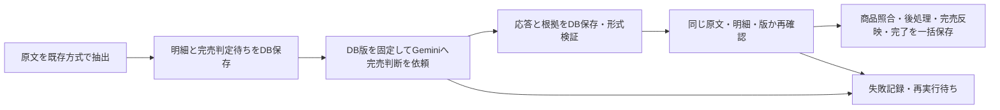

# 完売ルール管理 — DB正本・画面保守・判定接続の設計案

> 完売の判断基準を画面から直し、試してから使い、変更の理由と履歴を追えるようにする設計書。

更新日: 2026-09-15。担当: 同一AIがPlanner→Architectの順で作成・自己審査。独立レビューではない。
親: [提供元フィード翻訳](../../specs/inventory-management/feed-translation/README.md)。上位原則: [DB SSOT](../../specs/db-ssot/ideal-state.md)。
合意正本: [C01〜C43・未決事項](sold-out-rules-handoff.md)。recon: [本番DBとコード接続の実測](sold-out-rules-recon.md)、[既存調査](recon.md)、[最新照合](sold-out-rules-handoff.md#6-q19の追加実物調査と次の確認2026-09-15)。
経路: [ADR-113](../../adr/ADR-113-two-mode-dev-flow.md)のhandoff。手順は[STANDARD-WORKFLOW](../../STANDARD-WORKFLOW.md)を優先。

**状態: 設計案作成済み、自己審査REVISE。POの業務要件合意と、以下の技術設計案の承認は区別する。実装カード未発行、製品/DB/CI/運用スクリプト変更なし、Gemini呼出し0回。**

## 1. 目的・対象・変更前後

SaaS管理者が「完売ルール」ページの4タブから完売判断の指示・検索語・除外語を保守する。DB保存後の再読込で同じ内容が見え、テストに合格した版だけ次の通常解析に使う。完売商品一覧は本ページに置かない。

| 対象 | 変更前（観測） | 変更後（設計案） |
|---|---|---|
| ページ | 完売した解析結果の閲覧 | 指示文／検索・除外ワード／テスト／変更履歴の4タブ |
| 指示 | Gemini抽出指示はコード定数 | 新しい完売判断用の指示・語句・意味を持つ設定はDB版から生成 |
| 完売判断 | 状態語の部分一致、備考の一部完全一致。除外列は判定関数へ届かない | 原文の該当箇所ごとにDB指示でGemini判断し、サーバーが対象/根拠/版を検証 |
| 更新 | 現行ページに編集機能なし | 下書き保存→同じ版でテスト→本番用として保存 |
| 履歴 | 現行一覧はルール変更履歴ではない | 操作者・日時・変更前後の版・テスト根拠をDB参照 |

対象外: 商品名/価格/数量の抽出方法編集、個別商品の判定修正画面、在庫自動補充、過去一括再解析、3シート配信、テナントごとの独自ルール追加。完売ルールの保存操作から在庫/配信を呼ばない。一般の抽出サービスにある既存の定数を黙って本便の改修へ含めない。

## 2. 設計根拠（ADRのWhyへ引き継ぐ）

読取基点はfetch確認済み `origin/main=35a3b5271cfe3c43785e978a11a198f607746bb1`。作業文書は既存PR3456の専用ブランチ。origin/mainとの距離は調査開始時295/58コミットであり、古い作業ツリーの製品コードを実装基点にしない。本店HEADは調査中に変化したため、下記製品コードのorigin/mainとの差分0を確認し、移動したスクリプト行はgit showで固定基点を再読した。

| ID | 一次情報 | 観測・設計理由 |
|---|---|---|
| E01 | backend/app/services/tcg_product_detail_svc.py:20-23,36-43,90-96,137-146 | 商品の検索/除外は子テーブル。行ロックとrevision比較、同一トランザクションのaudit記録を既存が使用。ルール版にも競合拒否を適用する |
| E02 | backend/app/services/gemini_extraction_svc.py:41,62,170,198-204 | 2種類の抽出プロンプト定数とモデル定数がある。管理API追加だけではDB内容は送信されない |
| E03 | backend/app/tasks/tcg_extraction.py:155,170-171 | 作品参照付き抽出と実送信記録の既存接続点。商品抽出契約を維持するため完売判断を別責務へ分離する |
| E04 | backend/app/services/tcg_analyzer_svc.py:1047-1076,1093-1130,1328,1428 | exclude_patternはSELECTするが返却辞書にない。状態と備考で照合範囲が違う。新Gemini結果へ旧完売照合を重ねて上書きしない |
| E05 | migrations/20260903_150000_tcg_status_master_t004.sql:26,86-145; scripts/run_all_migrations.sh:551 | 完売5行＋予約3行＋既定1行をseedし、ST%が9行であることを毎回確認。既存5行の物理削除はseed復活を招く |
| E06 | backend/app/routers/super_admin_knowledge.py:1-16,41-48 | 既存knowledge_rules CRUDはhard delete。復元・版・合格条件を備えた本要件の代用品ではない |
| E07 | frontend/src/pages/super-admin/TcgProductMasterPage.tsx:12,86-90; TcgSoldOutPage.tsx:1-11 | Tabs/ContentToolbar/TextField/Select/DataTable/PageLayoutを流用可能。新しい部品体系を作る必要はない |
| E08 | backend/app/auth/dependencies.py:453-482; backend/app/tcg_config.py:20-28 | require_super_adminはis_super_adminを検証。TCG_SCHEMAは検証済みサーバー設定。本ページからschemaを指定させない |
| E09 | backend/app/services/tcg_extraction_record_svc.py:49-102 | 送信前に要求をDB記録し、通信中のDBトランザクションを閉じる既存例。完売判定にも送信前の版固定が必要 |
| E10 | migrations/20260831_110000_create_tcg_analysis_tables_t004.sql:55-74 | audit_logが既存。新たな独立履歴正本を作らず版ID参照を保存する |

追加実測: [本番照合記録](sold-out-rules-recon.md)で2026-09-15のDBカタログ/所有者/権限/9ルールを再確認。コード基点は189cd338へ更新。以下の初稿E01〜E10は35a3b527時点の記録として保持し、接続の最新判断は追加実測を優先する。

Context7ツールは利用不可。起動指示の代替許可により2026-09-15に公式資料を確認した。
- [PostgreSQL16行ロック](https://www.postgresql.org/docs/16/explicit-locking.html#LOCKING-ROWS): FOR UPDATEは競合する更新を待たせる。DB版比較と組み合わせて古い画面からの上書きを拒否する。
- [PostgreSQL16制約](https://www.postgresql.org/docs/16/ddl-constraints.html): 別行の状態をCHECKだけで保証する設計にしない。FK/UNIQUEとトランザクション内の検証を組み合わせる。
- [Gemini構造化出力](https://ai.google.dev/gemini-api/docs/structured-output): JSON形式の制約と業務上の正しさは別。実際に使うモデル/SDKで対応確認・試験が必要で、根拠/対象の検証はサーバーにも置く。

外部・過去事例の参照と我々への応用: 外部導入事例は該当なし。自社のDB参照・判定経路・既存同時更新方式が直接根拠であり、他社の成功数値は本機能の成立を証明しない。E01の競合拒否、E09の実送信記録を応用する。新機能の精度/性能測定値はまだない。

## 3. DB SSOTとハードコード禁止の契約

1. 新しい完売判断の指示文、検索語、除外語、優先/適用範囲の説明、判定に必要な設定はDBにだけ編集可能な正本を持つ。JSON/YAML/環境変数/フロント定数/バックエンド定数/スプレッドシートを第二の正本にしない。
2. ブラウザはDBから取得した内容と未保存入力を表示するだけ。localStorageにルールを保存して再起動後の正本にしない。APIもDB取得失敗時に既定の完売語句や旧ルールで代行しない。
3. 下書きと本番は同じ版体系。別のactive_ruleテーブルへ語句を複製せず、本番参照IDを切り替える。変更のない部品は同じ版IDを参照する。
4. 履歴には前後の版IDを記録し、その版から変更内容を表示する。監査用JSONへ編集可能なルール集合を二重保存しない。モデルへの実送信記録は変更不可の実行証拠であり、設定復元や次の解析の正本にしない。
5. 「完売」「予告なく」「一旦ストップ」等の業務語句をif文/正規表現/コード定数へ戻さない。判定の意味を持つ除外範囲や一般注意書きの扱いもDBの指示内容として保持し、テストで検証する。
6. コードに実装するのはDB参照、型/参照検証、認可、競合拒否、トランザクション、API通信、画面描画の処理。例文を業務判定として固定するものではない。UI文言は既存ADR-027に従いi18n、DBの業務文言はDB由来の値として表示する。これをC24の例外承認と読み替えない。
7. 新設する完売用のモデルID/生成設定/出力契約もDBの実行設定版へ集約する。APIキーは既存secretsを参照し、DBや画面にコピーしない。現行のモデル定数を新サービスの既定値として流用しない。モデル切替UIの追加は本便で確定しない。

## 4. データ構造案

配置案は既存TCG_SCHEMA内。全仕入元共通で1つのpolicyを参照し、supplier_id別の設定を作らない。「全仕入元」を「全SaaSテナント」へ拡張しない。共通public配置が必要という実カタログ/親仕様の根拠が出た場合は自己判断で複製せず再設計する。

以下の物理名は提案名。本番で同名sold_out_%表0、対象表所有者jarvis、アプリsalesanchor_appのCREATE不可を実確認。新版はmigrationで作る。新規テナントへのDDL/権限適用は試験後に確定する。既存のstatus masterをそのままCRUDする案は版・履歴・削除維持を満たさないため、完売判断の責任を追加専用の版構造へ移管し旧完売条件を引退させる。稼働中の二重正本は作らない。

| テーブル案 | 保持する事実・主要列 | 制約/参照 |
|---|---|---|
| sold_out_policies | policy_id、active_revision_id、draft_revision_id、current_suite_revision_id、lock_version、activation_state | policy行が本番参照の唯一の入口。IDは同じpolicy配下の版へのFK、CAS更新 |
| sold_out_policy_revisions | revision_id、policy_id、parent_revision_id、instruction_version_id、profile_version_id、created_by、created_at、content_digest | 保存のたびに新しい不変版を作る。語句全文をJSONコピーしない |
| sold_out_instruction_versions | version_id、policy_id、body、created_by、created_at | 完売判断の指示本文。未保存入力以外に第二の本文正本なし |
| sold_out_execution_profile_versions | version_id、policy_id、model_id、generation_config、output_schema、input_limits、compatibility_output、created_at | モデル/出力契約/上限はDB。旧status表への必須FK案はQAで同表がないため撤回。互換出力値は旧DBから移行した値を新版の正本で保持する修正案。旧完売行は稼働判定から引退させ歴史として保持し、同期更新する第二正本にしない。具体移行契約は要確定 |
| sold_out_rules | rule_id、policy_id、legacy_status_id（移行元のみ） | 検索/除外をまとめる不変の識別子。物理削除しない |
| sold_out_rule_versions | rule_version_id、rule_id、title、context_instruction、created_by、created_at | ルールの説明/適用文脈もDB。語句追加/削除/説明変更で新規版 |
| sold_out_rule_words | word_id、rule_version_id、kind、text、position | 1語/1行。kindは検索/除外を区別する構造。CSV文字列を正本にしない。空文字不可、同版/種別/同一語の重複不可 |
| sold_out_revision_rules | revision_id、rule_id、rule_version_id、is_deleted | PK(revision_id,rule_id)。同policy/同ruleの版だけFKで参照。削除はこの版内の札、過去版を書き換えない |
| sold_out_test_case_versions | case_version_id、case_id、policy_id、raw_text、posted_at、expected、created_by、created_at | 人間が決めた正解と原文の不変版。原文と正解を変えたら新しいcase版。実在庫へのFK/更新要求は持たない |
| sold_out_test_suites / sold_out_suite_cases | suite_revision_id、policy_id／suite_revision_id、case_id、case_version_id | 使用する全正解例の版集合。テスト中の例の追加/修正を過去の合格へ混ぜない |
| sold_out_runs | run_id、policy_id、revision_id、suite_revision_id（テスト時）、source_message_id/ジョブ参照（通常時）、purpose、engine_version、started_by/at、state | 入力版を先に固定。テスト/通常の入力FKは排他的。request_keyを一意にし二重クリックで二重依頼しない |
| sold_out_run_results | run_id、case_version_idまたはextraction_item_id、decision、source_spans、rule_version_refs、validation_error | 正規化した判断結果。対象/原文/版のFKと一致検証。生レスポンスは実行証跡領域で保持、ここから再判定しない |
| audit_log（既存） | table_name、record_id、action、changed_by、changed_at、old_values/new_values | old/newは変更前後のrevision ID等を記録。変更と同一トランザクションで書込。独立した監査正本を増やさない |

実行証跡: 抽出専用AttemptRecorderはextraction_jobsをrunningにし、失敗時にerrorへ戻すことを実物で確認。テスト/完売だけの通信にそのまま流用しない。完売用runに従属する専用attempt記録を追加する案へ絞る。既存jobを更新せずに送信前入力/受信内容/検証/失敗を保存する。原文削除時の保管/FK契約はT02に残す。モデルに送る構造は同じ生成関数、永続化アダプタと適用先は分離する。

不変版のDB保証は、参照後のUPDATE/DELETE拒否をDB権限またはtriggerで実装する。実測でアプリroleは既存表の更新/削除が可能、独自triggerは0。不変性が既にあると扱わず、新版への改変拒否制約をmigrationとPostgreSQL試験で追加する。アプリの画面禁止だけでは保証としない。削除済みルールの最後の版はrevision参照から求め、可変の復元用コピーは置かない。

## 5. フロントエンド契約

既存経路 `/super-admin/tcg-sold-out`、メニュー/題名「完売ルール」を維持して内容を置換。PageLayout、Tabs、ContentToolbar、TextField、Select、Button、DataTableを利用。タブはページ内の操作で、表示中のタブ以外を本文から外す。

| タブ | 表示/操作 |
|---|---|
| 指示文 | 現在本番で使用中の指示と下書きの区別、完売判断のみの編集欄、下書き保存、本番用として保存。後者はサーバーで合格条件を再検証 |
| 検索・除外ワード | 1行=1ルール、検索語と対応する除外語を両欄表示。追加/編集/削除、削除済みの表示と下書きへの復元 |
| テスト | 原文貼付、投稿日、人間の正解を保存/修正、保存した例の再テスト、正解/実判定/一致・不一致/原文の根拠。テスト中/エラー/未実行を区別 |
| 変更履歴 | 変更者・日時・操作・前後差分。指示/語句を版IDから読んで差分生成し、誰のどの変更か追える |

ワードの絞り込みは文字入力＋プルダウン「両方／検索ワードのみ／除外ワードのみ」。一致したルールのセットを表示し、除外語だけ別の独立ルールへ分解しない。プルダウンは検索する欄を選ぶ操作で、語句や本番への送信条件を書き換えない。空の文字入力は該当版の全ルール、削除済みは通常一覧から除く。条件変更時は先頭ページへ戻す。サーバー側の文字検索はパラメータ化し、入力の%/_を勝手なSQLワイルドカードにしない。

本番版/下書き版/未保存の3状態を明示。「下書き保存済み」を「本番反映済み」と表示しない。タブ切替で未保存入力を消さず、ページを離れる場合は未保存を知らせる。409時は他者変更と自分の入力を見比べられるよう保持し、勝手に上書き/再試行しない。API失敗を空の正常一覧として表示しない。

## 6. 管理API案

すべて `/api/v1/super-admin/sold-out-policies` 配下、`require_super_admin` を各読取/書込APIへ適用。フロントの表示制御だけでは認可しない。scopeはサーバーのTCG_SCHEMAから解決し、ブラウザに任意schema指定を許さない。

| 操作 | API案/要求 | 成功時の意味 |
|---|---|---|
| ページ開始 | GET /current | active/draft/suiteのIDとlock_version、表示用内容、許可される操作を返す |
| 語句一覧 | GET /revisions/{id}/rules?q=&word_kind=&deleted=&cursor= | 指定版から文字検索。上限はDB実行設定から返す |
| 指示/ルール追加修正/削除/復元 | POST /draft-revisions {expected_draft_id,expected_active_id,lock_version,changes,request_key} | 新版を作ってdraft参照のみ更新。削除もC44により新版テスト合格後に適用 |
| 正解例追加修正 | POST /test-suites {expected_suite_id,cases,request_key} | 新しいcase版/集合版を保存。旧合格を新しい正解に流用しない |
| テスト | POST /test-runs {revision_id,suite_revision_id,request_key} | 202+run_id。全保存例を対象。小分けプレビューは本番適用の合格証明にしない |
| テスト結果 | GET /test-runs/{id} | expectedとactualを原文根拠と併記。成功率分母/件数を返す |
| 本番用として保存 | POST /activate {revision_id,run_id,expected_active_id,lock_version,request_key} | 全検証後、active参照更新と監査記録を一括commit。別のPO公開承認フローは追加しない |
| 履歴 | GET /history?cursor= ; GET /revisions/{id} | 変更前後を参照可能。削除済みを含む過去データは編集不可 |

要求の未知フィールドは拒否。400/422は形式不備、401/403は未認証/権限不足、409は版競合/試験期限切れ、503はDB/モデル利用不可として明確に表示。HTTPの具体的エラー体系は既存ApiErrorへ接続し、UIは日本語/英語の両方を用意する。モデルエラーの生テキストや原文を汎用ログへ出さない。

## 7. 保存・テスト・本番適用の契約

### 7.1 下書き保存と同時編集

policy行をFOR UPDATEで取得→expected active/draft/lock_version一致を確認→変更された指示/語句の版だけ追加→revisionの参照集合を作成→draft参照とauditを同一commit。A/B二人が同じ版を編集したら最初の1件だけ成功、後の1件は409。通信中の勝手な自動マージはしない。

本番版の内容は不変。下書き変更や復元で通常解析の参照先は変わらない。復元は削除前の同じrule_idを下書きへ含め直し、削除後に追加された別ルールを消さない。過去policy版全体への巻き戻し操作と混同しない。

### 7.2 テスト合格の結合

合格の対象は `(policy_revision_id, suite_revision_id, execution_profile_version_id, engine_version)` の組。サーバーが全結果から判定し、フロントから渡されたpassed=true等を信じない。全例数>0、全例完了、誤判定0、見落とし0、根拠/構造エラー0、通信/中断エラー0で合格候補とする。未回答の正解例は有効なテスト集合に含めず、未ラベルのまま合格扱いしない。

本番用保存はpolicy行をロックし、現在のdraft/suite/activeの期待値とrunの結合を再確認する。指示・ワード・正解例・実行設定・エンジンが変われば以前の合格は使えない。進行中のテストの結果は固定した旧版に保存し、最新下書きの合格とは表示しない。ネットワーク失敗で同じtestを任意回数回して良い結果だけ選ぶ操作にはしない。再テストは新runとして失敗も履歴に残す。

### 7.3 削除・障害

復元はC35、削除はC44で、下書き→変更後の内容でテスト→合格後に適用と確定。削除ボタンだけでは本番版を変更しない。削除済み表示は下書きと本番版を区別し、履歴に残す。本番適用の成功後、次の解析から対象ルールを使用しない。

DBに有効版がない/読めない、実行設定欠落、モデル通信失敗、原文との不一致では、新規判断を適用しない。正常な非完売へ置き換えずエラー/確認待ちとして残す。既存有効版があるとき、下書き/テストの失敗はそれを変更しない。旧コードへの自動fallbackや既定ルール投入はしない。

## 8. Geminiと通常解析への接続案

### 8.1 選択した案とトレードオフ

推奨は原文単位で既存の抽出とは別に完売だけを判断する処理。入力は原文全体＋既存抽出明細の不変ID/原文範囲＋DB有効版。商品名/数量/価格を書き換える出力は受け付けない。一般注意書きと個別商品を同じ原文で検討でき、既存の10列抽出契約を変更せずに責務を分離できる。

代替A: 既存抽出に列を増やして1回で完売も判断する。追加呼出しを抑えられる一方、現行の10列/作品ID契約を変更し、完売ルール修正の影響が商品抽出へ広がるため不採用案。
代替B: システムの語句一致だけで完売を判定する。追加モデル呼出しは不要だが、C18/C21のGemini判断軸と文脈・混在要件を満たす証拠がないため不採用。

独立処理では、1投稿に対して完売判断のモデル要求が通常1回増える。長文分割/リトライが発生すればさらに増えるため、費用/遅延の実測と上限が必要。現時点で単価・所要秒数・対応モデルを創作しない（未決T03）。この設計案を実呼出し承認とは扱わない。

### 8.2 判定と根拠

通常開始時にactive revisionをDBから1回読み、runへ参照を固定してcommitしてからモデルを呼ぶ。実行中の版切替は次のrunから有効。リトライは同じrunの版を保持、新runだけ最新を使う。判定とテストは同じcompose→call→validate関数を使い、purposeで異なる語句リストへ切り替えない。

結果は明細ごとの `is_sold_out: true/false/null`、原文の連続範囲、引用、参照したrule_version IDを返す契約案。boolean/nullは構造であり、意味のある語句はDB指示から与える。サーバーは返却IDが入力に存在するか、原文の指定範囲が実在するか、引用がその範囲の文字列と一致するか、同じ明細の重複/矛盾がないか、版がrunと同じかを検証する。これは意味の正しさの保証ではなく不正な参照の拒否。

全入力明細の回答が必要。原文にはあるが明細に紐付かない完売らしい記述は、未割当の原文範囲として記録し確認待ち。Geminiが新商品IDを作ったり、商品名だけで他の発送分/単位/状態/仕入元へ広げたりすることを許さない。抽出自体の見落としをこの段で自動商品作成して解消しない。

未登録表現の一般扱いQ07b/Q18bは未合意。「一旦ストップ」の合意を他の曖昧表現へ広げない。モデルが提示した根拠と人間の正解を照合できるよう表示するが、内部思考を表示する設計ではない。

### 8.3 既存状態判定との接点

新経路の完売判断はこのDB版と検証済みrun結果だけが担当する。既存resolve_status_v2のEXCLUDE語句一致を重ねて適用しない。非完売の結果は「在庫あり」の断定ではない。予約/在庫の既存OUTPUT処理を使う際も、完売専用の入力とは区別する。null/欠落/不正結果は確認待ちとし、旧完売判定やIn Stockへのfallbackを使わない。

analysis_results.status等は既存解析出力として扱い、判定runへの参照を持たせて再現可能にする。本便は在庫数や配信を変更する新処理を実装しない。test-purposeのrunからanalysis_results/extraction_jobs/在庫へ書き込む関数を呼ばない。通常接続位置は抽出明細commit後・analyzerのロック前と特定した（追加実測§4）。手動再解析の別入口、手動訂正明細のskip、empty原文、原文削除時のFKと失敗再実行の契約はT02に残す。実装カードは未発行。

## 9. 移行・初期値・二重正本の廃止

追加専用migrationで版構造を用意し、既存の完売5行は移行元の歴史として保持する。`legacy_status_id`で出所を追えるようにし、新ルールへ一度だけ取り込む。合意済みだが現DBにない語句/指示/正解例は管理画面から下書き登録し、出典/登録者を記録する。SQL/Pythonに初期完売語句を列挙するseedは作らない。

旧tcg_status_masterのEXCLUDE行は新方式切替後の通常完売判定から参照しない。予約/既定のOUTPUT行は旧来の責務に残す。旧5行は物理削除しないため、再配備のON CONFLICT DO NOTHINGで削除語句が新正本へ再投入される経路を作らない。新正本への一度限りの移行はDBの移行完了記録で制御し、「現在0件なら初期値を入れる」は禁止。

既存のST%9件固定検証を逃れるID命名をしない。新ルールは新構造、旧行は歴史と表示値参照のみに役割を明記し、古いseedが新正本を変更しないことを実DBで2回配備試験する。旧EXCLUDEを他コードが利用していないこと、全対象schemaの所有者/参照/件数が想定どおりなことが切替前条件。旧版ワーカーが生存したまま両方式を並行適用しない。

切替はレビュー/CI/PO GOの揃った実装便で行う。現行本番から有効な新版へ移るまで旧方式を暫定運用することと、切替後の障害で旧方式へ自動復帰することは別。後者は禁止。コードrollbackで消したルールが復活しないよう、DBの切替状態とコード互換性を起動/ジョブ取得時に確認する契約が必要。

## 10. 受入条件・検証方法

以下は未実行の試験計画。原文正答率を既に測ったという意味ではない。

| ID | ○判定（合意根拠） | 検証方法 |
|---|---|---|
| AC01 | 4タブが切替でき、完売商品一覧0、他抽出項目の編集欄0（C25/34/37/42） | frontendの既存PageLayout/Tabs利用＋ブラウザ操作で確認 |
| AC02 | 指示/検索/除外を画面で保存し再読込して一致。DB外の業務ルール定義0（C23/24/43） | API＋実PostgreSQL往復、バンドル/サービス/seedの語句探索、DB編集後にコード再配備せず要求内容が変わること |
| AC03 | 検索語と除外語をセットで保守でき、両方/片方と文字で絞込（C38/40/41） | 一致が検索だけ/除外だけ/両方/なしの4種、空文字、%/_、複数ページ、削除済みでUI/API比較 |
| AC04 | 2人の同じ版への更新は成功1・409が1、消失0 | PostgreSQLの独立2接続で保存競合と本番適用競合を試験 |
| AC05 | 下書き変更/失敗テスト/復元だけでは本番版変更0（C30/31/35） | active参照IDと実送信の版を比較、障害注入 |
| AC06 | 1件の不一致、未完了、エラー、全例0件なら適用0（C30） | APIへ直接適用要求しサーバー拒否を確認。ボタン非活性だけで済ませない |
| AC07 | 合格後に指示/語句/正解例/実行設定/engineの各1条件を変更した5ケースすべて旧合格を拒否 | runと現在版の突合否定試験 |
| AC08 | 変更前後/人物/日時を参照でき、監査保存失敗時の変更commit0（C32） | トランザクション障害試験＋画面差分表示 |
| AC09 | 一般ユーザー/通常テナント管理者の取得・編集・テスト・適用・復元成功0（C33） | require_super_adminを通る全APIの認可試験 |
| AC10 | 商品A完売、B在庫ありを混ぜてもAだけtrue。発送枠/単位/状態/仕入元を混同0（C05〜10/22） | 人間ラベル付き原文で明細ID単位の一致を測る |
| AC11 | 予告/受付締切/否定はfalse、明確な完売/一旦ストップはtrue（C01〜04/17/19） | 保存した原文/正解で同一判定経路を試験。未登録語はラベル未承認のまま合格例へ混ぜない |
| AC12 | 明細欠落/未知ID/原文引用不一致/版違い/DB障害の自動適用0 | 固定応答による異常試験。モデルの実正答率とは別記 |
| AC13 | テスト実行前後の実原文/抽出ジョブ/解析結果/在庫/配信の変更0 | PostgreSQL接続と書込先を照合、テスト以外のDML拒否を検証 |
| AC14 | 削除済みが復元操作なしで再出現0、再配備2回でもDB指示/語句不変（C27） | 旧seed→新migration→画面編集削除→同順序2回→差分検査 |
| AC15 | 原文/期待結果/実結果/引用箇所が同じrunで見える（C29/36） | 混在投稿の複数明細、引用不正、空結果を画面確認 |
| AC16 | 過去再解析/補充/配信の自動開始0（C16/25/42） | 保存/復元/適用/テストからの呼出グラフと実行記録を照合 |

精度の報告は明細単位と投稿単位を分け、分母/正解/誤完売/見落とし/確認待ち/エラーを併記する。全件合格は保存した試験集合に対する結果であり、未知の全原文への100%保証ではない。実モデル試験は既存許可範囲を改めて照合し、秘密や原文をPRへ転載しない。

## 11. 実装計画と維持の仕組み

未解決事項を閉じる→本書の確定/自己審査→PO承認と正式カード検査→Generatorへ引継ぎ、の順。別agentは起動しない。

| 便 | 実装候補範囲 | 検証・停止条件 |
|---|---|---|
| 1 DB基盤 | 新規migration、TCG_SCHEMA配置、版/監査/競合サービス、管理API、登録/新規tenant経路 | 所有者/制約照合前にDDL発行しない。実PostgreSQLで追加専用/競合/削除維持を確認 |
| 2 ページ/テスト | TcgSoldOutPage置換、専用API clientとfeature、ja/en、テスト保存/run/結果/履歴 | DB SSOT、AC01〜09/13/15。固定応答試験と実Gemini試験を区別 |
| 3 通常接続/移行 | 完売専用サービス、通常ジョブ接続、旧完売判定の責任移管、実行証跡参照 | AC10〜16、追加費用/遅延と旧worker混在対策。PO GOなしに本番へ切替しない |

便番号は作業分割案であり、本便開始の承認ではない。API/DDL/実行証跡契約を正式に確定してからカードへ具体ファイル/差分/コマンドを記載し、`bash scripts/card-lint.sh <カード>`を実行する。現在カード未発行のためカード検査済みとは称さない。

守り手: 設計担当が本書/合意正本を更新、実装担当がDB/画面の契約試験を保守、Reviewerがハードコード/二重判定/版結合を確認。実装後の自動検証は既存 `.github/workflows/test.yml`、`frontend-check.yml`、`migration-test.yml`、`migration-guard.yml`、`process-artifacts-gate.yml`、`task-state-check.yml`へ接続する。これらが新試験を実際に実行するか実装差分で確認する。CI追加/変更は本設計セッションでは行わない。

履歴・テスト例の保存期間、実モデルの費用上限/停止時表示、初期DB内容の登録責任を移行前に運用担当と確定する。恒久的な物理削除/自動初期化ジョブは追加しない。DBのバックアップ/復旧対象に設定版と監査・試験根拠が入ることを既存運用で照合する。

## 12. Architect自己審査

判定: **REVISE（修正必要）**。同一AIによる自己審査で、独立した第二者レビューではない。

合格に必要な設計内容として、唯一のDB参照、画面保守、4タブ、絞込、正解例、版に結び付くテスト、競合拒否、削除復元、実送信根拠と旧判定の責任移管まで文書化した。E01〜E10と公式資料は仕組みを設計する根拠だが、以下をまだ裏付けていないため実装可能/APPROVEにはしない。

| 未解決ID | 内容 | 解消方法/担当 |
|---|---|---|
| Q24（解消） | 削除もテスト合格後に反映する | PO「ヨイ」、合意正本C44/§10。未実行/不合格では本番版維持 |
| T01（一部解消） | 本番所有者/role権限/キー/新版表0/QAで旧status表不在を実測。残りは新版DDLと新規tenantの適用契約 | 実測recon§2〜3。旧status必須FKを撤回し、migration/不変制約を確定して実PostgreSQLで検証 |
| T02（一部解消） | 通常接続位置と手動再解析の別入口を特定。専用attempt案へ絞った。手動訂正明細/empty/失敗再実行/削除連鎖の最終契約が残る | 実測recon§4。商品訂正を上書きせず、抽出済みjobを再抽出しない設計を確定 |
| T03（一部解消） | SDK2.8.0の構造化設定欄、既存64件のモデル名を確認。新契約のモデル試験/費用/遅延/上限は未実測 | 既存抽出の平均37.28秒を追加判定の見積りに流用しない。許可を確認して別途モデル試験 |
| Q07b/Q18b | 未合意の語句/曖昧表現をどう扱うか | 原文例を調査して一問ずつ確認。未承認語を初期版へ登録しない |

設計承認前にこの表を閉じ、同じ版の文書で再審査する。既存GO3505/委任入口を新機能の実装承認に転用しない。文書保存/設計合格/PO承認/実装/本番適用を別々に報告する。

## 13. 実測後の接続プラン（2026-09-15改訂）

1. 既存の原文→job→明細→解析結果のID連鎖をそのまま使う。31,676明細/解析結果の関連切れ0を確認した。商品/原文の新正本は作らない。
2. 完売判断の指示/語句をDBの版構造へ保存し、4タブの画面から保守する。QAには旧status表がないので、旧表への必須FKを新機能の動作条件にしない。新機能の初期値は画面/正式移行で登録し、コードで補わない。
3. workerは既存抽出を完了して明細を保存した後、DBの有効版で完売判断を記録する。通信中に既存の原文/解析行ロックを持たない。extractジョブのdoneと完売runの成功は別々に管理する。
4. 既存analyzerには完了済みrunのIDを渡し、原文hash/明細ID/版を検証して完売結果だけを採用する。旧完売語句一致を二重適用しない。商品・価格・数量等の処理を完売プロンプトで書き換えない。
5. 別入口の手動再解析、商品手動訂正の保護、0明細原文、失敗再実行を接続試験に追加する。現状のcontinue分岐やerror→pendingの再抽出を無条件流用しない。
6. 削除・復元・再配備、同時編集、DB障害を実PostgreSQLで検証し、原文テスト合格後に本番切替する。実測を伴わない設計合格/正答率100%を出さない。

追加受入条件: AC17=通常/手動/直接呼出しの3入口でrun検証を迂回できない、AC18=モデル通信中の原文/job/解析行ロック0、AC19=手動商品訂正の前後値を保持し完売確認理由を欠落させない、AC20=QAの旧status表不在でも新版構造を構築できる、AC21=0明細/完売run失敗を通常判断完了と表示しない。いずれも未実行の試験計画。

判定はREVISE継続。基礎の接続場所・既存DBとの関係を根拠付きで示すことはできたが、上記T01〜T03の残件を完了した意味ではない。

## 14. 例外経路の接続契約案（2026-09-15）

以下は§13へのPO合意後に補った技術案。根拠は[実測§8](sold-out-rules-recon.md)。業務上の新しい合意や実装完了とは扱わない。

- **手動の商品訂正**: 既存product_id訂正の再確認と自動商品照合skipを保持する。完売適用は対象extraction_item_idに対応するstatus/status根拠/完売専用review理由だけを更新し、人の商品ID/訂正記録を更新しない。通常行と訂正行の両方で同じrun検証を必須にする。falseを在庫復活指示に読み替えない。既存condition再確認が先に書いた他review理由を集合として維持し、完売由来理由のみ置換する。更新可能列はDDL/APIの確定時に列名で固定する。
- **途中保存**: 現行analyzerは本体と後処理で複数commitする。単純に関数を呼んで例外時rollbackするだけで「全変更が戻る」と設計しない。判定runの検証完了と各明細の反映完了を分離し、成功表示は必要明細への適用がすべて記録された場合だけにする。後処理失敗後の再実行で既に適用した同じrunを二重適用しない。単位/状態の後処理と適用順序、参照側が中間状態を採用しない条件はT02の残件として、DDLと呼出元まで確定する。
- **抽出0明細**: 固定応答試験で数量/価格空の完売明細を受理できた。0明細は価格欠落のせいと決め付けず、明細集合なしで原文の未割当完売有無を判定する案とする。モデルが返した商品名から新商品/在庫を作らない。無関係原文である確認と、対象不明の完売候補を区別するJSON契約が必要。候補あり/不明/判定失敗は通常適用完了にしない。0明細jobは従来の明細確認一覧に出ないため、既存の運用エラー表示先への接続調査が残る。個別確認ページを本便へ追加しない。
- **失敗の再実行**: 抽出done/emptyと抽出attemptの記録を保持。専用完売attemptを新規作成し、同じ原文hash/保存済み明細集合/要求した設定版へ紐付ける。再抽出を起動しない。要求版の廃止/原文変更/明細変更を検出したら古いrunを採用せず未適用とする。自動再試行の回数/時間/モデル設定はDB実行設定へ置き、コード定数で補わない。現行330秒taskへ追加要求を無検証で入れず、独立taskと呼出時の状態遷移を具体化する必要がある。

AC19/21を上記の否定ケースにも適用する。追加ケース: 商品訂正直後の完売、後処理前後の障害、同じrun再試行、空原文集合での完売候補、再試行時の版変更。これらは試験計画で未実行。実装カードへ必要な列/更新順/完了条件を落とせるまでT02を解消扱いにしない。

Architect自己審査: **REVISE継続**。単位未解決フラグがreview理由を上書きするという懸念は実コードで否定できた。一方、複数commitと0明細の表示先という実際の接続条件を発見した。POの条件付き実装承認は受領済みだが、根拠確立の条件は未達。設計担当の範囲で残件を確定し、正式カード検査後に実装担当へ渡す。

## 15. 削除の合意反映と追加受入条件

C44によりQ24を解消。追加/編集/削除/復元をすべて同じ版検証とテスト合格後適用へ統一する。削除だけの即時適用APIを作らない。

AC22（未実行の試験計画）: 有効ルール1件を下書きで削除し、テスト未実行・1件不一致・実行エラーの3条件で適用を拒否し、本番版IDと送信ルール集合が変わらないこと。削除後の版の全例合格で初めて適用でき、削除対象が次の要求から外れ、履歴と復元元の参照が残ること。同じ条件はUIを経由しないAPI直接要求でも成立すること。

既存DiagnosticsDrawerのanalysis-missingはemptyを取得しない（実測§9）。既存画面へ自然に表示されるという前提は採用しない。個別確認画面を本ページへ追加することはC25の範囲外のため、確認待ちの引継ぎ先はT02に残す。削除の業務判断は解消したが、新機能の試験合格/設計全体のAPPROVEとは区別する。

## 16. 既存抽出から完売判断への接続設計案

根拠は実測§8〜10。以下は§14の「途中保存」と再実行案を具体化し、競合する記述より優先する。設計案であり、製品変更/DB制約検証済みではない。

### 16.1 責任と保存境界

- 原文/source_messages、抽出/extraction_jobs・items、解析/analysis_resultsの正本は増やさない。通常完売runは既存ID参照と入力hash/版/試行記録を持つ。プロンプト・語句・model/timeout等の実行設定・表示互換値はDB版から取得する。
- 抽出taskの明細保存トランザクションに、通常判定対象のrun作成（queued）も含める。既存done/emptyは抽出の状態として維持。抽出errorでは完売runを作らない。AUTO_ANALYZE無効時に自動開始しない。0明細emptyも、通常判定対象ならqueuedを作る。
- commit後に別の完売taskへrun_idのみ通知する。抽出taskの330秒枠へ2回目のモデル通信を入れない。通知失敗でもqueued行は残る。DBの未完了一覧から再通知できる設計とし、Redisの配送結果だけを完了正本にしない。自動再送のスケジュール/上限はDB実行設定と運用契約を確定するまで未実装とする。
- taskは短いDB取引でrunの実行権（claim_token、期限）を取得しcommitしてからモデル通信する。原文/job/解析行のロックとDB接続を通信中に持ち続けない。同じrunの重複配送は取得済み実行権で排除する。期限切れ後の旧workerはtoken不一致で応答保存/適用を拒否する。再試行によるモデル課金の厳密な1回保証とは称さない。
- 応答を受け取ったら入力hash・明細ID集合・引用範囲・出力schema・版IDを検証してvalidated、形式不正はfailedとする。未特定候補は正常な判断結果内のreview_requiredであり、通信失敗と区別する。モデルが商品IDを作って登録する経路はない。

### 16.2 一括適用の具体的な変更点

1. 通常taskと手動再解析が利用する`apply_sold_out_analysis`（新設候補名）を保存境界にする。専用Sessionでbeginを開始する。run/source/job/itemの対応、source hash、明細集合hash、設定版と実行権を再検証する。順序を固定して対象原文/job/itemsと解析行をロックし、ロック取得後に人の商品訂正を再確認する。
2. analyzerの計算・書込を行う内部関数からcommit3か所を外す。3つのマスタloaderもこの経路では例外を握り潰さず呼出元へ返す。外側beginを置くだけ/内側commitをflushと呼び換えるだけで合格にしない。旧経路互換が必要なら入口を明示し、新方式有効後にrunなし呼出しで迂回できないよう検証する。
3. 既存の商品/単位/状態照合とE3a/E5/E3b/E4を同じSessionで実行。完売判定の反映は後処理後に行う。これにより後処理の単位/状態書換えを挟んで完売結果だけ先に公開しない。旧EXCLUDE完売照合は新方式で停止し、予約/既定OUTPUTの責務のみ残す。
4. 手動商品訂正のcontinueは維持し、全明細への完売限定更新を後段で行う。更新範囲は`status`、完売由来の`exclusion`、`needs_review`/`review_reasons`の完売由来成分、適用run参照/更新時刻。product_id、訂正履歴、数量、価格は完売処理で更新しない。未知/確認待ちの結果をIn Stockへ変換しない。新規明細の未確定status表現はDB互換出力設定と列制約を確定するまでT01として残す。
5. 判定runのapplied記録と、手動再解析の場合の既存analysis_runs完了記録を同じ取引に含める。最後に1回だけcommit。途中例外は全更新をrollbackし、その後の別取引でapply_failedを記録する。失敗記録の保存にも失敗した場合は完了とせず、期限付き実行権の未完了として再取得時に検知する。
6. commit直後にworkerが終了し再配送された場合はappliedの同一runなら書換えなしで成功を返す。別の新しい適用がある場合は古いrunによる上書きを拒否する。同一jobの適用世代番号と一意制約をDBに持たせ、Pythonプロセス内のフラグだけで二重適用を防がない。

この変更は通常のDB読取から途中結果を見せないための接続設計。既存の旧原文非アクティブ化や在庫採用方式の解決とは別であり、それらを本便で変更しない。

### 16.3 0明細・失敗・再実行

| 状態 | 解析結果への処理 | 再開方法 |
|---|---|---|
| 明細あり・検証済み | 上記一括適用。対象不明の明細は完売変更せず確認理由を残す | 同一run適用の重複はno-op |
| 0明細・完売候補なしと検証済み | 架空の商品/明細/解析結果を作らず、runのみno_actionで終了 | 通常の成功とは別の「対象なし」表示 |
| 0明細・完売候補あり/不明 | review_required。商品を推測して在庫へ反映しない | 原文ID付きで既存診断欄へ引継ぐ案（Q25回答待ち） |
| モデル応答失敗/形式不正 | failed。抽出done/emptyは変えない | 明示再実行で新attempt。抽出は呼ばない |
| 応答validated・適用失敗 | 解析結果更新はrollback | 同じ原文/明細/有効版なら保存済み応答で適用のみ再試行。Gemini再呼出し不要 |
| 版/原文/明細が変化 | stale、古い応答を適用しない | 新しい実行要求として記録。古いattempt内容を改変しない |
| queuedの配送失敗/期限切れ | 未完了としてDBに残る | 明示再通知。旧claim_tokenは無効化 |

手動商品再解析は適合する保存済みrunを利用し、原文/版不一致やrunなしなら明示エラー。既存の再解析ボタンで追加Gemini要求を暗黙実行しない。完売専用の再実行要求ではexpected_run_id/input_hash/policy_revision_id/request_idを照合し、同じrequest_idの再送は同じrun/attemptを返す。変更を検出したら409とし、別版への自動すり替えをしない。

### 16.4 確認先の範囲判断と担当ファイル

Q25（回答待ち）: 「仕入元品質」の既存診断欄に完売未完了/0明細の確認待ち/再実行を追加するか。C25の個別確認ページ対象外を尊重し、POへ一問で確認中。完売ルールページへ商品一覧は追加しない。診断欄案は原文ID・投稿日・工程・失敗理由・版・再実行可否を表示し、人による商品割当/在庫訂正機能は追加しない。再試行しても対象未特定ならreview_requiredを維持し、解決したと表示しない。

候補ファイル: tasks/tcg_extraction.py（queued保存/通知）、tasks/tcg_sold_out.py（新規worker候補）、services/tcg_sold_out_svc.py（新規共通サービス候補）、tcg_analyzer_svc.py（取引分離・限定更新）、tcg_product_master_svc.py（手動入口）、既存tcg_diagnostics.py/svcとDiagnosticsDrawer/ja/en（Q25合意時のみ）。DBは§4の版/実行記録にclaim_token・適用世代・一意制約を追加する具体DDLが必要。名前は設計候補で未作成。

### 16.5 接続の受入条件と自己審査

AC23（未実行）: analyzer本体前後、各後処理後、完売限定更新後、完了記録直前の各点に例外を注入し、解析結果と適用記録の部分commit0を独立DB接続で確認。loader3種のDB例外でも同様。

AC24（未実行）: queued通知失敗、重複配送、期限切れworkerの遅延応答、commit直後のworker停止、手動訂正と適用の競合、版更新と適用の競合、0明細の候補あり/なし、apply_failed再試行を検証。抽出の再呼出し0、同一応答の適用再試行でモデル呼出し0、二重適用0を測る。

Planner: 接続経路と取引責任・状態遷移を具体化済み。Architect（同一AI自己審査）: **REVISE**。内側commit/rollbackを残す案はREJECTし、一括取引への変更案を選択。変更範囲は広がるが、途中結果の公開を各画面の個別フィルターで防ぐ案より保存境界で統一できる。実DB試験は未実施。Q25、T01のDDL/権限/保存期間と未確定表示、T02の競合制約/配送回復設定、T03の実モデル検証は残る。接続設計案を記録したことと実装可能判定を区別する。

## 17. PR3522を受けた実装基点の制約

PR3522はmerge 4e0c8083でマージ/Deploy34975588763成功を確認。analysis_results等の商品参照は本番でpublic.products.id INTEGERへ移行済み（実測§11）。§16の共有接続ファイルを旧UUID前提で実装/カード確定しない。原文/job/itemのUUIDは商品IDと別物である。§4等の移行前DB観測は履歴とし、Phase B確定後のmainと対象環境の型/FKを再確認して具体DDLと試験データを更新する。詳細根拠と順序は合意正本§12。

現状は設計草案のみで製品変更0。#3522の移行を本便で再実装せず、同PRのCI/マージ/対象環境確認を接続実装の前提とする。完売ルールの指示/語句・下書き・テスト版設計は独立して進められる。自己審査REVISE継続。

## 18. Phase B反映後の接続契約の更新

本節は§17のPhase B完了待ちを解消する。原文/明細の対応IDはUUID、商品参照だけINTEGERとして実測に合わせる。新main=4e0c8083を今後の接続実装基点とし、古い設計worktree上の製品差分は使わない。

### 18.1 IDと未確定値

| 項目 | 型と接続 | 禁止する混同 |
|---|---|---|
| source_message_id / extraction_job_id / extraction_item_id | 既存UUIDを参照 | 商品IDの整数化をこれらへ適用しない |
| analysis_results.product_id | nullable INTEGER → public.products.id | tcg_uuidへの新しいFK/JOIN/CAST AS uuidを導入しない |
| run_id / attempt_id / revision_id | 新しい処理/版の識別子としてUUIDを設計 | 商品IDとは別のID。値をコピーしない |
| 手動商品訂正human_value | 既存text表現の数字を現サービスが整数へ変換 | コメントに残るUUIDの説明を仕様としない |
| モデルのitem識別子 | 入力に与えたextraction_item_idだけ受理 | モデル出力からproduct_idを採番/検索登録しない |

完売判定が不明の明細では、既存の確定statusを勝手に変更しない。新規明細で確定statusがない場合はNULLを保存し、needs_review=trueと完売専用の確認理由を同一トランザクションで保存する。NULLは本番列で許容されることを確認した。完売理由語句/表示値はDB設定を参照し、予約/在庫ありを推測で埋めない。既存の通常解析で先に出た既定In Stockを、完売不明時の確定値として採用しない。画面に未確定と分かる表示を持たせる必要があり、Q25の確認先と合わせて検証する。

正常なfalseは「完売ではないという結果」であり、旧投稿の在庫復活操作ではない。同じ明細への初回適用では既存OUTPUTによる予約等の結果を利用し、再適用で前回の完売を取り消す扱いは別の個別訂正機能の責務とする。既存合意C16の自動補充なしを維持する。

### 18.2 DBで固定する再実行の対応関係

通常runの不変入力は(source_message_id, extraction_job_id, source_sha256, items_sha256, policy_revision_id, engine_version)。items_sha256は明細IDだけでなく保存済み入力欄/原文範囲の正規化表現を対象にする。作成時と適用直前の両方で参照整合を検証する。入力が変わったものを同じrunへ詰め直さない。

attemptは(run_id, attempt_no)をUNIQUEとし、attempt_idを主キーにする。送信/応答/検証記録はattemptに従属し、成功済み応答は上書き不可。実行権tokenと期限はrun側で管理し、保存時にtoken一致を条件にする。正当な新attemptの完了後に古いattemptの遅延応答が届いても採用しない。

適用の競合管理はextraction_job_id単位の世代番号とlast_applied_run_idで行う。rowをロックして期待世代と比較し、解析結果更新/世代更新/完了記録をまとめてcommitする。同じrun再送はno-op、違う世代は409相当の競合。手動商品訂正後の保護は現行のanalysis_resultsロック後の訂正再確認を維持する。これらは必要なDB制約の設計であり、既存DBに作成済みではない。

### 18.3 配信前確認への必須接続

新しい完売runを追加しても、現行の配信前チェックはその存在を知らない。このまま非同期化だけを実装する案は採用しない。既存tcg_distribution_svc.pyの未完了チェックに、配信対象の有効原文について「新方式が必要なのにrunがない」「処理待ち/実行中/応答検証済みだが未適用/失敗/古い入力」を加え、未完了なら配信処理を開始しない設計とする。

対象は新方式切替後に受付けた通常解析の必要性をDBで記録した原文。全過去原文へ一律にrunを要求して配信を停止させない。切替条件は日時のコード定数ではなくDBの移行状態と原文ごとの処理要求を参照する。0明細のno_actionは完了として扱い、未特定候補のreview_requiredは確認理由を残す。review_requiredの0明細原文を配信全体の保留にするかは既存個別確認の運用境界と合わせて別途確定が必要であり、成功扱いで通さない。

既存の配信列/送信先/売上や在庫の採用方法を変える設計ではないが、配信開始条件への変更は実装範囲として明記する。本設計セッションではコード/配信操作を行わない。

AC25（未実行）: INTEGERの商品参照とUUIDの原文/明細で、手動訂正の維持、未知判定のstatus NULL＋review理由、同じrunの重複/古いattemptの遅延応答/世代競合を実PostgreSQLで検証。新方式の完売run未完了時の配信開始0も検証する。旧方式の完了原文を誤って要求runなしとして止めないことも対照に含める。

自己審査: REVISE。Phase B待ちとstatus列NULL可否は解消した。新設記録の物理削除時の参照保持、DDLの具体化と不変制約試験、Q25と0明細確認後の運用、配送回復のDB設定、実モデル検証は未完了。今回の進捗で設計全体の合格を宣言しない。

## 19. 確認待ち表示の範囲確定

C45により、判定失敗と商品を特定できない投稿の表示先は既存「仕入元品質」の診断欄とする。§16.4のQ25は表示先Q25aのみ解消。完売ルールページへ商品一覧を追加しない。再実行操作Q25b、0明細確認待ち時の配信保留条件は未確定のまま分離する。

表示は既存原文IDから原文を読み、対応runの状態/失敗理由を参照する。別の確認用商品台帳を作らない。原文や失敗状態を見せるだけで人の確認が完了した扱いにしない。API/画面とも既存SaaS管理者認可を維持する。表示先合意は設計全体のAPPROVEや製品実装完了とは区別する。

## 20. C46/C47による画面構成の更新

本番は「解析精度管理／要確認／完売ルール」の3つのボタンで切替える。C46で構成決定。要確認では原文を見た同じページ内で修正まで完結させる希望をC47として受領し、[説明用HTML](sold-out-rules-ui.html)に案を作成した。§19の診断欄配置は最新方針に置き換える。

要確認の修正は商品・数量・単価・単位・商品の状態・販売状況・備考の7項目を提案しQ26で確認中。修正理由欄/必須項目/発送枠/0明細の登録方法/保存後の採用や配信は未確定。画面に描いたことをAPI・DB変更の承認としない。既存の手動訂正APIで7項目すべて保存できると断定せず、各項目の保存先と消費側を再調査する。

完売ルールは4サブタブ（指示文/検索・除外ワード/テスト/変更履歴）を維持。画面案は下書き・削除復元・フィルター・テスト画面例・履歴を操作できるが、モデル実行やDB保存は行わない。実機能のArchitect判定はREVISEのまま。

## 21. 例文と混在分類の設計候補

C48により提示HTMLのページレイアウト確定。新タブを独断追加せず、例文管理は既存の指示文/テストタブ内で検討する。指示用例文は原文・商品/発送枠ごとの期待判断・根拠箇所をDB版管理してGemini要求へ含める。テスト用は別の原文集合で、指示に見せた例の再現率だけを未知原文の精度と称さない。

投稿分類候補: 在庫更新、完売更新、混在、対象外、要確認。商品ごとの更新種別/対象ID/原文根拠を個別に保持し、単独の投稿ラベルから投稿内全商品を0にしない。分類案・送信例文の仕様はまだ未確定。実原文によるモデル試験も未実施。

最新読取でも同仕入元の旧原文非アクティブ化が残るため、商品別の更新を在庫へ反映するには採用方式の設計が必要。本便のルール保守画面のみでその解決を報告しない。既存の商品特定/発送枠/単位/状態が一意でない場合は、人の確認前に更新しない。自己審査REVISE継続。

## 22. 完成目的の合意と設計範囲（C49）

完成イメージは合意正本§18でPO確認済み。3画面とページ内修正、例文管理、商品別の在庫/完売更新、他商品維持、不明時の人確認を親目的として保持する。旧仕様にある「本便はルール管理のみ」という実装分割を、全体目的の達成と取り違えない。商品単位の採用方式と個別修正の保存/反映は、既存仕様との整合を確認して設計へ取り込む必要がある。

次はQ26の7修正項目を確定し、各項目の保存先・原文保持・再解析による上書き防止・確認完了条件を照合する。画面レイアウトの承認を未決のデータ更新契約の承認とは扱わない。自己審査REVISE継続。
