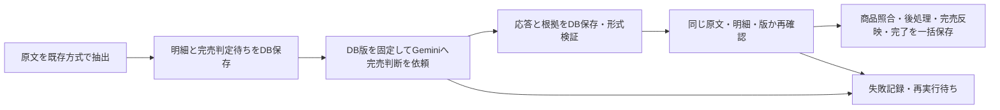
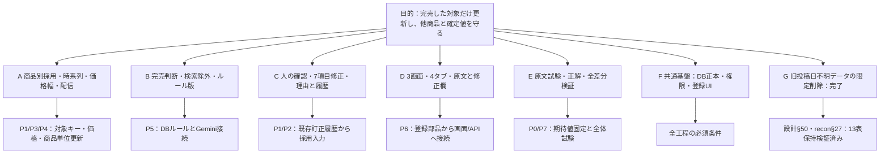
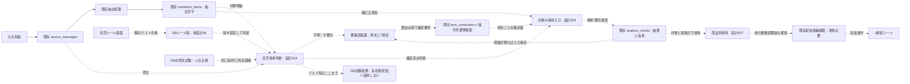

# 完売ルール管理 — DB正本・画面保守・判定接続の設計案

> 完売の判断基準を画面から直し、試してから使い、変更の理由と履歴を追えるようにする設計書。

更新日: 2026-09-16。担当: 同一AIがPlanner→Architectの順で作成・自己審査。独立レビューではない。
親: [提供元フィード翻訳](../../specs/inventory-management/feed-translation/README.md)。上位原則: [DB SSOT](../../specs/db-ssot/ideal-state.md)。
合意正本: [C01〜C86・未決事項](sold-out-rules-handoff.md)。recon: [本番DBとコード接続の実測](sold-out-rules-recon.md)、[既存調査](recon.md)、[最新照合](sold-out-rules-handoff.md#6-q19の追加実物調査と次の確認2026-09-15)。
経路: [ADR-113](../../adr/ADR-113-two-mode-dev-flow.md)のhandoff。手順は[STANDARD-WORKFLOW](../../STANDARD-WORKFLOW.md)を優先。

**状態: 全体設計は自己審査REVISE、製品改修未着手。投稿日不明データの限定削除のみ§49/50で実行・検算完了。統合図と全合意対応表は§56。PO合意、設計審査、実装、運用操作を区別する。**

> 全体の入口は[統合設計図・配線図・対応表](#integrated-blueprint)。最新の実施順序と進行条件は§39。§1の初稿から拡張された対象はC46以降と§39を優先する。旧節の未回答表記は各後続の合意更新を参照し、再承認を求めない。

## 1. 目的・対象・変更前後

SaaS管理者が「完売ルール」ページの4タブから完売判断の指示・検索語・除外語を保守する。DB保存後の再読込で同じ内容が見え、テストに合格した版だけ次の通常解析に使う。完売商品一覧は本ページに置かない。

| 対象 | 変更前（観測） | 変更後（設計案） |
|---|---|---|
| ページ | 完売した解析結果の閲覧 | 指示文／検索・除外ワード／テスト／変更履歴の4タブ |
| 指示 | Gemini抽出指示はコード定数 | 新しい完売判断用の指示・語句・意味を持つ設定はDB版から生成 |
| 完売判断 | 状態語の部分一致、備考の一部完全一致。除外列は判定関数へ届かない | 原文の該当箇所ごとにDB指示でGemini判断し、サーバーが対象/根拠/版を検証 |
| 更新 | 現行ページに編集機能なし | 下書き保存→同じ版でテスト→本番用として保存 |
| 履歴 | 現行一覧はルール変更履歴ではない | 操作者・日時・変更前後の版・テスト根拠をDB参照 |

現在の対象: 完売ルール保守、要確認での7項目訂正、商品単位更新、価格幅保持と配信接続。初稿の個別修正画面/配信接続の対象外は後続PO合意で更新された。対象外: 商品名/価格/数量のGemini抽出方法編集、在庫自動補充、無条件の過去一括再解析、将来の価格傾向分析そのもの、テナントごとの独自ルール追加。完売ルールの保存操作から在庫/配信を呼ばない。一般の抽出サービスにある既存の定数を黙って本便の改修へ含めない。

## 2. 設計根拠（ADRのWhyへ引き継ぐ）

読取基点はfetch確認済み `origin/main=35a3b5271cfe3c43785e978a11a198f607746bb1`。作業文書は既存PR3456の専用ブランチ。origin/mainとの距離は調査開始時295/58コミットであり、古い作業ツリーの製品コードを実装基点にしない。本店HEADは調査中に変化したため、下記製品コードのorigin/mainとの差分0を確認し、移動したスクリプト行はgit showで固定基点を再読した。

| ID | 一次情報 | 観測・設計理由 |
|---|---|---|
| E01 | backend/app/services/tcg_product_detail_svc.py:20-23,36-43,90-96,137-146 | 商品の検索/除外は子テーブル。行ロックとrevision比較、同一トランザクションのaudit記録を既存が使用。ルール版にも競合拒否を適用する |
| E02 | backend/app/services/gemini_extraction_svc.py:41,62,170,198-204 | 2種類の抽出プロンプト定数とモデル定数がある。管理API追加だけではDB内容は送信されない |
| E03 | backend/app/tasks/tcg_extraction.py:155,170-171 | 作品参照付き抽出と実送信記録の既存接続点。商品抽出契約を維持するため完売判断を別責務へ分離する |
| E04 | backend/app/services/tcg_analyzer_svc.py:1047-1076,1093-1130,1328,1428 | exclude_patternはSELECTするが返却辞書にない。状態と備考で照合範囲が違う。新Gemini結果へ旧完売照合を重ねて上書きしない |
| E05 | migrations/20260903_150000_tcg_status_master_t004.sql:26,86-145; scripts/run_all_migrations.sh:551 | 完売5行＋予約3行＋既定1行をseedし、ST%が9行であることを毎回確認。既存5行の物理削除はseed復活を招く |
| E06 | backend/app/routers/super_admin_knowledge.py:1-16,41-48 | 既存knowledge_rules CRUDはhard delete。復元・版・合格条件を備えた本要件の代用品ではない |
| E07 | frontend/src/pages/super-admin/TcgProductMasterPage.tsx:12,86-90; TcgSoldOutPage.tsx:1-11 | Tabs/ContentToolbar/TextField/Select/DataTable/PageLayoutを流用可能。新しい部品体系を作る必要はない |
| E08 | backend/app/auth/dependencies.py:453-482; backend/app/tcg_config.py:20-28 | require_super_adminはis_super_adminを検証。TCG_SCHEMAは検証済みサーバー設定。本ページからschemaを指定させない |
| E09 | backend/app/services/tcg_extraction_record_svc.py:49-102 | 送信前に要求をDB記録し、通信中のDBトランザクションを閉じる既存例。完売判定にも送信前の版固定が必要 |
| E10 | migrations/20260831_110000_create_tcg_analysis_tables_t004.sql:55-74 | audit_logが既存。新たな独立履歴正本を作らず版ID参照を保存する |

追加実測: [本番照合記録](sold-out-rules-recon.md)で2026-09-15のDBカタログ/所有者/権限/9ルールを再確認。コード基点は189cd338へ更新。以下の初稿E01〜E10は35a3b527時点の記録として保持し、接続の最新判断は追加実測を優先する。

Context7ツールは利用不可。起動指示の代替許可により2026-09-15に公式資料を確認した。
- [PostgreSQL16行ロック](https://www.postgresql.org/docs/16/explicit-locking.html#LOCKING-ROWS): FOR UPDATEは競合する更新を待たせる。DB版比較と組み合わせて古い画面からの上書きを拒否する。
- [PostgreSQL16制約](https://www.postgresql.org/docs/16/ddl-constraints.html): 別行の状態をCHECKだけで保証する設計にしない。FK/UNIQUEとトランザクション内の検証を組み合わせる。
- [Gemini構造化出力](https://ai.google.dev/gemini-api/docs/structured-output): JSON形式の制約と業務上の正しさは別。実際に使うモデル/SDKで対応確認・試験が必要で、根拠/対象の検証はサーバーにも置く。

外部・過去事例の参照と我々への応用: 外部導入事例は該当なし。自社のDB参照・判定経路・既存同時更新方式が直接根拠であり、他社の成功数値は本機能の成立を証明しない。E01の競合拒否、E09の実送信記録を応用する。新機能の精度/性能測定値はまだない。

## 3. DB SSOTとハードコード禁止の契約

1. 新しい完売判断の指示文、検索語、除外語、優先/適用範囲の説明、判定に必要な設定はDBにだけ編集可能な正本を持つ。JSON/YAML/環境変数/フロント定数/バックエンド定数/スプレッドシートを第二の正本にしない。
2. ブラウザはDBから取得した内容と未保存入力を表示するだけ。localStorageにルールを保存して再起動後の正本にしない。APIもDB取得失敗時に既定の完売語句や旧ルールで代行しない。
3. 下書きと本番は同じ版体系。別のactive_ruleテーブルへ語句を複製せず、本番参照IDを切り替える。変更のない部品は同じ版IDを参照する。
4. 履歴には前後の版IDを記録し、その版から変更内容を表示する。監査用JSONへ編集可能なルール集合を二重保存しない。モデルへの実送信記録は変更不可の実行証拠であり、設定復元や次の解析の正本にしない。
5. 「完売」「予告なく」「一旦ストップ」等の業務語句をif文/正規表現/コード定数へ戻さない。判定の意味を持つ除外範囲や一般注意書きの扱いもDBの指示内容として保持し、テストで検証する。
6. コードに実装するのはDB参照、型/参照検証、認可、競合拒否、トランザクション、API通信、画面描画の処理。例文を業務判定として固定するものではない。UI文言は既存ADR-027に従いi18n、DBの業務文言はDB由来の値として表示する。これをC24の例外承認と読み替えない。
7. 新設する完売用のモデルID/生成設定/出力契約もDBの実行設定版へ集約する。APIキーは既存secretsを参照し、DBや画面にコピーしない。現行のモデル定数を新サービスの既定値として流用しない。モデル切替UIの追加は本便で確定しない。

## 4. データ構造案

### 4.1 共通テーブル方式（C90/C89/PO承認済み）

完売ルール・日付ルール・将来のルール種別（状態マスタ・単位マスタ等）を1セットの共通テーブルで管理する。種別ごとにテーブルを複製しない。理由: ワークフロー（下書き→テスト→適用）が全種別で同一であり、種別追加時にテーブル構造やAPIコードの複製が不要。DB SSOTとして1か所で管理し、データ分散を防ぐ。

旧名 `sold_out_*` → 共通名 `analysis_*` に改名。`policy_type` 列で種別を区別する。

### 4.2 配置と前提

配置案は既存TCG_SCHEMA内。全仕入元共通で1つのpolicyを参照し、supplier_id別の設定を作らない。「全仕入元」を「全SaaSテナント」へ拡張しない。共通public配置が必要という実カタログ/親仕様の根拠が出た場合は自己判断で複製せず再設計する。

以下の物理名は提案名。本番で同名sold_out_%表0、対象表所有者jarvis、アプリsalesanchor_appのCREATE不可を実確認。新版はmigrationで作る。新規テナントへのDDL/権限適用は試験後に確定する。既存のstatus masterをそのままCRUDする案は版・履歴・削除維持を満たさないため、完売判断の責任を追加専用の版構造へ移管し旧完売条件を引退させる。稼働中の二重正本は作らない。

### 4.3 policy_type の値と意味

| policy_type | 用途 | サブタブ構成 | rule_words の kind 値 |
|---|---|---|---|
| `sold_out` | 完売判断ルール | 指示文 / 検索・除外ワード / テスト / 変更履歴 | `search`（検索ワード）、`exclude`（除外ワード） |
| `date_format` | 日付書式ルール（C88/C89） | 指示文 / フォーマット / テスト / 変更履歴 | `format_template`（書式テンプレート、例: `MM月DD日入荷予定`）、`apply_condition`（適用条件） |
| （将来追加） | 状態マスタ、単位マスタ等 | 同じ4サブタブ構成 | 種別に応じた kind 値を追加 |

種別ごとにテーブルを作らない。新しい種別は `policy_type` に値を追加し、`rule_words.kind` に対応する値を追加するだけで対応する。

### 4.4 テーブル一覧（13テーブル＋既存1）

| テーブル案 | 保持する事実・主要列 | 制約/参照 |
|---|---|---|
| analysis_policies | policy_id、**policy_type**（種別識別）、active_revision_id、draft_revision_id、current_suite_revision_id、lock_version、activation_state | policy行が本番参照の唯一の入口。IDは同じpolicy配下の版へのFK、CAS更新。policy_typeとpolicy_idの組で一意 |
| analysis_policy_revisions | revision_id、policy_id、parent_revision_id、instruction_version_id、profile_version_id、created_by、created_at、content_digest | 保存のたびに新しい不変版を作る。語句全文をJSONコピーしない |
| analysis_instruction_versions | version_id、policy_id、body、created_by、created_at | 判断の指示本文（完売判断/日付判断、policy_typeで区別）。未保存入力以外に第二の本文正本なし |
| analysis_execution_profile_versions | version_id、policy_id、model_id、generation_config、output_schema、input_limits、compatibility_output、created_at | モデル/出力契約/上限はDB。旧status表への必須FK案はQAで同表がないため撤回。互換出力値は旧DBから移行した値を新版の正本で保持する修正案。旧完売行は稼働判定から引退させ歴史として保持し、同期更新する第二正本にしない。具体移行契約は要確定 |
| analysis_rules | rule_id、policy_id、legacy_status_id（移行元のみ） | 検索/除外またはフォーマット/条件をまとめる不変の識別子。物理削除しない |
| analysis_rule_versions | rule_version_id、rule_id、title、context_instruction、created_by、created_at | ルールの説明/適用文脈もDB。語句追加/削除/説明変更で新規版 |
| analysis_rule_words | word_id、rule_version_id、**kind**、text、position | 1語/1行。kindで種類を区別: `search`/`exclude`（完売）、`format_template`/`apply_condition`（日付）。CSV文字列を正本にしない。空文字不可、同版/種別/同一語の重複不可 |
| analysis_revision_rules | revision_id、rule_id、rule_version_id、is_deleted | PK(revision_id,rule_id)。同policy/同ruleの版だけFKで参照。削除はこの版内の札、過去版を書き換えない |
| analysis_test_case_versions | case_version_id、case_id、policy_id、raw_text、posted_at、expected、created_by、created_at | 人間が決めた正解と原文の不変版。原文と正解を変えたら新しいcase版。実在庫へのFK/更新要求は持たない |
| analysis_test_suites / analysis_suite_cases | suite_revision_id、policy_id／suite_revision_id、case_id、case_version_id | 使用する全正解例の版集合。テスト中の例の追加/修正を過去の合格へ混ぜない |
| analysis_runs | run_id、policy_id、revision_id、suite_revision_id（テスト時）、source_message_id/ジョブ参照（通常時）、purpose、engine_version、started_by/at、state | 入力版を先に固定。テスト/通常の入力FKは排他的。request_keyを一意にし二重クリックで二重依頼しない |
| analysis_run_results | run_id、case_version_idまたはextraction_item_id、decision、source_spans、rule_version_refs、validation_error | 正規化した判断結果。対象/原文/版のFKと一致検証。生レスポンスは実行証跡領域で保持、ここから再判定しない |
| audit_log（既存） | table_name、record_id、action、changed_by、changed_at、old_values/new_values | old/newは変更前後のrevision ID等を記録。変更と同一トランザクションで書込。独立した監査正本を増やさない |

### 4.5 旧名との対応

| 旧名（§4初版） | 新名 | 変更理由 |
|---|---|---|
| sold_out_policies | analysis_policies | 完売専用→全種別共通化（C89/C90） |
| sold_out_rule_words | analysis_rule_words | kind列で完売(search/exclude)と日付(format_template/apply_condition)を区別 |
| 他11テーブル | analysis_* | 同上。接頭辞のみ変更、構造は同一 |

### 4.6 実行証跡

実行証跡: 抽出専用AttemptRecorderはextraction_jobsをrunningにし、失敗時にerrorへ戻すことを実物で確認。テスト/完売だけの通信にそのまま流用しない。ルール用runに従属する専用attempt記録を追加する案へ絞る。既存jobを更新せずに送信前入力/受信内容/検証/失敗を保存する。原文削除時の保管/FK契約はT02に残す。モデルに送る構造は同じ生成関数、永続化アダプタと適用先は分離する。

### 4.7 不変版の保証

不変版のDB保証は、参照後のUPDATE/DELETE拒否をDB権限またはtriggerで実装する。実測でアプリroleは既存表の更新/削除が可能、独自triggerは0。不変性が既にあると扱わず、新版への改変拒否制約をmigrationとPostgreSQL試験で追加する。アプリの画面禁止だけでは保証としない。削除済みルールの最後の版はrevision参照から求め、可変の復元用コピーは置かない。

### 4.8 名前衝突の回避

本番DBに既存の `analysis_runs` テーブル（extraction_jobs参照、解析履歴用）が存在する（migration `20260903_220000`）。新テーブルは `analysis_rule_runs` / `analysis_rule_run_results` に命名し衝突を避ける。既存 `analysis_runs` は解析パイプラインの履歴記録であり、ルール管理の実行記録とは別の責務。

### 4.9 具体DDL（PostgreSQL 16、TCG_SCHEMA内）

既存マイグレーション慣例に準拠: UUID PK + gen_random_uuid()、TIMESTAMPTZ + NOW()、CHECK制約でENUM代替、ON DELETE CASCADE、%Iパラメタ化、IF NOT EXISTS で冪等。

```sql
-- ====================================================
-- 1. analysis_policies（ルール管理の入口、種別ごとに1行）
-- ====================================================
CREATE TABLE IF NOT EXISTS %I.analysis_policies (
    id                        UUID         PRIMARY KEY DEFAULT gen_random_uuid(),
    policy_type               VARCHAR(30)  NOT NULL
                                           CHECK (policy_type IN ('sold_out','date_format')),
    active_revision_id        UUID,
    draft_revision_id         UUID,
    current_suite_revision_id UUID,
    lock_version              INTEGER      NOT NULL DEFAULT 0,
    activation_state          VARCHAR(20)  NOT NULL DEFAULT 'inactive'
                                           CHECK (activation_state IN ('inactive','draft','tested','active')),
    created_at                TIMESTAMPTZ  NOT NULL DEFAULT NOW(),
    updated_at                TIMESTAMPTZ  NOT NULL DEFAULT NOW(),
    UNIQUE (policy_type)
);

-- ====================================================
-- 2. analysis_policy_revisions（保存のたびに不変版を作成）
-- ====================================================
CREATE TABLE IF NOT EXISTS %I.analysis_policy_revisions (
    id                     UUID         PRIMARY KEY DEFAULT gen_random_uuid(),
    policy_id              UUID         NOT NULL
                                        REFERENCES %I.analysis_policies (id) ON DELETE CASCADE,
    parent_revision_id     UUID,
    instruction_version_id UUID         NOT NULL,
    profile_version_id     UUID,
    content_digest         VARCHAR(64)  NOT NULL
                                        CHECK (content_digest ~ '^[0-9a-f]{64}$'),
    created_by             VARCHAR(100) NOT NULL,
    created_at             TIMESTAMPTZ  NOT NULL DEFAULT NOW()
);
CREATE INDEX IF NOT EXISTS ix_analysis_policy_revisions_policy
    ON %I.analysis_policy_revisions (policy_id, created_at DESC);

-- ====================================================
-- 3. analysis_instruction_versions（指示文の不変版）
-- ====================================================
CREATE TABLE IF NOT EXISTS %I.analysis_instruction_versions (
    id         UUID         PRIMARY KEY DEFAULT gen_random_uuid(),
    policy_id  UUID         NOT NULL
                            REFERENCES %I.analysis_policies (id) ON DELETE CASCADE,
    body       TEXT         NOT NULL CHECK (body <> ''),
    created_by VARCHAR(100) NOT NULL,
    created_at TIMESTAMPTZ  NOT NULL DEFAULT NOW()
);
CREATE INDEX IF NOT EXISTS ix_analysis_instruction_versions_policy
    ON %I.analysis_instruction_versions (policy_id, created_at DESC);

-- ====================================================
-- 4. analysis_execution_profile_versions（モデル/出力契約の不変版）
-- ====================================================
CREATE TABLE IF NOT EXISTS %I.analysis_execution_profile_versions (
    id                   UUID         PRIMARY KEY DEFAULT gen_random_uuid(),
    policy_id            UUID         NOT NULL
                                      REFERENCES %I.analysis_policies (id) ON DELETE CASCADE,
    model_id             VARCHAR(100) NOT NULL,
    generation_config    JSONB        NOT NULL DEFAULT '{}'::jsonb,
    output_schema        JSONB        NOT NULL DEFAULT '{}'::jsonb,
    input_limits         JSONB        NOT NULL DEFAULT '{}'::jsonb,
    compatibility_output JSONB,
    created_at           TIMESTAMPTZ  NOT NULL DEFAULT NOW()
);
CREATE INDEX IF NOT EXISTS ix_analysis_execution_profiles_policy
    ON %I.analysis_execution_profile_versions (policy_id, created_at DESC);

-- ====================================================
-- 5. analysis_rules（ルールの不変識別子）
-- ====================================================
CREATE TABLE IF NOT EXISTS %I.analysis_rules (
    id              UUID    PRIMARY KEY DEFAULT gen_random_uuid(),
    policy_id       UUID    NOT NULL
                            REFERENCES %I.analysis_policies (id) ON DELETE CASCADE,
    legacy_status_id UUID,
    created_at      TIMESTAMPTZ NOT NULL DEFAULT NOW()
);
CREATE INDEX IF NOT EXISTS ix_analysis_rules_policy
    ON %I.analysis_rules (policy_id);

-- ====================================================
-- 6. analysis_rule_versions（ルールの説明/文脈の不変版）
-- ====================================================
CREATE TABLE IF NOT EXISTS %I.analysis_rule_versions (
    id                  UUID         PRIMARY KEY DEFAULT gen_random_uuid(),
    rule_id             UUID         NOT NULL
                                     REFERENCES %I.analysis_rules (id) ON DELETE CASCADE,
    title               TEXT         NOT NULL,
    context_instruction TEXT,
    created_by          VARCHAR(100) NOT NULL,
    created_at          TIMESTAMPTZ  NOT NULL DEFAULT NOW()
);
CREATE INDEX IF NOT EXISTS ix_analysis_rule_versions_rule
    ON %I.analysis_rule_versions (rule_id, created_at DESC);

-- ====================================================
-- 7. analysis_rule_words（1語1行、kindで種類を区別）
-- ====================================================
CREATE TABLE IF NOT EXISTS %I.analysis_rule_words (
    id               UUID         PRIMARY KEY DEFAULT gen_random_uuid(),
    rule_version_id  UUID         NOT NULL
                                  REFERENCES %I.analysis_rule_versions (id) ON DELETE CASCADE,
    kind             VARCHAR(30)  NOT NULL
                                  CHECK (kind IN ('search','exclude','format_template','apply_condition')),
    text             TEXT         NOT NULL CHECK (text <> ''),
    position         INTEGER      NOT NULL CHECK (position >= 0),
    UNIQUE (rule_version_id, kind, text)
);
CREATE INDEX IF NOT EXISTS ix_analysis_rule_words_version
    ON %I.analysis_rule_words (rule_version_id);

-- ====================================================
-- 8. analysis_revision_rules（版ごとのルール採用状態）
-- ====================================================
CREATE TABLE IF NOT EXISTS %I.analysis_revision_rules (
    revision_id      UUID    NOT NULL
                             REFERENCES %I.analysis_policy_revisions (id) ON DELETE CASCADE,
    rule_id          UUID    NOT NULL
                             REFERENCES %I.analysis_rules (id) ON DELETE CASCADE,
    rule_version_id  UUID    NOT NULL
                             REFERENCES %I.analysis_rule_versions (id),
    is_deleted       BOOLEAN NOT NULL DEFAULT FALSE,
    PRIMARY KEY (revision_id, rule_id)
);

-- ====================================================
-- 9. analysis_test_case_versions（人間の正解の不変版）
-- ====================================================
CREATE TABLE IF NOT EXISTS %I.analysis_test_case_versions (
    id         UUID         PRIMARY KEY DEFAULT gen_random_uuid(),
    case_id    UUID         NOT NULL,
    policy_id  UUID         NOT NULL
                            REFERENCES %I.analysis_policies (id) ON DELETE CASCADE,
    raw_text   TEXT         NOT NULL CHECK (raw_text <> ''),
    posted_at  TIMESTAMPTZ,
    expected   JSONB        NOT NULL,
    created_by VARCHAR(100) NOT NULL,
    created_at TIMESTAMPTZ  NOT NULL DEFAULT NOW()
);
CREATE INDEX IF NOT EXISTS ix_analysis_test_case_versions_policy
    ON %I.analysis_test_case_versions (policy_id, case_id, created_at DESC);

-- ====================================================
-- 10. analysis_test_suites（テスト合格時の版集合）
-- ====================================================
CREATE TABLE IF NOT EXISTS %I.analysis_test_suites (
    id        UUID         PRIMARY KEY DEFAULT gen_random_uuid(),
    policy_id UUID         NOT NULL
                           REFERENCES %I.analysis_policies (id) ON DELETE CASCADE,
    created_at TIMESTAMPTZ NOT NULL DEFAULT NOW()
);

-- ====================================================
-- 11. analysis_suite_cases（テスト集合の構成要素）
-- ====================================================
CREATE TABLE IF NOT EXISTS %I.analysis_suite_cases (
    suite_id        UUID NOT NULL
                         REFERENCES %I.analysis_test_suites (id) ON DELETE CASCADE,
    case_id         UUID NOT NULL,
    case_version_id UUID NOT NULL
                         REFERENCES %I.analysis_test_case_versions (id),
    PRIMARY KEY (suite_id, case_id)
);

-- ====================================================
-- 12. analysis_rule_runs（テスト/通常の実行記録）
-- ====================================================
CREATE TABLE IF NOT EXISTS %I.analysis_rule_runs (
    id                 UUID         PRIMARY KEY DEFAULT gen_random_uuid(),
    policy_id          UUID         NOT NULL
                                    REFERENCES %I.analysis_policies (id) ON DELETE CASCADE,
    revision_id        UUID         NOT NULL
                                    REFERENCES %I.analysis_policy_revisions (id),
    suite_revision_id  UUID
                                    REFERENCES %I.analysis_test_suites (id),
    source_message_id  UUID
                                    REFERENCES %I.source_messages (id) ON DELETE CASCADE,
    purpose            VARCHAR(20)  NOT NULL
                                    CHECK (purpose IN ('test','production')),
    engine_version     VARCHAR(50)  NOT NULL,
    request_key        UUID         NOT NULL UNIQUE,
    started_by         VARCHAR(100) NOT NULL,
    started_at         TIMESTAMPTZ  NOT NULL DEFAULT NOW(),
    completed_at       TIMESTAMPTZ,
    state              VARCHAR(20)  NOT NULL DEFAULT 'pending'
                                    CHECK (state IN ('pending','running','passed','failed','error')),
    CONSTRAINT analysis_rule_runs_test_suite CHECK (
        (purpose = 'test') = (suite_revision_id IS NOT NULL)),
    CONSTRAINT analysis_rule_runs_prod_source CHECK (
        (purpose = 'production') = (source_message_id IS NOT NULL))
);
CREATE INDEX IF NOT EXISTS ix_analysis_rule_runs_policy
    ON %I.analysis_rule_runs (policy_id, started_at DESC);
CREATE INDEX IF NOT EXISTS ix_analysis_rule_runs_state
    ON %I.analysis_rule_runs (state)
    WHERE state IN ('pending','running');

-- ====================================================
-- 13. analysis_rule_run_results（判断結果の正規化記録）
-- ====================================================
CREATE TABLE IF NOT EXISTS %I.analysis_rule_run_results (
    id                UUID  PRIMARY KEY DEFAULT gen_random_uuid(),
    run_id            UUID  NOT NULL
                            REFERENCES %I.analysis_rule_runs (id) ON DELETE CASCADE,
    case_version_id   UUID
                            REFERENCES %I.analysis_test_case_versions (id),
    extraction_item_id UUID
                            REFERENCES %I.extraction_items (id) ON DELETE CASCADE,
    decision          JSONB NOT NULL,
    source_spans      JSONB,
    rule_version_refs JSONB,
    validation_error  TEXT,
    invalidated_at    TIMESTAMPTZ,
    created_at        TIMESTAMPTZ NOT NULL DEFAULT NOW(),
    CONSTRAINT analysis_rule_run_results_target CHECK (
        (case_version_id IS NOT NULL) <> (extraction_item_id IS NOT NULL))
);
CREATE INDEX IF NOT EXISTS ix_analysis_rule_run_results_run
    ON %I.analysis_rule_run_results (run_id);
CREATE INDEX IF NOT EXISTS ix_analysis_rule_run_results_valid
    ON %I.analysis_rule_run_results (extraction_item_id)
    WHERE invalidated_at IS NULL;

-- ====================================================
-- FK後付け: analysis_policies の自己参照FK
-- ====================================================
ALTER TABLE %I.analysis_policies
    ADD CONSTRAINT fk_analysis_policies_active_rev
    FOREIGN KEY (active_revision_id) REFERENCES %I.analysis_policy_revisions (id);
ALTER TABLE %I.analysis_policies
    ADD CONSTRAINT fk_analysis_policies_draft_rev
    FOREIGN KEY (draft_revision_id) REFERENCES %I.analysis_policy_revisions (id);
ALTER TABLE %I.analysis_policies
    ADD CONSTRAINT fk_analysis_policies_suite_rev
    FOREIGN KEY (current_suite_revision_id) REFERENCES %I.analysis_test_suites (id);
```

上記DDLの設計根拠:
- 既存マイグレーション慣例（UUID PK、TIMESTAMPTZ、CHECK制約、%Iパラメタ化）に完全準拠
- `analysis_runs` は既存テーブルと名前が衝突するため `analysis_rule_runs` に命名
- `policy_type` のCHECK制約に将来値を追加する場合はALTER TABLE ... DROP CONSTRAINT + ADD CONSTRAINTで対応（マイグレーション1本で可能）
- `analysis_rule_words.kind` も同様に将来のルール種別追加時にCHECK制約を更新
- 不変版テーブル（revisions, instruction_versions, rule_versions, rule_words, test_case_versions）にはupdated_at列を置かない（UPDATEしないため）
- `request_key UNIQUE` で二重クリックによる二重実行を防止

## 5. フロントエンド契約

既存経路 `/super-admin/tcg-sold-out`、メニュー/題名を「解析管理」に変更し内容を置換。レイアウトは受注管理ページと同じhub-shell方式（左200px固定サブナビ＋右コンテンツ）を採用する（C90）。使用金型: PageLayout、hub-shell、hub-subnav、hub-content、Tabs（サブタブ用）、ContentToolbar、TextField、Select、Button、DataTable。デザイントークン（tokens.css）の`--mc-subnav-width`、`--space-*`、`--border`、`--sidebar-item-active-bg`を使用し、色・余白のハードコード禁止。

### 左サイドメニュー構成

| グループ | メニュー項目 | バッジ |
|---|---|---|
| 解析状況 | 解析精度管理 | — |
| 解析状況 | 要確認 | 件数 |
| ルール管理 | 完売ルール | — |
| ルール管理 | 日付ルール | — |

### 右コンテンツ: 完売ルール（4サブタブ）

| サブタブ | 表示/操作 |
|---|---|
| 指示文 | 現在本番で使用中の指示と下書きの区別、完売判断のみの編集欄、下書き保存、本番用として保存。後者はサーバーで合格条件を再検証 |
| 検索・除外ワード | 1行=1ルール、検索語と対応する除外語を両欄表示。追加/編集/削除、削除済みの表示と下書きへの復元 |
| テスト | 原文貼付、投稿日、人間の正解を保存/修正、保存した例の再テスト、正解/実判定/一致・不一致/原文の根拠。テスト中/エラー/未実行を区別 |
| 変更履歴 | 変更者・日時・操作・前後差分。指示/語句を版IDから読んで差分生成し、誰のどの変更か追える |

### 右コンテンツ: 日付ルール（4サブタブ、C89/C91）

完売ルールと同じワークフロー（下書き→テスト→適用）と無効化ロジックを持つ。

| サブタブ | 表示/操作 |
|---|---|
| 指示文 | 日付判断の指示文。原文の日付を読み取り、登録済みフォーマットに当てはめる指示を編集。下書き保存、本番用として保存 |
| フォーマット | 1行=1フォーマット、書式テンプレート（例: `MM月DD日入荷予定`）と適用条件を両欄表示。追加/編集/削除、削除済みの表示と下書きへの復元（C88） |
| テスト | 原文貼付、人間の正解を保存/修正、保存した例の再テスト。テスト未合格の版は本番適用不可（C91） |
| 変更履歴 | 変更者・日時・操作・前後差分 |

旧C46/C49の「3つのボタンで切替」はC90で左サイドメニュー4項目に置換。プレビュー: `date-rules-ui.html`。

ワードの絞り込みは文字入力＋プルダウン「両方／検索ワードのみ／除外ワードのみ」。一致したルールのセットを表示し、除外語だけ別の独立ルールへ分解しない。プルダウンは検索する欄を選ぶ操作で、語句や本番への送信条件を書き換えない。空の文字入力は該当版の全ルール、削除済みは通常一覧から除く。条件変更時は先頭ページへ戻す。サーバー側の文字検索はパラメータ化し、入力の%/_を勝手なSQLワイルドカードにしない。

本番版/下書き版/未保存の3状態を明示。「下書き保存済み」を「本番反映済み」と表示しない。タブ切替で未保存入力を消さず、ページを離れる場合は未保存を知らせる。409時は他者変更と自分の入力を見比べられるよう保持し、勝手に上書き/再試行しない。API失敗を空の正常一覧として表示しない。

## 6. 管理API案

### 6.1 共通パス設計（C92: 共通テーブル方式対応）

ベースパス: `/api/v1/super-admin/analysis-policies/{policy_type}`。`policy_type` は `sold-out` または `date-format`（URLはケバブケース、DB列はスネークケース）。`require_super_admin` を全エンドポイントに適用。フロントの表示制御だけでは認可しない。scopeはサーバーのTCG_SCHEMAから解決し、ブラウザに任意schema指定を許さない。

旧パス `/api/v1/super-admin/sold-out-policies` は新パスへリダイレクトまたは削除（既存フロント参照がないことを実確認後に決定）。

### 6.2 エンドポイント一覧

以下 `{base}` = `/api/v1/super-admin/analysis-policies/{policy_type}` とする。完売ルール・日付ルールともに同一のエンドポイント構造を使う。

| 操作 | メソッド・パス | リクエスト/パラメータ | 成功時の意味 |
|---|---|---|---|
| ページ開始 | GET `{base}/current` | — | active/draft/suiteのID、lock_version、表示用内容、許可される操作を返す |
| 語句一覧 | GET `{base}/revisions/{id}/rules` | `?q=&word_kind=&deleted=&cursor=` | 指定版から文字検索。word_kindは完売なら`search`/`exclude`/`both`、日付なら`format_template`/`apply_condition`/`both` |
| 指示/ルール変更 | POST `{base}/draft-revisions` | `{expected_draft_id, expected_active_id, lock_version, changes, request_key}` | 新版を作ってdraft参照のみ更新。削除もC44により新版テスト合格後に適用 |
| 正解例追加修正 | POST `{base}/test-suites` | `{expected_suite_id, cases, request_key}` | 新しいcase版/集合版を保存。旧合格を新しい正解に流用しない |
| テスト実行 | POST `{base}/test-runs` | `{revision_id, suite_revision_id, request_key}` | 202+run_id。全保存例を対象 |
| テスト結果 | GET `{base}/test-runs/{id}` | — | expectedとactualを原文根拠と併記。成功率分母/件数を返す |
| 本番適用 | POST `{base}/activate` | `{revision_id, run_id, expected_active_id, lock_version, request_key}` | 全検証後、active参照更新と監査記録を一括commit |
| 変更履歴 | GET `{base}/history` | `?cursor=` | 変更前後を参照可能。削除済みを含む過去データは編集不可 |
| 版の詳細 | GET `{base}/revisions/{id}` | — | 指定版の全内容（指示文、ルール、語句）を返す |

### 6.3 バックエンド実装方針

- ルーター: 1つの共通ルーターで `policy_type` パスパラメータを受け取り、DB問合せ時に `WHERE policy_type = :policy_type` を付加
- サービス層: `AnalysisPolicyService` クラス1つで全種別を処理。種別ごとにサービスを複製しない
- バリデーション: `word_kind` のCHECK値は `policy_type` ごとに異なるため、サービス層でpolicy_typeに応じた許可値を検証（完売: search/exclude、日付: format_template/apply_condition）
- 将来の種別追加: ルーター・サービス・バリデーションの許可値リストに追加するだけ。新ファイル作成は不要

### 6.4 エラーハンドリング

要求の未知フィールドは拒否。400/422は形式不備、401/403は未認証/権限不足、409は版競合/試験期限切れ、503はDB/モデル利用不可として明確に表示。HTTPの具体的エラー体系は既存ApiErrorへ接続し、UIは日本語/英語の両方を用意する。モデルエラーの生テキストや原文を汎用ログへ出さない。

## 7. 保存・テスト・本番適用の契約

### 7.1 下書き保存と同時編集

policy行をFOR UPDATEで取得→expected active/draft/lock_version一致を確認→変更された指示/語句の版だけ追加→revisionの参照集合を作成→draft参照とauditを同一commit。A/B二人が同じ版を編集したら最初の1件だけ成功、後の1件は409。通信中の勝手な自動マージはしない。

本番版の内容は不変。下書き変更や復元で通常解析の参照先は変わらない。復元は削除前の同じrule_idを下書きへ含め直し、削除後に追加された別ルールを消さない。過去policy版全体への巻き戻し操作と混同しない。

### 7.2 テスト合格の結合

合格の対象は `(policy_revision_id, suite_revision_id, execution_profile_version_id, engine_version)` の組。サーバーが全結果から判定し、フロントから渡されたpassed=true等を信じない。全例数>0、全例完了、誤判定0、見落とし0、根拠/構造エラー0、通信/中断エラー0で合格候補とする。未回答の正解例は有効なテスト集合に含めず、未ラベルのまま合格扱いしない。

本番用保存はpolicy行をロックし、現在のdraft/suite/activeの期待値とrunの結合を再確認する。指示・ワード・正解例・実行設定・エンジンが変われば以前の合格は使えない。進行中のテストの結果は固定した旧版に保存し、最新下書きの合格とは表示しない。ネットワーク失敗で同じtestを任意回数回して良い結果だけ選ぶ操作にはしない。再テストは新runとして失敗も履歴に残す。

### 7.3 削除・障害

復元はC35、削除はC44で、下書き→変更後の内容でテスト→合格後に適用と確定。削除ボタンだけでは本番版を変更しない。削除済み表示は下書きと本番版を区別し、履歴に残す。本番適用の成功後、次の解析から対象ルールを使用しない。

DBに有効版がない/読めない、実行設定欠落、モデル通信失敗、原文との不一致では、新規判断を適用しない。正常な非完売へ置き換えずエラー/確認待ちとして残す。既存有効版があるとき、下書き/テストの失敗はそれを変更しない。旧コードへの自動fallbackや既定ルール投入はしない。

## 8. Geminiと通常解析への接続案

### 8.1 選択した案とトレードオフ

推奨は原文単位で既存の抽出とは別に完売だけを判断する処理。入力は原文全体＋既存抽出明細の不変ID/原文範囲＋DB有効版。商品名/数量/価格を書き換える出力は受け付けない。一般注意書きと個別商品を同じ原文で検討でき、既存の10列抽出契約を変更せずに責務を分離できる。

代替A: 既存抽出に列を増やして1回で完売も判断する。追加呼出しを抑えられる一方、現行の10列/作品ID契約を変更し、完売ルール修正の影響が商品抽出へ広がるため不採用案。
代替B: システムの語句一致だけで完売を判定する。追加モデル呼出しは不要だが、C18/C21のGemini判断軸と文脈・混在要件を満たす証拠がないため不採用。

独立処理では、1投稿に対して完売判断のモデル要求が通常1回増える。長文分割/リトライが発生すればさらに増えるため、費用/遅延の実測と上限が必要。現時点で単価・所要秒数・対応モデルを創作しない（未決T03）。この設計案を実呼出し承認とは扱わない。

### 8.2 判定と根拠

通常開始時にactive revisionをDBから1回読み、runへ参照を固定してcommitしてからモデルを呼ぶ。実行中の版切替は次のrunから有効。リトライは同じrunの版を保持、新runだけ最新を使う。判定とテストは同じcompose→call→validate関数を使い、purposeで異なる語句リストへ切り替えない。

結果は明細ごとの `is_sold_out: true/false/null`、原文の連続範囲、引用、参照したrule_version IDを返す契約案。boolean/nullは構造であり、意味のある語句はDB指示から与える。サーバーは返却IDが入力に存在するか、原文の指定範囲が実在するか、引用がその範囲の文字列と一致するか、同じ明細の重複/矛盾がないか、版がrunと同じかを検証する。これは意味の正しさの保証ではなく不正な参照の拒否。

全入力明細の回答が必要。原文にはあるが明細に紐付かない完売らしい記述は、未割当の原文範囲として記録し確認待ち。Geminiが新商品IDを作ったり、商品名だけで他の発送分/単位/状態/仕入元へ広げたりすることを許さない。抽出自体の見落としをこの段で自動商品作成して解消しない。

未登録表現の一般扱いQ07b/Q18bは未合意。「一旦ストップ」の合意を他の曖昧表現へ広げない。モデルが提示した根拠と人間の正解を照合できるよう表示するが、内部思考を表示する設計ではない。

### 8.3 既存状態判定との接点

新経路の完売判断はこのDB版と検証済みrun結果だけが担当する。既存resolve_status_v2のEXCLUDE語句一致を重ねて適用しない。非完売の結果は「在庫あり」の断定ではない。予約/在庫の既存OUTPUT処理を使う際も、完売専用の入力とは区別する。null/欠落/不正結果は確認待ちとし、旧完売判定やIn Stockへのfallbackを使わない。

analysis_results.status等は既存解析出力として扱い、判定runへの参照を持たせて再現可能にする。本便は在庫数や配信を変更する新処理を実装しない。test-purposeのrunからanalysis_results/extraction_jobs/在庫へ書き込む関数を呼ばない。通常接続位置は抽出明細commit後・analyzerのロック前と特定した（追加実測§4）。手動再解析の別入口、手動訂正明細のskip、empty原文、原文削除時のFKと失敗再実行の契約はT02に残す。実装カードは未発行。

## 9. 移行・初期値・二重正本の廃止

追加専用migrationで版構造を用意し、既存の完売5行は移行元の歴史として保持する。`legacy_status_id`で出所を追えるようにし、新ルールへ一度だけ取り込む。合意済みだが現DBにない語句/指示/正解例は管理画面から下書き登録し、出典/登録者を記録する。SQL/Pythonに初期完売語句を列挙するseedは作らない。

旧tcg_status_masterのEXCLUDE行は新方式切替後の通常完売判定から参照しない。予約/既定のOUTPUT行は旧来の責務に残す。旧5行は物理削除しないため、再配備のON CONFLICT DO NOTHINGで削除語句が新正本へ再投入される経路を作らない。新正本への一度限りの移行はDBの移行完了記録で制御し、「現在0件なら初期値を入れる」は禁止。

既存のST%9件固定検証を逃れるID命名をしない。新ルールは新構造、旧行は歴史と表示値参照のみに役割を明記し、古いseedが新正本を変更しないことを実DBで2回配備試験する。旧EXCLUDEを他コードが利用していないこと、全対象schemaの所有者/参照/件数が想定どおりなことが切替前条件。旧版ワーカーが生存したまま両方式を並行適用しない。

切替はレビュー/CI/PO GOの揃った実装便で行う。現行本番から有効な新版へ移るまで旧方式を暫定運用することと、切替後の障害で旧方式へ自動復帰することは別。後者は禁止。コードrollbackで消したルールが復活しないよう、DBの切替状態とコード互換性を起動/ジョブ取得時に確認する契約が必要。

## 10. 受入条件・検証方法

以下は未実行の試験計画。原文正答率を既に測ったという意味ではない。

| ID | ○判定（合意根拠） | 検証方法 |
|---|---|---|
| AC01 | 4タブが切替でき、完売商品一覧0、他抽出項目の編集欄0（C25/34/37/42） | frontendの既存PageLayout/Tabs利用＋ブラウザ操作で確認 |
| AC02 | 指示/検索/除外を画面で保存し再読込して一致。DB外の業務ルール定義0（C23/24/43） | API＋実PostgreSQL往復、バンドル/サービス/seedの語句探索、DB編集後にコード再配備せず要求内容が変わること |
| AC03 | 検索語と除外語をセットで保守でき、両方/片方と文字で絞込（C38/40/41） | 一致が検索だけ/除外だけ/両方/なしの4種、空文字、%/_、複数ページ、削除済みでUI/API比較 |
| AC04 | 2人の同じ版への更新は成功1・409が1、消失0 | PostgreSQLの独立2接続で保存競合と本番適用競合を試験 |
| AC05 | 下書き変更/失敗テスト/復元だけでは本番版変更0（C30/31/35） | active参照IDと実送信の版を比較、障害注入 |
| AC06 | 1件の不一致、未完了、エラー、全例0件なら適用0（C30） | APIへ直接適用要求しサーバー拒否を確認。ボタン非活性だけで済ませない |
| AC07 | 合格後に指示/語句/正解例/実行設定/engineの各1条件を変更した5ケースすべて旧合格を拒否 | runと現在版の突合否定試験 |
| AC08 | 変更前後/人物/日時を参照でき、監査保存失敗時の変更commit0（C32） | トランザクション障害試験＋画面差分表示 |
| AC09 | 一般ユーザー/通常テナント管理者の取得・編集・テスト・適用・復元成功0（C33） | require_super_adminを通る全APIの認可試験 |
| AC10 | 商品A完売、B在庫ありを混ぜてもAだけtrue。発送枠/単位/状態/仕入元を混同0（C05〜10/22） | 人間ラベル付き原文で明細ID単位の一致を測る |
| AC11 | 予告/受付締切/否定はfalse、明確な完売/一旦ストップはtrue（C01〜04/17/19） | 保存した原文/正解で同一判定経路を試験。未登録語はラベル未承認のまま合格例へ混ぜない |
| AC12 | 明細欠落/未知ID/原文引用不一致/版違い/DB障害の自動適用0 | 固定応答による異常試験。モデルの実正答率とは別記 |
| AC13 | テスト実行前後の実原文/抽出ジョブ/解析結果/在庫/配信の変更0 | PostgreSQL接続と書込先を照合、テスト以外のDML拒否を検証 |
| AC14 | 削除済みが復元操作なしで再出現0、再配備2回でもDB指示/語句不変（C27） | 旧seed→新migration→画面編集削除→同順序2回→差分検査 |
| AC15 | 原文/期待結果/実結果/引用箇所が同じrunで見える（C29/36） | 混在投稿の複数明細、引用不正、空結果を画面確認 |
| AC16 | 過去再解析/補充/配信の自動開始0（C16/25/42） | 保存/復元/適用/テストからの呼出グラフと実行記録を照合 |

精度の報告は明細単位と投稿単位を分け、分母/正解/誤完売/見落とし/確認待ち/エラーを併記する。全件合格は保存した試験集合に対する結果であり、未知の全原文への100%保証ではない。実モデル試験は既存許可範囲を改めて照合し、秘密や原文をPRへ転載しない。

## 11. 実装計画と維持の仕組み

未解決事項を閉じる→本書の確定/自己審査→PO承認と正式カード検査→Generatorへ引継ぎ、の順。別agentは起動しない。

| 便 | 実装候補範囲 | 検証・停止条件 |
|---|---|---|
| 1 DB基盤 | 新規migration、TCG_SCHEMA配置、版/監査/競合サービス、管理API、登録/新規tenant経路 | 所有者/制約照合前にDDL発行しない。実PostgreSQLで追加専用/競合/削除維持を確認 |
| 2 ページ/テスト | TcgSoldOutPage置換、専用API clientとfeature、ja/en、テスト保存/run/結果/履歴 | DB SSOT、AC01〜09/13/15。固定応答試験と実Gemini試験を区別 |
| 3 通常接続/移行 | 完売専用サービス、通常ジョブ接続、旧完売判定の責任移管、実行証跡参照 | AC10〜16、追加費用/遅延と旧worker混在対策。PO GOなしに本番へ切替しない |

便番号は作業分割案であり、本便開始の承認ではない。API/DDL/実行証跡契約を正式に確定してからカードへ具体ファイル/差分/コマンドを記載し、`bash scripts/card-lint.sh <カード>`を実行する。現在カード未発行のためカード検査済みとは称さない。

守り手: 設計担当が本書/合意正本を更新、実装担当がDB/画面の契約試験を保守、Reviewerがハードコード/二重判定/版結合を確認。実装後の自動検証は既存 `.github/workflows/test.yml`、`frontend-check.yml`、`migration-test.yml`、`migration-guard.yml`、`process-artifacts-gate.yml`、`task-state-check.yml`へ接続する。これらが新試験を実際に実行するか実装差分で確認する。CI追加/変更は本設計セッションでは行わない。

履歴・テスト例の保存期間、実モデルの費用上限/停止時表示、初期DB内容の登録責任を移行前に運用担当と確定する。恒久的な物理削除/自動初期化ジョブは追加しない。DBのバックアップ/復旧対象に設定版と監査・試験根拠が入ることを既存運用で照合する。

## 12. Architect自己審査

判定: **REVISE（修正必要）**。同一AIによる自己審査で、独立した第二者レビューではない。

合格に必要な設計内容として、唯一のDB参照、画面保守、4タブ、絞込、正解例、版に結び付くテスト、競合拒否、削除復元、実送信根拠と旧判定の責任移管まで文書化した。E01〜E10と公式資料は仕組みを設計する根拠だが、以下をまだ裏付けていないため実装可能/APPROVEにはしない。

| 未解決ID | 内容 | 解消方法/担当 | 状態（2026-09-17更新） |
|---|---|---|---|
| Q24 | 削除もテスト合格後に反映する | PO「ヨイ」、合意正本C44/§10 | **解消** |
| T01 | 本番所有者/role権限/キー/新版表0/QAで旧status表不在を実測。新版DDL確定 | §4.9に13表DDL記載。INSERT-only+CHECK制約で不変保証 | **DDL解消**。残: 新規tenant初期化仕様 |
| T02 | 通常接続位置と手動再解析の別入口を特定。専用attempt案へ絞った。C93-C96で配信設計確定 | §14.1に確定仕様。C93無効化、C94空テキスト弾き、C95最新結果のみ、C96リトライ+安全装置 | **解消**（§86.3） |
| T03 | SDK2.8.0の構造化設定欄、既存64件のモデル名を確認。新契約のモデル試験/費用/遅延/上限は未実測 | 設計ブロッカーではなく運用検証事項。PO許可後に別途実施 | **一部解消**。残: モデル実測（設計非依存） |
| Q07b/Q18b | 列挙3語/判断不能の扱いはC70〜C73で回答済み | §60〜63を参照 | **解消** |

**段階的判定（2026-09-17）**: ルール管理部分（P1保存/P3価格幅/P5テスト/P6登録UI）はDDL§4.9・API§6・UI§5・検収§56.4が確定し設計合格可能。配信部分（P4送信/リトライ/既存移行）はT02残・§85-②③が未確定のためREVISE継続。段階的APPROVEの可否はPO判断。

設計承認前にこの表を閉じ、同じ版の文書で再審査する。既存GO3505/委任入口を新機能の実装承認に転用しない。文書保存/設計合格/PO承認/実装/本番適用を別々に報告する。

## 13. 実測後の接続プラン（2026-09-15改訂）

1. 既存の原文→job→明細→解析結果のID連鎖をそのまま使う。31,676明細/解析結果の関連切れ0を確認した。商品/原文の新正本は作らない。
2. 完売判断の指示/語句をDBの版構造へ保存し、4タブの画面から保守する。QAには旧status表がないので、旧表への必須FKを新機能の動作条件にしない。新機能の初期値は画面/正式移行で登録し、コードで補わない。
3. workerは既存抽出を完了して明細を保存した後、DBの有効版で完売判断を記録する。通信中に既存の原文/解析行ロックを持たない。extractジョブのdoneと完売runの成功は別々に管理する。
4. 既存analyzerには完了済みrunのIDを渡し、原文hash/明細ID/版を検証して完売結果だけを採用する。旧完売語句一致を二重適用しない。商品・価格・数量等の処理を完売プロンプトで書き換えない。
5. 別入口の手動再解析、商品手動訂正の保護、0明細原文、失敗再実行を接続試験に追加する。現状のcontinue分岐やerror→pendingの再抽出を無条件流用しない。
6. 削除・復元・再配備、同時編集、DB障害を実PostgreSQLで検証し、原文テスト合格後に本番切替する。実測を伴わない設計合格/正答率100%を出さない。

追加受入条件: AC17=通常/手動/直接呼出しの3入口でrun検証を迂回できない、AC18=モデル通信中の原文/job/解析行ロック0、AC19=手動商品訂正の前後値を保持し完売確認理由を欠落させない、AC20=QAの旧status表不在でも新版構造を構築できる、AC21=0明細/完売run失敗を通常判断完了と表示しない。いずれも未実行の試験計画。

判定はREVISE継続。基礎の接続場所・既存DBとの関係を根拠付きで示すことはできたが、上記T01〜T03の残件を完了した意味ではない。

## 14. 例外経路の接続契約案（2026-09-15）

以下は§13へのPO合意後に補った技術案。根拠は[実測§8](sold-out-rules-recon.md)。業務上の新しい合意や実装完了とは扱わない。

- **手動の商品訂正**: 既存product_id訂正の再確認と自動商品照合skipを保持する。完売適用は対象extraction_item_idに対応するstatus/status根拠/完売専用review理由だけを更新し、人の商品ID/訂正記録を更新しない。通常行と訂正行の両方で同じrun検証を必須にする。falseを在庫復活指示に読み替えない。既存condition再確認が先に書いた他review理由を集合として維持し、完売由来理由のみ置換する。更新可能列はDDL/APIの確定時に列名で固定する。
- **途中保存**: 現行analyzerは本体と後処理で複数commitする。単純に関数を呼んで例外時rollbackするだけで「全変更が戻る」と設計しない。判定runの検証完了と各明細の反映完了を分離し、成功表示は必要明細への適用がすべて記録された場合だけにする。後処理失敗後の再実行で既に適用した同じrunを二重適用しない。単位/状態の後処理と適用順序、参照側が中間状態を採用しない条件はT02の残件として、DDLと呼出元まで確定する。
- **抽出0明細**: 固定応答試験で数量/価格空の完売明細を受理できた。0明細は価格欠落のせいと決め付けず、明細集合なしで原文の未割当完売有無を判定する案とする。モデルが返した商品名から新商品/在庫を作らない。無関係原文である確認と、対象不明の完売候補を区別するJSON契約が必要。候補あり/不明/判定失敗は通常適用完了にしない。0明細jobは従来の明細確認一覧に出ないため、既存の運用エラー表示先への接続調査が残る。個別確認ページを本便へ追加しない。
- **失敗の再実行**: 抽出done/emptyと抽出attemptの記録を保持。専用完売attemptを新規作成し、同じ原文hash/保存済み明細集合/要求した設定版へ紐付ける。再抽出を起動しない。要求版の廃止/原文変更/明細変更を検出したら古いrunを採用せず未適用とする。自動再試行の回数/時間/モデル設定はDB実行設定へ置き、コード定数で補わない。現行330秒taskへ追加要求を無検証で入れず、独立taskと呼出時の状態遷移を具体化する必要がある。

AC19/21を上記の否定ケースにも適用する。追加ケース: 商品訂正直後の完売、後処理前後の障害、同じrun再試行、空原文集合での完売候補、再試行時の版変更。これらは試験計画で未実行。実装カードへ必要な列/更新順/完了条件を落とせるまでT02を解消扱いにしない。

Architect自己審査: **REVISE継続**。単位未解決フラグがreview理由を上書きするという懸念は実コードで否定できた。一方、複数commitと0明細の表示先という実際の接続条件を発見した。POの条件付き実装承認は受領済みだが、根拠確立の条件は未達。設計担当の範囲で残件を確定し、正式カード検査後に実装担当へ渡す。

### 14.1 配信部分の確定仕様（C93-C96、2026-09-17）

§14の技術案を、PO回答に基づき確定仕様に昇格する。根拠: handoff §84。

#### 14.1.1 商品手動修正時の完売判断無効化（C93）

**事実**: `item_corrections_svc.py:56-70` で product_id 変更時に `analysis_results` を同一トランザクション内でUPDATEする。

**確定仕様**:
1. `analysis_results` のproduct_id変更を検知したら、当該 `extraction_item_id` を参照する `analysis_rule_run_results` の行に `invalidated_at TIMESTAMPTZ` を記録する
2. `invalidated_at IS NOT NULL` の結果は配信クエリから除外する
3. 次回の本番判断実行（`analysis_rule_runs` purpose='production'）で新しい結果を生成する
4. 無効化された結果は削除せず履歴として保持する（不変原則維持）

**実装箇所**: `item_corrections_svc.py` の `save_corrections()` 内、product_id変更の直後に無効化処理を追加。

**DDL変更**: `analysis_rule_run_results` テーブルに `invalidated_at TIMESTAMPTZ` カラムを追加。

#### 14.1.2 在庫情報の有無の判定（C94）

**事実**: 現在のコード（`gemini_extraction_svc.py:366`）は items=0件 → status='empty' で完売判断をスキップしている。Geminiに渡す前の事前フィルターは存在しない（`tcg_extraction.py:155`）。

**確定仕様**:
1. 在庫かどうかの判定はGeminiに任せる（事前キーワードフィルターは作らない）
2. 空テキスト（`len(raw_text.strip()) == 0`）だけはGeminiに渡す前にシステムで弾き、status='empty'にする
3. status='empty' のjobに対して完売判断（`analysis_rule_runs`）は作成しない

**実装箇所**: `tcg_extraction.py:155` の直後に空テキストチェックを追加。

#### 14.1.3 再読み取り時の最新結果のみ使用（C95）

**事実**: `tcg_diagnostics_svc.py:207-219` は再実行時に既存 extraction_items を削除しない。`tcg_extraction.py:197-239` は新しいitemsをINSERTのみ（削除なし）。同一 source_message に複数世代の items が蓄積する。

**確定仕様**:
1. 本番完売判断（purpose='production'）は、対象 source_message_id に紐づく extraction_jobs のうち `status='done'` かつ `created_at` が最新の1件の extraction_items のみを対象とする
2. 古いjobのitemsは判断対象に含めない
3. 判断クエリ:
```sql
WITH latest_job AS (
    SELECT id FROM {schema}.extraction_jobs
    WHERE source_message_id = :msg_id AND status = 'done'
    ORDER BY created_at DESC LIMIT 1
)
SELECT ei.id FROM {schema}.extraction_items ei
WHERE ei.extraction_job_id = (SELECT id FROM latest_job)
```

#### 14.1.4 配信リトライと安全装置（C96）

**事実**: 現在の配信（`tcg_distribution_svc.py:804-829`）は1回失敗→記録して終了。安全装置#8（analysis_runs completed_at IS NULL チェック、行650-656）と#8b（extraction_jobs status IN pending/running/extracted チェック、行679-687）が存在。

**確定仕様**:

リトライ:
1. Google Sheets API書き込み失敗を検知したら自動で再実行する
2. 最大4回まで再試行する（指数バックオフ: 1秒→2秒→4秒→8秒）
3. 4回失敗したらエラーとして記録し、Discord通知 + アプリ画面上にエラー表示を出す
4. 個別配信先の失敗は他の配信先に影響しない（既存動作を維持）

安全装置#8c（新規追加）:
```sql
SELECT id, started_at FROM {schema}.analysis_rule_runs
WHERE state IN ('pending', 'running')
ORDER BY started_at LIMIT 10
```
1件でもあれば配信を中止する。既存の#8, #8bと同列でチェックする。

**実装箇所**: `tcg_distribution_svc.py` のシート書き込み処理にリトライループ追加。配信ランナー（行629-702）に安全装置#8cを追加。

## 15. 削除の合意反映と追加受入条件

C44によりQ24を解消。追加/編集/削除/復元をすべて同じ版検証とテスト合格後適用へ統一する。削除だけの即時適用APIを作らない。

AC22（未実行の試験計画）: 有効ルール1件を下書きで削除し、テスト未実行・1件不一致・実行エラーの3条件で適用を拒否し、本番版IDと送信ルール集合が変わらないこと。削除後の版の全例合格で初めて適用でき、削除対象が次の要求から外れ、履歴と復元元の参照が残ること。同じ条件はUIを経由しないAPI直接要求でも成立すること。

既存DiagnosticsDrawerのanalysis-missingはemptyを取得しない（実測§9）。既存画面へ自然に表示されるという前提は採用しない。個別確認画面を本ページへ追加することはC25の範囲外のため、確認待ちの引継ぎ先はT02に残す。削除の業務判断は解消したが、新機能の試験合格/設計全体のAPPROVEとは区別する。

## 16. 既存抽出から完売判断への接続設計案

根拠は実測§8〜10。以下は§14の「途中保存」と再実行案を具体化し、競合する記述より優先する。設計案であり、製品変更/DB制約検証済みではない。

### 16.1 責任と保存境界



- 原文/source_messages、抽出/extraction_jobs・items、解析/analysis_resultsの正本は増やさない。通常完売runは既存ID参照と入力hash/版/試行記録を持つ。プロンプト・語句・model/timeout等の実行設定・表示互換値はDB版から取得する。
- 抽出taskの明細保存トランザクションに、通常判定対象のrun作成（queued）も含める。既存done/emptyは抽出の状態として維持。抽出errorでは完売runを作らない。AUTO_ANALYZE無効時に自動開始しない。0明細emptyも、通常判定対象ならqueuedを作る。
- commit後に別の完売taskへrun_idのみ通知する。抽出taskの330秒枠へ2回目のモデル通信を入れない。通知失敗でもqueued行は残る。DBの未完了一覧から再通知できる設計とし、Redisの配送結果だけを完了正本にしない。自動再送のスケジュール/上限はDB実行設定と運用契約を確定するまで未実装とする。
- taskは短いDB取引でrunの実行権（claim_token、期限）を取得しcommitしてからモデル通信する。原文/job/解析行のロックとDB接続を通信中に持ち続けない。同じrunの重複配送は取得済み実行権で排除する。期限切れ後の旧workerはtoken不一致で応答保存/適用を拒否する。再試行によるモデル課金の厳密な1回保証とは称さない。
- 応答を受け取ったら入力hash・明細ID集合・引用範囲・出力schema・版IDを検証してvalidated、形式不正はfailedとする。未特定候補は正常な判断結果内のreview_requiredであり、通信失敗と区別する。モデルが商品IDを作って登録する経路はない。

### 16.2 一括適用の具体的な変更点

1. 通常taskと手動再解析が利用する`apply_analysis_rule`（新設候補名、旧案`apply_sold_out_analysis`からC92で改名）を保存境界にする。専用Sessionでbeginを開始する。run/source/job/itemの対応、source hash、明細集合hash、設定版と実行権を再検証する。順序を固定して対象原文/job/itemsと解析行をロックし、ロック取得後に人の商品訂正を再確認する。
2. analyzerの計算・書込を行う内部関数からcommit3か所を外す。3つのマスタloaderもこの経路では例外を握り潰さず呼出元へ返す。外側beginを置くだけ/内側commitをflushと呼び換えるだけで合格にしない。旧経路互換が必要なら入口を明示し、新方式有効後にrunなし呼出しで迂回できないよう検証する。
3. 既存の商品/単位/状態照合とE3a/E5/E3b/E4を同じSessionで実行。完売判定の反映は後処理後に行う。これにより後処理の単位/状態書換えを挟んで完売結果だけ先に公開しない。旧EXCLUDE完売照合は新方式で停止し、予約/既定OUTPUTの責務のみ残す。
4. 手動商品訂正のcontinueは維持し、全明細への完売限定更新を後段で行う。更新範囲は`status`、完売由来の`exclusion`、`needs_review`/`review_reasons`の完売由来成分、適用run参照/更新時刻。product_id、訂正履歴、数量、価格は完売処理で更新しない。未知/確認待ちの結果をIn Stockへ変換しない。新規明細の未確定status表現はDB互換出力設定と列制約を確定するまでT01として残す。
5. 判定runのapplied記録と、手動再解析の場合の既存analysis_runs完了記録を同じ取引に含める。最後に1回だけcommit。途中例外は全更新をrollbackし、その後の別取引でapply_failedを記録する。失敗記録の保存にも失敗した場合は完了とせず、期限付き実行権の未完了として再取得時に検知する。
6. commit直後にworkerが終了し再配送された場合はappliedの同一runなら書換えなしで成功を返す。別の新しい適用がある場合は古いrunによる上書きを拒否する。同一jobの適用世代番号と一意制約をDBに持たせ、Pythonプロセス内のフラグだけで二重適用を防がない。

この変更は通常のDB読取から途中結果を見せないための接続設計。既存の旧原文非アクティブ化や在庫採用方式の解決とは別であり、それらを本便で変更しない。

### 16.3 0明細・失敗・再実行

| 状態 | 解析結果への処理 | 再開方法 |
|---|---|---|
| 明細あり・検証済み | 上記一括適用。対象不明の明細は完売変更せず確認理由を残す | 同一run適用の重複はno-op |
| 0明細・完売候補なしと検証済み | 架空の商品/明細/解析結果を作らず、runのみno_actionで終了 | 通常の成功とは別の「対象なし」表示 |
| 0明細・完売候補あり/不明 | review_required。商品を推測して在庫へ反映しない | 原文ID付きで既存診断欄へ引継ぐ案（Q25回答待ち） |
| モデル応答失敗/形式不正 | failed。抽出done/emptyは変えない | 明示再実行で新attempt。抽出は呼ばない |
| 応答validated・適用失敗 | 解析結果更新はrollback | 同じ原文/明細/有効版なら保存済み応答で適用のみ再試行。Gemini再呼出し不要 |
| 版/原文/明細が変化 | stale、古い応答を適用しない | 新しい実行要求として記録。古いattempt内容を改変しない |
| queuedの配送失敗/期限切れ | 未完了としてDBに残る | 明示再通知。旧claim_tokenは無効化 |

手動商品再解析は適合する保存済みrunを利用し、原文/版不一致やrunなしなら明示エラー。既存の再解析ボタンで追加Gemini要求を暗黙実行しない。完売専用の再実行要求ではexpected_run_id/input_hash/policy_revision_id/request_idを照合し、同じrequest_idの再送は同じrun/attemptを返す。変更を検出したら409とし、別版への自動すり替えをしない。

### 16.4 確認先の範囲判断と担当ファイル

Q25（回答待ち）: 「仕入元品質」の既存診断欄に完売未完了/0明細の確認待ち/再実行を追加するか。C25の個別確認ページ対象外を尊重し、POへ一問で確認中。完売ルールページへ商品一覧は追加しない。診断欄案は原文ID・投稿日・工程・失敗理由・版・再実行可否を表示し、人による商品割当/在庫訂正機能は追加しない。再試行しても対象未特定ならreview_requiredを維持し、解決したと表示しない。

候補ファイル: tasks/tcg_extraction.py（queued保存/通知）、tasks/tcg_analysis_rule.py（新規worker候補、旧案tcg_sold_out.pyからC92で改名）、services/tcg_analysis_rule_svc.py（新規共通サービス候補、旧案tcg_sold_out_svc.pyからC92で改名）、tcg_analyzer_svc.py（取引分離・限定更新）、tcg_product_master_svc.py（手動入口）、既存tcg_diagnostics.py/svcとDiagnosticsDrawer/ja/en（Q25合意時のみ）。DBは§4の版/実行記録にclaim_token・適用世代・一意制約を追加する具体DDLが必要。名前は設計候補で未作成。

### 16.5 接続の受入条件と自己審査

AC23（未実行）: analyzer本体前後、各後処理後、完売限定更新後、完了記録直前の各点に例外を注入し、解析結果と適用記録の部分commit0を独立DB接続で確認。loader3種のDB例外でも同様。

AC24（未実行）: queued通知失敗、重複配送、期限切れworkerの遅延応答、commit直後のworker停止、手動訂正と適用の競合、版更新と適用の競合、0明細の候補あり/なし、apply_failed再試行を検証。抽出の再呼出し0、同一応答の適用再試行でモデル呼出し0、二重適用0を測る。

Planner: 接続経路と取引責任・状態遷移を具体化済み。Architect（同一AI自己審査）: **REVISE**。内側commit/rollbackを残す案はREJECTし、一括取引への変更案を選択。変更範囲は広がるが、途中結果の公開を各画面の個別フィルターで防ぐ案より保存境界で統一できる。実DB試験は未実施。Q25、T01のDDL/権限/保存期間と未確定表示、T02の競合制約/配送回復設定、T03の実モデル検証は残る。接続設計案を記録したことと実装可能判定を区別する。

## 17. PR3522を受けた実装基点の制約

PR3522はmerge 4e0c8083でマージ/Deploy34975588763成功を確認。analysis_results等の商品参照は本番でpublic.products.id INTEGERへ移行済み（実測§11）。§16の共有接続ファイルを旧UUID前提で実装/カード確定しない。原文/job/itemのUUIDは商品IDと別物である。§4等の移行前DB観測は履歴とし、Phase B確定後のmainと対象環境の型/FKを再確認して具体DDLと試験データを更新する。詳細根拠と順序は合意正本§12。

現状は設計草案のみで製品変更0。#3522の移行を本便で再実装せず、同PRのCI/マージ/対象環境確認を接続実装の前提とする。完売ルールの指示/語句・下書き・テスト版設計は独立して進められる。自己審査REVISE継続。

## 18. Phase B反映後の接続契約の更新

本節は§17のPhase B完了待ちを解消する。原文/明細の対応IDはUUID、商品参照だけINTEGERとして実測に合わせる。新main=4e0c8083を今後の接続実装基点とし、古い設計worktree上の製品差分は使わない。

### 18.1 IDと未確定値

| 項目 | 型と接続 | 禁止する混同 |
|---|---|---|
| source_message_id / extraction_job_id / extraction_item_id | 既存UUIDを参照 | 商品IDの整数化をこれらへ適用しない |
| analysis_results.product_id | nullable INTEGER → public.products.id | tcg_uuidへの新しいFK/JOIN/CAST AS uuidを導入しない |
| run_id / attempt_id / revision_id | 新しい処理/版の識別子としてUUIDを設計 | 商品IDとは別のID。値をコピーしない |
| 手動商品訂正human_value | 既存text表現の数字を現サービスが整数へ変換 | コメントに残るUUIDの説明を仕様としない |
| モデルのitem識別子 | 入力に与えたextraction_item_idだけ受理 | モデル出力からproduct_idを採番/検索登録しない |

完売判定が不明の明細では、既存の確定statusを勝手に変更しない。新規明細で確定statusがない場合はNULLを保存し、needs_review=trueと完売専用の確認理由を同一トランザクションで保存する。NULLは本番列で許容されることを確認した。完売理由語句/表示値はDB設定を参照し、予約/在庫ありを推測で埋めない。既存の通常解析で先に出た既定In Stockを、完売不明時の確定値として採用しない。画面に未確定と分かる表示を持たせる必要があり、Q25の確認先と合わせて検証する。

正常なfalseは「完売ではないという結果」であり、旧投稿の在庫復活操作ではない。同じ明細への初回適用では既存OUTPUTによる予約等の結果を利用し、再適用で前回の完売を取り消す扱いは別の個別訂正機能の責務とする。既存合意C16の自動補充なしを維持する。

### 18.2 DBで固定する再実行の対応関係

通常runの不変入力は(source_message_id, extraction_job_id, source_sha256, items_sha256, policy_revision_id, engine_version)。items_sha256は明細IDだけでなく保存済み入力欄/原文範囲の正規化表現を対象にする。作成時と適用直前の両方で参照整合を検証する。入力が変わったものを同じrunへ詰め直さない。

attemptは(run_id, attempt_no)をUNIQUEとし、attempt_idを主キーにする。送信/応答/検証記録はattemptに従属し、成功済み応答は上書き不可。実行権tokenと期限はrun側で管理し、保存時にtoken一致を条件にする。正当な新attemptの完了後に古いattemptの遅延応答が届いても採用しない。

適用の競合管理はextraction_job_id単位の世代番号とlast_applied_run_idで行う。rowをロックして期待世代と比較し、解析結果更新/世代更新/完了記録をまとめてcommitする。同じrun再送はno-op、違う世代は409相当の競合。手動商品訂正後の保護は現行のanalysis_resultsロック後の訂正再確認を維持する。これらは必要なDB制約の設計であり、既存DBに作成済みではない。

### 18.3 配信前確認への必須接続

新しい完売runを追加しても、現行の配信前チェックはその存在を知らない。このまま非同期化だけを実装する案は採用しない。既存tcg_distribution_svc.pyの未完了チェックに、配信対象の有効原文について「新方式が必要なのにrunがない」「処理待ち/実行中/応答検証済みだが未適用/失敗/古い入力」を加え、未完了なら配信処理を開始しない設計とする。

対象は新方式切替後に受付けた通常解析の必要性をDBで記録した原文。全過去原文へ一律にrunを要求して配信を停止させない。切替条件は日時のコード定数ではなくDBの移行状態と原文ごとの処理要求を参照する。0明細のno_actionは完了として扱い、未特定候補のreview_requiredは確認理由を残す。review_requiredの0明細原文を配信全体の保留にするかは既存個別確認の運用境界と合わせて別途確定が必要であり、成功扱いで通さない。

既存の配信列/送信先/売上や在庫の採用方法を変える設計ではないが、配信開始条件への変更は実装範囲として明記する。本設計セッションではコード/配信操作を行わない。

AC25（未実行）: INTEGERの商品参照とUUIDの原文/明細で、手動訂正の維持、未知判定のstatus NULL＋review理由、同じrunの重複/古いattemptの遅延応答/世代競合を実PostgreSQLで検証。新方式の完売run未完了時の配信開始0も検証する。旧方式の完了原文を誤って要求runなしとして止めないことも対照に含める。

自己審査: REVISE。Phase B待ちとstatus列NULL可否は解消した。新設記録の物理削除時の参照保持、DDLの具体化と不変制約試験、Q25と0明細確認後の運用、配送回復のDB設定、実モデル検証は未完了。今回の進捗で設計全体の合格を宣言しない。

## 19. 確認待ち表示の範囲確定

C45により、判定失敗と商品を特定できない投稿の表示先は既存「仕入元品質」の診断欄とする。§16.4のQ25は表示先Q25aのみ解消。完売ルールページへ商品一覧を追加しない。再実行操作Q25b、0明細確認待ち時の配信保留条件は未確定のまま分離する。

表示は既存原文IDから原文を読み、対応runの状態/失敗理由を参照する。別の確認用商品台帳を作らない。原文や失敗状態を見せるだけで人の確認が完了した扱いにしない。API/画面とも既存SaaS管理者認可を維持する。表示先合意は設計全体のAPPROVEや製品実装完了とは区別する。

## 20. C46/C47による画面構成の更新

本番は「解析精度管理／要確認／完売ルール」の3つのボタンで切替える。C46で構成決定。要確認では原文を見た同じページ内で修正まで完結させる希望をC47として受領し、[説明用HTML](sold-out-rules-ui.html)に案を作成した。§19の診断欄配置は最新方針に置き換える。

要確認の修正は商品・数量・単価・単位・商品の状態・販売状況・備考の7項目を提案しQ26で確認中。修正理由欄/必須項目/発送枠/0明細の登録方法/保存後の採用や配信は未確定。画面に描いたことをAPI・DB変更の承認としない。既存の手動訂正APIで7項目すべて保存できると断定せず、各項目の保存先と消費側を再調査する。

完売ルールは4サブタブ（指示文/検索・除外ワード/テスト/変更履歴）を維持。画面案は下書き・削除復元・フィルター・テスト画面例・履歴を操作できるが、モデル実行やDB保存は行わない。実機能のArchitect判定はREVISEのまま。

## 21. 例文と混在分類の設計候補

C48により提示HTMLのページレイアウト確定。新タブを独断追加せず、例文管理は既存の指示文/テストタブ内で検討する。指示用例文は原文・商品/発送枠ごとの期待判断・根拠箇所をDB版管理してGemini要求へ含める。テスト用は別の原文集合で、指示に見せた例の再現率だけを未知原文の精度と称さない。

投稿分類候補: 在庫更新、完売更新、混在、対象外、要確認。商品ごとの更新種別/対象ID/原文根拠を個別に保持し、単独の投稿ラベルから投稿内全商品を0にしない。分類案・送信例文の仕様はまだ未確定。実原文によるモデル試験も未実施。

最新読取でも同仕入元の旧原文非アクティブ化が残るため、商品別の更新を在庫へ反映するには採用方式の設計が必要。本便のルール保守画面のみでその解決を報告しない。既存の商品特定/発送枠/単位/状態が一意でない場合は、人の確認前に更新しない。自己審査REVISE継続。

## 22. 完成目的の合意と設計範囲（C49）

完成イメージは合意正本§18でPO確認済み。3画面とページ内修正、例文管理、商品別の在庫/完売更新、他商品維持、不明時の人確認を親目的として保持する。旧仕様にある「本便はルール管理のみ」という実装分割を、全体目的の達成と取り違えない。商品単位の採用方式と個別修正の保存/反映は、既存仕様との整合を確認して設計へ取り込む必要がある。

次はQ26の7修正項目を確定し、各項目の保存先・原文保持・再解析による上書き防止・確認完了条件を照合する。画面レイアウトの承認を未決のデータ更新契約の承認とは扱わない。自己審査REVISE継続。

## 23. 抽出内容を勝手に変えない契約（C50〜C52）

Q26はC50で回答済み。7修正項目を採用し、§20/§22の未回答表記を本節で更新する。人の確定値だけでなくGeminiの抽出内容も後続処理で勝手に意味変更しない。保存済み抽出値を保持するだけでは不足し、在庫に使う解析結果まで保護対象とする。

設計候補: 原文/抽出結果/人の修正履歴/採用値を追跡できるDB構造とし、未修正項目は抽出値、人が修正した項目は確定値を入力にする。矛盾・不明は要確認へ戻し、黙って既定値や別の値を採用しない。再抽出/再解析時の版と項目別の優先関係は詳細未完成。単なる重複DB正本を作らない。

数量変換の再現根拠はrecon §12。Q27の表記整形の許容範囲をPOへ確認するまで、既存の文字除去やマスタ変換を一括して許可済みと扱わない。旧節の既存OUTPUT採用案も、C52と一致するか再審査する。

受入試験候補（未実行）: 7項目それぞれについて、未修正の抽出値/人の修正値/再解析/再抽出/矛盾の各ケースで、内容の無断変更0、元値と採用根拠の追跡可を確認する。数量幅や概数が確定数量へ変換されない対照を含める。DB保存・配信まで通す試験が必要で、関数5例の確認を機能全体の合格としない。

自己審査（同一AI）: REVISE。現行数量変換に意味保持の不足を再現した。Q27、7項目の保存/消費契約、確認完了条件、既存の状態レビューAPIとの統合が未解決のため実装カードは発行しない。既存条件を推測で確定しない。

## 24. 価格幅の実事例を受けた対象補正

recon§13の保存記録と再現により、§23の意味保持・試験対象は数量と価格の両方に適用する。価格幅28,000〜42,000を2800042000へ連結しない、最小/最大/平均へ独断で確定しないことを設計条件に追加する。原文/保存raw_priceの幅を保持する。画面表示と単価未確定時の明細配信保留はPOへ確認中で、未確定のまま実装しない。

受入試験候補へ価格幅の実原文を追加。保存raw_price→解析→配信候補まで照合し、連結価格や根拠のない単価の採用0を検証する。現時点は関数再現のみで、改善後の一貫試験は未実行。自己審査REVISE継続。

## 25. 他の抽出を劣化させない範囲と検証条件（C53）

POは価格幅保持先行/配信方法分離へ合意。他の抽出精度の劣化防止を明示要求した。fetch成功後origin/main ddebc324を読取。製品実装へ切り替えない。

影響の確認: git grepによる_parse_numeric呼出しは現行backendで数量と価格の2箇所（tcg_analyzer_svc.py:1321–1322）。抽出受取はgemini_extraction_svc.py:341–345でraw値を保持。配信はtcg_distribution_svc.py:218–219で解析価格/数量を使用し、:245および:303で価格NULLを除外する。したがって共用変換の変更は数量へ、価格未確定化は配信件数へ波及し得る。DB/本番での修正後動作は未確認。

最小変更の設計方針: この不具合対応のためにGeminiモデル/抽出指示/送信入力/受取形式を変更しない。保存された抽出値から解析値を作る数値変換の修正に限定し、商品照合や完売判定を同便へ混載しない。数量/価格ごとの確定・範囲・概数・不明を区別し、単なる記号全除去をやめる。分類結果・原表記のDB保存先/形式と認識する文法は詳細設計が必要。承認済みのDB SSOTを維持し、業務ルールをコードへ独断で追加しない。

検証条件（未実行、設計上の合格条件）:

1. 同一保存データ/同一マスタ版を隔離環境で修正前後比較する。価格と数量を項目別に比較し、対象件数/ID一覧/差分を保存する。本番DBの書換えやモデル再要求を比較の前提にしない。
2. 正しい単一価格・単一数量は一致。誤りと判明した既存値は一致を要求せず、原文に基づいた期待結果を別途記録する。価格以外の数量/商品/単位/状態/販売状況/備考の意図しない差分0。
3. 実例28,000~42,000は原表記と幅を保持し、2800042000にも最小/最大/平均の確定単価にもならない。人工数量幅/概数は実被害と区別し、黙った単一値化0を確認する。
4. 既存解析済み明細も原文/保存抽出値/解析値を照合する。既存値との一致だけを正しさの証拠にしない。根拠不明の差分が1件でもあれば適用停止。
5. 表示・配信候補まで比較し、候補件数/除外理由/金額の差分を確認する。価格NULL化に伴う除外は意図した副作用かPOと確定するまで本番適用しない。価格幅を配信するUI/API方式は未決のまま保持。

既存解析結果の一括再解析は商品等を更新し得るため、この修正を理由に実行しない。過去誤価格の修復は対象ID/変更前後/確認済み期待値を限定した別の実装・承認範囲として具体化する。

自己審査REVISE: 影響箇所2呼出しと配信条件を確認したが、修正後コード・保存データ全件比較・具体DDL・配信判断が未完了。現時点で「他への影響なし」「精度維持を実証済み」とは報告しない。

## 26. C54による価格幅の配信と傾向集計の分離

**本節は§24/§25の配信保留候補・配信方法未決という記述を更新する。** 価格幅は商品解析も配信も行い、配信には幅を表示する。除外するのはログの価格傾向集計への価格の入力だけ。現行SQLのprice_normalized IS NOT NULLを残して価格NULL化するだけでは合意を実現できない。

DB SSOTに従い、元表記/確定単価との区別を保存・参照する契約と、配信用表示/集計可能な価格の用途を分けて設計する。下限/上限列の追加や一律の数値集計は採用しない。具体列・型・既存API互換は未設計。Gemini抽出指示を変更しない方針は維持する。

受入条件（追加、未実行）: 実例は数量16BOXおよび他商品情報を保ち、配信価格欄が28,000~42,000、価格傾向の計算入力にこの価格が入らない。通常単価は従来どおり配信・集計される。幅の価格を0や平均額へ置換しない。過去の誤連結値も集計に残っていないか対象を確かめる。具体的集計経路がQ28で特定されるまで全経路の保証を出さない。

自己審査REVISE。業務上の配信方針は確定したが、価格傾向機能の対象、保存/配信/集計の実装接続と回帰試験が未完了。製品/DB/モデル変更0。

## 27. 将来の価格傾向分析への引き継ぎ（C55）

Q28はPOにより将来機能と確定。§26の既存集計経路特定待ちは解消し、今回の機能として価格傾向分析を新設しない。価格幅保持・商品解析・配信はC54どおり実現対象。将来の集計は価格幅を除外するという契約を保存情報から判定可能にする。

DB設計候補は元表記と確定単価/価格幅の区別を一貫して保持し、価格幅を単一数値へ変換しないこと。具体的な列・制約・既存表示値の再利用は調査後に設計する。下限/上限の2列は採用しない。DB SSOTと他の正しい価格/数量への意図しない変更0の条件を維持する。

今回の検証と将来の検証を分離する。今回は実例の保存/配信表示・通常値の回帰比較・将来集計から価格幅を判別できる保存契約を検証する。将来は全集計入口で当該価格を除外する試験を必須として引き継ぐ。存在しない集計機能で試験済みとは記載しない。自己審査REVISE継続、製品実装未着手。

## 28. 価格幅保持の接続案と変更範囲

根拠はrecon§14。下限/上限を持つ分析機能ではなく、既存の原表記を保持して配信する最小案とする。

### 28.1 保存と利用の分離（設計候補）

- extraction_items.raw_priceは抽出原表記の証拠として保持する。手動修正は原表記を上書きせず、合意済みの訂正履歴/有効入力契約と接続する。
- analysis_results.price_normalizedは確定した単一数値だけ。幅を0/平均/連結数値として保存しない。
- 解析時に「確定単価/確認済み価格幅/不明」を区別するDB記録を持たせ、配信と将来集計は同じ記録を参照する。具体列名/種別マスタ/版との対応は現在のDB制約確認後に確定する。下限/上限2列は作らない。根拠原表記と適用版を追跡し、未検査文字列があるだけで配信可能にしない。
- 幅の表示は検証済み有効入力を参照する。通常単価は従来の整数表示を維持。既存数値APIの型は文字列へ置換しない。
- 将来の価格傾向分析には「確定単価のみを集計」という契約を渡す。今回、新たな集計処理は実装しない。

### 28.2 配信前の確認を狭く更新する

配信の価格非NULL条件と出力表示、プレビュー件数/除外理由、人確認のprice_unresolved生成/除去を同じ価格記録の参照へ合わせる。検証済み価格幅のみを価格の不足扱いから外す。商品未特定・単位未特定・空箱等の確認・その他の理由は維持し、needs_review全体をfalseにする処理は禁止する。

元値/採用値が変わった際の確認失効判定も照合する。価格幅化によって空箱等の人確認が失効した場合、黙って確認済みに戻さない。再確認の必要性を既存契約に従い表示する。通常の配信対象とプレビュー件数を一致させる。

### 28.3 受入試験への追加（未実行）

- 価格幅だけが問題の明細は価格幅のまま候補に入る。価格幅＋商品不明/単位不明/別理由の要確認は候補に入らない。
- 価格不明/不正表記は引き続き要確認。raw_priceが非空というだけの配信条件へ緩めない。
- 正常単価・数量・12列構成は維持。配信結果とプレビュー件数を照合。価格幅を含む文字列送信を隔離環境で検証し、本番3シートへの試送信を検証代わりにしない。
- 価格変更時の人確認の失効/有効判定を対照試験する。価格NULLに伴う並び順の変化は記録し、他明細の意図しない変化と区別する。

自己審査REVISE。単純な数値変換の修正だけでは合意を満たさないことを確認。現在DBの列/制約、価格分類の具体的な保存/判定文法、手動訂正との接続、隔離環境での全経路試験が残る。外部成功事例ではなく既存コードと実例を根拠にする。製品実装未着手。

## 29. C56の合意範囲

§28の利用者に見える4条件（通常価格の整数化、価格幅保持配信と将来集計からの除外、不明価格の要確認、価格以外の確認待ち維持）へPO合意。§28.1の具体DB構造や判定文法まで承認済みとは扱わない。現在DB制約と手動訂正の接続確認、隔離環境の回帰試験を残し、自己審査REVISEを維持する。

## 30. 設計検証とSSOT・金型の必須条件（C57）

現在は設計案の照合と不足補完の段階。最終テスト済み・実装可能とは判定しない。

- データ経路: 原文→抽出→人の訂正→解析→配信を既存DB参照でつなぐ。原文/訂正履歴など責任の異なる記録は対応ID/版で結び、同じ判断基準や有効値の独立した正本を増やさない。価格種別等の新規記録も必要性と既存再利用の可否を照合する。
- UI: docs/specs/design-system/ とfrontend/AGENTS.mdを参照し、使用部品ごとに既存金型・登録先・トークンを特定する。未登録の色/寸法/独自ボタン等をハードコードしない。足りない金型は正式な登録設計を先行する。翻訳キー/共通アイコン/PageLayoutも必須。
- 説明用HTMLの外観合意は実装方式の承認ではない。製品は登録済み部品で構築する。
- 検証: 部品対応表・DB正本/参照対応表を実物根拠つきで作成し、実装後に既存check:all等の必要チェックと画面検証を行う。現時点で部品対応表やチェックが完了したとはしない。

自己審査REVISE継続。実原文の判断例/商品別在庫維持/7項目訂正の保護/途中失敗・重複の保存整合の証拠不足を解消してから再審査する。製品/DB/CI変更0。

## 31. 実原文に基づく試験準備と共通UI対応

recon§15の実原文を、合意済みC02/C03/C06/C16/C22から導く期待判断の候補として使う。特に「追加可能性あり」は完売商品と在庫商品の双方に存在するため、単独の完売検索条件や完売解除条件としない。混在投稿は発送枠単位に分け、前後の投稿による対象の同定と現在の状態判定を別々に検証する。対象IDまで未確認の例を更新成功の試験済みケースとしない。

既存の登録済みTabs（上位3切替/下位4切替候補）、Button、TextField/Select/Textarea、DataTable、Modalを用いてUI対応表を具体化する。PageLayout/翻訳キー/tokens.css/共通アイコンの原則を維持。説明HTMLから独自部品や定数CSSを移植しない。登録存在は適合検証済みを意味しない。

実モデル未実行であるため正答率は算出しない。対象投稿の日時/境界とDB参照、通常投稿を含む対照集合、人の正解ラベルの確定、ルール版/テスト版の対応が残る。独立の業務データ正本は作らない。自己審査REVISE。

## 32. 追加可能性の備考と完売配信の合意更新

C58〜C60を業務条件として反映する。現在状態と追加可能性を分離する。

| 原文の現在状態 | 販売状況 | NOTE_JA | 配信上の扱い |
|---|---|---|---|
| 完売＋追加可能性あり | 完売 | 追加可能性あり | この状態を理由に配信除外しない。他の対象特定/確認条件は維持 |
| 26カートン＋追加可能性あり | 在庫あり | 追加可能性あり | 数量26/単位カートンを維持。通常の配信条件に従う |

追加可能性は確約された予定に言い換えず、今回の備考表示は最新のPO指定に合わせる。業務語句と例文はDB正本に持ち、コードへ新たな判定語句を埋め込まない。数量0の扱いと配信表示を含む詳細契約は既存の完売保存方式へ照合する。

現行の完売→excludedの保存/配信判定をそのまま使うとC58を満たさないため、販売状況と配信対象条件を区別して設計する。全完売行のexclusionを一括解除しない。原文に追加可能性のない完売商品の配信条件は本合意から拡張しない。

C59の除外対象は締切説明の該当箇所であり投稿全体ではない。C03（在庫と無関係な締切は在庫0にしない）、C07（対象不明の実完売連絡は人確認）、C22（混在投稿は明細別）を維持する。

受入条件に、上記2原文の状態/数量/備考/配信候補を対照する試験と、締切＋商品完売が同居する投稿の部分判定試験を追加する。未実行。自己審査REVISE継続。

## 33. 保存と確認完了の分離（C61）

人が修正して保存した後に整合性検査を行い、問題なしのときだけ確認済みにする。問題が残る場合は保存した入力内容を保持し要確認に残す。保存成功を検査合格に読み替えず、人の値を自動修正して合格扱いにしない。確認済みの判定と配信開始の自動実行は別であり、今回の回答を自動配信開始の承認とは扱わない。

具体的検査項目/必須値/空欄/0明細の扱い/競合・版管理/7項目の保存APIは既存契約へ照合して設計する。検査が失敗または未完了なら確認済みにしない。DBに保存された訂正と対応版を正本とし、画面だけの完了フラグを独立正本にしない。

追加受入条件（未実行）: 整合する修正は確認済み、不整合は入力を保持して要確認、検査失敗/未完了も確認済みにならない。いずれも人の7項目の入力を推測で置換しない。具体検査基準未完了のため自己審査REVISEを維持。

## 34. 7項目保存の接続不足と確認項目の設計候補

根拠recon§16。保存件数を確認合格として扱わない。既存原文/抽出IDに対して訂正履歴を追記し、その版の有効入力を解析・確認・画面へ渡す契約を設計する。独立した修正結果台帳を作って競合する正本を増やさない。既存商品状態の専用確認APIとの併用/取引境界は未完了。

候補検査: 原文と明細IDの対応、入力時の版と保存時の版の一致、商品/単位/状態の有効なマスタ参照、販売状況のDB定義との整合、価格の確定値/幅/不明の区別、商品/発送分の特定、残る要確認理由の有無。これは検査項目候補であり、全部の実装根拠や必須/空欄条件の確定を意味しない。備考の存在だけをエラーとせず、追加可能性等の合意済み意味を維持する。

通常価格の数値入力だけでは価格幅を表現できない。元表記と有効入力/解析採用値を見分けられる表示を登録部品で設計する。旧画面のGemini値表示を解析値の正しさの証拠に使わない。

Q29（C62で合意済み、§35参照）: 間違った備考を人が明示的に消せるようにするか。推奨は可。未変更と消去を区別して履歴を残し、後続解析が消去した備考を勝手に復元しない。消去対象は備考であり、他の必須項目の空欄可否まで一括承認を求めない。

受入試験候補: 未変更/上書き/明示消去を区別、販売状況を含む7項目の反映、保存後検査の合格/不合格/失敗、競合時の入力保持、原文とGemini結果の保持、専用状態レビューとの整合。未実行。自己審査REVISE。

## 35. 備考の消去を確定入力として保持（C62）

備考の明示的消去を許可し、変更履歴を残す。後続解析は消去を「入力なしなので自動生成してよい」と扱わず、人の確定内容として維持する。未変更/設定/消去の3状態をDB/APIで区別する契約が必要。既存訂正履歴と接続し、画面専用の別正本を作らない。原文/Gemini抽出結果を物理削除しない。

具体列/制約/API表現は現物照合後に確定。すべてのfieldsの空欄除外を単純に削る修正では、他項目の扱いが変わるため採用しない。他項目の空欄可否は個別条件のまま保持する。

追加受入条件（未実行）: 未変更の備考は維持、設定は入力どおり採用、消去は履歴を残して有効備考を空にする。同じ明細の再解析でも復元0。原文/抽出証拠は維持。他明細/新しい別投稿へ消去を波及させない。必要な整合検査で問題が残れば入力を保持して要確認に残す。自己審査REVISE。

## 36. 7項目の有効入力を共通に読む接続案

根拠recon§17。既存item_correctionsの履歴を人の訂正の正本、extraction_itemsを抽出値の正本として維持し、解析結果はその入力から得た採用結果として対応版を記録する案を優先する。新しい独立訂正台帳を作らない。DB現制約に既存履歴形式の拡張が適合するかは未確認で、型/制約を推測確定しない。

1. APIは7項目の操作（未変更/設定、備考のみ明示消去）と入力時の対象版を区別する契約を持つ。履歴にない値を画面側だけで確定値にしない。商品状態の既存専用契約との合流/調整を設計する。
2. 解析入口は項目別に有効な訂正の有無を確認する。訂正ありはその値、備考消去は空、未訂正は保存済み抽出値を使用する。操作が未変更でも過去の有効な訂正を解除しない。商品訂正済みの一括skipを単純削除せず、他項目を更新する入口へ分ける。
3. この有効入力を検査・解析・確認表示で共通参照する。画面ごとに最新履歴の選択や意味判定を別実装しない。版競合や対象不整合は黙って上書きせず確認へ戻す。
4. 商品状態の専用経路が持つ原文/明細照合、二重送信、版競合検出、履歴と結果の一括保存を維持する。7項目全体への一般化はDB試験で確認する。選択肢/業務判定はDBマスタ参照、登録金型と翻訳を使う。
5. 確認画面には原文/抽出値とは別に、DBで採用された7項目と人の修正を反映したかを表示する。Gemini値をそのまま最終解析値と表示して検算する方式をやめる。製品API型と既存利用者への互換を確認する。

未解決: 履歴の現DB制約/索引と一意性、項目名対応、未完成の修正を保存する取引と採用結果の更新境界、再抽出で明細IDが変わった場合の対応、0明細からの人の確定、必須/空欄。再抽出後の別明細へ商品名だけで訂正をコピーしない。保存できる入力不備と、通信/権限/参照不正による保存失敗は区別する。C61の入力保持を保存成功と偽って表示しない。

検証候補は7項目×未変更/修正に備考消去、商品訂正＋数量訂正の組合せ、状態確認＋価格変更、重複送信/競合、再解析、画面表示/配信の一致を含める。未実行。自己審査REVISE。製品変更0。

## 37. 他商品維持を妨げる入口と採用経路の修正範囲

recon§18で現関数の人工2投稿を実行し、後段へ最新の完売投稿1件しか残らないことを再現。完売ルール管理画面/Gemini判断だけの変更ではC05を達成しない。以下を同じ設計範囲として接続する必要がある。

1. 取り込み候補を仕入元単位の最新1投稿に絞る前に、対象商品の更新を評価するための証拠を保存・参照可能にする。単に旧投稿を連結した文字列を新たな正本として作らない。既存source_messages/extraction_jobs/itemsのIDと原文対応を維持する設計を優先。
2. source_messages.is_activeの意味と、商品ごとにどの明細を採用するかを区別する。旧原文全体を無効にして非対象商品まで消す方式をそのまま使わない。代替の採用参照の保存/再計算方式はDB現物を確認して確定する。全旧原文を有効に戻す一括操作は行わない。
3. 仕入元・商品・発送分・単位・状態と投稿日時によって更新対象を特定する。発送分のDB対応が未確認なので、商品名だけでまとめたり①を任意の日付に置き換えたりしない。対象不明はC07、日時不明はC13、同日時はC14に従う。
4. 解析画面・配信・将来の履歴参照は同じ採用契約を使う。並行する別在庫台帳を独立正本として増やさない。旧データの採用移行/再実行/巻き戻しの検証が必要。

受入試験候補: A5/B3→A〆でA完売/B3維持、旧在庫投稿の後着で復活しない、発送分①完売/②維持、混在投稿、無関係投稿、同日時完売優先、日時不明・対象不明の確認待ち。今回実行したのは現行入口の人工2投稿だけで、これらの改善後検証は未実施。

自己審査REVISE。入口/DB有効化/配信の3接続面の不足をコードと局所実行で確立した。具体DDLと商品/発送枠の同定、既存データ移行は未設計。本設計担当から製品修正へ自動切替しない。

## 38. DB実物に合わせた既存データ保全

recon§19で対象4表の現制約と修正履歴866件の参照整合を確認。既存履歴を新しい履歴表へ複製して別正本にしない。型/項目の構造化は既存履歴の読取互換と過去イベントを維持する設計を優先する。FK追加の可否は削除経路/保管契約と合わせて検討し、存在しない制約を現在の保証としない。

原文/明細/解析結果に発送枠参照がないため、発送分①/②の同定契約を独断で商品IDだけへ縮めない。必要な参照を既存DBにどう持たせるかを仕様化し、マスタ/台帳の二重正本を避ける。価格幅の区別にも具体的な保存契約が必要。

現在の修正履歴にはmanual_partial_update等の既存コード読取だけでは意味を確定できないイベントがある。移行/再解析に先立ち生成元と採用済み結果との関係を調査する。それらを無視した「最新訂正を選ぶ」実装はしない。

投稿日時NULLの既存有効原文27件について、切替時の扱いを設計する前に該当IDと利用者に見える影響を確認する。C13に従い日時を推測せず、既存27件を無説明に配信停止する変更も行わない。旧データの移行と新しい投稿の正常処理を区別する。

自己審査REVISE。現DBの列/制約と参照整合は確認済み。発送枠の同定/既存イベントの生成元/投稿日時欠落の移行/7項目の取引契約/新方式の実原文とDB試験は未完了。製品実装へ移行しない。

## 39. 順次改修・段階別検証の実施計画（Planner案）

依頼: PO「今回の記録から順番に改修を行いたい、順序立てて実装と検証を行いたいが設計構築を頼む」。これは設計構築の依頼として扱い、本担当が製品実装へ切り替わる承認とは扱わない。

### 39.1 実施順序と依存関係

以下は作業の順序案。P0/P1で未解決の契約を閉じ、各段階のレビュー済み詳細設計・正式カード・PO実装承認をそろえてから実装役へ渡す。現時点で実装可能と認定した段階はない。各段階は原則別PRとし、大きければ同じ目的の範囲でさらに分割する。未完成の機能を先に本番有効化しない。

| 段階 | 目的/成果物 | 根拠・依存 | 合格条件と検証 | 次へ進めない条件 |
|---|---|---|---|---|
| P0 現データ保全と試験基準 | 旧修正履歴/投稿日欠落の対象ID、実原文と期待結果、現出力の基準を固定。コード/ルール/マスタ版と観測日時を記録 | recon§15–20。履歴866、部分修正462、有効投稿日欠落27は観測値で固定期待件数にしない | 対象ごとの生成根拠/現在値/移行方針が説明できる。現データ全件と新基準で差分を追跡可能 | 生成元不明、対象ID不一致、期待結果が推測。日時の推測補完禁止 |
| P1 DB正本と接続契約の確定 | 商品更新対象/発送枠、原文→抽出→訂正→解析→採用→配信の参照、価格種別、ルール版/試験記録の具体DDL/API・削除/履歴/競合契約 | P0。既存source_messages/extraction_items/item_corrections/analysis_resultsと商品/単位/状態マスタを再利用 | 全保存値の正本・参照元が一つ。FK/UNIQUE/履歴保持・旧データ互換を隔離DBで検証。新規列/表の必要性を説明できる | 別名在庫台帳の二重正本、発送枠の曖昧な同定、互換/削除契約不明 |
| P2 人の確定値を守る保存・解析 | 7項目の有効入力、未変更/設定/備考消去、保存後整合検査、確認済み/要確認を実装 | P1。既存商品状態レビューの版/重複防止を維持 | 7項目の保存→再解析→表示で無断変更0。備考復元0。競合/検査失敗で誤確認済み0。通常訂正と状態訂正の組合せも検証 | 既存手動修正の消失、保存件数を合格扱い、消去と未入力の混同 |
| P3 価格幅の保持と配信 | 数値変換の幅破壊を防止、確定単価と価格幅を区別、幅表示と配信候補/プレビューを接続 | P1/P2。人の修正価格も同じ契約で扱う。Gemini抽出指示は変えない | 実例28,000~42,000を保持して配信候補へ。通常価格/数量の意図しない差分0。他の確認待ちは通さない。将来集計の除外契約を残す | 2800042000等の連結、平均等への置換、全NULL価格の通過、説明不能差分 |
| P4 商品単位の採用・他商品維持 | 最新1投稿への絞込と旧原文全体無効化を置換し、合意された商品/発送分単位で新旧を採用 | P1/P2。判定済み固定入力で先にDB更新契約を試す。Gemini精度と分離 | A5/B3→A〆でA完売/B3維持、発送①完売/②維持、古い投稿後着/同時刻/対象不明/日時不明で期待結果一致 | 対象外の商品変更、重複数量加算、旧在庫の復活、日時/対象の推測 |
| P5 完売ルールDB管理とGemini接続 | 指示/検索・除外/例文/版・下書き/テスト/履歴をDBで管理。同一版で試験後適用。実判定をP4へ接続 | P1/P2/P4。P3と一体化せず責任分離 | 完売/在庫混在、受付締切、予告/否定、追加可能性の実原文を試す。正解一致数/不一致/見落としを全件提示。登録試験1件でも不一致なら適用不可 | 指示例の再現だけを未知精度と主張、旧判定による上書き、未確定結果の自動採用、再試行の二重適用 |
| P6 管理画面の接続 | 合意済み3画面、完売ルール4タブ、要確認7項目編集を登録金型/APIに接続 | P2–P5のAPI確定後。部品対応の調査はP1と並行可 | PageLayout/Tabs/Button/Form/DataTable/Modal等の登録参照、トークン/i18n検査、保存再読込、競合/削除/復元/テスト不合格、モバイル・キーボード操作を確認 | 未登録部品や業務語句のハードコード、画面だけの正本、HTML見本の独自CSS直接移植 |
| P7 全体比較と本番切替の準備 | 同一保存データを隔離環境で通し、全差分の理由、切替/停止/復旧手順と監視をそろえる | P0–P6の各証拠。実装役のレビュー/必要CI/POの段階別承認 | 抽出→人確認→解析→採用→配信候補の一貫試験。正常値/他商品/手動値の意図しない変化0。3送信先の契約と表示を照合 | 未解決差分、未試験移行、実行時HEAD/対象不一致。設計合格をマージ/本番GOとみなさない |

P3→P4→P5を標準順とし、途中の本番公開は独立して安全な状態と証拠を示せた場合だけ別途審査する。全体の依存を崩して「まず画面だけ完成」を本機能完成と報告しない。

### 39.2 この順序のWhyと代替案

- P0を最初にする理由: 既存の手動訂正は866件あり、履歴生成元や投稿日欠落を無視した一括再解析は既存の確定内容を壊すおそれがある。単に件数を一致させるだけでなく対象/意味を照合する。
- P1/P2を機能より先にする理由: 7項目の入力保護が未整備のまま新しい完売/価格処理を重ねると、人の値を守る合意を満たせない。
- P4を実モデル接続より先にする理由: 入口でA/B情報が落ちる現関数の2投稿再現あり。Gemini判定が正しくても更新対象を誤る経路を先に隔離DBで閉じる。
- 代替案「Geminiの指示だけ修正」は入口欠落と価格連結を解消しないため不採用。「別在庫表へ全コピー」はSSOT違反のため不採用。「一度に全改修」は異常差分の原因と復旧範囲が広がるため不採用。
- コスト/トレードオフ: 基盤確認を先行させる分、画面の実機能化は後になる。既存HTMLで外観合意を維持しながらAPI・保存契約を先に固める。予定日や精度改善率は未測定のため提示しない。

### 39.3 1段階ごとの実装カードと検証記録

各カード発行前に、変更する/しないファイル、基点HEAD、DB差分と正本、API型、登録部品、成功/失敗/競合の期待結果、検証コマンド、対象別差分の確認方法、停止/復旧方法、担当と成果物を確定する。ADR-113 handoffとdesign-partner§5.5の正式カードチェックを実施する。空欄/TBDを実装役の判断に渡さない。

証拠は同じ既存handoffのreconへ、基点/実行者/日時/環境/入力ID・版/期待・実測/不一致理由を記録。実行した試験と他者報告を区別する。実行ログを業務データ正本にしない。取り込むテストデータは既存原文への参照と固定ハッシュで追跡し、本番と独立した在庫台帳を常設しない。

不合格なら次の段階へ進めず同段階へ戻す。DB/APIの契約が変わった場合は依存段階の設計も再照合する。変更のない無関係な試験を際限なく繰り返さず、影響範囲と必須チェックを明示する。

### 39.4 本番切替と復旧の境界

実装用ブランチはその時点のorigin/main起点の専用作業場所で作成する。現在の長命設計ブランチの製品コードを実装基点にしない。DB移行は既存正式経路に従い、アプリ起動時の勝手な表作成は禁止。

本番切替前に現行の有効ルール/採用状態/移行対象を特定して退避・検算し、レビュー/CI/POの明示承認を確認する。不具合時は該当操作を止める。旧コードへ戻すだけで新しい履歴を読める保証はないため、後方互換/停止時表示/復旧方式を各段階の契約で先に検証する。履歴削除や旧データの全有効化を復旧として実行しない。

維持担当: POは業務判断/本番承認、設計担当は根拠と契約の維持、実装役は承認済みカード実装、PO指定レビュー担当とEvaluatorは試験/審査。設計担当の自己審査を独立レビューとしない。

### 39.5 接触面と自己審査（Architect・同一AI）

人: 既存確定値/備考削除と要確認を維持。エージェント: 合意C01–C62と本節を入口に、他セッションの手動修正を上書きしない。機械: 既存CI/カードチェック/型・デザイン検査を使い、CI設定を本担当で変更しない。データ: 同じDBの対応ID/版で参照し、既存削除/FK/履歴を検証。本番: 段階の試験を本番書込で代用しない。外部: Gemini実試験とシート実配信の対象・費用・承認を区別して記録する。

判定 **REVISE**。順序案にはrecon§12–20の根拠があり、合格条件/停止条件/依存を記載できた。しかしP0の462履歴の実行対応と27原文の移行、P1の具体DDL/API/発送枠、P2以降の回帰試験は未完了。従って本節は進行計画の草案であり、実装カード/設計全体APPROVEは発行しない。まずP0を完了しP1を詳細化する。独立第二者レビュー未実施。P0の最新解消状況は§40参照。

## 40. 段階P0の検証結果と実装前条件の更新

recon§21でmanual_partial_update462件の明細ID集合/原文ID/履歴変更値/保存済み実行後値/現在解析の変更16項目がすべて一致。過去の人の修正を移行検査する基準が確立した。この462件を一般の再解析で自動的に上書きしない。新しい有効入力契約へ過去イベントを接続するには項目対応/優先順/備考消去の意味を確定する必要がある。

投稿日不明の有効原文27件と関連125明細のIDを固定して記録した。影響対象を数だけでなくIDで追跡できる。取得経路/投稿日証拠/配信候補との対応は未完了で、125件を一律停止・再解析・日時補完しない。

段階別判定: P0は一部合格（462履歴の指定項目照合）、全体未完了。P1〜P7は依存する契約が未確定で実装カード未発行。次の作業は27原文の由来と影響の読み取り照合、実原文の期待値集合の確定。自己審査REVISE継続。本番DB/製品/モデル/配信変更0。

## 41. 人の修正を5W2Hで追跡する契約（C63）

P1の履歴構造とP2の保存/確認完了に追加する要件。単なる補助ログではなく、確定入力の由来として既存DBの履歴契約へ統合する。P5のルール変更履歴とも操作者/時刻/理由/版の定義をそろえるが、個別商品訂正とルール版を一つの曖昧なレコードへ混ぜない。

| 観点 | 設計案 | 現物/不足 |
|---|---|---|
| 誰が | 認証済み利用者の安定IDと当時の表示名を追跡。操作主体と承認者を混同しない | 通常APIは認証利用者emailをcorrected_byへ渡す。現履歴はTEXT、過去値を新IDへ推測対応しない |
| いつ | DB側で確定時刻を記録 | corrected_atあり。ブラウザ時刻だけを正本にしない |
| 何を | 対象原文/明細/項目、変更前値、変更後値、設定/消去操作 | 既存履歴を再利用。通常system_valueは要求値なので、保存時DB値との一致を検査する |
| どこで | 対象仕入元/原文への既存参照と、要確認画面等の操作元経路 | 任意の位置情報/IP収集を意味しない。操作元記録の具体構造は追加設計 |
| なぜ | 本人が記した修正理由 | 現通常API/履歴に専用契約なし。Q30で必須入力/確定停止方式を確認 |
| どれぐらい | 対象明細数/変更項目数、比較可能な数値の変更前後/差分、文字列は前後差分 | 同一操作の集約が必要。金額幅/概数から勝手に数値差分を作らない。意味定義は提案段階 |
| どうやって | 手動編集/選択/消去等の操作種別、要求ID、入力版/採用版、検査結果 | 商品状態レビューにはrequest_id/review_versionあり。全7項目への統合が必要 |

保存整合の案: 同じ操作IDで訂正履歴と採用結果/検査結果を追跡し、履歴保存に失敗しているのに更新だけ成功させない。理由未入力時の草稿保持と確定停止を分離する。上書き訂正も新しい履歴として追記し、過去の履歴を改ざんしない。現権限が履歴変更を禁止している保証はないため、必要なDB/API制約を別途具体化/検証する。

過去866件は保存されている証拠を維持し、未記録の理由/操作元は未記録として扱う。操作名や変更前後から本人の理由を創作しない。P0で確認した462件の数値一致は修正理由の正しさを証明しない。

受入条件（未実行）: 7項目修正/備考消去の各操作から5W2Hを追跡可。実DBの変更前値と履歴一致、失敗時の片側更新0、同じ要求再送で二重履歴0、競合時に他者履歴を上書き0。履歴画面は既存DataTable/Modal等の登録金型とトークン/i18nを使う。業務データの外部複製台帳を追加しない。

自己審査REVISE。C63は要件確定、具体的監査構造・理由入力方式・変更規模の定義は未完了。P1/P2の詳細に含めてからカード審査を行う。

## 42. P0の旧データ影響と未回答事項の扱い

recon§22で、投稿日不明27原文のうち現行配信条件に合う明細はFLAG除外53/FLAG_SINGLE込み67と確認。各送信先の実設定と配信済み状態は未確認で、全3シートから何件消えるとは断定しない。旧データを新制約で一括停止する切替計画はまだ採用しない。

P0を閉じるには原文証拠による投稿日確認、確認不能な旧原文の処置、送信先設定ごとの影響を確定する必要がある。保存時刻の流用や残存候補を一括復活/削除する処理は行わない。

Q30（理由本人入力必須）は未回答。最新の慎重な調査継続指示を「よい」とみなさない。Q31候補として旧投稿日不明原文の移行方針を残すが、一度に複数の判断を求めない。実コード/設定から確認可能な点を先に調査する。自己審査REVISE、製品/DB変更0。

## 43. 現行設定照合後のP0影響範囲

recon§23によりinclude_flag_single=false、有効送信先3、投稿日不明の現候補53明細/6原文を確認。§42の53/67の選択は現設定では53側と確定し、送信先別設定と推測しない。27原文全体の証拠調査は継続するが、配信影響の優先照合は候補を持つ6原文から行える。原文の特定/根拠確認なしで処置を決めない。

Q30は依然未回答で、修正理由本人入力の必須化は確定しない。5W2Hを記録する要件C63自体は有効。既存DB正本と登録金型の制約を維持し、P0/P1未解決を閉じてから実装カードへ進む。自己審査REVISE、製品/DB/配信変更0。

## 44. C64によるP0クリーンアップの追加

投稿日時NULL原文は有効/無効を問わず全削除するPO方針へ更新。§42/§43の「旧データ処置未決」は方針面で解消。日時を推測復元する調査ではなく、安全な削除対象の確定と既存ローカル保管の照合へP0を切り替える。

実装カード前の必要成果物:

1. 最新の原文ID集合と関連表ごとの行ID/件数。日時あり原文に属する関連行との交差0を示す。全スキーマのFK参照とアプリ上だけの参照を確認する。
2. CASCADE/RESTRICT/SET NULL/参照制約なしを分けた削除順序と保持対象。item_correctionsはFKなしなので放置による孤児化を防ぎ、履歴保管方針を具体化する。superseded_by等で日時あり原文から参照されている場合は勝手に関連原文を削除しない。
3. ローカル保管の実体・対象との一致・復元に必要な情報の確認。元LINEテキストだけで訂正/解析/履歴まで復元可能とは扱わない。必要な退避は既存の正式経路で対象を限定し、独立した運用正本にしない。
4. 読取dry-runで影響件数を提示、実行直前に対象集合/版が変わっていないことを検査。変化時は中止して再照合する。削除と検算を同じ取引で行う方式を具体化し、検査不一致はrollbackする。
5. 実行後は日時NULL対象0、残す原文/解析/訂正の不変、参照切れ0、配信候補の差分が対象分のみであることを検算する。既存シートの清掃/再配信はDB削除と別の操作として手順・対象を明記する。

この段階の設計は未完成。DDL/削除SQL/運用スクリプトを本セッションで実行・変更しない。正式カードと既存の危険操作手順を満たして実装役へ渡す。POの全削除意思を受領したことと実行完了は区別する。自己審査REVISE。

## 45. 削除手順の実物に基づく境界

recon§24で原文1134/job1135/明細・解析各24298、関連実行105/メモ3/修正4、比較記録の件数を実測した。これらは対象把握の観測値であり実装カードの恒久固定値にしない。削除実行時の固定対象ID集合と保管対応を確定して検算する。

削除の設計順: 対象ID・関連行・参照関係を固定→既存ローカル保管と復元情報を照合→間接FK/アプリ参照と履歴保持範囲を確定→読み取りdry-run→正式実装カード/既存承認経路→実装役が対象集合一致を再確認して単一取引で削除/検算→残すデータ不変・参照整合・配信候補差分を確認。

確定していない事項: ローカル保管先と全対象の対応、修正4件/メモ3件の復元情報、snapshotと過去比較表の保持/除去の扱い、間接FKとアプリ参照、同時取込との排他。主原文の全削除意思C64は再質問しないが、これらを未確認のまま削除済み/実行可能とはしない。数字だけでなく対象ID/保管ハッシュ/参照SQLを正式カードに含める。

旧27有効原文だけに削除を限定しない。別テナント・日時あり原文・商品マスタ/ルールマスタは今回対象へ拡張しない。削除後のシート反映は別の操作として失敗/再送/観測手順を設計する。新しい独立DB/在庫台帳は追加しない。

自己審査REVISE。削除対象の規模と直接参照は確立、上記未確認が残る。製品/DB変更0、削除未実行。

## 46. 削除設計の間接参照確認結果

recon§25でsnapshot2397件はrun経由のCASCADE対象で、対象外明細ID混入0を確認。§45の間接FK未確認はこの範囲で解消。退避対象には原文/job/明細/解析だけでなくrun/snapshot/個別メモ/訂正履歴を含む復元に必要な対応を設計する。

旧比較2表と訂正履歴は自動連鎖で消えないため、原文削除だけを完成手順としない。旧比較表を無断DROPしたり、別テナントを対象へ拡張したりしない。ローカル保管の実体と一致、比較表の保持/削除境界、実行時排他/対象集合、検算と復旧が未完了。自己審査REVISE、削除未実行。既存SSOT・金型制約を維持。

## 47. 削除実行計画の固定範囲と検算承認待ち

C65により今回の限定削除実行の意思を受領。対象tenant_004.source_messages.line_posted_at IS NULL。有効/無効で限定しない。対象13表はsource_messages/extraction_jobs/extraction_items/analysis_results/analysis_runs/analysis_run_snapshots/extraction_attempts/item_notes/unparsed_lines/item_corrections/import_job_messages/analysis_results_gas_baseline_20260903/analysis_results_pre_hist01_20260904。最後の比較記録は対象明細に対応する行だけ、表自体や日時あり対象行は削除しない。DB上の正本を新規作成しない。

実行前manifest案: 読取専用REPEATABLE READで各表の全体・対象・非対象件数と行内容に基づく一方向ハッシュを取得。個別行本文は出力しない。ローカル/private/tmp/soldout-delete-20260916/manifest.jsonへ保存。これは復元用データではない。自動承認レビューによりこの取得/保存は未実行・具体承認待ち。

manifest取得後に完成させる実行契約: 関連表を一定順でロックし、短いlock_timeoutで競合なら中止。対象外からの参照0、対象未完了処理0、取得時との件数/ハッシュ一致を検査してから削除。FKなしの対象関連記録と比較表の対象行を限定して扱い、原文削除からのCASCADEを利用。非対象の件数/ハッシュ不変・対象原文0・残存参照整合を同一取引で検算、不一致ならROLLBACK。一致時だけCOMMIT。正式実行ファイルはmanifestに固定して自己審査/カード検査を行う。実行時点のガードを迂回しない。

作業の中断や拒否時は削除成功と報告せず、DBの実結果を再読取して判定する。今回の中断以前に削除SQLは発行していない。別経路の更新がある場合は対象外全体ハッシュの不一致で停止し、再取得して影響を再評価する。シート配信はこの削除操作に暗黙に含めない。

現状: SQL実行ファイル/正式カードはmanifest未取得のため未完成。既存の実行役手順・危険操作の1回許可・自動承認レビューを維持する。全行退避と集計代替が自動承認レビューに拒否され、追加許可待ち。自己審査REVISE、DB変更0。


## 48. manifest承認解消と残る実行前検証

§47のmanifest承認待ちはPOの明示許可と取得成功により解消。最新件数/保持値はrecon§26。計画したSQLは削除前39組（13表×全体/対象/保持）の件数/ハッシュ一致、参照制約/独自トリガー変化なし、対象処理完了を検査し、同一取引で削除後13表が保持値と一致した場合だけ確定する。対象表の排他と短い待ち時間で競合は中断する。

ただしSQLのローカル生成自体が既存ガードに拒否され、SQL構文/実行計画検証と正式カード照合は未実施。未作成成果物をレビュー合格としない。PO手動の既存1回許可が必要。既存ガードの設定変更は対象外。全体設計/削除実行計画とも自己審査REVISE。削除未実行。


## 49. P0投稿日不明削除・限定実行カードと自己審査

本カードの許可・禁止は過去便の禁止条項をすべて上書きする（本便の削除対象内に限る）。POの削除実行指示と、検算manifest保存許可、今回の「発行したので実行してくれ」を根拠とする。委任GO有効化・他機能の実装移行を意味しない。

カード発行前チェック§5.5: 1○記号をコード表記、2○PR作成なし（将来作成時ready）、3○生出力は実行証跡に保存して完了報告へ参照、4○投稿日不明削除のみ、5○既存`release/line-stock-message-design`継続・起点`origin/release/line-stock-message-design`・登録追加/切替/コミット/pushなし、6○結果書式は下記、7○成果物131行/SHA固定・合否文言と件数固定。8〜12: エラー時は表名/期待件数/実件数を出力、出力量有限、停止手順/最終コマンド/理由を記録、実測値のみ、本番変更前の不一致を停止条件とする。

受領: 本カードはP0投稿日不明削除の限定実行カードである。

- 入力: `/private/tmp/soldout-delete-20260916/manifest.json` SHA256 `49bb494d052580f8691ffe77ec96ded7f8de13655e3b6a60e7284617e0ce0638`。
- 実行SQL: `/private/tmp/soldout-delete-20260916/delete-reviewed.sql` 131行、SHA256 `131325608476d6931eca6e5287b5543931efdcbe7559ab2f7a0f5af8b3da6df3`。本SQL全文が今回の実行原本であり独自作文しない。
- 許可: `prod1`の`astro-webapp-postgres-1`、DB`jarvis_db`、`tenant_004`のrecon§26に記した13表の対象関連行削除。SQL内容の固定・読取検証・ガード経由実行・件数/ハッシュ検算・文書記録。
- 禁止: 他テナント/日時あり原文/マスタ/ルールの変更、シート再配信、製品コード/CI/ガード設定変更、許可チケット自己発行、独立DB追加。
- 原文1134/job1135/明細・解析各24298/run105/snapshot2397/メモ3/訂正4/旧比較表各1626を対象。原文485/明細・解析各8023等を保持。原文再取込で人修正や過去解析は復元されないことは既に説明・削除許可受領済み。manifestはバックアップではない。

実行手順:
1. preflight/対象ブランチ/他者変更確認。既存変更を上書きしない。
2. SQLハッシュを固定し読取専用で事前条件と実行計画を検証。実測結果`PRECHECK_OK: 13 tables / 39 count+digest comparisons`、`PLAN_OK 1`〜`7`、`READ_ONLY_VALIDATION_OK: no business rows changed`。exit0。
3. `psql -X -U jarvis -d jarvis_db -v ON_ERROR_STOP=1`へSQL原本を標準入力で渡す。既存1回許可ガードを通す。拒否されたら迂回しない。
4. SQLは単一取引・13表の書込排他・lock_timeout3秒・statement_timeout60秒。事前39組の件数/ハッシュ、参照構造、独自トリガー、対象ジョブ完了、未完了解析0を照合。明示対象関連行を先に削除後、原文削除のCASCADEを利用。13表全体が削除前の保持集合ハッシュ/件数と一致し、投稿日不明原文0の場合のみ確定。SQLエラーで確定せず接続終了時に取り消す。
5. 合格出力: `PRECHECK_OK`、`POSTCHECK_OK`、`COMMIT`、exit0。別の読取接続でも13表保持件数/ハッシュと対象原文0を確認する。応答不明時の盲目的再実行禁止。
6. 完了報告書式: 「本報告はカードP0投稿日不明削除の実行結果である。実行結果/保持検証/未実施範囲」。失敗なら停止手順・最後のコマンド・理由を生出力の根拠とともに記録する。

自己審査: 今回の限定SQL設計はAPPROVE。独立第二者レビューではない。13表の非対象集合保存をコミット前に検査するため、対象以外の連鎖削除も不一致で検出する。SQL生成は成功、読取検証成功、本番書込はまだ未実行。全体の完売設計は引き続きREVISE。mainとの製品コード差分をこの便で変更しない。正式ガードの許可と実行結果確認は別途必要。

終端: 本カードはここまで。


## 50. P0限定削除カード実行結果

§49の実行は完了。取引内39事前照合/13事後保持照合一致の後に確定。recon§27の別接続検証でも投稿日NULL原文0、13表保持集合不変。限定削除の受入条件を達成。シート配信/原文再取込/抽出解析改修は別工程で未実施。全体設計のREVISEを解除しない。DB正本は既存のままで、保存したmanifestは件数/ハッシュによる検証資料のみ。画面パーツ/トークンへの変更なし。


## 51. 削除後の設計順序・訂正の正本契約（草案）

P0削除は§50で完了。次はP0の試験期待値固定とP1の具体接続契約を進める。P2〜P7の実装へ自動移行しない。根拠はrecon§28と既存§35〜41。

P1の次の成果物は7項目（商品/数量/価格/単位/状態/ステータス/備考）の入力から配信までの対応表。原文・Gemini抽出値は既存の保存先を維持し、人の変更は既存訂正履歴を拡張する案を優先する。解析時の採用入力は訂正履歴と抽出値から決定し、別の手修正用在庫台帳を作らない。解析結果は由来と採用版が追える結果とし、画面だけの値を正本にしない。具体DDL/APIは未確定。

試験期待値を先に固定する対象:

| ケース | 合意に基づく期待結果 | 残る具体化 |
|---|---|---|
| 人が7項目を確定して再解析 | 勝手に値を変更しない | 項目ごとの型/参照・有効値採用契約 |
| 備考を明示的に消去 | 空欄を維持し、抽出値から復活しない | 未編集と消去を区別する入力契約 |
| A/B在庫の後にA完売 | Aのみ更新、B維持 | 商品/単位/状態/発送枠の対象キー |
| 価格幅28,000~42,000 | 意味を保持し配信、将来の価格傾向集計のみ除外 | 価格種別/配信表示/既存要確認の維持 |
| 完売＋追加可能性あり | 完売、備考に追加可能性あり、他の未解決理由がなければ配信対象 | 原文対応/採用版/配信候補接続 |
| 商品を指さない締切案内 | 完売判定から除外 | 同じ投稿の商品明細を巻き込まない範囲 |

この表は試験の設計であり試験実行結果ではない。原文証拠があるケースと人工境界例は区別する。残る通常データとの比較は削除後の保持集合を基準にし、削除前の旧件数を期待値に流用しない。

人の修正にはC63の5W2H記録を適用する。Q30の「理由を本人が入力し、未入力なら確定させない」は未回答。推奨は必須入力＋入力内容保持だが、PO回答までは確定要件としない。別の未決Q27/T01〜T03も解消したことにしない。今回の次の一問はQ30だけとする。登録済みForm/Textarea等を使う方向で設計し、未登録パーツ/独自スタイルを追加しない。

自己審査REVISE（同一AI）。既存DBSSOTの再利用方針は明確だが、型/版/競合/監査の具体DDL/APIと未回答業務判断が残る。製品コード/DB/UI変更なし。


## 52. C66による修正理由の必須化と受入条件

Q30はPO「必須にする」で回答済み。人が7項目のいずれかを修正して確定するとき、本人が修正理由を入力する。未入力なら確定を止め、入力済み内容を保持する。§41/§51の必須入力未確定は本節で解消。具体DDL/APIは未完成で、実装合格ではない。

設計上の実現条件:
- フロントの入力チェックに加え、保存APIでも理由の欠落/空文字/空白だけを拒否する。画面のチェックを通さず送信しても確定できない。
- 理由と変更対象/変更前後/認証された操作者/サーバー日時を同じ操作として既存DBの訂正履歴に結び付ける。理由を備考NOTE_JAに混ぜて配信しない。既存の履歴構造を拡張する具体案をP1で確定する。
- 訂正履歴・理由・採用結果の保存は同一取引で整合を保つ。理由保存失敗時に修正結果だけを確定させない。既存の再送/版競合の仕組みとの統合は未設計部分を残す。
- 未入力/検査エラー時に画面上の入力を消去しない。再読み込み後の草稿復旧方式まではこの回答から推測しない。
- 既存履歴の未記録理由をAIが補完しない。人が修正しない確認操作やルール版編集へ、今回の回答だけで必須条件を拡張しない。
- 入力欄/エラー表示は登録済みForm/Textarea等とi18n/デザイントークンを使用する。別のローカル業務台帳を正本にしない。

受入検証（設計、未実行）: ①理由なしの確定成功0、②空白のみの確定成功0、③有効理由付きの修正が対象の変更前後と結び付く、④保存失敗時の片側確定0、⑤エラー後の入力消失0、⑥既存履歴への架空理由追加0。画面試験とAPI/DB結合試験の両方で確認する。

同一AI自己審査: 本要件は明確化済み。全体はREVISE（具体DB/API/採用入力/競合契約、Q27/T01〜T03等が残る）。実装・本番変更は行っていない。


## 53. 7項目の採用入力・保存・再解析契約（P1草案）

根拠recon§29。C52/C61/C62/C63/C66を満たす接続を以下のように具体化する。列名/具体DDLは未確定、既存正本を置換する別在庫台帳は作らない。

| 項目 | 既存の抽出値/参照先 | 採用の設計契約 |
|---|---|---|
| 商品 | raw_product_name、public.productsの整数ID | 人が確定した商品IDを使用。マスタ参照不成立時に別商品へ置換しない |
| 数量 | raw_quantity、解析quantity | 人の訂正があれば訂正値、なければ抽出値から意味保持変換。幅/概数を桁連結・断定しない |
| 価格 | raw_price、解析price | 訂正値優先。価格幅は原文幅を保持し、確定単価と区別する。最小/最大/平均へ変えない |
| 単位 | raw_unit、既存units | 人の確定した有効参照を使用。換算で数量の意味を勝手に変えない |
| 商品状態 | raw_state/raw_memo、既存conditions | 既存状態レビューの版/参照検査を維持し7項目へ統合。無効参照時に推測置換しない |
| ステータス | 現行はraw_state/raw_memoから解決 | 人の確定値を優先。無修正時のGemini判定との接続はP5で具体化。後段の文字一致で確定値を上書きしない |
| 備考 | raw_memo、解析note_ja | 人の設定値/明示消去を優先。未編集と消去を分け、消去時に抽出備考を復活させない |

採用処理は項目ごとに行う。商品訂正がある明細全体をskipする既存分岐をそのまま残しただけで7項目保護完成とはしない。原文/抽出値/訂正履歴を追跡し、解析結果から修正入力を逆生成しない。

保存要求の草案: 対象明細ID/原文ID、要求ID、画面読込時の版、必須修正理由、変更した項目と操作（設定/備考消去）。未送信の項目は未編集。変更前値・操作者・時刻・所属はサーバーで取得/検証し、画面の自己申告だけを監査の根拠にしない。要求ID/理由/操作元を既存訂正履歴へ構造化して結合する。1操作の共通情報を各項目へ重複保存する案と既存履歴に操作参照を追加する案の比較・DDLは次段で確定する。

処理順序案:
1. 対象所属、理由非空、項目型/マスタ参照、権限を検査。
2. 既存状態レビューと整合する順で入力関連行/解析行を保護。ロック順序の全経路照合は未完了。
3. 同じ要求IDの再送を照合。同内容なら二重履歴を作らず、異内容なら競合として拒否する。
4. 原文/抽出値/訂正履歴/参照マスタに基づく版を検査。不一致なら他者の変更を上書きせず、入力を残して画面に知らせる。
5. 変更前値をDBから取り、訂正内容と理由を履歴へ追記。新しい採用入力で検査・解析を行う。
6. 整合検査で要確認になった場合も人の入力を勝手に戻さない（C61）。保存処理自体の障害とは区別し、後者は同一取引を取り消す。
7. 履歴/採用結果/検査結果の一体保存後、採用値・由来・新しい版・確認状態を返す。画面も配信判定もこの結果を参照する。

受入条件追加（未実行）: 7項目×保存/再解析/再読込で意図しない変更0、同一要求再送の履歴増加0、競合の上書き0、備考消去の復活0、理由なしの確定0、型不成立値の推測補完0。価格幅の配信可否はC54/C56に従い、一般の不正値の通過条件へ拡張しない。

Q27の整理: 円記号/カンマを除く整数化の目的はPO発話で確認済み。一方、全角数字から半角数値への変換は未回答として残す。価格幅を単価化しないことは既に合意済みで再質問しない。次の一問は全角数字（例「１０」→10）の意味が同じ変換を許可するかに限定する。これは未承認のため実装の既定値にしない。

自己審査REVISE。具体型/DDL/全経路の競合制御/移行互換とQ27等が残る。条件付き実装承認は保持するが、設計合格・実装開始ではない。製品/DB/UI変更なし。


## 54. C67による全角数字の半角化

Q27はPO回答により、数量/価格の全角数字を半角数字へ意味を保持して変換する方針に確定。原文・抽出文字は保存したまま、解析用の値へ適用する。既存の円記号/カンマを除く整数化目的と接続する。全角数字以外の文字を一括で変える実装方法の採用までは含めない。

| 入力（人工試験例） | 合意に基づく期待結果 |
|---|---|
| １０ | 数値10、元の文字は保持 |
| １０〜２０ | 数字部分は半角化できるが、幅を保持。1020や一方の値にしない |
| 約１０ | 「約」の意味を保持。確定数量10と断定しない |
| ２８,０００~４２,０００ | 価格幅28,000~42,000を保持。2800042000へ連結しない |
| 既に半角の10 | 意味/値が変わらない |

この表は試験設計であり実行結果ではない。幅/概数の保護は既存合意を維持し、数量幅の新たな配信方針を本回答で決めない。元の抽出値・人の確定値の意味を守るC52と両立する形で7項目採用入力へ接続する。

自己審査: 数字の表記整形の業務前提は解消。全体はREVISE（具体DDL/API・競合制御・移行・モデル接続の未確認が残る）。製品/DB変更なし。文書チェックは実施するが製品試験合格とは報告しない。


## 55. 修正操作の共通情報と既存履歴の接続案（P1）

recon§30の本番構造に基づくPlanner草案。PO確定事項はC66/C67等の業務条件であり、以下の物理構造はまだ設計審査途中。

### 正本の配置と代替案

変更前後の値の正本は既存item_correctionsを維持。修正理由/要求ID/操作元/期待版は「1回の修正操作」の共通情報として1か所に保存し、各変更行から参照する案を第一候補とする。操作共通情報は新たな在庫正本ではない。原文、商品値、現数量を共通情報へコピーしない。

不採用候補: 各項目行に同じ理由を複製（理由編集/表示の正本が曖昧）。audit_logへ変更値を二重記録して採用入力として使う（既存履歴と二重正本）。human_valueへ全てJSONとして埋め込むだけ（構造制約/既存の文字列利用との互換を別途解決する必要）。既存8列を削除して置換する方式（段階的移行と既存利用の保護を満たさない）。

### 物理構造の候補

`item_correction_operations`（仮称、未作成）:
- `id` UUID主キー、`request_id` UUID一意。テナントのスキーマ内で管理。
- `reason` text必須。空白だけを有効理由にしない。具体的文字数上限は未決。
- `origin` 操作経路の識別、`expected_input_version` 画面で見た版、`request_fingerprint` 同一要求内容の照合値、`contract_version` 保存契約版。
- 操作者/変更時刻/対象明細/原文/前後値は既存履歴行を参照する。意味が同じ情報を操作表へ重複保存しない。画面の「操作日時」の定義は履歴のサーバー日時に基づく。

既存`item_corrections`へ追加する候補:
- `operation_id` nullable UUID参照。旧履歴はNULLのまま、過去の理由を捏造しない。新契約の変更行は必ず操作参照を持つ。
- `edit_action` 操作種別。備考の明示消去と未編集を区別。既存human_valueを値の正本として維持する。
- 操作内の同一明細/同一項目の重複を防ぐ一意性。1要求で扱う明細範囲は現APIの1明細を維持する案。バルク操作を暗黙追加しない。

外部キー/削除方針/型制約・旧書込の移行方法は次に具体化し、DBで検証する。物理名・制約を確定前にmigrationを作らない。旧履歴参照に新契約の理由必須を遡及適用しない。新旧APIを放置して新必須条件を回避できる経路を残さない。

### 保存・採用の接続

1. DBから現在値・所属・認証された変更者を得る。画面送信のsystem_valueを正しい過去値として信用しない。
2. 要求IDと内容・操作者・対象の関係を検査。別操作者/別内容でIDを再利用したら成功扱いにしない。
3. 操作共通情報、変更された項目の履歴、解析/確認結果を同一取引で保存する。片側だけ確定しない。
4. 採用入力は既存抽出値と項目別訂正履歴から得る。新しい操作表から商品値を読まない。7項目の値の採用規則を単一の処理経路にまとめる。
5. 画面には抽出値/人の確定値/解析結果を区別して返す。修正理由は管理用履歴として表示し、商品の備考へ混ぜて外部配信しない。
6. 「どれぐらい」は履歴から変更項目数/明細数を計算し、同じ単位の確定数値のみ差分を出す。価格幅/概数を単価へ変えて差分計算しない。

### 次の検証と自己審査

DDLを閉じる前に、全書込/読取経路（通常訂正、状態レビュー、既存の部分修正履歴、解析、一覧、配信）の対応表と、旧862履歴の保存形式別の移行方針を確定する。862は削除後観測値であり恒久固定しない。特に旧manual_partial_updateとcondition_reviewの扱いを通常field_name行と同じと推測しない。

操作共通情報が採用値の第二正本にならない点はSSOT方針と整合。自己審査REVISE: 型/参照削除/新旧書込ゲート/操作者整合/競合ロック順/隔離DB検証が未完了。Q27/Q30は回答済み、再質問しない。本便のDB確認は読み取りのみ。製品実装未着手。外部ライブラリ仕様の判断はこの段階ではしていない。


<a id="integrated-blueprint"></a>
## 56. 統合設計図・接続図・全合意対応表

この節を設計全体の入口とする。合意の原文は[handoff](sold-out-rules-handoff.md)が正本、実測は[recon](sold-out-rules-recon.md)が正本。本図はそれらと本設計の各節をつなぐ索引であり、業務値の別正本を作らない。

凡例: §56.1〜3は業務上の理想図、§56.4は合意と検収の追跡表。物理DB/API/工程の候補は§57へ分離した。対応表の工程欄は実装候補への参照であり理想の条件ではない。全体自己審査REVISE。

### 56.1 理想の要求ツリー（本番構造に依存しない）

```mermaid
flowchart TD
 ROOT["目的：完売した対象だけ更新し、他商品と確定値を守る"]
 ROOT --> A["A 商品ごとの在庫と配信"]
 A --> A1["商品・仕入元・発送分・単位・状態を区別"]
 A --> A2["投稿日で新旧を判断し、他商品を維持"]
 A --> A3["価格幅・追加可能性の意味を保って配信"]
 ROOT --> B["B 完売を判断するルール"]
 B --> B1["検索と除外をセットで全仕入元に使用"]
 B --> B2["予告・否定・受付締切と現在の完売を区別"]
 B --> B3["保存・削除・復元はテスト条件に従う"]
 ROOT --> C["C 人による確認と修正"]
 C --> C1["原文を見ながら7項目を修正"]
 C --> C2["理由必須・変更履歴を残す"]
 C --> C3["確定値を守り、不整合は入力を保持して要確認"]
 ROOT --> D["D 管理画面"]
 D --> D1["解析精度管理・要確認・完売ルールの3画面"]
 D --> D2["完売ルールの4タブ・文字と種別の絞込"]
 ROOT --> E["E 正しさを確認するテスト"]
 E --> E1["原文と人の正解で試し、根拠箇所を表示"]
 E --> E2["不一致なら有効ルールを変えない"]
 ROOT --> F["F 全体共通の約束"]
 F --> F1["同じ情報の正本は1か所、他は参照"]
 F --> F2["管理者権限・登録画面部品・共通デザイントークン"]
 ROOT --> G["G 今回だけの旧データ清掃"]
 G --> G1["投稿日不明の旧データ削除：検算済み"]
```



各枝から§56.4の合意IDと検収条件へたどる。Gは運用上の実施済み作業であり、将来の投稿日不明を自動削除する要件ではない。将来の不明データはC13に従う。

### 56.2 理想の情報の流れ（テーブル名・API名・物理配置を決めない）

```mermaid
flowchart LR
 SOURCE["投稿の原文・投稿日時・仕入元"] --> EXTRACT["情報の抽出と完売判断"]
 RULE["テストに合格した指示・検索除外ルール"] --> EXTRACT
 EXTRACT --> RAW["抽出した情報と原文の根拠"]
 RAW --> CHECK["対象・意味・整合性を確認"]
 CHECK -->|不明あり| HUMAN["原文を見て人が7項目を確定"]
 HUMAN -->|修正確定| REASON["必須理由と変更前後・誰がいつ等の記録"]
 REASON --> INPUT["確定値を採用する"]
 CHECK -->|不明なし| INPUT
 INPUT --> ANALYZE["意味と確定値を変えずに解析"]
 ANALYZE --> VALIDATE["保存内容の整合確認"]
 VALIDATE -->|問題あり・入力保持| HUMAN
 VALIDATE -->|問題なし| SELECT["対象と投稿日で採用・他商品維持"]
 SELECT --> ELIGIBLE["配信条件を確認"]
 ELIGIBLE -->|修正確定後は合格時に自動反映 C80| DELIVERY["接続シートの対象を更新・重複追加しない"]
 TESTINPUT["テスト原文・人の正解・編集中ルール"] --> TEST["判定を試して正解と比較"]
 TEST --> TESTRESULT["結果と原文の根拠箇所を表示"]
 TESTRESULT -->|合格した同じ内容を保存| RULE
 TESTRESULT -->|不合格| DRAFT["下書きを直す・有効ルールは維持"]
```



線は必要な情報の関係。C80で人の修正確定後の再解析・合格時自動配信を決定済み。通常取込の配信起動方法やGemini呼出し回数等は、この図で新たに決定しない。テスト結果から実在庫/配信への経路は設けない。人の修正値を後続処理が無断変更しない。原文/抽出値/訂正/結果は役割の異なる情報であり、値のコピーを複数の編集正本にしない。物理的な保存先は理想確定後の差分計画で選定する。

配信失敗時はC81に従い、人が気づける表示/通知へ接続する。通知先はC82でアプリ内エラー表示と確定。配信完了と通知送信成功を同一視しない。

### 56.3 枝ごとの必要情報・利用先・残る業務の確認

| 枝 | 必要な情報/役割 | 利用先 | 未確定を隠さない箇所 |
|---|---|---|---|
| A | 対象の区別、投稿日、数量/価格の意味、販売状況、備考 | 解析表示・配信 | 発送条件省略時などの具体例、日付詳細（予定なしの非表示範囲はC68で解消） |
| B | 指示、検索除外の組、有効な内容、下書き、変更履歴 | 完売判断・ルール画面 | 列挙語/判断不能はC70〜C73で回答済み。具体的適用範囲/接続の検証は残る |
| C | 原文、7項目、修正理由、変更前後、操作者/時刻、確認状態 | 要確認画面・後続解析 | 型や競合の実装方法は理想の決定と分離 |
| D | 3画面の役割と4タブ、検索条件、保存/エラー表示 | SaaS管理者 | 合意レイアウトと詳細操作を混同しない |
| E | 試験原文、人の正解、使用したルール、判定結果、根拠 | テスト画面・検収 | 正解未決の例を合格集合へ混ぜない |
| F | 各情報の唯一の正本と参照、権限、登録部品/トークン | 全体 | 本番の再利用可否は後段の事実照合で判断 |
| G | 今回の削除対象と保持検証 | 運用証拠 | 再取込/再配信の完了を意味しない |

本番調査は[recon](sold-out-rules-recon.md)、具体DB/API案は§57の実装候補索引を参照する。これらを理由に本節の業務要件を黙って変更しない。

### 56.4 C01〜C86と検収条件の対応

各行の検収番号TR-Cxxは、この設計内の検収条件ID。テストファイルや実行結果の存在を意味しない。具体テストファイル/結果を追加するまで状態を計画から変更しない。仕様節は本設計の節番号。枝欄から上図・保存先へ接続する。合意本文はhandoffの同じIDを参照し、ここで言い換えた期待値を新しいPO発話としない。

| 合意 | 枝 | 仕様節 | 実装工程 | 検収IDと判定条件 | 状態 |
|---|---|---|---|---|---|
| C01 | B | §8,§16 | P4/P5 | TR-C01: 明確な完売だけ対象0 | 計画・未検証 |
| C02 | B | §8,§16 | P5 | TR-C02: 予告のみで完売更新0 | 計画・未検証 |
| C03 | B | §8,§32 | P5 | TR-C03: 受付時刻による在庫0化0 | 計画・未検証 |
| C04 | B | §8,§16 | P5 | TR-C04: 否定文で完売更新0 | 計画・未検証 |
| C05 | A | §37,§39 | P4 | TR-C05: A完売後もBの値不変 | 計画・未検証 |
| C06 | A | §37,§39 | P1/P4 | TR-C06: 発送①完売でも発送②維持 | 計画・未検証 |
| C07 | C | §16,§33 | P2/P4 | TR-C07: 対象不明は更新0・要確認 | 計画・未検証 |
| C08 | A | §37,§39 | P1/P4 | TR-C08: BOX完売でもCase維持 | 計画・未検証 |
| C09 | A | §37,§39 | P1/P4 | TR-C09: 仕入元A完売でもB維持 | 計画・未検証 |
| C10 | A | §37,§39 | P1/P4 | TR-C10: シュリンクあり完売でもなし維持 | 計画・未検証 |
| C11 | A | §39,§51 | P4 | TR-C11: 対象特定済みの新在庫投稿だけ更新 | 計画・未検証 |
| C12 | A | §39,§51 | P4 | TR-C12: 旧投稿後着で新在庫を上書き0 | 計画・未検証 |
| C13 | A | §39,§44 | P4 | TR-C13: 新規日時不明は要確認・日時推測0 | 計画・未検証 |
| C14 | A | §39 | P4 | TR-C14: 同対象同日時の完売を採用 | 計画・未検証 |
| C15 | A | §39 | P4 | TR-C15: 再入荷数量なしは数量不明・要問合せ備考 | 計画・未検証 |
| C16 | A | §10,§39 | P4/P7 | TR-C16: 予定日の到来だけによる自動補充0 | 計画・未検証 |
| C17 | B | §8,§10 | P5 | TR-C17: 売切等の実例と正解を照合 | 計画・未検証 |
| C18 | B | §3,§4,§8 | P5 | TR-C18: DBの検索除外セットを実送信で確認 | 計画・未検証 |
| C19 | B | §8,§10 | P5 | TR-C19: 商品一旦ストップを完売と判定 | 計画・未検証 |
| C20 | B | §3,§4 | P5 | TR-C20: 仕入元によって独立ルールが発生0 | 計画・未検証 |
| C21 | B | §4,§31 | P0/P5 | TR-C21: 仕入元別実例と登録状況の未収集一覧 | 計画・未検証 |
| C22 | B | §16,§21 | P5 | TR-C22: 一般注意書きと商品完売の混在を分離 | 計画・未検証 |
| C23 | D | §4,§5,§6 | P5/P6 | TR-C23: ルールを画面編集しDB再読込一致 | 計画・未検証 |
| C24 | F | §3,§30,§55 | P1〜P7 | TR-C24: 正本以外の独立業務値0 | 計画・未検証 |
| C25 | D | §1,§20,§22 | P6 | TR-C25: 完売ルール内に個別商品訂正欄0 | 配置/範囲更新あり：下記置換表 |
| C26 | B | §7,§16 | P5 | TR-C26: 合格保存後の次要求で新版使用 | 計画・未検証 |
| C27 | B | §7,§9 | P5 | TR-C27: 削除後不使用・履歴参照・復元可 | 計画・未検証 |
| C28 | E | §7,§10 | P5 | TR-C28: 原文テスト可能・実在庫変更0 | 計画・未検証 |
| C29 | E | §4,§7,§10 | P5 | TR-C29: 保存原文と人の正解で再試験可能 | 計画・未検証 |
| C30 | E | §7,§10 | P5 | TR-C30: 1件不一致なら本番適用0 | 計画・未検証 |
| C31 | B | §7,§10 | P5 | TR-C31: 下書き保存で有効版変更0 | 計画・未検証 |
| C32 | B | §4,§7,§10 | P5/P6 | TR-C32: ルール変更者日時前後を追跡 | 計画・未検証 |
| C33 | F | §6,§10 | P5/P6 | TR-C33: 管理者以外の変更成功0 | 計画・未検証 |
| C34 | D | §5,§20 | P6 | TR-C34: 完売商品一覧の表示0 | 計画・未検証 |
| C35 | B | §7,§15 | P5 | TR-C35: 復元は下書き・未試験適用0 | 計画・未検証 |
| C36 | E | §8,§10 | P5/P6 | TR-C36: 判定と引用箇所を原文照合して表示 | 計画・未検証 |
| C37 | D | §5 | P6 | TR-C37: 完売ルール4タブ切替 | 計画・未検証 |
| C38 | B | §4,§5 | P5/P6 | TR-C38: 検索語と対応除外語の組を保持 | 計画・未検証 |
| C39 | D | §5 | P6 | TR-C39: 画面内絞込可能 | 計画・未検証 |
| C40 | D | §5,§10 | P6 | TR-C40: 両欄の文字検索結果一致 | 計画・未検証 |
| C41 | D | §5,§10 | P6 | TR-C41: 検索のみ除外のみ両方で表示切替 | 計画・未検証 |
| C42 | B | §1,§5 | P5/P6 | TR-C42: 完売以外の抽出方法編集欄0 | 計画・未検証 |
| C43 | F | §3,§30 | P1/P5/P6 | TR-C43: DB編集反映・ルールのコード複製0 | 計画・未検証 |
| C44 | E | §15 | P5 | TR-C44: ルール削除後もテスト不合格適用0 | 計画・未検証 |
| C45 | D | §19,§20 | P6 | TR-C45: 失敗不明の確認導線を最新3画面へ統合 | 配置/範囲更新あり：下記置換表 |
| C46 | D | §20,§22 | P6 | TR-C46: 解析精度管理/要確認/完売ルール切替 | 計画・未検証 |
| C47 | C | §20,§34,§53 | P2/P6 | TR-C47: 原文確認から同画面で修正保存 | 計画・未検証 |
| C48 | D | §20,§30 | P6 | TR-C48: 合意HTMLと登録金型の画面比較 | 計画・未検証 |
| C49 | F | §22,§39 | P7 | TR-C49: 3画面と商品更新から配信まで一貫照合 | 計画・未検証 |
| C50 | C | §23,§53 | P2/P6 | TR-C50: 7項目すべて保存再読込再解析で一致 | 計画・未検証 |
| C51 | C | §23,§33,§53 | P2 | TR-C51: 人確定値不変・不整合は要確認 | 計画・未検証 |
| C52 | C | §23,§53,§54 | P2/P3 | TR-C52: 抽出原文保持・無断意味変更0 | 計画・未検証 |
| C53 | E | §25,§28 | P3/P7 | TR-C53: 通常価格数量の意図しない差分0 | 計画・未検証 |
| C54 | A | §26,§28 | P3 | TR-C54: 価格幅保持して配信・将来集計除外 | 計画・未検証 |
| C55 | F | §27 | P1/P3 | TR-C55: 将来分析実装を今回追加0・除外情報契約 | 計画・未検証 |
| C56 | A | §28,§29 | P3 | TR-C56: 幅配信可・意味不明/別要確認は維持 | 計画・未検証 |
| C57 | F | §30,§31,§55 | P1〜P7 | TR-C57: DB参照一元・UI登録/トークン照合 | 計画・未検証 |
| C58 | A | §32 | P4/P5 | TR-C58: 完売＋追加可能性あり備考で条件付き配信 | 計画・未検証 |
| C59 | B | §32 | P5 | TR-C59: 非商品締切除外・実完売対象不明は要確認 | 計画・未検証 |
| C60 | A | §32 | P4/P5 | TR-C60: 26カートン＋追加可能性は在庫維持 | 計画・未検証 |
| C61 | C | §33,§53 | P2 | TR-C61: 保存後検査・不整合時入力保持 | 計画・未検証 |
| C62 | C | §35,§53 | P2 | TR-C62: 備考明示消去が再解析で復活0 | 計画・未検証 |
| C63 | C | §41,§55 | P1/P2 | TR-C63: 修正5W2Hを既存DB参照で追跡 | 計画・未検証 |
| C64 | G | §49,§50 | P0 | TR-C64: 投稿日NULL原文0・保持13表照合一致 | 限定削除検証済み：recon§27 |
| C65 | G | §49,§50 | P0 | TR-C65: 限定削除確定・未再取込を区別 | 限定削除検証済み：recon§27 |
| C66 | C | §52,§55 | P1/P2 | TR-C66: 理由なし確定0・エラー後入力保持 | 計画・未検証 |
| C67 | C | §54 | P2/P3 | TR-C67: 全角数字半角化・幅/概数意味保持 | 計画・未検証 |
| C68 | A | §58 | P4/P6/P7 | TR-C68: 完売かつ予定なしは販売一覧/配信非掲載・管理側保持・配信備考へ追記0 | 計画・未検証 |
| C69 | C | §59 | P2/P4/P6 | TR-C69: 存在しない日付の自動補正0・原文保持・要確認表示 | 計画・未検証 |
| C70 | B | §60 | P5 | TR-C70: 商品の受付終了は完売・他商品不変・締切/予告/否定の既存除外維持 | 計画・未検証 |
| C71 | A | §61 | P4/P5 | TR-C71: 予約満枠の対象発送分だけ完売・他発送分維持・不明対象の自動更新0 | 計画・未検証 |
| C72 | B | §62 | P5 | TR-C72: 商品の終了は完売・他商品維持・予告/否定/在庫無関係締切の除外維持 | 計画・未検証 |
| C73 | C | §63 | P2/P4/P5/P6 | TR-C73: 判断不能の未決表現は在庫変更0・原文保持・人確認へ表示 | 計画・未検証 |
| C74 | C | §64 | P2/P4/P6 | TR-C74: 月を判断できない日付は月補完0・原文保持・要確認 | 計画・未検証 |
| C75 | C | §65 | P1/P2/P4 | TR-C75: 同仕入元/商品/日付表記のみ期限内適用・翌日失効・範囲外変更0 | 計画・未検証 |
| C76 | C | §66 | P1/P2/P4 | TR-C76: 確定日翌日0時JSTを境に適用停止・サーバー時差による延長0 | 計画・未検証 |
| C77 | C | §67 | P1/P2/P4 | TR-C77: 人の訂正後は旧日付ルール適用0・新日付/期限採用・履歴追跡 | 計画・未検証 |
| C78 | C | §68 | P1/P2/P6/P7 | TR-C78: 旧ルール適用結果を表示・人確認後に対象だけ訂正・未確認更新0 | 計画・未検証 |
| C79 | A | §69,§70 | P2/P4/P7 | TR-C79は廃止、現行の反映条件はTR-C80 | C80で置換済み・実装対象外 |
| C80 | A | §70 | P2/P4/P6/P7 | TR-C80: 修正確定から対象再解析・合格時自動配信・重複追加0・他商品不変 | 計画・未検証 |
| C81 | A | §72 | P1/P4/P6/P7 | TR-C81: 一部失敗の可視化・確定値/成功先保持・失敗先再送・通知確認 | 計画・表示先C82確定・未検証 |
| C82 | D | §73 | P6/P7 | TR-C82: 配信失敗のアプリ内エラー表示・未反映先を確認可能 | 計画・未検証 |
| C83 | D | §74/§76 | P6/P7 | TR-C83: 再送成功までエラー保持・再読込や既読だけで消去0 | 計画・未検証 |
| C84 | D | §75 | P4/P6/P7 | TR-C84: 失敗後は人の再送操作で失敗先のみ送信・初回自動配信維持 | 計画・未検証 |
| C85 | A | §76/§79 | P2/P4/P6/P7 | TR-C85: 投稿日時による最新採用結果を使用・旧エラー再配信0・履歴保持・新情報未配信と区別 | 計画・Q38回答済み・未検証 |
| C86 | A | §79 | P4/P6/P7 | TR-C86: 旧情報再送0・最新情報の未配信表示・人の操作で未反映先へ再送 | 計画・未検証 |
| C87 | A | §82 | P1/P3 | TR-C87: DB書き込み経路がアプリUI操作またはCSVインポートのみであること。直接SQL実行・外部ツール経由の書込が存在しない | 計画・未検証 |
| C88 | A | §82 | P3/P6 | TR-C88: 日付ルールの出力が`analysis_rule_words`のformat_templateマスタ値（例: `MM月DD日入荷予定`）でフォーマットされること。原文そのまま出力0 | 計画・未検証 |
| C89 | A | §82 | P5/P6 | TR-C89: 日付ルール管理画面が完売ルールと同一の4サブタブ（ルール一覧・テスト・テスト結果・有効化）ワークフローで動作すること | 計画・未検証 |
| C90 | A | §82 | P5 | TR-C90: UI がhub-shell サイドメニュー方式（左200px固定ナビ＋右フレックスコンテンツ）で表示され、タブ方式でないこと。金型コンポーネント使用 | 計画・未検証 |
| C91 | A | §82 | P3/P5/P6 | TR-C91: 日付ルールの編集・保存後にテスト状態がリセットされ、再テスト合格前に本番適用ボタンが非活性であること | 計画・未検証 |
| C92 | A | §83 | P1/P3 | TR-C92: 全テーブルが`analysis_*`共通名・`policy_type`カラムで完売/日付を識別。policy_type別クエリで正しいデータのみ返却されること | 計画・未検証 |
| C93 | A | §84/§14.1.1 | P3/P4 | TR-C93: 商品紐付け修正後に該当extraction_item_idのanalysis_rule_run_resultsにinvalidated_atが記録され、配信クエリから除外されること。修正前の結果は履歴として保持 | 計画・未検証 |
| C94 | A | §84/§14.1.2 | P3 | TR-C94: 空テキスト（strip後0文字）はGemini呼出前にstatus='empty'で終了すること。在庫有無の判定はGemini任せでキーワードフィルターなし | 計画・未検証 |
| C95 | A | §84/§14.1.3 | P3/P4 | TR-C95: 同一source_messageに複数extraction_jobsがある場合、完売判断はstatus='done'かつcreated_at最新の1件のitemsのみを対象とすること | 計画・未検証 |
| C96 | A | §84/§14.1.4 | P4 | TR-C96: Sheets書込失敗時に最大4回自動再試行し、4回失敗でエラー記録+Discord通知+画面エラー表示。analysis_rule_runs pending/running中は安全装置#8cで配信停止 | 計画・未検証 |

### 56.5 C番号以外の過去希望・未決も同じ図へ接続

| 記録 | 枝 | 接続先/検収条件 | 現在の扱い |
|---|---|---|---|
| H01 完売＋追加可能性 | A/B | C58・§32・TR-C58 | 後続合意へ統合 |
| H02 追加予定あり表記 | A/B | C58/C60・§32・TR-C58/TR-C60 | 可能性の表記は後続の追加可能性ありを優先。断定入荷予定まで同じ扱いとはしない |
| H03 日付保持・明日 | A/C | 追加検収TR-H03：投稿日基準で翌日を保持。必要情報不足を推測しない | 詳細日付契約/タイムゾーン/年省略の網羅は未完了 |
| H04 再入荷予定なし非表示 | A/D | C68・§58・TR-C68 | 回答済み。販売用一覧/配信非掲載、管理側保持 |
| H05 2月30日 | A/C | C69・§59・TR-C69 | 回答済み。無効日付は原文保持して要確認、人が確認 |
| H06 管理者メニュー/正本 | D/F | C33/C43/C57・§5/30・TR-C33/TR-C43/TR-C57 | 設計接続済み、実装検証待ち |
| H07 再投稿時の自動化 | A/C/F | C75・§65・TR-C75 | C75〜C78で対象/表記/日付/期限/日本時間0時失効/訂正を合意。具体接続の検証は未完 |

追加の未決枝: Q02c元投稿編集（A：取込経路の実在調査）、Q07bの列挙3語/Q18bの判断不能時処遇はC70〜C73で回答済み（新語登録の個別判断とは区別）、T01新DB移行（F）、T02全処理経路（A/C）、T03モデル試験/費用/遅延（B/E）。これらは解決済みと数えない。

### 56.6 旧記述の置換と適用範囲

| 旧記述 | 最新の読み方 | 根拠 |
|---|---|---|
| C25個別修正は今回対象外 | 完売ルール画面には置かない。全体計画には要確認画面で追加 | C46/C47/C50、§20/22 |
| C45既存仕入元品質へ表示 | 表示する意図は維持し、最新3画面構成へ統合 | C46、§20 |
| C53価格幅の配信は未決/旧配信除外案 | 幅を保持して配信、将来の傾向集計のみ除外 | C54/C55/C56、§26〜29 |
| C13投稿日不明は要確認とC64全削除 | 将来の入力異常はC13。今回の旧NULL対象清掃はC64/C65として完了 | §44/50、recon§27 |
| C64設計セッションでは削除しない | 後続の限定実行承認と実行証拠により今回削除のみ完了 | C65、§49/50 |
| Q27/Q30未回答の過去節 | C67/C66で回答済み | §54/52 |
| 初期3便実装計画§11 | 現在の順序はP0〜P7 | §39 |

### 56.7 検証済みの範囲と残る合格条件

今回の文書照合: C01〜C67を個別に枝/仕様節/実装工程/検収条件へ割当。機械確認は67行・重複0・欠落0・仕様節参照先存在・枝A〜G存在。H01〜H06も6行で追跡する。これは文書上の接続検査であり、コード/DB配線の稼働合格ではない。

合意履歴86件のうち限定削除C64/C65は実行検証済み2件、C79はC80で置換済み1件。他83件は本改修の全受入検証未完了（既存機能の存在まで否定しない）。H03の詳細等は未閉鎖。H04/H05はC68/C69で解消。全会話に暗黙の希望がないことを番号だけでは保証しない。次回以降の要求追加は同じ対応表へ追加し、合意/草案/未決を区別する。

実装カード発行条件: 対象行について具体DB/API/画面/テストファイル/期待値/根拠を埋め、未解決0、旧決定との未解消矛盾0を確認する。テスト後は実行版・日時・結果を同じ行から参照可能にする。新しい別の仕様正本や独立した要件コピーを増やさない。統合図の初版は作成済み、実行可能な完成図としては自己審査REVISE。


## 57. 本番への実装候補の参照先（理想の確定とは別）

ここにあるDB名/物理接続/工程は実装候補。理想図から移動したもので、再利用決定・実装承認を意味しない。事実はreconの観測日時/版付き根拠、方法はこのdesignの草案として分ける。

| 内容 | 保存先 | 次の判断 |
|---|---|---|
| 原文/抽出/解析/履歴の実在 | recon§19/29/30 | 理想で必要な情報/意味/更新単位を満たすか |
| ルール版のDB/API案 | design§4/6/16/18 | 理想確定後に再利用/改修/新設を判定 |
| 修正操作共通情報の新設候補 | design§53/55 | 理想の5W2H/正本条件に適合するか。新設ありきにしない |
| 画面金型の確認 | recon§15、design§30/31 | 同じ操作を登録部品で実現できるか。不足は正式登録から設計 |
| 工程P0〜P7 | design§39 | 依存順の候補。理想が閉じる前に実装カードへ進まない |

再利用判定欄は「満たす証拠あり/改修必要/新設候補/未確認」を区別する。同名や実在だけで採用しない。費用・制約により理想の変更が必要なら、影響と選択肢をPOへ示してから扱う。本番読取許可を変更許可へ拡張しない。

以下は移動前の具体接続候補を保管したもの。理想図の正本は§56.1〜3。

### 57.1 家全体に相当する要求ツリー



### 57.2 配線に相当するデータ経路



接続の実証範囲: 原文/抽出/訂正/解析の既存構造recon§19/29/30、商品単位採用の現行不具合recon§18、配信接続design§18/28。破線の全体経路が動作済みという証拠はまだない。新ルールと人確定値の優先、空明細/失敗経路、発送枠キーなどの詳細未決はこの図で隠さない。

### 57.3 枝の保存先・画面・未接続箇所

| 枝 | DB/処理の接点 | 画面/利用先 | 未接続・未検証 |
|---|---|---|---|
| A | source_messages→items→analysis_results→商品別採用→配信候補 | 解析表示・接続シート | 発送枠キー、古い投稿の採用、価格種別、数量不明の配信契約 |
| B | DB版案→指示生成→判定run→検証済み結果 | 完売ルール | DDL/モデル呼出し/旧判定責任移管/再試行 |
| C | item_corrections＋操作共通情報→採用入力→解析 | 要確認・修正履歴 | 理由/版/型/旧履歴/競合の具体契約 |
| D | 登録UI→認可API→上記DBの参照 | 3画面、完売ルール4タブ | 合意HTMLと金型の視覚照合・API往復 |
| E | 人の正解→固定ルール版→試験結果 | テストタブ・検収 | 原文試験集合の網羅/新モデル精度/全差分 |
| F | 各データの唯一の正本とID参照、既存認可 | 全画面 | 全保存値の正本表/全権限/トークン検査 |
| G | 日時NULL対象の13表限定削除 | 運用記録 | 削除は完了。再取込/シート再配信は未実施 |


## 58. 理想仕様：完売かつ再入荷予定なし（C68）

適用例: 商品Aは完売。再入荷予定なし。対象商品が特定された場合に完売として扱い、販売用在庫一覧・配信シートには載せない。管理側では原文と判定結果を確認できるように保持し、再入荷予定なしを配信用備考へ追加しない。

理想図§56のA（採用/配信）とD（表示）へ接続。配信条件確認でこの区別を適用する。物理テーブル/表示API/既配信行の更新方法は実装計画で本番と照合し、現在DBに合わせて理想を変更しない。

TR-C68（未実行）: ①完売判定、②販売一覧掲載0、③次の配信結果への掲載0、④原文/判定結果の管理側参照可能、⑤配信備考への当該句追加0。対照例としてC58（完売＋追加可能性あり）の配信条件を壊さないこと、別商品の情報を変えないことも検証する。

非掲載をDB物理削除と解釈しない。完売ルール画面へ商品一覧を新設しない。在庫あり商品に再入荷予定なしの語があるだけで完売にしない。古い投稿と新しい投稿の競合はC12等に従う。

本要件はPO合意済み。全体自己審査REVISE（H05等と技術設計/試験は未完）。製品/DB変更なし。


## 59. 理想仕様：存在しない日付は要確認（C69）

例「2月30日入荷予定」は、原文をそのまま確認可能にし、日付を勝手に実在日へ補正せず要確認へ回す。人が確認する。理想図§56.2の整合確認→要確認経路に接続する。

TR-C69（未実行）: ①2月30日を2月28日/3月2日等へ自動補正しない、②原文表示を維持、③要確認と理由を表示、④確認操作から修正する場合は既存の修正理由/履歴/確定値保護の条件を維持。日付が既存7項目のどの入力/備考へ属するか、日付専用編集欄の要否は未設計であり今回の合意だけで追加しない。

無効な日付の処遇と、年月の省略/相対日/うるう年の解釈は区別する。明日の投稿日基準はH03の既存合意を維持。原文にない年月を推測する許可にはしない。本節は業務仕様、物理DB/API案ではない。全体REVISE、製品/DB変更なし。


## 60. 理想仕様：商品の受付終了は完売（C70）

「商品Aは受付終了」は完売と判断する。受付終了という語だけを理由に要確認へ送る提案はPO回答で不採用。商品の現状を伝える場合の判断ルールとして、理想図B枝とDBで保守する検索/除外の組へ接続する。

既存の除外条件は保持する。予告/否定、在庫の有無に無関係な時刻締切、商品を指さない締切は完売にしない。実際の対象が特定できなければC07に従って人が確認する。C70を終了/予約満枠など未合意の別語に拡張しない。

TR-C70（人工境界例、未実行）: 「商品Aは受付終了」は完売、同投稿/別投稿の他商品は維持。「在庫の有無にかかわらず17時30分で受付終了」はC03の除外。「受付終了ではありません」はC04の否定。原文根拠を確認できること。部分一致だけで投稿全体を完売にしない。

本番への語句追加は、既存のDB正本/ルール版/試験合格後適用の契約に従う。コードへの語句ハードコードを追加しない。本節は合意記録と理想仕様、実装/登録/精度測定の完了ではない。全体REVISE。


## 61. 理想仕様：予約満枠の対象発送分を完売（C71）

「商品Aの9月25日発送分は予約満枠」は、その発送分を完売にする。ほかの発送分は維持する。C06/C07と組み合わせ、対象を特定できない場合に全発送分をまとめて変更しない。原文にない発送条件を補わない。検索/除外ルールはDB正本で保守し、語句を製品コードへハードコードしない。

理想図のB（判断）→A（対象別採用）へ接続。TR-C71（人工例・未実行）: 商品Aの9月25日発送分と9月30日発送分が存在するところへ「9月25日発送分は予約満枠」が届くと、25日分のみ完売、30日分の値は不変。対象が曖昧なら自動更新0で人確認。予告/否定は既存C02/C04を維持する。

本節は業務判断と検収条件。発送分の物理キー/同定実装は理想確定後の本番差分計画で扱い、今回の合意を既存実装が区別可能である根拠としない。全体自己審査REVISE。本番登録/製品試験は未実施。


## 62. 理想仕様：商品の終了は完売（C72）

商品を特定した現状連絡「商品Aは終了しました」は完売と判断する。理想図B枝の検索/除外の組と、A枝の対象単位採用へ接続。他商品/他仕入元/他発送分/他単位/他状態を巻き込まない。対象が不明ならC07を維持する。

TR-C72（人工境界例・未実行）: 商品Aの終了連絡でAのみ完売、Bは不変。「商品Aはまだ終了していません」はC04の否定として完売にしない。「商品Aは明日終了予定」のような予告だけで現在完売にしない（C02）。在庫と無関係な受付時刻締切はC03に従う。原文にない意味を補わない。

Q07bに例示した3語はC70〜C72で回答済み。Q18bの未知/曖昧な一般表現の扱いは未決であり、本回答を全表現の完売判定許可としない。ルールはDB正本で管理、テスト合格後に使用。今回の本番登録やモデル試験は未実行、全体REVISE。


## 63. 理想仕様：判断できない未決表現は人確認（C73）

未決表現で完売かどうか判断できない場合は、在庫を自動変更せず、原文を残して人の確認へ回す。対象商品が分かる場合も、意味が分からないことを理由に推測で完売/在庫ありへ確定しない。理想図Bの判断からCの要確認へ接続する。

TR-C73（未実行）: 判断不能入力で対象在庫の変更0、原文参照可能、要確認画面に表示、人の確定後はC51/C61/C66に従って値と理由を保持する。要確認を既存の完売解除や在庫あり判定に読み替えない。一旦ストップC19/受付終了C70/予約満枠C71/終了C72と、予告/否定/時刻締切の既存除外は対照試験で維持を確認する。

「未登録」だけで全入力を要確認へ回す条件ではない。具体的な判断不能の検出/検証方法は理想確定後のモデル接続設計と試験で具体化する。人の個別確定が共通ルールを自動追加する意味ではなく、ルール変更は既存の編集/テスト合格手順を守る。

Q18bの一般処遇は回答済み。旧節の未合意記述は当時の経過であり本節を現在の決定とする。全体自己審査REVISE、追加製品/DB変更なし。


## 64. 理想仕様：月不明は人確認、自動化希望は別途確定

C74: 「25日入荷予定」とだけあり月を判断できない場合、月を推測しない。原文を残して要確認へ回す。TR-C74（未実行）は月の推測補完0/原文参照可/要確認表示を検証する。文脈から月を特定できる場合まで一律に確認待ちにする合意ではない。

H07: 人が確定した後、同一仕入元・同一商品の再投稿時に自動化したい。理想図A/C/Fの追加希望として追跡するが、承認済みの自動確定経路はまだ描かない。前回の日付は過去の投稿に対する事実であり、次の投稿の日付を証明しない。

設計提案（未承認）: 人が確認した判断ルールと適用条件を正本で管理し、新投稿に適用できると確認した場合だけ再利用。前回の値を無条件コピーしない。判断不能なら原文を残して人確認。具体的な対象キー/項目/期限/適用条件/優先順位/取消/監査/テストはQ32以降で確定する。完売共通ルールを無断で仕入元別に分散させない。

方式が未確定なので新表/学習処理/再解析/自動配信を実装しない。全体REVISE、製品/DB変更なし。


## 65. 理想仕様：人が確定した日付の期限付き適用（C75）

確定した対象仕入元・商品と日付表記、具体的な確定日を関連付ける。例では仕入元A/商品A/25日入荷→9月25日。対象の次回投稿に同表記があれば、期限内に同じ確定日を採用して抽出解析に使える。直近の確定9月25日まで有効、9月26日には自動適用を解除。再投稿で期限を延ばしたり翌月へ自動更新しない。これは日付解釈の再利用であり、在庫の自動補充/完売解除ではない（C16）。

日付ルールは人が確定した事実に由来する記録としてDB正本に置き、原文/ルール/適用結果を参照で追跡する。完売判断の共通ルールC20とは異なる役割であり、完売ルールを仕入元別に複製しない。物理テーブルはまだ決めない。

実装条件の候補: 適用直前に対象/表記/現在時刻/有効性を検証し、結果採用時にも失効を見逃さない。原文に明記された別月日を旧ルールで上書きしない、別発送分へ波及させない（既存C06/C52）。具体的照合単位・競合の見せ方は詳細設計で閉じる。失効は自動適用の停止を意味し、監査履歴の削除や過去の確定結果を自動書換する根拠にしない。

TR-C75（未実行）: 対象一致/期限内の適用、別仕入元/別商品/別日表記への不適用、翌日以降の不適用、再投稿で期限延長0。期限直前/境界/実行中失効、別発送分、原文明示月日との矛盾、取消・再修正は具体契約確定後に試験期待値を固定する。年を含む確定日とタイムゾーンの扱いを曖昧にしたまま実装しない。

Q33: 日付が切り替わる基準を日本時間0時とする案は未回答。C75の対象限定/期限は確定したが、条件一致の保証・モデル精度・回帰試験は未検証。全体REVISE。期限越えの誤流用を防ぐ方策であり、すべての誤解析を防ぐとの断言はしない。


## 66. 理想仕様：日付再利用の期限は日本時間（C76）

C75の期限は、人が確定した年月日の翌日午前0時（日本時間）。例の9月25日を対象とするルールは9月26日00:00 JSTに失効する。期限時刻そのものを有効期間へ含めない。再投稿/再起動で期限を延長しない。年の推測は許可しない。

TR-C76（未実行）: 対象一致等の条件を満たす場合、9月25日23:59:59 JSTは期限内、9月26日00:00:00 JSTは期限外。サーバーのタイムゾーン差で判定が変わらない。期限境界をまたぐ処理について適用/採用時点の扱いを詳細設計し、遅れた定期解除処理だけに有効性を依存させない。どの保存方式にするかは未確定。

失効はその後の自動適用停止であり、過去の判断履歴や確定済み結果の物理削除ではない。期限切れ後に月が判断できない新投稿はC74の人確認へ戻す。Q33は回答済み。全体自己審査REVISE、製品実装/試験未実施。


## 67. 理想仕様：日付判断を訂正した場合のルール切替（C77）

人が9月25日を10月25日へ訂正した場合、旧9月25日の自動適用ルールを停止し、以後は新しい10月25日のルールを使用する。新期限はC76に従い日本時間10月26日0時。人の明示的な訂正による変更であり、再投稿を理由とする自動延長とは区別する。

変更前後/誰がいつ/理由等はC63/C66の修正監査に結び付ける。旧ルールを停止したことと履歴の消去を同一視しない。正本上で旧新の関係を追跡し、別台帳へコピーして管理しない。具体保存方式は実装計画で確定する。

TR-C77（未実行）: 訂正確定後の旧日付自動適用0、新条件に一致する次投稿は新日付を使用、新期限で失効、他の仕入元/商品のルール変更0、訂正前後/理由を確認可能。切替途中で新旧が混ざらない保存/競合検証も必要。過去結果への遡及適用・配信済みシート修正は未決であり、この合意で自動実行しない。

全体自己審査REVISE。業務合意記録済み、製品実装/試験/DB変更は今回行っていない。


## 68. 理想仕様：旧ルールで処理した結果の人確認付き訂正（C78）

人が日付ルールを訂正したとき、古いルールを適用した過去の記録を画面で確認できるようにし、人が対象を確認してから修正する。例は旧9月25日から10月25日への訂正。C77の以後の新ルール採用とは別の処理として扱う。理想図C枝の人確認/履歴と、A枝の採用結果へ接続。

必要な情報: 各結果が使用した日付ルールの版と、その後の人修正の履歴。商品名や日付が同じというだけで旧ルール適用済みと推定しない。対象候補は正本の参照関係から求め、独立した修正用データ台帳を作らない。追跡情報が不足する旧結果を自動で候補確定しない。

確認画面では原文、旧ルールによる日付、訂正後の日付、対象を示す。修正は確認された対象に限り、C63/C66の理由と変更履歴を残す。確認中に別の修正が入った場合の競合検査を実装計画で具体化し、古い表示のまま人の最新確定値を上書きしない。元投稿の書換ではなく、採用した日付と解析結果の訂正として設計する。

TR-C78（未実行）: ①旧ルール適用結果を根拠付きで表示、②人確認前の過去結果変更0、③確認した対象だけ訂正、④他商品/新ルール適用結果/対象外の既存人修正へ波及0、⑤修正理由/前後/操作者/日時を追跡。結果と履歴の同時保存失敗時の片側確定0も検証する。表示部品は登録金型/トークンを使用。

過去解析結果の訂正方針は本節で確定。配信済みシートをいつ更新するかは別未決で、訂正だけで勝手に再配信する条件を追加しない。画面の配置/選択単位/再解析範囲等の詳細は今後具体化する。全体自己審査REVISE、製品/DB/配信変更なし。


## 69. 旧仕様：次回配信で反映（C79、C80で置換済み）

本節とTR-C79は過去の決定記録。現行仕様/実装/検収には§70を使用する。

C78で人が確認して確定した訂正内容を、次回の配信でシートへ反映する。訂正保存と配信実行は別の操作。保存だけで即時配信を開始しない。理想図C（修正/確認）→A（採用/配信条件/次回配信）へ接続する。

配信はDB正本の確定結果を参照する。シートだけを個別修正して別の正本を作らない。C56/C61等の別の要確認理由が残る場合は、この合意を理由に配信条件を解除しない。次回配信の自動/手動の起動方法や失敗再送の具体方式は実装計画で既存経路と照合する。

TR-C79（未実行）: ①訂正保存だけで配信開始0、②配信条件を満たした対象は次回配信で訂正後の値、③訂正対象外の値を巻き込まない、④別要確認理由を解除しない、⑤DBの訂正版と配信に使った版を追跡可能。配信時点でさらに新しい投稿がある場合は既存C12の商品/投稿日による採用条件を維持する。

C78で未決だった配信反映時期は本節で解消。実装/配信結果検証の完了ではない。全体自己審査REVISE、製品/DB/シート変更なし。


## 70. 理想仕様：修正確定→対象再解析→合格時自動配信（C80）

人が商品の修正を確定したら、その対象の解析を開始する。確定値を使って整合性を確認し、問題がなければ訂正内容を配信シートへ自動反映する。次の通常配信を待たない。配信先の旧情報を更新し、同一対象を二重に追加せず、他商品を維持する。問題が残れば配信せず、修正内容を保持して要確認へ戻す。

C79の待機方式は不採用へ更新。C78で人が過去結果の対象を確認して訂正する場合も、その修正確定が本経路の入口になる。旧ルール変更だけで未確認の全過去結果を自動訂正する意味ではない。必須理由C66、確定値保護C51/C52、備考消去C62、他の配信確認条件C56は維持する。

理想図C→解析/整合確認→Aの配信条件→シート更新へ接続。訂正後に配信対象外となる場合も、最新の配信条件と矛盾する古い情報を残さないことを設計課題として扱う。具体的な削除/差し替え方式は未確定で、シート書換を本便で実施しない。

DB正本の確定結果から配信し、シートに別の修正正本を持たせない。ルール編集/下書き保存/テストの実在庫変更禁止は維持。通常配信と競合する場合、同じ要求の再送、解析失敗、配信失敗、3先の一部成功、途中の新訂正/新投稿について、古い結果で上書きしない制御と表示を実装計画で具体化する。方式未確定を既存実装で保証済みとしない。

TR-C80（未実行）: ①修正確定で対象再解析開始、②検査合格時に通常配信を待たず反映、③同一対象の重複追加0、④他商品変更0、⑤問題が残ると配信0/入力保持/要確認、⑥修正理由・解析した版・配信した版を追跡。配信失敗や競合の受入条件は詳細化後に同じ検収へ接続する。

同一AI自己審査REVISE。業務方針の変更は合意済み、実装接続/試験は未完了。製品/DB/シート変更なし。


## 71. 配信先の一部だけ失敗した場合（Q34草案）

理想図Aの配信結果確認を補う提案。3先中2先成功/1先失敗の説明例を用い、全体を成功扱いしない。修正値/解析結果はDB正本に保持し、送信先ごとの結果を参照で結び付ける。2先の成功を取り消さず、失敗先だけ再送する案。結果不明は別状態として反映確認を先に行い、未到達と決め付けない。

提案する検収条件（未承認/未実行）: 2/3成功の表示と未反映先を特定可能、DB確定値消失0、再送による重複追加0、成功先の巻戻し0、結果不明を完了扱い0。新しい訂正/投稿が生じた場合の古い版再送防止を実装計画で閉じる。

自動再送の回数/間隔/停止/手動再送の具体操作は未決。本番接続方式の調査で理想を削らず、実現手段を後段で選定する。Q34回答前に有効仕様や合意C番号へ追加しない。全体REVISE、製品/DB/シート変更なし。


## 72. 理想仕様：配信の失敗を人に知らせる（C81）

§71/Q34の部分失敗対応は合意済みへ更新。3先中2先成功/1先失敗なら、DBの確定修正と解析結果を保持し、成功先を巻き戻さず、失敗先だけ再送する。到達不明は反映状況を確認してから再送し、二重追加しない。全件失敗や結果不明を成功表示にしない。

失敗を静かに終わらせず、人が気づけるようにすることが必須。実現案として、一瞬だけ消える通知に頼らず未解決の失敗を管理画面で追跡可能にし、画面外への通知も検討する。画面外通知の経路/受信者/再通知は未決で、Q35で確認する。ログに残しただけでは「人が気づける」を検証済みとしない。通知が届くことと人が読んだことを混同しない。

TR-C81（未実行）: 一部/全件失敗/到達不明を故意に発生させ、画面に失敗先と状況が出ること、確定内容消失0、成功先巻戻し0、再送の重複追加0を確認。通知先確定後は通知経路の実到達と失敗時の状態表示も検証する。実エラー理由とユーザー向け説明を追跡できる形にする。通知には原文/価格等を無断で含めない。

失敗/再送/通知の記録はDB上の処理記録を正本として参照し、画面や通知サービスへ別の編集正本を作らない。表示部品は登録金型/共通トークンを使用。自動再送の回数/間隔等は未決。全体REVISE、製品/DB/配信/外部通知変更なし。


## 73. 理想仕様：配信失敗をアプリ上で表示（C82）

配信失敗はアプリ内にエラー表示する。外部メール/Discord等の通知案は採用しない。C81に従い、成功と未反映の配信先が分かること、部分失敗を全件成功に見せないことを維持する。配信結果をDBの処理記録から参照し、画面に別の状態正本を作らない。

表示設計の候補: 一瞬で消える表示だけに頼らず、未解決のエラーを後から確認できる形にする。失敗した配信先・対象・発生時刻・分かっている失敗理由を表示し、到達不明は未確認と明示する。具体的な画面配置/既読と解決の区別/再送ボタンは未確定。再読込後の状態再表示も含め、既存の登録金型とデザイントークンで実現する。新しい独自部品を未登録で作らない。

TR-C82（未実行）: 配信失敗/一部失敗時にアプリでエラーを確認可能、未反映先を特定可能、成功表示との矛盾0、結果不明の推測成功0。表示到達の検証と人が読んだかの判断を分ける。アプリを開いていない間の即時認知はこの方式だけでは保証しない。

Q35は回答済み。§72の外部通知候補/通知先未決は本節で更新。画面の詳細はまだ草案。全体自己審査REVISE、製品/DB/配信変更なし。


## 74. 理想仕様：再送成功まで配信エラーを表示（C83）

エラーは一瞬で消える通知だけにせず、再送成功までアプリで確認できる状態を維持する。ページ移動/再読込/既読だけでは解決済みにしない。配信先ごとの未反映を追跡し、ある配信先の再送成功を他の未反映先の成功とみなさない。

TR-C83（未実行）: 再読込後も未解決エラーが見える、再送開始だけで成功扱いしない、再失敗時も保持、到達不明を解決扱いしない、該当先への反映成功確認後にその未解決表示を解消する。未解決表示の解消と履歴の物理削除を同一視しない。表示はDB正本の配信状態を参照し登録金型/トークンを使う。

Q36として再送起動方式を確認する。人が再送ボタンを押す案を提示するが未承認。自動再送回数や間隔を勝手に決めない。C80の修正確定後の初回自動配信は維持する。全体REVISE、製品/DB/シート変更なし。


## 75. 理想仕様：失敗後の再送は手動（C84）

初回の修正確定後配信はC80により自動。失敗後は人がエラーを確認し、アプリの再送ボタンを押して失敗した配信先へ送り直す。Q36は回答済み。失敗後の自動反復送信を本設計へ追加しない。

到達不明の場合はC81に従って反映確認を先に行い、実際には届いていた内容を二重追加しない。再送開始だけではエラーを消さず、成功確認まで保持（C83）。訂正内容/解析結果を再送専用の別正本へコピーしない。

TR-C84（未実行）: 失敗後に操作なしで反復送信0、ボタン操作で対象失敗先へ再送、同一内容の成功先を不要に再送0、連打/応答不明で重複追加0、成功確認後に該当未解決表示を解消。登録済みButton/エラー表示部品・トークンを使用する。

Q37の未決: 再送待ち中に同一対象の新しい確定情報が採用された場合、古い失敗内容を再送せず、最新確定内容を表示して送る方式を提案。10個送信失敗後に5個へ確定した例で、再送が10個へ戻すことを防ぐ。一般の新着投稿を無検証で優先する意味ではない。送信先ごとの適用版/新旧配信競合の具体契約は回答後に設計。全体REVISE、製品/DB/シート変更なし。


## 76. 理想仕様：最新解析情報を配信し、更新済みの古いエラーはログのみ（C85）

Q37はC85で回答済み。配信にはDB正本で採用された解析済みの最新情報を使用する。同一対象の投稿日時で新旧を判定（C12）し、解析完了順で上書きしない。同日時はC14、対象の区別はC05〜C10、確定値保護はC51/C52、配信前確認はC56/C61を維持。新投稿が存在するだけでは解析済みの採用結果とみなさない。

エラー解消時に投稿日時が新しい在庫情報へ更新されている場合、その古いエラーはログのみ残し、当該エラー解消を理由に配信しない。C83/§74とC84/§75の成功まで表示する条件は、この再配信不要の条件で補足する。成功を創作せず、旧対象・置換先の参照・判断理由・日時をDB上の処理記録で追跡する設計とする。画面専用の在庫正本や別コピーを作らない。人が修正する場合のC63/C66監査要件を維持。

Q38未決: 最新情報が未到達の配信先がある場合、旧エラーは履歴のみ、最新情報の未配信分は別途配信する扱いをPO確認する。解析済みと配信済みは異なる。旧エラーを再配信不要にしても最新情報の失敗を成功扱いしない。この未回答を理由に自動再送を追加しない。

TR-C85（未実行）: ①古い10個の失敗後、新しい投稿の5個が採用済みなら旧エラー解消による送信0、②遅れて完了した古い解析で在庫が巻き戻らない、③古いエラー履歴/再配信不要理由を追跡可能、④別商品・別発送枠の更新だけで旧エラーを置換扱いしない、⑤新投稿が未解析/要確認なら更新済みと誤認しない、⑥配信先ごとの最新情報の未到達を成功扱いしない。送信直前の更新競合・送信中の順序逆転を防ぐ実装経路は今後実物で検証する。

同一AI自己審査REVISE。業務方針C85は合意済み、Q38/具体的接続/受入試験は未完了。製品/DB/配信変更なし。


## 77. 設計終了までの残作業の管理

[handoff§75](sold-out-rules-handoff.md#75-終点を固定する残作業棚卸し2026-09-16設計担当の整理)に、業務未決・DB訂正接続・抽出判定更新・配信・画面検証・審査引き継ぎの6作業を整理。既存§39のP0〜P7を置換する別実装計画ではない。85/85の対応率を設計完成率に換算しない。回答済みなのに未決と残るQ07b/Q18b/H07等を更新。全文の歴史記録は後続合意と合わせて読み、再質問の根拠にしない。SSOT/登録金型/デザイントークン/ハードコード禁止の合意を維持。実装・本番の動作確認は今回行っていない。

## 78. 既存合意から確定できる検証期待値（未実行）

handoff§76の照合結果を反映。以下は設計上の期待値であり、製品コードの試験結果ではない。

| 入力/操作 | 期待結果 | 根拠 |
|---|---|---|
| 完売、追加可能性あり | 完売、備考に追加可能性あり。他の確認条件合格時に配信対象 | C58 |
| 在庫26カートン、追加可能性あり | 在庫あり26カートンを保持。可能性を理由に完売にしない | C60 |
| 25日入荷、月は特定不能、有効な人確定ルールなし | 原文保持・要確認。月を自動補完しない | C74 |
| 確定日9月25日の再利用ルール、9月26日00:00 JSTの新規適用 | 適用しない。過去確定値は自動削除しない | C75/C76 |
| 古い10個の配信失敗、新しい投稿の5個が採用済み、古いエラー解消 | 古いエラーによる送信0、履歴保持。最新5個の配信済みを推測しない | C85/Q38 |

入力例の数値は説明用で実投稿被害件数ではない。日付の編集/保存接続は§53の7項目表だけでは完結しない。C74〜C78の確定日・適用条件・期限・適用履歴をDB正本と参照で表し、画面の備考へ二重の編集正本を作らない方針で詳細化する。具体的な列/API/登録部品の対応は未完了。自己審査REVISE。


## 79. 理想仕様：最新情報の未配信を人が再送する（C86）

Q38は回答済み。古い10個の失敗記録はC85により履歴に残し再送しない。投稿日時が新しい5個が解析・採用済みでも配信先に届いていないなら、最新5個の未配信をアプリで表示し、人の再送操作で反映する。旧記録を終了しただけで最新情報の未配信を消さない。初回自動配信C80、失敗後手動C84、到達不明を先に確認するC81は維持する。

設計上の状態の区別（DB列/画面ラベルの確定ではない）:
- 古い配信失敗：新しい採用情報に置換されたため再送不要。履歴保持、成功と偽らない。
- 最新情報の未配信：配信先ごとに表示し、手動再送可能。再送開始では解消しない。
- 最新情報の反映済み：当該先への反映を確認して未配信表示を解消。ほかの未反映先は維持。
- 到達不明：確認前に未配信/成功を断定しない。

DBの採用結果と配信先別の処理記録を参照する。再送用の別在庫正本を作らない。再送ボタンとエラー表示は登録部品・デザイントークン・i18nに従う。実装時は送信直前の採用版確認、送信中にさらに新情報が採用される競合、連打/応答不明時の重複防止を同じ接続設計で閉じる。具体的DB/API/排他方式は未確定で実装役に判断を委ねない。

TR-C86（未実行）: 旧10個・新5個の例で旧10個送信0、未到達先に新5個の未配信表示、人の操作で新5個送信。3先中2先反映済み/1先未配信なら当該1先を対象とする。再失敗なら表示保持、成功確認で該当先のみ解消、旧履歴保持、他商品変更0。例の数値は検証入力で本番実測ではない。

同一AI自己審査REVISE。今回の業務判断は合意済み、具体接続・試験は未完了。§76のQ38未決は本節で解消。新たなPO判断は今回追加しない。

## 80. 最新配信と再送の接続改修案（作業2/4）

根拠recon§33。以下は業務合意C80〜C86を実現するPlanner案。新たなPO業務判断ではなく、具体DDL/API確定前の実装接続候補。

1. 配信先の登録は既存tcg_distribution_targetsを参照し、別の配信先正本を作らない。宛先指定APIは権限を維持して再利用候補とする。
2. 在庫の値は採用された解析結果を正本とする。配信処理の記録には対象先・採用した結果の識別/版・要求/試行・状態・理由・日時の参照を残し、再送用在庫表を新設しない。既存履歴候補の調査後に再利用/拡張/新設を決める。
3. 最新採用情報と旧失敗記録を比較し、旧情報に置換済みを記録。最新情報の未配信は独立に追跡する。未配信表示の消去は当該配信先/当該版の反映確認に基づく。宛先全体のlast_resultだけで判定しない。
4. 配信前後で対象先と採用版を追跡し、同じ宛先への並行処理で古い送信が最後に残らない制御を全入口に共通化する。具体的な排他/要求ID/失敗復旧方法は全入口調査後に固定する。ボタン無効化だけで保証しない。
5. clear→appendの現行2操作は、途中失敗と到達不明を区別できる方式へ改修候補とする。外部API仕様と既存検証を確認するまで安全な一括反映方式と断言しない。商品単位更新か全体置換かは、他商品保持/不要行除去/順序/価格幅を満たす証拠で選ぶ。
6. 認証失敗など送信前の失敗もDB処理記録からアプリ表示につなぐ。C82の要件へ合わせる経路は既存Discord通知の設定/利用範囲を調査して確定する。無関係な通知を削除しない。

追加検収案（未実行）: 新旧2要求の逆順完了、認証前失敗、反映後の応答不明、記録保存失敗、3先中1先失敗、再送中の新投稿、連打、clear後失敗。いずれも古い在庫への巻戻し0/誤成功表示0/履歴消失0/他商品消失0を満たすこと。配信先や表示部品の追加正本を作らず、画面は登録部品とトークンを使用する。

同一AIArchitect自己審査REVISE。既存宛先指定機能の再利用根拠と不足箇所を特定したが、現行DB/全入口/外部書込保証が未確認。作業2/4は進行、完了ではない。製品/DB/シート変更なし。

## 81. 配信状態の正本と共通入口の設計候補

根拠recon§34。本番の配信先表11列は再利用候補とし、配信先情報を別表へ複製しない。確認した解析履歴は配信履歴の代用にしない。配信時の事実は解析結果と別の意味を持つため、DB内で結果の識別/版を参照する処理履歴が必要。これは別の在庫正本を作る意味ではない。

具体化した接続方針：管理API2入口と保守CLI1入口の計3箇所は共通run_distributionに集約済み。この共通処理の手前/内部で、採用版確認・宛先単位の実行調整・配信試行記録・結果不明の判定を一貫して行う案とする。画面側だけで二重送信を止める実装は不十分。入口ごとの既存権限/保守確認は保持する。

履歴の論理要件：配信先参照、送信対象の採用版参照、同一要求の識別、試行識別、開始/完了時刻、成功/失敗/到達不明、置換による再送不要の根拠、人の再送操作者。原文/在庫数量等を複数の編集正本へコピーしない。immutableな版参照の実現、既存audit_logの用途と他候補の網羅確認、FK/保持/削除制約を確認後に具体DDLを選ぶ。新表確定とはしない。

既存last_result等は移行設計時に履歴からの参照/派生表示へ寄せ、独立に更新される第2の配信状態正本を作らない。既存画面/API互換の確認前に列を削除しない。DB記録に失敗した場合に配信が未到達と決めつけず、外部反映確認へ接続する。

次の確認は別名の既存履歴/監査の書込経路と、配信中の競合制御および外部反映確認方式。具体API方式の仕様確認時はContext7を使用し、利用不可なら公式資料を確認する。現在は内部コード/カタログのみの調査。自己審査REVISE、作業2/4継続、新規PO判断なし。製品/DB変更なし。

## 82. 配信処理記録の保存方式比較（Planner推奨、DDL未確定）

recon§34〜35を根拠に、監査ログを在庫配信の状態管理へそのまま流用する案は採用推奨しない。理由はaudit_logsの整数record_idと配信先UUIDの不一致、両表とも配信先/採用版/試行の専用参照・重複防止契約が未整備であること。監査本文へのJSON格納だけで要件達成とはしない。

| 案 | 利点 | 不足/影響 | 評価 |
|---|---|---|---|
| 汎用監査の本文だけで状態管理 | 新表不要 | JSON内参照/試行一意/状態遷移を別途実装、既存監査の意味と運用を混在させる | 不採用推奨 |
| 既存汎用監査へ配信専用列を追加 | 既存表利用 | 商品編集等にも無関係な列/制約が及ぶ。型/権限/既存利用への影響確認が必要 | 代替案 |
| 配信処理専用の構造化記録を同じDBへ追加 | 宛先・採用版・試行・結果を明示し制約/検証可能 | migrationと既存last表示の移行が必要 | 推奨候補 |

推奨は配信処理の事実だけを管理する専用記録。既存の配信先と解析結果を参照し、在庫値を別の編集正本にしない。表が増えることと同じ在庫の正本が増えることを区別する。既存監査には必要なら配信操作の識別を参照させ、成功/失敗を独立に二重管理しない。

論理的に必要な参照は、配信先・要求・試行・採用された結果の版・置換理由。1要求の再操作と再送試行を区別し、失敗記録を上書きせず追跡する。旧エラーの置換終了と最新情報の未配信を別に表現する。正本となる記録から画面の状態を導出し、既存last_result表示も同じ根拠へ合わせる。表分割/型/不変制約/保持/削除/移行SQLの確定は採用版の保存契約と一緒に次段で行う。

同一AI自己審査REVISE。比較の根拠は確立したが、新設DDLの最終承認/実装準備完了ではない。次は採用結果の版と送信対象を固定する方法・全入口の排他・外部反映確認を具体化。今回は新しい業務判断をPOへ求めない。

## 83. 配信手順・版・保存境界の具体案（未実装）

根拠§80〜82/recon§33〜36。対象はC80〜C86。下記はPlannerの技術設計案で、未回答をPO合意としない。

### 83.1 保存する意味の分離

| 情報 | 正本/参照方針 | 不変条件 |
|---|---|---|
| 原文/抽出値 | 既存source_messages/extraction_itemsを参照 | 人の修正で原文を改変しない |
| 人の修正 | 既存item_corrections＋§55の操作情報候補 | 理由・操作者・時刻・前後値・要求を結合、履歴を上書きしない |
| 現在採用する解析情報 | 既存analysis_resultsに商品単位採用/版契約を追加する候補 | 日時順と対象区別を満たす。既存is_activeの投稿丸ごと切替を採用保証に代用しない |
| 配信先 | tcg_distribution_targets参照 | URL/タブ/認証情報を処理履歴へ独立コピーしない |
| 配信要求・試行・結果 | §82の専用処理記録候補 | 採用版/配信先/要求/試行を対応。最新値から過去送信内容を逆生成しない |
| シート内容 | DB採用結果の配信用表示 | 別の在庫編集正本としない |

単なるanalysis_result_idだけでは更新前の値を再現できないため、版の識別が必要。既存analysis_run_snapshotsは再解析前保存であり、全送信時の不変版としてそのまま利用できる根拠はない。候補は採用結果の変更時だけ不変履歴を残し、配信要求からその版集合を参照する方式。配信先ごとの在庫値コピーは禁止。ID＋updated_atやハッシュだけで過去値復元を保証したことにしない。版履歴の具体DDLは商品単位採用契約と同時に確定する。

### 83.2 共通配信処理の順序案

1. 既存の管理者/保守権限を確認し、DB上の有効配信先と設定を読む。
2. 同じ要求IDと内容なら既存要求を返す。異内容でIDを再利用したら競合として拒否。人の連打で別送信を発生させない。
3. 対象配信先の未完了試行を確認。結果不明があれば追加送信せず反映確認へ進める。
4. DB上で最新の採用版と配信条件を読む。旧エラーは置換を履歴化し、最新未配信の参照を返す。ここで旧要求の内容を最新値に書き換えて履歴を失わせない。
5. 宛先単位の共通実行制御下で採用版を再確認し、配信要求・送る版・開始を保存してから外部送信する。DB保存失敗なら外部送信しない。
6. 送信を行い、完了/不明/明確な失敗を記録。DBへの結果保存が失敗した場合も再送済みと断言せず反映確認対象に残す。
7. 成功確認した版だけ反映済みとする。処理中に新しい版ができたら、その新情報の未配信を消さない。旧エラーの解消で新情報の失敗を隠さない。

外部送信を含む長いDBトランザクションは接続占有と人の修正待ちを招く。短い取引と宛先実行制御を組み合わせる案を推奨するが、DBロック喪失後も送信済みHTTPが動き続け得るため、ロックだけで古い要求の遅延反映を完全防止できるとはしない。未完了要求を停止/確認する復旧契約、全ライターの共通化を受入条件とする。外部側の条件付き書込保証は未確認。この点を実装カードの未決として残し、APPROVEを出さない。

「最新」は送信直前に確認した採用版と、完了時に存在する採用版を区別して追跡する。通信時間がある以上、常時遅延0を保証したと説明しない。新しい版が生じた事実を未配信表示へ接続する。

### 83.3 シート更新方式の候補

clear→appendの2要求は、管理対象範囲のUpdateCellsRequestを1回のspreadsheets.batchUpdateへまとめる候補へ変更する。fieldsは値に限定し、書式を勝手に消さない。配信対象外になった旧行も同じ要求で残さない。対象範囲は既存の列/行所有範囲を読取確認して固定する。人や別システムの管理範囲へ広げない（Q39）。

送信する文字列は式として解釈されない形式で組み立てる。価格幅は元の意味を保持して文字列で配信し、数値丸め列へ無理に入れない。空の正当な配信集合と、取得エラーで0件になった場合を区別する。空集合を許容する既存契約と一致を検証してから実装する。

応答不明時は管理範囲を読取照合し、送った版と一致するかを確認する案。読み取った時点の一致が、未完了HTTPの将来の反映まで否定する証拠にはならない。後続書込開始条件を詳細化する。DBとSheetsを1取引にできると仮定しない。

### 83.4 画面への対応

3画面と4タブの合意は変更しない。画面外の独自通知正本は作らない。共通PageLayout内でDataTable/Status/Badgeに配信状態を表示、Buttonに再送/確認、Modalに確認内容、Formに必須理由、Tabsに既存タブを対応させる案。これらは登録実物を確認済み。個別props/i18nキー/共通token対応と日付入力の金型適合は実装カード前に固定する。HTML見本の独自CSSを製品へコピーしない。

日付訂正は合意C74〜C78の実現に必要であり、業務の再承認を求めない。確定年月日を構造化した入力とし、発送/入荷の意味と適用範囲も原文と結ぶ。備考の文字編集だけで期限付きルールを生成しない。項目配置は合意画面の中で既存Formの能力に合わせて提示する。

## 84. 離席中に整理した受入試験集合（設計、未実行）

| ID | 入力/障害 | 合格条件 | 合意/担当工程 |
|---|---|---|---|
| D01 | A5/B3の後A〆 | Aだけ0、B3維持 | C05/P4 |
| D02 | 発送①完売/②あり | ①のみ更新 | C06/P4 |
| D03 | 予告/一般締切/否定＋実完売混在 | 商品の実完売だけ適用 | C02〜04/C22/P5 |
| D04 | 人の7項目修正後に再解析 | 確定値を無断変更0 | C50〜52/P2 |
| D05 | 備考を明示消去 | 原文備考の復活0 | C62/P2 |
| D06 | 28,000~42,000と通常28,000 | 幅維持/通常整数、連結0 | C53〜56/P3 |
| D07 | 月不明/無効日付 | 推測補完0、原文保持/要確認 | C69/C74/P2 |
| D08 | 期限内/失効境界/人による日付訂正 | 対象限定・旧停止・履歴保持 | C75〜78/P2 |
| D09 | ルールテスト1件不一致/削除後不一致 | 本番有効版を変更0 | C30/C44/P5 |
| D10 | 修正合格/未解決あり | 前者のみ自動配信、後者入力保持 | C61/C80/P2/P4 |
| D11 | 3配信先中1失敗 | 成功先維持、1先未配信/手動再送 | C81/C84/P4 |
| D12 | 古い10個失敗、新しい5個採用 | 旧10個再送0、5個未配信なら表示 | C85/C86/P4 |
| D13 | 送信応答不明/DB結果保存失敗 | 誤成功0、確認前の再送0 | C81/P4 |
| D14 | 並行送信/連打/遅い旧要求 | 二重追加0、古い版への最終巻戻し0 | C80/C85/P4 |
| D15 | 新情報の配信中に別の新情報採用 | 送った版のみ記録し新未配信を保持 | C85/C86/P4 |
| D16 | 再読込/権限なし/理由なし | 未解決表示維持、不正保存0 | C33/C66/C83/P6 |

この16件は重点境界集合であり全86合意の検証完了数ではない。実行結果0件。§56.4の全有効行へ各実装カードのテストを紐付ける。正常入力の修正前後比較は同じ保存データ/版で行い、差分の理由不明0を合格条件とする。モデル実呼出し/本番シート書込を今回実施しない。

## 85. 離席中の自己審査と引き継ぎ

Planner成果: 既存DB/監査の比較、配信3入口の共通化、保存する意味、送信手順、API方式候補、登録UI対応、重点16検収を具体化。既存§39のP0〜P7を維持。

Architect（同一AI）判定REVISE。根拠が揃った候補と未検証を分離した。未解決は、採用版の不変保存DDL、商品/発送枠のキーと既存明細移行、外部送信中のロック喪失/応答不明の確定処置、画面props/API型/エラー復旧、全有効要件の実行可能な試験対応。設計合格・実装カード発行可能とはしない。

実装順はP1の保存/履歴契約→P2人確定値保護→P3価格幅→P4商品単位採用/配信→P5ルール判定/テスト→P6登録UI→P7一貫試験。P0の既存削除検算を再実行しない。各便は現時点main起点で隔離、レビュー済み契約/PO実装承認を伴うカードで渡す。本設計branchの未追跡製品ファイルは触れていない。

業務質問はhandoff§81へ集約。技術課題をPOへの質問に転嫁しない。ローカル文書は保存、PR未反映、製品/DB/本番配信変更なし。

## 86. 自己審査更新（2026-09-17）

同一AIによる自己審査。独立した第二者レビューではない。

### 86.1 前回§85からの進展

| 完了事項 | 根拠 |
|---|---|
| 共通テーブル13表の完全DDL | §4.9。INSERT-only・CHECK制約・policy_type識別子。C92合意 |
| hub-shellサイドメニューUI仕様 | §5。OrdersPage金型準拠・4項目ナビ・各ルール4サブタブ。C90合意 |
| API 9エンドポイント仕様 | §6。`/api/v1/super-admin/analysis-policies/{policy_type}`。共通router設計 |
| 日付ルールフォーマット仕様 | §82。`MM月DD日入荷予定`マスタテンプレート。C88合意 |
| 検収条件92件完備 | §56.4。C87-C92の6行追加で全合意をカバー |
| PO業務質問全件回答 | §82。Q39（DB SSOT=アプリ/CSVのみ）・Q40（日付フォーマット）回答済み |

### 86.2 段階的判定

**ルール管理部分（P1/P3/P5/P6）: APPROVE候補**

根拠:
- DB: §4.9に13表DDL。名前衝突回避済み（§4.8 analysis_rule_runs）。既存analysis_runsと共存可能
- UI: §5にhub-shell仕様。金型hub-shell.css準拠。レスポンシブ850px/540px対応
- API: §6に9EP。共通router/serviceでpolicy_type切替
- 検収: §56.4に92件。各行にテスト条件・実装工程を記載

この範囲は設計として実装カード発行に十分な粒度がある。

**配信部分（P4）: REVISE → 解消（2026-09-17追記）**

C93-C96のPO回答により以下が確定し、§14.1に仕様として記載済み:
- T02残 → C93（手動修正→無効化）、C94（Gemini任せ+空テキスト弾き）、C95（最新成功結果のみ使用）で解消
- §85-② → §14.1.3で接続経路確定。新テーブルはsource_message_id/extraction_item_idで既存パイプラインに接続。データ移行不要（新機能のため既存データなし）
- §85-③ → C96（4回リトライ+安全装置#8c）で確定。配信先はGoogle Sheetsであり、LINE直接送信ではない

DDL修正:
- `analysis_rule_run_results` に `invalidated_at TIMESTAMPTZ` カラム追加（C93対応）
- `analysis_rule_runs.source_message_id` に FK REFERENCES追加
- `analysis_rule_run_results.extraction_item_id` に FK REFERENCES追加
- `analysis_rule_run_results.case_version_id` に FK REFERENCES追加
- 有効結果検索用の部分INDEX追加（`WHERE invalidated_at IS NULL`）

**T03（モデル試験）**: 設計ブロッカーではなく運用検証事項。PO判断で後回し可能。

### 86.3 判定更新

PO方針:「全部揃えてエビデンスを確立する、実装は順番に進める」

全件揃った現在の判定:

| 範囲 | 判定 | 根拠 |
|------|------|------|
| P1 保存/履歴 | 設計完了 | §4.9 DDL、§6 API |
| P3 価格幅 | 設計完了 | §4.9 DDL内で対応 |
| P4 配信 | 設計完了 | §14.1（C93-C96）、安全装置#8c |
| P5 ルール判定/テスト | 設計完了 | §4.9 DDL、§6 API、§5 UI |
| P6 登録UI | 設計完了 | §5 hub-shell、C90 |
| P7 一貫試験 | 計画済み | §56.4 検収条件96件 |
| T03 モデル試験 | 設計非依存 | PO判断で後回し可能 |

Architect（同一AI）判定: **APPROVE（設計合格）**

根拠:
1. DDL 13表＋invalidated_atカラム＋FK参照＋部分INDEX完備（§4.9）
2. API 9エンドポイント＋共通router設計（§6）
3. UI hub-shellサイドメニュー＋金型準拠（§5）
4. 配信の例外処理4件確定（§14.1、C93-C96）
5. 検収条件96件完備（§56.4、C01-C96）
6. PO業務質問全件回答（§82-§84）

未完了のT03（モデル試験）は設計合格の阻害要因ではなく、実装後の運用検証として別途実施する。

同一AIによる自己審査であり、独立した第二者レビューではない。設計合格はPO承認・実装開始・マージ・本番反映の承認を兼ねない。

### 86.4 次の一手

1. §12の自己審査テーブルを最終更新（T02解消マーク）
2. PO報告: 設計全体が揃ったこと、APPROVE判定を出したことを報告
3. PO承認後: 実装カードをP1→P3→P4→P5→P6→P7の順で作成

### 86.5 状態

- 設計文書: ローカル保存済み・PR未提出
- 自己審査: APPROVE（§86.3）
- PO承認: 未申請
- 実装カード: 未発行
- 製品コード変更: なし
