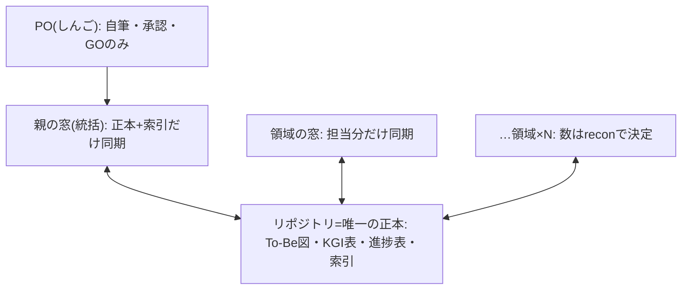
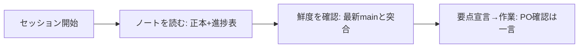

# エージェント完結の設計体制 — 設計仕様書(あるべき姿/To-Be)

> この文書は何か(専門用語なしの1行):
> POがあるべき姿を伝えてKGIを承認したら、あとはエージェントだけで設計→実装→維持が
> 回り続ける体制の理想形を定めた文書。

日付: 2026-07-03 ／ PO: しんご
状態: To-Be確定済み・recon前(§4参照)。recon後に§4と親リンクを更新する。
親(あるべき姿+KGI)へのリンク: recon後に確定
(候補: 新規テーマ、または docs/specs/design-partner-loop/README.md の子。
分離による形骸化を防ぐため、事実確認後にPOが判断する)

## 1. あるべき姿(PO自筆・原文のまま)
1. 私はあるべき姿をプランナーに伝えてKGIまでを設定する
2. KGIを設定したら私が意図したあるべき姿がエージェントのみで体現される状態
3. KGIまでの定義でエージェントが私と認識や解釈が一致している状態
4. 体現された内容が維持される状態
5. あるべき姿を変更したときも正しく認識や解釈がされてエージェントのみで体現される状態
6. KGIを達成するための不明点や事実ベースで理解できていない内容などをKGI時点では0にする
   (適用の解釈: KGI時点で0にするのは「定義の不明」。現在地の不明はrecon、手段の不明はdesignの関門で0にする)

## 2. KGI(○×で測る・PO承認済み 2026-07-03)
| # | 合格条件 | 測り方 | 合格ライン |
|---|---|---|---|
| ① | あるべき姿がPO自筆の原文で仕様書冒頭に在る | 自筆原文の記載 在=1/無=0 | 1 |
| ② | 理想形設計図(To-Be)が図解込みで在る | 図解の有無 在=1/無=0 | 1 |
| ③ | KGI承認時点で未検証の前提・未解決の不明点が無い | 前提欄の未検証数 | 0件 |
| ④ | KGI承認後「意図と違う」を理由とするPO差し戻しが無い | 進捗表の差し戻し欄の件数 | 0回 |
| ⑤ | KGI承認後〜体現完了まで、承認・GO以外のPO作業が発生しない | 進捗表のPO介入欄の件数 | 0回 |
| ⑥ | 各KGIに守り手(関所/番人、無ければ「人手で守る+理由」)が名指しで在る | 守り手記載数÷KGI項目数 | 満数 |
| ⑦ | あるべき姿の変更時、変更→文書一式(To-Be図・KGI表・進捗表)の更新→再体現の一巡が
     エージェントのみで完了する(どれか1つでも未更新なら一巡未完了と数える) | 一巡完了数÷変更回数 | 満数 |

PO介入の数え方: PO承認ゲート・GO発行・締めの一言確認は意図された関門であり介入に数えない。
数えるのは「エージェントが止まりPOが手を動かさざるを得なかった場面」。

## 3. KPI と進捗表
達成KGI数 0/7(本書納品時点)。
| KGI | 判定 | 記録(日付・根拠) |
|---|---|---|
| ① | ○ | 2026-07-03 本書§1に自筆原文 |
| ② | ○ | 2026-07-03 本書§5にMermaid図2点 |
| ③ | ○ | 2026-07-03 §4前提F1〜F7すべて検証済みまたはrecon対象として明記 |
| ④ | 測定中 | 差し戻し 0回(継続記録) |
| ⑤ | 測定中 | PO介入 0回(継続記録) |
| ⑥ | × | 守り手名指しは§9に記載済みだが機械強制は未設計(差分designで判定) |
| ⑦ | 測定中 | 変更一巡 0/0(変更未発生) |

## 4. recon(未実施・正直な明記)
本書は理想先行フロー(①あるべき姿→②KGI→③To-Be→④recon→⑤差分design)の③まで
完了した時点の納品であり、reconは未実施。To-Beが依拠する前提事実は以下の通り検証済み:
- F1 claude.aiのプロジェクト同士は直接通信できない(整合は文書経由のみ): ○プラットフォーム仕様
- F2 プロジェクトナレッジ容量330%超の中身はGitHub同期のみ(個別アップロード無し): ○PO実測 2026-07-03
- F3 既存正本3点(STANDARD-WORKFLOW.md/design-partner.md/specs索引)の実在: ○HEAD 9af6a97a で確認
- F4 実装役パイプライン(.claude/agents 7役・scripts/codex-*.sh 8本)の実在: ○同上
- F5 領域の切り方(数と名前)が実アプリ構成と一致するか: ×未検証 → ④reconの調査対象
- F6 プロジェクトナレッジのGitHub連携は同期対象のファイル/フォルダを選択できる: ○プラットフォーム仕様
- F7 リポジトリはローンチ後にprivateへ移行する: ○PO確定方針 2026-07-03。
  よって本設計はpublic非依存を必須要件とする。private移行は別便(移行便)として索引に立てる。

## 5. design(To-Be 六本柱)
- 柱1 正本は1つ・窓は複数: 全設計文書はリポジトリに置き、プロジェクトは同期範囲を絞った窓に徹する。
  器(プロジェクト)には何も溜めない。
- 柱2 領域ごとに図解込みTo-Be図: 各領域(切り方は④reconで実コード構成から導く。F5)について
  「どう構えれば体現できるか」を誰が読んでも同じ○×判定になる粒度で定義する。
- 柱3 整合は掲示板(正本文書)経由のみ: 窓同士の直接通信は存在しない前提で設計し、
  親子リンク・素人向け1行説明を全文書に義務づける。
- 柱4 PO関門は3つだけ: あるべき姿の自筆/KGI承認/GO。それ以外の停止・介入を発生させない。
- 柱5 維持は三重: KGI⑥守り手名指し+KGI⑦変更一巡+本書§9。
- 柱6 セッション開始の自動キャッチアップ(public非依存): 部品1=実装側の記帳義務(記帳なくして完了なし)、
  部品2=常設指示による正本→必読→進捗表の自動読込、部品3=鮮度確認(public期間中は直接取得を
  補助輪として併用可。private後は記帳規律+窓の同期を主とし、実物検証は認証を持つ実装役が代行)。

構造図(窓と正本):

流れ図(セッション開始の自動キャッチアップ):

## 6. 弊害・トレードオフ(空欄不可)
1. To-Be図という文書が増え、放置すれば腐る(KGI⑦と§9で守る)。
2. 理想と現状の差分が巨大化しうる(理想は緩めず、到達を複数便に分割して刻む)。
3. private移行までは直接取得(public依存の補助輪)が混在する(移行便で解消)。
4. 窓の同期には鮮度遅れがある(記帳義務+鮮度確認で吸収)。
5. recon前納品のため、親リンクと§4を後続便で更新する2度手間が発生する
   (会話消失リスクの回避を優先したPO決定 2026-07-03。KGI⑦一巡の練習を兼ねる)。

## 7. 外部・過去事例
該当あり: 「理想(To-Be)→現状(As-Is)→差分(Gap)」は業務システム導入で確立された標準手法。
本テーマはこれに「PO自筆の願い→○×のKGI」という測定の錨を加えて応用する。

## 8. 受入基準
| 基準 | 検証方法 |
|---|---|
| 柱1: リポ外にしか存在しない設計文書 0件・各窓の容量表示 100%未満 | PO目視(容量画面)+索引突合 |
| 柱2: 索引に載る全領域についてTo-Be図 在=1/無=0 | 索引と実ファイルの突合(棚卸し) |
| 柱3: 親子リンク欠落 0件 | 既存の親子構造ルール(正本§1.6)+PO目視 |
| 柱4: 承認・GO以外のPO介入 0回 | 本書§3進捗表 |
| 柱5: 守り手名指し 満数 | process-artifacts gate+PO目視 |
| 柱6: 開始時にPOが状況説明をやり直した回数 0・実装側の進捗の未記帳 0件 | 本書§3進捗表+PO目視 |

## 9. 維持の仕組み
- 守り手1(勝手な書き換え防止): 本書の変更はPR+PO承認のみ。process-artifacts gate が通過を管理。
- 守り手2(形骸化防止): あるべき姿の変更時はKGI⑦の一巡ルール(文書一式の更新なくして再体現なし)。
  一巡の判定は本書§3進捗表で人が測る(機械強制は未設計・差分designで検討)。
- 守り手3(教訓の還流): セッション締めに design-partner.md §6 への1行追記を確認する(既存ルールの適用)。
- 本書は索引 docs/specs/README.md から辿れる(本PRで登録)。
