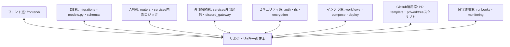

# エージェント完結の設計体制 — 差分design（design）

> この文書は何か（1行）:
> 理想（To-Be六本柱）と現状（recon実測 SHA 4778cf3c）の差分を埋める実現設計。本便は#1「領域の窓」を確定する。

表紙: ./README.md ／ あるべき姿: ./ideal-state.md ／ KGI: ./kgi.md ／ recon: ../../handoff/agent-complete-design/recon.md

## #1 領域の窓

### 窓の定義
窓とは「関心事ごとに、リポジトリの一部だけを映す同期範囲」。フォルダ構造には従属せず、
同期対象をパスの明示リストで持つ。全窓は共通で次も同期する（柱6のキャッチアップ用）:
docs/STANDARD-WORKFLOW.md ／ docs/ai-agents/design-partner.md ／ docs/ai-agents/executor-checklist.md ／
docs/specs/README.md ／ 本テーマ5文書（README/ideal-state/kgi/design/track-record）。

### 8窓の担当パスリスト（実測確定・◎=主担当）
- フロント窓: ◎frontend/
- DB窓: ◎migrations/（*rls*.sql を除く）・◎backend/app/models.py・◎backend/app/schemas/・◎backend/app/database.py
- API窓: ◎backend/app/routers/・◎backend/app/main.py・◎backend/app/middleware/・
  ◎backend/app/services/ のうち内部ロジック（inventory_*・translation_*・message_translator.py・
  commission_calculator.py・priority_scoring.py 等、外部通信でないもの）
- 外部接続窓: ◎backend/app/services/ のうち外部通信サービス（google_*・calendar_service.py・
  discord_*・fedex_*・paypal_*・meta_graph.py・email_sender.py・carrier_*・po_mailer.py・
  review_mail_notifier.py）・◎backend/app/discord_gateway/
- セキュリティ窓: ◎backend/app/auth/・◎migrations/*rls*.sql（実在9本）・◎backend/app/services/encryption.py・
  ◎backend/app/services/oauth_state.py・docs/SECURITY.md
- インフラ窓: ◎.github/workflows/・◎docker-compose.yml・docker-compose.{monitoring,test,exporters}.yml・
  ◎scripts/blue-green-cutover.sh・scripts/dry-run-blue-green.sh・scripts/run_all_migrations.sh・scripts/smoke_test_post_deploy.sh
- GitHub運用窓: ◎.github/PULL_REQUEST_TEMPLATE.md・◎.github/CODEOWNERS・
  ◎scripts/gh-pr-create-safe.sh・scripts/gh-pr-merge-safe.sh・scripts/register-pr.sh・
  scripts/new-worktree.sh・scripts/{cleanup,release,reaper}-worktree.sh・scripts/validate-*.sh
- 保守運用窓: ◎docs/runbooks/・◎monitoring/・◎scripts/sop-health-collector.js

### 重複規則と主担当
1ファイルが複数窓に映ってよい（窓は排他区画でなく関心のビュー）。ただし各ファイルの主担当窓（◎）を1つ定める。
判定基準（誰が見ても同じになる1行）: そのファイルを変更する動機が最も強い関心事を主担当とする。
例: migrations/*rls*.sql の主担当はセキュリティ窓、副はDB窓。

### 親子リンク
本テーマは「設計パートナー長期安定体制（循環の形）」の子。親=docs/specs/design-partner-loop/README.md。
（loop が仕組みの全体像、本テーマがそれをエージェントのみで駆動する節。）

### 受入基準（○×）
- 全8窓にパスリストが在る=1／無=0（満数）
- design.md に記載したパスのうち実在しないもの 0件（実装者の実在確認で担保）
- services/ 配下で主担当窓を割り当てられないファイル 0件
- 親子リンクが双方向（本テーマ表紙に親／loop表紙に子）で欠落 0件

### 維持の仕組み
- services/ の新規ファイルがどの窓にも入らない／主担当未指定になる漏れを防ぐ守り手は、
  #4便（track-record関所化）で機械化する。それまでは実装者の棚卸し（PRごとに新規サービスの窓割当を確認）で人手カバー。
- 本design.md の変更はPR＋PO承認のみ（process-artifacts gate が管理）。

### 図解
（Mermaid）

（窓同士の直接通信は無い。整合は正本Rを経由する＝柱3。）

## #2 容量（窓の除外規則）

### 目的
プロジェクト同期が330%に膨れる原因は、設計判断に不要な重い実体まで映していること。
各窓は担当パスを映すが、下記の「重い実体」は全窓で映さない（除外）。実測 SHA f42e050f 時点で
リポジトリ26MBのうち約7〜8MBがこの実体（画像4.4M・lock700K・大型seed含むSQL1.3M・docs非テキスト1.5M）。

### 全窓共通の除外規則
以下は同期対象から除外する:
- 画像: `*.png` `*.jpg` `*.jpeg` `*.gif` `*.webp`
- テストの見た目比較スナップショット: `**/*-snapshots/**`
- 部品表（自動生成）: `package-lock.json`（全階層）
- 大型初期データ: `migrations/*seed*.sql`
- キャッシュ・自動生成物: `**/__pycache__/**` `*.pyc`
- 手順書などのバイナリ文書: docs 配下の `*.pdf` `*.html`

### 残すもの（除外しない）
- スキーマ定義のmigration（`migrations/` の `*seed*` を除く `.sql`）＝テーブル構造・RLS定義は設計判断に必要。DB窓・セキュリティ窓はこれを映す。
- 設計・仕様のテキスト（*.md 等）。

### 除外物が必要になった時（逃げ道）
除外したファイルはリポジトリには在り、窓に映らないだけ。稀に中身確認が要る時は、
設計パートナーが「実装者に該当パスを取りに行かせる項目」として列挙し、実装者が生出力で渡す。

### 受入基準（○×）
- 除外規則が全窓共通で1箇所に在る=1／無=0
- 「残すもの」にスキーマ定義SQLが明記されている=1／無=0
- 逃げ道の1文が在る=1／無=0

### 維持の仕組み
- 除外規則の実効（各窓が実際に100%未満か）の測定と、規則からの逸脱検知は #4便（track-record関所化）で扱う。
  それまでは、窓の容量表示のPO目視で確認する。
- 本design.md の変更はPR＋PO承認のみ（process-artifacts gate が管理）。

## #4 track-record関所化（守り手の機械化）

### 目的
#1（窓の割当）・#2（除外規則）が「守り手は#4便で機械化」と名指ししてきた検知を、
既存の関所（process-artifacts gate）へ検査追加する形で機械化する。新しい関所は作らない（§6教訓）。
本便は設計のみ。スクリプト実装は承認後の別便。

### 第1便で機械化する検知（2つ）
- 検知c（設計図の存在チェック）: design.md に固有パスとして書かれたファイル/ディレクトリが実在するか照合し、
  実在しないものが在れば赤。目的=記号輸送崩れ等で実在しない名称が紛れるのを止める（#2で実際に発生）。
- 検知b（窓の割当漏れ）: backend/app/services/ の各ファイルが #1 の接頭辞ルールで
  必ずいずれかの窓に入ることを確認し、入らないものが在れば赤。

### 第1便で機械化しない検知（設計送り）
- 検知a（記帳漏れ=マージ済みPRにtrack-record行が在るか）: マージ後にしか判定できず、
  push時点を採点する既存関所とタイミングが合わない。検査タイミングの設計から要検討のため、
  別便でreconし直す（本design.mdの本節を入口とする）。

### 実装方針（承認後の別便で行う）
- 追加先: scripts/check-process-artifacts.js への検査追加、または専用の軽いスクリプト＋
  process-artifacts-gate.yml からの呼び出し（既存の MOCK_* テスト入口を使って本番同条件で検証する）。
- 発火条件: design.md または backend/app/services/ 配下が変更されたPRのみ（無関係PRは素通り＝空振り防止）。

### 合格基準（実装便のカードに必ず入れる・§6教訓）
- exit値だけでなく、正常時の出力文言・検査対象の行数レンジ・mainとの差分に削除が無いことまで検証する。
- 既存の緑PRが赤化しないこと（過去マージ済みPRのファイル集合で空振り＝緑を確認）。

### 受入基準（○×・本設計便）
- 検知2つ（c・b）の定義が在る=1／無=0
- 検知a を設計送りとして明記＝1／無=0
- 実装方針で「新しい関所を作らず既存gateへ追加」「MOCK_*で本番同条件検証」が明記＝1／無=0

### 維持の仕組み
- 本節の変更はPR＋PO承認のみ（process-artifacts gate が管理）。実装便完了後、
  この関所自身の検査結果を track-record に記帳する。
