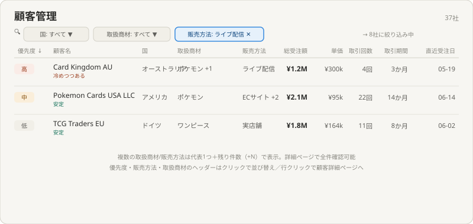
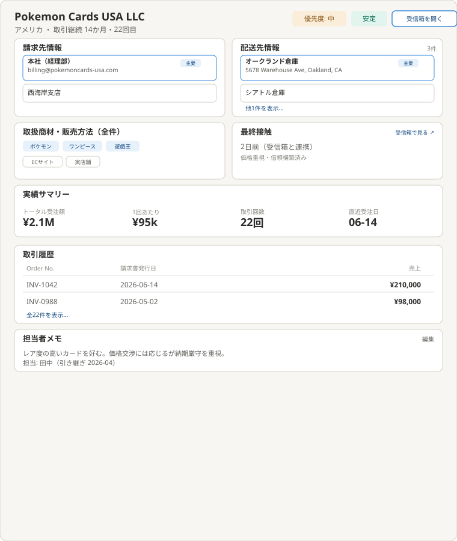

# 理想の設計図（To-Be）— 顧客管理

親: [README.md](./README.md) ／ あるべき姿: [ideal-state.md](./ideal-state.md) ／ KGI: [kgi.md](./kgi.md)

本書は「既存実装を見ずに、あるべき姿だけから描いた理想」である（design-partner.md §4.5）。recon・差分設計は本書の確定後に別便で行う。各画面の項目が実際にどのテーブル・カラムから来るかはrecon調査で確認して確定する。

## 0. 設計思想

「実績データ」と「今どうすべきか（予測・優先度）」を1つの一覧で両立させるハイブリッド構成とする。トップページは一覧性を保ちつつ、クリック後の詳細ページで顧客に関する全情報（請求先・配送先・取引履歴・担当者メモ）を1つの窓口に集約する。

## 1. トップページ

構成:
- 列順: 優先度／顧客名（下に温度感を小さく表示）／国／取扱商材／販売方法／トータル受注額／単価／取引回数／取引期間／直近受注日。
- フィルタ（一覧上部）: 国／取扱商材／販売方法の3種で絞り込み。選択中は件数表示（例: 「→ 8社に絞り込み中」）。
- ソート: 優先度／取扱商材／販売方法の列ヘッダーをクリックして並び替え。
- 複数値の表示: 取扱商材・販売方法が複数ある顧客は「代表1つ＋残り件数（+N）」で圧縮表示。詳細ページで全件確認可能。
- 行をクリックすると顧客詳細ページへ遷移する。

## 2. 顧客詳細ページ

そのOrderに関する全情報が集まる1つの窓口とする（Order詳細ページ〔売上管理〕と対になる、顧客が主役の構成）。構成:
- ヘッダー: 顧客名・国・取引継続度、優先度・温度感バッジ、「受信箱を開く」ボタン。
- 請求先情報・配送先情報（最上部・常時表示）: 複数件ある場合は縦に並べ、既定（デフォルト）には「主要」バッジを表示。3件以上は「他N件を表示…」で展開。見積もり・請求書ページ（quote-invoice）がプルダウン選択する元データと同じもの。
- 取扱商材・販売方法（全件）: トップ一覧で省略していた分を含め、タグ形式で全件表示。
- 最終接触: 受信箱と連携した最終接触日・顧客の性質メモ（価格重視/信頼重視等）。「受信箱で見る」リンクで該当会話へジャンプ。
- 実績サマリー: トータル受注額・単価・取引回数・直近受注日を大きな数字で表示。
- 取引履歴: Order No./請求書発行日/売上の一覧。全件表示への導線あり。
- 担当者メモ: 編集可能なフリーテキスト。担当者・引き継ぎ日を記録できる。

## 3. KGI（C1〜C7）との対応

| KGI | 本設計での実現箇所 |
|---|---|
| C1 パッと見れる | §1トップページ（一覧で優先度・実績が完結） |
| C2 分析（複数軸） | §1フィルタ3種・ソート3種 |
| C3 優先順位が分かる | §1優先度列・§2優先度バッジ |
| C4 特性が理解できる | §2温度感・最終接触・取扱商材/販売方法全件 |
| C5 引き継ぎができる | §2担当者メモ |
| C6 誰が見ても理解できる | §1・§2全体の平易な表示（人が見て判定） |
| C7 CRMが本格数値のベース | ダッシュボードは本テーマのデータを参照する設計とする（recon以降で確認） |

## 4. 他テーマへの申し送り

- 各画面項目の実データ源（テーブル・カラム）はrecon調査で確認して確定する。
- ダッシュボードとの参照関係（C7）は、ダッシュボードのrecon便で相互確認する。
- 見積もり・請求書ページ（quote-invoice）のプルダウン選択が、本テーマの請求先・配送先データと整合するか、quote-invoiceのrecon便で確認する。
