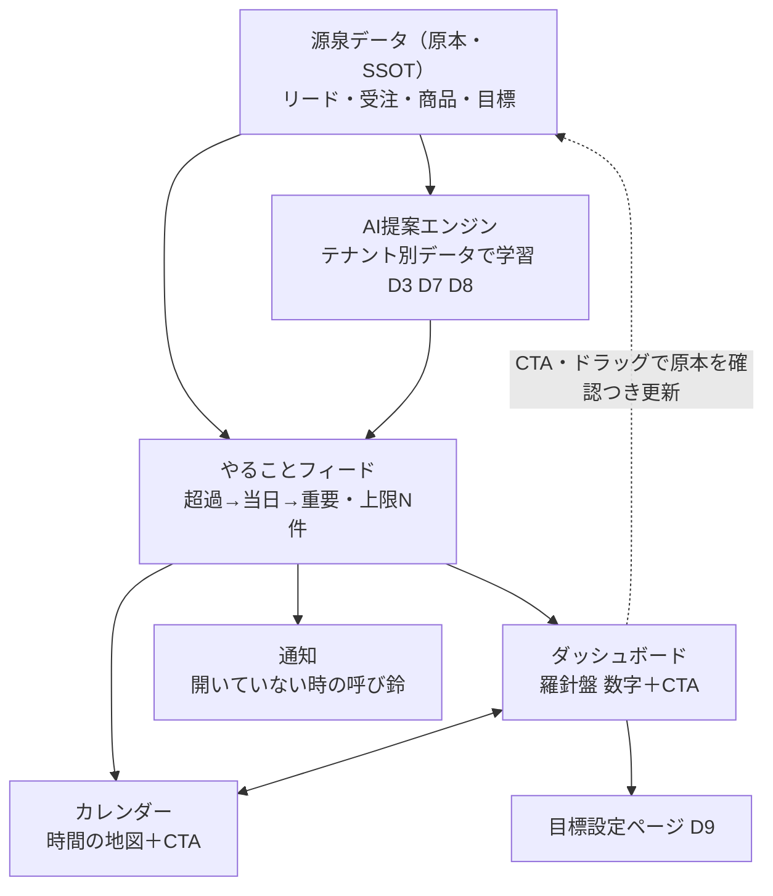

# ダッシュボード（dashboard）仕様書 — 表紙

> **この文書は何か（1行）**：ダッシュボードのあるべき姿（羅針盤・カーナビ）とKGIを束ねる表紙。原文は `ideal-state.md`、物差しは `kgi.md`。

## 構成（3ファイル標準）

| ファイル | 役割 | 書き換え権限 |
|---|---|---|
| `README.md`（本書） | 表紙：概要・境界・ステータス・案内 | Planner |
| `ideal-state.md` | あるべき姿：**POの言葉のみの正本** | **PO専用**（Planner/CCは書き換えない） |
| `kgi.md` | KGIの数値・○×条件・運用方針・設計送り事項 | Planner（PO承認必須） |

## ステータス

- **KGI承認**: D1〜D10 承認済み（PO: shingo-ops・2026-07-03）
- **導出ルール**: KGIは ideal-state.md **のみ**から導出。

## 全体構図（やることフィード＝共有の心臓部）

フィードは**1本のリスト**。ダッシュボード・カレンダー・通知はそれを別のレンズで映す窓口（食い違い0件＝D5/K5）。攻め（優先見込み客）・守り（週次アドバイザー）は独立区画としては持たず、**AI提案エンジンの初期2提案タイプ**としてフィードに流す。

## トップ画面の決定事項（過去セッション決定の採用）

- **ゾーン順序＝要約 → 目標 → 行動**（PO決定）。最上段の要約に「今やること◯件・期限超過◯件」の**バッジ**を置き、タップで行動ゾーンへ飛ぶ（D5「ゼロ操作で見える」はバッジで満たす折衷・2026-07-03確定）
- 目標バーの並び順＝**商談数 → 売上 → 成約率**（PO決定）
- 段階的開示：トップはコンパクト、明細は下層ページへ（D4）

## 境界（兄弟ドメインとの接点）

| 接点 | SSOTの持ち主 | 本ドメインの役割 |
|---|---|---|
| やることフィード | dashboard/schedule 共有部品（本書の構図が正本） | 司令塔として表示・CTA提供 |
| 受注・売上・リード等の事実 | 取引フロー `docs/specs/transaction-flow/` | 集計・表示のみ（派生値をDB列に持たない） |
| カレンダー | `docs/specs/schedule/` | フィード共有・食い違い0件 |
| 目標 | 本ドメイン（goals・D9目標設定ページ） | 目標の原本と変更履歴を持つ |

## 既知のAs-Is欠陥（recon済み事実・便で修正対象）

- `new_customers.target=0` が goals 非参照でハードコード（analytics.py:1619・origin/main 2026-06時点）＝ **D1/D9違反**。目標設定ページが全指標を覆う便で解消する。

## 維持の仕組み

- 本仕様書群が dashboard ドメインの正本。dashboard に触るPRは、設計docで KGI番号（D1〜D10）を参照すること（STANDARD-WORKFLOW §1.5/§1.6）。
- ideal-state.md はPOのみが改訂できる。
- 合流点の process-artifacts gate（`scripts/check-process-artifacts.js`）が設計doc・recon の存在と維持の仕組み欄を検査する。
