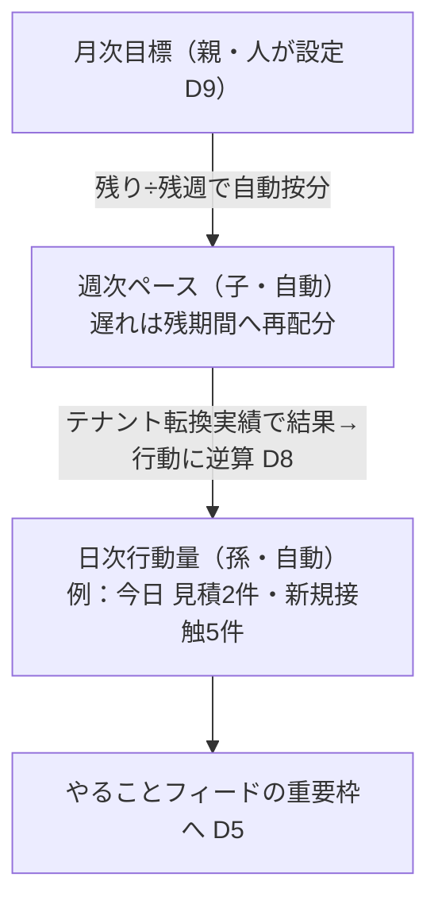

# ダッシュボード（dashboard）— KGI（PO承認 2026-07-03）

> KGIは `ideal-state.md` のみから導出。すべて数値・観測可能な事象で○×を一義判定できる形で書く（抽象語禁止）。

## KGI一覧

| # | 原文の言葉 | 合格条件 |
|---|---|---|
| D1 | 「羅針盤・カーナビ、目標と現在地」 | 表示される主要指標すべてに **目標値・現在値・達成率の3点セット** が揃う。目標未設定のまま表示される指標 **0件**。ゼロ操作で見える。目標バーの並びは **商談数→売上→成約率** |
| D2 | 「どうしたら達成できるかが見える化」 | 目標未達の指標カードには **次の一手（推奨アクション）が必ず1つ以上** 付く。「未達なのに打ち手なし」のカード **0件** |
| D3 | 「過去のデータから最適な提案・リマインド」 | システム発の提案・リマインドが **週1件以上** 自動生成され、すべてに **根拠データが添付**。根拠なし提案 **0件** |
| D4 | 「最大限コンパクト＋クリックで深堀り」 | 初期表示は **1スクリーン以内**。全カードがクリックで詳細下層ページへ遷移でき（行き止まりカード **0件**）、欲しい情報まで **2クリック以内** |
| D5 | 「アクションプランやCTAに喚起」 | やることフィードは「超過→当日」の次に **目標未達の指標に寄与する行動を最低1件** 含む（緊急案件しか表示されない日 **0日**）。初期表示は **最大N件**（提案値7）。全提案・全異常表示に **CTAが付き1クリックで実行画面へ**。フィードはカレンダーと共有＝ **食い違い0件** |
| D6 | 「成果が最大化する、それを体感できる」 | CTA経由で実行したアクションが **記録され、実行前後の数字が比較表示** される（Before/After）。「体感」は **PO自己申告○×**（運用移行後1ヶ月時点）と正直に明記 |
| D7 | 「コーチング」（学習ループ） | 全提案に **採用/見送りの記録** が残り、採用された提案は **結果（対象数字の変化）が自動で紐づく**（記録なし提案 **0件**）。提案の的中実績が深堀りページで確認できる |
| D8 | 「テナントごとにデータが溜まるほど」「新人でも」 | 提案の根拠は **そのテナント自身の蓄積データ** から構成（テナント別根拠率 **100%**・他社データ/一般論のみの提案 **0件**）。提案には次の一手＋CTAが必ず付き、**業務経験による判断を挟まずに実行まで到達できる**（判断待ちで止まる提案 **0件**）。蓄積量と精度の関係が可視化される |
| D9 | 「目標設定をするページもダッシュボードから」 | ダッシュボードから目標設定ページへ **1クリック遷移**。D1全指標の目標値を **ユーザー自身が設定・変更** できる（設定画面が無い指標 **0件**）。変更は **即時に達成率へ反映**（反映漏れ **0件**）。**目標の変更はすべて履歴に記録** され、変更前後の値と日時が確認できる（記録なしの変更 **0件**） |
| D10 | 「目標達成が容易に」「希望をもって動ける」 | 目標カスケード。下の詳細参照 |
| D11 | 「PC、スマホどちらでも〜作業がしやすい」（2026-07-03 追記原文） | スマホ幅（375px）とPC幅（1280px以上）の**両方で D1・D2・D4・D5・D9 がすべて成立**。横スクロール・レイアウト崩れによる情報の非表示 **0件**。CTA実行・目標設定の変更がスマホ実機の**タップ操作で成立**（スマホは縮小版でなく同じ物差しで○） |

## D10 詳細：目標カスケード＋希望維持設計

合格条件：
- 人が設定するのは **月次のみ**。週次ペース・日次行動量は自動導出（手動再計算 **0件**）
- 日次は結果でなく **行動量**。テナント自身の転換実績から逆算され根拠が表示される（根拠なし **0件**）。ダッシュボード・カレンダーどちらでも当日の行動量が見える
- **希望維持設計（2026-07-03 PO採用）**：
  - 再配分は **週境界のみ**（週内に今日のノルマが増えることは **0件**）
  - 必要ペースには **上限＝元ペースの1.5倍**（提案値）。超過時は数字を増やさず **到達可能性の警告＋3択CTA**（①目標を修正する→D9・履歴が残るため粉飾と区別される／②打ち手を変える→D2/D3提案／③このまま挑む）を提示（選択肢なしの警告 **0件**）
- 表示は **獲得フレーム**（「あと◯◯」でなく「ここまで◯◯」を主役に、不足は従属表示）——数値化しにくいため KGI でなく設計原則として本欄に明記（PO原文「プレッシャーでなく希望」の翻訳）

## 提案値一覧（PO差し替え可・変更は本ファイル改訂で）

| 値 | 現在値 | 由来 |
|---|---|---|
| フィード初期表示の上限N | 7件 | Planner提案 |
| 日次ペースの上限キャップ | 元ペースの1.5倍 | Planner提案 |
| AI提案の頻度 | 週1件以上 | Planner提案 |
| 深堀り到達 | 2クリック以内 | Planner提案 |

## 実装方針（2026-07-03 PO確定）

- **システム主体・AIは言語化と将来のRAG層のみ**。検知・計算・カスケード・フィード選定は決定論のコード＋SQL（ルール/統計）で実装する。理由：0件系KGIの再現性・根拠の監査可能性（D3）・RLSによるテナント分離の機械保証（D8）・コストと速度。
- 原型は本番に実在：守り（weekly-advisor-defensive）のスコア関数群＝ルールベース提案エンジン。これを育てる。
- 実装順序：**便1＝決定論の骨格**（フィード・カスケード・目標・記録）→ **便2＝ルール提案の拡充** → **便3以降＝LLM言語化・RAG**。

## 設計送り事項（③設計で決める）

- チーム目標と個人目標の扱い（team_id 付き goals の実在はrecon確認済み）
- 按分・逆算の計算式、週境界の定義（月曜起点等）
- CTAの飛び先マッピング（既存ページとの接続はrecon要）
- 通知手段（schedule K8と共通）
- 既知欠陥 `new_customers.target=0`（analytics.py:1619）の解消便
