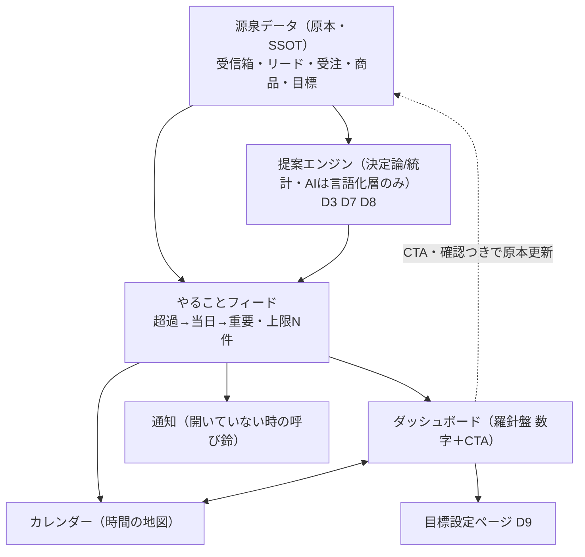

# ダッシュボード（dashboard）— 理想形設計図（To-Be）

> この文書は何か（専門用語なしの1行）:
> ダッシュボードが「羅針盤・カーナビ」として、目標と現在地とその差分・打ち手を未来志向で示し、成果を最大化できる構えを、現状を見ずに定めた設計図。

- 表紙: [README.md](./README.md) ／ あるべき姿: [ideal-state.md](./ideal-state.md) ／ KGI: [kgi.md](./kgi.md) ／ 台帳: [track-record.md](./track-record.md)
- ステータス: ③To-Be確定済み・④recon前（差分designは④の後）。
- 日付: 2026-07-07 ／ PO: しんご

## 4. recon（未実施・正直な明記）

理想先行フロー（①→②→③→④→⑤）の③まで完了。recon未実施。既知のAs-Is欠陥のみ保有（recon済み事実）: `new_customers.target=0` ハードコード（analytics.py:1619・goals非参照）／目標未設定でも数値と「ペース正常」バッジを表示する凡庸挙動（PO提供スクショ 2026-07-05）。④では目標(goals)テーブルの実在と粒度、着地予測に使える履歴データ、CTA遷移先ページの実在、指標カードの現状構成を調査対象とする。

## 5. design（To-Be）

### 全体構図（やることフィード＝共有の心臓部・SSOT）
図（正本）: [architecture-feed-ssot.svg](./architecture-feed-ssot.svg)。schedule/team-board からも本図を参照（図の実体は本テーマに単一配置）。

### 未来志向カードの型（凡庸型を構造で殺す・全指標カード共通）
図（正本）: [future-oriented-card.svg](./future-oriented-card.svg)。
全指標カードは5要素を必ず持つ: ①現在地 ②着地予測（このままなら幾ら） ③目標 ④差分の行動翻訳（不足を金額でなく「見積4件」等の行動に変換・D10接続） ⑤CTA。「今どこ・このままどこに着く・何をすれば変わる」の3問に全カードが答える。
**目標未設定のとき**: 数値も判定バッジも出さない（行き先のない地図・分母ゼロの誤判定を出さない）。唯一の表示は「目標を設定する→」（D9へ1クリック）＝最初のCTA＝目的地を決めること。

### 2レンズ（PC=作戦室 / スマホ=ポケット羅針盤・D11）
- PC(1280px〜): 3ゾーンを1スクリーンに一望（D4）。目標バーを横並びで比較・カードクリックで下層へ。計画と分析の道具。
- スマホ(375px): 同ゾーンを縦積み。ミニ数字3つ→今日の行動量→フィードは横幅いっぱいのボタン。通知→開く→タップで実行。実行の道具。ボトムナビで3画面。
- 両者は同一フィード・同一目標・同一提案（食い違い0）。密度だけが違う（D11）。

### ゾーン順序（過去決定の採用）
要約 → 目標 → 行動。最上段の要約に「今やること◯・超過◯」バッジ＋獲得表示（昨日 行動◯/◯・◯日連続達成）で「開くと良いことが確認できる」状態にする（原文「プレッシャーでなく希望」・獲得フレーム）。目標バー並びは 商談数→売上→成約率。

### 下層ページ（2階建て・D4の2クリック以内）
トップ=結論のみ／下層=理由と手段。型は共通（数字の物語→内訳→打ち手→コーチの成績表D7）。飛び先4種: 指標詳細（推移＋着地予測＋打ち手）／ファネル詳細（段別ボトルネック）／顧客健康詳細（要フォロー・リピート）／提案の成績表（D7の的中率）。深さは2階まで（原文「情報が多いと見なくなる」の下層版）。

### KGI対応（構造のどこが満たすか）
D1=3点セット必須／D2=未達カードに打ち手必須／D3=週1提案+根拠必須／D4=1スクリーン+2クリック下層／D5=フィード超過→当日→重要+CTA・食い違い0／D6=Before/After+獲得表示／D7=採用と結果の記録/的中率／D8=テナント自身のデータ由来100%／D9=目標設定1クリック+履歴／D10=月次→週次→日次カスケード+週内固定+1.5倍キャップ+3択CTA／D11=PC/スマホ両成立／D12=着地予測+行動翻訳CTA、未設定時はCTAのみ。

## 6. 弊害・トレードオフ（空欄不可）
1. 着地予測は履歴が薄いテナントでは精度が出ない → 初期は単純な線形（残÷残期間）で開始し「予測」と明示、精度はデータ蓄積で改善（D8）。予測を断定しない。
2. 未設定時に数値を隠すと「壊れて見える」懸念 → 「目標を設定する」CTAを主役に置き、空白でなく次の一手として見せる。
3. カード5要素で情報が増える懸念 → 1カード1指標・下層送りで密度を保つ（D4）。

## 7. 外部・過去事例
過去（社内）: 守り（weekly-advisor-defensive）のスコア関数群＝ルールベース提案エンジンが本番実在。D3/D8はこれを育てる。凡庸型の実害はPO提供スクショ（目標0でペース正常表示）で確認済み。外部: カーナビの「再計算・迂回提案」がキャップ＋3択CTAの発想源。B2B輸出/物販では目標対比と着地予測が仕入・与信判断に直結。

## 8. 受入基準（各基準に検証方法）
| 基準 | 検証方法 |
|---|---|
| 全指標カードに現在地・着地予測・目標・行動翻訳・CTAが揃う（欠落0） | ⑤便でカード単位のDOM点検 |
| 目標未設定の指標は数値/判定バッジ非表示・CTAのみ | 目標0テナントで実機確認（既知欠陥の解消確認） |
| 欲しい情報まで2クリック以内・行き止まりカード0 | 全カード遷移の実機巡回 |
| PC/スマホ両幅で D1・D2・D4・D5・D9 成立・横スクロール0 | 1280/375px実機 |
| フィードがカレンダーと同一（食い違い0） | 両画面の同一データ突合 |

## 9. 維持の仕組み
- 守り手1: dashboard に触るPRは設計docで本To-Beの「未来志向カード5要素」「2階建て」との整合を宣言（違反=差し戻し）。process-artifacts gate が設計doc存在を検査。
- 守り手2: 図（architecture-feed-ssot.svg / future-oriented-card.svg / mermaid）と本文の不一致は欠陥。アーキ図は本テーマが単一実体を持ち、他テーマは参照のみ（図のSSOT）。
- 守り手3: ideal-state.md はPOのみ改訂可。提案値（N=7・1.5倍等）の変更は kgi.md 改訂で行う。
