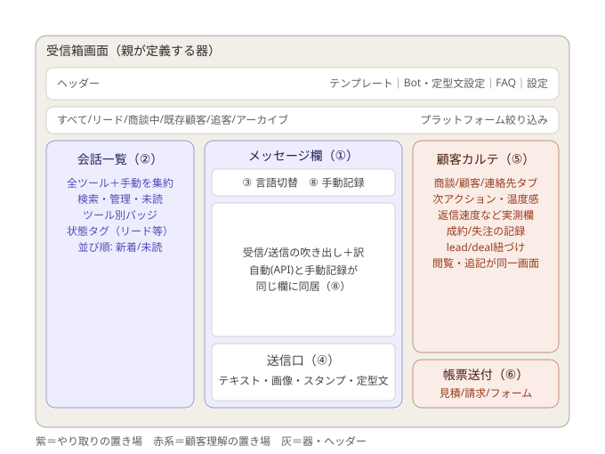

# 受信箱 design（親「見せ方」・子の配置定義）

> この文書は何か（専門用語なしの1行）:
> 受信箱の画面のどこに何を置くかを決めた配置の設計図。

親（表紙）へのリンク: [README.md](./README.md)／KGI: [kgi.md](./kgi.md)
日付: 2026-07-04
PO承認: 2026-07-04（配置図v3としてチャットにて合意）

## 1. 配置図

3列構成: 左＝会話一覧／中央＝メッセージ欄／右＝顧客カルテ＋帳票送付。
現行フロント（app.salesanchor.jp/lead-chat）の3列構成と地続きであることを
PO提供のスクリーンショット（2026-07-04）で確認済み。実装状況の突合は子テーマのreconで行う。

## 2. 配置表（区画とKGI・子テーマの対応）

| 区画 | 場所 | 対応KGI | 担当子テーマ |
|---|---|---|---|
| ヘッダーアクション（テンプレート・Bot/定型文設定・FAQ・設定） | 画面最上部右 | − | Bot・定型文 |
| 状態タブ（すべて/リード/商談中/既存顧客/追客/アーカイブ）＋プラットフォーム絞り込み | ヘッダー直下 | ② | − |
| 会話一覧（全ツール＋手動を集約・ツール別バッジ・状態タグ・並び順は新着/未読） | 左列 | ② | − |
| 言語切替（日/英/原文＋訳） | メッセージ欄上部 | ③ | 翻訳・グロッサリ |
| 手動記録ボタン | メッセージ欄上部（言語切替と並ぶ） | ⑧ | − |
| 吹き出し欄（自動APIと手動記録が同居・訳表示付き） | 中央 | ①⑧ | 翻訳・グロッサリ（訳表示） |
| 送信口（テキスト/画像/スタンプ/定型文） | メッセージ欄下部 | ④ | Bot・定型文（定型文） |
| 顧客カルテ（商談/顧客/連絡先タブ・実測欄・成約/失注記録・lead/deal紐づけ） | 右列上〜中 | ⑤ | 顧客カルテ |
| 帳票送付（見積/請求/フォーム） | 右列最下部 | ⑥ | 帳票・フォーム送付 |

## 3. 3列の畳み順（狭い画面幅）

優先順位: 会話 > 一覧 > カルテ。畳み方・切替UIの質はアプリ全体のフロント定義側が担当（本テーマは順位のみ定義）。

## 4. 弊害・トレードオフ（空欄不可）

- 3列は広い画面幅前提。モバイル幅では同時表示できず、切替表示が必要（質はフロント定義側）。
- ヘッダーアクションが4つあり、狭い幅では窮屈になり得る（畳み方はフロント定義側）。
- 手動記録は人の入力に頼るため、記録漏れ・記録遅れは配置では防げない（README境界参照）。

## 5. 外部・過去事例

LINE / WhatsApp の「一覧が左・会話が中央」の型を踏襲し、右列に顧客理解（カルテ）を加えた3列構成。
一覧＋会話＋顧客情報の3列は営業向けメッセージ管理ツールで一般的な型であり、独自配置による学習コストを避ける。

## 6. 受入基準

kgi.md の8項目がそのまま受入基準（各項目に測り方を紐づけ済み）。配置固有の基準は
「本design §2 の全区画が画面上に存在すること（区画の在無 9/9）」。

## 7. 維持の仕組み（空欄不可）

- 守り手: 人手で守る。
- 理由: 配置は文書定義であり、現時点で照合できるCI関所が無い。KGI⑦（子テーマ置き場の満数）と
  §2 配置表の整合を、子テーマ作成時のPRレビューでPO・設計パートナーが確認する。
  索引に子テーマが登録された時点で⑦の分母が増えて×になる仕掛けが、本designの更新忘れを炙り出す。

## 8. 接触面分析（6面走査）

- ①人: 影響あり。PO・営業担当が使う画面の配置合意そのもの。
- ②エージェント: 影響あり。子テーマの設計・実装時に本designを親子リンク経由で読む前提。
- ③機械: 影響なし。本便は文書のみでCI/関所/フックの変更なし。
- ④データ: 影響なし。本便はDB・テナントに触れない（tenant_004 本番にも非接触）。
- ⑤本番: 影響なし。deploy対象なし。
- ⑥外部: 影響なし。外部API・利用者向け挙動の変更なし。
