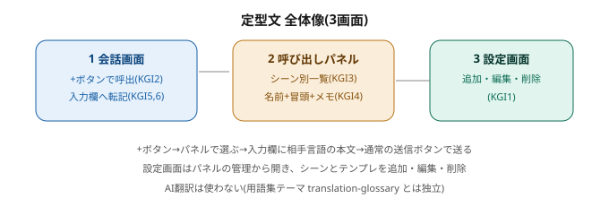
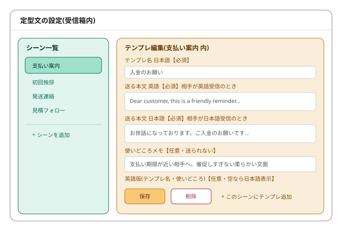
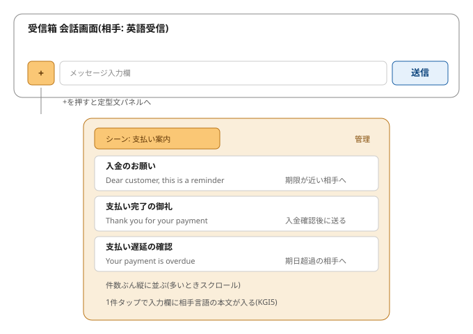
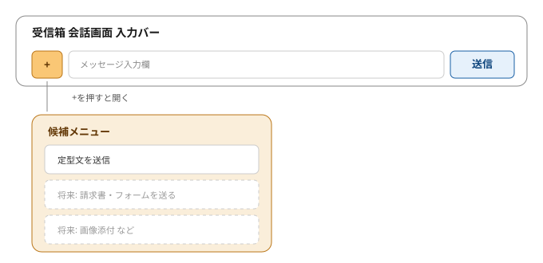

# design.md — 定型文(受信箱 子テーマ)To-Be設計

> この文書は何か(専門用語なしの1行):
> 人が前もって書いた文章のひな型を、受信箱の入力欄横のボタンから呼び出してそのまま送るための、画面と持ち物の作りを決めた設計書。理想形を先に固め、現状との差分は後で測る。

親(あるべき姿+KGI)へのリンク: [定型文 README](README.md)
兄弟文書: [ideal-state.md](ideal-state.md) / [kgi.md](kgi.md)

## 0. 本書の位置づけ
- 本書は To-Be(あるべき理想の実現方法)を先に確定したもの。現状に寄せず理想形へ近づける方針。
- recon依存の欄(§1現状・§9守り手の実在確認・§10接触面6面)は、recon便で実測して確定する。本書時点ではプレースホルダとして明記する。
- AI翻訳は使わない。翻訳の用語集は translation-glossary が正本で、本テーマとは独立。

## 1. reconで確定した現状(recon便で実測・現時点プレースホルダ)
- 未実測。次のrecon便で file:line 実物により把握する対象:
  - 受信箱の会話画面(入力バー)の実装場所とメッセージ送信の口。
  - 二層データ(デフォルト+テナント上書き)の既存の持ち方(link_templates 等の先行例)。
  - テナント分離(RLS)の適用パターン(ADR-072 ほか)。

## 2. あるべき姿(PO自筆・正本は ideal-state.md)
- 受信箱の設定画面から定型文を追加・編集・削除できる。
- 受信箱の入力欄横のボタンから定型文を呼び出して使える。
- シーンごとに振り分けて選べ、どこに何が入っていてどう送るかが人にすぐ分かる。
- 選ぶと入力欄に本文が入り、通常の送信ボタンで送る。

## 3. 画面構成(3画面)
- 3-1. 会話画面の呼び出し口: 入力欄の左端に「+」ボタン。押すと候補メニューが開き、「定型文を送信」を選ぶと定型文パネルが開く。今回の候補は「定型文を送信」1項目のみ。将来の項目(請求書・フォーム送付 等)は各テーマが自分の入口を足す(点線=別テーマ)。
- 3-2. 呼び出しパネル: シーンを選ぶと、そのシーン内のテンプレが件数ぶん縦に並ぶ。各行はテンプレ名・送る本文の冒頭・使いどころメモの3情報(シーン名と合わせKGI4の4点)。1件タップで入力欄に相手の受信言語の本文が入る。送信は通常の送信ボタン。パネルの「管理」から設定画面へ。
- 3-3. 設定画面(受信箱内): 左にシーン一覧(自由に追加・命名)、右に選択中シーン内のテンプレ編集(追加・編集・削除)。

図(全体像): 

図(設定画面): 

図(呼び出しパネル): 

図(+メニュー): 

## 4. 持ち物(データ構造・理想形)
- シーン: テナントが自由に作成・命名(フォルダ相当)。運営はデフォルトのシーン例を用意。将来の機能連携が要るシーンだけ表示名と別に内部キーで固定(設計送り)。
- テンプレ1件:
  - テンプレ名: 日本語【必須】/ 英語【任意・空なら日本語表示】
  - 送る本文 英語【必須】: 相手が英語受信のとき送られる
  - 送る本文 日本語【必須】: 相手が日本語受信のとき送られる
  - 使いどころメモ: 日本語【任意】/ 英語【任意】・送られない・表示専用
- 二層データ: デフォルト(運営提供)+テナント上書き。照合はテナント→デフォルトの順(テナント優先)。詳細はrecon後の差分designで詰める。
- テンプレ本文は固定文(差し込み穴=相手の名前等の自動差し込みは第2期)。

## 5. 挙動(理想形)
- 入力欄への転記: その会話の相手の受信言語で自動選択(英語受信→英語本文、日本語受信→日本語本文)。相手の受信言語が未判定(初回等)の既定は英語。ADR-SA-17 の双方向判定と同じ考え方。
- 転記後の本文は自由に書き換え可能(テンプレは下書き投入のみ・送信は通常の手打ちと同一扱い)。
- 送信は通常の送信ボタン(テンプレ専用の送信経路を作らない)。会話に通常メッセージとして並ぶ。
- 呼び出しパネル/設定画面のスタッフ向け表示(名前・使いどころ)は、英語版があればスタッフの表示言語に合わせ、無ければ日本語を表示。

## 6. KPI(○×・数値。親kgi.md 7項目に対応)
| KPI | 測り方 | 合格ライン |
|---|---|---|
| P1 追加・編集・削除 | 1件で3操作を実測 | ○/3(KGI1) |
| P2 呼び出し口 | +ボタン→候補「定型文を送信」→パネル開くを実測 | 1/0(KGI2) |
| P3 シーン振り分け | シーン2つ以上で一覧切替を実測 | 1/0(KGI3) |
| P4 4点表示 | シーン名・テンプレ名・本文冒頭・使いどころメモの表示を実測 | ○/4(KGI4) |
| P5 言語別転記 | 相手が英語受信/日本語受信の2ケースで実測 | ○/2(KGI5) |
| P6 通常送信 | 転記後に通常送信・会話に並ぶを実測 | 1/0(KGI6) |
| P7 日英本文必須 | 片方だけで保存を試み弾かれるを実測 | 1/0(KGI7) |

## 7. 弊害・トレードオフ(空欄不可)
- 送る本文を日英必須にするため、テンプレ作成時に両方書く手間が増える。片方だけでは双方向送信に穴が空くため必須とする。
- スタッフ補助の英語版は任意のため、英語圏スタッフ向けの表示は各テナントが英語を入れたテンプレに限られる。
- 固定文のみのため、相手の名前・注文番号は毎回手で直す手間が残る(入力欄で書き換え可)。差し込みは第2期。
- テンプレ増加時、呼び出しパネルの一覧が縦に長くなる(多いときスクロール)。折り畳み等の見せ方はrecon後の差分designで詰める。
- 二層データのデフォルトをテナントが改名/削除できると、将来の機能連携で参照先が消えうる。連携が要るシーンのみ内部キー固定で回避(設計送り)。

## 8. 触らない範囲
- AI翻訳・用語集=translation-glossary が正本。
- 請求書・フォームの送付そのもの=invoice-form-send / quote-invoice。
- 会話ログの紐付け・取引の事実=transaction-flow が正本。
- 操作感・見た目の質=component-standard / design-system。

## 9. 維持の仕組み(recon便で守り手の実在確認・現時点プレースホルダ)
- 対象: テナント上書きデータの分離が壊れると他テナントのテンプレが混ざる/漏れる。日英本文の必須(KGI7)が壊れると片言語しか送れないテンプレが混入する。
- 守り手候補(recon便で実在パス確認): テナント分離=RLS(ADR-072 ほか)/日英必須=サーバー側の保存時バリデーション。
- 関所なしの場合(現時点): 人手で守る。理由=本書は書類段階でUI関所が未実装のため。recon後に機械強制の要否を設計する。

## 10. 接触面分析(6面走査・recon便で実測・現時点プレースホルダ)
- (1)人: テナントの営業スタッフ(呼び出し・送信)・テンプレ管理者(設定画面)。
- (2)エージェント: 本design.md・親kgi.md・ideal-state。invoice-form-send の設計送り(テンプレ編集ページ)の受け先が本テーマである旨を周知。
- (3)機械: 保存時バリデーション(日英必須)・既存CI関所との接触はrecon便で走査。
- (4)データ: テンプレ/シーンのテーブル(デフォルト+テナント)・相手の受信言語の在り処。tenant_004本番は特別注意。recon便で実測。
- (5)本番: 実装フェーズで発生(現段階は書類のみで影響なし)。
- (6)外部: 海外バイヤー(送られる本文の受信言語)。翻訳APIは使わない。

## 11. 設計送り事項(recon後の差分design / 第2期)
1. 二層データ(デフォルト+テナント上書き)の具体的な持ち方・照合の実装。
2. 差し込み穴(相手の名前・注文番号等の自動差し込み)。第2期。
3. 連携が要るシーンの内部キー固定(表示名は自由・キーは固定)。
4. 呼び出しパネルのテンプレ多数時の見せ方(折り畳み・検索)。
5. スタッフ補助の英語版UIの詳細。

## 維持の仕組み
- 守り手: 人手で守る
- 対象: テナント上書きデータの分離・日英本文の必須。
- 関所なしの理由: 本書は書類段階でUI/バリデーション関所が未実装のため。recon便で守り手(RLS・保存時バリデーション)の実在確認と機械強制の要否を設計する。
