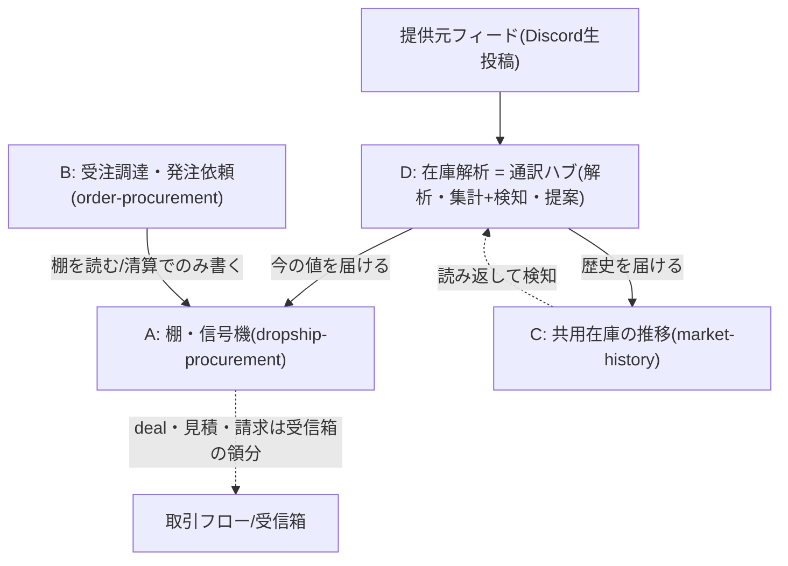

# テーマ4分割の決定記録（restructure-plan）

> この文書は何か（専門用語なしの1行）:
> 2026-07-04にPOが決めた「在庫まわりを4テーマに分ける」内容と境界線を、
> セッションの記憶が消えても再開できるように固定した記録。

親: [README.md](./README.md) ／ 決定者: PO（しんご） ／ 記録者: 設計パートナー

## 1. 4テーマ構成（決定）

- CはAと完全独立（共通の源はDの集計のみ）。DはCを読むだけ。
- 見積・請求5分のKGIはどのテーマにも属さず除外（必要なら受信箱側で再定義）。

## 2. KGIの行き先（旧 kgi.md PR #2744版の行番号→新居）
| 旧記載 | 新居 |
|---|---|
| KGI-1前半（在庫問い合わせ5分） | A（kgi.md A1） |
| KGI-1後半（見積・請求5分） | 除外（受信箱側の領分） |
| KGI-2全部（候補3件・詳細一致・手動・発注メッセージ1分） | B |
| KGI-3のうち 2状態・仮押さえ・数字入力・2分岐・清算実行・直前確認 | B |
| KGI-3のうち 鮮度3段階・黄降格表示・棚の権限・監査・矛盾通知 | A |
| KGI-4のうち 記録・チャート・自社限定（旧42-44行） | C |
| KGI-4のうち 検知アナウンス（旧45-46行）＋KGI-5全部 | D（起案待ち） |

## 3. テーマD（在庫解析）の文面保管（フォルダ未作成の理由つき）
POの言葉（そのまま移植・起案時にideal-stateへ）:
- 「変動はシステムが検知して提案の材料として営業に知らせ、さらにエージェントが
  顧客と在庫の状況を突き合わせて『今、この顧客にこれを提案してください』と
  根拠つきで助言してくれる。」（2026-07-03承認の旧追記2第2文）
- 「提供元フィードをD在庫解析が集計してAとCに届ける」（2026-07-04 PO発話）

フォルダを作らない理由: Dの入口機能（フィード解析・集計）は既存
spec.md F3（ルールベース解析エンジン:122行）／F4（Gemini:143行）／
F5（Discord Bot受信:161行）／F6（差分反映:176行）に実在するため、
三分類判定（新規か既存の延長か）が未了。無断新規を避ける（増産防止）。

## 4. 画面方針（採用済み・SVG清書は後続便）
- 画面1（在庫検索）→A。見積・請求への直行ボタンは置かない（PO指示 2026-07-04）
- 画面2（調達候補3択）・画面3（発注依頼カード）→B
- 画面4（チャート上半分→C、検知・提案の下半分→D）
- 4画面のワイヤーSVG清書と同梱は後続便（本便は決定の文章固定を優先）

## 5. 既存正本との衝突メモ
- spec.md F7「営業向け在庫検索UIと見積画面連携」（197行）は
  「見積・請求は受信箱から」のPO指示（2026-07-04）と衝突 → 改訂要否はrecon便で判定

## 6. 未決リスト
1. B・C・Dの ③To-Be本文と画面ワイヤーSVG（後続便）
2. Cの論点: フィード外事実（清算・報告）をチャートに刻むか
   （設計パートナー推奨: 市場観測に徹する＝刻まない）
3. Dの三分類判定（既存spec.mdの延長か新規か）と置き場所
4. 索引 docs/specs/README.md の行更新（29行のpending解消＋B/C行追加。
   着手前に active-work.md で他セッションの索引編集中を確認する）
5. ④recon以降の解禁（取引フロー境界照合後）
