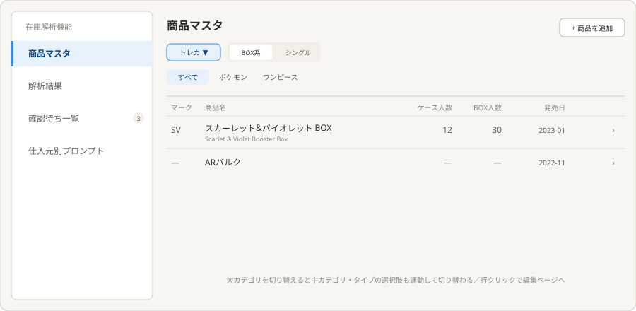
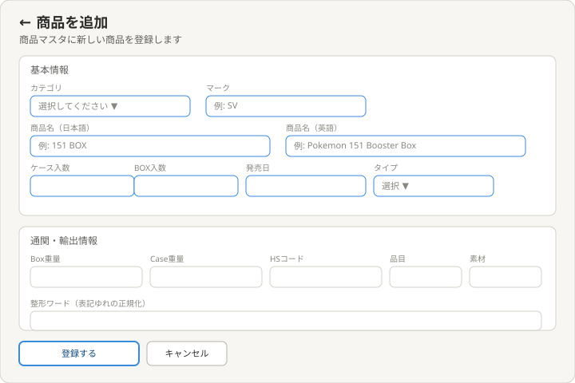
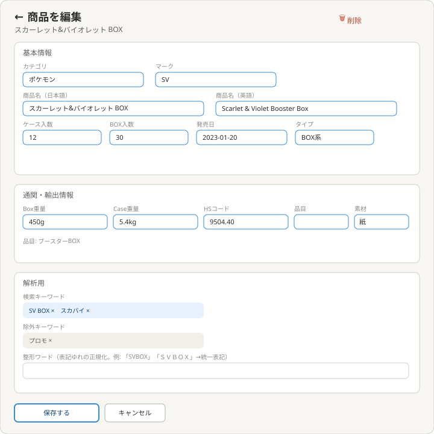
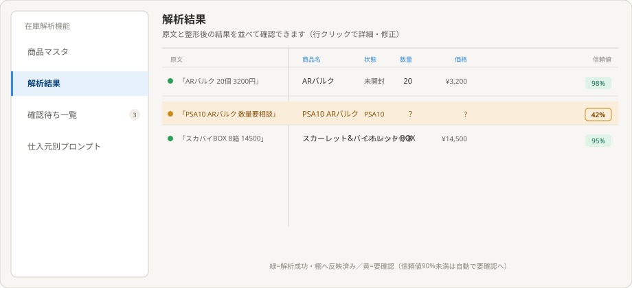
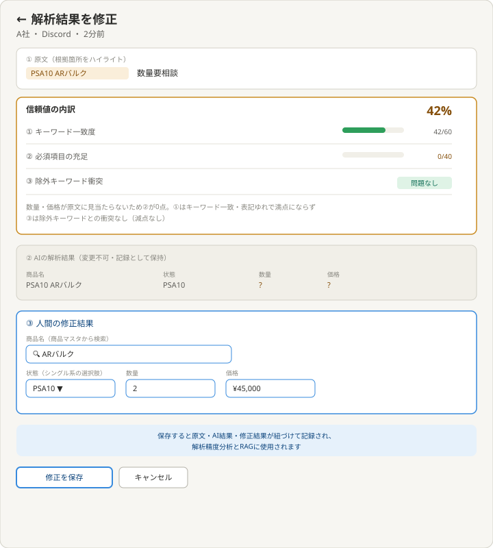

# 理想の設計図（To-Be）— 在庫解析機能（feed-translation）

親: [README.md](./README.md) ／ あるべき姿: [ideal-state.md](./ideal-state.md) ／ KGI: [kgi.md](./kgi.md)

本書は「既存実装を見ずに、あるべき姿だけから描いた理想」である（design-partner.md §4.5）。recon・差分設計は本書の確定後に別便で行う。

## 0. 設計思想

「提供元メッセージ(Discord/LINE)を、推測せず正確に解析し、不明なものは人間に報告する」という原則を、5つのサイドメニュー画面で実現する。信頼値という数値で解析の確からしさを可視化し、人間の修正はAI結果を消さずに紐づけて記録し、RAGとして今後の解析精度向上に使う。

## 1. 商品マスタ（一覧）

サイドメニュー5項目（商品マスタ／解析結果／確認待ち一覧／仕入元別プロンプト）の入口。構成:
- ヘッダー右に「商品を追加」ボタン。
- 大カテゴリ（トレカ／フィギュア等）のプルダウン。切り替えると中カテゴリタブ・タイプスイッチの選択肢も連動して切り替わる。
- タイプの小型セグメントスイッチ（BOX系／シングル&パック）。在庫管理トップページと同じ操作パターン。
- 中カテゴリタブ（すべて／ポケモン／ワンピース等）。
- 一覧列（BOX系選択時）: マーク・商品名（日英併記）・ケース入数・BOX入数・発売日。シングル&パック選択時はケース入数・BOX入数列が非表示になる。
- 行クリックで編集ページへ遷移。

## 2. 商品を追加

基本情報（カテゴリ・マーク・商品名日英・ケース入数・ボックス入数・発売日・タイプ）、通関・輸出情報（Box重量・Case重量・HSコード・品目・素材）、解析用（検索キーワード・除外キーワード・整形ワード）の3グループで新規登録する。

## 3. 商品を編集

一覧の行をクリックすると開く。追加ページと同じ3グループ構成で、既存値が入力済みの状態から編集する。タイトル右に削除ボタンを持つ。検索キーワード・除外キーワードはタグ形式で個別に削除できる。

## 4. 解析結果（一覧）

原文と整形後の結果を同じ行で左右に比較できる。構成:
- 左半分: 原文（AIが根拠とした部分をハイライト表示）。
- 右半分: 整形後の商品名・状態・数量・価格。
- 信頼値列（合計%のみ）。90%以上は緑、90%未満は黄で自動的に「要確認」となる。
- 1通のメッセージに複数商品が含まれる場合は、原文（親行）の下に読み取れた商品を明細（子行）として展開表示する（レシート形式）。件数バッジ「3件中1件要確認」で全体状況が一目で分かる。
- 行クリックで詳細・修正ページへ遷移。

## 5. 解析結果の詳細・修正

構成（上から）:
- ①原文（根拠箇所をハイライト・変更不可）。
- 信頼値の内訳サマリ: ①キーワード一致度／②必須項目の充足／③除外キーワード衝突チェックの3項目。①②は点数バー表示、③は「問題なし／衝突あり」の○×表示（除外キーワードとの衝突は「一発アウト」の別枠ルールとして、通常の点数計算に混ぜない）。合計信頼値を大きく表示。
- ②AIの解析結果（変更不可・グレーアウト表示で記録として保持）。
- ③人間の修正結果（入力欄）: 商品名は商品マスタからの検索候補が出るオートコンプリート。状態は、選んだ商品がBOX系かシングル系かで選択肢が自動的に切り替わるプルダウン。数量・価格は直接入力。
- 保存すると①②③が1件の記録として紐づけて保存され、解析精度分析とRAGの学習データとして使用される旨を明記。

## 6. サイドメニュー（共通）

5項目: 商品マスタ／解析結果／確認待ち一覧／仕入元別プロンプト。幅224px、項目名は折り返さない（white-space: nowrap相当）。「確認待ち一覧」には未対応件数のバッジを表示する。

## 7. KGI（K1〜K8）との対応

| KGI | 本設計での実現箇所 |
|---|---|
| K1 4種データの確認 | §1〜§5の各画面 |
| K2 検索・除外キーワード登録 | §2・§3の解析用グループ |
| K3 仕入元別プロンプト登録 | サイドメニュー「仕入元別プロンプト」 |
| K4 信頼値表示・自動判定 | §4信頼値列 |
| K5 信頼値の内訳表示 | §5信頼値の内訳サマリ |
| K6 原文・AI結果・修正結果の紐付け | §5保存時の記録 |
| K7 RAG活用可能な形式での保存 | §5保存時の記録 |
| K8 大カテゴリ連動 | §1大カテゴリプルダウン |

## 8. 他テーマへの申し送り

- 信頼値の具体的な計算式（キーワード一致度・必須項目充足の重み付け）はrecon以降の差分設計で確定する。
- 「確認待ち一覧」画面自体の詳細レイアウトは、§4・§5の構成を踏襲する想定だが、別途確認が必要。
- RAGの具体的な活用方法（分析画面の有無）は未定義。別途検討する。
- 本書のSVG（§1〜§5）はトレカ・BOX/CASE想定で作成した。PACK・シングルカードの場合の表記差分（ケース入数・BOX入数以外にも変わりうる項目の有無）は、本テーマの正本化完了後に別途定義する（PO 2026-07-13）。
- 大カテゴリ（トレカ／フィギュア等）はプルダウンとして構造のみ確定済み。フィギュア等トレカ以外の商材をこのアプリでどう扱うか（項目構成・解析対象か等）は未定義。本テーマの正本化完了後に別途定義する（PO 2026-07-13）。
