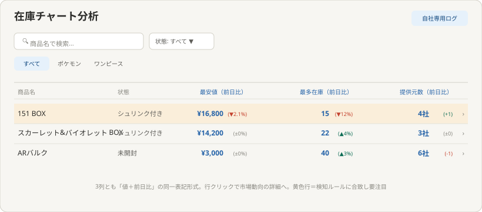
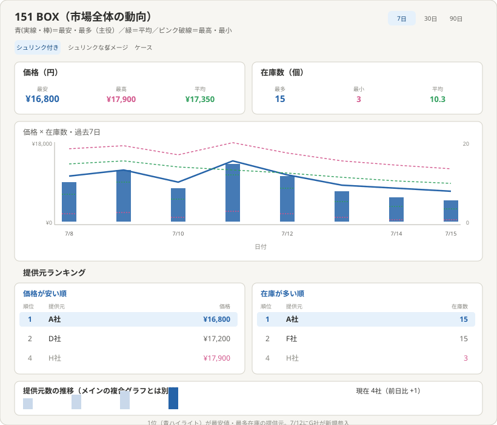
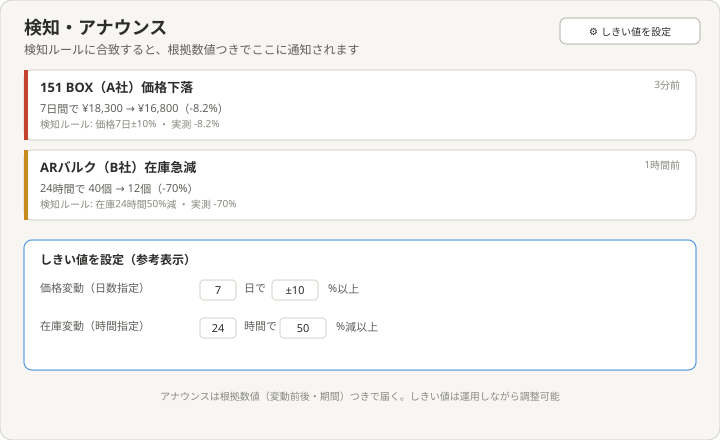

# 理想の設計図（To-Be）— 在庫チャート分析機能（inventory-analytics）

親: [README.md](./README.md) ／ あるべき姿: [ideal-state.md](./ideal-state.md) ／ KGI: [kgi.md](./kgi.md)

本書は「既存実装を見ずに、あるべき姿だけから描いた理想」である（design-partner.md §4.5）。recon・差分設計は本書の確定後に別便で行う。feed-translation（在庫解析機能）が解析・整形した在庫データを土台とする。

## 0. 設計思想

「エージェントによる能動的な提案」ではなく、「記録・見える化・検知・比較分析」に専念する。市場全体の相場感（最安値・最多在庫という"有利な条件"）を主役に、誰が見ても直感的に判断できる粒度で提供元を比較できるようにする。

## 1. メインページ（一覧）

構成:
- ヘッダーに「自社専用ログ」バッジ（J2: 他テナント非表示の明示）。
- 検索・状態プルダウン・カテゴリタブ（他テーマと共通のツールバー構成）。
- 一覧列: 商品名・状態・最安値（前日比）・最多在庫（前日比）・提供元数（前日比）。3列とも「値＋前日比」を同一セル内に括弧で併記する統一表記（前日比は独立列にしない）。
- 検知ルール（J3）に合致した商品の行は黄色でハイライトし、要注目であることを示す。
- 行クリックで下層ページ（市場動向の詳細）へ遷移。

## 2. 下層ページ（市場動向・ランキング・提供元数推移）

1商品を選んだ後の詳細分析画面。構成:
- タイトル右に期間切替（7日／30日／90日）。
- 状態タブ（シュリンク付き／シュリンクなし／ダメージ／ケースの4種）で切り替え。
- サマリー統計カード: 価格（最安・最高・平均）、在庫（最多・最小・平均）。見出しは大きく表示し、最安・最多の数値のみ太字で強調する。
- 複合グラフ: X軸に日付、左Y軸に価格（円）、右Y軸に個数（個）を表記。
  - 価格: 実線（青）＝最安値（主役）、破線（緑）＝平均、破線（ピンク）＝最高値。
  - 在庫: 棒グラフ（青の塗りつぶし）＝最多（主役）、棒内の点線（緑）＝平均、棒内の点線（ピンク）＝最小。
  - 色の意味は共通ルール: 青＝有利な方向（最安・最多）、緑＝平均、ピンク破線＝不利な方向（最高・最小）。
- 提供元ランキング: 「価格が安い順」「在庫が多い順」を、グラフの直下に横並びで配置。各表は順位・提供元名・値の3列。1位は青ハイライト。行クリックでその提供元の詳細へ。
- 提供元数の推移: メインの複合グラフとは別枠の、コンパクトな専用棒グラフ。現在値と前日比を見出し右に表示し、直近の棒を青で強調する。新規参入等の出来事は下部に一言で補足する。
- 記録ログ（別途）: 価格変動・在庫変動に加え、提供元数の増減も「提供元が1社増加（3社→4社・新規: G社）」のように1行のテキストで記録する。

## 3. 検知・アナウンス画面

構成:
- アナウンス一覧: 色付き左ボーダーで種類を区別（赤＝価格下落、黄＝在庫急減）。「7日間で¥18,300→¥16,800（-8.2%）」のように根拠数値を明記し、検知ルールとの対比（基準±10%に対し実測-8.2%）も表示する（J3の根拠数値つきアナウンスの実現）。
- しきい値設定: 価格変動（日数×%）・在庫変動（時間×%）を数値入力で調整できる。しきい値はアプリ全体で共通の1つの設定として持ち、商品・提供元ごとの個別設定は持たない（PO 2026-07-15）。初期値は価格7日±10%、在庫24時間50%減。

## 4. KGI（J1〜J7）との対応

| KGI | 本設計での実現箇所 |
|---|---|
| J1 期間指定チャート | §2複合グラフ・期間切替 |
| J2 自社限定 | §1「自社専用ログ」バッジ |
| J3 根拠数値つきアナウンス | §3アナウンス一覧・しきい値設定 |
| J4 複数提供元・状態別比較 | §2状態タブ・複合グラフ |
| J5 サマリー統計6指標 | §2サマリー統計カード |
| J6 提供元ランキング | §2提供元ランキング |
| J7 提供元数の現在値・前日比・推移 | §1メインページ列・§2提供元数専用グラフ |

## 5. 他テーマへの申し送り

- 検知ルールのしきい値の詳細な計算式（何を根拠に何%とするか）はrecon以降の差分設計で確定する。
- 提供元ランキングの並び順（同率順位の扱い等）の詳細はrecon以降で確定する。
- feed-translation（在庫解析機能）が出力する在庫データとの接続方式（データの受け渡し形式）はrecon以降で確認する。
