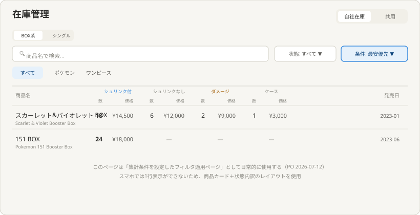
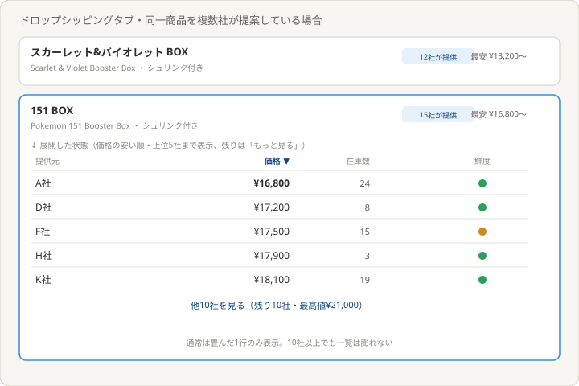
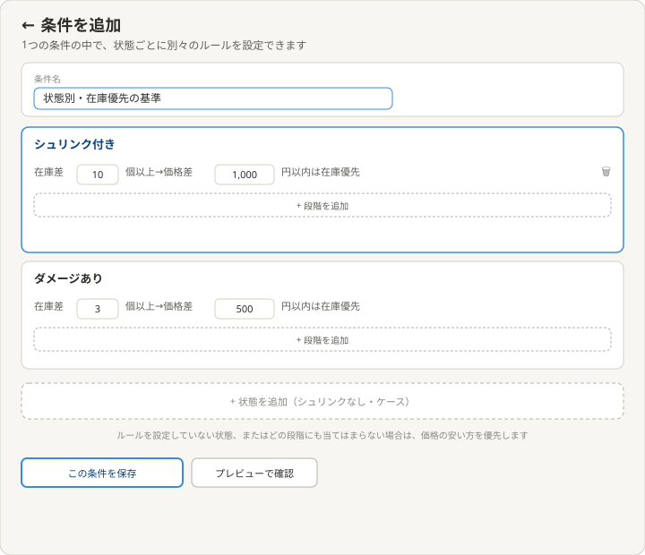

# 理想の設計図（To-Be）— 在庫管理（親）

親: [README.md](./README.md) ／ あるべき姿: [ideal-state.md](./ideal-state.md) ／ KGI: [kgi.md](./kgi.md)

本書は「既存実装を見ずに、あるべき姿だけから描いた理想」である（design-partner.md §4.5）。recon・差分設計は本書の確定後に別便で行う。A/B/C/feed-translation各テーマの詳細な業務ロジック（仮押さえ・鮮度信号など）は各テーマのkgi.mdが正であり、本書では扱わない。

## 0. 設計思想

営業担当が「迷わず・すぐ・簡単に」在庫を確認できることを最優先する。自社在庫とドロップシッピング（共用）在庫は、混同を防ぐため明確に分離して表示する。複数の提供元が同一商品を提案する場合は、一覧を膨らませずに畳んで表示し、どの提供元をトップに出すかは営業担当が条件として設定できるようにする。

## 1. トップページ

構成（上から）:
- タイトル行: 「自社在庫／ドロップシッピング」のセグメントスイッチ（最上部・データを完全に分離）。
- 小型セグメント: 「BOX系／シングル&パック」（列構成が変わる大きな切り替え）。
- 検索欄（商品名で検索）と「状態」プルダウン、その右に「条件」プルダウン（複数提供元がある場合にどれをトップ表示するか）。
- カテゴリタブ（すべて／ポケモン／ワンピース等）。
- 一覧本体: BOX系は1商品1行で、状態（シュリンク付き／シュリンクなし／ダメージ／ケース）ごとに数量・価格を横並び表示。存在しない状態は「—」。商品名の下に英語名を併記。提供者列は自社在庫タブでは非表示、ドロップシッピングタブでのみ表示。
- 運用方針: このページは「集計条件を設定したフィルタを適用したページ」として日常的に使用する（PO 2026-07-12）。
- スマホでは1行表示ができないため、商品カード＋状態内訳のレイアウトを使用する（別途）。

## 2. 複数提供元の畳み・展開表示

ドロップシッピングタブで同一商品を複数社が提案している場合:
- 通常は畳んだ1行のみ表示。商品名の右に「◯社が提供」バッジと最安値を表示。
- クリックで展開すると、価格の安い順に提供元一覧（提供元・価格・在庫数・鮮度）が表示される。
- 上位5社まで表示し、それ以降は「他N社を見る（残りN社・最高値◯円）」の1行にまとめる。
- これにより10社以上が同一商品を提案していても、通常時の一覧は商品数と同じ行数のまま膨れない。

## 3. 条件設定・条件追加（状態ごと）

- デフォルトの条件は「最安優先」「在庫数優先」の2つのみ。
- ツールバーの「条件」プルダウン内に「条件を追加する」ボタンがあり、押すと下層の条件追加ページへ遷移する。
- 条件追加ページでは、1つの条件名の中に状態ごとの独立したセクションを持つ。各セクションは「在庫差が◯個以上のとき、価格差◯円以内なら在庫の多い方を優先する」というルールを、複数段階で設定できる（「段階を追加」ボタン）。
- ルールを設定していない状態、またはどの段階にも当てはまらない場合は、価格の安い方を優先する（既定動作）。
- 状態を追加するボタンで、あとから対象の状態を増やせる。
- 保存した条件は、トップページの「条件」プルダウンから選択して即座に一覧の並びに適用できる。

## 4. KGI（I1〜I8）との対応

| KGI | 本設計での実現箇所 |
|---|---|
| I1 2種の在庫が明確 | §1タイトル行のセグメントスイッチ（自社／ドロップシッピング完全分離） |
| I2 即時対応（A1連動） | §1一覧・A（dropship-procurement）のKGI-A1と同一基準 |
| I3 迷わず・簡単 | §1ツールバー構成（検索・状態・条件・カテゴリを1本のツールバーに集約） |
| I4 子テーマへの正しい入口 | README（既存・親表紙のリンク） |
| I5 一覧が膨れない | §2畳み表示 |
| I6 価格順展開＋もっと見る | §2展開時の表示 |
| I7 状態ごとの条件設定 | §3条件追加ページ |
| I8 条件プルダウンからの即時適用 | §1条件プルダウン・§3保存した条件の適用 |

## 5. 他テーマへの申し送り

- 各画面項目の実データ源（テーブル・カラム）はrecon調査で確認して確定する。
- 条件設定の判定順序・複数状態にルールが無い場合の既定動作の細部は、recon以降の差分設計で詰める（KGI I7・I8送り事項）。
- inventory-analytics（在庫解析）は別テーマのため本書では扱わない。
