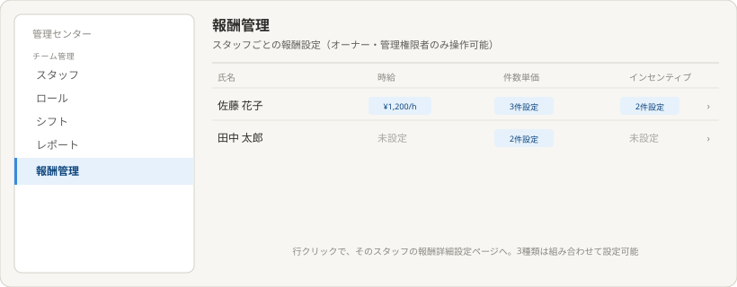
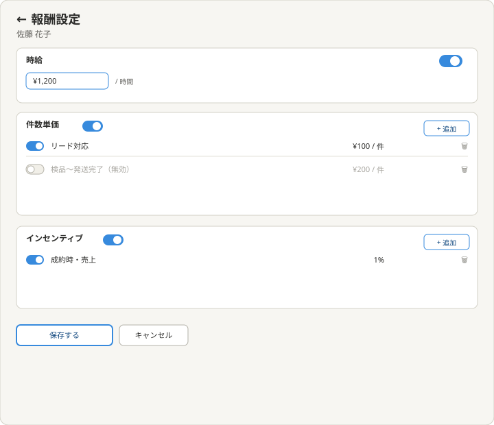
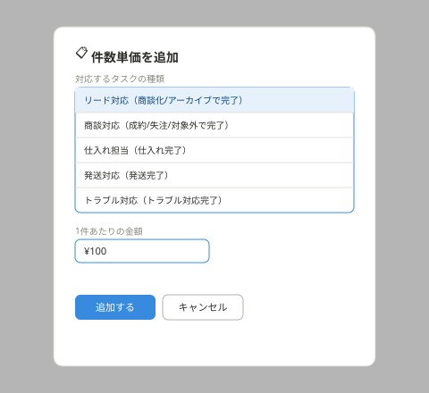
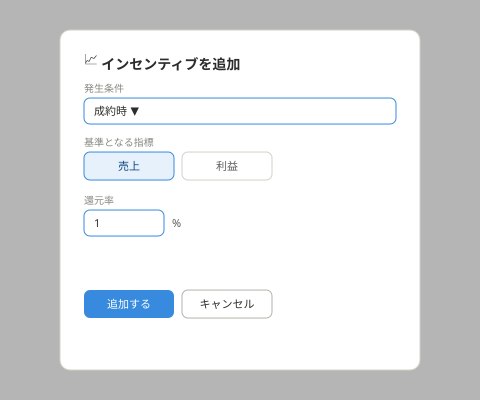

# 理想の設計図（To-Be）— 報酬管理（管理センター子テーマ）

親: [../README.md](../README.md)（管理センター） ／ あるべき姿: [ideal-state.md](./ideal-state.md) ／ KGI: [kgi.md](./kgi.md)

本書は「既存実装を見ずに、あるべき姿だけから描いた理想」である（design-partner.md §4.5）。recon・差分設計は本書の確定後に別便で行う。

## 0. 設計思想

オーナー・管理権限を持つスタッフが、全スタッフの報酬（時給・件数単価・インセンティブ）を、自由に組み合わせて設定できることを最優先する。件数単価は、取引フロー（lead/deal/order）の担当者名一致とステータス変化を根拠に自動計算できる設計とする。グループ単位・項目単位の両方でON/OFFを切り替えられる柔軟性を持たせる。

## 1. 報酬管理一覧

構成:
- 一覧列: 氏名・時給・件数単価・インセンティブ。設定状況をバッジ（例: ¥1,200/h、3件設定）で表示。未設定はグレー表示。
- 行クリックで、そのスタッフの報酬詳細設定ページへ遷移する。

## 2. 報酬詳細設定

構成:
- **時給**: グループ全体のトグルスイッチ＋金額入力（¥／時間）。
- **件数単価**: グループ全体のトグルスイッチ＋「+ 追加」ボタン。各項目（行）にも個別のトグルスイッチと削除ボタンを持つ。無効化した項目はグレーアウトし「（無効）」と明記する。
- **インセンティブ**: グループ全体のトグルスイッチ＋「+ 追加」ボタン。各項目にも個別のトグルスイッチと削除ボタンを持つ。
- 保存・キャンセルボタン（他のチーム管理項目と同じ配置パターン）。

## 3. 件数単価の追加

「対応するタスクの種類」は、以下5つの固定選択肢から選ぶ（それぞれ完了検知の根拠つき）:
- リード対応（lead担当者名一致＋ステータスが「商談化」or「アーカイブ」に変化）
- 商談対応（deal担当者名一致＋ステータスが「成約」「失注」「対象外」に変化）
- 仕入れ担当（order仕入れ担当者名一致＋仕入れ完了）
- 発送対応（order発送担当者名一致＋発送完了）
- トラブル対応（orderトラブル担当者名一致＋トラブル対応完了）

「1件あたりの金額」を入力し、追加する。

## 4. インセンティブの追加

「発生条件」（例: 成約時）、「基準となる指標」（売上／利益をボタンで選択）、「還元率」（%）を入力し、追加する。

## 5. KGI（C1〜C7）との対応

| KGI | 本設計での実現箇所 |
|---|---|
| C1 一覧確認 | §1報酬管理一覧 |
| C2 3種の複数組み合わせ | §2報酬詳細設定 |
| C3 件数単価5種のタスク登録 | §3件数単価の追加 |
| C4 インセンティブの登録項目 | §4インセンティブの追加 |
| C5 グループ単位のトグル | §2各グループ見出しのスイッチ |
| C6 項目単位のトグル | §2各行のスイッチ |
| C7 CRUD | §2〜§4全体 |

## 6. 他テーマへの申し送り

- 件数単価・インセンティブの完了検知の実装方式（イベント検知・バッチ集計等）はrecon以降で確定する。
- 「オーナー・管理権限を持つスタッフ」の権限判定は、ロール(role)子テーマの「管理センター」メニューへの編集権限と連動する想定。連動方式はrecon以降で確認する。
- テナントが新しいタスク種類を追加する場合の、完了検知元の定義方法（マスタテーブルの構造）はrecon以降で確定する。
