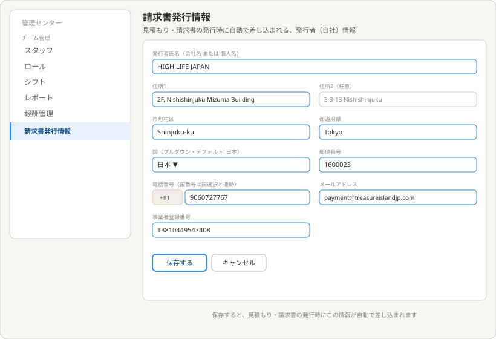

# 理想の設計図（To-Be）— 請求書発行情報（管理センター子テーマ）

親: [../README.md](../README.md)（管理センター） ／ あるべき姿: [ideal-state.md](./ideal-state.md) ／ KGI: [kgi.md](./kgi.md)

本書は「既存実装を見ずに、あるべき姿だけから描いた理想」である（design-partner.md §4.5）。recon・差分設計は本書の確定後に別便で行う。

## 0. 設計思想

見積もり・請求書発行時に自動で差し込まれる、テナントの発行者情報を一元管理する。1テナントにつき1セットのみを保持し、他のチーム管理項目のような一覧・複数管理ではなく、編集画面1枚で完結させる。

## 1. 請求書発行情報

構成（10項目）:
- 発行者氏名（会社名 または 個人名）: 単一項目。
- 住所1・住所2（住所2は任意）。
- 市町村区・都道府県（分離した独立項目）。
- 国（プルダウン選択・デフォルト値は「日本」）・郵便番号（分離した独立項目）。
- 電話番号: 国番号部分（例: +81）と番号本体を分けて表示。国番号は「国」の選択と連動して自動入力される。
- メールアドレス。
- 事業者登録番号。

保存・キャンセルボタン（他のチーム管理項目と同じ配置パターン）。最下部に「保存すると見積もり・請求書の発行時にこの情報が自動で差し込まれる」旨を明記する。

一覧ページは持たない。1テナント1セットのため、サイドメニューから直接この編集画面へ遷移する。

## 2. KGI（IN1〜IN5）との対応

| KGI | 本設計での実現箇所 |
|---|---|
| IN1 10項目のCRUD | §1全体構成 |
| IN2 国プルダウン・デフォルト日本 | §1国の入力欄 |
| IN3 電話番号の国番号自動連動 | §1電話番号の入力欄 |
| IN4 1テナント1セット | §1（一覧ページを持たない設計） |
| IN5 発行時の自動差し込み | §1最下部の明記 |

## 3. 他テーマへの申し送り

- 国の選択肢一覧・国番号の対応表（マスタデータ）はrecon以降で確定する。
- 見積もり・請求書（quote-invoice）テーマ側での、発行者情報の差し込み実装方式はrecon以降で確認する。
