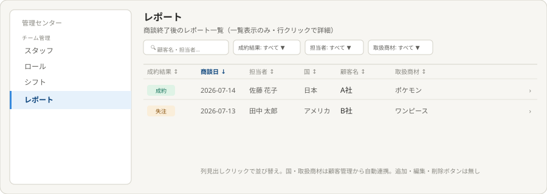
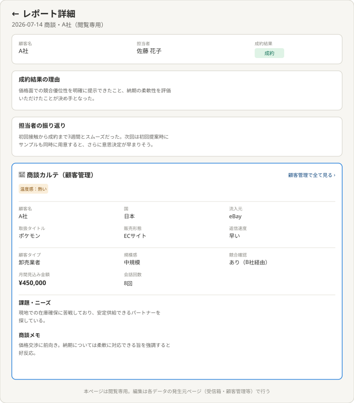

# 理想の設計図（To-Be）— レポート（管理センター子テーマ）

親: [../README.md](../README.md)（管理センター） ／ あるべき姿: [ideal-state.md](./ideal-state.md) ／ KGI: [kgi.md](./kgi.md)

本書は「既存実装を見ずに、あるべき姿だけから描いた理想」である（design-partner.md §4.5）。recon・差分設計は本書の確定後に別便で行う。商談カルテの具体的な項目は、実際の実装時に顧客管理側の実データを見て最終確認する（PO 2026-07-15明記）。

## 0. 設計思想

商談終了後のレポートを、管理者が「見るだけ」で確認できるページに特化する。他のチーム管理項目（スタッフ・ロール・シフト）とは異なり、追加・編集・削除の機能を持たない。商談カルテは顧客管理（customer-management）ページの情報を要約表示し、データの二重管理を避ける。

## 1. レポート一覧

構成:
- 一覧列: 成約結果・商談日・担当者・国・顧客名・取扱商材の6列、この順序で表示する。
- フィルタ: 検索（顧客名・担当者）・成約結果・担当者・取扱商材の4種。
- 列見出しをクリックすると、その列で昇順・降順に並び替えできる。
- 追加・編集・削除ボタンは存在しない（見るだけのページ）。
- 行をクリックすると詳細ページへ遷移する。

## 2. レポート詳細（商談カルテ含む）

構成（上から）:
- 基本情報: 顧客名・担当者・成約結果（バッジ表示）。
- 成約結果の理由（文章）。
- 担当者の振り返り（文章）。
- 商談カルテ（顧客管理）: アクセントカラーの枠で区別。「顧客管理で全て見る」リンクを併設し、詳細は顧客管理ページへ誘導する（本ページでは要約表示のみ、編集不可）。
  - 温度感バッジ。
  - 基本属性（3列×2行）: 顧客名・国・流入元・取扱タイトル・販売形態・返信速度。
  - 属性・見込み（3列×2行）: 顧客タイプ・規模感・競合確認・月間見込み金額（強調表示）・会話回数（取引回数の代わりに表示。新規営業のため）。
  - 課題・ニーズ（文章）。
  - 商談メモ（文章）。
- ページ全体が閲覧専用であることを最下部に明記する。

## 3. KGI（RP1〜RP7）との対応

| KGI | 本設計での実現箇所 |
|---|---|
| RP1 見るだけ・ボタン非表示 | §1一覧（追加ボタン等なし） |
| RP2 6列・指定順序 | §1一覧列構成 |
| RP3 3種の絞り込み | §1フィルタ |
| RP4 列見出しソート | §1列見出しのクリック動作 |
| RP5 詳細の基本項目 | §2基本情報・理由・振り返り |
| RP6 商談カルテ13項目 | §2商談カルテ |
| RP7 閲覧専用 | §2最下部の明記 |

## 4. 他テーマへの申し送り

- 商談カルテの13項目が、顧客管理（customer-management）の既存データ構造とどう対応するかはrecon以降で確認する。
- 会話回数の集計方法（受信箱のどのデータを数えるか）はrecon以降で確定する。
