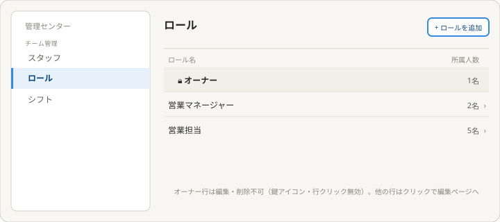
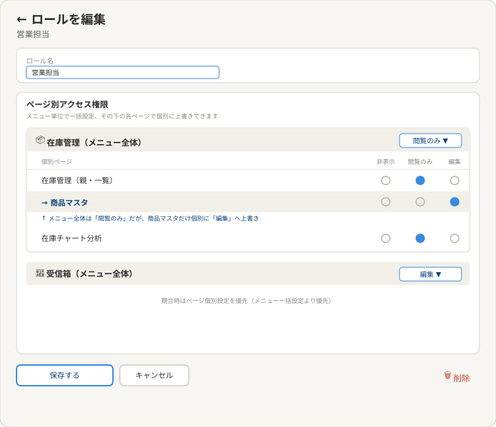

# 理想の設計図（To-Be）— ロール（管理センター子テーマ）

親: [../README.md](../README.md)（管理センター） ／ あるべき姿: [ideal-state.md](./ideal-state.md) ／ KGI: [kgi.md](./kgi.md)

本書は「既存実装を見ずに、あるべき姿だけから描いた理想」である（design-partner.md §4.5）。recon・差分設計は本書の確定後に別便で行う。アプリ全体の各メニュー配下の具体的なページ構成（何ページ存在するか）は、実データを見て確定する（PO 2026-07-15）。本書では意図とレイアウトの型を確定するに留める。

## 0. 設計思想

Googleスプレッドシートの共有権限（閲覧者・編集者）と同じ考え方を、ページ単位のアクセス制御に適用する。「メニュー単位の一括設定」と「ページ単位の個別上書き」の2階層で、柔軟かつ設定の手間を抑えた権限管理を実現する。

## 1. ロール一覧

構成:
- ヘッダー右に「ロールを追加」ボタン。
- 一覧列: ロール名・所属人数。
- オーナー行は鍵アイコンつきで表示され、グレー背景で区別される。編集・削除不可（行クリック無効）。
- オーナー以外の行（テナント独自ロール）は、クリックで編集ページへ遷移する。

## 2. ロール編集（2階層の権限設定）

構成:
- ロール名の入力欄。
- ページ別アクセス権限: メニュー（例: 在庫管理）ごとに、見出し行でプルダウン（非表示/閲覧のみ/編集）による一括設定ができる。
- その配下に、メニュー内の個別ページ（例: 在庫管理親・商品マスタ・在庫チャート分析）が字下げして並び、それぞれラジオボタン形式の3択（非表示/閲覧のみ/編集）で個別に上書き設定できる。
- 個別ページの設定がメニュー一括設定と異なる場合（例: メニュー全体は「閲覧のみ」だが「商品マスタ」だけ「編集」）、個別ページ側の設定が優先される。
- 3段階の意味:
  - **非表示**: サイドメニュー・ナビゲーションに項目自体が一切表示されない。存在を完全に隠す。
  - **閲覧のみ**: メインページ（一覧）には入れるが、下層（詳細・編集）ページには進入できない（スタッフページの「ロール未設定の行はクリック不可」と同じ仕組みを踏襲）。
  - **編集**: メインページ・下層ページとも、すべての操作が可能。
- 保存・キャンセルボタンと同じ横軸の右端に削除ボタンを配置（スタッフ編集ページと同じ配置パターン）。押すと確認ダイアログが表示される。

## 3. KGI（R1〜R8）との対応

| KGI | 本設計での実現箇所 |
|---|---|
| R1 一覧・CRUD | §1ロール一覧 |
| R2 メニュー単位の一括プルダウン | §2メニュー見出し行のプルダウン |
| R3 ページ単位の個別上書き | §2配下ページのラジオボタン |
| R4 非表示の実現 | §2の3段階の意味 |
| R5 閲覧のみの制限 | §2の3段階の意味 |
| R6 編集の全操作可能 | §2の3段階の意味 |
| R7 オーナーは常に全権限 | §1オーナー行の特別扱い |
| R8 オーナーは固定・他は独自ロール | §1オーナー行の編集・削除不可 |

## 4. 他テーマへの申し送り

- アプリ全体の各メニュー配下に、具体的に何ページ存在するかはrecon以降で洗い出す。
- メニュー一括設定とページ個別設定の競合時の優先順位（個別優先）は本便で確定したが、実装方式（データ構造）はrecon以降で確定する。
