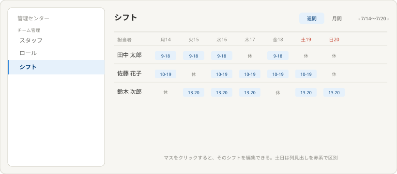
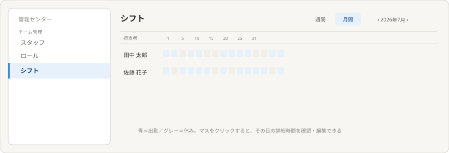
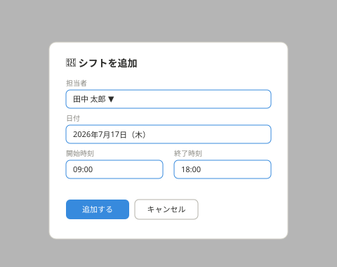
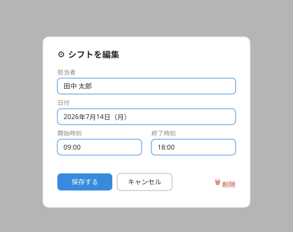
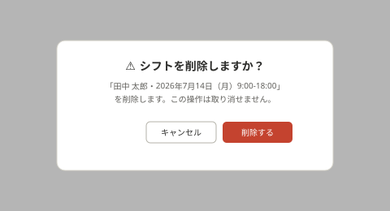

# 理想の設計図（To-Be）— シフト（管理センター子テーマ）

親: [../README.md](../README.md)（管理センター） ／ あるべき姿: [ideal-state.md](./ideal-state.md) ／ KGI: [kgi.md](./kgi.md)

本書は「既存実装を見ずに、あるべき姿だけから描いた理想」である（design-partner.md §4.5）。recon・差分設計は本書の確定後に別便で行う。

## 0. 設計思想

監視者（オーナー等）が、全スタッフのシフトを1画面で一括確認・管理できることを最優先する。担当者を行、日付・曜日を列とする時間割形式（横軸タイムライン）を採用し、週間・月間で情報量に応じた表示の使い分けを行う。

## 1. 週間表示

構成:
- ヘッダーに「週間/月間」の切替タブ、その右に週の切替（◀ 7/14〜7/20 ▶）。
- 行: 担当者ごと。列: 曜日（月〜日）。土日は列見出しを赤系で区別。
- 各マスに出勤時間（例: 9-18）を表示。休みの日は「休」と表示。
- マスをクリックすると、そのシフトを編集できる。

## 2. 月間表示

構成:
- 行: 担当者ごと。列: 日付（1〜31日）。
- 情報量の制約上、時刻までは表示せず、出勤（色つき）/休み（グレー）の色分けのみで簡略表示する。
- マスをクリックすると、その日の詳細時間を確認・編集できる。

## 3. シフトの新規追加

週間表示で「休」のマスをクリックすると開くモーダル。担当者・日付は選択済みの状態で開き、開始時刻・終了時刻を入力する。ボタンは「追加する→キャンセル」の順で左寄せに配置する。

## 4. シフトの編集

既存のシフトが入っているマスをクリックすると開くモーダル。現在の値が入力済みの状態で編集する。ボタンは「保存する→キャンセル→削除」の順（削除のみ右端）に配置する。新規追加画面とボタンの並び順を統一する。

## 5. シフトの削除確認

編集画面の「削除」を押すと表示される確認ダイアログ。誤操作防止のため、対象のシフト内容（担当者・日付・時刻）を明記した上で確認する。タイトル・説明文・ボタンはすべて中央揃えでレイアウトする。

## 6. KGI（SH1〜SH5）との対応

| KGI | 本設計での実現箇所 |
|---|---|
| SH1 監視者の一括確認 | §1・§2全体構成 |
| SH2 週間表示（担当者×曜日・時刻） | §1週間表示 |
| SH3 月間表示（色分け・クリックで詳細） | §2月間表示 |
| SH4 週間・月間の切替 | §1・§2ヘッダーのタブ |
| SH5 シフトのCRUD・ボタン配置統一・削除確認 | §3新規追加・§4編集・§5削除確認 |

## 7. 他テーマへの申し送り

- 「監視者」が具体的にどのロール・権限を指すか（オーナーのみか、ロール権限で「シフト=編集」の人も含むか）はrecon以降で確認する。
- シフトの重複（同じスタッフの時間帯が重なる登録）をどう扱うかはrecon以降で確定する。
