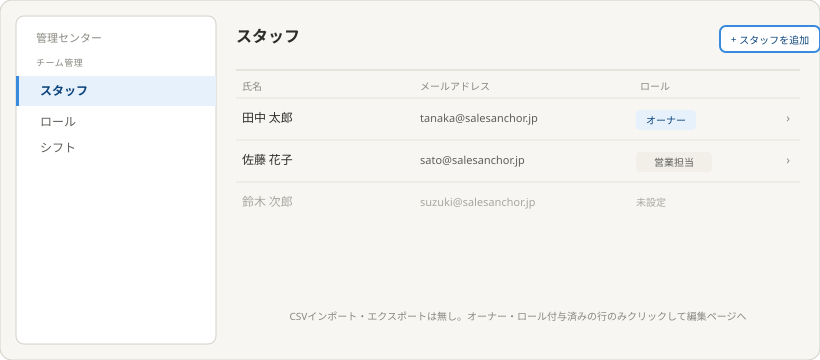
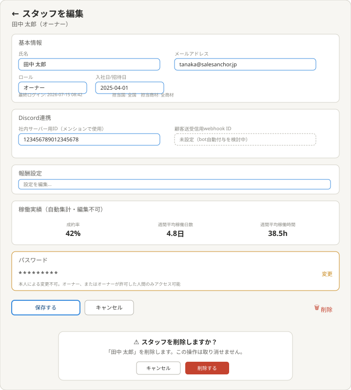

# 理想の設計図（To-Be）— スタッフ（管理センター子テーマ）

親: [../README.md](../README.md)（管理センター） ／ あるべき姿: [ideal-state.md](./ideal-state.md) ／ KGI: [kgi.md](./kgi.md)

本書は「既存実装を見ずに、あるべき姿だけから描いた理想」である（design-partner.md §4.5）。recon・差分設計は本書の確定後に別便で行う。

## 0. 設計思想

チーム管理の型（一覧＋編集＋削除確認、CSV機能なし）の最初の実例として、他の11項目（ロール・シフト・レポート・報酬管理・請求書発行情報）が踏襲する基準を確立する。パスワードのように一般的な方針（メール認証型）と異なる例外は、理由を明記した上でPO判断として採用する。

## 1. スタッフ一覧

構成:
- ヘッダー右に「スタッフを追加」ボタン。
- 一覧列: 氏名・メールアドレス・ロールの3列のみ。CSVインポート・エクスポート機能は持たない。
- オーナー、またはロールが付与されたメンバーの行のみクリックでき、下層（編集）ページへ遷移する。ロール未設定の行はグレーアウト表示され、クリックできない（矢印アイコンも非表示）。

## 2. スタッフ編集

グループ構成:
- **基本情報**: 氏名・メールアドレス・ロール・入社日/招待日・最終ログイン日時（編集不可・自動記録）・担当国・担当商材（別項目として分離）。
- **Discord連携**: 社内サーバー用ID（メンションで使用）は通常の入力欄。顧客送受信用webhook IDは点線枠で「未設定（bot自動付与を検討中）」と表示し、実現方式が未確定であることを明示する。
- **報酬設定**: 詳細項目はrecon以降で確定。
- **稼働実績**: 成約率・週間平均稼働日数・週間平均稼働時間を、自動集計・編集不可の値として表示する。
- **パスワード**: `*********`のマスク表示のみ。本人は変更できない。「変更」ボタンから、オーナーまたはオーナーが許可した人間のみアクセスできる（最終手段としての代理変更経路）。

保存・キャンセルボタンと同じ横軸の右端に削除ボタンを配置する。削除ボタンを押すと確認ダイアログが表示され（「この操作は取り消せません」の警告文つき）、確認後にのみ削除が実行される。

## 3. KGI（S1〜S10）との対応

| KGI | 本設計での実現箇所 |
|---|---|
| S1 3列のみの一覧 | §1一覧列構成 |
| S2 追加ボタン | §1ヘッダー |
| S3 権限別クリック制御 | §1行の可否制御 |
| S4 CSV機能なし | §1（ボタン非設置） |
| S5 編集ページの基本情報項目 | §2基本情報 |
| S6 Discord社内ID登録 | §2Discord連携 |
| S7 報酬設定登録 | §2報酬設定 |
| S8 稼働実績の自動集計表示 | §2稼働実績 |
| S9 パスワードのアクセス制限 | §2パスワード |
| S10 削除ボタンと確認ダイアログ | §2削除フロー |

## 4. 他テーマへの申し送り

- 顧客送受信用Discord webhook IDのbot自動付与の実現方式はPO相談中。実現方式が固まり次第、追加KGIとして起票する。
- 「オーナーが許可した人間」の権限付与の仕組み（誰が・どうやって許可するか）はrecon以降で確定する。
- 報酬設定の具体的な項目（時給・歩合率等）はrecon以降で確定する。
