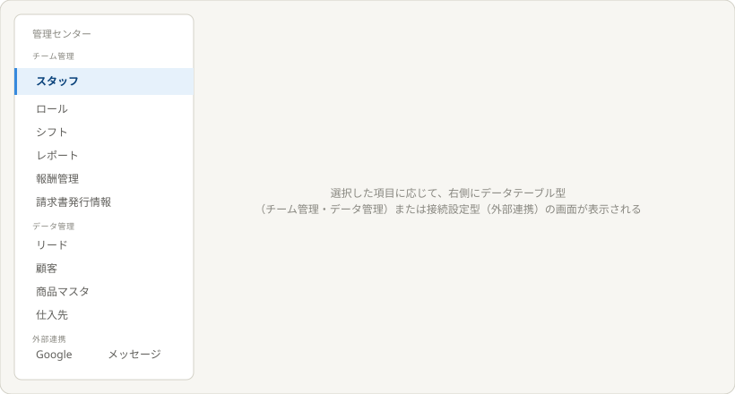

# 理想の設計図（To-Be）— 管理センター（親）

親: [README.md](./README.md) ／ あるべき姿: [ideal-state.md](./ideal-state.md) ／ KGI: [kgi.md](./kgi.md)

本書は「既存実装を見ずに、あるべき姿だけから描いた理想」である（design-partner.md §4.5）。recon・差分設計は本書の確定後に別便で行う。

## 0. 設計思想

管理センターは「全データの基盤管理」に特化する。顧客管理（CRM）等の分析・優先度づけ機能とは意図的に役割を分け、管理センターはCRUD＋CSVインポート/エクスポートという、データセンターとしての役割に徹する。

## 1. メインページ（サブサイドメニュー構造）

左のサブサイドメニューに3つの大分類（チーム管理・データ管理・外部連携）があり、それぞれの配下に項目が並ぶ。

| 大分類 | 項目 | 画面の型 |
|---|---|---|
| チーム管理 | スタッフ・ロール・シフト・レポート・報酬管理・請求書発行情報 | データテーブル型（CSV機能なし） |
| データ管理 | リード・顧客・商品マスタ・仕入先（＋将来のテナント独自テーブル） | データテーブル型（CSV機能あり） |
| 外部連携 | Google／メッセージ（Meta・Discord）／配送（FedEx・DHL）／決済（PayPal） | 接続設定型 |

選択した項目に応じて、右側の表示が切り替わる。

## 2. 子テーマ（各項目の詳細設計）

各項目は、本テーマの子として個別にあるべき姿・KGI・To-Beを起票する。第1号として「スタッフ」子テーマを本便で正本化する（[staff/README.md](./staff/README.md)）。残り12項目（ロール・シフト・レポート・報酬管理・請求書発行情報・リード・顧客・商品マスタ・仕入先・Google・メッセージ・配送・決済）は、スタッフの型に沿って後続便で子テーマとして起票する。

## 3. KGI（M1〜M5）との対応

| KGI | 本設計での実現箇所 |
|---|---|
| M1 チーム管理6項目のCRUD | §1チーム管理項目群・各子テーマ |
| M2 データ管理4項目のCRUD | §1データ管理項目群・各子テーマ |
| M3 CSVインポート/エクスポート | §1データ管理型の画面（子テーマで詳細確定） |
| M4 外部連携のメニュー内完結 | §1外部連携項目群・各子テーマ |
| M5 サブサイドメニューでの一覧・切替 | §1メインページ全体構造 |

## 4. 他テーマへの申し送り

- 残り12項目の子テーマ起票は、スタッフ子テーマの型（一覧＋編集＋削除確認）を踏襲する。
- 各外部連携（Google/メッセージ/配送/決済）の接続設定画面の詳細仕様は、子テーマ起票時にそれぞれ確定する。
