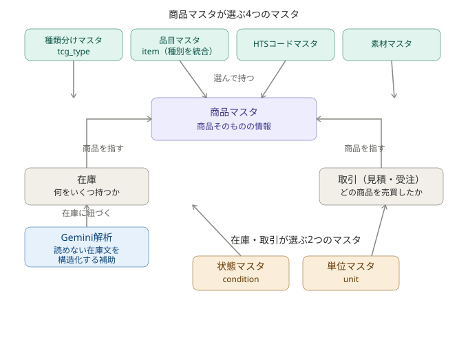
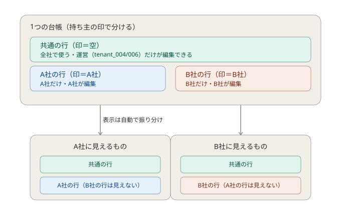

# 商品マスタ 仕様書（あるべき姿）＝親

> この文書は「こうあるべき」という理想（正本）だけを書く。
> 「今どうなっているか」という現状・課題・移行手順は、別の開発計画書（子）に書く（この設計書には載せない）。
> 各マスタの詳しい中身も、それぞれ独立した設計書（子）に書く。本書はその親（全体像と一覧）。
> 更新の履歴（いつ・どこを・どう変えたか）は GitHub が自動で記録する。

---

## 1. この設計の考え方（全体像）

商品の情報を「商品マスタ（商品そのものの定義）」に集約し、繰り返し使う値は「マスタ（値の引き出し）」に切り出して、商品マスタはそこから値を選んで持つ。

- **商品マスタ** … 商品そのものの固有情報を持つ（名前・型番・重さ など）
- **各種マスタ** … 何度も使う決まった値を登録しておく引き出し（具体は §4 の一覧）
- 商品マスタは、各種マスタから値を「選んで持つ」参照先

**図1：全体の地図**（商品マスタは4つのマスタから値を選んで持ち、在庫・取引から参照される。状態・単位マスタは在庫・取引が参照。Gemini解析は在庫に紐づく）

---

## 2. 全社共通の値と、会社ごとの独自の値（2層）

商品マスタも各種マスタも、すべて2種類の値を1つの台帳で扱う。

- **共通の値**：全テナント（利用会社）で使い回せる定番。**運営（tenant_004 と tenant_006）だけ**が追加・編集・非表示にできる。各社は使うだけ。
- **会社ごとの独自の値**：その会社だけが扱う値。**各社が自由記述で自分で追加できる**。その会社にだけ反映され、他社には見えない。

仕組みは「持ち主」の印で分ける。印が空＝共通（全社が見える・運営だけ編集）。印に会社番号＝その会社専用（その会社だけ見える・編集できる）。他社の独自の値は混ざって見えない。表示するとき、システムが「共通＋自社の分」だけを自動で見せる。

**図2：2層構造**（共通の行と会社ごとの行が1つの台帳に同居し、各社には共通＋自社分だけが見える）

---

## 3. 商品マスタ（商品そのものの定義・参照先）

### 3-1. 役割
商品マスタは「扱う商品そのものの情報」を1か所にまとめた台帳。1つの商品について、商品ごとに1行で持つ。
**ここに入れないもの**：「何個仕入れたか」「いくらで売ったか」「在庫の状態」。それらは在庫・取引の話で、別が持つ。商品マスタは「商品そのものの定義」だけに集中する。

### 3-2. 商品マスタの全項目（直接持つ / マスタから選ぶ / 役割）

| 商品マスタの項目 | 区分 | 役割（何のための情報か） |
|---|---|---|
| 日本語名 | 直接持つ | 画面に商品名を表示する |
| 英語名 | 直接持つ | 画面に商品名（英語）を表示する |
| 型番（Mark） | 直接持つ | 商品の型番を示す（空のこともある） |
| 1ケースの箱数 | 直接持つ | 入数の計算・荷姿の把握 |
| 1箱のパック数 | 直接持つ | 入数の計算・荷姿の把握 |
| 容積（VOLUME WEIGHT） | 直接持つ | 輸送費・送料の計算に使う（kg） |
| 箱の重さ | 直接持つ | 輸送費・送料の計算に使う（kg） |
| ケースの重さ | 直接持つ | 輸送費・送料の計算に使う（kg） |
| 発売日 | 直接持つ | 予約・新商品の判定に使う |
| 最小発注数（MOQ） | 直接持つ | 発注の最小ロットを示す |
| 検索キーワード | 直接持つ | Gemini判定で商品を見分ける手がかり（将来使用） |
| 除外キーワード | 直接持つ | Gemini判定で誤判定を防ぐ手がかり（将来使用） |
| 関連シリーズ | 直接持つ | Gemini判定で関連商品を寄せる手がかり（将来使用） |
| 判定の正解値（REQUIRED_OUTPUT_VALUE） | 直接持つ | 二重登録を防ぐ／Gemini判定の出力。商品ごとに1つで重複しない |
| 背番号（固有ID・自動採番） | 直接持つ | 集計・結合の鍵。人が見て意味はないが絶対に重複しない |
| 種類分け | マスタから選ぶ | 商品をカテゴリで分類・集計する（→ 種類分けマスタ §4） |
| 品目 | マスタから選ぶ | 輸出申告の品目を示す（→ 品目マスタ §4） |
| HTSコード | マスタから選ぶ | 輸出申告に使う（→ HTSコードマスタ §4） |
| 素材 | マスタから選ぶ | 輸出申告の素材を示す（→ 素材マスタ §4） |

> 「直接持つ」＝商品ごとに固有で選択肢にならない値。「マスタから選ぶ」＝繰り返し使う値を引き出し（マスタ）から選んで持つ。

---

## 4. マスタ一覧（何があって・誰が使うか・詳しい設計書はどこか）

繰り返し使う「決まった値」は、独立したマスタに切り出す。各マスタは「候補を出す引き出し」として働く。原則すべて共通＋テナント独自の2層（例外：大分類マスタは共通のみ。詳細は §5-1）。

商品マスタが参照するマスタは、次の5つ。

| マスタの名前 | 何を登録する引き出しか | 誰が参照するか | 設計書ファイル（子） |
|---|---|---|---|
| 大分類マスタ（product_category） | 商品の大分類（トレカ・フィギュア・カメラ 等）※全社共通・運営のみ編集 | 種別マスタ（→商品マスタ） | product-category-master.md |
| 種別マスタ（product_type） | 商品の種別（ヴァイス・ポケカ 等）※2層・会社独自を追加可 | 商品マスタ | product-type-master.md |
| 品目マスタ（item） | 発送ラベルに記載する品目名（トレカ 等） | 商品マスタ | （後で作成・未） |
| HTSコードマスタ | 輸出のHTSコード | 商品マスタ | （後で作成・未） |
| 素材マスタ | 素材（紙・プラ 等） | 商品マスタ | （後で作成・未） |

> 補足：品目・HTSコードは「種類が同じなら同じになりやすい」、素材は「同じ種類でも商品ごとに変わる」。どれも独立マスタから選ぶが、選ぶ単位（種類単位か商品単位か）は値によって異なる。
>
> **状態マスタ（condition）・単位マスタ（unit）** は、商品マスタではなく **在庫・取引が参照する**ため、本書（商品マスタ設計書）には載せない。詳細は在庫・取引の設計書を参照（全体像は図1も参照）。
>
> 「設計書ファイル（子）」は、各マスタの詳しい設計書を作ったら、そのファイル名をここに書き込む。本書（親）から各子へたどれるようにする。

---

## 5. すべてのマスタに共通するルール

### 5-1. 2層（共通＋テナント独自）
共通の値は運営（tenant_004/006）だけが編集。各社は独自の値を自由記述で追加でき、他社には見えない。
※ただし大分類マスタ（product_category）だけは全社共通のみ。棚そのものは全社で同じ概念のため、会社独自の追加は設けず運営が一元管理する。

### 5-2. 値の片付け（溜め込まない・かつ壊さない）
- **参照されている値**（どこかの商品・在庫・取引が使っている）→ 物理削除しない。**表示/非表示の札**で管理する。非表示にしても参照先は生きているので過去データは壊れない。
- **参照されていない値**（どこも使っていない）→ いきなり消さず、**アーカイブ（保管）してから90日後に削除**。登録したばかりでまだ使っていない値を即座には消さない。90日の猶予内に使われれば削除対象から外れる。

### 5-3. マスタ同士は固定しない・候補は入力支援で出す
マスタ同士を構造的に固く結びつけない（「この種類には必ずこの値しか選べない」とはしない）。
代わりに、入力時に**過去の登録実績から候補を絞り込んで出す**。ユーザーは候補から選ぶか、自由記述するか選べる。同じ作業はなるべく手間なく済ませられるようにする。

---

## 6. 更新の記録
この設計書を変えたときの「いつ・どこを・どう変えたか」は GitHub が自動で記録する。古い版も全部残るので、後から誰がいつ何を変えたかをいつでもたどれる。手書きで日付管理する必要はない。

---

## 7. この文書の位置づけ（親子構成）
- **親（本書）**：商品マスタ設計書。全体像・2層方式・商品マスタ本体・マスタ一覧（理想だけ）。
- **子（マスタ別設計書・7つ）**：各マスタの詳しい中身。§4 の表からたどる。
- **子（開発計画書）**：現状・課題・移行手順・調査項目。理想を現実にどう実現したかの履歴。
- この親に各子をぶら下げることで、設計書（理想）から開発履歴（実現）まできれいにたどれる。

## 関連する調査記録

- [商品辞書の育成・LINE解析精度の調査](../../handoff/tcg-product-master-growth/recon.md)（現状と未確認事項。仕様の決定ではない）

- [作品IDによる商品特定・除外語の設計案](../../handoff/tcg-product-master-growth/design-keyword.md#10-db確認後の実装契約案9の未確認事項を更新)（§10。文書レビュー中）

- [作品判定の実装カード案](../../handoff/tcg-product-master-growth/card-work-matching-v3.md)（文書承認後に有効）

## 関連する開発記録

- [インポート・解析・配信の統合設計（第1段階）](../../handoff/pmg-import-delivery-ssot/design.md)
- [同テーマの実物確認](../../handoff/pmg-import-delivery-ssot/recon.md)

## 8. 商品一覧の発売日順・作品タブ（2026-09-11）

PO原文: 「商品マスタの並びはデフォルトは販売日の新しい順に上から並べる、タブを付けてポケモン、ワンピースなど作品別に絞り込みが出来るようにする」。既存の「発売日」を指すかの確認への返答は「進める」。本項では発売日として扱う。

- 初期表示は発売日の新しい商品から並ぶ。
- 「すべて」と作品別のタブで表示対象を切り替えられる。
- 作品で絞った後も発売日の新しい順を維持する。

詳細案・受入条件: [既存一覧設計の追加節](../../handoff/tcg-product-import/design.md#14-発売日降順と作品タブ2026-09-11設計案)。現在地・実物根拠: [調査追補](../../handoff/tcg-product-import/recon.md#2026-09-11-発売日順と作品タブの調査)。3項目は依頼として受領済み。日付未登録やタブ候補の扱いなどの詳細は設計案であり、実装開始の承認とは区別する。

- [Geminiによる作品IDのみの判断（2026-09-12）](../../handoff/tcg-product-master-growth/design-keyword.md#16-geminiが商品マスタを参照して作品idのみを判断する設計草案2026-09-12)（目的・境界合意済み、方式審査中）

## Android LINE履歴の入力追加

- [設計](../../handoff/line-android-import/design.md)
- [現状・検証](../../handoff/line-android-import/recon.md)

Termuxログイン補完: [設計](../../handoff/line-android-login/design.md)、[検証](../../handoff/line-android-login/recon.md)。

- [Android取込後の管理接続](../../handoff/line-import-delivery/design.md): フロントなしで確認・解析・既存配信へ接続。実配信未確認。

- [PC/Androidの仕入先名の照合](../../handoff/line-supplier-aliases/design.md): 保存投稿の指紋を用いた読取調査。

### 抽出待ち時間の限定是正案（2026-09-13・未実装）

[設計・審査](../../handoff/tcg-product-master-growth/design-keyword.md) と [実測](../../handoff/tcg-product-master-growth/recon.md) の「シンソク抽出の時間制限見直し」を参照。300/330秒の限定実装は2026-09-13にPO承認済み。実装/検証中で本番未反映。型番3商品の不整合は別の未解決事項。
