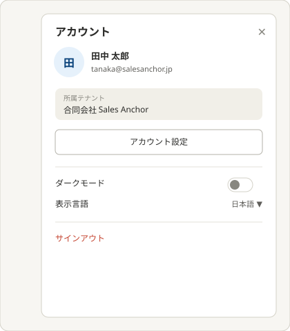
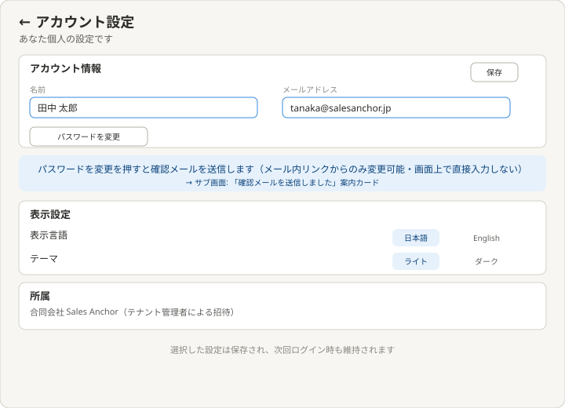
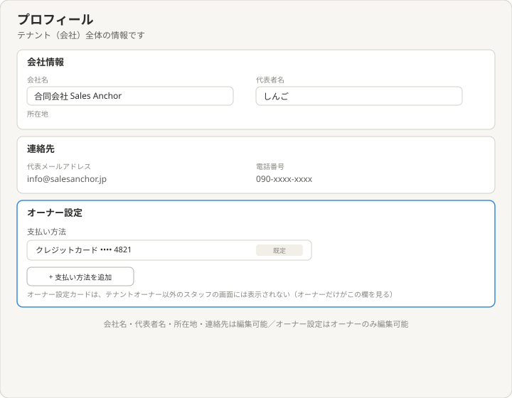

# 理想の設計図（To-Be）— プロフィール・アカウント設定

親: [README.md](./README.md) ／ あるべき姿: [ideal-state.md](./ideal-state.md) ／ KGI: [kgi.md](./kgi.md)

本書は「既存実装を見ずに、あるべき姿だけから描いた理想」である（design-partner.md §4.5）。recon・差分設計は本書の確定後に別便で行う。各画面の項目が実際にどのテーブル・カラムから来るかはrecon調査で確認して確定する。

## 0. 設計思想

「クイックビュー（要約・簡易切替）」と「本格編集ページ」を分離する。よく使う操作（テーマ・言語の切替、サインアウト）はワンクリックで届く場所に置き、じっくり編集する操作（氏名変更、パスワード変更）は専用ページに委ねる。プロフィール（テナント）とアカウント設定（個人）は役割で明確に分離し、テナントオーナー専用の設定はプロフィール内に統合しつつ、権限のない人には見せない。

## 1. アカウントスライドパネル

右上のアイコンをクリックすると右からスライドインする。構成:
- ユーザー要約カード: アイコン（頭文字）・氏名・メールアドレス。
- 所属テナント表示（参考情報）。
- 「アカウント設定」ボタン: 押すと本編集ページ（§2）へ遷移。
- クイック切替: ダークモード（トグル）・表示言語（プルダウン）をその場で切り替え可能。
- サインアウト。

## 2. アカウント設定（編集ページ）

スライドパネルの「アカウント設定」から遷移。構成:
- アカウント情報: 名前・メールアドレスの編集、保存ボタン。
- パスワード変更: メール認証型。「パスワードを変更」を押すと、登録済みメールアドレスへ確認メールを送信し、メール内リンクからのみ新しいパスワードを設定できる。画面上でパスワードを直接入力するフローは持たない。
- 表示設定: 表示言語（日本語/English）・テーマ（ライト/ダーク）。スライドパネルと同じ選択肢で一貫性を保つ。
- 所属: 所属テナント名を表示（編集不可・テナント管理者による招待である旨を明記）。
- 選択した設定は保存され、次回ログイン時も維持される。

## 3. プロフィール（テナント・オーナー設定統合）

テナント（会社）全体の情報を扱う。構成:
- 会社情報: 会社名・代表者名・所在地。
- 連絡先: 代表メールアドレス・電話番号。
- オーナー設定（テナントオーナー専用）: 支払い方法の登録・追加。
- オーナー設定カードは、オーナー以外のスタッフの画面には表示されない（バッジ等で示すのではなく、非表示そのものが区別の手段。Claude Team/Enterpriseの権限モデルを参考に確定・PO 2026-07-11）。

## 4. KGI（P1〜P11）との対応

| KGI | 本設計での実現箇所 |
|---|---|
| P1 プロフィールページ存在 | §3 |
| P2 アカウント設定ページ存在 | §2 |
| P3 プロフィール編集可能 | §3会社情報・連絡先 |
| P4 アカウント情報編集可能 | §2アカウント情報 |
| P5 表示言語切替 | §1・§2 |
| P6 ライト/ダーク切替 | §1・§2 |
| P7 設定の保持 | §2末尾に明記 |
| P8 2画面の区別 | §0設計思想・README境界節 |
| P9 メール認証型パスワード変更 | §2パスワード変更 |
| P10 オーナー専用支払い設定 | §3オーナー設定 |
| P11 オーナー以外に非表示 | §3オーナー設定・非表示そのものが区別手段 |

## 5. 他テーマへの申し送り

- 各画面項目の実データ源（テーブル・カラム）はrecon調査で確認して確定する。
- 表示言語・テーマがテナント全体の既定値とどう関係するか（新規スタッフ招待時の初期値等）はrecon以降で確認する。
- オーナー設定の非表示制御の実装方式（サーバー/クライアント判定）はrecon以降で決める。
- パスワード変更のメール認証フローは、既存の認証基盤（あれば）との整合をrecon便で確認する。
