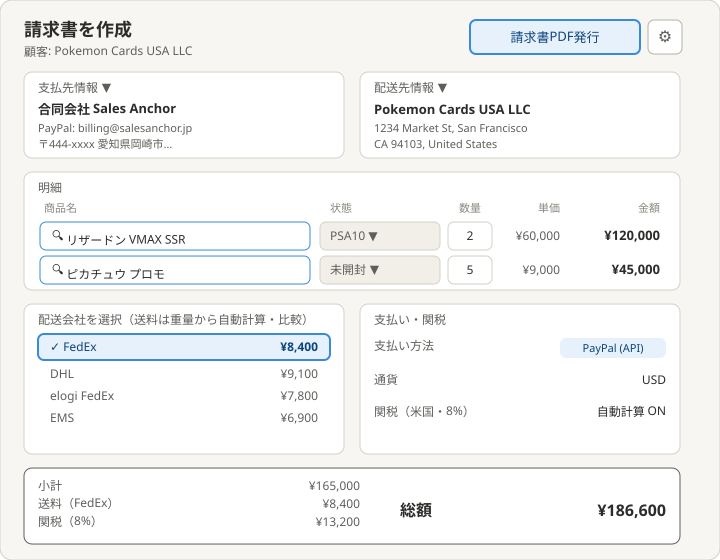
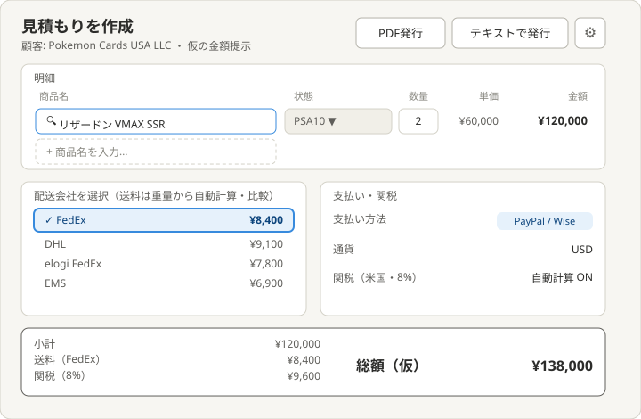
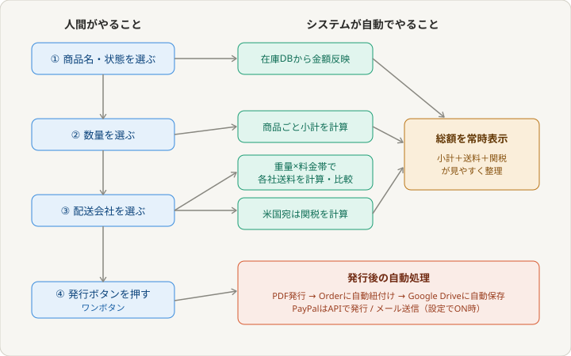
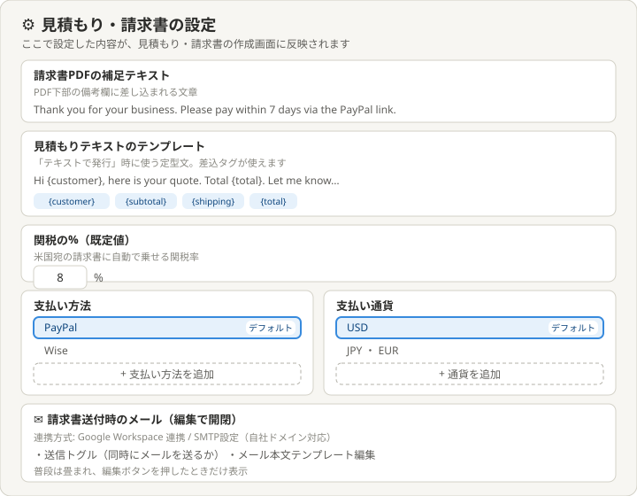

# 理想の設計図（To-Be）— 見積もり・請求書

親: [README.md](./README.md) ／ あるべき姿: [ideal-state.md](./ideal-state.md) ／ KGI: [kgi.md](./kgi.md)

本書は「既存実装を見ずに、あるべき姿だけから描いた理想」である（design-partner.md §4.5）。recon・差分設計は本書の確定後に別便で行う。

## 0. 設計思想

あるべき姿の第一文「システムを最大活用して人間の手入力による労力とミスを最小化する」を全画面の設計原則とする。人間の操作は「選ぶ」と「発行を押す」に限り、金額・小計・送料・関税・総額の算出はすべてシステムが自動で行う。

## 1. 請求書 作成画面

構成（上から）:
- ヘッダー: タイトル、「請求書PDF発行」ボタン、歯車アイコン（設定ページへ遷移）
- 支払先情報・配送先情報の2カラム: いずれもプルダウンで既存データから選択。新規追加・編集機能はこのページに置かない（選択専用）。見積もり画面には表示しない。
- 明細: 列ヘッダー（商品名／状態／数量／単価／金額）付き。商品名は入力候補が出るオートコンプリート、状態はプルダウン、数量は半角数字のテキスト入力、単価と金額は自動表示。
- 配送会社比較: FedEx / DHL / elogi FedEx / elogi DHL / EMS の送料を重量から自動計算し一覧比較・選択。
- 支払い・関税: 支払い方法・通貨の表示、米国宛は関税を自動計算（%は設定ページ既定値）。
- 総額欄: 小計・送料・関税・総額を常時表示。
- 発行後: PDFはOrderに自動紐付け、Google Drive連携時は自動保存。PayPalはAPIで発行。

## 2. 見積もり 作成画面

請求書との差分:
- 支払先・配送先カードは無い。
- 発行は「PDF発行」と「テキストで発行」の2択（請求書はPDFのみ）。テキストは受信箱からの送付に使う定型文。
- 総額は「（仮）」表示。Orderへの紐付け・Drive保存はしない（仮の金額提示のため）。
- 支払い方法は PayPal / Wise を併記。
- 明細・自動計算・配送会社比較・関税は請求書と共通の仕組みを使い回す。

## 3. 自動計算の連鎖

人間の3つの選択（商品・数量・配送会社）と1つの発行操作から、金額反映・小計・送料・関税・総額・発行後処理までが自動で連鎖する。

## 4. 設定ページ

歯車アイコンから遷移。編集できる項目:
- 請求書PDFの補足テキスト（PDF備考欄に差し込む文章）
- 見積もりテキストのテンプレート（差込タグ対応）
- 関税の%（米国宛の既定値）
- 支払い方法（デフォルト指定＋追加）
- 支払い通貨（デフォルト指定＋追加）
- 請求書送付時のメール（下記§5。編集ボタンで開閉するアコーディオン方式）

## 5. メール連携（設定ページ内・開閉式）

普段は1行に畳み、編集ボタンを押したときだけ以下が開く（画面のゴチャつき防止）:
- 連携方式の選択: Google Workspace連携（自社ドメインのGmail）と SMTP設定（自社ドメイン全般・任意のメール事業者/自社サーバー）の2方式。SMTPは送信元アドレス・サーバー・ポート・認証を入力し、テスト送信で接続確認。
- 送信トグル: 「請求書送付と同時にメールを送る」ON/OFF。OFFならPDF発行のみ。
- メール本文テンプレート: 件名・本文を編集。差込タグ（{customer} {total} {order_no} {paypal_link} 等）対応。

メール連携の実装方式（Google連携/SMTPの内部実装）は理想設計では確定せず、recon後の差分設計で詰める。方針は「Google Workspace連携とSMTP設定の2方式に対応（自社ドメイン対応）」で確定（PO 2026-07-09）。

## 6. KGI（Q1〜Q15）との対応

| KGI | 本設計での実現箇所 |
|---|---|
| Q1 金額自動 | §1明細・オートコンプリート選択で在庫DBから金額反映 |
| Q2 小計自動 | §1明細・数量選択で自動 |
| Q3 送料自動 | §1配送会社比較・重量×料金帯 |
| Q4 配送会社比較 | §1配送会社比較・5社一覧 |
| Q5 関税自動・設定% | §1関税・§4設定ページの関税% |
| Q6 顧客別関税 | 顧客マスタへ送り状（README参照）・本設計では扱わない |
| Q7 支払い方法/通貨選択 | §1支払い・§4設定のデフォルト＋追加 |
| Q8 小計送料関税総額の常時表示 | §1総額欄 |
| Q9 見積ワンボタンPDF/テキスト | §2発行ボタン2択・§4テンプレート |
| Q10 請求書ワンボタンPDF | §1発行ボタン |
| Q11 Order自動紐付け | §1発行後処理 |
| Q12 Drive自動保存 | §1発行後処理・§4Drive連携 |
| Q13 送料 手動/API両対応 | §1配送会社比較（料金テーブル・API連携） |
| Q14 PayPal API発行 | §1支払い・ADR-101準拠 |
| Q15 Wise選択 | §2支払い方法 |

## 7. 他テーマへの申し送り

- 設定ページの配置: 暫定的にquote-invoiceテーマに属する。管理センター着手時に、設定系の集約先として配置を再確認する。
- メール連携: 送信基盤（Google/SMTP）はrecon対象。管理センターの外部連携（API連携状況）とも関連するため、着手時に境界を確認。
- 顧客別関税（Q6）: 顧客マスタ仕様へ送り状済み（README参照）。
