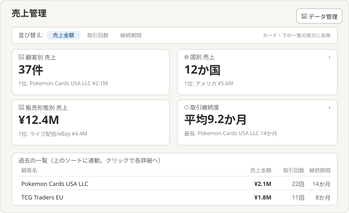
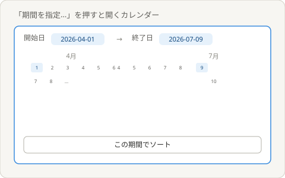
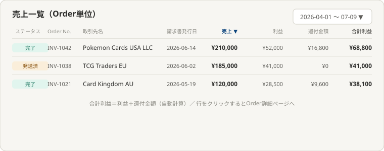
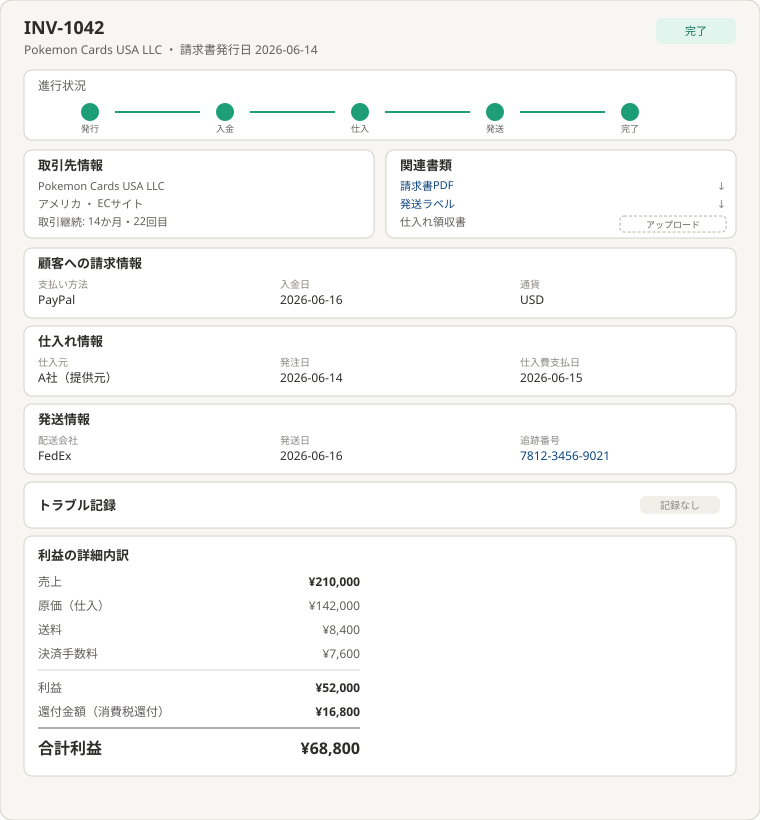
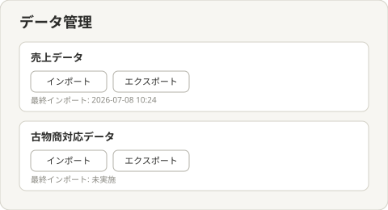

# 理想の設計図（To-Be）— 売上管理

親: [README.md](./README.md) ／ あるべき姿: [ideal-state.md](./ideal-state.md) ／ KGI: [kgi.md](./kgi.md)

本書は「既存実装を見ずに、あるべき姿だけから描いた理想」である（design-partner.md §4.5）。recon・差分設計は本書の確定後に別便で行う。各画面の項目が実際にどのテーブル・カラムから来るかはrecon調査で確認して確定する（本書ではPOが指定した項目名までを構成として確定する）。

## 0. 設計思想

トップページは大きな数字（サマリー）のみを表示し、詳細はクリック後の下層ページに委ねる二層構造とする。ダッシュボード・CRMとは異なる「売上そのもの」の分析に専念し、Orderに関する全情報を1つの詳細ページに集約する。

## 1. トップページ

構成（上から）:
- ヘッダー: タイトル、「データ管理」ボタン（売上データ・古物商対応データのインポート/エクスポートへの入口を集約）。
- 並び替え: ページ上部に設置（売上金額／取引回数／継続期間）。この並び替えはカード・下部一覧の両方に反映される。
- 4枚のサマリーカード: 顧客別売上／国別売上／販売形態別売上／取引継続度。各カードは大きな数字と1位の内訳のみを表示し、クリックするとその軸の詳細ページへ遷移する（絞り込みの入口）。
- 過去の一覧: 上部の並び替えに連動し、下層のOrder一覧への導線を兼ねる。

## 2. 期間指定カレンダー

一覧・詳細ページの「期間を指定…」を押すと開く。1か月・3か月・6か月のプルダウンに加え、始点・終点を選ぶダブルカレンダーで任意の期間を指定できる。「この期間でソート」で確定する。

## 3. 売上一覧（Order単位）

CRM的な「顧客の理解」ではなく、売上そのもの（Order実績）にフォーカスした一覧。列: ステータス／Order No.／取引先名／請求書発行日／売上／利益／還付金額／合計利益（利益＋還付金額の自動計算）。全列に並び替え（昇順・降順切替）機能を持つ。行をクリックするとOrder詳細ページへ遷移する。

## 4. Order詳細ページ

そのOrderに関する全情報が集まる1つの窓口とする。構成:
- ヘッダー: Order No.・取引先名・請求書発行日・ステータス。
- 進行状況: 発行→入金→仕入→発送→完了の5段階を可視化。
- 取引先情報: 顧客名・国・販売形態・取引継続度（何か月・何回目）。
- 関連書類: 請求書PDF・発送ラベルはダウンロード。仕入れ領収書はアップロード対応。
- 顧客への請求情報: 支払い方法・入金日・通貨。
- 仕入れ情報: 仕入元・発注日・仕入費支払日。
- 発送情報: 配送会社・発送日・追跡番号。
- トラブル記録: トラブルがあれば内容を表示（無い場合は「記録なし」）。
- 利益の詳細内訳: 売上→原価（仕入）→送料→決済手数料→利益→還付金額→合計利益、の積み上げ形式。

各項目の実データ源（テーブル・カラム）はrecon調査後に確定する（設計フェーズ送り事項）。

## 5. データ管理ページ

トップページの「データ管理」ボタンから遷移。売上データ・古物商対応データそれぞれに、独立したインポート・エクスポート操作と最終インポート日時の表示を持つ。

## 6. KGI（S1〜S9）との対応

| KGI | 本設計での実現箇所 |
|---|---|
| S1 全売上データの横断確認 | §4 Order詳細ページ（請求・仕入・発送・トラブルを集約） |
| S2 顧客別分析 | §1 顧客別カード・§3 一覧の取引先名列 |
| S3 国別分析 | §1 国別カード |
| S4 販売形態別分析 | §1 販売形態別カード |
| S5 取引継続度分析 | §1 取引継続度カード・§4 取引先情報 |
| S6 ダッシュボード/CRMと非重複 | §0設計思想・README境界節。売上実績（金額・件数）に専念し、顧客理解機能は持たない |
| S7 古物商データ インポート | §5 データ管理ページ |
| S8 古物商データ エクスポート | §5 データ管理ページ |
| S9 売上データ インポート/エクスポート | §5 データ管理ページ |

## 7. 他テーマへの申し送り

- 各画面項目の実データ源（テーブル・カラム）はrecon調査で確認して確定する（PO 2026-07-09指示）。
- 顧客管理（CRM）着手時に、S6（重複回避）の相互確認を行う。
- 受注管理（order-management）とOrder詳細ページの役割分担（本テーマは確認専念・受注管理は業務操作）を、受注管理側のdesign.mdとも突き合わせる。
