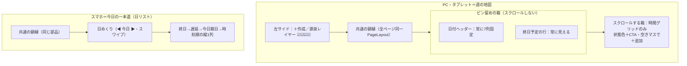

# カレンダー（schedule）— 理想形設計図（To-Be）

> この文書は何か（専門用語なしの1行）:
> カレンダー画面が最終的にどう構えていれば、あるべき姿（全予定の見える化・PC/スマホ両立）を体現できるかを、現状を見ずに定めた設計図。

- 表紙: [README.md](./README.md) ／ あるべき姿: [ideal-state.md](./ideal-state.md) ／ KGI: [kgi.md](./kgi.md) ／ 台帳: [track-record.md](./track-record.md)
- 親（あるべき姿+KGI）へのリンク: [README.md](./README.md)
- ステータス: ③To-Be確定済み・④recon前（差分designは④の後）。
- 日付: 2026-07-05 ／ PO: しんご

## 4. recon（未実施・正直な明記）

理想先行フロー（①あるべき姿→②KGI→③To-Be→④recon→⑤差分design）の③まで完了した納品。recon未実施。ただし本テーマは既に部分reconを保有する（見た目4課題の土台3主張＝btn-primaryにdisplay無し／メディア2段（≤1023→2列・≤767→1列＋時間軸非表示）／day-head-h 82px固定、file:line認証済み）。④では源泉（リード行動計画・受注期日・商品販売日）の実在と、遷移先ページ・画面幅ブレークポイントを調査対象とする。

## 5. design（To-Be）

### 設計原則3つ（この構造なら見た目4課題級のバグが存在できない）
- 原則1 測らない: 固定表示物（日付ヘッダー・終日行）はスクロール箱の外へ。stickyのオフセット数値合わせを構造から排除。→ 課題4（終日隠れ）が発生しようがない。
- 原則2 折らない: 週の列数(7)は画面幅と無関係の事実。幅で列数を変えず、7列が読めない幅では形を切り替える（週の地図→今日の一本道＝日リスト）。中間の2列・3列は持たない。→ 課題3（折り返し）が発生しようがない。
- 原則3 部品は1種類: 額縁(PageLayout)・ボタンは全画面共通の共有部品のみ（UI部品のSSOT）。→ 課題1（不統一）・課題2（アイコン傾き）が発生しようがない。

### Googleカレンダー骨格＋この製品の発明
借りる: 左の源泉レイヤー(ON/OFF)／空きマスクリックで即作成／ドラッグ移動／表示切替タブ／スマホのスケジュール表示。
発明: 色＝状態（赤遅延・黄今日期日・緑予定・灰完了）／予定は事業データ（受注・リード・商品）の「影」で、**本体と影は相互同期する（双方向）**。ただし非対称: 本体→影は自動・無条件・即時（影は原本を持たず必ず追従）／影→本体は**確認ダイアログを1枚挟んでから原本を更新**（(a)確認つき双方向・SSOT）。SSOTが守るのは「原本は1つ」であって窓口の数ではない（銀行口座とATMの関係）。

### 画面構造
図（正本）: [schedule-structure.svg](./schedule-structure.svg)（PC週の地図/スマホ日リスト/3原則）。画面イメージ: [schedule-calendar-mockup.svg](./schedule-calendar-mockup.svg)（Googleカレンダー風・7列固定/終日行固定/状態色/確認つきドラッグ/クリック追加）。本文mermaidは同内容の簡易版。
全体構図（源泉→やることフィード→3画面のSSOT）は本テーマ単独の持ち物でないため実体を持たず、dashboard の図を参照する: `docs/specs/dashboard/`（次便で配置予定）。

### スマホ操作感（Googleカレンダーアプリ準拠）
日/3日/週/月タブ・横スワイプ日送り・右下＋ボタン(FAB)・予定タップで下からシート＋CTA・長押しドラッグ→確認→原本更新。3画面はボトムナビ候補。

### KGI対応（構造のどこが満たすか）
K1=源泉レイヤーのビュー参照(コピー無)／K2=箱の分離で終日行が構造的に隠れない・日リストで全予定網羅／K3=空きマス/＋ボタンで3操作追加／K4=色＝状態(3状態必須)・源泉ステータス変更で自動反映／K5=超過・当日を最上位に色バッジ＋CTA1クリック・フィード共有(食い違い0)／K6=予定管理が本画面で完結する前提／K7=原則2で375pxでもK2〜K5成立・横スクロール0／K8=フィードから通知発火。

## 6. 弊害・トレードオフ（空欄不可）
1. 表示形の切替（週7列↔日リスト）で実装分岐が2系統になる → 中間の2列を持たない設計で分岐を最小化。
2. ドラッグで原本を書き換えるため誤操作リスク → 確認ダイアログ必須で担保((a))。
3. 境界px・遷移先は本To-Beで未確定 → ④recon後の⑤差分designで確定（推測で埋めない）。

## 7. 外部・過去事例
該当あり: Googleカレンダー（週表示＋モバイルのスケジュール表示）が「広い幅=グリッド／狭い幅=リスト」の実証例。段階的開示（トップ簡素・詳細は下層）は業務UIの標準。B2B輸出の実務では期日（発送・入金）と時差が肝で、源泉由来の期日を影として映す設計がこれに応える。

## 8. 受入基準（各基準に検証方法）
| 基準 | 検証方法 |
|---|---|
| 幅1280/1024/768で7列・折り返し行0 | 実機DevTools実測（⑤便のKPI P1） |
| 幅375/767で日リスト・横スクロール0px | 同 P2 |
| 縦スクロール中に終日行が隠れる量0px | 同 P3 |
| ＋作成アイコンの縦中央差0px | 同 P4 |
| 既存機能（表示・作成・縦スクロール）非破壊 | PO実機 P5 |

## 9. 維持の仕組み
- 守り手1: schedule のレイアウト・部品に触るPRは設計docで本To-Be 3原則との整合を宣言（原則違反＝差し戻し）。process-artifacts gate が設計doc存在を検査。
- 守り手2: 図(mermaid)と本文の不一致は欠陥として扱う。
- 守り手3: ideal-state.md はPOのみ改訂可。
