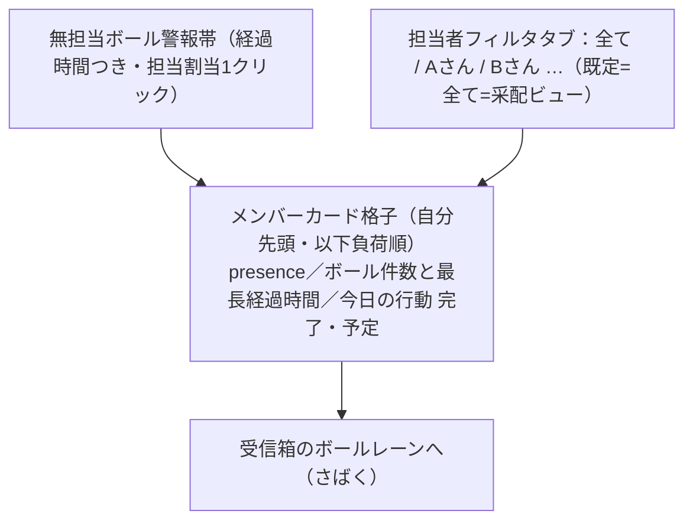

# チームボード（team-board）— 理想形設計図（To-Be）

> この文書は何か（専門用語なしの1行）:
> テキスト商談時代の「営業現場の壁ボード」。チームが今どう動いているかを"ボールの所在"で見える化し、返信までを最短にする采配台の設計図。現状を見ずに定めた。

- 表紙: [README.md](./README.md) ／ あるべき姿: [ideal-state.md](./ideal-state.md) ／ KGI: [kgi.md](./kgi.md) ／ 台帳: [track-record.md](./track-record.md)
- ステータス: ③To-Be確定済み・④recon前（差分designは④の後）。
- 日付: 2026-07-07 ／ PO: しんご

## 4. recon（未実施・正直な明記）

理想先行フロー（①→②→③→④→⑤）の③まで完了。recon未実施。④では、ボールの原本＝受信箱（conversation_logs）の構造、presence（対応中）を導出できる操作ログの有無、担当割当を保持する場所、今日の行動量（dashboard D10）との接続点、リアルタイム更新の実装方式を調査対象とする。B2B輸出／プラットフォーム物販の実務（テキストで多言語商談・時差・返信都度対応）を前提に具体化する。

## 5. design（To-Be）

### 中核概念：ボールの所在（時間割の代替）
オフライン営業の「15時から商談」に相当する管理単位がテキスト商談には無い。代替が"ボール"。自分ボール=受信済みでこちらが返すべき（=今やること）／相手ボール=返信済みで待ち／無担当ボール=誰のコートにも無い受信（機会損失の正体）。物差しは時刻でなく経過時間。ボールの原本は受信箱（新規入力ゼロ・SSOT）。

### 3層の役割（フル機能は1箇所・他は最小）
- チームボード＝采配台（無担当割当・負荷把握・个へ飛ぶ）
- 受信箱＝作業場（ボールレーン＋さばきモードで実際に返す＝フル機能）
- ダッシュボード＝件数＋最古経過時間の1行バッジのみ（情報過多を構造で回避）

### 画面構造（采配台）
図（正本）: [team-board-layout.svg](./team-board-layout.svg)。全体構図（源泉→フィード→3画面）は dashboard の [architecture-feed-ssot.svg](../dashboard/architecture-feed-ssot.svg) を参照（図の実体は dashboard 単一配置）。

### ボールさばきの最短化（全部システム・決定論。AI文章生成は不採用）
- ボールレーン: 自分ボールを経過時間順の1列・最古先頭（並べ替えの判断をさせない）。
- さばきモード: 送信→操作ゼロで次の最古ボールへ自動遷移（ボール間の手動探索0＝保持時間の隠れ主因を潰す）。
- 差し込み定型: 型ボール（在庫・価格・送料・追跡）に定型文＋DB値を機械挿入（在庫表・商品マスタ・送料マスタ）。事実の創作0・根拠チップ表示。型に嵌まらないボールは下書きなしが正（無駄生成0）。型判定はキーワードルール。
- **AIによる顧客向け文章生成・商談提案の文章化は不採用（PO決定 2026-07-07）**。AIは将来「翻訳・分類・抽出」を候補として保留（顧客向け生成はしない・検証可能な用途のみ）。

### 担当者フィルタタブ
「全て」=采配ビュー（全員格子＋無担当警報）／個人タブ「Aさん」=その人の1日タイムライン（さばき数推移・平均保持時間・行動 完了/予定・手すき時間帯）。同一データの絞り込み（食い違い0）。個人タブでも無担当警報バッジはタブ見出しに残す（機会損失を隠さない）。既定は常に「全て」。時間レンズ「今日｜今週」とは別行（2種のタブは直交）。

### KGI対応（構造のどこが満たすか）
T1=presence/ボール件数・最長経過/今日の行動をゼロ操作表示・受信箱と同一源泉（食い違い0・手動更新0）／T2=無担当ボールを経過時間つき必須表示・担当割当1クリック／T3=全項目から受信箱の該当会話へ1クリック直行／T4=PC/スマホ両幅でT1〜T3成立・横スクロール0／T5=レーン＋さばきモード＋差し込み定型（AI生成非依存）でボール保持時間を最短化。

## 6. 弊害・トレードオフ（空欄不可）
1. presence（対応中）を手動入力にすると誰も更新せず形骸化 → 受信箱の操作ログから自動導出（手動ステータス不採用）。導出方式は④reconで確定。
2. さばきモードの自動遷移が「返信を急がせる」圧になり得る → 経過時間は表示するが閾値warningは運用後にPO設定・獲得表示と併用（他テーマの希望維持方針と整合）。ON/OFF可否は⑤で検討。
3. 差し込み定型がDB不整合時に誤った事実を出す危険 → DBが正である前提（SSOT）に依存。在庫・価格の鮮度は源泉テーマの責務として明記。

## 7. 外部・過去事例
過去（社内）: 守り（weekly-advisor-defensive）のルールベース検知が本番実在＝ボール滞留検知の下地。外部: カスタマーサポートの「1件返信→次の最古チケットへ」動線（ヘルプデスクの定石）がさばきモードの発想源。B2B輸出/プラットフォーム物販では返信速度が受注率に直結し、無担当放置が最大の機会損失。

## 8. 受入基準（各基準に検証方法）
| 基準 | 検証方法 |
|---|---|
| 各メンバーのpresence・ボール件数・最長経過・今日の行動がゼロ操作で見える | 実機・受信箱データと突合（食い違い0） |
| 無担当ボールが経過時間つきで必ず表示・担当割当1クリック | 無担当会話を作り実機確認 |
| 全項目から受信箱該当会話へ1クリック・行き止まり0 | 全要素の遷移巡回 |
| PC/スマホ両幅でT1〜T3成立・横スクロール0 | 1280/375px実機 |
| 自分ボールが経過時間順1列・送信後ゼロ操作で次へ | さばきモード実機・保持時間計測 |

## 9. 維持の仕組み
- 守り手1: team-board に触るPRは設計docで本To-Beの「新規入力ゼロ・ボール原本は受信箱」「フル機能は受信箱・他は最小表示」との整合を宣言（違反=差し戻し）。process-artifacts gate が設計doc存在を検査。
- 守り手2: 図（team-board-layout.svg / mermaid）と本文の不一致は欠陥。全体構図は dashboard 実体を参照（重複配置しない＝図のSSOT）。
- 守り手3: ideal-state.md はPOのみ改訂可。AI文章生成不採用の決定は本To-Beに固定し、覆す場合はPO明示決定を要する。
